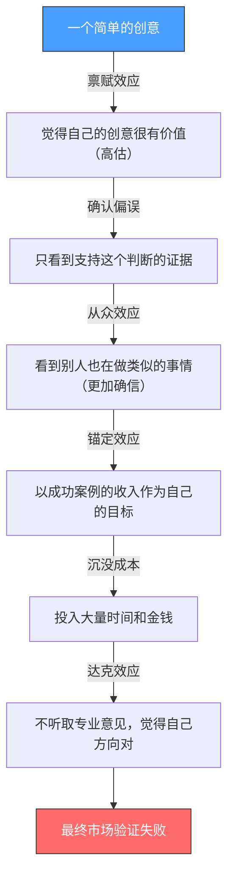
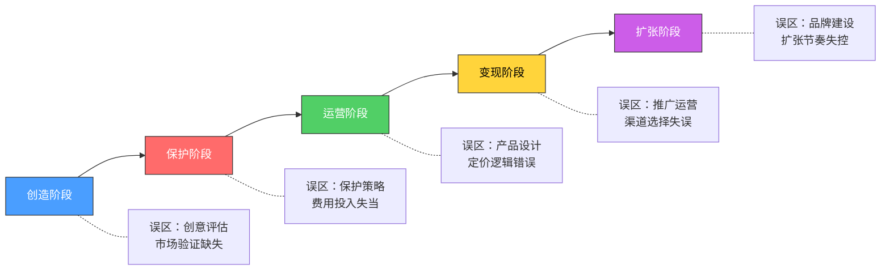
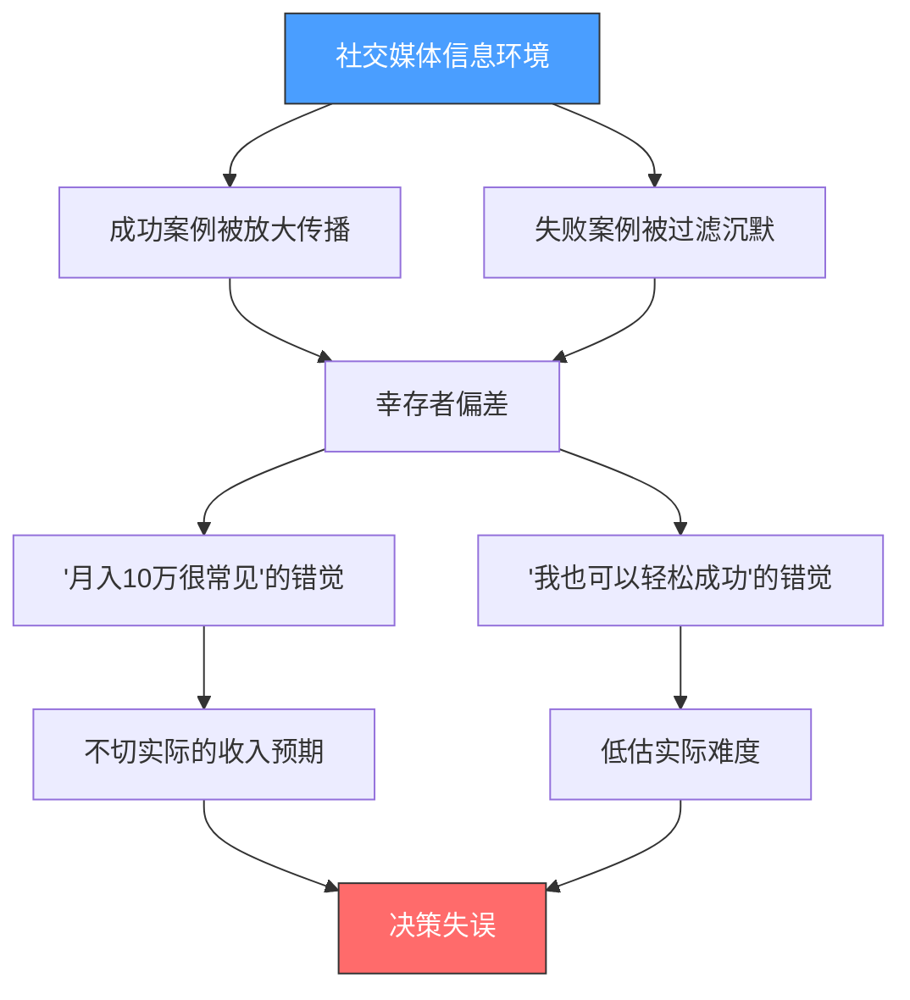
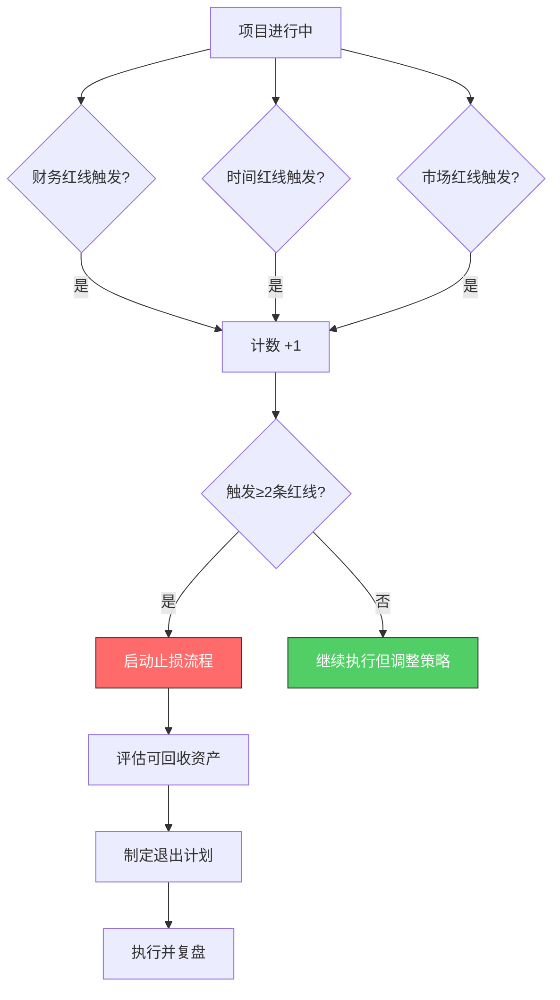
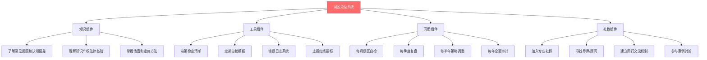

## 九、知识产权变现的常见误区

### 1. 为什么研究误区比研究方法更重要

在知识产权变现领域，一个普遍的现象是：**失败的原因高度集中，成功的原因各不相同。** 分析数百个失败案例后可以发现，超过80%的失败可以归因于不到20个核心误区。这意味着，只要避开这些误区，即使你的方法不够完美，也能大幅提高成功率。

从博弈论的角度看，知识产权变现是一场"不对称博弈"：

- **信息不对称**：你对自己的创意了解最多，但对市场需求、法律风险、竞争对手的信息掌握不足。
- **能力不对称**：创造能力、法律能力、商业运营能力往往分布在不同人身上，很少有人三者兼备。
- **认知不对称**：你对"知识产权价值"的主观判断，与市场对它的客观定价之间，往往存在巨大偏差。

误区的本质，就是在这些不对称条件下做出的系统性错误决策。

### 2. 误区产生的认知科学分析

知识产权变现中的误区并非随机产生，它们根植于人类的认知机制。理解这些机制，才能从根本上避免犯错。

#### 2.1 与知识产权变现相关的七种认知偏差

**一、禀赋效应（Endowment Effect）**

人们对自己拥有的东西赋予过高的价值。在知识产权领域，这表现为发明人高估自己的专利价值、创作者高估自己的课程价值、品牌方高估自己的商标影响力。

经典实验：行为经济学家丹·艾瑞里（Dan Ariely）的实验表明，人们对"自己拥有的物品"的估价通常是"非拥有者"的2-3倍。在知识产权领域，这个倍数可能更高，因为创意本身就带有强烈的情感投入。

**实际影响**：

| 场景 | 禀赋效应导致的错误 | 理性决策 |
|------|-------------------|---------|
| 专利授权谈判 | 坚持高价，错失多个潜在被许可方 | 根据市场可比案例定价 |
| 课程定价 | 觉得自己花了100小时所以值5000元 | 基于用户获得的价值定价 |
| 商标转让 | "我的品牌值100万" | 参考品牌评估机构的估值 |
| 软件授权 | 拒绝合理的低价批量授权 | 计算边际成本与边际收益 |

**二、确认偏误（Confirmation Bias）**

人们倾向于寻找支持自己已有观点的信息，忽略相反的证据。在知识产权变现中，这表现为：

- 只看到成功案例（幸存者偏差），忽略大量失败案例
- 只听取支持自己判断的意见，过滤掉风险警告
- 在专利检索时，只关注"没有完全相同的"，忽略"高度相似的"
- 在市场调研时，只收集正面反馈，忽略用户的犹豫和拒绝

**三、锚定效应（Anchoring Effect）**

人们在做决策时过度依赖第一个接触到的信息。在知识产权变现中的典型表现：

- **收入锚定**：看到某IP年入1000万，就认为自己做类似的事情也能达到这个量级
- **成本锚定**：第一份工作的薪资成为后续所有收入预期的基准
- **平台锚定**：某个平台的定价标准成为所有平台的参照，忽略不同平台的用户付费能力差异
- **案例锚定**：某个成功案例的路径成为唯一的"正确路径"

**四、沉没成本谬误（Sunk Cost Fallacy）**

已经投入的成本不应该影响未来的决策，但在实际中人们总是被"已经花了这么多"绑架。

在知识产权变现中的典型场景：

- 花了20万研发的专利，市场已经不需要了，但不愿意放弃，继续投入年费维护
- 录了30小时的课程，发现定位错误，但舍不得重做，硬着头皮上线
- 注册了50个商标类别，大部分没有使用，但不愿意放弃续展
- 投入了一年时间运营的IP方向，数据显示没有前景，但因为"已经投入这么多"而继续

**五、从众效应（Bandwagon Effect）**

看到别人都在做某件事，就认为这件事一定是对的。在知识产权领域的表现：

- 看到别人做知识付费赚钱，就盲目跟风，不评估自己是否适合
- 看到某个热门技术方向的专利数量暴增，就认为自己的专利也应该在这个方向
- 看到某个平台用户量大，就认为这个平台一定适合自己
- 看到某个定价策略被广泛使用，就认为这是唯一正确的定价方式

**六、达克效应（Dunning-Kruger Effect）**

能力不足的人往往高估自己的能力，而能力较强的人反而容易低估自己。在知识产权变现中：

- 初学者高估自己作品的市场价值，不愿意接受专业意见
- 初学者低估法律风险，觉得"不就是申请个专利嘛"
- 专家过度谨慎，明明有很好的创意却迟迟不行动
- 专家过度追求完美，把大量时间花在微小的改进上

**七、可得性偏差（Availability Bias）**

人们倾向于根据最容易想到的信息来做判断，而非基于完整的数据。在知识产权变现中的表现：

- 媒体报道的"天价专利赔偿案"让人对维权收入产生不切实际的期望
- 身边朋友的失败经历让人对整个领域产生恐惧
- 最近一次的失败经历让人放弃整个方向
- "一夜暴富"的故事让人忽略长期积累的重要性

#### 2.2 认知偏差的叠加效应

在实际决策中，这些认知偏差往往不是单独起作用，而是相互叠加、相互强化，形成"认知偏差链"。



这个链条揭示了一个残酷的现实：**很多知识产权变现的失败，不是因为能力不足，而是因为认知偏差导致了一系列错误决策的连锁反应。**

### 3. 知识产权变现误区的系统分类

基于对大量案例的分析，知识产权变现中的误区可以按照**发生阶段**和**错误类型**两个维度进行系统分类。

#### 3.1 按发生阶段分类



| 阶段 | 典型误区 | 根本原因 | 潜在损失 |
|------|---------|---------|---------|
| **创造阶段** | 低估或高估创意价值；不做市场验证就投入开发 | 禀赋效应+达克效应 | 时间和机会成本 |
| **保护阶段** | 不申请/申请过多；选错保护类型；忽略维护 | 沉没成本+可得性偏差 | 法律保护缺失或资源浪费 |
| **运营阶段** | 课程注水/过于简略；定价凭感觉；忽略用户需求 | 锚定效应+确认偏误 | 产品失败、口碑受损 |
| **变现阶段** | 过度依赖单一平台；不做推广；急于变现 | 从众效应+短期主义 | 收入不稳定、用户流失 |
| **扩张阶段** | 盲目多元化；品牌过度延伸；忽视质量 | 禀赋效应+过度自信 | 品牌稀释、核心竞争力丧失 |

#### 3.2 按错误类型分类

**第一类：认知性误区——"想错了"**

这类误区源于对知识产权变现本质的错误理解。

| 误区 | 错误认知 | 正确认知 | 纠正方法 |
|------|---------|---------|---------|
| 知识产权=专利 | 只有发明专利才算知识产权 | 版权、商标、商业秘密都是知识产权 | 建立完整的知识产权认知框架 |
| 变现=卖断 | 只能一次性卖掉 | 授权、许可、质押都是变现方式 | 学习多元化变现模式 |
| 保护=诉讼 | 保护就是打官司 | 预防、监控、谈判、投诉都是保护手段 | 建立分层防护体系 |
| 价值=成本 | 花了多少就值多少 | 价值取决于市场需求和稀缺性 | 学习知识产权估值方法 |
| 个人做不了 | 这是大公司的事情 | 个人有很多低门槛的变现路径 | 从小做起，逐步积累 |

**第二类：策略性误区——"方向错了"**

这类误区源于在关键决策点上选错了方向。

- **保护类型选错**：用版权保护功能性的技术方案，或者用专利保护纯粹的美术设计
- **市场定位错误**：在竞争最激烈的红海市场与头部玩家正面竞争
- **定价策略错误**：成本导向定价而非价值导向定价
- **平台选择错误**：在用户画像不匹配的平台上投入大量资源
- **变现时机错误**：过早变现损害信任，或过晚变现错失窗口

**第三类：执行性误区——"做错了"**

这类误区源于知道方向但执行走样。

- **申请文件质量差**：权利要求书撰写不当，保护范围过窄或无效
- **合同条款不严谨**：授权协议缺少关键条款，留下法律隐患
- **推广方式不当**：内容质量好但推广策略不匹配目标用户
- **用户运营缺失**：卖完产品就不管了，不做用户维护和复购引导
- **数据驱动缺失**：凭感觉决策，不看数据、不分析反馈

### 4. 误区严重性评估模型

并非所有误区的后果都相同。为了帮助读者建立优先级意识，我们设计了一个"误区严重性评估模型"，从四个维度对误区进行量化评估：

```text
误区严重性 = 发生概率 × 损失程度 × 不可逆性 × 隐蔽程度
```

| 评估维度 | 1分（低） | 3分（中） | 5分（高） |
|----------|----------|----------|----------|
| **发生概率** | 少数人会犯 | 相当比例的人会犯 | 大多数人都会犯 |
| **损失程度** | 损失少量时间和金钱 | 损失重要机会或中等金额 | 损失核心资产或大额资金 |
| **不可逆性** | 容易纠正，损失可恢复 | 需要较大代价纠正 | 无法恢复，永久损失 |
| **隐蔽程度** | 容易察觉 | 需要经验才能发现 | 很难自我发现 |

**评估结果分级**：

| 等级 | 综合得分 | 处理策略 |
|------|---------|---------|
| 🔴 致命级 | 80分以上 | 必须在行动前建立防范机制 |
| 🟠 严重级 | 50-79分 | 需要定期自检，发现即纠正 |
| 🟡 注意级 | 25-49分 | 了解即可，遇到时能识别 |
| 🟢 轻微级 | 25分以下 | 知道存在，不需特别防范 |

**按此模型评估的前五大致命误区**：

| 排名 | 误区 | 得分 | 为什么致命 |
|------|------|------|-----------|
| 1 | 不做市场验证就投入开发 | 92分 | 发生率极高（>70%），损失大（数月时间+资金），不可逆（时间无法回收），隐蔽（开发过程中才逐渐发现） |
| 2 | 知识产权保护缺失 | 88分 | 发生率高（>60%），损失可能极大（创意被抄袭），部分不可逆（错过申请窗口），隐蔽（不被侵权就不知道缺失） |
| 3 | 定价凭感觉而非数据 | 85分 | 发生率极高（>80%），损失持续且累积，隐蔽（不知道本可以赚更多） |
| 4 | 过度依赖单一收入渠道 | 82分 | 发生率高（>65%），损失可能突然且巨大（平台政策变化），隐蔽（在危机到来前一切正常） |
| 5 | 忽视用户反馈和迭代 | 80分 | 发生率中等（>50%），损失渐进但累积，隐蔽（满意度缓慢下降不易察觉） |

### 5. 误区形成的市场环境因素

误区不仅仅是个人认知问题，市场环境也会系统性地"制造"误区。

#### 5.1 信息不对称催生的误区

知识产权市场存在严重的信息不对称，这直接催生了多种误区：

**供给侧信息不对称**：创作者不了解市场真实需求。
- 很多创作者基于自己的兴趣和判断来开发产品，而不是基于市场数据
- 结果是做出"自认为有价值"但"市场不买单"的产品
- 典型案例：技术专家花半年写了一本深度技术书籍，但目标读者群体太小，销量惨淡

**需求侧信息不对称**：消费者无法在购买前评估知识产品的质量。
- 课程的好坏在学完之前很难判断，这导致消费者倾向于选择低价或免费内容
- 创作者为了吸引消费者，不得不在营销上投入过多精力，甚至夸大宣传
- 这又反过来加剧了"知识付费是割韭菜"的偏见

**法律信息不对称**：大多数人对知识产权法律了解不足。
- 不知道自己拥有哪些权利
- 不知道如何低成本保护自己的权利
- 不知道侵权行为如何界定和追责
- 容易被不专业的代理机构误导

#### 5.2 平台经济塑造的认知陷阱

知识付费平台的商业模式本身也在塑造一些不利于创作者的认知：

| 平台机制 | 塑造的认知 | 实际真相 |
|----------|-----------|---------|
| 流量推荐算法 | "爆款"才是成功 | 长尾、细分市场同样可以持续盈利 |
| 排行榜/畅销榜 | 只有头部才能生存 | 大量中小创作者在细分领域活得不错 |
| 低价促销机制 | 价格越低越好卖 | 低价可能损害品牌定位和利润空间 |
| 用户评价系统 | 差评就是灾难 | 合理的差评处理反而展示专业态度 |
| 平台分成模式 | 平台抽成太高不赚钱 | 平台带来的流量价值可能远超分成成本 |

#### 5.3 社交媒体放大效应

社交媒体对知识产权变现的认知产生了显著的"幸存者偏差"放大效应：

- 成功案例被大量传播，失败案例无人问津
- "月入十万"的故事获得更多关注，"月入三千"的常态被忽视
- 创造了"别人都很成功，只有我不行"的错觉
- 导致两种极端：要么过度乐观盲目入场，要么过度悲观不敢尝试



### 6. 误区自检框架：三层防御体系

理解了误区的成因和分类之后，关键是如何在实际操作中避免它们。我们提出一个"三层防御体系"：

#### 6.1 第一层：决策前防御——预设检查清单

在做出任何重要决策之前，强制自己回答以下问题：

**知识产权创造决策检查清单**：

- [ ] 我是否做了独立的市场调研（而非仅凭直觉）？
- [ ] 我是否咨询过至少一个该领域的专业人士？
- [ ] 我是否考虑过这个决策的最坏结果？
- [ ] 我是否被沉没成本影响了判断？
- [ ] 我是否只看到了支持我观点的证据？

**知识产权保护决策检查清单**：

- [ ] 我是否清楚自己的知识产权属于哪种类型？
- [ ] 我是否了解不同保护方式的成本和效果？
- [ ] 我是否考虑了竞争对手可能的反应？
- [ ] 我是否设置了保护策略的定期复审机制？

**商业变现决策检查清单**：

- [ ] 我的定价依据是什么（成本/竞品/价值）？
- [ ] 我的目标用户画像是否清晰？
- [ ] 我是否在多个渠道进行了测试？
- [ ] 我是否设置了明确的止损线和评估指标？

#### 6.2 第二层：执行中防御——定期自检机制

即使决策正确，执行过程中也可能逐渐偏离。建议每月进行一次"误区自检"：

| 自检维度 | 自检问题 | 警示信号 |
|----------|---------|---------|
| 认知健康 | 我最近是否只听到了好消息？ | 没有任何负面反馈 → 可能存在信息茧房 |
| 投入产出 | 我的时间和金钱投入是否获得了正回报？ | 连续3个月无正回报 → 需要重新评估方向 |
| 用户反馈 | 我是否认真对待了负面反馈？ | 忽略或抵触负面反馈 → 确认偏误 |
| 市场变化 | 市场环境是否发生了重大变化？ | 沿用6个月前的策略 → 可能已过时 |
| 资源分配 | 我是否过度集中在单一渠道/产品？ | >70%收入来自单一来源 → 过度依赖风险 |

#### 6.3 第三层：复盘后防御——建立错误日志

每次犯错后，记录以下信息，建立个人的"误区案例库"：

```markdown
## 错误记录模板

### 日期：YYYY-MM-DD
### 错误描述：[简述发生了什么]
### 根本原因：[为什么犯了这个错误？是哪种认知偏差？]
### 损失评估：[时间/金钱/机会损失]
### 纠正措施：[采取了什么补救措施]
### 防范机制：[如何避免再次犯同样的错误]
### 相关误区编号：[对应本章的误区编号]
```

**为什么错误日志有效**：

1. **外化认知**：把思维过程写下来，迫使你面对自己的推理逻辑，减少自我欺骗的空间
2. **模式识别**：积累足够多的记录后，你会发现自己的错误模式——"我总是高估市场容量"或"我总是低估法律风险"
3. **量化改进**：错误的频率和类型可以量化追踪，让你看到自己是否在进步
4. **团队共享**：如果是团队运营，错误日志可以帮助团队成员避免重复犯错

### 7. 从误区到认知升级：元认知能力培养

避免误区的最高境界不是记住每个误区，而是培养"元认知"能力——对自己思维过程的觉察和反思能力。

#### 7.1 元认知在知识产权变现中的应用

| 元认知能力 | 具体应用 | 训练方法 |
|-----------|---------|---------|
| **自我觉察** | 意识到自己正在受某种认知偏差影响 | 每次做决策前暂停30秒，问自己"我可能犯了什么错" |
| **视角切换** | 从用户/竞争对手/投资人的角度看问题 | 强制自己写出反对意见的3个理由 |
| **概率思维** | 用概率而非确定性来评估结果 | 为每个重要决策估计成功率，记录实际结果，校准判断 |
| **反馈循环** | 建立快速反馈-调整的机制 | 缩短决策-验证的周期，不要"一锤子买卖" |
| **逆向思维** | 先想"怎样会失败"，再想"怎样能成功" | 预先写出"失败剧本"，然后逐一防范 |

#### 7.2 查理·芒格的"误判心理学"在知识产权领域的应用

查理·芒格在《穷查理宝典》中总结了25种人类误判心理倾向。其中与知识产权变现最相关的包括：

1. **奖励和惩罚超级反应倾向**：如果你的收入结构鼓励短期变现，你就会倾向于短期行为。解法：设计长期导向的收入结构。
2. **简单联想误判倾向**：因为某个课程在A平台卖得好，就认为在B平台也一定卖得好。解法：每个新场景都要独立评估。
3. **被剥夺超级反应倾向**：已经拥有的知识产权（哪怕是低价值的）被放弃时，会产生强烈的抵触情绪。解法：定期评估资产组合，勇于止损。
4. **压力影响倾向**：财务压力下容易做出短视决策（如贱卖专利、过度营销）。解法：建立应急资金，减少压力对决策的干扰。
5. **权威-错误影响倾向**：盲目相信"行业专家"或"成功人士"的建议，不做独立判断。解法：任何建议都要经过自己的验证。

### 8. 不同人群的误区分布特征

不同类型的知识IP从业者，面临的误区分布有显著差异。

#### 8.1 技术型从业者（程序员、工程师、科研人员）

**高频误区**：
- 过度追求技术完美，忽略市场需求验证（达克效应+完美主义）
- 低估商业化运营的难度，认为"好技术自然有人用"（技术至上偏见）
- 在专利撰写上过度依赖代理机构，自己不了解保护范围（能力外包陷阱）
- 忽略品牌建设，认为"技术实力就是品牌"（技术与品牌的混淆）

**低频误区**：
- 知识付费是割韭菜（技术人通常认可知识的价值）
- 不做保护就发布（技术人通常有基本的产权意识）

#### 8.2 内容型从业者（自媒体人、写作者、教师）

**高频误区**：
- 内容好就能卖得好（酒香不怕巷子深的执念）
- 课程越长越值钱（把"全面"等同于"有价值"）
- 免费内容会抢付费市场（对免费-付费漏斗缺乏理解）
- 追热点而非深耕（注意力经济的诱惑）

**低频误区**：
- 申请专利太贵（内容创作者通常不以专利为主）
- 知识产权只适合大公司（内容创作者通常已知个人可做）

#### 8.3 品牌型从业者（创业者、设计师、个人品牌经营者）

**高频误区**：
- 商标注册了就万事大忽（注册后的持续管理被忽视）
- 照搬成功品牌模式（忽略隐性条件的不可复制性）
- 短期变现优先于品牌建设（现金流压力导致短视）
- 品牌过度延伸，什么都想做（禀赋效应导致过度自信）

**低频误区**：
- 版权不需要登记（品牌经营者通常重视商标但可能忽略版权）
- 课程越长越好（品牌经营者的变现方式更多元）

### 9. 误区纠正的成本-收益分析

纠正误区是有成本的（时间、金钱、机会成本）。何时值得纠正，何时应该止损转向，需要理性的成本-收益分析。

#### 9.1 误区纠正的决策矩阵

| 场景 | 纠正成本 | 不纠正的损失 | 决策建议 |
|------|---------|-------------|---------|
| 发现定价过低 | 低（调整价格即可） | 持续的收入损失 | **立即纠正** |
| 发现保护类型选错 | 中（可能需要重新申请） | 保护力度不足 | **尽快纠正** |
| 发现市场定位错误 | 高（需要重新调研和调整） | 产品竞争力不足 | **评估后决定** |
| 发现整个方向错误 | 极高（沉没成本巨大） | 持续投入无回报 | **果断止损** |
| 发现平台选择不当 | 低-中（迁移成本） | 流量和收入受限 | **渐进迁移** |

#### 9.2 止损决策的"三条红线"

当以下三条红线中的任意两条被触发时，应该果断止损：

1. **财务红线**：累计投入超过预算的150%，且收入未达到投入的30%
2. **时间红线**：项目延期超过原计划的100%，且核心里程碑未完成
3. **市场红线**：目标用户调研中，愿意付费的比例低于10%



### 10. 知识产权变现误区的国际比较

不同国家和地区的知识产权环境不同，误区的分布也有差异。

| 维度 | 中国市场特点 | 对误区的影响 |
|------|------------|-------------|
| **法律体系** | 知识产权法律快速完善中，但执行力度参差不齐 | 容易产生"保护没用"或"保护万能"的极端认知 |
| **市场规模** | 用户基数大，但付费意愿仍在培育中 | 容易高估市场容量，低估转化难度 |
| **平台生态** | 平台众多且竞争激烈，流量成本上升 | 容易产生平台依赖，忽视私域建设 |
| **文化因素** | 对"知识付费"的接受度存在代际和地域差异 | 定价和推广策略需要考虑文化适配 |
| **政策环境** | 政府鼓励创新创业，有多种补贴和减免政策 | 很多人不了解这些政策红利，错失降低成本的机会 |

**中国特色的三个高频误区**：

1. **政策红利误区**：不知道或不申请政府的知识产权补贴、费用减免、税收优惠等政策
2. **平台红利误区**：过度依赖某一平台的流量红利，红利消退后陷入困境
3. **低价竞争误区**：在价格战中牺牲质量，最终损害整个品类的信誉

### 11. 建立个人的"误区免疫系统"

最终目标不是记住所有误区，而是建立一套自动运行的"误区免疫系统"。

**这个系统的四个组件**：



**关键原则**：误区免疫不是一次性的事情，而是持续的过程。市场在变、技术在变、法律在变，新的误区会不断出现。保持学习、保持警觉、保持反思，才是长期制胜之道。

---

> **本节心法**：误区的本质不是"不知道正确答案"，而是"不知道自己正在犯错"。培养元认知能力——对自己思维过程的觉察和反思——是避免所有误区的根本方法。在知识产权变现的道路上，最危险的不是犯错，而是不知道自己在犯错。
