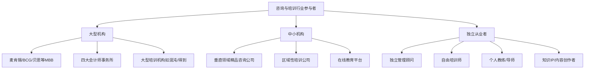
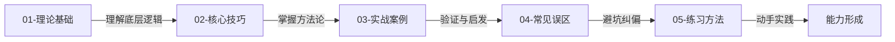

# 第二十三章 咨询与培训变现

## 章节定位

咨询与培训，是知识经济时代最具杠杆效应的变现方式之一。你不需要囤货、不需要物流、不需要庞大的团队——你只需要一个大脑、一套方法论，以及将复杂问题简单化的能力。

但这并不意味着它"简单"。恰恰相反，咨询与培训是所有变现方式中对**个人综合能力要求最高**的赛道：你需要行业洞察力来诊断问题，结构化思维来设计方案，沟通感染力来传递价值，项目管理能力来保证交付，以及持续学习能力来保持竞争力。本章将系统拆解咨询与培训行业的商业模式、实操技巧和真实案例，帮助你从零开始搭建属于自己的知识变现体系。

---

## 为什么咨询与培训是"搞钱"的高级形态？

在所有变现方式中，咨询与培训有几个独特优势，使它成为高段位玩家的首选：

### 第一，边际成本趋近于零

你花100小时研究出一套方法论，之后每服务一个客户，增加的成本几乎为零。卖产品需要生产成本，卖时间需要你本人到场，但卖知识和方法论，可以无限复制。一个培训师开发完一门课程后，讲第一次和讲第一百次的成本差异极小，但收入是100倍的关系。

### 第二，单价天花板极高

一个顶级管理咨询顾问的日费可以达到5万-10万元，一场企业培训的报价可以达到20万-50万元。麦肯锡一个战略项目的起步价通常在500万元以上。这种单价水平，在其他变现方式中极为罕见——电商需要卖出数万件商品才能达到同等收入。

### 第三，复利效应显著

你服务的客户越多，案例越丰富，口碑越响亮，你的定价能力就越强。这是一个典型的"越老越值钱"的行业。一个从业15年的咨询顾问，收费可以是新人的10-20倍，而他的实际工作强度可能更低。知识和经验的积累就是你的"护城河"。

### 第四，时间自由度高

一旦建立起品牌和获客体系，你可以自主选择服务多少客户、什么时间工作、在哪里工作。很多独立咨询顾问每年只工作6-8个月，收入却超过全职时期。培训师可以集中在周末和假期授课，工作日自由安排。

### 第五，抗AI替代能力强

在AI时代，很多标准化工作正在被替代，但咨询与培训的核心价值——**理解客户的隐性需求、建立信任关系、提供定制化解决方案、引导组织变革**——这些是AI短期内无法替代的。相反，善用AI的咨询顾问可以大幅提高效率，扩大服务半径。

---

## 咨询与培训行业的市场全景

在进入具体内容之前，先了解一下这个行业的整体面貌：

### 市场规模与增速

| 细分市场 | 中国市场规模（2025年） | 年增速 | 主要驱动因素 |
|----------|------------------------|--------|-------------|
| 管理咨询 | 约3000亿元 | 8%-12% | 企业数字化转型、战略升级 |
| 企业培训 | 约6000亿元 | 10%-15% | 人才发展需求、合规培训 |
| 个人教练（Coaching） | 约200亿元 | 20%-30% | 个人成长意识觉醒 |
| 在线知识付费 | 约800亿元 | 15%-25% | 终身学习趋势、移动端普及 |
| 专业服务（法律/财务/IT） | 约5000亿元 | 6%-10% | 法规复杂化、技术迭代 |

### 行业参与者画像



**本章重点服务的是第三类——独立从业者和小型团队。** 这是大多数普通人进入咨询与培训行业的切入点，也是杠杆效应最大的路径。

---

## 本章内容地图

本章分为五个小节，按照**道→法→术→器→练**的逻辑层层递进：



### 各小节详解

| 小节 | 主题 | 核心问题 | 关键内容 | 阅读建议 |
|------|------|----------|----------|----------|
| 01-理论基础 | 咨询行业商业模式 | 咨询行业靠什么赚钱？有哪些商业模式？ | 行业本质三层论、三大收费模式、培训四大路径、教练服务、关键经济学概念 | 必读，建立全局认知 |
| 02-核心技巧 | 业务搭建实操 | 如何从零开始搭建咨询/培训业务？ | 五步法（定位→背书→获客→定价→交付）、培训课程设计、专业壁垒构建、时间管理、个人品牌 | 重点阅读，边读边做笔记 |
| 03-实战案例 | 成功案例拆解 | 别人是怎么做到年入百万的？ | 7个真实案例（HR转咨询、工程师转顾问、宝妈转教练、讲师转IP、餐饮转咨询、自媒体转咨询、培训师IP打造） | 快速浏览，找到与自己最相似的案例深入读 |
| 04-常见误区 | 避坑指南 | 咨询培训行业有哪些常见的"坑"？ | 定位误区、获客误区、定价误区、交付误区、心态误区 | 必读，避免重蹈覆辙 |
| 05-练习方法 | 实战练习 | 如何一步步培养咨询/培训能力？ | 分阶段练习计划、关键技能训练方法、里程碑检验 | 边读边练，不要只是"看看" |

---

## 学完本章你能获得什么？

### 认知层面

1. **清晰的商业模式认知**——理解按小时、按项目、按成果三种收费模式的区别、优劣与适用场景，知道自己当前阶段该选哪种
2. **行业全景视角**——了解咨询与培训行业的市场规模、竞争格局和发展趋势，明确自己在这个行业中的位置
3. **价值创造的底层逻辑**——理解咨询行业卖的不是建议而是"认知差"和"执行差"，知道如何持续提升自己的价值密度

### 能力层面

4. **完整的业务搭建框架**——从定位、获客、定价到交付的全流程方法论，每个环节都有具体的步骤和工具
5. **课程设计能力**——掌握"三三制"课程设计原则和柯氏四级评估模型，能设计出企业认可的培训课程
6. **避坑能力**——识别咨询培训行业20+个常见误区，少走至少1-2年弯路

### 行动层面

7. **可执行的行动计划**——通过练习模块，迈出咨询/培训变现的第一步，30天内完成初步定位和第一个产品原型
8. **案例启发库**——7个真实案例覆盖"职场人→咨询顾问"的主要转型路径，总有一条适合你

---

## 学习路径建议

不同背景的读者，建议采用不同的学习策略：

### 路径A：零基础入门（从未接触过咨询培训）

```text
第一步：通读本章概览（当前文件）→ 建立全局认知
第二步：精读 01-理论基础 → 理解行业本质和商业模式
第三步：精读 04-常见误区 → 避免一开始就踩坑
第四步：精读 02-核心技巧 → 重点学习定位和获客
第五步：挑选 03-实战案例 中与自己背景最相似的2-3个案例深入阅读
第六步：动手做 05-练习方法 中的第一阶段练习
预计时间：8-12小时
```

### 路径B：有经验想升级（已经在做但收入不理想）

```text
第一步：快速浏览本章概览 → 确认知识盲区
第二步：精读 02-核心技巧 中的定价策略和交付体系 → 解决收入瓶颈
第三步：精读 03-实战案例 → 找到突破灵感
第四步：精读 01-理论基础 中的经济学概念 → 理解杠杆率和利用率
第五步：做 05-练习方法 中的进阶练习
预计时间：5-8小时
```

### 路径C：快速转型（想在3个月内开始接单）

```text
第一步：精读 02-核心技巧 中的五步法 → 直接对标执行
第二步：精读 03-实战案例 → 找到最接近自己背景的案例，照着做
第三步：做 05-练习方法 → 按照30天计划执行
第四步：遇到问题时回查 04-常见误区 和 01-理论基础
预计时间：3-5小时阅读 + 持续执行
```

---

## 适合谁读？

### 核心读者群

| 读者类型 | 典型画像 | 本章重点帮他们解决什么问题 |
|----------|----------|--------------------------|
| 有专业技能的职场人 | 5年+从业经验，技术/管理/营销等领域专家 | 如何把专业技能转化为可售卖的服务产品 |
| 想做副业的在职人士 | 白天上班，想利用业余时间做咨询/培训 | 如何用最少时间搭建副业框架，快速变现 |
| 企业内训师转型者 | 在企业内部做培训多年，想独立出来 | 如何从企业内部讲师转变为独立培训师/咨询师 |
| 教练服务（Coaching）从业者 | 对人生教练/高管教练感兴趣 | 了解教练服务的商业模型和入行路径 |
| 知识IP创作者 | 已有粉丝基础，想进一步变现 | 如何从内容创作升级到高客单价的咨询/培训 |

### 不太适合的读者

- 没有任何专业积累，想"零门槛"赚钱的人——咨询与培训需要专业壁垒，本章不会教你无中生有
- 只想做低价知识付费（9.9元录播课）的人——本章重点是高客单价的咨询与培训，低价知识付费在第19章有专门讨论
- 期望"一夜暴富"的人——咨询与培训是一个需要持续积累的行业，不是快钱

---

## 与其他章节的关系

本章是本书"搞钱"体系中的高阶章节，与多个章节存在关联：

| 关联章节 | 关联内容 | 阅读建议 |
|----------|----------|----------|
| 第19章 知识付费变现 | 知识付费是咨询培训的"低阶形态"，本章是"高阶升级" | 建议先读第19章理解基础知识变现逻辑 |
| 第20章 自媒体变现 | 个人品牌是咨询获客的重要渠道 | 重点参考品牌建设部分 |
| 第21章 内容创作变现 | 内容是建立专业背书的核心手段 | 参考内容营销策略 |
| 第22章 社群运营变现 | 社群是咨询培训获客和交付的重要场景 | 参考社群运营方法 |
| 第25章 个人IP打造 | IP是咨询培训的终极护城河 | 本章与第25章互为补充 |

---

## 关键术语速查

在阅读本章之前，建议先熟悉以下核心概念：

| 术语 | 定义 | 本章重点章节 |
|------|------|-------------|
| 信息差 | 你知道但客户不知道的信息 | 01-理论基础 |
| 认知差 | 同样的信息你能看到本质，客户不能 | 01-理论基础 |
| 执行差 | 客户知道该做什么但做不了，你能帮他做到 | 01-理论基础 |
| 利用率 | 实际收费时间 / 总可用时间 | 01-理论基础 |
| 杠杆率 | 团队人数 / 合伙人人数 | 01-理论基础 |
| Scope Creep | 项目范围蔓延，客户不断追加需求 | 02-核心技巧 |
| 价值定价 | 根据为客户创造的价值而非成本定价 | 02-核心技巧 |
| 柯氏四级评估 | 培训效果评估模型（反应→学习→行为→结果） | 02-核心技巧 |
| 转介绍率 | 老客户推荐新客户的比例 | 02-核心技巧 |
| 教练服务 | 通过提问和引导帮助客户自我发现的咨询服务 | 01-理论基础 |

---

## 关键词

咨询变现、企业培训、行业顾问、教练服务（Coaching）、知识付费、定价策略、个人品牌、咨询商业模式、按小时计费、按项目计费、按成果计费（Value-based）、培训师IP、边际成本、利用率、杠杆率、柯氏四级评估、转介绍获客、专业壁垒、方法论沉淀、Scope Creep

以上是本章的核心内容概览，详细内容请参阅各节。
