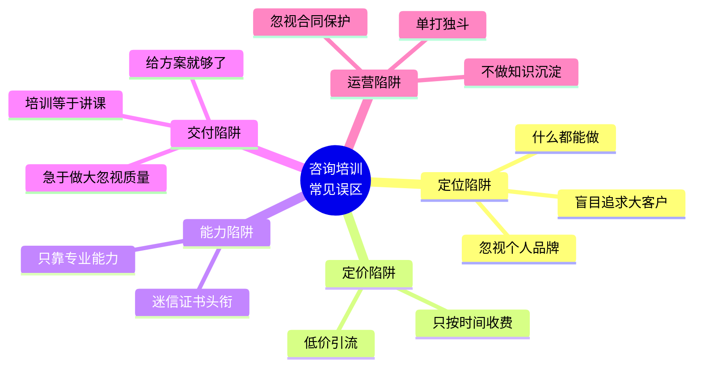
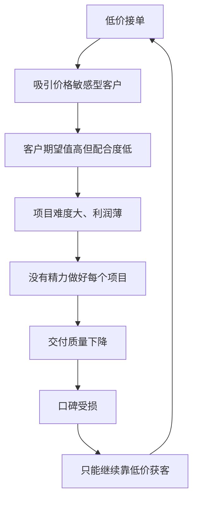
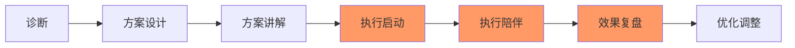
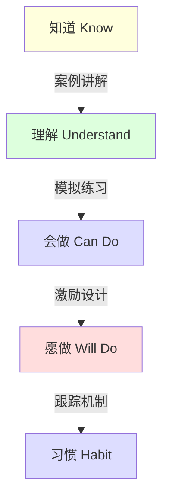
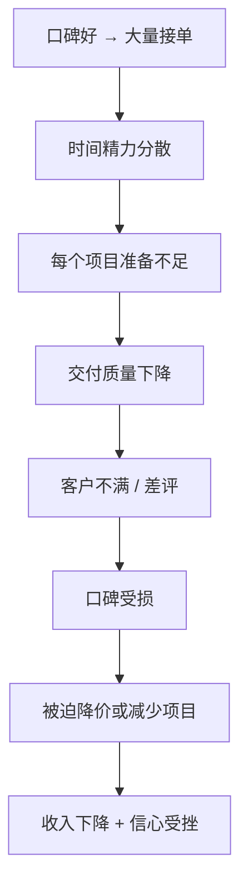
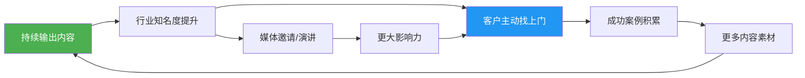

# 第二十三章 咨询与培训变现——常见误区

> 咨询与培训行业有太多"看起来正确、做起来致命"的认知陷阱。这些误区不会立刻让你失败，而是像慢性毒药一样，一步步侵蚀你的职业发展、客户关系和收入天花板。本章逐条拆解12个最常见的误区，帮你避开前人踩过的坑。

## 误区全景图



---

## 误区一：什么都能做 = 什么都能赚

**典型表现：** "管理咨询、营销策划、品牌设计、人力资源、财务顾问我都能做。客户问什么我都接。"

**为什么这是致命错误：**

当你告诉客户"什么都能做"时，客户的潜意识解读是"你什么都不专业"。这不是主观判断，而是心理学中的**专业性归因偏差**——人们倾向于认为专注单一领域的人比通才更专业，即使后者的实际能力更强。

在咨询行业，专业化程度直接决定三个关键指标：

| 指标 | 通才型顾问 | 专才型顾问 |
|------|-----------|-----------|
| 获客难度 | 高（需要大量筛选） | 低（客户主动找上门） |
| 定价能力 | 弱（容易被比价） | 强（稀缺性溢价） |
| 客户信任建立速度 | 慢（需要反复证明） | 快（品牌即信任） |
| 复购率 | 低（无明确理由回头） | 高（持续深耕同一领域） |
| 转介绍率 | 低（客户记不住你是谁） | 高（一句话就能推荐） |

**真实案例：**

某位从大厂出来的技术专家，最初定位为"互联网全栈咨询师"，涵盖产品、运营、技术、增长四个方向。半年下来，月均收入不到8000元，因为客户不知道该在什么时候想到他。

后来他将定位收缩为"To B SaaS产品的冷启动策略"，专门服务从0到1阶段的SaaS创业团队。三个月后，他的单次咨询报价从2000元涨到8000元，预约排期排到了两个月后。原因很简单：当一个SaaS创业者遇到冷启动问题时，他第一个想到的就是这个人。

**解决方案：T型能力结构**

用"T型能力结构"来规划你的能力版图：

```text
横向：了解多个相关领域（宽度）
━━━━━━━━━━━━━━━━━━━━━━━━━━━━━
     ┃
     ┃  纵向：深耕一个细分方向（深度）
     ┃
     ┃
     ┃
     ┃
```

**具体操作步骤：**

1. **盘点你的能力清单**：列出你所有擅长的领域，至少写20项
2. **评估市场需求**：在招聘平台、咨询需求平台上搜索，哪些细分方向的需求最旺盛、付费意愿最强
3. **找到交叉点**：你的能力 × 市场需求 × 竞争空白 = 你的定位
4. **用一句话定义自己**：如果不能用一句话说清楚你做什么，说明定位还不够清晰
5. **先窄后宽**：在一个细分领域做到前10%，再逐步扩展到相邻领域

**定位自检清单：**

- [ ] 你能用一句话说清楚自己做什么吗？
- [ ] 目标客户能在30秒内理解你的价值吗？
- [ ] 当客户遇到特定问题时，你是他们第一个想到的人吗？
- [ ] 你的定价是否高于行业平均水平？
- [ ] 你的客户中，转介绍占比是否超过30%？

---

## 误区二：价格越低越好卖

**典型表现：** "我刚起步，先低价吸引客户吧。" "别人收5000一天，我收3000一天，肯定更好卖。" "先免费做几个案例，以后再涨价。"

**为什么低价策略在咨询行业是自杀：**

在消费品市场，低价可能是一种有效的竞争策略。但在咨询行业，价格传递的信号远比价格本身重要。客户选择咨询顾问时面临严重的信息不对称——他们无法在购买前"试用"你的服务，因此价格成为判断质量的重要信号。

行为经济学中的**价格-质量推断效应**（Price-Quality Inference）表明：当消费者无法直接评估产品质量时，他们会用价格作为质量的代理指标。你收3000元/天，客户的心理活动是："为什么这么便宜？是不是能力不行？是不是没有成功案例？"

**低价的恶性循环：**



**不同定价策略的长期影响对比：**

| 维度 | 低价策略（<市场价30%） | 合理定价策略 | 溢价策略（>市场价30%） |
|------|----------------------|-------------|----------------------|
| 客户质量 | 价格敏感、配合度低 | 质量导向、配合度中等 | 结果导向、配合度高 |
| 项目体验 | 砍价、加需求、拖延付款 | 正常商务流程 | 尊重专业、高效配合 |
| 利润空间 | 薄，靠走量 | 合理 | 厚，有余力做精品 |
| 心态影响 | 焦虑、自我怀疑 | 稳定 | 自信、从容 |
| 3年后收入 | 疲惫增长或停滞 | 稳步增长 | 指数增长 |

**正确的定价策略演进路径：**

**第一阶段（0-3个月）：免费诊断 + 低价体验**
- 提供免费的30分钟诊断咨询，展示专业能力
- 首个正式项目可以打7-8折，但要明确告知"这是新客户体验价"
- 条件：客户需要提供案例授权和推荐信

**第二阶段（3-12个月）：市场合理价位**
- 有了3-5个成功案例后，立即提升到市场合理价位
- 开始按项目价值定价，而非按天/按时计费
- 建立标准化的服务产品和报价体系

**第三阶段（12个月以上）：价值定价**
- 根据你为客户创造的价值来定价，而非根据你投入的时间
- 例如：帮客户节省了100万成本，收费10-20万是合理的
- 开发高端产品线（年度顾问、高管教练等）

**定价的三条铁律：**

1. **永远不要在价格上做无底线竞争**——你不可能是市场上最便宜的，总有比你更便宜的人
2. **涨价的勇气比降价的技巧更重要**——每涨价一次，你就在筛选掉一批低质量客户
3. **让客户为结果买单，而不是为时间买单**——按天收费是把自己当劳动力卖，按结果收费才是把自己当专家卖

---

## 误区三：只靠专业能力就能做好咨询

**典型表现：** "我有10年经验，技术能力一流，客户应该主动来找我才对。" "我把专业做好就行了，营销那些事不适合我。"

**为什么这是一个乘法公式：**

咨询行业的成功公式是：

**收入 = 专业能力 × 商业能力 × 沟通能力**

三项能力中任何一项为零，结果都是零。很多技术大牛转型做咨询顾问后发现，自己最大的短板不是专业能力，而是另外两项。

**三项能力的具体内涵：**

| 能力维度 | 包含什么 | 缺失的后果 |
|---------|---------|-----------|
| 专业能力 | 行业知识、方法论、实操经验、案例积累 | 无法解决客户问题，口碑崩塌 |
| 商业能力 | 获客、定价、谈判、合同、财务管理 | 有本事没客户，或者有客户没利润 |
| 沟通能力 | 结构化表达、需求挖掘、方案呈现、异议处理 | 专业能力无法被客户感知和认可 |

**真实案例：**

某位拥有15年供应链管理经验的专家，专业能力在业内排名前列。但转型做咨询后的第一年，全年只签了4个项目，总收入不到15万。原因分析：

- 获客渠道单一：只靠朋友圈发文章，没有系统化的获客策略
- 方案呈现差：给客户的方案是200页的Word文档，客户根本看不完
- 需求挖掘弱：客户说"帮我优化供应链"，他就直接给方案，没有深挖"优化"背后的真实诉求是什么（是降成本？是提速度？还是应对某个具体危机？）

后来他花了三个月学习销售和沟通技巧，做了三个关键改变：

1. **方案从200页Word变成10页PPT + 1页执行路线图**——客户终于能看懂了
2. **学会用SPIN提问法挖掘需求**——在给方案之前，先花一小时深入了解客户的痛点、影响、需求和价值
3. **在行业垂直社群做分享**——从"等人来问"变成"主动展示专业"

改变后半年，他的项目数量翻了3倍，单项目均价也从3万涨到了8万。

**三项能力的提升路径：**

**商业能力速成清单：**

1. **获客能力**
   - 建立至少3个稳定的获客渠道（内容营销、行业社群、转介绍体系）
   - 每周产出1篇高质量行业洞察文章
   - 参加至少2个行业社群并定期贡献价值

2. **谈判与定价**
   - 掌握"锚定效应"定价法：先报高价，再给优惠方案
   - 学会"三档报价法"：基础版、标准版、高级版
   - 永远不要在第一次沟通中报价

3. **财务管理**
   - 区分"收入"和"利润"——很多顾问看起来很忙，但扣掉成本后所剩无几
   - 建立现金流管理表，确保至少3个月的运营资金储备

**沟通能力速成清单：**

1. **结构化表达**
   - 学会"金字塔原理"：结论先行，以上统下，归类分组，逻辑递进
   - 练习"电梯演讲"：30秒说清楚你是谁、你做什么、你能帮客户解决什么问题

2. **需求挖掘**
   - 掌握SPIN提问法：情境问题（Situation）→ 难点问题（Problem）→ 暗示问题（Implication）→ 需求-效益问题（Need-Payoff）
   - 学会"5个为什么"追问法，穿透表面需求找到真实痛点

3. **方案呈现**
   - 用"问题-原因-方案-效果"四段式结构
   - 每页PPT只有一个核心观点
   - 用数据和案例支撑每个论点

---

## 误区四：给方案就够了，执行是客户的事

**典型表现：** "我的工作是给建议，执不执行是客户自己的问题。" "方案交付了，项目就结束了。"

**为什么"交付方案"不等于"完成工作"：**

客户付钱给你的最终目的不是"拿到一份方案"，而是"解决问题"。如果你的方案给了但没有执行，客户不会觉得是自己的问题，而会觉得"这个咨询没用"。

这是咨询行业最常见的认知错位：

| 顾问的认知 | 客户的期望 |
|-----------|-----------|
| 我交付的是一份方案 | 我购买的是一个问题的解决 |
| 方案质量体现在文档的专业性 | 方案质量体现在执行后的效果 |
| 项目在方案交付时结束 | 项目在问题解决时结束 |
| 执行是客户的责任 | 你比我专业，你应该帮我落地 |

**真实案例：**

某营销顾问为一家餐饮连锁品牌做了一套完整的品牌升级方案，报价15万。方案质量很高，从品牌定位到视觉设计到传播策略都很专业。但交付后三个月，客户只执行了20%的内容，品牌效果几乎没有改善。客户在行业群里说："花了15万请了个顾问，没什么用。"

这个评价直接导致该顾问失去了3个潜在客户——因为那3个客户正好在那个群里。

**正确的做法：将"执行陪伴"纳入服务体系**



**执行陪伴的具体操作方式：**

1. **启动阶段**（方案交付后第1周）
   - 与客户团队开一次方案解读会，确保每个人都理解自己的任务
   - 帮客户制定详细的执行计划，精确到每周的具体动作
   - 识别执行中的关键风险点，提前准备应对方案

2. **陪伴阶段**（持续4-8周）
   - 每周一次30分钟的进度跟进电话
   - 客户遇到执行障碍时，48小时内提供解决方案
   - 关键节点亲自参与（如重要会议、关键决策）

3. **复盘阶段**（项目结束时）
   - 用数据对比执行前后的变化
   - 总结成功经验和失败教训
   - 形成案例素材（征得客户同意后用于营销）

**项目范围设计模板：**

```text
项目名称：[具体项目名称]
服务范围：
  1. 现状诊断（含调研访谈）
  2. 方案设计（含3次修改）
  3. 方案讲解与团队培训
  4. 执行启动支持（第1-2周，含2次现场/远程指导）
  5. 执行陪伴（第3-8周，每周1次跟进通话）
  6. 效果复盘与优化建议

不包含：
  - 具体的执行工作（如文案撰写、设计制作等）
  - 超出项目范围的额外咨询服务
  
交付物：
  - 诊断报告
  - 解决方案文档
  - 执行计划表
  - 周跟进记录
  - 最终复盘报告
```

---

## 误区五：培训 = 讲课

**典型表现：** "培训不就是站在台上讲课吗？内容好就行了。" "我的PPT做得很漂亮，案例也很丰富，培训效果应该没问题。"

**为什么"讲课思维"是培训行业的最大陷阱：**

企业培训的本质是**改变行为、提升绩效**，而不是"传递知识"。如果学员听完课回去什么都不做，这个培训就是失败的——不管你的PPT有多漂亮、讲课有多风趣。

**两种培训模式的对比：**

| 维度 | 讲课模式 | 行为改变模式 |
|------|---------|------------|
| 目标 | 传递知识 | 改变行为 |
| 衡量标准 | 学员满意度评分 | 行为改变率和绩效提升 |
| 课程设计重点 | 内容体系完整性 | 训练环节和转化机制 |
| 课后跟进 | 无或很少 | 有系统的跟踪机制 |
| 客户复购率 | 低 | 高 |
| 典型交付物 | PPT + 讲义 | PPT + 练习 + 行动计划 + 跟踪工具 |

**柯氏四级评估模型——衡量培训效果的金标准：**

```text
Level 4：结果层（Results）
  → 培训带来了哪些业务指标的改善？
  例：销售额提升15%，客户投诉率下降30%

Level 3：行为层（Behavior）
  → 学员在工作中是否应用了所学内容？
  例：80%的学员在课后1个月内开始使用新的销售话术

Level 2：学习层（Learning）
  → 学员是否掌握了知识和技能？
  例：课后测试平均分85分

Level 1：反应层（Reaction）
  → 学员对培训的满意度如何？
  例：满意度评分4.5/5
```

大多数培训师只做到了Level 1（满意度），而企业客户真正关心的是Level 3（行为改变）和Level 4（业务结果）。

**从"讲课"到"行为改变"的设计方法：**

**第一步：以终为始设计课程**

在设计课程内容之前，先回答三个问题：

1. 培训结束后，学员应该**停止**做什么？（需要消除的行为）
2. 培训结束后，学员应该**开始**做什么？（需要建立的行为）
3. 培训结束后，学员应该**继续**做什么但做得更好？（需要强化的行为）

**第二步：设计"知道→理解→会做→愿做"的学习闭环**



**第三步：课程中的互动环节设计**

| 互动类型 | 占比建议 | 适用场景 | 具体做法 |
|---------|---------|---------|---------|
| 案例讨论 | 20% | 理解抽象概念 | 给出真实案例，分组讨论，全班分享 |
| 角色扮演 | 25% | 沟通、销售、管理类 | 2-3人一组，轮流扮演不同角色 |
| 实操练习 | 30% | 技能类培训 | 用真实工作场景做练习 |
| 小组共创 | 15% | 方案类培训 | 分组产出可落地的行动计划 |
| 讲授 | 10% | 知识传递 | 只用于框架介绍和关键概念讲解 |

**第四步：设计课后转化机制**

1. **课后24小时内**：发送学习资料包 + 个人行动计划模板
2. **课后1周**：线上答疑会（30分钟），解决执行中的问题
3. **课后2周**：发送"行为自查清单"，让学员自评改变程度
4. **课后1个月**：收集学员的行为改变数据，形成效果报告
5. **课后3个月**：跟踪长期效果，形成案例用于后续营销

---

## 误区六：急于做大而忽视交付质量

**典型表现：** "我应该多接项目、多讲课，这样才能赚更多钱。" "这个项目超出我的能力范围了，但先接下来再说。"

**为什么"贪多嚼不烂"在咨询行业是致命的：**

过度追求项目数量，会导致每个项目的交付质量下降。在咨询行业，口碑是最重要的资产。一个差评的传播力是好评的10倍——心理学中的**负面偏差**（Negativity Bias）决定了人们对负面信息的记忆和传播远强于正面信息。

**真实案例：**

某培训讲师在口碑建立期非常注重质量，每个项目都做到超出客户预期。一年后口碑起来了，他开始大量接单，一个月讲15天课。结果：

- 第3个月：一个大客户反馈"这次培训质量不如上次"，但没有追究
- 第5个月：另一个客户在HR社群里说"这个讲师最近质量下滑明显"
- 第7个月：两个正在洽谈的大客户突然没有了下文，后来才知道他们看到了那个评价
- 最终：他花了8个月时间修复口碑，期间不得不降价接单

**过度接单的恶性循环：**



**正确的产能管理方法：**

**1. 确定你的最大产能**

计算你每月能高质量交付的最大项目数：

```text
每月可用天数 = 30天
- 休息日：8天
- 获客和营销：4天
- 内容创作和学习：3天
- 行政和财务：2天
= 实际可交付天数：13天

每个项目平均需要：诊断1天 + 方案2天 + 陪伴1天 = 4天

每月最大项目数 = 13 / 4 = 3个项目（取整，留缓冲）
```

**2. 建立项目筛选标准**

在接项目之前，用以下标准评估：

| 评估维度 | 问题 | 不达标则拒绝 |
|---------|------|------------|
| 能力匹配 | 这个项目在我的核心能力范围内吗？ | 匹配度<70%不接 |
| 时间充裕 | 我有足够的时间高质量完成吗？ | 时间<预估的80%不接 |
| 客户配合 | 客户愿意投入时间和资源配合吗？ | 配合意愿低不接 |
| 价值匹配 | 这个项目能产生好的案例吗？ | 无案例价值且利润低不接 |
| 利润合理 | 扣除成本后利润率合理吗？ | 利润率<30%不接 |

**3. 学会说"不"的话术**

- "这个项目超出了我的核心专长领域，我可以推荐一位更合适的专家。"
- "我的排期已经到下个月了，如果时间可以调整的话我们可以再谈。"
- "这个项目的工作量比较大，如果预算可以调整到X，我可以保证高质量交付。"

---

## 误区七：忽视合同和知识产权保护

**典型表现：** "我们关系这么好，不用签合同了吧。" "方案给出去了，客户拿去给别人抄怎么办？"

**为什么没有合同等于裸奔：**

没有合同的咨询项目是定时炸弹。轻则尾款收不回来，重则陷入法律纠纷。更隐蔽的风险是：没有合同就没有边界，客户会不断加需求、改要求，最终项目范围无限膨胀。

**真实案例：**

某咨询顾问为一家企业做管理体系优化，口头约定10万，先付5万。项目进行到一半，客户不断提出新需求——"帮我顺便把薪酬体系也梳理一下"、"绩效考核也一起做了吧"。顾问不好意思拒绝，只能硬着头皮做。

项目结束后，客户觉得"反正你都做了这些"，以"效果不理想"为由拒绝支付尾款5万。顾问没有任何书面证据证明项目范围，最终只能自认倒霉。

**咨询合同必须包含的7大条款：**

| 条款 | 内容要点 | 不包含的风险 |
|------|---------|------------|
| 服务范围 | 明确列出包含和不包含的工作内容 | 客户无限加需求 |
| 交付标准 | 每个交付物的具体标准和验收方式 | 交付后客户不认可 |
| 付款方式 | 付款节点、金额、方式、逾期违约金 | 尾款收不回来 |
| 项目周期 | 起止日期、关键里程碑、延期处理方式 | 项目无限拖延 |
| 知识产权 | 成果归属、使用范围、二次使用限制 | 方案被抄袭转卖 |
| 保密条款 | 双方的保密义务、保密期限 | 商业信息泄露 |
| 违约责任 | 双方违约的后果和赔偿方式 | 出问题无法追责 |

**知识产权保护的三个层次：**

**第一层：合同约定**
- 明确约定：方案交付物的知识产权归顾问所有，客户获得使用权
- 限制客户将方案内容转让给第三方
- 约定客户引用方案时需注明出处

**第二层：交付策略**
- 核心方法论和工具不以文档形式交付，而是通过培训和指导传授
- 方案文档使用水印和追踪编号
- 分阶段交付，每个阶段验收通过后再交付下一阶段

**第三层：商业策略**
- 将核心竞争力固化为可识别的品牌（如独创的模型、工具、框架）
- 注册商标保护你的方法论名称
- 通过持续创新保持领先，让模仿者永远追不上

**合同模板的核心条款示例：**

```markdown
## 第X条 服务范围

乙方为甲方提供以下咨询服务：
1. [具体服务内容1]，包含但不限于[具体工作项]
2. [具体服务内容2]，包含但不限于[具体工作项]

以下内容不在本合同服务范围内：
1. [明确排除的内容1]
2. [明确排除的内容2]

如甲方需要增加服务范围，双方应另行签订补充协议。

## 第X条 付款方式

本项目总费用为人民币XX元（含税），付款安排如下：
1. 合同签订后5个工作日内，甲方向乙方支付合同总额的40%，即XX元
2. 中期成果验收通过后5个工作日内，甲方向乙方支付合同总额的30%，即XX元
3. 项目终验通过后5个工作日内，甲方向乙方支付合同总额的30%，即XX元

如甲方逾期付款，每逾期一日应向乙方支付逾期金额0.05%的违约金。

## 第X条 知识产权

1. 本项目产生的咨询报告、方案文档等交付物的著作权归乙方所有
2. 甲方获得上述交付物的永久使用权，但不得转让、出售或授权第三方使用
3. 乙方有权在不泄露甲方商业秘密的前提下，将本项目的方法论和通用经验用于后续项目
```

---

## 误区八：单打独斗，拒绝合作

**典型表现：** "合作要分成，我自己干赚得更多。" "找合作伙伴太麻烦，还不如自己做。"

**为什么单打独斗的天花板很低：**

咨询行业是一个高度依赖人脉和信任的行业。单打独斗的天花板由三个因素决定：

1. **时间天花板**：你一天只有24小时，能服务的客户数量有上限
2. **能力天花板**：一个顾问不可能精通所有领域，复杂项目需要多种专业能力
3. **规模天花板**：没有团队，你就无法承接大型项目和长期合约

**合作的三种模式：**

| 合作模式 | 适用场景 | 收益分配 | 风险等级 |
|---------|---------|---------|---------|
| 项目转介 | 客户需求超出你的能力范围 | 收取10-20%转介费 | 低 |
| 联合交付 | 大型项目需要多种专业能力 | 按工作量分配 | 中 |
| 合伙经营 | 长期合作，共同品牌运营 | 按股权或约定比例 | 高 |

**如何建立合作伙伴网络：**

**第一步：识别你的能力缺口**

列出你经常被客户问到但自己不擅长的领域，这就是你需要找合作伙伴的方向。

**第二步：寻找互补型合作伙伴**

理想的合作伙伴应该满足：
- 能力与你互补，而非重叠
- 价值观和职业操守一致
- 有共同的目标客户群体
- 沟通顺畅、相互尊重

**第三步：从简单合作开始建立信任**

不要一上来就搞深度绑定。建议的合作演进路径：

```text
第1步：互相转介客户（最简单，风险最低）
  ↓
第2步：小项目联合交付（2-3天的小项目）
  ↓
第3步：中型项目深度合作（需要双方投入较多时间）
  ↓
第4步：建立长期合作伙伴关系（固定合作框架）
  ↓
第5步：合伙经营（共同品牌、共同获客）
```

**利益分配的三个原则：**

1. **按贡献分配**：谁投入的时间和资源多，谁拿得多
2. **事先约定**：合作开始前就明确分配方式，不要事后扯皮
3. **留有弹性**：可以设定基础分配比例 + 绩效奖励机制

---

## 误区九：过度依赖证书和头衔

**典型表现：** "我有MBA学位、PMP证书、某某协会认证，客户应该认可我。" "我需要再考几个证书才能涨价。"

**为什么证书不等于能力：**

证书证明的是你**曾经学习过**某个领域的知识，但不能证明你能**解决**客户的实际问题。企业客户最终买的不是你的证书，而是你帮他解决问题的能力。

**证书的真实价值定位：**

| 证书类型 | 真实价值 | 局限性 |
|---------|---------|-------|
| 学历证书（MBA等） | 敲门砖，获取初始信任 | 不能替代实战经验 |
| 专业认证（PMP等） | 证明体系化知识 | 不能证明落地能力 |
| 行业协会头衔 | 增加背书 | 很多协会头衔含金量低 |
| 培训师认证 | 证明教学方法论 | 不能证明内容深度 |

**真正能提升咨询定价的"证书"：**

1. **可量化的成功案例**："帮某企业6个月内将人效提升35%"
2. **客户推荐信和背书**：来自知名企业的推荐
3. **行业影响力**：被邀请在行业大会演讲、发表专业文章
4. **原创方法论**：你独创的框架、模型、工具

**建议：** 如果你已经有3年以上实战经验，与其花时间考更多证书，不如把时间投入到案例积累和影响力打造上。

---

## 误区十：不做个人品牌建设

**典型表现：** "好酒不怕巷子深，我的能力客户自然会知道。" "做个人品牌太虚了，不如多花时间做项目。"

**为什么"等着被发现"是最慢的获客方式：**

在信息过载的时代，即使你的专业能力是顶级的，如果没有持续的曝光和品牌建设，潜在客户根本不知道你的存在。个人品牌不是"虚"的东西，而是你最高效的获客渠道。

**个人品牌的复利效应：**



**个人品牌建设的最低可行方案：**

每天投入30分钟，按以下节奏执行：

**周一**：在行业社群分享一个实操技巧（200-500字）
**周二**：回答知乎/行业论坛上的一个专业问题
**周三**：整理一个客户案例（脱敏后），发布到朋友圈或公众号
**周四**：录制一个3分钟的短视频，讲解一个行业趋势
**周五**：复盘本周的项目，总结一条经验教训并分享

坚持6个月，你会明显感觉到：客户来咨询时已经了解你的专业水平，沟通效率大幅提升，获客成本显著降低。

---

## 误区十一：忽视知识沉淀和产品化

**典型表现：** "每个项目都是定制的，没法标准化。" "我卖的就是我的时间，没办法做产品化。"

**为什么"卖时间"是咨询行业最大的陷阱：**

如果你只卖时间，你的收入就永远有上限——因为时间是有限的。知识产品化的核心是：把你的经验和方法论从"你的时间"中剥离出来，变成可以独立交付的产品。

**知识产品化的四层金字塔：**

```text
         ╱╲
        ╱  ╲        第4层：高端定制咨询
       ╱ 1对1╲       （10万+/项目，少量客户）
      ╱────────╲
     ╱  小班培训  ╲    第3层：小班培训/工作坊
    ╱   3-10人    ╲   （1-3万/天，每月3-5天）
   ╱────────────────╲
  ╱    线上课程      ╲   第2层：线上课程/训练营
 ╱   100-1000人      ╲  （几百-几千元/人，可重复销售）
╱──────────────────────╲
╱    内容/工具/模板     ╲  第1层：内容产品
╱  无限人数               ╲ （几十-几百元，被动收入）
```

**每一层的具体操作：**

**第1层：内容产品（被动收入）**
- 把你的方法论写成电子书或专栏
- 制作模板、检查清单、工具包
- 在知识付费平台上架销售
- 典型收入：每月2000-10000元（被动）

**第2层：线上课程/训练营（半被动收入）**
- 将你的核心课程录制成视频
- 设计配套的作业和社群互动
- 定期开营（如每月一期）
- 典型收入：每期1-5万

**第3层：小班培训/工作坊（主动收入）**
- 面向企业客户的定制化培训
- 高互动、高参与度
- 典型收入：1-3万/天

**第4层：高端定制咨询（高价值主动收入）**
- 1对1或小团队深度服务
- 解决复杂、关键的商业问题
- 典型收入：10万+/项目

**知识产品化的第一步：**

从你最近完成的3个项目中，找出重复出现的方法论和框架，把它整理成一个可复用的"标准作业流程"（SOP）。这就是你产品化的起点。

---

## 误区十二：不做复盘和持续迭代

**典型表现：** "这个项目做完了就做下一个，没时间复盘。" "我的课程已经很成熟了，不需要更新。"

**为什么复盘是咨询师最重要的习惯：**

每一次项目都是一次宝贵的学习机会。不复盘的咨询师，就像不看比赛录像的运动员——永远在重复同样的错误，永远无法突破自己的上限。

**单次项目复盘模板：**

```markdown
## 项目复盘报告

### 基本信息
- 项目名称：
- 客户行业：
- 项目周期：
- 项目收入：

### 成功之处（Keep）
1. 
2. 
3. 

### 问题与教训（Problem）
1. 
2. 
3. 

### 改进计划（Try）
1. 
2. 
3. 

### 可复用的经验
- 方法论层面：
- 工具/模板层面：
- 沟通/协作层面：

### 客户反馈
- 满意的地方：
- 不满意的地方：
- 改进建议：
```

**课程迭代的节奏：**

- **每期培训后**：收集学员反馈，记录需要调整的内容
- **每季度**：更新至少20%的案例和数据
- **每半年**：审视课程整体结构，根据行业变化做大幅调整
- **每年**：重新设计课程大纲，融入最新的行业趋势和研究成果

---

## 12大误区自检总表

| 序号 | 误区 | 自检问题 | 你的状态 |
|------|------|---------|---------|
| 1 | 什么都能做 | 你能用一句话说清定位吗？ | □ 已解决 □ 需改进 |
| 2 | 低价竞争 | 你的定价高于行业平均吗？ | □ 已解决 □ 需改进 |
| 3 | 只靠专业能力 | 你有稳定的获客渠道吗？ | □ 已解决 □ 需改进 |
| 4 | 给方案就够 | 你有执行陪伴机制吗？ | □ 已解决 □ 需改进 |
| 5 | 培训=讲课 | 你用什么衡量培训效果？ | □ 已解决 □ 需改进 |
| 6 | 急于做大 | 你有项目筛选标准吗？ | □ 已解决 □ 需改进 |
| 7 | 忽视合同 | 你的合同包含7大条款吗？ | □ 已解决 □ 需改进 |
| 8 | 单打独斗 | 你有合作伙伴网络吗？ | □ 已解决 □ 需改进 |
| 9 | 迷信证书 | 你的核心竞争力是什么？ | □ 已解决 □ 需改进 |
| 10 | 忽视品牌 | 你每周产出多少专业内容？ | □ 已解决 □ 需改进 |
| 11 | 不做产品化 | 你有被动收入产品吗？ | □ 已解决 □ 需改进 |
| 12 | 不做复盘 | 你有系统的复盘习惯吗？ | □ 已解决 □ 需改进 |

---

## 本节核心要点

1. **定位要窄不要宽**——在一个细分领域做到极致，比什么都做但都平庸要强得多
2. **定价要高不要低**——低价传递的是"我不专业"的信号，要靠价值取胜而非价格
3. **能力要全不要偏**——专业能力×商业能力×沟通能力，三者缺一不可
4. **交付要深不要浅**——方案不等于结果，执行陪伴才是真正的交付
5. **培训要变不要讲**——用行为改变而非满意度来衡量培训效果
6. **节奏要稳不要快**——质量优先于数量，口碑是最重要的资产
7. **合同要全不要简**——7大条款缺一不可，保护双方权益
8. **合作要广不要窄**——互补型合作伙伴网络能突破个人天花板
9. **品牌要建不要等**——持续输出内容是最高效的获客方式
10. **产品要化不要守**——把经验从时间中剥离出来，创造被动收入
11. **复盘要勤不要懒**——每一次项目都是学习机会，持续迭代才能持续进步
