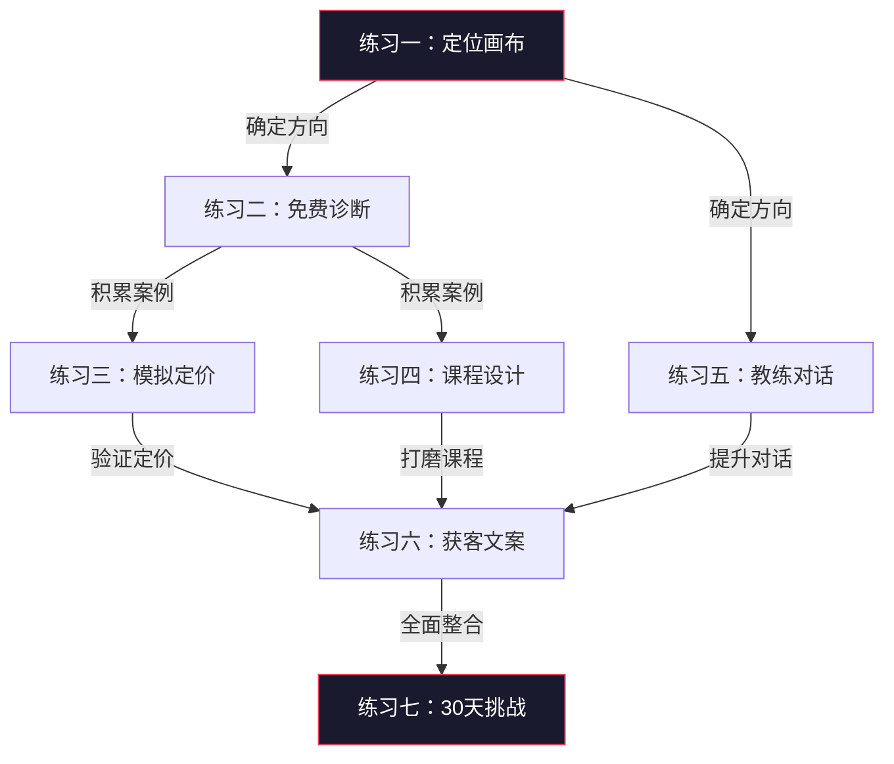
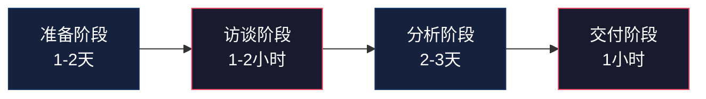
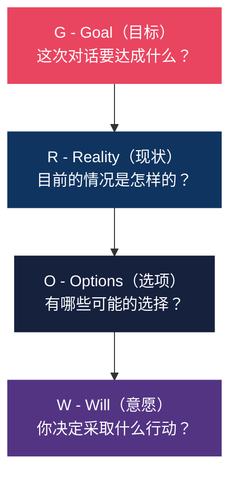

# 第二十三章 咨询与培训变现——练习方法

## 为什么"练习"在咨询培训行业如此特殊

咨询与培训是一项**复合技能**——它同时要求专业深度、沟通表达、商业思维和项目管理能力。这些能力不可能通过"看书"或"听课"获得，必须通过**刻意练习**（Deliberate Practice）来内化。

心理学家安德斯·埃里克森（Anders Ericsson）的研究表明，专业能力的提升需要满足四个条件：

1. **明确的目标**——每次练习聚焦一个具体技能点
2. **即时反馈**——练习后立刻知道哪里做得好、哪里需要改进
3. **超出舒适区**——练习的难度略高于当前能力水平
4. **大量重复**——同一个技能点反复打磨直到自动化

本节设计的七个练习，严格遵循这四个条件。每个练习都有明确的目标、具体的步骤、自评标准和进阶路径。建议按顺序完成，因为后面的练习会用到前面练习的成果。



---

## 练习一：定位画布练习

### 练习目标

用30分钟完成从"我什么都会"到"我在这个点上最强"的聚焦过程。定位是所有后续工作的基础——定位不清，后面的获客、定价、课程设计全部建立在沙子上。

### 为什么定位这么难

大多数人做定位时会犯两个错误：

- **太宽**："我做企业管理咨询"——这种定位等于没有定位，因为你面对的是全行业的竞争
- **太窄**："我做XX行业的XX岗位的XX问题的XX方案"——市场太小，养不活自己

好的定位需要在"足够聚焦"和"足够大市场"之间找到平衡点。

### 详细步骤

**第1步：列出你的"能力清单"（10分钟）**

不要思考，快速写下以下内容，每项至少写5条：

| 维度 | 问题引导 | 示例 |
|------|----------|------|
| 专业技能 | 你过去10年工作中，做得最好的事情是什么？ | "搭建过3个0到1的销售团队" |
| 被请教频率 | 同事/朋友最常问你什么问题？ | "怎么写年终总结""怎么跟老板谈加薪" |
| 资质背书 | 你有哪些认证、奖项、学历？ | PMP认证、行业Top 10公司经历 |
| 解决过的问题 | 你解决过的最棘手的3个问题是什么？ | "帮公司从亏损转盈利" |
| 独特经历 | 你有什么别人没有的经历？ | "跨行业转行3次并都成功" |

**关键提示**：不要自我审查。你觉得"很普通"的技能，在外行眼里可能是"很厉害"的技能。一个在大厂做了5年产品经理的人，对小公司创业者来说就是"专家"。

**第2步：列出"市场机会清单"（10分钟）**

从三个维度收集信息：

**维度一：痛点挖掘**
- 你的行业里，企业最头疼的问题是什么？
- 这些问题的紧迫程度如何？（不解决会怎样？）
- 目前市场上谁在解决这些问题？解决得好不好？

**维度二：竞品分析**
- 在知乎/公众号/抖音搜索你所在领域的咨询顾问
- 记录3-5个同行的定位、定价、获客方式
- 找出他们覆盖不到的空白区域

**维度三：需求验证**
- 浏览猪八戒、在行、知乎咨询等平台的热门需求
- 在行业社群里观察大家讨论最多的话题
- 问问身边的目标客户："你最希望有人帮你解决什么问题？"

**第3步：画出"定位交集"（10分钟）**

将前两步的结果整理成一张表格，然后找到交集：

```text
能力清单                    市场机会清单
┌──────────┐              ┌──────────┐
│ 技能A    │──────────────│ 需求1    │
│ 技能B    │──────┐       │ 需求2    │
│ 技能C    │      │       │ 需求3    │
│ 技能D    │      └───────│ 需求4    │
└──────────┘              └──────────┘
```

**交集判断标准（三个条件同时满足）：**

| 条件 | 问题 | 不满足时的信号 |
|------|------|----------------|
| 你擅长 | 你能做到什么程度？有没有成功案例？ | 做起来很吃力，经常需要查资料 |
| 市场需要 | 有人愿意为这个付钱吗？ | 免费都没人要 |
| 你能证明 | 你有什么证据证明你擅长？ | 只能说"我觉得我挺擅长的" |

**第4步：用一句话表述定位**

公式：**"我帮助【目标客户】解决【具体问题】，通过【独特方法】。"**

对照下面的示例，写出你自己的定位：

| 差的定位 | 好的定位 |
|----------|----------|
| 我做企业管理咨询 | 我帮助50-200人的电商企业解决团队管理混乱问题，通过"三会一表"管理体系 |
| 我做职业规划 | 我帮助工作3-5年的互联网人突破职业瓶颈，通过"能力-兴趣-市场"三维分析法 |
| 我做销售培训 | 我帮助B2B企业的销售团队提升大客户成交率，通过"信任五步法" |

### 自评标准

完成练习后，用以下标准检验你的定位：

- [ ] 一句话能说清楚，不超过30个字
- [ ] 目标客户明确到"行业+规模+角色"
- [ ] 解决的问题具体到"什么场景下的什么痛点"
- [ ] 你有至少1个成功案例可以证明
- [ ] 你知道市场上谁在做类似的事情，以及你的差异点

### 常见陷阱

**陷阱一：用"专业术语"包装平庸定位。** "我做组织发展OD咨询"——客户听不懂。客户要的是"让团队不再内耗"，不是"OD咨询"。

**陷阱二：追热点而忽略自身优势。** 看到AI培训火就想做AI培训，但你既没有AI行业经验也没有技术背景。定位要从你的真实优势出发，不是从市场热点出发。

**陷阱三：一次定位定终身。** 定位是可以迭代的。先用30分钟做一个初始定位，然后在实践中不断修正。很多成功的咨询顾问，第一年的定位和第三年的定位完全不同。

---

## 练习二：免费诊断实战

### 练习目标

通过3个免费诊断项目，积累你的第一批真实案例、验证你的定位是否正确、打磨你的诊断流程。免费诊断是新手咨询顾问最重要的"练兵场"。

### 为什么免费诊断不是"白干"

很多新手抗拒免费工作，觉得"我的时间值钱"。但免费诊断的价值远超"免费劳动"：

| 你付出的 | 你获得的 |
|----------|----------|
| 5-10小时的时间 | 1个可展示的真实案例 |
| 你的专业判断 | 客户对服务的真实反馈 |
| 诊断报告 | 一套可复用的诊断流程模板 |
| — | 客户的信任和后续转介绍 |
| — | 验证你定位是否正确的数据 |

### 详细步骤

**第1步：找到3个"练习客户"**

按优先级排序，从最容易的开始：

| 优先级 | 客户来源 | 获得方式 | 难度 |
|--------|----------|----------|------|
| 1 | 前同事/前领导 | 直接微信联系，说明你在转型做咨询 | ★☆☆ |
| 2 | 朋友介绍 | 请朋友帮忙推荐，承诺诊断结果保密 | ★★☆ |
| 3 | 行业社群 | 在社群中分享干货后主动提出 | ★★★ |
| 4 | 线上平台 | 在行、知乎等平台发布低价服务 | ★★★ |

**话术模板**（微信消息）：

> 张总您好，我最近在做【XX领域】的咨询服务，想积累一些实战案例。看到您公司在【XX方面】有一些挑战，想免费帮您做一个诊断，大概需要2小时的访谈+1份诊断报告。诊断结果完全保密，只用于验证我的方法论是否有效。您方便吗？

**关键技巧**：
- 不要说"我在学习"或"我是新手"——要说"我在积累案例"
- 明确告知时间投入（2小时访谈+3天出报告），降低对方决策成本
- 强调保密性，消除对方顾虑

**第2步：设计标准诊断流程**

一个专业的诊断流程包含四个阶段：



**阶段一：准备（访谈前1-2天）**

准备一份结构化访谈问卷。以下是一个通用框架，你根据自己的定位修改具体问题：

```text
一、背景信息（10分钟）
├── 公司规模、行业、成立时间
├── 您的角色和职责范围
└── 您团队的规模和构成

二、现状诊断（20分钟）
├── 目前遇到的最大挑战是什么？（最多3个）
├── 这个挑战持续多久了？
├── 您尝试过哪些解决方案？效果如何？
└── 如果不解决，6个月后会怎样？

三、目标探索（15分钟）
├── 您希望在多长时间内解决这个问题？
├── 您衡量"解决"的标准是什么？
├── 您愿意投入多少资源（时间、预算、人力）？
└── 这个项目的决策者是谁？

四、环境分析（15分钟）
├── 您的竞争对手在怎么做？
├── 行业内有没有做得好的标杆？
├── 您的团队对变革的态度如何？
└── 有没有什么限制条件？
```

**阶段二：深度访谈（1-2小时）**

访谈时的关键技巧：

| 技巧 | 说明 | 反面示例 |
|------|------|----------|
| 多问"为什么" | 挖掘表面问题背后的根因 | 客户说"团队执行力差"，不要直接给建议，先问"为什么觉得执行力差？具体表现在哪些事情上？" |
| 用"放大镜"追问 | 对模糊描述追问细节 | "沟通不畅"→"具体是哪种沟通？是跨部门沟通还是上下级沟通？在什么场景下？" |
| 记录原话 | 客户的原话比你的总结更有价值 | 记下"老板每天加班到11点还在审批报销单"，而不是"审批流程冗长" |
| 不要急于给建议 | 诊断阶段只听不说 | 忍住"你应该这样做"的冲动，先全面了解情况 |

**阶段三：分析与报告撰写（2-3天）**

诊断报告的标准结构：

```markdown
# 【公司名】XX问题诊断报告

## 一、诊断概述
- 诊断时间：2024年X月X日
- 诊断方式：深度访谈（2小时）
- 诊断范围：XX问题

## 二、现状分析
### 2.1 核心问题识别
（用数据和事实描述，不要用主观判断）
### 2.2 根因分析
（用"5个为什么"或鱼骨图分析根本原因）
### 2.3 影响评估
（这个问题不解决，会造成什么后果？量化）

## 三、解决方案建议
### 3.1 短期措施（1个月内）
### 3.2 中期规划（1-3个月）
### 3.3 长期建设（3-12个月）

## 四、预期效果
（每个措施的预期收益，尽量量化）

## 五、下一步建议
（如果需要进一步合作，建议什么方式）
```

**阶段四：交付与反馈（1小时）**

当面或视频交付报告，并在交付后收集反馈。

**第3步：收集反馈（关键步骤）**

交付后，用以下问题收集结构化反馈：

```text
1. 这份诊断报告对您有帮助吗？（1-10分打分）
2. 最有价值的部分是什么？
3. 最没有价值的部分是什么？
4. 如果这是一份付费服务，您觉得值多少钱？
5. 您会推荐给有类似问题的朋友吗？（1-10分打分）
6. 如果我继续提供付费咨询服务，您最希望我帮助解决什么问题？
```

**重要**：第6个问题的答案，就是你优化定位的最重要依据。

**第4步：整理案例**

将诊断过程整理成标准案例，格式如下：

| 案例要素 | 内容 | 注意事项 |
|----------|------|----------|
| 客户背景 | 行业、规模、角色 | 隐去公司名和人名 |
| 核心问题 | 用客户原话描述 | 不要用术语 |
| 诊断发现 | 你发现了什么关键问题 | 突出"客户自己没意识到的"洞察 |
| 解决方案 | 你给了什么建议 | 简要说明 |
| 实施效果 | 客户执行后的结果 | 用数据说话 |
| 客户评价 | 客户的原话反馈 | 征得同意后使用 |

### 自评标准

- [ ] 完成了至少3个免费诊断
- [ ] 每个诊断都有标准的书面报告
- [ ] 收集了至少3份结构化反馈
- [ ] 客户评分平均在7分以上（10分制）
- [ ] 至少1个客户表示愿意付费继续合作
- [ ] 整理了至少1个可展示的案例

### 常见陷阱

**陷阱一：免费诊断变成免费咨询。** 诊断是"找出问题"，不是"解决问题"。严格控制在报告中只给方向性建议，不给详细实施方案。否则客户拿到方案就不需要你了。

**陷阱二：不好意思收费。** 第3个免费诊断完成后，就必须开始收费。哪怕只收500元，也是在建立"你的服务有价值"的认知。

**陷阱三：不做反馈收集。** 很多人做完诊断就结束了，没有系统收集反馈。没有反馈，你无法知道自己的方法论是否有效，也无法迭代优化。

---

## 练习三：模拟定价练习

### 练习目标

建立一套基于市场调研和成本计算的定价体系，而不是"拍脑袋"定价。定价是咨询培训行业最被低估的能力——定价差一倍，你的收入就差一倍，而你的工作量可能完全一样。

### 定价的底层逻辑

咨询行业的定价，本质上不是"卖时间"，而是"卖结果"。客户关心的不是你花了多少小时，而是你帮他解决了多大的问题。

```text
你的定价 = 你的时间成本 × 专业溢价 × 信任系数

其中：
- 时间成本 = 你目前的年收入 ÷ 实际工作小时数
- 专业溢价 = 你的稀缺程度（1.5x - 10x）
- 信任系数 = 客户对你的信任度（0.5x - 2x）
```

### 详细步骤

**第1步：市场调研**

在定价之前，你必须知道市场上同类服务的价格区间。以下是调研方法：

| 调研渠道 | 具体操作 | 获取信息 |
|----------|----------|----------|
| 在行 | 搜索你的领域，看前20名顾问的定价 | 单次咨询价格区间 |
| 猪八戒/一品威客 | 搜索你的服务类型 | 项目制报价区间 |
| 知乎/公众号 | 搜索"XX咨询费用""XX培训报价" | 市场价格参考 |
| 同行交流 | 直接问3-5个同行 | 实际成交价格 |
| 行业报告 | 搜索咨询行业白皮书 | 行业平均价格 |

整理成表格：

| 服务类型 | 市场低价 | 市场中价 | 市场高价 | 你的定位 |
|----------|----------|----------|----------|----------|
| 1小时咨询 | 200元 | 500元 | 2000元 | ？ |
| 半天培训 | 3000元 | 8000元 | 30000元 | ？ |
| 诊断项目 | 5000元 | 15000元 | 50000元 | ？ |

**第2步：成本计算**

用以下公式计算你的"地板价"（低于这个价格你就不应该接）：

```text
年固定成本
├── 生活成本：____元/月 × 12 = ____元
├── 办公成本：____元/月 × 12 = ____元
├── 学习成本：____元/年
├── 工具成本：____元/年（软件、设备等）
└── 营销成本：____元/年
    └── 年固定成本合计：____元

可服务时间
├── 年工作天数：365天 - 周末104天 - 假期11天 = 250天
├── 实际可服务天数：250天 × 70%（扣除行政、营销、学习时间）= 175天
├── 每天可服务小时数：6小时
└── 年可服务小时数：175天 × 6小时 = 1050小时

地板价（每小时） = 年固定成本 ÷ 年可服务小时数
```

**第3步：设计产品线**

完整的咨询产品线应该是一个"金字塔"结构，从免费到高价层层递进：

| 层级 | 产品类型 | 定价区间 | 目的 | 示例 |
|------|----------|----------|------|------|
| 免费层 | 引流产品 | 0元 | 获取关注和信任 | 行业白皮书、诊断清单、公开分享 |
| 体验层 | 低门槛产品 | 99-999元 | 筛选意向客户 | 1小时咨询、线上小课、工具模板包 |
| 标准层 | 核心服务 | 5000-30000元 | 主要收入来源 | 诊断项目、半天/全天培训 |
| 高端层 | 深度服务 | 50000-200000元 | 高利润客户 | 年度顾问、长期陪跑、大型咨询项目 |

**产品线设计的关键原则**：

- **每一层都要给下一层"导流"**：免费报告末尾放体验产品链接，体验咨询结束推荐标准服务
- **每一层都要有独立价值**：客户即使只买最低层级的产品，也觉得"值了"
- **高层级产品的价值要可视化**：年度顾问的合同里，要明确列出客户获得的具体交付物

**第4步：测试和调整**

定价不是一次性的，需要通过实际成交数据来验证：

| 成交率 | 诊断 | 行动 |
|--------|------|------|
| 80%以上 | 定价偏低，你亏了 | 立即提价20%-50% |
| 50%-80% | 定价略低 | 逐步提价，观察成交率变化 |
| 30%-50% | 定价合理 | 维持当前定价，优化服务 |
| 20%-30% | 定价略高或信任不足 | 先检查信任背书是否充分，再考虑降价 |
| 20%以下 | 定价过高或定位错误 | 重新审视定位和定价策略 |

### 自评标准

- [ ] 完成了至少5个同行的定价调研
- [ ] 计算出了自己的"地板价"
- [ ] 设计了至少3个层级的产品线
- [ ] 每个产品都有明确的交付物描述
- [ ] 有了前3个客户后，根据成交数据调整了定价

### 常见陷阱

**陷阱一：用"成本加成"思维定价。** "我花10小时，时薪200元，收2000元"——这是卖时间，不是卖价值。如果你的诊断帮客户避免了50万的损失，收2万是合理的。

**陷阱二：一开始就把价格定得很高。** 新手没有案例、没有口碑、没有信任基础，高价只会吓跑客户。建议从市场中低价起步，每完成3-5个项目提价一次。

**陷阱三：只有一个价格。** 只提供一种服务、一个价格，客户只能选择"买"或"不买"。有了产品线后，客户可以在"买哪个"之间选择，成交率会显著提升。

---

## 练习四：培训课程设计练习

### 练习目标

设计一堂90分钟的企业培训课程，从课程目标设定到试讲迭代，完成全流程。培训课程设计是一门独立的专业技能，好的课程和差的课程，学员的收获差距可以达到10倍以上。

### 课程设计的底层逻辑

培训的本质不是"传递信息"，而是"改变行为"。学员听完课走出教室，如果行为没有任何改变，这堂课就是失败的。

```text
信息传递 ≠ 学习
学习 = 知识理解 + 技能练习 + 行为改变
```

成人学习有三条铁律（来自马尔科姆·诺尔斯的成人学习理论）：

1. **成人需要知道"为什么"**——不解释"为什么要学"，成人学不进去
2. **成人通过经验学习**——听讲不如讨论，讨论不如练习，练习不如实战
3. **成人学的是"解决当下问题的方法"**——和当前工作无关的内容，成人记不住

### 详细步骤

**第1步：确定课程目标**

课程目标必须用**行为动词**描述，不能用"了解""理解"这种模糊词。

| 模糊目标（不要用） | 清晰目标（要用） |
|-------------------|-----------------|
| 了解项目管理的基本概念 | 能够用WBS方法拆解一个项目的工作包 |
| 理解沟通技巧 | 能够在3分钟内完成一次结构化的电梯演讲 |
| 掌握时间管理 | 能够用四象限法对一周的工作任务进行优先级排序 |

**ABCD目标法**：
- **A**udience（对象）：谁来学？
- **B**ehavior（行为）：学完能做到什么？
- **C**ondition（条件）：在什么条件下？
- **D**egree（标准）：做到什么程度？

示例："新任管理者（A）能够在1对1场景下（C），用GROW模型（B）完成一次30分钟的绩效沟通（D）。"

**第2步：搭建课程结构**

90分钟课程的黄金结构：

| 环节 | 时间 | 核心任务 | 教学方法 |
|------|------|----------|----------|
| 开场 | 10分钟 | 建立连接、说明目标、激发兴趣 | 破冰游戏、提问、故事 |
| 模块一 | 25分钟 | 传递核心知识 | 讲解+案例+小组讨论 |
| 模块二 | 25分钟 | 示范和练习 | 示范+实操练习+点评 |
| 模块三 | 20分钟 | 应用和深化 | 工具模板+场景模拟 |
| 收尾 | 10分钟 | 回顾总结、制定行动计划 | 回顾+计划模板+Q&A |

**每个模块的内部结构——"I DO → WE DO → YOU DO"**：

```text
I DO（我做给你看）——讲师示范，10分钟
├── 讲解方法论
├── 演示一个完整案例
└── 强调关键要点

WE DO（我们一起做）——师生互动，10分钟
├── 给一个新案例
├── 学员分组讨论
└── 各组汇报，讲师点评

YOU DO（你自己做）——学员独立练习，5分钟
├── 学员独立完成一个小任务
├── 同桌互评
└── 讲师总结
```

**第3步：准备教学材料**

| 材料类型 | 规格要求 | 注意事项 |
|----------|----------|----------|
| PPT | 不超过20页，每页1个核心信息 | 字体≥24号，图>文，少用bullet |
| 学员手册 | 含工具模板、练习题、参考案例 | 留白区域让学员填写 |
| 案例材料 | 2-3个真实案例，由浅入深 | 第1个简单，第2个中等，第3个复杂 |
| 工具模板 | 1-2个可直接使用的模板 | 模板要填空式的，降低使用门槛 |
| 评估表 | 课程满意度+自评问卷 | 课前课后各一次，对比效果 |

**PPT设计要点**：

```text
好的PPT                         差的PPT
┌──────────────┐              ┌──────────────┐
│              │              │ ● 第一点      │
│   一张图     │              │   - 说明1     │
│   一句话     │              │   - 说明2     │
│              │              │ ● 第二点      │
│  "客户不是   │              │   - 说明1     │
│   买钻头，   │              │   - 说明2     │
│   是买墙上的 │              │ ● 第三点      │
│   洞"        │              │   - 说明1     │
│              │              │   ...共8条    │
└──────────────┘              └──────────────┘
学员记住核心观点               学员什么都没记住
```

**第4步：试讲和迭代**

试讲不是"讲一遍就完"，而是一个系统化的迭代过程：

**第1轮试讲（找3-5个朋友）**：
- 录像（非常重要，回看你能发现很多问题）
- 试讲完后收集反馈，重点关注：
  - 哪些内容听不懂？（知识传递问题）
  - 哪些环节太无聊？（互动设计问题）
  - 哪些练习太难/太简单？（难度匹配问题）

**第2轮试讲（找3-5个目标受众）**：
- 朋友和目标受众的反馈可能完全不同
- 这一轮重点验证：内容是否解决了目标受众的真实问题

**第3轮试讲（小规模实战）**：
- 找一个真实的企业客户，以低价或免费的方式做一次培训
- 这是最终的实战检验

**迭代检查清单**：
- [ ] 开场5分钟内是否抓住了学员注意力？
- [ ] 每15分钟是否有一次互动或练习？
- [ ] 学员是否能在课上完成至少1次实操？
- [ ] 课程结束时，学员是否能说出"今天学到了什么"？
- [ ] 学员是否带着一个可执行的行动计划离开？

### 自评标准

- [ ] 完成了至少1个90分钟课程的完整设计
- [ ] 课程目标用行为动词描述
- [ ] PPT不超过20页
- [ ] 准备了学员手册和工具模板
- [ ] 完成了至少2轮试讲和迭代
- [ ] 试讲评分平均在7分以上（10分制）

### 常见陷阱

**陷阱一：内容贪多求全。** 90分钟最多讲3个核心知识点。你觉得"讲少了不值"，但学员觉得"讲多了记不住"。少而精，远胜多而浅。

**陷阱二：全程讲授没有互动。** 成人注意力集中时间只有15-20分钟。每15分钟必须切换一次教学方法（讲→讨论→练习→视频→游戏）。

**陷阱三：练习设计太简单或太难。** 太简单的练习让学员觉得"浪费时间"，太难的练习让学员产生挫败感。最好的练习是"刚好够得着"——学员需要动脑，但最终能完成。

---

## 练习五：教练对话模拟练习

### 练习目标

掌握教练对话的核心技能——通过提问帮助对方自己找到答案，而不是直接给出建议。教练能力是咨询顾问和培训师的"隐藏必修课"，它决定了你能否从"给方案的顾问"升级为"帮客户成长的伙伴"。

### 为什么教练能力是咨询顾问的隐藏必修课

咨询行业的服务模式正在发生根本性变化：

| 传统模式 | 新兴模式 |
|----------|----------|
| 顾问出方案，客户执行 | 顾问引导，客户自己找到方案 |
| 客户依赖顾问 | 客户获得自主解决问题的能力 |
| 一次性项目 | 长期伙伴关系 |
| 收费模式：按项目 | 收费模式：按成果或按陪伴 |

Gartner的研究显示，70%的企业客户更倾向于"帮助我们建立能力"的咨询方式，而不是"直接给我们方案"。

### GROW模型详解

GROW模型是全球使用最广泛的教练框架，由约翰·惠特莫尔（John Whitmore）在《Coaching for Performance》一书中提出。



**每个阶段的关键提问库：**

**G - Goal（目标）**

| 提问 | 目的 |
|------|------|
| "你希望通过这次对话达成什么目标？" | 明确本次对话的方向 |
| "如果这次对话非常成功，你会带着什么离开？" | 帮助客户具象化期望 |
| "这个目标对你来说为什么重要？" | 挖掘深层动机 |
| "你怎么知道你已经达成了这个目标？" | 建立衡量标准 |

**R - Reality（现状）**

| 提问 | 目的 |
|------|------|
| "目前的情况是怎样的？" | 客户自己的描述 |
| "这件事对你的影响是什么？" | 让客户评估严重程度 |
| "你已经尝试过什么方法？" | 了解已有努力 |
| "是什么阻碍了你？" | 识别障碍 |
| "其他人怎么看这个问题？" | 拓展视角 |

**O - Options（选项）**

| 提问 | 目的 |
|------|------|
| "你有哪些可能的选择？" | 列举方案 |
| "如果你有无限的时间和资源，你会怎么做？" | 打破思维限制 |
| "你的朋友/导师会给你什么建议？" | 换位思考 |
| "还有哪些你还没想到的可能性？" | 激发创造力 |
| "每个选择的利弊是什么？" | 理性分析 |

**W - Will（意愿）**

| 提问 | 目的 |
|------|------|
| "你决定采取什么具体行动？" | 落实到行动 |
| "你什么时候开始？" | 设定时间 |
| "你需要什么支持？" | 识别资源 |
| "可能会有什么障碍？你怎么应对？" | 预防风险 |
| "你对这个计划的信心有多高？（1-10分）" | 评估可行性 |

### 练习步骤

**第1步：学习和内化GROW模型**

不要只是"看一遍"，要：
- 把每个阶段的关键提问抄写一遍
- 找一个自己当前面临的问题，用GROW模型自己问自己一遍
- 录音，回听，感受"提问"和"给建议"的区别

**第2步：找一个练习伙伴**

练习规则：
- 两人一组，一人扮演教练，一人扮演客户
- 客户带着一个**真实的问题**来（不是模拟的）
- 教练只用提问引导，**不允许给任何建议**
- 时长30分钟，用计时器严格控制

**教练的"五不"原则**：

| 不要做的事 | 为什么 | 替代做法 |
|-----------|--------|----------|
| 不给建议 | 你的建议不一定是最好的 | 问"你觉得还有什么选择？" |
| 不评判 | 评判会让客户关闭心扉 | 问"是什么让你这么想的？" |
| 不替客户做决定 | 决定权在客户 | 问"你倾向于哪个选择？" |
| 不打断 | 打断是不尊重 | 用沉默等待客户继续 |
| 不把自己的经验强加 | 你的经验不一定适用于客户 | 问"在你的场景下，什么方法最适合？" |

**第3步：角色互换**

交换角色，再做一次30分钟的对话。

**第4步：复盘讨论（这是最重要的环节）**

用以下框架进行复盘：

```text
作为客户的反思：
1. 哪些提问让你有"啊哈"的感觉？为什么？
2. 哪些提问你觉得没用或跑题了？
3. 你觉得教练遗漏了什么重要的问题？
4. 整个对话中，你最被触动的一个瞬间是什么？
5. 给这次教练体验打分（1-10分）

作为教练的反思：
1. 你觉得哪里卡住了？为什么卡住？
2. 你是否忍不住想给建议？在哪个时刻？
3. 你的提问是开放式还是封闭式？比例如何？
4. 你是否真正听到了客户在说什么？
5. 如果重来一次，你会做哪3个不同的事情？
```

### 进阶练习

当GROW模型练习了5次以上，可以尝试以下进阶：

| 进阶技能 | 练习方法 |
|----------|----------|
| 深度倾听 | 对方说完后，先复述你听到的内容，再提问 |
| 直觉式提问 | 放下提问清单，跟着直觉走 |
| 情绪识别 | 注意对方的语气变化，问"我感觉你刚才的语气变了，发生了什么？" |
| 沉默的力量 | 提问后，保持沉默10秒以上，等对方自己思考 |
| 挑战式提问 | "你说你想做，但3个月了还没开始，是什么在阻碍你？" |

### 自评标准

- [ ] 完成了至少5次GROW模型的模拟对话
- [ ] 每次都有完整的复盘记录
- [ ] 能够做到全程不给建议
- [ ] 客户反馈评分平均在7分以上
- [ ] 能够在30分钟内走完GROW四个阶段
- [ ] 能够识别并跟随客户的情绪变化

---

## 练习六：获客文案撰写练习

### 练习目标

写一篇能够吸引潜在客户主动联系你的自我介绍/服务介绍文案。获客文案不是"自吹自擂"，而是"让对的人看到你，并觉得'这个人就是我要找的'"。

### 文案的底层逻辑

好的获客文案遵循一个公式：

```text
获客效果 = 精准的痛点描述 × 清晰的价值主张 × 充分的信任背书 × 明确的行动号召
```

任何一个环节为零，整篇文案的效果就是零。

### 详细步骤

**第1步：痛点描述（3-5句话）**

好的痛点描述要让客户读完觉得"这说的就是我"。

**写痛点的三个技巧**：

| 技巧 | 说明 | 示例 |
|------|------|------|
| 场景化 | 描述客户日常工作的具体场景 | "每天早上打开邮箱，50封未读邮件等着你" |
| 数据化 | 用数据增强紧迫感 | "80%的中小企业在第3年倒闭，原因是管理失控" |
| 情绪化 | 触发客户的情绪共鸣 | "你是不是也有这种感觉——明明很努力，但就是没有突破？" |

**示例**：

> 你的企业是不是面临这些问题？
>
> 团队执行力差——老板什么都得盯，一不盯就出问题；
> 优秀员工留不住——培养了2年的人，说走就走；
> 会议开了很多——但决策总是落不了地，下次开会又重来；
> 业绩增长停滞——去年的打法今年不管用了，但又不知道新方向在哪。

**第2步：价值主张（2-3句话）**

价值主张要回答三个问题：你帮谁？解决什么问题？达到什么效果？

**公式**：我帮助【目标客户】在【时间周期】内实现【具体成果】，通过【你的独特方法】。

**示例**：

> 我帮助100-500人的中小企业，在3个月内搭建起高效的管理体系，让老板从"救火队长"变成真正的"掌舵人"。

**检验标准**：
- [ ] 目标客户明确到"行业+规模+角色"
- [ ] 成果可衡量（有数字或可观察的行为变化）
- [ ] 时间周期合理（太短不可信，太长没吸引力）
- [ ] 方法有差异化（和别人不一样的地方）

**第3步：信任背书（3-5个要点）**

信任背书是让客户相信"你确实能做到"的证据。

| 信任类型 | 示例 | 权重 |
|----------|------|------|
| 数据结果 | "帮助30+企业平均提升40%人效" | ★★★★★ |
| 知名客户 | "服务过XX、XX、XX等行业头部企业" | ★★★★☆ |
| 从业年限 | "10年企业管理咨询经验" | ★★★☆☆ |
| 专业资质 | "ICF认证教练、PMP认证" | ★★★☆☆ |
| 媒体背书 | "XX杂志专栏作者、XX峰会演讲嘉宾" | ★★★★☆ |
| 客户评价 | "这是我见过最落地的咨询"——某企业CEO | ★★★★☆ |

**第4步：行动号召（1句话）**

行动号召要具体、低门槛、有紧迫感。

| 差的行动号召 | 好的行动号召 |
|-------------|-------------|
| 感兴趣就联系我 | 扫码添加微信，免费领取《中小企业管理诊断清单》 |
| 欢迎来咨询 | 限时开放5个免费诊断名额，扫码预约 |
| 了解更多 | 回复"管理"获取《团队执行力提升方案》模板 |

### 完整文案模板

以下是一个可直接修改使用的获客文案框架：

```markdown
【痛点标题】——用一句话描述客户最大的痛点

正文第一段：痛点描述（3-5句话，场景化+数据化）
正文第二段：价值主张（你能帮客户做到什么）
正文第三段：信任背书（3-5个证据）
正文第四段：客户案例（1个简短案例，含结果数据）
行动号召（1句话，具体+低门槛+紧迫感）
```

### 自评标准

- [ ] 写了至少3个版本的获客文案
- [ ] 痛点描述能让目标客户产生共鸣
- [ ] 价值主张清晰到"一句话能说清"
- [ ] 信任背书至少有3个有效证据
- [ ] 行动号召具体且低门槛
- [ ] 让3个目标客户读过并收集了反馈

### 常见陷阱

**陷阱一：写成"个人简历"。** "我毕业于XX大学，拥有XX年经验……"——客户不关心你的履历，客户关心的是"你能帮我解决什么问题"。

**陷阱二：价值主张太抽象。** "赋能企业成长""助力组织变革"——这些话谁都会说，等于没说。要用具体的数字和结果。

**陷阱三：没有行动号召。** 文案写得很好，但结尾没有告诉客户"下一步做什么"。客户看完觉得"挺好的"，然后就没有然后了。

---

## 练习七：30天挑战——从0到1搭建咨询业务

### 练习目标

在30天内，把前面六个练习的成果整合起来，完成从定位到获取第一个付费客户的全流程。这个挑战不是"学完就完"，而是"做完才算"。

### 30天挑战的详细路线图

#### 第1周：定位与准备（Day 1-7）

| 日期 | 任务 | 具体产出 | 时间投入 |
|------|------|----------|----------|
| Day 1 | 完成定位画布练习 | 1份定位画布+1句定位表述 | 2小时 |
| Day 2 | 验证定位——找3个目标客户聊天 | 3份聊天记录+定位调整 | 3小时 |
| Day 3 | 设计产品线和定价 | 1份产品线表格+定价方案 | 2小时 |
| Day 4 | 撰写获客文案第1版 | 1篇完整的获客文案 | 3小时 |
| Day 5 | 搭建个人品牌阵地 | 公众号/知乎/朋友圈页面 | 4小时 |
| Day 6 | 准备诊断问卷和报告模板 | 2份标准化模板 | 3小时 |
| Day 7 | 周复盘——回顾本周进展 | 1份复盘记录 | 1小时 |

**第1周的关键产出**：
- 1个清晰的定位
- 1套产品线和定价方案
- 1篇获客文案
- 1份诊断问卷模板
- 1个个人品牌页面

#### 第2周：内容建设（Day 8-14）

| 日期 | 任务 | 具体产出 | 时间投入 |
|------|------|----------|----------|
| Day 8 | 写第1篇专业文章 | 1篇2000字以上的深度文章 | 4小时 |
| Day 9 | 写第2篇专业文章 | 1篇2000字以上的深度文章 | 4小时 |
| Day 10 | 写第3篇专业文章 | 1篇2000字以上的深度文章 | 4小时 |
| Day 11 | 录制第1条短视频 | 1条1-3分钟的专业视频 | 3小时 |
| Day 12 | 录制第2条短视频 | 1条1-3分钟的专业视频 | 3小时 |
| Day 13 | 整理行业报告/白皮书 | 1份10页以上的行业报告 | 5小时 |
| Day 14 | 周复盘——分析内容数据 | 1份复盘记录+数据表格 | 1小时 |

**内容选题方法**：

```text
你的定位 × 客户痛点 × 热点话题 = 高传播性内容

示例：
定位：电商团队管理
痛点：员工流动率高
热点：金三银四跳槽季
文章：《金三银四，电商团队如何留住核心员工？5个实操方法》
```

#### 第3周：获客启动（Day 15-21）

| 日期 | 任务 | 具体产出 | 时间投入 |
|------|------|----------|----------|
| Day 15 | 联系前5个潜在客户 | 5条微信消息+2个回复 | 2小时 |
| Day 16 | 联系后5个潜在客户 | 5条微信消息+2个回复 | 2小时 |
| Day 17 | 参加1个行业社群并开始活跃 | 1次社群互动+3条有价值的回复 | 2小时 |
| Day 18 | 参加1个行业社群并开始活跃 | 1次社群互动+3条有价值的回复 | 2小时 |
| Day 19 | 预约第1次线上/线下见面 | 1次30分钟的沟通 | 2小时 |
| Day 20 | 预约第2次线上/线下见面 | 1次30分钟的沟通 | 2小时 |
| Day 21 | 周复盘——分析获客漏斗 | 1份获客漏斗数据表 | 1小时 |

**获客漏斗跟踪表**：

| 指标 | 目标 | 实际 | 差距 |
|------|------|------|------|
| 触达人数（发消息/互动） | 20人 | ？ | |
| 有效回复数 | 10人 | ？ | |
| 愿意聊的人数 | 5人 | ？ | |
| 预约诊断的人数 | 3人 | ？ | |
| 最终成交的人数 | 1人 | ？ | |

#### 第4周：复盘迭代（Day 22-30）

| 日期 | 任务 | 具体产出 | 时间投入 |
|------|------|----------|----------|
| Day 22-23 | 完成第1个免费诊断 | 1份诊断报告 | 6小时 |
| Day 24 | 完成第2个免费诊断 | 1份诊断报告 | 4小时 |
| Day 25 | 收集反馈+整理第1个案例 | 1份案例报告+反馈记录 | 3小时 |
| Day 26 | 优化服务和文案 | 更新后的获客文案 | 3小时 |
| Day 27 | 尝试第1次收费报价 | 1次报价记录 | 1小时 |
| Day 28 | 写1篇案例文章并发布 | 1篇案例文章 | 3小时 |
| Day 29 | 设定下个月目标和计划 | 1份月度计划 | 2小时 |
| Day 30 | 总复盘——完整回顾30天 | 1份30天复盘报告 | 2小时 |

### 30天挑战的自评标准

完成挑战后，用以下标准评估自己的成果：

| 等级 | 标准 | 说明 |
|------|------|------|
| A（优秀） | 获取了至少1个付费客户 | 你已经是一个正式的咨询顾问了 |
| B（良好） | 完成了3个免费诊断，积累了3个案例 | 基础扎实，下个月大概率能获取付费客户 |
| C（及格） | 完成了定位+内容+获客的全流程 | 流程跑通了，需要更多时间积累 |
| D（需要加强） | 只完成了部分内容 | 找出卡住的原因，下个月继续 |

### 常见陷阱

**陷阱一：完美主义导致拖延。** "定位还没想好""文案还不够完美""文章还没写完"——30天挑战的核心是"做完"而不是"做好"。先完成，再完美。

**陷阱二：只做容易的事。** 很多人花了大量时间在"搭建公众号页面""设计Logo""写文章"上，但回避最难的事——直接联系潜在客户。记住：获客是最重要的事，也是最难的事。

**陷阱三：遇到拒绝就放弃。** 联系10个人，可能只有3个人回复，1个人愿意聊，0个人成交。这是正常的。咨询行业的获客漏斗就是这样——大进小出。关键是持续行动，而不是遇到几个拒绝就停下来。

---

## 本节核心要点

1. **定位是一切的起点**——花30分钟做定位画布，比花30天纠结更有效
2. **免费诊断是最好的练兵场**——不是白干，是投资。3个免费诊断就是你咨询业务的基石
3. **定价要基于调研和计算**——不要拍脑袋定价，也不要只算成本，要算价值
4. **课程设计的核心是"行为改变"**——不是传递信息，是改变行为
5. **教练对话的核心是"提问"**——忍住给建议的冲动，用提问帮助客户自己找到答案
6. **获客文案的关键是"共鸣"**——让客户觉得"你说的就是我"
7. **30天挑战的目标是"做完"**——完成比完美重要，先跑通全流程，再迭代优化
