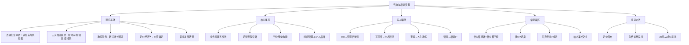

# 第二十三章 咨询与培训变现——本章小结

## 一、本章知识全景

本章从理论基础、核心技巧、实战案例、常见误区、练习方法五个维度，系统拆解了咨询与培训行业的变现逻辑。以下用一张知识地图串联全章脉络，帮助你建立整体认知框架。



***

## 二、五大核心认知深度回顾

### 认知一：咨询行业的本质是卖认知差和执行差

这句话值得反复咀嚼。很多刚入行的咨询师以为自己在"卖建议"或"卖时间"，这两种理解都会导致定价偏低、价值感模糊。

**认知差**——你见过、做过、总结过的，客户没见过、没做过、没总结过。这包括：行业最佳实践、失败案例的教训、跨行业的迁移方法论、数据驱动的决策框架。认知差的大小决定了你能提供的"判断力"有多强。

**执行差**——同样的方法论，你能在3个月内落地，客户内部团队可能要1年还做不好。执行差来自：流程化的能力、踩过的坑、成熟的工具和模板、对人性和组织动力学的理解。执行差的大小决定了你能提供的"推动力"有多强。

两者叠加，构成你的核心定价锚点。你能提供的认知差越深、执行差越大，定价能力就越强。反过来，如果你只是把网上搜到的信息重新组织一下卖给客户，认知差趋近于零，最终只能拼价格。

**自我检测**：问自己三个问题——（1）在这个领域，我能告诉客户哪些他不知道的事情？（2）同样的任务，我做比他内部团队做快多少倍、好多少倍？（3）如果客户把我的方案拿给另一个执行者做，效果会差多少？如果前两个问题的答案是"不确定"，说明你的差异化还不够清晰。

### 认知二：三大商业模式的阶梯式升级

本章详细拆解了咨询行业的三种收费模式，这不是简单的"选哪个"的问题，而是一条阶梯式的升级路径：

| 维度 | 按时间收费 | 按项目收费 | 按成果收费 |
|------|-----------|-----------|-----------|
| 收入公式 | 时薪 × 工时 | 固定报价 | 成果分成 |
| 收入天花板 | 低（受限于个人时间） | 中（受限于项目数量） | 高（与客户价值挂钩） |
| 客户关系 | 甲乙方 | 合作伙伴 | 利益共同体 |
| 核心能力 | 专业执行 | 项目管理 | 商业洞察 |
| 典型适用 | 起步阶段、技术顾问 | 成长阶段、管理咨询 | 成熟阶段、战略顾问 |
| 风险承担 | 低（干多少活收多少钱） | 中（超时超支自己扛） | 高（效果不好收入缩水） |

**升级的条件**：从按时间收费升级到按项目收费，需要你有足够的案例和流程，能准确估算项目工时和成本。从按项目收费升级到按成果收费，需要你对客户的业务有足够深的理解，能预测和量化咨询带来的价值。每一步升级都需要前一步的积累，急不得。

**实操建议**：不要一开始就想按成果收费。没有案例、没有方法论、没有品牌，你凭什么让客户相信你能带来成果？先用按时间收费的方式积累案例和口碑，用2-3年时间完成第一轮升级。

### 认知三：个人咨询业务搭建五步法

这是本章核心技巧部分最重要的框架——从零开始搭建咨询业务的五个关键步骤：

**第一步：精准定位——一厘米宽、一公里深。** 定位不是选一个"领域"，而是找到一个"交叉点"：你擅长的 × 市场需要的 × 你能证明的。定位越窄，获客越精准，定价越高。"中小企业管理咨询"是一个领域，"100-500人制造业企业的供应链效率优化"才是一个定位。

**第二步：打造背书——案例是最好的背书。** 在咨询行业，客户买的是信任。而信任的来源，按说服力排序：成功案例 > 客户推荐 > 行业认证 > 教育背景 > 自我介绍。前三个免费诊断案例的价值，远大于一张MBA学位证书。

**第三步：建立获客体系——转介绍 + 内容营销 + 行业社群。** 三种获客渠道的特征：

| 渠道 | 获客成本 | 客户质量 | 成交周期 | 适用阶段 |
|------|---------|---------|---------|---------|
| 转介绍 | 最低 | 最高 | 最短 | 成熟期 |
| 内容营销 | 中等 | 高 | 中等 | 成长期 |
| 行业社群 | 低 | 中等 | 中等 | 全阶段 |
| 主动BD | 较高 | 中等 | 较长 | 初期 |

成熟咨询师60%-80%的收入来自老客户复购和转介绍，这是行业铁律。你的服务体系越好，转介绍率越高，获客成本就越低，形成正循环。

**第四步：科学定价——价格是定位，不是竞争工具。** 定价的本质不是计算成本加利润，而是回答一个客户心理问题："这个价格合理吗？"客户评估合理性的标准是：（1）你的专业度和可信度；（2）问题的紧急程度和不解决的代价；（3）市场参照价格。一个能帮你多赚100万的咨询，收费10万客户觉得便宜；一个解决不了问题的咨询，收费1万客户也觉得贵。

**第五步：高质量交付——用数据量化成果。** 交付不是"把方案给客户"就完了。高质量交付的四个标准：（1）方案可执行，不是空洞的框架；（2）有明确的时间表和里程碑；（3）有量化的预期效果；（4）有跟进机制确保落地。数据是最好的语言——"帮助企业降低15%的库存成本"比"优化供应链管理"有说服力100倍。

### 认知四：培训行业的升级路径

培训行业的本质也是一条阶梯式升级路径：

```text
讲师（卖时间）
  → 做课程（卖产品）
    → 做认证（卖体系）
      → 做平台（卖生态）
```

**讲师阶段**：你亲自到场授课，收入与课时直接挂钩。日费5000-100000元不等，取决于领域和口碑。优点是启动快、现金流好，缺点是天花板明显——一天只有24小时，你不可能同时在两个会场。

**课程阶段**：你把知识体系化，做成可复制的课程产品——线上课程、企业内训体系、训练营。一次制作、多次销售，边际成本趋近于零。但制作一堂好课程的前期投入很大，需要教学设计、内容录制、平台运营等综合能力。

**认证阶段**：你开发一套方法论和认证体系，培训其他人成为认证讲师/教练。你从"讲课的人"变成"定义标准的人"。这是真正的杠杆——你的方法论通过认证讲师网络被放大100倍。

**平台阶段**：你构建一个生态，连接讲师、学员、企业客户。平台抽成或收取会员费。这已经不是"培训"生意，而是"平台"生意，收入天花板极高但需要运营能力和资本支持。

**每一步升级都需要前一步的积累**：没有足够的授课经验，做不出好课程；没有足够多的课程和案例，建立不了认证体系；没有品牌和资源，搭不了平台。

### 认知五：教练服务是新兴增长赛道

教练服务（Coaching）与传统咨询有本质区别。传统咨询的核心是"给建议"——我比你懂，我告诉你怎么做。教练服务的核心是"激发潜能"——你有答案，我只是帮你找到它。

| 维度 | 传统咨询 | 教练服务 |
|------|---------|---------|
| 核心动作 | 分析问题、给建议 | 提问、倾听、引导 |
| 关系定位 | 专家-客户 | 教练-被教练者 |
| 价值来源 | 知识和经验 | 觉察和动力 |
| 适用场景 | 有明确问题需要解决方案 | 需要自我突破和成长 |
| 交付物 | 方案、报告、建议 | 行动计划、心态转变 |
| 收费方式 | 按项目/时间 | 按小时/按期（3-12个月） |

教练服务在中国市场正在快速增长。ICF（国际教练联合会）数据显示，全球教练行业年增长率超过15%，中国市场增速更快。适合做教练的人通常有三个特质：丰富的人生经历、强烈的同理心、以及"相信客户自己能找到答案"的信念。

教练服务的入门门槛相对较低（ICF认证课程通常3-6个月），但做好很难——它考验的不是你的知识储备，而是你的倾听能力、提问能力和情绪管理能力。

***

## 三、关键数据速查

以下数据汇总自本章各小节，供你快速参考和对比：

| 指标 | 参考值 | 说明 |
|------|--------|------|
| 初级培训师日费 | 5,000-15,000元 | 0-3年经验，以授课为主 |
| 中级培训师日费 | 15,000-40,000元 | 3-8年经验，能设计课程体系 |
| 高级培训师日费 | 40,000-100,000元 | 8年以上，有品牌和行业影响力 |
| 1对1教练收费 | 500-5,000元/小时 | ICF认证教练通常500-2000元/小时 |
| 独立咨询顾问年收入 | 30-200万元 | 取决于领域、客户层级和服务深度 |
| 培训IP年收入 | 50-500万元 | 含课程、咨询、出版等多元收入 |
| 转介绍获客占比 | 50%以上 | 成熟咨询师的核心获客渠道 |
| 老客户复购收入占比 | 60%-80% | 服务越好，复购率越高 |
| 理想成交率 | 30%-50% | 低于20%说明定价偏高或信任不足 |
| 免费诊断转化率 | 30%-60% | 免费诊断到付费客户的转化率 |

***

## 四、常见误区速查

本章"常见误区"部分列出了咨询培训行业最容易踩的坑。以下是最关键的几条，按致命程度排序：

**误区一：什么都能做 = 什么都能赚。** 这是最致命的误区。"什么都能做"在客户耳朵里等于"什么都不精"。解决方案：用T型能力结构——横向了解多领域，纵向深耕一个细分方向。

**误区二：价格越低越好卖。** 咨询行业的低价传递的信号是"我不够专业"。客户选咨询顾问时，价格是重要的质量判断标准。解决方案：用免费诊断获取首批案例，有了成功案例后立即提升到市场合理价位。

**误区三：只靠专业能力就能做好咨询。** 专业能力只是入场券。咨询行业的公式是"专业能力 × 商业能力 × 沟通能力"，任何一项为零结果都是零。解决方案：学习销售、营销和结构化表达能力。

**误区四：给方案就够了，执行是客户的事。** 方案不等于结果。如果你的方案客户执行不了，那不是客户的问题，是你的方案有问题。解决方案：在方案中嵌入执行支持——落地步骤、培训、跟进。

**误区五：合同不重要，口头承诺就行。** 咨询行业的纠纷80%来自需求不清。白纸黑字的需求确认书和项目范围说明书是保护双方的基本工具。

***

## 五、深度拓展要点速览

本章"深度拓展"从五个前沿维度延伸了咨询与培训变现的视野：

**（一）数字化转型**：传统咨询正从"人力密集型"向"技术+智力"混合模式转变。关键动作包括：远程咨询服务（Zoom/腾讯会议）、虚拟工作坊（Miro/MURAL）、数据驱动决策（Tableau/Power BI）、AI辅助分析。分三阶段推进——数字化基础建设、数字化服务创新、数字化商业模式。

**（二）在线培训平台**：自建平台（高控制、高成本）、第三方SaaS（低成本、快上线）、混合模式（核心课程自营、大众课程分发）。国内主流平台包括小鹅通（功能全面）、知识星球（社群型）、腾讯课堂（流量大）；国际平台包括Teachable、Thinkific、Udemy。

**（三）个人品牌建设**：个人品牌的四大支柱——差异化竞争、信任建立、溢价能力、机会吸引。内容策略围绕"专业深度 + 渠道多样性 + 持续输出"展开。品牌定位公式：专业领域 × 目标客户 × 价值主张 × 个人特质。

**（四）行业国际化**：中国咨询公司的国际化通常采取"跟随客户"策略。国际咨询公司的中国实践强调深度本地化、与本地机构合作、长期投资承诺。

**（五）AI对咨询行业的影响**：AI正在重塑咨询行业的每一个环节——信息收集（自动化）、问题诊断（数据驱动）、方案设计（AI辅助）、实施支持（智能化）。AI时代咨询师的核心竞争力转向：战略思维、人际沟通、创造性解决问题——这些是AI短期内无法替代的能力。

***

## 六、全章知识框架总结

将本章所有内容归纳为一个完整的知识体系：

### 道（认知层）
- 咨询的本质是卖认知差和执行差，不是卖时间
- 定价是价值定位，不是成本加利润
- 专业能力 × 商业能力 × 沟通能力 = 咨询成功的乘法公式

### 法（方法层）
- 三大商业模式的阶梯式升级路径
- 个人业务搭建五步法：定位→背书→获客→定价→交付
- 培训行业的四阶段升级：讲师→课程→认证→平台
- 教练服务的GROW模型和核心技能

### 术（技巧层）
- 定位画布：能力清单 × 市场机会 × 差异化证明
- 获客体系：转介绍（60-80%）+ 内容营销 + 行业社群
- 产品线设计：免费引流→低价筛选→中价标准→高价VIP
- 培训课程设计：目标→结构→材料→试讲迭代

### 器（工具层）
- 在线培训平台选择策略（小鹅通/Teachable/知识星球等）
- 数据分析工具（Tableau/Power BI）
- 项目管理与协作工具
- AI辅助工具在咨询各环节的应用

***

## 七、立即行动清单

以下是基于全章内容提炼的行动建议，按优先级排序：

- [ ] **完成定位画布练习**：用30分钟写出"我帮助【目标客户】解决【具体问题】，通过【独特方法】"的一句话定位
- [ ] **联系3个潜在客户，提供免费诊断**：前同事、朋友的公司、社群认识的企业主——主动提出免费诊断，积累第一批案例
- [ ] **设计你的产品线**：免费（行业报告/公开分享）→ 低价（1小时咨询/线上课程199-999元）→ 中价（诊断项目5000-30000元）→ 高价（年度顾问50000-200000元）
- [ ] **在一个内容平台上发布第一篇专业文章**：知乎、公众号或头条号，内容围绕你的定位展开
- [ ] **加入2-3个目标客户所在的行业社群**：先提供价值（回答问题、分享资料），建立信任后再自然获取客户
- [ ] **完成30天从0到1挑战**：第1周定位准备、第2周内容建设、第3周获客启动、第4周复盘迭代

***

## 八、下一步

掌握了咨询与培训变现的方法论后，下一章我们将探讨另一个强大的变现方式——**社群与私域流量**。如果说咨询与培训是"一对一"或"一对少"的价值交付，那么社群与私域流量就是"一对多"的价值放大器。

两者之间存在天然的协同关系：
- 咨询和培训为你积累案例和口碑，这些内容沉淀到社群中成为持续的获客素材
- 社群为你提供源源不断的潜在客户，降低获客成本
- 社群中的互动帮你发现客户的真实需求，反哺咨询和培训的产品迭代

将咨询/培训与社群/私域流量结合，将让你的知识变现之路从"单点突破"升级为"系统飞轮"。
