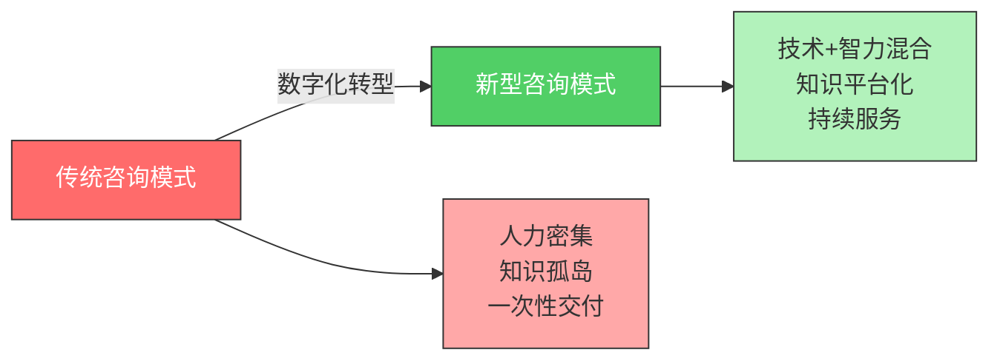
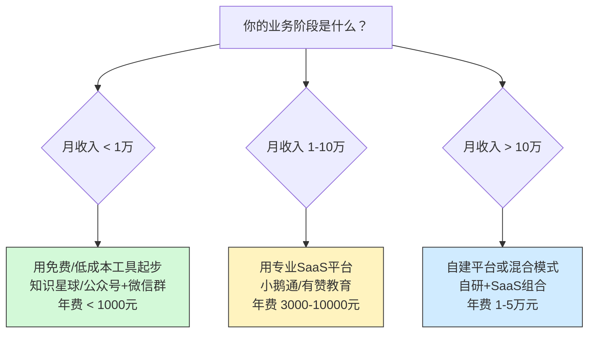
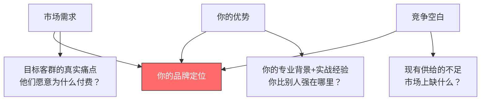

# 第23章 咨询与培训变现 — 深度拓展

本章深度拓展将从五个前沿维度展开：数字化转型如何重塑咨询行业、在线培训平台的技术选型与运营策略、咨询师个人品牌的系统化构建、咨询业务的国际化路径，以及AI浪潮下咨询行业的范式变革。每个维度都从理论根基出发，经由方法论框架，落地到可执行的操作步骤和真实案例。

***

## 一、咨询行业的数字化转型

### 1.1 为什么数字化转型不是"可选项"而是"必答题"

传统咨询行业的运作模式可以用四个字概括：**人力密集**。一个典型的管理咨询项目，需要3-5人的团队花2-3个月，完成数据收集、访谈、分析、报告撰写等工作。这种模式存在三个结构性问题：

**第一，产能受限于人头数。** 咨询公司的收入上限 = 顾问人数 × 人均产能。要增长收入，要么招更多人（成本线性增长），要么提高人效（边际改善有限）。麦肯锡全球约45,000名员工，年营收约160亿美元，人均产出约35万美元——这个数字看似不低，但对比科技公司的人均产出差距巨大。

**第二，知识复用率低。** 顾问A在北京做了一个零售行业的数字化转型项目，积累了大量经验和方法论，但顾问B在上海做类似项目时，可能完全不知道A的存在，从零开始重复劳动。传统咨询公司的知识管理系统（KM）大多形同虚设，知识沉淀在PPT和邮件里，难以被检索和复用。

**第三，交付物"一次性"。** 咨询项目交付一份报告后就结束了。客户拿到报告，可能因为执行力不足、理解偏差、环境变化等原因无法落地。咨询公司无法持续追踪和优化，也无法基于交付物构建可持续的收入模式。

数字化转型的本质，是用**技术杠杆**撬动这三个瓶颈：



### 1.2 数字化转型的四层架构

咨询行业的数字化不是简单地"用工具替代人工"，而是一个从基础设施到商业模式的系统性变革。我们将其分为四层：

| 层级 | 名称 | 核心内容 | 典型工具/技术 | 投资回报周期 |
|------|------|----------|---------------|-------------|
| L1 | 工具层 | 用数字化工具替代手工操作 | 协作工具、项目管理、自动化办公 | 1-3个月 |
| L2 | 数据层 | 建立数据采集、分析和可视化能力 | BI工具、数据仓库、爬虫系统 | 3-6个月 |
| L3 | 产品层 | 将咨询服务产品化、标准化、可复制 | 知识库、SaaS工具、在线课程 | 6-12个月 |
| L4 | 平台层 | 构建连接咨询师和客户的数字化平台 | 咨询师 marketplace、知识付费平台 | 12-24个月 |

**L1工具层**是基础中的基础。以下是一个独立咨询师的数字化工具栈推荐：

**沟通协作：**
- 视频会议：腾讯会议（国内客户）+ Zoom（国际客户），建议同时熟练使用两个平台
- 在线白板：Miro（功能最全）或 ProcessOn（国内替代，中文友好）
- 即时沟通：企业微信（正式沟通）+ 微信群（日常跟进）
- 异步协作：飞书文档（适合需要多人协同编辑的方案文档）

**项目管理：**
- 轻量级：Notion（适合个人和小团队，数据库功能强大）
- 中量级：飞书多维表格（适合需要看板+表格混合视图的场景）
- 重量级：Jira（适合复杂咨询项目，有严格的阶段和里程碑管理）

**知识管理：**
- 个人知识库：Obsidian（本地优先，双向链接，适合构建个人方法论体系）
- 团队知识库：Confluence（企业级，权限管理完善）或语雀（国内替代）
- AI辅助：用大语言模型（如ChatGPT、Kimi）辅助整理会议纪要、生成报告初稿

**内容创作：**
- 报告撰写：Markdown + Typora（快速排版）或 Gamma.app（AI生成演示文稿）
- 数据可视化：Tableau Public（免费版够用）或 Python + Matplotlib/Plotly
- 视频制作：OBS Studio（录屏）+ 剪映（后期剪辑）

### 1.3 数据驱动咨询：从"拍脑袋"到"用数据说话"

传统咨询的核心方法论是"专家判断"——顾问基于经验和直觉给出建议。这种方法的问题在于：**不可证伪、不可量化、不可复现**。

数据驱动咨询的核心理念是：**每一个咨询建议都应该有数据支撑，每一个效果都应该可以量化衡量**。

**数据驱动咨询的实操框架（DIVE模型）：**

| 步骤 | 英文 | 核心动作 | 工具 | 产出物 |
|------|------|----------|------|--------|
| D - Discover | 发现 | 识别客户的核心问题和数据现状 | 访谈提纲、数据成熟度评估表 | 问题假设清单、数据资产清单 |
| I - Investigate | 调查 | 收集和清洗数据，验证假设 | Python/Pandas、SQL、爬虫 | 清洗后的数据集、初步发现 |
| V - Visualize | 可视化 | 将数据洞察转化为可理解的图表 | Tableau、Power BI、ECharts | 数据仪表盘、关键发现报告 |
| E - Execute | 执行 | 基于数据洞察制定和实施方案 | 项目管理工具、OKR系统 | 行动计划、KPI追踪表 |

**案例：用数据驱动方法为一家餐饮连锁企业做运营优化**

某餐饮连锁企业有30家门店，利润率持续下滑，老板认为是"市场竞争太激烈"。咨询师用DIVE模型分析后发现：

1. **Discover**：通过门店POS系统导出6个月的销售数据，发现30家门店的坪效（每平米产出）差异高达3倍
2. **Investigate**：将坪效Top 5和Bottom 5的门店进行对比分析，发现核心差异不在选址，而在**菜品结构**和**翻台率管理**
3. **Visualize**：制作菜品贡献度矩阵（横轴：销量，纵轴：毛利率），发现30%的菜品贡献了80%的利润，而另外40%的菜品几乎不赚钱还占用厨房产能
4. **Execute**：建议砍掉低效菜品，优化菜单结构，同时引入排队管理系统提升翻台率。实施3个月后，整体利润率提升4.2个百分点

这个案例的关键不在于结论有多"高大上"，而在于**每一步都有数据支撑**，客户无法用"我觉得"来反驳"数据显示"。

### 1.4 AI辅助咨询的实操场景

AI不是来取代咨询师的，而是来给咨询师"加外挂"的。以下是AI在咨询各环节的具体应用场景和工具推荐：

**场景一：快速行业研究**

传统方式：花3-5天阅读行业报告、新闻、财报，整理出行业概况。

AI辅助方式：用大语言模型在2-3小时内完成初稿。

实操步骤：
1. 向AI提供行业关键词和关注维度（市场规模、竞争格局、技术趋势、政策环境）
2. 让AI生成行业研究框架和信息收集清单
3. 用Perplexity AI或Kimi搜索并整理行业数据
4. 将整理后的信息喂给AI，让它生成结构化的行业研究报告
5. **人工审核和修正**（这一步绝对不能省略——AI会编造数据）

**场景二：访谈纪要整理**

传统方式：花2小时整理1小时的访谈录音。

AI辅助方式：用语音转文字工具（如讯飞听见、飞书妙记）自动转录，再用AI提取关键信息、生成结构化纪要。全程15-20分钟。

**场景三：方案初稿生成**

传统方式：从空白文档开始，花1-2天写方案初稿。

AI辅助方式：提供方案框架和关键数据，让AI生成初稿，然后人工修改润色。时间缩短至3-4小时。

**关键原则：AI是副驾驶，不是主驾驶。** 所有AI生成的内容都必须经过人工审核、验证和修改。AI的强项是"快速生成80分的初稿"，弱项是"确保100%的准确性"。咨询师的核心价值在于**判断力、洞察力和客户关系**——这些是AI无法替代的。

### 1.5 数字化转型的ROI测算框架

很多咨询师对数字化转型犹豫不决，核心原因是"不知道投入产出比如何"。以下是一个简化的ROI测算框架：

**投入项（年度估算，独立咨询师级别）：**

| 投入类别 | 具体项目 | 年费用（元） |
|----------|----------|-------------|
| 工具订阅 | 协作+项目管理+内容创作工具 | 3,000-8,000 |
| AI工具 | ChatGPT Plus/Kimi Pro等 | 1,500-3,000 |
| 学习成本 | 学习使用新工具的时间（按机会成本计算） | 5,000-15,000 |
| 数据工具 | BI工具、数据服务等 | 2,000-10,000 |
| **合计** | | **11,500-36,000** |

**收益项（保守估算）：**

- 效率提升：每周节省5-10小时 → 每年多服务2-4个项目 → 增收5-20万
- 质量提升：数据驱动的方案更容易获得客户认可 → 续约率提升20% → 增收3-10万
- 产品化收入：将方法论做成在线课程/工具 → 产生被动收入2-10万/年

**保守ROI：投入2-4万，收益10-40万，回报率300%-1000%。**

***

## 二、在线培训的技术平台与运营策略

### 2.1 平台选择的决策框架

选择在线培训平台不是"选功能最多的"，而是"选最匹配当前阶段的"。以下是一个基于业务阶段的决策矩阵：



### 2.2 主流平台深度对比

不是所有平台都适合所有人。以下是基于实际使用经验的深度对比：

**国内平台对比：**

| 维度 | 知识星球 | 小鹅通 | 荔枝微课 | 腾讯课堂 |
|------|----------|--------|----------|----------|
| **适合谁** | 社群型知识付费 | 系统化课程交付 | 音频课程为主 | 公域流量获客 |
| **核心优势** | 社交属性强，用户粘性高 | 功能最全面，一站式解决 | 音频制作门槛低 | 依托微信生态，流量大 |
| **核心劣势** | 课程功能弱，不支持直播 | 费用较高，有学习曲线 | 视频支持弱 | 平台抽成高，竞争激烈 |
| **抽成比例** | 平台不抽成（苹果端除外） | 0%（用自己支付通道） | 10% | 10%-30% |
| **支付方式** | 微信支付 | 支付宝/微信/银行卡 | 微信支付 | 腾讯支付体系 |
| **数据分析** | 基础（成员数、活跃度） | 完善（学习行为、转化漏斗） | 基础 | 中等 |
| **年费** | 免费创建 | 基础版4,800元/年 | 免费 | 免费入驻 |
| **推荐指数** | ★★★☆☆ | ★★★★★ | ★★☆☆☆ | ★★★☆☆ |

**国际平台对比：**

| 维度 | Teachable | Thinkific | Gumroad | Podia |
|------|-----------|-----------|---------|-------|
| **适合谁** | 独立课程创作者 | 需要免费起步的创作者 | 数字产品+课程混合 | 全能型创作者 |
| **月费** | $39起 | 免费版可用 | 免费（抽成10%） | $39起 |
| **抽成** | 0%（付费版） | 0% | 10%（免费版） | 0% |
| **支付** | Stripe/PayPal | Stripe/PayPal | Stripe/PayPal | Stripe/PayPal |
| **中国用户友好度** | 中等（需要外币支付） | 中等 | 高（支持支付宝） | 中等 |

### 2.3 课程产品化的核心方法论

很多培训师的问题不是"用什么平台"，而是"课程怎么设计才能卖得动"。课程产品化的核心是将你的专业知识转化为**可标准化交付、可规模化销售**的产品。

**课程产品化的三阶模型：**

**第一阶段：最小可行课程（MVC - Minimum Viable Course）**

不要一上来就做"100节系统大课"。先做一个最小版本验证市场需求。

MVC的设计公式：**1个核心痛点 + 1套解决方案 + 3-5节精讲内容**

操作步骤：
1. 找到你最常被客户问到的3个问题
2. 选择其中最紧迫、最容易讲清楚的1个
3. 围绕这个问题设计3-5节课，每节15-30分钟
4. 定价99-299元，先卖100份验证
5. 根据学员反馈迭代优化

**第二阶段：体系化课程**

MVC验证成功后，扩展为完整的课程体系。

课程体系设计模板：

```text
课程名称：[具体、有吸引力的名称]
目标学员：[谁需要这门课？他们的痛点是什么？]
学习目标：[学完能做什么？用"能够..."句式]
课程大纲：
  模块一：认知篇（为什么学）
    - 1.1 [行业现状与痛点]
    - 1.2 [核心概念与框架]
  模块二：方法篇（怎么学）
    - 2.1 [方法论A + 案例]
    - 2.2 [方法论B + 案例]
    - 2.3 [方法论C + 案例]
  模块三：实操篇（动手做）
    - 3.1 [工具使用教程]
    - 3.2 [模板与流程]
    - 3.3 [实战项目]
  模块四：进阶篇（做得更好）
    - 4.1 [高级技巧]
    - 4.2 [常见问题与解决方案]
    - 4.3 [持续学习路径]
```

**第三阶段：产品矩阵**

单一课程的天花板有限。成熟的知识IP会构建产品矩阵，用不同价位的产品覆盖不同需求的用户：

| 产品层级 | 产品形态 | 价格区间 | 目的 | 转化率参考 |
|----------|----------|----------|------|-----------|
| 引流层 | 免费内容（公众号/短视频/直播） | 免费 | 获取流量和信任 | — |
| 体验层 | 迷你课/电子书/工具包 | 9-99元 | 筛选付费意愿用户 | 流量→付费 3%-8% |
| 核心层 | 系统课程/训练营 | 299-2,999元 | 主要收入来源 | 体验→核心 5%-15% |
| 高端层 | 一对一咨询/企业内训 | 5,000-50,000元 | 高利润+深度服务 | 核心→高端 2%-5% |
| 社群层 | 年度会员/私董会 | 3,000-30,000元/年 | 持续收入+用户粘性 | 核心→社群 3%-8% |

### 2.4 在线培训的交付质量控制

课程质量是培训业务的生命线。以下是在线培训交付的质量控制清单：

**课前准备检查清单：**
- [ ] 课程大纲经过至少3位目标学员review
- [ ] 每节课有明确的学习目标（"学完这节课，你能够..."）
- [ ] 配套资料准备完毕（讲义、模板、工具清单、参考文献）
- [ ] 技术测试完成（录制设备、网络、平台功能）
- [ ] 互动环节设计完毕（提问、讨论、练习、作业）

**课中交付质量标准：**
- 视频清晰度：1080P以上
- 音频质量：信噪比 > 60dB，无明显回声和噪音
- 内容密度：每10分钟至少1个知识点或案例
- 互动频率：每15-20分钟设置一次互动（提问/练习/讨论）
- 时长控制：单节视频15-30分钟，避免超过45分钟

**课后跟进机制：**
- 24小时内回复学员提问
- 每周至少1次直播答疑
- 作业批改在48小时内完成
- 建立学员社群，促进同伴学习
- 定期收集反馈，迭代课程内容

### 2.5 在线培训的获客与转化

课程做得再好，卖不出去就是零。以下是在线培训的核心获客渠道和转化策略：

**获客渠道矩阵：**

| 渠道 | 成本 | 效果 | 适合阶段 | 关键指标 |
|------|------|------|----------|----------|
| 内容营销（公众号/知乎/B站） | 低（时间成本） | 长期复利 | 所有阶段 | 阅读量→关注→付费转化率 |
| 短视频（抖音/视频号） | 中（制作成本） | 快速起量 | 有一定内容能力 | 播放量→粉丝→私域转化率 |
| 直播（视频号/抖音直播） | 中 | 即时转化 | 有表达能力 | 观看人数→下单转化率 |
| 社群裂变 | 低 | 精准获客 | 有种子用户 | 参与人数→邀请人数→付费人数 |
| 广告投放 | 高 | 快速起量 | 有预算+转化模型 | CPA（获客成本）、ROI |
| 平台自然流量 | 低 | 不可控 | 入驻平台 | 曝光量→点击→购买转化率 |
| 老学员转介绍 | 极低 | 最精准 | 有学员基础 | 转介绍率、转介绍成交率 |

**转化漏斗优化：**

```text
曝光 → 点击 → 注册/关注 → 试听/体验 → 付费 → 完课 → 复购/转介绍

各环节参考转化率：
曝光→点击：2%-5%（取决于标题和封面）
点击→注册：10%-30%（取决于内容质量和引导设计）
注册→试听：30%-60%（取决于课程质量和体验设计）
试听→付费：5%-20%（取决于价格、价值感知、紧迫感）
付费→完课：20%-50%（取决于课程质量和学习体验）
完课→复购：10%-30%（取决于学习效果和服务质量）
完课→转介绍：5%-15%（取决于满意度和激励机制）
```

***

## 三、咨询师的个人品牌系统化构建

### 3.1 个人品牌的底层逻辑：信任方程

个人品牌不是"包装"出来的，而是**长期积累的信任资产**。大卫·梅斯特（David Maister）在《可信赖的顾问》中提出了信任方程：

**信任 = (专业能力 × 可靠性 × 亲密度) ÷ 自我导向**

- **专业能力（Credibility）**：你懂不懂？能不能解决问题？——通过案例、资质、内容来证明
- **可靠性（Reliability）**：你靠不靠谱？说到能不能做到？——通过守时、交付质量、一致性来建立
- **亲密度（Intimacy）**：客户对你有多少安全感？愿不愿意跟你说真话？——通过倾听、共情、保密来培养
- **自我导向（Self-Orientation）**：你是在帮客户解决问题，还是在推销自己？——越低越好

很多咨询师犯的错误是过度强调"专业能力"（发证书、晒头衔），而忽视了"可靠性"和"亲密度"。实际上，客户选择咨询师时，**"靠谱"比"厉害"更重要**。

### 3.2 个人品牌定位的"黄金三角"模型

定位不是"我想做什么"，而是**"市场需要 × 我能做好 × 别人没做"三者的交集**。



**定位公式：我是[谁]，帮助[谁]解决[什么问题]，通过[什么方法]，达到[什么效果]。**

示例：
- "我是一名前字节跳动增长负责人，帮助年营收500万-5000万的互联网公司，通过数据驱动的增长黑客方法，实现6个月内用户量翻倍。"
- "我是一名10年经验的供应链管理专家，帮助跨境电商卖家，通过供应链优化和库存管理，将物流成本降低20%以上。"

**定位的三个检验标准：**
1. **具体性**：能否用一句话说清楚你是做什么的？如果需要30秒以上才能解释，定位还不够清晰
2. **差异化**：在你的目标客群心中，你和同类咨询师有什么不同？如果答不出来，差异性不够
3. **付费意愿**：目标客群是否愿意为这个定位付费？可以先做5-10个潜在客户访谈来验证

### 3.3 内容营销的系统化方法

内容是个人品牌的"燃料"。但很多咨询师的内容策略是"想到什么写什么"，缺乏系统性。

**内容金字塔模型：**

```text
                    ▲
                   / \
                  / 思 \        ← 思想领导力内容（10%）
                 / 想领 \          行业洞察、趋势预测、原创方法论
                / 导力   \         频率：每月1-2篇
               /-----------\
              /   深度专业   \    ← 深度专业内容（30%）
             /    内容        \       行业分析、案例拆解、技术解读
            /                  \      频率：每周1篇
           /--------------------\
          /     实用工具/方法     \  ← 实用内容（40%）
         /      模板/清单/教程     \     可直接使用的工具、模板、步骤指南
        /                          \    频率：每周1-2篇
       /----------------------------\
      /       轻松互动/个人故事       \ ← 互动内容（20%）
     /        行业趣闻/个人经历         \    拉近距离、展示人格、引发讨论
    /------------------------------------\   频率：每天1-2条
```

**内容日历模板（以月为单位）：**

| 周次 | 周一 | 周三 | 周五 | 周末 |
|------|------|------|------|------|
| 第1周 | 行业热点评论 | 深度文章 | 实用模板 | 个人故事/互动 |
| 第2周 | 客户案例分享 | 方法论解读 | 工具推荐 | 行业数据图 |
| 第3周 | 行业趋势分析 | 深度文章 | 实操教程 | 问答/讨论 |
| 第4周 | 月度总结 | 专家对谈 | 资源清单 | 下月预告 |

**各平台内容策略：**

| 平台 | 最佳内容形式 | 最佳长度 | 发布频率 | 核心指标 |
|------|------------|----------|----------|----------|
| 知乎 | 深度长文+回答 | 2000-5000字 | 每周2-3篇 | 赞同数、收藏数 |
| 公众号 | 图文+行业分析 | 1500-3000字 | 每周2-3篇 | 阅读量、分享率 |
| B站 | 知识讲解视频 | 10-20分钟 | 每周1-2个 | 播放量、弹幕互动 |
| 抖音/视频号 | 短视频干货 | 1-3分钟 | 每天1-2条 | 播放量→私域转化 |
| LinkedIn | 行业洞察+英文内容 | 500-1500字 | 每周2-3篇 | 互动率、连接数 |
| 小红书 | 图文笔记+清单 | 500-1000字+图 | 每天1条 | 收藏量、私信量 |

### 3.4 个人品牌的"信任资产"清单

个人品牌不是虚的，它有具体的"资产"可以量化和管理：

**核心信任资产：**
1. **案例库**：你服务过的客户案例，包含背景、问题、方案、结果、客户评价
2. **内容库**：你发布的所有专业内容，按主题分类整理
3. **背书库**：客户推荐信、媒体报道、行业奖项、合作伙伴
4. **知识库**：你的方法论、工具、模板、框架
5. **人脉库**：你的行业人脉网络，包括客户、同行、媒体、合作伙伴

**信任资产的量化指标：**

| 资产类型 | 初级（0-1年） | 中级（1-3年） | 高级（3-5年） | 专家（5年+） |
|----------|-------------|-------------|-------------|-------------|
| 案例数 | 3-5个 | 10-20个 | 30-50个 | 100+ |
| 内容数 | 50篇+ | 200篇+ | 500篇+ | 1000+ |
| 粉丝/关注 | 1,000+ | 10,000+ | 50,000+ | 100,000+ |
| 客户推荐 | 2-3个 | 10+ | 30+ | 100+ |
| 媒体曝光 | 0-1次 | 5-10次 | 20-50次 | 100+ |

### 3.5 个人品牌的危机管理

品牌建设是长期工程，但品牌危机可能在一夜之间发生。以下是咨询师常见的品牌危机场景和应对策略：

**场景一：客户投诉/差评**

应对步骤：
1. **24小时内响应**：不要删除或忽视，第一时间私信联系客户
2. **倾听而非辩解**：先了解客户的真实不满，不要急于解释
3. **提供补偿方案**：部分退款、额外服务、免费追加咨询等
4. **公开回应**：如果差评是公开的，用专业、诚恳的态度公开回应
5. **复盘改进**：将投诉转化为改进服务的机会

**场景二：同行恶意攻击**

应对策略：不回应是最好的回应。用持续产出的高质量内容和客户口碑来回应。如果涉及造谣诽谤，保留证据，必要时法律维权。

**场景三：专业失误/建议错误**

应对策略：坦诚承认错误，向受影响的客户道歉并提供补救方案。事后公开复盘（在不泄露客户信息的前提下），展示你的专业态度和成长。

***

## 四、咨询业务的国际化路径

### 4.1 为什么中国咨询师应该考虑国际化

国际化不是"大公司的事"。在数字化时代，一个独立咨询师也可以服务全球客户。国际化的核心驱动力有三个：

**第一，市场空间放大10倍。** 中国咨询市场规模约2,500亿元人民币，全球咨询市场规模约3,000亿美元（约2万亿人民币）。即使只切入一个小的细分领域，国际市场的机会也远大于国内。

**第二，定价天花板提升。** 在国际市场，咨询师的收费标准通常高于国内。一个资深管理咨询师在美国市场的日费为$2,000-$5,000，而在国内通常为3,000-15,000元人民币。

**第三，差异化优势。** 中国咨询师在以下领域具有独特的国际化优势：中国市场进入策略、中国供应链管理、中国数字化生态（微信/抖音/小红书运营）、中国文化背景下的管理实践。

### 4.2 国际化的四种模式与选择

| 模式 | 描述 | 适合谁 | 投入 | 风险 | 回报周期 |
|------|------|--------|------|------|----------|
| **远程服务** | 通过线上方式为国际客户提供咨询 | 有英语能力的独立咨询师 | 低 | 低 | 1-3个月 |
| **内容出海** | 将中文内容翻译/改编为英文，在国际平台发布 | 有内容创作能力的咨询师 | 低-中 | 低 | 3-6个月 |
| **合作出海** | 与国际咨询公司/平台合作，提供中国相关咨询 | 有行业资源的咨询师 | 中 | 中 | 6-12个月 |
| **直接出海** | 在目标市场设立团队，直接开展业务 | 有资金和团队的咨询公司 | 高 | 高 | 12-24个月 |

**对于大多数独立咨询师，建议从"远程服务"和"内容出海"开始**，用最小成本验证国际市场的需求，再逐步扩大投入。

### 4.3 国际化的实操步骤

**第一步：确定国际化方向**

问自己三个问题：
1. 我的哪些专业知识在国际市场上有需求？（中国相关经验、技术专长、行业知识）
2. 我的目标客户是谁？（跨国企业的中国业务团队、想进入中国市场的海外企业、对中国经验感兴趣的国际从业者）
3. 我用什么语言提供服务？（英语是最低要求，如果会日语/韩语/西班牙语等其他语言是加分项）

**第二步：建立国际化的线上存在**

- LinkedIn Profile：完善英文版LinkedIn资料，定期发布英文内容
- 个人网站：建立英文版个人网站（可以用 Carrd.co 快速搭建，$19/年）
- 国际平台入驻：注册Upwork、Fiverr、Expert360等国际咨询师平台

**第三步：获取第一批国际客户**

- 在LinkedIn上主动连接目标客群，提供免费的15分钟咨询作为"试用"
- 在Upwork/Fiverr上以略低于市场价的价格接前3-5个项目，积累评价
- 参加国际行业会议/网络研讨会，展示专业能力
- 在Medium/LinkedIn Publishing发布英文专业文章

**第四步：建立国际化的服务标准**

- 所有对外材料使用英文（提案、报告、演示文稿）
- 熟悉国际商务礼仪（时区管理、邮件沟通、合同条款）
- 了解目标市场的法律合规要求（数据保护、知识产权、税务）
- 建立跨境支付通道（PayPal、Wise、Payoneer）

### 4.4 国际化中的文化差异管理

文化差异是国际化最大的"隐形障碍"。以下是几个关键维度的文化差异和应对策略：

| 维度 | 中国客户 | 欧美客户 | 应对策略 |
|------|----------|----------|----------|
| **沟通风格** | 含蓄、间接、重关系 | 直接、明确、重事实 | 对欧美客户直接说结论，不要绕圈子 |
| **决策方式** | 集中决策，重视领导意见 | 分散决策，重视数据和逻辑 | 对欧美客户用数据支撑建议 |
| **时间观念** | 弹性较大 | 严格守时 | 对欧美客户严格遵守deadline |
| **合同文化** | 关系优先，合同为辅 | 合同优先，条款明确 | 对欧美客户务必签订详细合同 |
| **反馈方式** | 委婉、留面子 | 直接、对事不对人 | 对欧美客户可以直接指出问题 |

### 4.5 中国咨询公司的国际化案例

**案例一：和君咨询的国际化实践**

和君咨询是中国本土最大的管理咨询公司之一。其国际化策略采取"跟随客户"模式——随着中国企业（特别是央企和大型民企）的海外扩张，为其提供海外业务的管理咨询服务。和君在东南亚、中东、非洲等"一带一路"沿线国家建立了服务网络，核心优势是理解中国企业的管理逻辑和决策方式。

**案例二：独立咨询师的跨境咨询实践**

某位专注于供应链管理的独立咨询师，最初服务国内的跨境电商卖家。通过在LinkedIn上持续发布关于"中国供应链管理最佳实践"的英文内容，逐渐吸引了东南亚和印度的制造企业关注。目前其50%以上的收入来自国际客户，日费是国内客户的2-3倍。

关键成功因素：
1. **找到交叉优势**：中国供应链管理经验 + 英语沟通能力 = 稀缺组合
2. **内容先行**：先通过免费内容建立信任，再转化为付费客户
3. **文化适应**：针对不同文化背景的客户调整沟通方式和服务流程

***

## 五、AI浪潮下咨询行业的范式变革

### 5.1 AI对咨询行业的三层冲击

AI对咨询行业的影响不是"取代"，而是**重构**。我们可以将其分为三层来理解：

**第一层：效率层冲击（已发生）**

AI工具正在大幅提升咨询师的日常工作效率。这不是威胁，而是红利。

| 传统方式 | AI辅助方式 | 效率提升 |
|----------|-----------|----------|
| 花3天做行业研究 | AI辅助1天完成 | 3倍 |
| 花2小时整理访谈纪要 | AI语音转文字+摘要，15分钟 | 8倍 |
| 花1天写报告初稿 | AI生成初稿+人工修改，3小时 | 3倍 |
| 花半天做数据可视化 | AI辅助生成图表，30分钟 | 8倍 |
| 花1天做竞品分析 | AI快速收集+结构化，2小时 | 4倍 |

**第二层：模式层冲击（正在发生）**

AI正在改变咨询服务的交付模式。传统咨询是"项目制"——一个团队花几个月做项目，交付一份报告。AI时代，咨询正在向"产品化"和"持续化"转变：

- **产品化**：将方法论封装成SaaS工具或AI助手，客户可以自助使用
- **持续化**：从"一次性项目"变为"持续订阅服务"，通过AI实时监控和优化
- **民主化**：AI降低了获取专业建议的门槛，中低端咨询需求可能被AI工具替代

**第三层：价值层冲击（即将发生）**

AI最终将重新定义"咨询价值"。当AI可以提供80分的分析和建议时，咨询师的价值将集中在以下20%的"高维能力"上：

```mermaid
graph TD
    A[AI时代的咨询师价值] --> B[判断力]
    A --> C[洞察力]
    A --> D[关系力]
    A --> E[变革力]
    
    B --> B1[在不确定中做出正确决策<br/>AI提供数据，人做判断]
    C --> C1[看到数据背后的"为什么"<br/>AI发现规律，人解读意义]
    D --> D1[建立信任、推动共识<br/>AI无法替代人际连接]
    E --> E1[引领组织变革和转型<br/>AI是工具，人是变革推动者]
    
    style A fill:#ff6b6b,stroke:#333,color:#fff
```

### 5.2 咨询师的AI工具箱

以下是咨询师在各工作环节可以使用的AI工具推荐：

**信息收集与研究：**
- Perplexity AI：带引用来源的AI搜索，适合快速获取行业数据
- Kimi（月之暗面）：擅长长文档分析，可以一次性处理20万字的资料
- ChatGPT + Web Browsing：通用AI研究助手

**数据分析：**
- Julius AI：上传数据文件，用自然语言进行数据分析和可视化
- ChatGPT Code Interpreter：上传CSV/Excel，AI自动写代码分析
- Python + Pandas + Claude：复杂数据分析的终极组合

**内容创作：**
- Claude：长文写作质量最高，适合撰写咨询报告
- Gamma.app：AI生成演示文稿，10分钟出一版PPT
- Midjourney/DALL-E：生成报告配图和概念图

**项目管理：**
- Notion AI：在项目管理中集成AI能力，自动总结会议纪要、生成任务列表
- Otter.ai/Flye妙记：AI会议记录和转录

**客户服务：**
- 自定义GPT/Claude Project：为特定客户建立专属AI助手，回答常见问题
- Intercom/Freshdesk + AI：客户支持自动化

### 5.3 AI时代的新咨询服务类型

AI不仅在改变咨询的效率，还催生了全新的咨询服务类型：

**1. AI战略规划咨询**

帮助客户制定AI转型战略，包括：哪些业务环节适合引入AI？如何选择AI技术和供应商？如何管理AI转型的组织变革？

市场需求：极高。几乎所有大中型企业都在考虑AI战略，但大多数不知道从何入手。

**2. 数据治理咨询**

AI的基础是数据。很多企业的数据质量差、数据孤岛严重、数据安全不达标。数据治理咨询帮助企业建立数据管理体系，为AI应用打好基础。

**3. AI实施与集成咨询**

帮助客户将AI技术集成到现有业务流程中，包括：技术选型、系统集成、流程重设计、员工培训、效果评估。

**4. AI伦理与合规咨询**

AI应用引发了一系列伦理和法律问题：数据隐私、算法偏见、AI决策的可解释性、AI生成内容的版权等。AI伦理咨询帮助企业建立负责任的AI使用框架。

**5. AI技能培训**

帮助企业和个人提升AI素养和技能，包括：AI基础认知、AI工具使用、AI应用开发、AI管理能力等。

### 5.4 咨询师的AI能力建设路径

不要等到"准备好了"再开始。以下是咨询师的AI能力建设路径：

**阶段一：AI使用者（1-3个月）**

目标：熟练使用AI工具提升日常工作效率。

行动清单：
- [ ] 注册并使用ChatGPT/Claude/Kimi，每周至少用3次
- [ ] 用AI辅助完成一个实际的咨询任务（研究/分析/写作）
- [ ] 建立个人的AI提示词库（prompt library）
- [ ] 学会用AI进行数据分析（上传数据→AI分析→人工解读）

**阶段二：AI整合者（3-6个月）**

目标：将AI深度整合到咨询服务流程中。

行动清单：
- [ ] 建立"AI+人工"的标准化工作流程
- [ ] 为常用咨询场景建立AI辅助模板
- [ ] 用AI提升交付物的质量和效率（量化对比）
- [ ] 开始向客户推荐AI工具和方案

**阶段三：AI顾问（6-12个月）**

目标：能够为客户提供AI相关的咨询服务。

行动清单：
- [ ] 深入学习AI技术基础（不需要写代码，但要理解原理）
- [ ] 完成至少2个AI相关的咨询项目
- [ ] 建立AI咨询服务的方法论和案例库
- [ ] 发布AI相关的专业内容，建立AI领域的专业形象

**阶段四：AI创新者（12个月+）**

目标：用AI创造新的咨询服务和商业模式。

行动清单：
- [ ] 开发基于AI的咨询服务产品（如AI驱动的行业分析SaaS）
- [ ] 构建AI增强的知识管理体系
- [ ] 培养团队的AI能力，建立AI-first的咨询公司
- [ ] 在行业内分享AI应用经验，成为AI+咨询的跨界专家

### 5.5 AI时代咨询行业的终局思考

AI不会消灭咨询行业，但会深刻重塑它。以下是几个值得深思的趋势判断：

**判断一：中低端咨询需求将被AI替代，高端咨询需求将被AI放大。**

客户不再需要咨询师做"信息搬运"和"数据分析"——AI做得更快更好。客户需要的是**判断力、洞察力、人际连接和变革推动**——这些是AI的短板，恰恰是优秀咨询师的长板。

**判断二：咨询公司将从"人力密集型"变为"智力密集型"。**

未来的咨询公司可能不需要那么多初级顾问，但需要更高水平的高级顾问和AI工程师。一个5人的精英团队+AI工具，可能比一个50人的传统团队更有效率。

**判断三：咨询的边界将模糊化。**

咨询、培训、SaaS工具、数据服务之间的边界将越来越模糊。未来的"咨询公司"可能同时提供：战略建议（传统咨询）+ 执行工具（SaaS）+ 持续监控（数据服务）+ 能力建设（培训）。

**判断四：个人咨询师的黄金时代即将到来。**

AI工具让个人咨询师拥有了"一个人=一个团队"的能力。加上远程协作工具和全球化市场，个人咨询师可以服务全球客户，实现前所未有的规模和影响力。

**最终建议：拥抱AI，但不要迷信AI。** AI是工具，不是策略。咨询师的核心竞争力始终是：**深度的行业理解 + 敏锐的商业洞察 + 真诚的人际关系**。AI放大的是这些能力，而不是替代它们。

***

*本章深度拓展从数字化转型的四层架构、在线培训的平台选型与产品化方法、个人品牌的信任方程与内容金字塔、国际化的四种模式与实操步骤、AI浪潮的三层冲击与能力建设路径五个维度，系统阐述了咨询与培训变现的前沿知识与实战方法。掌握这些内容，将帮助你在AI时代的咨询与培训领域建立不可替代的竞争优势。*