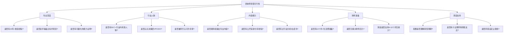
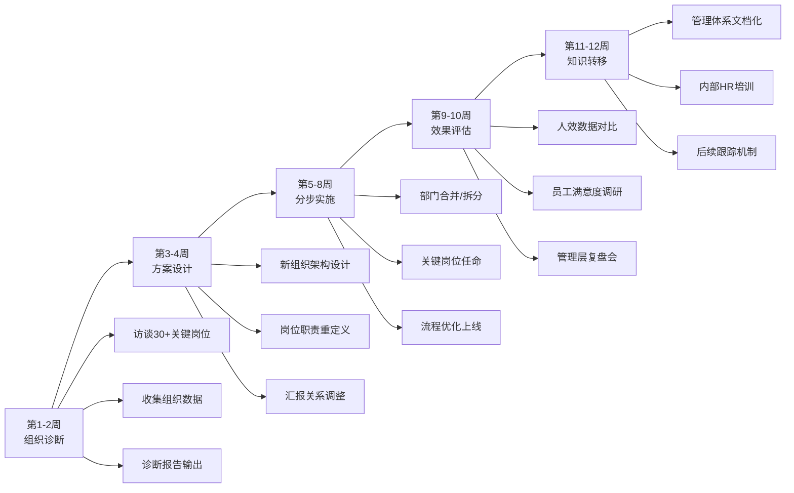
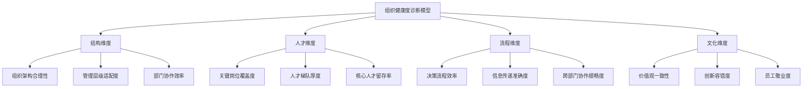
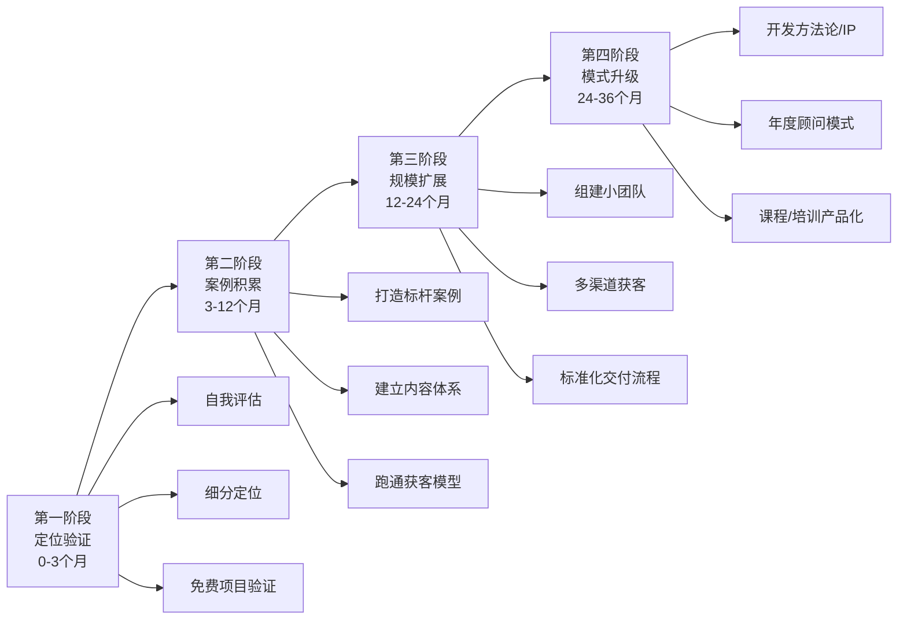

## 案例一：从HR到年入百万的企业管理咨询师

这是一个典型的"企业中层管理者转型独立咨询师"的成功案例。张敏的转型路径并非天赋异禀，而是遵循了一套可复制的方法论——精准定位、案例驱动、内容获客、商业模式升级。本节将完整拆解她从零到年入150万的每一步决策逻辑、关键动作和踩过的坑，帮助有类似背景的读者找到自己的转型路径。

### 一、人物背景与转型动因

#### 1.1 个人履历

张敏（化名），35岁，某互联网公司HRD（人力资源总监），从业12年。她的职业经历可以分为三个阶段：

| 阶段 | 时间 | 公司类型 | 职位 | 核心能力积累 |
|------|------|----------|------|-------------|
| 基础期 | 2009-2013 | 传统制造企业 | HR专员→HR主管 | 招聘、薪酬、劳动法合规 |
| 成长期 | 2013-2017 | 互联网创业公司 | HR经理→HRBP负责人 | 组织诊断、业务理解、跨部门协作 |
| 成熟期 | 2017-2021 | 头部互联网公司 | HRD | 组织架构设计、人才梯队建设、企业文化落地 |

#### 1.2 转型的三个核心动因

**动因一：职业天花板。** 在企业内部，HRD已经是HR序列的最高职位。往上看，要么转向COO（首席运营官），要么转向CHO（首席人力资源官），但这两个岗位在中国企业中数量极少，且往往需要"天时地利人和"。张敏评估了自己在企业内再往上走的概率，发现不足10%。

**动因二：能力溢出。** 12年积累的组织管理能力，已经远远超过了她在一家公司内能够施展的范围。她曾经帮公司搭建的组织架构体系，被行业内的朋友拿去参考，效果也很好。这让她意识到，自己的能力是可以跨公司复用的。

**动因三：收入杠杆。** 作为HRD，年薪约60万（含奖金和期权）。但她观察到，跟她能力相当甚至不如她的同行，转型做咨询后收入远超这个数字。关键差距在于：企业内的薪水是线性增长的，而咨询收入是指数增长的——当你的方法论被验证后，同样的知识可以卖给无数客户。

#### 1.3 转型前的自我评估清单

张敏在决定转型前，花了3个月做了一份详细的自我评估。这份评估清单后来被她总结为"咨询师转型可行性五维模型"：

张敏的自评结果：

| 维度 | 自评分数（1-10） | 说明 |
|------|-----------------|------|
| 专业深度 | 9 | 亲手搭建过3家公司组织架构，有量化数据支撑 |
| 行业人脉 | 8 | 12年积累，有10+VP级别朋友，但CEO级别较少 |
| 内容能力 | 6 | 写过内部方案但从未公开输出，需要从零开始 |
| 财务准备 | 7 | 有18个月生活费储备，但配偶有顾虑 |
| 家庭支持 | 6 | 配偶支持但设定了"12个月无起色就回去上班"的止损线 |

**评估结论：** 综合得分7.2，具备转型基础，但内容能力和家庭支持需要重点补强。张敏在正式离职前的3个月里，先把内容能力从6分补到了8分——开始在脉脉和LinkedIn上写文章，每周2篇，积累了第一批读者。

### 二、起步阶段：从零到第一个付费客户（第1-6个月）

#### 2.1 定位选择的底层逻辑

张敏没有选择做"万能管理咨询师"，而是聚焦在"互联网公司组织架构设计与人才梯队建设"这个极细分领域。

**为什么不能做万能咨询师？**

这是新手咨询师最常犯的错误。市场上有三类咨询师：

| 类型 | 获客方式 | 定价能力 | 可持续性 | 适合人群 |
|------|----------|----------|----------|----------|
| 万能型 | 什么项目都接 | 低（客户货比三家） | 差（没有复购和口碑） | 刚起步、急需收入的人 |
| 行业型 | 某个行业的综合咨询 | 中等 | 较好 | 有5年+行业经验的人 |
| 领域型 | 某个领域的深度咨询 | 高（客户无法替代） | 极好（形成壁垒） | 有10年+垂直经验的人 |

张敏选择的是第三类：领域型。她的定位是"互联网公司组织架构设计与人才梯队建设"，而不是"人力资源咨询"或"企业管理咨询"。区别在于：

- "人力资源咨询"太宽泛——客户不知道你擅长什么
- "企业管理咨询"更宽泛——跟麦肯锡竞争，毫无胜算
- "互联网公司组织架构设计与人才梯队建设"足够精准——客户一听就知道你能解决什么问题

**定位公式：**

> **定位 = 行业（互联网公司）× 领域（组织架构设计与人才梯队建设）× 你的独特优势（亲手搭建过3家公司）**

这个公式的每一个要素都不能省略。没有行业限定，你就没有精准客户；没有领域限定，你就没有专业壁垒；没有独特优势，你就没有差异化。

#### 2.2 获客策略：从零到第一批客户

张敏的获客策略分为三条线并行推进：

**第一条线：存量人脉激活（目标：2-3个免费诊断项目）**

她梳理了自己的人脉清单，筛选出20个已经做到VP、CEO级别的朋友。这20人中：
- 8人在创业公司（最可能有组织管理需求）
- 7人在成长期互联网公司（组织架构正在从混乱走向规范）
- 5人在成熟大厂（需求较少但可能有转介绍）

她给每个人都发了一条精心设计的消息，核心内容是：

> "我在做独立咨询，聚焦互联网公司的组织架构设计。最近帮一个朋友的公司做了一次组织诊断，发现了很多他们自己没意识到的问题。如果你公司也在快速扩张期，我可以免费帮你做一次组织健康度诊断，就当是老朋友聊天。"

这条消息的设计要点：
- **不谈钱** ——降低对方的心理门槛
- **给案例** ——说明你已经在做这件事了
- **降低预期** ——"就当是老朋友聊天"，让对方没有压力
- **触发需求** ——"快速扩张期"是互联网公司组织问题最突出的阶段

结果：20人中有6人回复，3人同意做免费诊断。这3个免费项目，成为张敏的种子案例。

**第二条线：公域内容获客（目标：建立专业人设）**

张敏在脉脉和LinkedIn上同时发力，每周发布2篇专业内容。她的内容策略是"三七法则"——70%干货（方法论、案例分析、行业洞察），30%个人故事（转型经历、项目心得、行业观点）。

**高转化内容的四个模板：**

模板一：痛点诊断型
> 标题："你的公司是否正在经历这5个组织病？"
> 结构：列出5个常见组织问题 → 每个问题给出自测方法 → 最后一个给出解决方案

模板二：案例拆解型
> 标题："200人互联网公司如何用3个月完成组织架构调整"
> 结构：背景 → 问题 → 方案 → 结果 → 关键决策点

模板三：方法论型
> 标题："组织健康度诊断的7个核心维度"
> 结构：提出框架 → 逐一展开 → 给出评估工具

模板四：行业洞察型
> 标题："2022年互联网公司组织管理的3个新趋势"
> 结构：趋势描述 → 案例佐证 → 应对建议

**第三条线：社群渗透（目标：获取精准流量）**

张敏加入了15个HR和企业管理相关的社群，包括：
- 脉脉上的"互联网HR"圈子
- 微信上的"HRBP成长群"（3个，每个200-500人）
- 知识星球上的"组织发展"社区
- 行业峰会的参会者群

她在社群中的策略不是直接推销，而是"先输出价值，再自然引流"：
- 主动回答别人提出的组织管理问题，给出有深度的回复
- 分享自己的文章链接，但附上一句"这只是我的个人经验，欢迎补充"
- 在群里做了一次免费分享（主题："互联网公司组织架构设计的5个常见坑"），吸引了30多人加她微信咨询

#### 2.3 起步阶段的财务模型

| 时间 | 收入来源 | 金额 | 说明 |
|------|----------|------|------|
| 第1-3个月 | 咨询项目 | 0 | 全力做品牌建设和案例积累 |
| 第1-3个月 | 培训/分享 | 0 | 免费分享为主 |
| 第4个月 | 免费诊断转付费 | 0 | 免费诊断客户尚未决策 |
| 第5个月 | 第一个付费项目 | 3万 | 100人互联网公司的组织诊断 |
| 第6个月 | 转介绍项目 | 1.5万 | 第一个客户推荐的朋友公司 |
| **合计** | | **4.5万** | **月均7500元，远低于上班收入** |

**关键心理节点：** 第4个月是张敏最焦虑的时候。前3个月有"全力做品牌"的心理预期，但第4个月仍然没有收入，她开始怀疑自己的选择。此时，她的止损线是"12个月无起色就回去上班"。第5个月的第一个付费项目，让她看到了曙光。

#### 2.4 起步阶段的关键动作复盘

| 动作 | 投入时间 | 产出效果 | ROI评估 |
|------|----------|----------|---------|
| 给20个VP/CEO朋友发消息 | 2小时 | 3个免费诊断项目 | 极高——最终转化为2个付费案例 |
| 脉脉+LinkedIn每周2篇文章 | 每周4小时×24周=96小时 | 累计5万+阅读，200+粉丝 | 中等——直接获客少，但建立了专业人设 |
| 社群免费分享 | 准备4小时+分享2小时 | 30+人咨询，3个精准线索 | 高——其中一个最终付费 |
| 白皮书制作 | 20小时 | 持续引流（后续6个月带来10+线索） | 高——一次投入，长期回报 |

### 三、成长阶段：从第一个付费客户到月入10万（第7-18个月）

#### 3.1 关键转折点：第一个标杆案例

张敏的第七个月，迎来了她咨询生涯的转折点——通过免费诊断转化的一个客户，给了她第一个正式的大项目。

**项目背景：**
- 客户：某B轮互联网公司，200人规模
- 痛点：业务快速扩张，但组织架构还是100人时的模式，部门墙严重，协作效率低下
- 预算：15万元（3个月项目周期）

**张敏的项目执行流程：**

**项目成果：**
- 组织架构从"职能型"调整为"事业部+中台"模式
- 人效（人均产出）提升40%
- 跨部门协作满意度从52%提升到78%
- 关键岗位人才流失率从18%降到7%

**这个案例为什么成为转折点？**

因为它满足了"标杆案例"的三个条件：

1. **可量化** ——人效提升40%，这个数字比任何描述都有说服力
2. **可展示** ——客户同意张敏在脱敏后使用这个案例（不透露公司名称，但透露行业、规模和成果）
3. **可复制** ——同类型公司（B轮、200人、互联网行业）遇到类似问题的概率极高，这个案例可以直接复用

#### 3.2 获客渠道升级

有了标杆案例后，张敏的获客方式发生了质变：

**渠道一：转介绍（占比从0提升到50%）**

转介绍是咨询行业最优质的获客渠道，因为：
- 客户信任成本最低（朋友推荐的天然信任）
- 获客成本为零（不需要投入营销费用）
- 成交率最高（转介绍的成交率约40-60%，远高于冷流量的5-10%）

张敏做了三件事来系统化转介绍：
- 在每个项目结束时，主动问客户："您身边有没有朋友的公司也遇到类似问题？"
- 给转介绍人设置感谢机制（不是佣金，而是"下次项目给你打9折"或送一份行业报告）
- 每季度给老客户发一份"行业洞察简报"，保持联系的同时展示自己仍在持续输出

**渠道二：机构合作（兼职讲师）**

张敏与某知名企业管理培训机构签约，成为兼职讲师。合作模式：
- 每场培训时长：1-2天
- 每场培训费：8000元（讲师费）
- 培训主题：组织架构设计、人才梯队建设、HRBP能力提升
- 频率：每月1-2场

机构合作的价值不仅在于收入，更在于：
- **品牌背书** ——"XX培训机构签约讲师"是一个有公信力的标签
- **精准流量** ——参加培训的都是企业HR或管理者，正是张敏的目标客户
- **案例积累** ——培训中会接触大量真实案例，丰富自己的方法论

**渠道三：内容引流（白皮书策略）**

张敏制作了一份《互联网公司组织诊断白皮书》，30页，包含：
- 5个真实案例（脱敏处理）
- 一套自测工具（组织健康度评估表）
- 3个常见问题的解决方案框架

这份白皮书免费发放，但需要留联系方式（姓名、公司、职位、手机号）。在6个月内，这份白皮书带来了150+条线索，其中10+个转化为付费客户。

**白皮书获客的核心逻辑：**
> 免费内容吸引关注 → 白皮书筛选精准线索 → 电话沟通建立信任 → 诊断项目转化为付费客户

#### 3.3 定价策略演进

张敏的定价策略经历了三个阶段：

| 阶段 | 定价方式 | 单价 | 客户心理 |
|------|----------|------|----------|
| 起步期 | 按项目定价 | 3-5万/项目 | "试试看，不行也不心疼" |
| 成长期 | 按天定价 | 5000元/天 | "专业顾问的日薪水平" |
| 成熟期 | 按价值定价 | 15-30万/项目 | "解决这个问题值这个价" |

**按价值定价的底层逻辑：**

当张敏能够证明"帮客户提升40%人效"时，她的收费就不再是"我花了多少天"，而是"我帮你创造了多少价值"。假设客户的年人力成本是2000万，人效提升40%意味着等效节省了800万。收30万的咨询费，只是客户收益的3.75%——这是一个极其划算的投资。

#### 3.4 成长阶段的财务模型

| 时间 | 月均收入 | 收入结构 | 说明 |
|------|----------|----------|------|
| 第7-9个月 | 4-5万 | 咨询3万+培训1-2万 | 开始有稳定项目流 |
| 第10-12个月 | 6-8万 | 咨询4-5万+培训2万+其他1万 | 大项目开始出现 |
| 第13-15个月 | 8-10万 | 咨询5-7万+培训2-3万 | 转介绍占比提升 |
| 第16-18个月 | 10-12万 | 咨询6-8万+培训3-4万 | 年度顾问客户开始出现 |

**18个月累计收入：约120万（税前）**

### 四、成熟阶段：从月入10万到年入150万（第19-36个月）

#### 4.1 商业模式的三次升级

张敏在成熟阶段经历了商业模式的三次关键升级：

**第一次升级：从"卖时间"到"卖项目"**

| 模式 | 计费方式 | 收入天花板 | 核心瓶颈 |
|------|----------|------------|----------|
| 卖时间 | 按天/按小时 | 200万/年（按1000个有效工作日） | 时间有限，一天只有24小时 |
| 卖项目 | 按项目定价 | 500万/年（按项目规模和数量） | 项目管理能力，需要团队支持 |
| 卖方法论 | 课程/工具/授权 | 无上限 | 知识产权保护，品牌影响力 |

**第二次升级：从"单兵作战"到"小团队"**

张敏在第20个月组建了2人小团队：
- **助理（月薪8000元）**：负责客户沟通、资料整理、日程安排、发票管理
- **初级顾问（月薪15000元+项目提成）**：负责基础调研、数据收集、报告撰写

团队的价值：
- 张敏的时间从"什么都做"聚焦到"客户沟通+方案设计+关键交付"
- 项目容量从同时做1-2个提升到同时做3-4个
- 客户体验提升（有专人对接，响应速度更快）

**第三次升级：从"项目制"到"年度顾问"**

年度顾问服务的模式：
- 合同周期：12个月
- 服务内容：每季度1次组织诊断+每月2次远程咨询+随时电话咨询
- 定价：30-50万/年
- 客户价值：相当于请了一个"外部HRD"，比全职HRD便宜50-70%

到第36个月，张敏有3个年度顾问客户，贡献了120-150万的稳定收入。

#### 4.2 核心差异化：组织健康度诊断模型

张敏在第24个月开发了一套"组织健康度诊断模型"，这是她最重要的知识资产。

**模型框架：**

每个维度下面有3-5个具体指标，每个指标有标准化的评估方法和评分标准。这套模型让张敏的诊断过程从"凭经验判断"升级为"体系化评估"，大大提升了交付质量和客户信任度。

#### 4.3 成熟阶段的财务模型

| 收入来源 | 年收入 | 占比 | 说明 |
|----------|--------|------|------|
| 咨询项目 | 90万 | 60% | 6个大项目，每个15万 |
| 培训收入 | 37.5万 | 25% | 45场培训，每场8000元+课酬分成 |
| 年度顾问 | 22.5万 | 15% | 3个客户，每个7.5万（均价） |
| **合计** | **150万** | **100%** | **税前，扣除团队成本后净利润约100万** |

**成本结构：**

| 成本项 | 月均 | 年均 | 说明 |
|--------|------|------|------|
| 团队薪资 | 2.3万 | 27.6万 | 助理8000+初级顾问15000 |
| 办公费用 | 3000 | 3.6万 | 共享办公空间 |
| 营销费用 | 2000 | 2.4万 | 内容制作、社群运营 |
| 差旅费用 | 5000 | 6万 | 客户现场调研 |
| 其他 | 2000 | 2.4万 | 工具、保险、财务等 |
| **合计** | **3.5万** | **42万** | **毛利率约72%** |

### 五、踩过的坑与避坑指南

#### 5.1 定位阶段的坑

**坑一：贪大求全。** 张敏最初想做"企业管理全案咨询"，覆盖战略、组织、人才、文化四个模块。但很快发现，客户对"全案咨询"的需求极少，而且会跟麦肯锡、BCG等大公司竞争。后来聚焦到"组织架构设计"这一个点，反而更容易获客。

**避坑方法：** 用"最小可行定位"（MVP）测试市场。先在一个极细分领域做3-5个项目，验证需求后再考虑扩展。

**坑二：定位太窄。** 张敏曾经想过只做"互联网公司OKR落地咨询"，但发现这个市场太小，每年可能只有几十个项目。后来扩展到"组织架构设计与人才梯队建设"，市场容量大了5-10倍。

**避坑方法：** 定位要"窄到足以建立壁垒，宽到足以支撑业务"。一个简单的判断标准：目标市场每年至少有100个潜在项目。

#### 5.2 获客阶段的坑

**坑三：过度依赖单一渠道。** 张敏在起步期过度依赖脉脉获客，结果脉脉改版后流量大幅下降，她的获客也受到严重影响。后来建立了"3+1"渠道矩阵（3个稳定渠道+1个试验渠道），才有了稳定的客户来源。

**坑四：免费项目做太多。** 张敏在前6个月做了5个免费项目，但只有2个转化为付费客户。后来她总结出一个原则：免费诊断最多做2次，超过2次的要收费（象征性收费1000-3000元，筛选出真正有需求的客户）。

**坑五：内容营销见效慢就放弃。** 张敏在第3个月时觉得写文章没什么效果，差点放弃。但坚持到第6个月后，内容营销的效果开始显现——有客户主动找上门说"看了你的文章，觉得你很专业"。

**避坑方法：** 内容营销至少坚持6个月再评估效果，但要优化内容策略（从泛泛而谈到针对具体痛点）。

#### 5.3 项目执行阶段的坑

**坑六：承诺过多，交付不足。** 张敏在第一个大项目中，为了争取客户同意，承诺了"人效提升30%"的硬指标。虽然最终做到了40%，但过程中承受了巨大压力。后来她学会了只承诺"过程指标"（如"完成组织诊断报告""输出架构调整方案"），而不是"结果指标"（如"人效提升X%"）。

**坑七：忽视知识转移。** 张敏在一个项目结束后，客户的问题又出现了，因为内部团队没有学会她的方法。后来她在每个项目中都增加了"知识转移"环节，确保客户团队能够独立维护和优化她设计的体系。

#### 5.4 定价阶段的坑

**坑八：按时间定价会陷入"天花板陷阱"。** 张敏在成长阶段按天收费（5000元/天），结果发现收入天花板很明显——一年最多工作250天×5000元=125万，还要扣税、扣成本。后来转向按项目定价，同样的工作量，收入提升了50-100%。

**坑九：不敢涨价。** 张敏的定价从3万/项目涨到15万/项目，中间经历了5次涨价。每次涨价前都担心客户流失，但实际结果是：涨价后客户质量反而提升了（愿意付高价的客户通常更专业、更配合、项目效果更好）。

### 六、可复制的行动框架

张敏的转型路径可以总结为一个"四阶段行动框架"：

**每个阶段的关键里程碑：**

| 阶段 | 里程碑 | 判断标准 | 达不到怎么办 |
|------|--------|----------|-------------|
| 第一阶段 | 定位验证 | 至少3个目标客户认可你的定位 | 换细分领域或调整定位 |
| 第二阶段 | 案例积累 | 至少1个标杆案例+可量化成果 | 深耕现有客户，追加服务 |
| 第三阶段 | 规模扩展 | 月均收入稳定在5万+ | 优化获客渠道或提升客单价 |
| 第四阶段 | 模式升级 | 年收入突破100万 | 开发新的收入来源或团队化 |

### 七、不同背景读者的适配建议

张敏的路径虽然成功，但不是唯一的。不同背景的读者需要做不同的调整：

#### 7.1 如果你是HR背景（与张敏类似）

你的优势是"懂组织、懂人"，这是咨询行业的核心能力。建议路径：
- 定位：选择你最擅长的HR模块（招聘、薪酬、绩效、组织发展等）
- 切入点：从"诊断"开始，帮企业发现问题，再自然转化为解决方案
- 差异化：积累行业数据和案例，形成自己的方法论

#### 7.2 如果你是业务管理者背景

你的优势是"懂业务、懂市场"，但可能缺乏HR的专业训练。建议路径：
- 定位：选择"业务+管理"的交叉领域（如销售团队管理、产品团队搭建）
- 切入点：从"陪跑"开始，用你自己的管理经验帮企业解决具体问题
- 补课：系统学习组织管理的理论框架（推荐《组织能力的杨三角》《重新定义团队》）

#### 7.3 如果你是技术管理者背景

你的优势是"懂技术、懂工程效率"，适合做技术团队管理咨询。建议路径：
- 定位：技术团队效能提升、工程文化建设、技术管理者教练
- 切入点：从"技术团队诊断"开始，用数据说话（交付周期、故障率、代码质量等）
- 差异化：技术背景的管理咨询师极其稀缺，这就是你的壁垒

### 八、核心要点总结

张敏的案例揭示了企业中层转型独立咨询师的五个核心规律：

**规律一：定位决定天花板。** 细分领域的专家比万能咨询师更容易成功。不要怕定位太窄——当你成为某个细分领域的"第一人"后，客户会主动来找你。

**规律二：第一个标杆案例是转折点。** 没有案例的咨询师就像没有作品的艺术家。前6个月的核心任务不是赚钱，而是打造一个可量化、可展示、可复制的标杆案例。

**规律三：内容营销是长期资产。** 文章、白皮书、分享视频不会立刻带来客户，但会在6-12个月后形成持续的流量和信任。坚持输出，时间会给你回报。

**规律四：商业模式升级是收入跃迁的关键。** 从卖时间到卖项目到卖方法论，每一步升级都带来收入数量级的提升。不要停留在"卖时间"的阶段——那是打工的逻辑，不是创业的逻辑。

**规律五：定价能力是专业能力的外化。** 不敢涨价的本质是不相信自己的价值。当你能够证明自己创造了10倍于收费的价值时，涨价就是理所当然的事。

张敏用36个月的时间，完成了一个HRD到年入150万独立咨询师的蜕变。她的路径不是最快的，但却是最扎实的——每一步都有清晰的方法论和可验证的结果。如果你有类似的专业背景和转型意愿，完全可以参考她的路径，走出自己的路。
