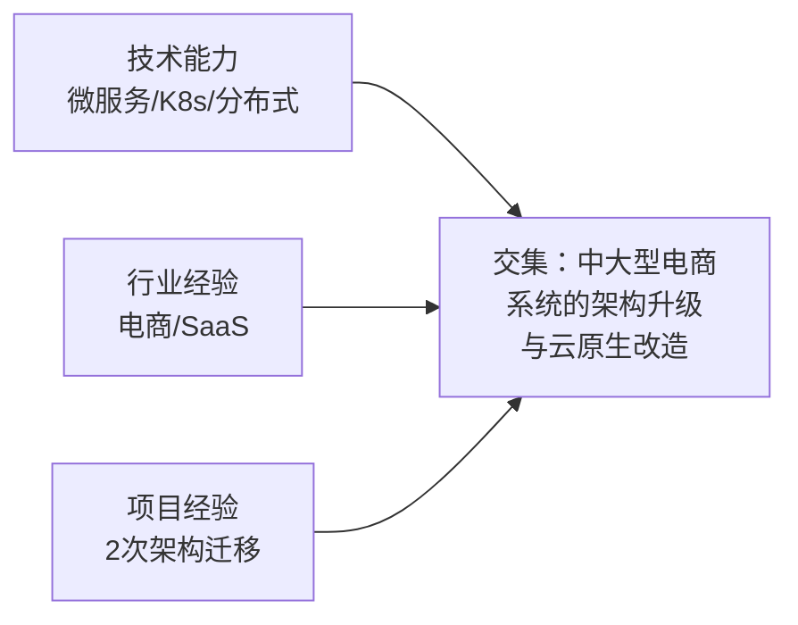

## 案例二：从工程师到行业技术顾问

### 案例背景

陈磊（化名），32岁，原某电商平台高级后端工程师，从业9年。技术栈以Java微服务、分布式系统、Kubernetes容器化为主，曾主导过两次大型系统架构迁移（从单体到微服务、从自建机房到混合云）。

2022年底，陈磊所在的电商公司经历裁员，他拿到了N+3的赔偿金。在重新找工作和自主创业之间，他选择了第三条路——成为一名独立技术顾问。

**为什么选择技术顾问而不是继续打工？**

| 维度 | 继续打工 | 技术顾问 |
|------|----------|----------|
| 收入天花板 | 月薪3-5万，年包40-60万 | 单项目2-10万，年收入无上限 |
| 时间自由度 | 996/007，随叫随到 | 自主安排，但需要配合客户节奏 |
| 技能复利 | 纵向深入单一技术栈 | 横向接触多行业、多场景 |
| 风险 | 公司裁员风险 | 客户断供风险 |
| 成长曲线 | 线性增长 | 前期低谷，后期指数增长 |

陈磊的判断是：自己在技术深度上已经足够，但在行业广度和商业思维上还有欠缺。做技术顾问可以同时补齐这两个短板，而且9年的技术积累已经足够支撑他输出高质量的建议。

***

### 第一阶段：定位与试水（第1-3个月）

#### 精准定位：从"我会什么"到"市场需要什么"

陈磊最初的想法是"什么都做"——系统架构设计、性能优化、代码审查、技术选型、团队搭建。但他很快意识到，这种"全能型"定位在获客时毫无竞争力。

**他做了一个关键动作：盘点过去9年的工作经历，找到交集。**

最终定位公式：**我帮助中大型电商企业（年GMV 1亿-50亿）完成从单体架构到微服务的平稳迁移，通过我自研的"渐进式拆分五步法"将迁移风险降低70%。**

**定位的核心逻辑：**

1. **目标客户明确**——不是所有企业，而是中大型电商。太小的企业没有架构迁移需求，太大的企业有自己的架构师团队
2. **痛点足够痛**——架构迁移是电商企业的"心脏手术"，做不好就是系统崩溃、数据丢失、业务停摆。老板愿意花大价钱降低这个风险
3. **方法论差异化**——不是泛泛地说"我能做架构"，而是有自己的一套方法论（"渐进式拆分五步法"），让客户觉得你有体系，不是拍脑袋

#### 打造第一批背书：从免费开始

陈磊知道，没有案例的顾问等于没有信任。他用了三个月时间做三件事：

**第一件：技术博客输出**

在掘金和知乎上连载了一套《电商系统架构演进实战》系列文章，共12篇。每篇3000-5000字，包含真实的架构图、性能对比数据、踩坑记录。这套文章累计获得了5万+阅读量，其中3篇被推荐到首页。

**关键细节：** 陈磊没有写泛泛的"微服务架构"科普，而是聚焦在电商场景——订单系统拆分、库存一致性保障、支付链路优化、大促弹性扩容。这种垂直内容比通用内容的获客效率高10倍。

**第二件：免费技术诊断**

通过前同事介绍，找到3家有架构问题的中小电商企业，主动提出免费做一次"架构健康诊断"。诊断内容包括：

- 现有架构的问题梳理（出一份20页的诊断报告）
- 改进方向和优先级排序
- 预估改进后的性能提升和成本节约

**这3份免费诊断报告，成为陈磊最有说服力的销售工具。**

**第三件：开源工具**

陈磊把工作中积累的Kubernetes部署脚本和监控配置模板整理成一个开源项目（`k8s-ecommerce-toolkit`），发布在GitHub上。虽然Star数只有200+，但在面试和提案中，这个项目证明了他的技术落地能力。

**三个月成果：**
- 掘金/知乎粉丝：3000+
- 咨询意向客户：8个（都是看完文章主动联系的）
- 付费客户：0（还在积累阶段）

***

### 第二阶段：第一桶金（第4-8个月）

#### 第一个付费项目的获取

第4个月，通过一篇文章的评论区，陈磊认识了一位B轮电商公司的CTO。这家公司正在经历"成长的烦恼"——日订单量从1万涨到10万，原有单体系统频繁宕机，但团队又不敢轻易做微服务改造。

陈磊用免费诊断报告作为敲门砖，花了一周时间深入了解这家公司的技术现状。然后他提交了一份详细的提案：

**提案核心内容：**

| 模块 | 内容 | 交付物 | 周期 |
|------|------|--------|------|
| 现状评估 | 深度分析现有架构瓶颈 | 《架构评估报告》 | 2周 |
| 方案设计 | 渐进式微服务迁移方案 | 《迁移方案设计书》 | 2周 |
| 落地陪跑 | 关键模块拆分的技术指导 | 每周1次现场+随时远程 | 8周 |
| 效果验收 | 性能测试与稳定性验证 | 《验收报告》 | 2周 |

**报价：8万元，分三期支付（签约30%、中期30%、验收40%）。**

客户犹豫了两天，最终签约。原因是：陈磊的免费诊断报告已经展示了专业度，而且他承诺"如果第一阶段评估后发现不需要做微服务迁移，退还全部费用"——这个对赌条款让客户觉得陈磊是真心为他们着想，而不是想赚咨询费。

#### 项目的执行与交付

这个项目持续了3个月。陈磊每周到客户公司一天，其余时间远程支持。他的工作不是"替客户写代码"，而是：

1. **诊断阶段**：用链路追踪工具（SkyWalking）分析全链路性能瓶颈，用数据库慢查询日志定位核心问题。最终发现80%的性能问题集中在订单和库存两个模块，不是整个系统都需要重构
2. **方案设计**：采用"绞杀者模式"（Strangler Fig Pattern），先将订单模块从单体中剥离为独立服务，通过API网关路由流量，新旧系统并行运行。等新服务稳定后再迁移下一个模块
3. **落地陪跑**：指导客户团队完成第一个微服务的拆分。陈磊不写代码，而是通过代码审查、架构评审、技术方案讨论的方式赋能团队
4. **效果验收**：订单服务的接口响应时间从800ms降到120ms，系统可用性从99.5%提升到99.95%

**项目结束后，客户CTO在朋友圈发了一条推荐，直接带来了3个新客户的咨询。**

#### 收入情况

- 第4-5个月：单项目收入8万
- 第6-8个月：通过转介绍接到2个项目，分别是5万和12万
- 月均收入：约2.5-3万（因为项目制收入有波动）

***

### 第三阶段：规模化（第9-18个月）

#### 产品化：从"卖时间"到"卖方法论"

做了3个项目之后，陈磊发现一个规律：80%的电商企业面临的架构问题高度相似——都是"单体扛不住了，想做微服务但不知道怎么下手"。他开始把自己的咨询过程产品化。

**产品一：《电商架构健康度体检》**

固定价格2万元，2周交付。包含：
- 系统架构全景图绘制
- 性能瓶颈Top 5分析
- 架构演进路线图（3个月/6个月/12个月）
- 技术团队能力评估

这个产品化服务的目的是"引流"——客户做完体检，大概率会继续购买后续的架构迁移陪跑服务。

**产品二：《微服务迁移全程陪跑》**

价格8-20万，周期2-6个月。这是核心收入来源。

**产品三：《技术顾问年度服务》**

价格30-50万/年，包含：
- 每月1次架构评审
- 随时技术问题咨询（48小时内响应）
- 重大技术决策的方案支持
- 每季度1次技术团队培训

#### 获客渠道升级

| 渠道 | 占比 | 具体做法 |
|------|------|----------|
| 老客户转介绍 | 45% | 每个项目结束后主动请求推荐，推荐成功赠送1次免费技术评审 |
| 技术内容引流 | 30% | 维持掘金/知乎/公众号的更新频率（每周1篇深度文章） |
| 行业社群 | 15% | 加入电商CTO社群、技术VP社群，在群内提供免费的技术建议 |
| 培训机构合作 | 10% | 与某技术培训机构合作，做企业内训讲师（每场1.5万） |

**关键转折点：** 第12个月，陈磊受邀在某电商行业峰会上做了一次30分钟的演讲，主题是《电商系统从单体到微服务的血泪教训》。这次演讲让他在行业内打开了知名度，之后一个月内收到了15个咨询意向。

#### 团队搭建

第15个月，陈磊发现自己的时间已经排满（利用率超过90%），开始组建小团队：

- 1名初级顾问（从客户公司的技术骨干中挖来的），负责执行层面的技术指导
- 1名兼职助理，负责项目管理、文档整理、客户沟通

团队搭建后，陈磊可以同时推进3个项目，自己专注于需求诊断、方案设计和关键节点评审，执行层面的工作交给初级顾问。

#### 收入情况

| 时间 | 月均收入 | 收入构成 |
|------|----------|----------|
| 第9-12个月 | 5-8万 | 架构体检（40%）+ 迁移陪跑（50%）+ 培训（10%） |
| 第13-18个月 | 10-15万 | 迁移陪跑（50%）+ 年度顾问（30%）+ 培训/体检（20%） |

***

### 第四阶段：行业影响力（第19-36个月）

#### 从"接项目"到"被邀请"

到了第19个月，陈磊已经不再需要主动获客。他的客户来源变成了：

1. **老客户复购和升级**——之前做过架构体检的客户，回来做迁移陪跑；做过迁移陪跑的客户，签约年度顾问
2. **行业口碑传播**——在电商技术圈，"做微服务迁移找陈磊"已经成为一种共识
3. **被动获客**——技术文章和演讲带来的长尾流量

#### 知识资产沉淀

陈磊开始把三年的咨询经验沉淀为可复用的知识资产：

**资产一：《电商架构迁移实战手册》**

一本200页的电子书，涵盖了从评估到迁移到验收的全流程。定价199元，在知识星球和公众号销售，累计卖出800+份。

**资产二：技术培训课程**

在某技术教育平台上线了一门《电商微服务架构实战》录播课，定价699元。课程内容来自真实咨询案例（已脱敏），包含可运行的代码Demo。上线6个月，累计收入12万。

**资产三：架构评估工具**

把咨询过程中常用的检查清单和评估模板，开发成一个SaaS小工具（MVP阶段，基于Notion模板）。免费版引流，付费版（99元/月）提供深度分析。

#### 收入情况

| 时间 | 年收入 | 收入构成 |
|------|--------|----------|
| 第2年 | 120万 | 咨询项目（55%）+ 年度顾问（25%）+ 培训/课程（15%）+ 出版/工具（5%） |
| 第3年 | 180万 | 咨询项目（40%）+ 年度顾问（35%）+ 培训/课程（15%）+ 出版/工具（10%） |

**注意收入结构的变化：** 咨询项目的占比在下降，年度顾问和知识产品的占比在上升。这意味着陈磊正在从"卖时间"过渡到"卖价值"和"卖资产"。

***

### 核心数据对比

| 指标 | 起步时（第1个月） | 成长期（第12个月） | 成熟期（第36个月） |
|------|-------------------|-------------------|-------------------|
| 月收入 | 0 | 8万 | 15万 |
| 累计客户数 | 0 | 8个 | 35个 |
| 客户复购率 | 0% | 50% | 70% |
| 转介绍占比 | 0% | 30% | 50% |
| 日均工作时间 | 12小时（学习+写作） | 8小时 | 6小时 |
| 有效利用率 | N/A | 70% | 55%（更多时间用于品牌和产品） |

***

### 技术顾问的特殊挑战与应对

工程师转型技术顾问，会遇到一些独特的挑战，这些是其他类型的咨询师不会面对的：

#### 挑战一：技术能力的"折旧"问题

技术更新换代极快。3年前的热门技术，今天可能已经过时。如果顾问的技术能力停滞不前，很快就会被客户淘汰。

**陈磊的应对策略：**
- 每天花1小时阅读技术博客和开源项目更新
- 每季度学习一项新技术（不是浅尝辄止，而是能用到项目中的程度）
- 通过实际项目保持技术手感——他仍然会自己写核心模块的Demo代码

#### 挑战二：从"执行者"到"指导者"的心态转变

工程师习惯自己动手解决问题，但顾问的价值是"让客户自己解决问题"。很多技术顾问犯的错误是：到了客户现场，忍不住自己上手写代码，结果变成了"外包程序员"而不是"顾问"。

**陈磊的应对策略：**
- 硬性规定自己不替客户写生产代码
- 通过Code Review、架构评审、技术方案讨论的方式赋能团队
- 如果客户团队确实缺乏能力，推荐靠谱的外包团队，自己做技术监理

#### 挑战三：技术方案的"政治化"

技术问题往往不只是技术问题。比如：客户公司的某个技术决策是CTO亲自做的，你的方案等于在否定CTO的判断。这时候如果处理不好，项目就会失败。

**陈磊的应对策略：**
- 诊断报告只陈述事实和数据，不做价值判断
- 方案设计时预留"面子空间"——比如"当时选择这个方案是合理的，但随着业务增长，现在需要升级了"
- 关键决策通过工作坊（Workshop）的形式，让客户团队自己得出结论，而不是顾问单方面输出

#### 挑战四：定价的心理障碍

工程师普遍有一个心理障碍：觉得自己"只是动动嘴皮子"，不好意思收高价。陈磊在第一个项目报价8万时，内心也纠结了很久。

**突破方法：**
- 换算价值：客户的系统如果宕机一天，损失至少50万。8万的咨询费帮客户避免了50万的损失，这个账怎么算都划算
- 对标行业：麦肯锡的顾问按天收费2-5万，你的专业度不比他们差，凭什么不能收费？
- 看客户反馈：如果客户觉得你的报价"很便宜"，说明你定价低了

***

### 经验总结：工程师转型技术顾问的七条铁律

1. **先做深度，再做广度**——在一个技术领域做到前10%，才有资格做顾问。"什么都会一点"是最没有价值的定位

2. **案例是最好的销售工具**——第一个成功案例的价值远超100篇文章。前3个项目可以不赚钱，但一定要做出可量化的成果

3. **方法论比技术更重要**——客户找你不是因为你会写代码，而是因为你有一套解决问题的方法论。把你的经验提炼成可复用的框架和流程

4. **学会"不写代码"**——技术顾问的核心能力不是编码，而是诊断问题、设计方案、指导团队。如果你总忍不住自己写代码，说明你还没完成从工程师到顾问的转变

5. **内容营销是技术顾问的最佳获客方式**——技术人群天然信任"写得出来"的人。持续输出高质量的技术文章，是成本最低、效果最好的获客方式

6. **从项目制走向产品化**——当你的项目经验足够多，要把重复性的工作提炼成标准化产品（体检服务、培训课程、评估工具），才能突破时间的天花板

7. **技术能力要持续更新**——技术顾问如果技术落伍了，就失去了立身之本。保持学习，保持一线技术手感，这是技术顾问与其他类型顾问最大的不同

***

### 附：陈磊的第一年财务明细（供参考）

| 项目 | 金额 | 说明 |
|------|------|------|
| 总收入 | 45万 | 9个月的实际收入（前3个月为0） |
| 咨询项目收入 | 33万 | 5个项目，均价6.6万 |
| 培训收入 | 7万 | 5场企业内训，均价1.4万 |
| 体检服务收入 | 5万 | 10个体检服务，均价0.5万 |
| 总支出 | 12万 | 含工具订阅、差旅、内容制作、社群费用 |
| 净利润 | 33万 | 净利润率约73% |
| 同期打工对比 | 约45万（年薪） | 但扣除通勤、加班的隐性成本后实际差异不大 |

**关键洞察：** 第一年的净收入（33万）和打工收入（约45万）看似差距不大，但考虑到陈磊每天只工作6-8小时、自主安排时间、且第2年收入直接翻倍到120万，这个转型的ROI（投入产出比）是非常高的。

***
