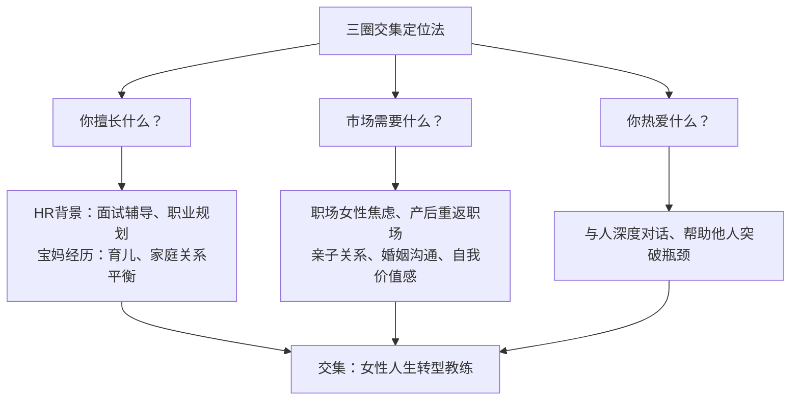
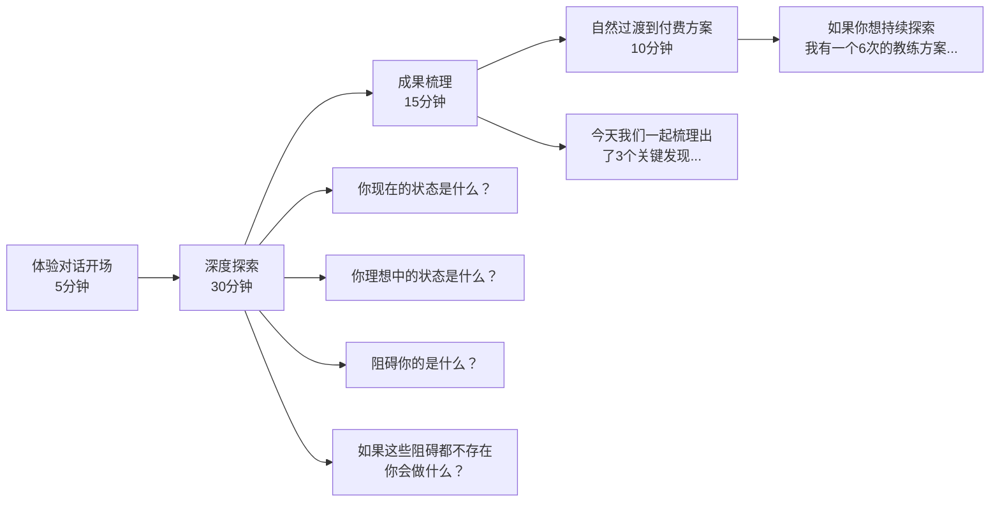
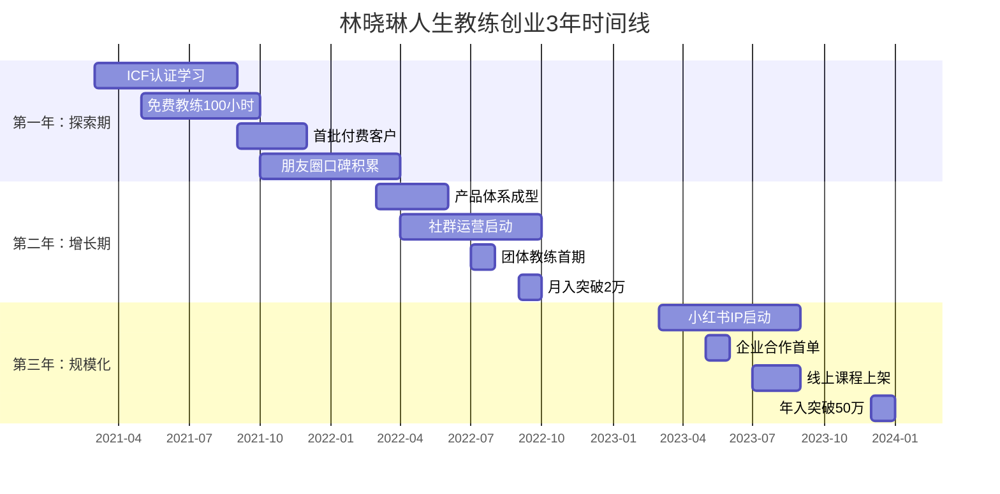

## 案例三：从宝妈到年入50万的人生教练

> 一个全职宝妈如何在3年内从零起步，通过人生教练（Life Coach）这条路实现年收入50万？本案例拆解从定位、获客、交付到规模化的完整路径，每个阶段都有可复用的方法论。

### 案例主人公画像

| 维度 | 详情 |
|------|------|
| 化名 | 林晓琳（已获授权，部分信息脱敏） |
| 年龄 | 32岁开始转型，35岁达成年入50万 |
| 背景 | 前互联网公司HR经理，二胎后全职在家3年 |
| 起点资源 | 微信好友约800人，无粉丝基础，无教练资质 |
| 转型周期 | 第1年探索期（年入8万）→ 第2年增长期（年入28万）→ 第3年稳定期（年入52万） |
| 核心定位 | 帮助25-40岁职场女性在人生转型期重建自信与方向感 |

### 第一阶段：定位与冷启动（第1-6个月）

#### 自我盘点：从过往经历中找到切入点

林晓琳做了一件事——用"三圈交集法"找定位：



**关键决策**：不选"育儿博主"（竞争红海），不选"职业规划师"（需大量行业积累），而是选"人生教练"这个定位——帮女性在身份转换期（职场→宝妈→重返职场）找到方向。

**定位的底层逻辑**：人生教练（Life Coach）与心理咨询师的区别在于——心理咨询处理"过去的问题"，人生教练聚焦"未来的行动"。这降低了入行门槛，同时更符合目标客群的需求：她们不需要治病，需要有人帮她们理清思路、制定计划、监督执行。

#### 获取首批资质与信任背书

人生教练行业没有国家强制认证，但客户信任需要背书。林晓琳的路径：

1. **考取ICF认证课程**：报名ICF（国际教练联合会）ACC级别的认证培训，费用约2万元，学习时长6个月。这是行业内认可度最高的认证体系。
2. **完成100小时免费教练时数**：ICF ACC认证要求至少100小时付费教练经验，但林晓琳在正式收费前先做了100小时免费教练，既积累经验，又收集客户见证。
3. **建立"可验证的专业形象"**：不是简单说自己是教练，而是把ICF认证、教练时数、客户评价全部展示在个人介绍中。

```text
林晓琳的个人介绍模板（微信朋友圈置顶）：

【我是谁】
林晓琳 | ICF认证人生教练（ACC）
前互联网HR经理 | 二胎宝妈 | 人生转型亲历者

【我帮谁】
帮助25-40岁职场女性在人生转型期
理清方向 → 重建自信 → 找到行动路径

【我的教练时数】
累计教练对话 200+ 小时 | 服务客户 50+ 人

【客户怎么说】
"跟晓琳聊了3次，我终于想清楚要不要辞职创业了。"
——某互联网公司运营经理

【预约体验】
首次体验教练对话（60分钟）免费
扫码预约 ↓
```

#### 首批客户从哪来？

林晓琳没有一个粉丝，微信好友只有800人。她的冷启动策略：

**第一步：朋友圈"种子内容"测试（第1-2周）**

不是直接发广告，而是发"引发共鸣的内容"：

- "全职带娃3年，今天第一次去面试，HR问'你这几年都在干嘛'，我竟不知道怎么回答。"
- "老公说'你又不上班，带个孩子能有多累'，我竟然没法反驳。"
- "孩子上幼儿园了，我突然不知道自己该干什么了。"

这些内容来自她的真实经历，但也是目标客群的共同痛点。每条朋友圈下面都有人评论"我也是"，这就是潜在客户。

**第二步：一对一私聊筛选（第3-4周）**

对评论"我也是"的朋友，私聊时不推销，而是问："你现在最困扰的是什么？"用教练式提问做一次20分钟的免费对话，对话结束时说："如果你觉得有帮助，我可以给你做一次正式的体验教练对话，60分钟，免费。"

**第三步：体验对话→付费转化（第5-8周）**

体验对话是核心转化节点。流程设计：



**转化率数据**：前20个免费体验对话中，8人转化为付费客户，转化率40%。定价：6次教练对话套餐，定价3000元（每次500元）。

### 第二阶段：产品打磨与口碑积累（第7-18个月）

#### 产品体系设计

林晓琳逐步构建了三层产品体系：

| 层级 | 产品名称 | 定价 | 服务内容 | 目标 |
|------|----------|------|----------|------|
| 引流层 | 体验教练对话 | 免费 | 60分钟1对1对话 | 获客转化 |
| 基础层 | 1对1教练套餐 | 3000元/6次 | 每周1次60分钟对话+日常微信答疑 | 核心收入 |
| 进阶深度 | 深度转型陪跑 | 12000元/3个月 | 12次教练对话+职业规划+简历优化+面试辅导 | 高客单价 |
| 团体层 | 女性成长小组 | 999元/人/8周 | 8人小组，每周1次90分钟团体教练 | 规模化 |

**为什么这样设计？**

- 引流层解决"信任门槛"——免费降低决策成本
- 基础层是"利润核心"——3000元在目标客群（有收入或家庭支持的职场女性）的支付能力范围内
- 进阶深度解决"深度需求"——有些客户需要的不只是对话，还需要具体的职业规划和求职支持
- 团体层解决"时间天花板"——1对1教练的时间是有限的，团体教练可以同时服务8人

#### 服务交付的标准化

很多人生教练的问题是"每次对话质量不稳定"。林晓琳的做法是建立标准化的教练流程：

**单次教练对话SOP：**

```text
阶段一：签到（5分钟）
├── "上次对话后，你有什么新的发现或行动？"
├── 回顾上次的行动承诺完成情况
└── 确认本次对话的主题

阶段二：探索（30分钟）
├── 用GROW模型推进
│   ├── Goal（目标）："这次对话你最想得到什么？"
│   ├── Reality（现状）："目前的情况是怎样的？"
│   ├── Options（选择）："你有哪些可能的选择？"
│   └── Will（意愿）："你最想采取的行动是什么？"
├── 关键教练技术
│   ├── 深度聆听：不打断，不评判
│   ├── 强有力提问：开放式、面向未来
│   └── 直接反馈：说出客户没看到的盲点
└── 避免：给建议、讲道理、分享自己的经历

阶段三：整合（15分钟）
├── "今天对话中最重要的3个发现是什么？"
├── "你接下来要采取的具体行动是什么？"
└── "这个行动你需要在什么时候完成？"

阶段四：收尾（5分钟）
├── 确认下次对话时间
├── 发送对话笔记（24小时内）
└── 微信跟进（对话后第3天）
```

**对话笔记模板：**

```text
【教练对话笔记】
客户：XXX | 日期：2024-XX-XX | 第X次对话

本次主题：
客户的核心发现：
1.
2.
3.

行动承诺：
- 具体行动：
- 完成时间：
- 可能的障碍：

教练观察（内部记录，不发给客户）：
- 客户的情绪状态：
- 值得深入探索的点：
- 下次可以关注的方向：
```

#### 口碑裂变机制

**机制一：里程碑见证**

每当客户完成一个重要目标（比如重返职场、完成第一次创业尝试、改善了亲密关系），林晓琳会邀请客户录制一段1分钟的视频见证，或者写一段文字见证。这些见证被整理成"客户故事"系列内容。

**机制二：转介绍奖励**

老客户推荐新客户成功付费后，老客户获得一次免费的教练对话。这不是简单的"返现"，因为目标客群更在意"被认可"而非"省钱"。

**机制三：社群运营**

建立了一个500人的微信社群"她力量成长圈"，每周三晚8点做一次30分钟的免费主题分享，内容来自教练对话中常见的共性问题（脱敏处理后）。这个社群既是内容分发渠道，也是潜在客户池。

### 第三阶段：突破收入天花板（第19-36个月）

#### 瓶颈分析

到第18个月时，林晓琳的月收入稳定在2.5万左右，年化约30万。但她面临一个关键瓶颈：

| 瓶颈 | 具体表现 |
|------|----------|
| 时间天花板 | 1对1教练每月最多服务20个客户，已经接近上限 |
| 定价天花板 | 本地市场对人生教练的接受度有限，提价空间不大 |
| 获客瓶颈 | 朋友圈和社群的流量已经挖掘得差不多了 |

#### 突破策略一：内容IP化

从"私域教练"转向"公域IP+私域转化"：

**小红书运营策略：**

- 账号定位："HR转型人生教练 | 帮职场女性找到方向"
- 内容方向：职场焦虑、身份转换、自信重建、亲密关系中的自我
- 发布频率：每周3-4篇图文笔记
- 爆款公式：痛点场景 + 真实故事 + 教练视角的洞察 + 行动建议

**爆款内容示例：**

```text
标题：全职妈妈5年，我终于想通了一件事

正文：
孩子上幼儿园的第一天，
我站在校门口哭了。
不是因为舍不得，
是因为我不知道接下来该干嘛。

回到家，空荡荡的房间，
我突然意识到——
我把"妈妈"这个角色当成了全部，
却把"自己"弄丢了。

后来我做了人生教练才知道，
这不是我一个人的问题。
90%的全职妈妈都经历过这个阶段。

我用了3个月时间，
做了这几件事：
1. 列出"除了妈妈，我还是谁"的清单
2. 每天给自己30分钟"独处时间"
3. 找到一个能让我有成就感的小项目
4. 跟一个能理解我的人深度对话

现在，我是一名帮助女性找回自己的人生教练。
如果你也在经历这个阶段，评论区聊聊。

#全职妈妈 #人生教练 #女性成长 #职场女性
```

**小红书数据（6个月后）：**
- 粉丝：1.2万
- 爆款笔记（点赞>1000）：8篇
- 每月通过小红书新增咨询客户：15-20人
- 转化率：约20%（从咨询到付费）

#### 突破策略二：团体教练规模化

将1对1教练升级为"团体教练"模式：

| 对比维度 | 1对1教练 | 团体教练 |
|----------|----------|----------|
| 单次服务人数 | 1人 | 8人 |
| 单次时长 | 60分钟 | 90分钟 |
| 单人定价 | 500元/次 | 999元/8周（约125元/次） |
| 单次收入 | 500元 | 约1000元（8人×125元） |
| 客户体验 | 深度个性化 | 有同伴支持、互相启发 |
| 时间效率 | 1倍 | 约2倍 |

**团体教练的具体运营：**

- 每期8人，为期8周
- 每周1次90分钟线上会议（腾讯会议/Zoom）
- 结构：开场签到（15分钟）→ 主题探索（45分钟）→ 两两对话（20分钟）→ 总结行动（10分钟）
- 配套：微信群日常交流 + 每周行动打卡

**团体教练的额外价值**：参与者之间形成"同频社群"，很多人在课程结束后仍然保持联系，形成自发的互助网络。这种"社群效应"是1对1教练无法提供的。

#### 突破策略三：企业合作

随着个人品牌建立，林晓琳开始接到企业合作：

- **企业EAP（员工帮助计划）**：为科技公司女性员工做"职场妈妈平衡"主题的团体辅导，单次费用5000-8000元
- **女性领导力工作坊**：与HR部门合作，为企业中层女性管理者做半天工作坊，费用1-2万元
- **线上课程**：将教练对话中的高频问题整理成录播课程《职场女性转型指南》，定价199元，上架知识星球

### 收入结构拆解（第3年：年入52万）

| 收入来源 | 月均收入 | 年收入 | 占比 |
|----------|----------|--------|------|
| 1对1教练（8个活跃客户） | 12,000元 | 144,000元 | 28% |
| 团体教练（每月1期） | 8,000元 | 96,000元 | 18% |
| 深度陪跑（2个客户/季度） | 8,000元 | 96,000元 | 18% |
| 企业合作（季度1-2次） | 8,000元 | 96,000元 | 18% |
| 线上课程+社群 | 4,500元 | 54,000元 | 10% |
| 转介绍带来的新客户首单 | 3,000元 | 36,000元 | 7% |
| **合计** | **43,500元** | **522,000元** | **100%** |

### 关键里程碑时间线



### 她踩过的8个坑

**坑1：一开始就想做大而全**

最初林晓琳想做"女性全能教练"——职业、情感、育儿、健康全覆盖。结果定位模糊，客户不知道她到底擅长什么。后来聚焦"职场女性人生转型"后，获客效率提升3倍。

**坑2：低价引流→亏本运营**

初期定价600元/6次（100元/次），结果吸引来的客户大多是"贪便宜"的，配合度低，行动承诺完成率不到30%。提价到3000元/6次后，客户质量明显提升，行动完成率达到75%。

**坑3：只做教练，不做内容**

前6个月纯靠朋友圈和私聊获客，增长缓慢。第7个月开始系统化输出内容后，每月新增客户从2-3人提升到8-10人。

**坑4：对话笔记不写或写太细**

最初不写对话笔记，导致下次对话时忘记了客户的关键信息。后来写得太详细（每次1000+字），占用大量时间。最终找到平衡：结构化模板，每次200-300字，24小时内发送给客户。

**坑5：过度共情导致角色越界**

有位客户在教练对话中倾诉婚姻问题时哭了，林晓琳忍不住给出建议"你应该考虑离婚"。事后督导指出这是严重越界——教练不给建议，更不做判断。后来她接受了10小时的督导训练，学会了在共情和保持教练角色之间找到平衡。

**坑6：忽视商业运营**

前1年半没有记账、没有CRM、没有合同模板。后来一个客户要求开发票，她手忙脚乱。建议从第一天就用简单的工具管理：Excel记账、微信标签管理客户、石墨文档做合同。

**坑7：免费时间给太多**

"我请你喝咖啡聊聊"式的免费对话太多，导致每月有20+小时的免费服务时间。后来严格设定：每月5个免费体验名额，超出的预约排到下个月。

**坑8：单打独斗不加入行业社群**

前1年都是自己摸索，效率很低。后来加入ICF中国社区和几个教练同行群，获得了督导资源、合作机会和转介绍。

### 可复制的方法论总结

#### 人生教练创业的5个核心公式

```text
公式1：定位 = 个人经历 × 市场需求 × 差异化
  → 不是选最热门的方向，而是选"你独特经历能支撑"的方向

公式2：冷启动 = 免费体验 × 教练式对话 × 自然转化
  → 不是推销，是让客户在对话中自己感受到价值

公式3：口碑 = 服务深度 × 客户见证 × 转介绍机制
  → 每一个满意客户都是你的销售员

公式4：规模化 = 内容IP × 团体产品 × 企业合作
  → 突破时间天花板的三条路

公式5：持续增长 = 专业精进 × 督导支持 × 行业连接
  → 教练不是一个"学完就完"的职业
```

#### 从零到年入50万的关键节点清单

| 阶段 | 时间 | 关键动作 | 收入目标 |
|------|------|----------|----------|
| 资质准备 | 第1-6个月 | 考ICF认证、完成100小时免费教练 | 0 |
| 冷启动 | 第7-9个月 | 朋友圈获客、体验对话转化 | 3000-5000元/月 |
| 产品打磨 | 第10-18个月 | 建立产品体系、标准化交付 | 1-2万元/月 |
| 内容IP | 第19-24个月 | 小红书/公众号运营、个人品牌 | 2-3万元/月 |
| 规模化 | 第25-36个月 | 团体教练+企业合作+线上课程 | 4-5万元/月 |

#### 不适合做人生教练的人

并非所有人都适合走这条路。以下情况建议谨慎：

- **需要稳定现金流的人**：人生教练的冷启动期至少6个月，这期间几乎没有收入。如果你需要立即赚钱，这条路不适合。
- **无法接受"不给建议"的人**：教练的核心是"通过提问帮客户自己找到答案"，而不是"告诉客户该怎么做"。如果你习惯给建议、讲道理，需要先改变这个习惯。
- **不愿意持续投入学习的人**：ICF认证只是起点，后续需要持续接受督导、参加进修、阅读专业书籍。这是一个终身学习的职业。
- **把教练当"轻松副业"的人**：前期的免费积累、内容输出、客户维护需要大量时间和精力，不是"随便聊聊就能赚钱"。

### 这个案例的局限性

客观来看，林晓琳的成功有一些不可忽视的前提条件：

1. **HR背景**：她有面试辅导和职业规划的专业积累，这比完全零基础的人有天然优势。
2. **一二线城市**：目标客群（有消费力的职场女性）主要集中在一二线城市。
3. **家庭支持**：丈夫在经济上支持她前1年的探索期，这让她没有"必须立即赚钱"的压力。
4. **表达能力**：她本身是一个善于表达和共情的人，这是教练的核心能力。

如果你不具备以上全部条件，并不意味着不能做人生教练，但可能需要更长的准备期或不同的切入路径。
