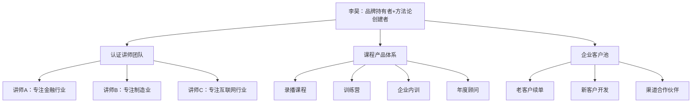

## 案例四：从讲师到培训IP的升级之路

### 案例背景

李昊（化名），32岁，原某知名培训机构签约讲师，主讲「高效沟通」与「职场汇报」两门课程。从业7年，累计授课超过800场，服务过200余家企业客户，年授课天数稳定在150天以上。

表面看，李昊的讲师事业已经非常成功——每场课酬6000-8000元，年收入约40-50万。但他清楚地意识到三个无法回避的问题：

**问题一：收入天花板明显。** 课酬由培训机构定价，讲师只拿分成（通常40%-60%）。每场课的单价和场次都有上限，年收入很难突破60万。

**问题二：客户关系不属于我。** 学员加的是机构的微信群，续课找的是机构销售，讲师只是"被派出去的工具人"。一旦机构找到更便宜的替代者，随时可能被替换。

**问题三：没有积累感。** 每年讲150场课，但没有任何资产沉淀——没有自己的课程产品、没有私域流量、没有品牌溢价。7年的工作经验换来的只是更高的课酬单价，本质上还是在卖时间。

2022年底，李昊做出了一个关键决定：**从"被雇佣的讲师"转型为"拥有个人IP的培训品牌"**。

### 讲师与培训IP的本质区别

在描述李昊的转型路径之前，有必要先厘清一个核心概念——**"讲师"和"培训IP"不是同一个物种。**

| 维度 | 签约讲师 | 培训IP |
|------|----------|--------|
| 收入模式 | 课酬分成（卖时间） | 课程产品+咨询+版权（卖资产） |
| 客户关系 | 归属培训机构 | 归属个人品牌 |
| 定价权 | 机构定价 | 自主定价 |
| 增长方式 | 增加上课天数 | 产品矩阵+杠杆放大 |
| 护城河 | 个人授课能力 | 方法论+品牌+社群+产品体系 |
| 可复制性 | 不可复制（人走了课就没了） | 部分可复制（可授权、可分发） |
| 终局 | 讲到讲不动为止 | 构建可持续运转的培训生意 |

用一句话概括：**讲师是"被雇佣的表演者"，培训IP是"拥有观众的品牌"。**

李昊的目标，是从左栏跳到右栏。

### 转型路径：四个阶段的完整拆解

#### 第一阶段：积累期——从"讲课的人"到"有方法论的人"（2023年1-6月）

##### 1. 提炼核心方法论

李昊做的第一件事不是开公众号、不是录短视频，而是**把自己7年800场课的授课经验，沉淀为一套可表述、可传授、可复用的方法论体系**。

他用了整整3个月时间，做了以下工作：

**（1）课程内容结构化。** 把散落在PPT、备课笔记、学员反馈中的知识点，梳理成一棵完整的知识树。以"职场汇报"课程为例，最终形成了这样的框架：

```text
汇报力方法论（PREP+模型）
├── 底层逻辑：汇报的本质是"降低领导的决策成本"
├── 场景拆解
│   ├── 日常进度汇报（5分钟版本）
│   ├── 周报/月报（结构化模板）
│   ├── 方案汇报（说服力框架）
│   ├── 危机汇报（坏消息传递模型）
│   └── 述职汇报（价值呈现法）
├── 工具包
│   ├── 30个汇报话术模板
│   ├── 12个常见汇报场景的"开场白"公式
│   └── 汇报PPT的5个排版原则
└── 案例库
    ├── 50+真实学员案例（脱敏处理）
    └── 10个经典汇报场景的正反面对比
```

**（2）命名与注册。** 李昊把这套方法论命名为"PREP+汇报力模型"（Point-Reason-Example-Point + 五个场景变体），并为其中的核心话术模板申请了版权登记。**方法论有了名字，才能被记住、被传播。**

**（3）验证方法论的独立性。** 李昊找了3位同行讲师，请他们用这套方法论独立备课并试讲。结果发现，经过培训的讲师能还原80%以上的核心内容——这证明方法论已经脱离了"李昊个人的讲课魅力"，具备了可复制性。

> **关键洞察：** 很多讲师误以为自己的价值在于"讲得好"，但真正的壁垒在于"有东西可讲"。讲课能力是表层竞争力，方法论才是底层资产。没有方法论的讲师，只是一个"会说话的人"。

##### 2. 建立内容输出阵地

李昊选择了三个平台同步启动内容输出：

| 平台 | 定位 | 更新频率 | 内容类型 |
|------|------|----------|----------|
| 公众号 | 深度文章，建立专业权威 | 每周2篇 | 方法论拆解、案例分析、工具模板 |
| 知乎 | 长尾流量，搜索引擎入口 | 每周3-5个回答 | 回答"如何汇报""职场沟通"类问题 |
| 视频号 | 短视频引流，展示授课风格 | 每周2-3条 | 1-3分钟的汇报技巧片段 |

**内容策略的核心原则：** 所有内容都围绕"PREP+汇报力模型"展开，不断强化这一个标签。不贪多，不做泛职场内容，只做"汇报力"这一个垂直领域。

**第一阶段的成果：**
- 公众号粉丝从0增长到3200
- 知乎回答总浏览量突破50万
- 视频号单条最高播放12万
- 但——**没有产生任何直接收入**

这个阶段的本质是"投资"——用时间换品牌资产。李昊估计这个阶段的机会成本约为15万元（减少了约30天的授课安排）。

#### 第二阶段：产品期——从"方法论"到"可售卖的产品"（2023年7-12月）

##### 1. 设计产品矩阵

李昊根据客户的不同需求层次和支付能力，设计了阶梯式产品矩阵：

```text
产品金字塔
         ┌──────────┐
         │ 年度顾问  │  12万/年/企业
         │（1对1定制）│
         ├──────────┤
         │ 企业内训  │  2-5万/场
         │（线下授课）│
         ├──────────┤
         │ 训练营    │  2999元/人
         │（线上14天）│
         ├──────────┤
         │ 录播课程  │  299元
         │（系统课程）│
         └──────────┘
```

**每个产品的定位和作用不同：**

- **录播课程（299元）**：低门槛引流产品，让潜在客户以最低成本体验方法论的质量。目标是"让更多人认识你"。
- **训练营（2999元/人）**：核心利润产品，14天线上训练+每日作业+直播答疑+社群互助。目标是"让付费用户真正学会"。
- **企业内训（2-5万/场）**：高客单价产品，延续李昊的传统授课能力，但内容从"机构提供的通用课件"升级为"自己的PREP+方法论"。
- **年度顾问（12万/年）**：最高价值产品，为企业提供汇报体系的咨询、定制和落地辅导。

##### 2. 打磨第一个付费产品：训练营

李昊选择训练营作为核心产品来打造，原因是：**训练营兼顾了"可规模化"和"有交付深度"两个优点。**

**训练营的详细设计：**

| 要素 | 具体方案 |
|------|----------|
| 周期 | 14天 |
| 人数 | 每期30-50人（保证互动质量） |
| 内容结构 | Day1-3：底层逻辑 → Day4-7：场景拆解 → Day8-11：实战演练 → Day12-14：综合输出 |
| 交付形式 | 每天1个录播视频（15分钟）+ 每天1个实战作业 + 每周三/六晚直播答疑（1小时） |
| 社群运营 | 微信群，每日作业打卡+互评，助教1名负责日常答疑 |
| 结营仪式 | 学员汇报展示+讲师点评+优秀学员颁奖 |
| 价格 | 早鸟价1999元，常规价2999元 |

**第一期训练营的运营数据：**

- 招生：32人（其中18人来自公众号和知乎粉丝，8人来自老学员推荐，6人来自视频号引流）
- 完课率：87.5%（28/32人完成全部14天学习）
- 作业提交率：91%（平均每日作业提交率）
- 收入：约7.4万元（扣除助教费用和平台成本后净利润约5.8万元）
- NPS（净推荐值）：72分

##### 3. 企业内训的"去机构化"

这是李昊转型中最关键的一步——**把企业内训的客户关系从"机构的"变成"自己的"。**

具体做法：

- 对老客户坦诚沟通：说明自己正在建立个人品牌，未来将以独立讲师身份提供服务
- 提供过渡方案：前3个月通过老机构合作的客户，课酬分配不变，但客户后续直接与李昊签约
- 提升服务深度：相比机构派课，李昊开始为每个企业客户提供"课前诊断+课中授课+课后跟踪"的完整服务链，而非简单的"到场讲一天课"

**关键风险提示：** 这一步需要非常注意合同约束和职业操守。李昊在转型前仔细审查了与培训机构的竞业协议，确认没有限制其独立承接客户的条款。同时，他没有带走机构的客户资源，而是通过个人品牌的内容输出吸引新客户，以及让老客户"自然选择"与其直接合作。

#### 第三阶段：放大期——从"个人品牌"到"培训IP"（2024年1-6月）

##### 1. IP形象的系统化建设

进入放大期，李昊开始系统化地建设个人IP。这不仅仅是"发更多内容"，而是一整套品牌工程：

**（1）视觉识别系统。** 设计了统一的个人品牌logo、课程封面模板、社群头图、PPT模板风格。所有对外输出的视觉物料保持一致的色调和风格（深蓝色+橙色为主色调，传达"专业+活力"的品牌调性）。

**（2）品牌故事线。** 梳理了一条清晰的个人故事线："800场授课经验 → 发现职场汇报是最被忽视的核心能力 → 独创PREP+模型 → 帮助3000+职场人提升汇报力"。这条故事线用于所有对外传播场景。

**（3）权威背书体系。** 收集整理了过往授课的企业logo墙（经授权）、学员好评截图、训练营学员的前后对比案例、媒体采访和专栏邀约。这些素材被系统化地用于销售页面、朋友圈、课程介绍等场景。

##### 2. 渠道放大策略

| 渠道 | 策略 | 投入 | 产出 |
|------|------|------|------|
| 公众号 | 从自写转向约稿+转载，扩大内容产能 | 约稿费800-1500元/篇 | 粉丝增长至1.2万 |
| 知乎 | 持续回答+开通"知乎知学堂"付费课程 | 时间投入 | 课程收入约8万/季度 |
| 视频号 | 升级为每周3条+直播（每周五晚"汇报力诊所"） | 设备投入约5000元 | 直播场均观看2000+ |
| 企业微信 | 建立私域社群，按行业分群运营 | 企微工具年费2000元 | 社群总人数3500+ |
| 合作渠道 | 与其他职场类博主互推、联名直播 | 互相导流 | 每次互推新增200-500精准粉丝 |

##### 3. 训练营的规模化运营

第一期到第六期训练营的运营数据变化：

| 期次 | 招生人数 | 完课率 | NPS | 退费率 | 净利润 |
|------|----------|--------|-----|--------|--------|
| 第1期 | 32人 | 87.5% | 72 | 0% | 5.8万 |
| 第2期 | 45人 | 89% | 75 | 2.2% | 8.1万 |
| 第3期 | 58人 | 86% | 74 | 3.4% | 10.2万 |
| 第4期 | 72人 | 84% | 71 | 4.2% | 12.5万 |
| 第5期 | 85人 | 82% | 68 | 5.9% | 14.3万 |
| 第6期 | 90人 | 80% | 65 | 6.7% | 14.8万 |

**李昊从这组数据中发现了一个关键规律：** 当每期人数超过60人后，完课率和NPS开始下降，退费率上升。原因是人数增加导致社群互动质量下降、作业点评不及时、学员"隐身"概率增大。

**解决方案：** 从第7期开始，将每期人数上限锁定为60人，同时开设"VIP小班"（每期15人，价格5999元，包含2次1对1辅导）。这一调整让第7期的NPS回升到73，净利润反而提升到16.2万元。

> **关键洞察：** 训练营的规模化不等于"每期塞更多人"，而是"提升每期的利润率+增加开期频率"。质量优先于数量，口碑优先于规模。

#### 第四阶段：体系化期——从"培训IP"到"培训生意"（2024年7月至今）

##### 1. 构建讲师联盟

李昊意识到，个人IP的最大瓶颈是**"李昊只有一个人"**。要突破这个瓶颈，需要建立讲师联盟。

**具体模式：**



**认证讲师的筛选标准：**
- 至少3年企业培训经验
- 完成PREP+方法论的认证培训（5天封闭培训）
- 试讲评分达到85分以上（由李昊和学员代表共同评分）
- 每年至少完成40场授权课程

**收益分配模式：**
- 企业内训：品牌方（李昊）40%，认证讲师45%，运营成本15%
- 训练营助教：品牌方60%，助教25%，运营成本15%
- 录播课程：品牌方70%，内容共创者20%，运营成本10%

到2024年底，李昊的讲师联盟已有6名认证讲师，覆盖金融、制造、互联网、医疗、教育、零售六个行业。

##### 2. 课程版权授权

除了讲师联盟，李昊还开拓了**课程版权授权**业务——将PREP+汇报力方法论的课程包（PPT、讲师手册、学员手册、案例库、工具包）授权给其他培训机构和企业大学使用。

**授权模式：**

| 授权类型 | 年费 | 权益 |
|----------|------|------|
| 基础授权 | 3万/年 | 使用课程材料授课，不得修改核心内容 |
| 高级授权 | 8万/年 | 可定制化修改，享受方法论更新，品牌联合露出 |
| 独家授权 | 20万/年 | 特定行业独家使用权，含讲师培训名额 |

到2024年底，版权授权收入已占总收入的18%，且几乎没有边际成本。

##### 3. 数字化产品线

李昊还开发了一系列数字化产品，进一步降低对"人"的依赖：

- **汇报力自测工具**：在线问卷，5分钟生成个人汇报能力评估报告（免费引流工具，已积累2.8万用户数据）
- **汇报模板库**：50+场景模板的在线订阅服务，99元/年
- **汇报力AI助手**：基于方法论训练的AI工具，帮助用户优化汇报文案（内测中，计划定价199元/年）

### 转型成果：24个月的数据对比

| 指标 | 转型前（讲师） | 转型后（培训IP） | 变化 |
|------|----------------|------------------|------|
| 年收入 | 45万 | 128万 | +184% |
| 收入来源 | 100%课酬 | 课酬32%+训练营28%+版权授权18%+顾问15%+数字产品7% | 从单一到多元 |
| 客户关系 | 归属机构 | 100%归属个人 | 完全自主 |
| 定价权 | 机构定价 | 自主定价，溢价空间200%+ | 价格翻3倍 |
| 日授课天数 | 150天/年 | 60天/年 | 减少60% |
| 被动收入占比 | 0% | 25%（录播+版权+数字产品） | 从零到四分之一 |
| 私域用户数 | 0 | 8500+ | 从零建立 |
| 团队规模 | 0（单打独斗） | 3人（助理+运营+助教）+6名认证讲师 | 有团队 |

### 转型过程中的六个关键决策

#### 决策一：先做减法，再做加法

李昊在转型初期做了一个违反直觉的决定——**主动减少30%的授课安排**，腾出时间做方法论沉淀和内容输出。这意味着短期收入下降约12万。但正是这3个月的"减法期"，让他完成了从"讲课匠人"到"方法论创建者"的蜕变。

#### 决策二：只做一个标签

很多讲师在建立IP时会犯一个错误——什么都讲。"我是沟通专家、管理专家、领导力专家、团队建设专家……"。李昊克制住了这种冲动，**只聚焦"汇报力"一个标签**。虽然这意味着放弃了大量"泛沟通"领域的潜在客户，但换来的是在"汇报力"这个细分领域的绝对心智占领。

#### 决策三：训练营优先于录播课

录播课的边际成本最低、最容易规模化，但李昊选择先做训练营。原因是：**训练营的交付深度远高于录播课，能真正验证方法论的有效性，产生高质量的学员案例和口碑传播。** 如果先做录播课，很可能因为完课率低、学习效果差而砸掉口碑。

#### 决策四：拒绝低价竞争

有培训机构建议李昊把训练营定价降到999元以提高招生量，被他拒绝了。**低价策略在培训领域是毒药**——它吸引来的用户付费意愿低、完课率低、好评率低，反而损害品牌。李昊坚持2999元的定价，并用更好的服务（更多直播答疑、更快的作业反馈、更好的结营仪式）来支撑这个价格。

#### 决策五：建立标准化交付流程

李昊为训练营设计了一套极其详细的标准化运营SOP（标准作业流程），涵盖招生文案模板、开营流程、每日运营节奏、作业批改标准、直播脚本模板、结营流程等所有环节。这套SOP长达80页，确保每期训练营的交付质量稳定一致。

> **为什么这很重要？** 因为只有标准化了，才能让其他人（助教、运营）参与执行，李昊才能从具体的执行工作中解放出来，去做更高价值的事情（方法论迭代、讲师联盟建设、大客户谈判）。

#### 决策六：数据驱动的持续优化

李昊建立了一套核心指标追踪体系，每周复盘：

| 指标类别 | 核心指标 | 监控频率 |
|----------|----------|----------|
| 获客 | 各渠道获客成本（CAC）、转化率 | 每周 |
| 产品 | 完课率、NPS、退费率、作业提交率 | 每期 |
| 收入 | 各产品线收入占比、客单价、复购率 | 每月 |
| 品牌 | 各平台粉丝增长率、内容互动率、搜索指数 | 每周 |
| 效率 | 人均产出、讲师产能利用率、运营人效 | 每月 |

### 常见误区与避坑指南

#### 误区一：把"有名"等同于"有IP"

很多讲师追求粉丝数量、播放量这些虚荣指标。但培训IP的核心不是"有多少人认识你"，而是**"有多少人愿意为你的方法论付费"**。李昊的公众号粉丝只有1.2万，但年收入128万——因为粉丝精准度极高，都是有培训需求的企业HR、管理者和职场人士。

#### 误区二：过早追求规模化

有些讲师刚有了一套方法论，就急于开加盟、做授权。但**方法论没有经过充分的市场验证就规模化，是在透支品牌信用**。李昊的做法是：先用6期训练营（约300名学员）充分验证方法论的有效性和可复制性，才启动讲师联盟。

#### 误区三：忽视交付质量

IP建设是前端获客，但**真正决定IP生死的是后端交付**。一个差评的杀伤力远大于一个好评的正面影响。李昊的底线是：宁可少开一期训练营，也不降低任何一期的交付标准。

#### 误区四：全平台铺开

"全平台运营"听起来很美，但实际执行中会导致**每个平台都做不深**。李昊的策略是：先在公众号+知乎两个文字平台建立深度内容壁垒，再拓展视频号。至今他也没有开设抖音账号——不是因为抖音不好，而是因为他的目标用户（企业管理者和HR）在抖音上的浓度不够高。

#### 误区五：只做线上不做线下

线上训练营的利润率高，但**线下企业内训是建立深度信任和高客单价的关键**。很多年度顾问客户，都是先体验了一次线下内训，觉得效果好，才决定签年度合同。线上和线下不是替代关系，而是互补关系。

#### 误区六：把方法论当成一成不变的东西

李昊的PREP+模型在24个月内迭代了4个大版本。每次迭代都基于真实的学员反馈和市场变化。**方法论的生命力在于持续进化，而不是"写完就不管了"。**

### 可复制的行动清单

如果你也是一名想要从讲师转型为培训IP的从业者，以下是李昊路径中可直接复用的关键步骤：

1. **盘点你的授课资产** ——列出你讲过的所有课程主题，找到交集最密集的领域，这大概率是你的定位方向
2. **提炼方法论** ——用2-3个月时间，把隐性经验变成显性框架。给方法论命名、画结构图、写操作手册
3. **选择2个内容平台深度运营** ——一个搜索引擎型（知乎/百度）+一个社交型（公众号/视频号），坚持3个月以上
4. **先做训练营，再做录播** ——训练营能验证方法论、产生口碑、积累案例；录播课是后续放大的工具
5. **设计产品金字塔** ——从低价引流品到高价定制服务，覆盖不同需求层次
6. **建立标准化SOP** ——把交付流程写成文档，让任何人按照文档都能执行80%的工作
7. **用数据说话** ——建立核心指标体系，每周复盘，用数据而非感觉来决策
8. **控制节奏** ——不要急于规模化，先在一个点上做到极致

### 本案例的核心启示

李昊的转型之路揭示了一个底层规律：**培训行业的真正壁垒不在于"你会讲课"，而在于"你拥有可复制的知识资产和可信赖的个人品牌"。**

讲师卖的是时间——时间有上限、不可积累、容易被替代。培训IP卖的是资产——方法论可以迭代、品牌可以增值、产品可以规模化。两者之间的差距，不是能力的差距，而是**商业模式的差距**。

从讲师到培训IP的升级，本质上是一次商业模式的重构：从"卖时间"到"卖资产"，从"被雇佣"到"拥有品牌"，从"个人能力"到"系统能力"。这个过程需要2-3年的持续投入，但一旦跨越临界点，收入的增长将不再受限于你的时间。

***
