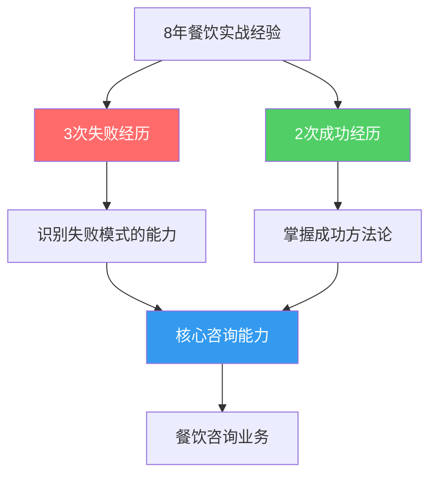
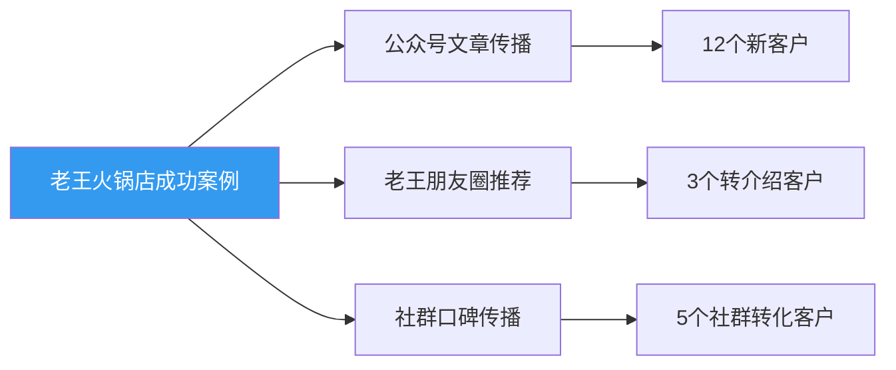
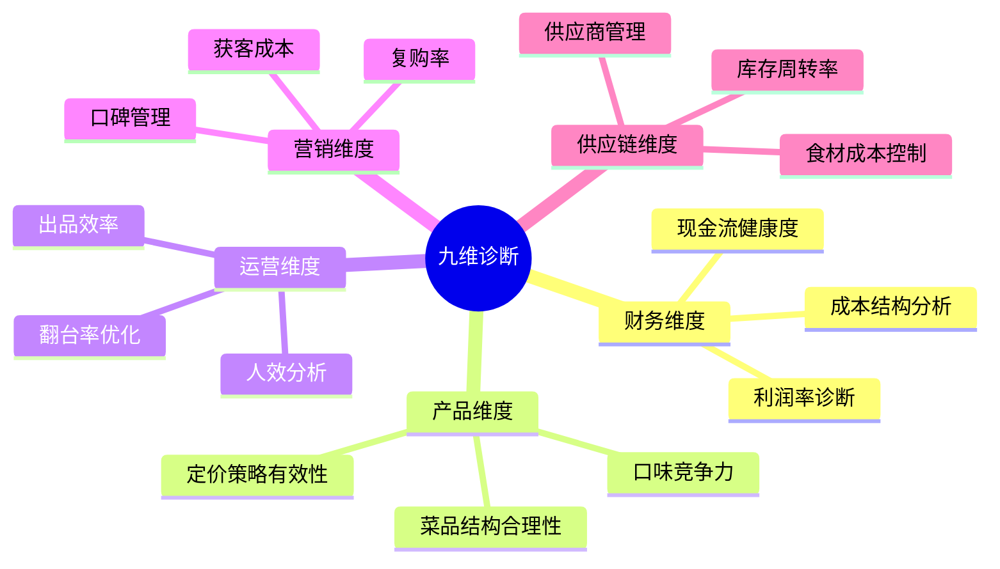
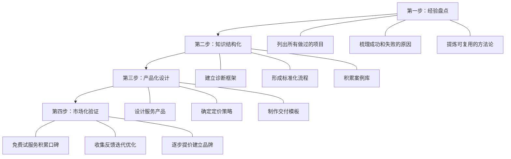
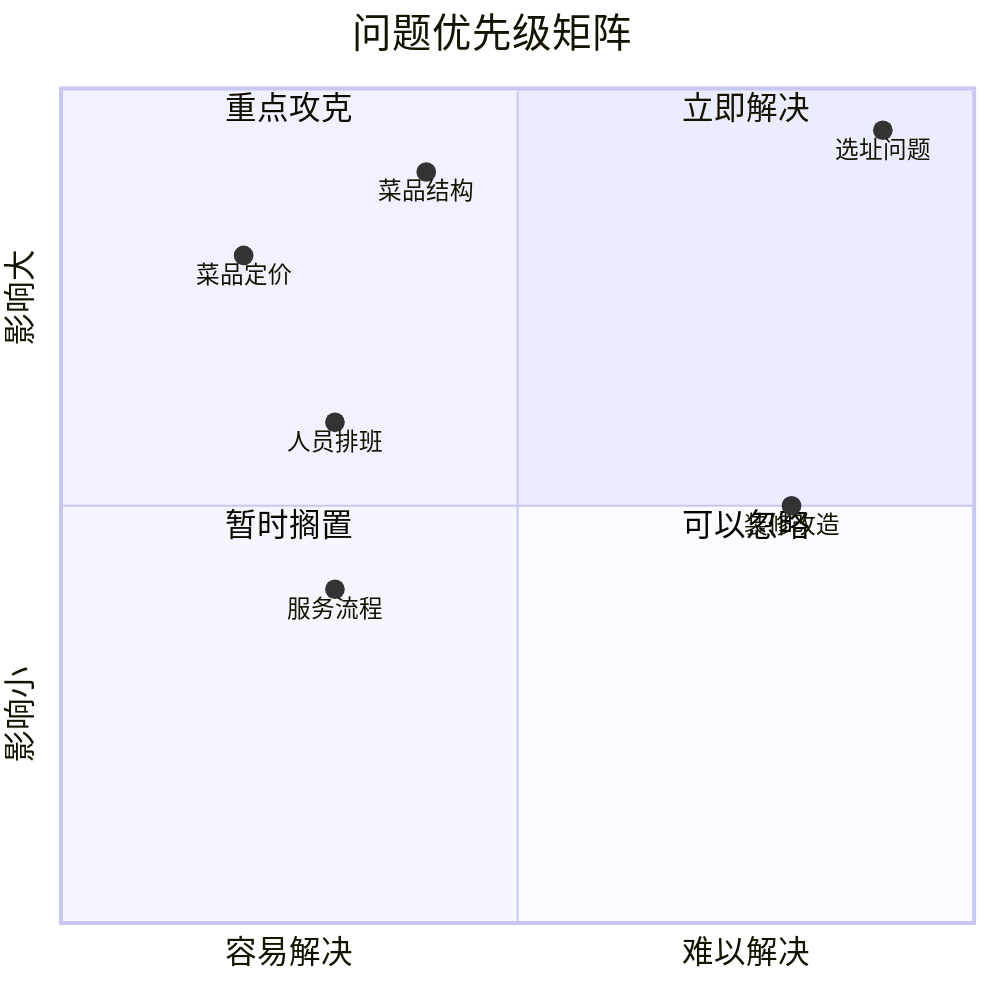

## 案例五：跨行业咨询——从餐饮老板到餐饮咨询顾问

> 行业经验是咨询顾问最硬的货币。在餐饮行业摸爬滚打八年、经历过三次创业失败和两次成功的陈昊，最终将自己的"血泪教训"转化为帮助新餐饮人少走弯路的咨询业务，实现了从"体力赚钱"到"脑力赚钱"的跃迁。

### 一、案例背景：为什么一个餐饮老板要转做咨询？

#### 1.1 人物档案

陈昊（化名），34岁，坐标成都。2014年大学毕业后进入餐饮行业，先后经营过火锅店、串串店、小龙虾店，经历过三次关店亏损（累计亏损约40万），也经营过两家盈利门店（其中一家火锅店月均净利润6-8万）。

2022年，陈昊做了一个出乎所有人意料的决定——关掉还在盈利的火锅店，转型做餐饮咨询顾问。

**他的核心逻辑是这样的：**

| 维度 | 继续开店 | 转型咨询 |
|------|----------|----------|
| 收入天花板 | 单店月利润6-8万，开分店需追加投入50-100万 | 理论上无上限，按项目/按年收费 |
| 时间自由度 | 每天14小时绑定在店里 | 可远程工作，自主安排 |
| 风险结构 | 房租、人工、食材成本是刚性支出 | 主要成本是自己的时间 |
| 规模化路径 | 开更多店=更多管理问题 | 标准化方法论=服务更多客户 |
| 个人价值 | 做得好只有一条街的人知道 | 行业影响力+个人品牌 |

**关键洞察：** 陈昊发现自己最擅长的不是炒菜和服务，而是"诊断一家店为什么不行"。三年间他帮朋友看过不下20家店，其中有15家在他的建议下实现了扭亏为盈。这种"诊断能力"才是他的核心竞争力。

#### 1.2 跨行业转型的底层逻辑

很多人会质疑：你自己店都关了三次，凭什么教别人？陈昊对此的回答非常精彩：

> "正因为我失败过三次，我才知道所有能踩的坑在哪里。成功的老板可能只走过一条路，但我走过五条路——三条死路、两条活路。咨询顾问的价值不是告诉你'怎么成功'，而是告诉你'怎么不失败'。"

这背后有一个咨询行业的重要理论——**"负面知识"的价值**。哈佛商学院的研究表明，从失败案例中学习的效果，往往高于只学习成功案例。因为失败的模式是有限的（选址错误、定价失误、成本失控），而成功的路径是多样的。



### 二、起步阶段：从0到1的冷启动（第1-4个月）

#### 2.1 精准定位：不做什么比做什么更重要

陈昊转型的第一件事不是找客户，而是花了一个月时间做市场调研。他走访了成都30多家餐饮培训机构和咨询公司，发现了一个关键的市场空白：

**市场上已有的服务：**
- 餐饮培训机构：教做菜、教开店流程（偏技术层面）
- 加盟品牌：提供标准化方案但收费高（加盟费10-50万）
- 大型咨询公司：服务大型连锁品牌（收费50万起步）

**市场空白：**
- 没有人专门为"已经开了1-3家店但经营困难"的中小餐饮老板提供诊断和优化服务
- 这个群体数量最大（占餐饮门店总数的70%以上）
- 他们付不起大咨询公司的费用，但愿意为"能直接带来利润提升"的建议付费

陈昊的定位由此确定：**"中小餐饮门店经营诊断与优化顾问"**，核心服务是帮助已经有1-5家门店、月营收在5-50万之间的餐饮老板找出经营问题并给出可执行的解决方案。

**定位三要素分析：**

| 要素 | 具体内容 |
|------|----------|
| 目标客户 | 已开店1-5家、经营遇到瓶颈的中小餐饮老板 |
| 核心痛点 | 知道生意不好但不知道问题出在哪里，或者知道问题但不知道怎么解决 |
| 价值主张 | "帮你找到那10%影响90%利润的关键问题" |

#### 2.2 个人品牌建设：用内容证明专业度

陈昊的品牌建设策略分为三个层次：

**第一层：免费内容引流（持续进行）**

他注册了一个公众号"老陈聊餐饮"，每周发布2-3篇文章。内容策略非常明确——只写"实战中踩过的坑"和"诊断案例的思考过程"。

他最初的10篇文章标题：
1. 《我亏了40万才明白的餐饮选址铁律》
2. 《为什么你的菜品定价越高，利润反而越低？》
3. 《餐饮店月营收20万，利润只有5000——钱去哪了？》
4. 《三个信号告诉你，这家店该关了》
5. 《火锅店翻台率上不去？90%的问题出在这三个环节》
6. 《新店开业第一个月亏损5万，老板做错了什么》
7. 《餐饮合伙人散伙的5个预兆和3种体面退出方式》
8. 《外卖平台抽成25%，餐饮老板怎么才能不亏钱》
9. 《我帮一家串串店月利润从3000提升到3万的过程》
10. 《餐饮老板最容易交的6种"智商税"》

**写作原则：** 每篇文章必须包含至少一个具体数字、一个真实场景、一个可执行建议。绝不写"要注重品质""要用心服务"这类正确的废话。

**第二层：短视频建立信任感**

在抖音和小红书上，陈昊采取了"探店诊断"的形式——免费帮一些餐饮店做诊断，全程拍摄视频（征得店主同意）。视频的核心看点是：

- 开头抛出问题："这家串串店月营收15万，为什么还亏钱？"
- 中间展示诊断过程：看菜单、算成本、观察客流、分析外卖平台数据
- 结尾给出具体建议和优化后的预期效果

这种内容形式的优势在于：观众能看到真实的诊断过程，而不是空洞的理论。一条"帮一家面馆月利润从2000提升到1.5万"的视频获得了23万播放量，直接带来了40多个咨询意向。

**第三层：行业社群沉淀**

陈昊创建了一个"成都餐饮老板交流群"，入群门槛是"正在经营餐饮门店"。群内不做硬性推销，而是每天分享一条餐饮行业数据或经营技巧，每周做一次免费的"群内诊断"——选一家店，群内公开分析经营数据并给出建议。

这个策略的巧妙之处在于：
- 群成员本身就是精准目标客户
- 公开诊断展示了专业能力，比任何广告都有说服力
- 被诊断的老板往往会成为付费客户（体验过价值后转化率极高）

#### 2.3 第一批客户：从免费到付费的转化

陈昊的第一批客户获取路径：

```text
免费探店视频(10期) → 积累5000粉丝
    ↓
公众号文章(30篇) → 积累2000关注
    ↓
餐饮老板社群(80人) → 精准流量池
    ↓
免费诊断3家社群成员的店 → 产出详细诊断报告
    ↓
诊断报告在社群公开 → 建立信任
    ↓
推出付费诊断服务(2980元/次) → 第一个月成交3单
```

**关键数据：**
- 第1个月：0收入，全力做内容和社群
- 第2个月：接到2个免费诊断请求，积累了案例素材
- 第3个月：推出付费服务，成交3单，收入8940元
- 第4个月：成交5单，收入14900元，开始有转介绍

#### 2.4 定价策略：让客户觉得"不买就亏了"

陈昊的初始定价逻辑：

**痛点分析：** 一家月营收20万的餐饮店，如果利润率能从5%提升到15%，月利润就从1万提升到3万——多赚2万。而陈昊的诊断服务只收2980元，客户投入产出比接近1:7。

**定价锚定：** 他在咨询前会帮客户算一笔账——"你的店每月多浪费的成本至少有1-2万，我的诊断费只是帮你找回这些钱的一个零头。"

**阶梯定价设计：**

| 服务类型 | 价格 | 内容 | 交付物 |
|----------|------|------|--------|
| 单项诊断 | 2980元 | 针对一个具体问题（如选址/定价/成本） | 诊断报告+1小时方案讲解 |
| 综合诊断 | 6980元 | 全面经营诊断（财务/运营/营销/供应链） | 详细诊断报告+优化方案+2次跟进 |
| 季度顾问 | 19800元 | 每月1次现场诊断+随时微信咨询 | 月度经营分析报告+季度优化方案 |
| 年度顾问 | 59800元 | 每月1次现场+每周数据跟踪+随时咨询 | 全年经营护航+新店开业支持 |

### 三、成长阶段：从1到10的规模化（第5-12个月）

#### 3.1 口碑裂变：一个成功案例带来的连锁反应

陈昊的第一个"明星案例"来自一家经营困难的社区火锅店。

**客户背景：** 店主老王，经营一家80平米的社区火锅店，月营收12万，月利润仅4000元。老王已经考虑转让，经朋友介绍找到陈昊做最后一次尝试。

**诊断过程：**

陈昊用了3天时间做了全面诊断，发现了5个核心问题：

| 问题 | 具体表现 | 影响程度 |
|------|----------|----------|
| 菜品结构不合理 | 80道菜品中30道月销量不足10份，造成食材浪费 | 月损失约8000元 |
| 定价策略失误 | 锅底定价过高（68元），导致顾客只点便宜菜品 | 客单价偏低 |
| 外卖定价错误 | 外卖折扣叠加平台抽成，每单外卖亏3-5元 | 月亏约5000元 |
| 人力配置失衡 | 高峰期人手不足，低峰期人员闲置 | 月浪费约6000元 |
| 会员体系缺失 | 没有任何复购激励机制 | 老客流失率高 |

**优化方案（执行3个月后的效果）：**

1. 菜品精简：从80道砍到45道，聚焦高毛利菜品
2. 定价调整：锅底降到48元，但增加"必点三件套"套餐（毛利更高）
3. 外卖策略：取消低于15元的外卖订单，提高起送价，主推高毛利套餐
4. 排班优化：引入弹性排班制度，高峰期增加兼职
5. 会员体系：推出"充值300送50"的储值卡

**3个月后结果：**

| 指标 | 优化前 | 优化后 | 变化 |
|------|--------|--------|------|
| 月营收 | 12万 | 18万 | +50% |
| 月利润 | 4000元 | 3.2万 | +700% |
| 客单价 | 65元 | 89元 | +37% |
| 翻台率 | 1.5次 | 2.3次 | +53% |
| 外卖占比 | 35% | 20%（但利润更高） | 结构优化 |

这个案例被陈昊写成了详细的文章（隐去店名和具体地址），在公众号获得了5000+阅读，直接带来了12个付费咨询客户。老王本人也在朋友圈多次推荐，带来了3个转介绍客户。

**一个案例的裂变效应：**



#### 3.2 服务标准化：从"手艺人"到"产品化"

随着客户增多，陈昊面临一个典型问题：每个项目都要从头开始，效率低下。他花了两个月时间，将自己的咨询经验提炼成一套标准化的诊断框架。

**"餐饮门店九维诊断模型"：**



**标准化的好处：**
- 诊断效率提升：原来需要3-5天的诊断，现在1-2天就能完成
- 交付质量稳定：不管客户类型如何，诊断的深度和广度一致
- 可复制性强：后续招助理时，只需培训这个框架就能上手
- 差异化明显：客户能感受到"专业的系统化思维"，而不是"拍脑袋的建议"

#### 3.3 收入结构演变

第5-12个月的收入数据：

| 月份 | 单项诊断 | 综合诊断 | 季度顾问 | 月收入 |
|------|----------|----------|----------|--------|
| 第5月 | 4单 | 1单 | 0 | 18,900元 |
| 第6月 | 5单 | 2单 | 0 | 28,860元 |
| 第7月 | 3单 | 2单 | 1 | 34,840元 |
| 第8月 | 4单 | 3单 | 1 | 48,800元 |
| 第9月 | 5单 | 2单 | 2 | 64,580元 |
| 第10月 | 3单 | 3单 | 2 | 68,780元 |
| 第11月 | 4单 | 2单 | 3 | 79,300元 |
| 第12月 | 3单 | 3单 | 3 | 86,820元 |

**趋势分析：** 单项诊断的占比逐渐下降，季度顾问的占比持续上升。这意味着客户生命周期价值（LTV）在提高，收入的稳定性也在增强。

#### 3.4 遇到的挑战与应对

**挑战一：客户期望管理**

有些客户花了2980元做诊断，期望"一个月内利润翻倍"。陈昊学会了在服务前就明确告知：诊断是"找出问题+给出方案"，执行效果取决于客户的落地能力。他在诊断报告中加入了"执行难度评估"和"预期效果区间"，让客户有合理的预期。

**挑战二：行业偏见**

"你自己店都关了，凭什么教我？"这是陈昊最常听到的质疑。他的应对策略是：

1. 不回避失败经历，反而主动讲述："我关了三次店，就是因为没人告诉我这些问题"
2. 用数据说话：展示已服务客户的平均利润提升数据（42%）
3. 提供"无效退款"承诺：如果诊断报告中没有发现客户认可的问题，全额退款（实际退款率不到2%）

**挑战三：精力瓶颈**

到了第8个月，陈昊发现自己的时间已经排满了——每月最多只能服务8-10个客户。他开始思考规模化的问题。

### 四、成熟阶段：从10到100的体系化（第13-24个月）

#### 4.1 团队化运作

陈昊在第13个月招了第一个助理——一个有3年餐饮运营经验的年轻人。培训周期为2个月：

**培训内容：**
- 第1-2周：学习"九维诊断模型"的理论框架
- 第3-4周：跟随陈昊做3个完整的诊断项目（观摩学习）
- 第5-6周：在陈昊指导下独立完成3个诊断项目（辅导纠偏）
- 第7-8周：独立完成3个诊断项目，陈昊审核报告质量

**分工模式：**
- 助理负责：数据收集、现场走访、基础分析、报告初稿
- 陈昊负责：方案审核、关键问题判断、客户沟通、方案讲解

这个模式让陈昊的产能从每月8-10个项目提升到每月15-18个项目，同时保证了服务质量。

#### 4.2 产品线扩展

从单一的"门店诊断"扩展为完整的产品矩阵：

| 产品 | 价格 | 目标客户 | 交付形式 |
|------|------|----------|----------|
| 线上诊断（远程） | 1980元 | 外地客户、预算有限 | 视频会议+数据报告 |
| 现场综合诊断 | 6980元 | 本地中型餐饮店 | 现场走访+报告+讲解 |
| 季度顾问 | 19800元 | 需要持续优化的店 | 月度诊断+随时咨询 |
| 年度顾问 | 59800元 | 连锁品牌或高端店 | 全面护航+新店支持 |
| 餐饮经营实战课 | 3980元/人 | 想系统学习的老板 | 2天线下培训 |
| 企业内训 | 15000元/场 | 餐饮连锁企业 | 定制化1天培训 |

**收入占比变化（第18个月）：**
- 门店诊断：45%（从最初的100%下降）
- 顾问服务：30%（稳定增长）
- 培训课程：25%（新业务线，增速最快）

#### 4.3 方法论沉淀与知识产品化

陈昊将两年的咨询经验整理成了一本电子书《中小餐饮门店经营诊断手册》，定价99元。这本电子书的核心价值在于：

- 28个真实的诊断案例（隐去客户信息）
- "九维诊断模型"的完整框架和使用方法
- 每个维度的自检清单（老板可以自己先做初步诊断）
- 30个常见问题的标准解决方案

**电子书的商业逻辑：**
- 前端引流产品：99元的电子书筛选出有付费意愿的精准客户
- 后端转化：买过电子书的客户中有25%会购买诊断服务或培训课程
- 半年卖出800本，直接收入79200元，间接转化的咨询收入超过30万

#### 4.4 最终收入数据

第24个月的收入结构：

| 收入来源 | 月收入 | 占比 |
|----------|--------|------|
| 门店诊断（助理执行，陈昊审核） | 45,000元 | 30% |
| 顾问服务 | 52,000元 | 35% |
| 培训课程 | 38,000元 | 25% |
| 电子书销售 | 15,000元 | 10% |
| **月总计** | **150,000元** | **100%** |
| **年收入** | **约180万元** | - |

### 五、从餐饮老板到咨询顾问的关键转型策略

#### 5.1 经验转化的四步法

将行业经验转化为咨询产品，需要经历四个步骤：



**第一步：经验盘点**

不要急着做咨询，先花一个月时间盘点自己的经验。陈昊的盘点结果：

- 8年餐饮经验中，处理过的核心决策超过200个
- 其中"做对了"的约120个，"做错了"的约80个
- 可以提炼出方法论的约50个决策场景
- 有普遍适用价值的约30个

**第二步：知识结构化**

将零散的经验变成可传授的知识体系。陈昊的做法：
- 把30个核心决策场景按照"九维诊断模型"分类
- 每个场景都写出：背景→问题→分析→方案→结果→复盘
- 用流程图把复杂的决策过程可视化

**第三步：产品化设计**

把知识体系变成可以卖钱的产品。关键是设计好"交付物"——客户花钱买的不是你的建议，而是"解决问题的具体方案+可执行的行动清单"。

**第四步：市场化验证**

先用免费或低价服务验证市场需求，收集真实反馈，快速迭代。

#### 5.2 跨行业转型的五个常见误区

**误区一："我必须先做到行业顶尖才能做咨询"**

真相：你不需要是行业第一，只需要比你的客户懂得多、看得准。一个经营过5家店的人，完全有资格指导第一次开店的人。

**误区二："客户会因为我不是科班出身而看不起我"**

真相：餐饮行业的客户最看重的是"你有没有真正在这个行业干过"。实战经验比任何学历证书都管用。陈昊的客户中，没有一个人问过他的学历。

**误区三："免费服务会贬低自己的价值"**

真相：起步阶段的免费服务是投资，不是浪费。陈昊前期做的3次免费诊断，直接带来了15个付费客户，投资回报率超过50倍。关键是控制免费服务的数量（不超过5个），并且要把免费服务的过程公开化（写成案例、拍成视频）。

**误区四："做咨询就要写很长的报告"**

真相：餐饮老板最讨厌的就是"废话报告"。陈昊的诊断报告通常只有5-8页，但每一页都是干货——具体的数据、明确的问题、可执行的方案。"报告越短，客户越满意"是他的核心心得。

**误区五："有了方法论就不需要更新了"**

真相：餐饮行业变化极快——外卖平台规则在变、消费者偏好在变、成本结构在变。陈昊每个月会花2天时间走访门店、研究行业报告、和同行交流，确保自己的方法论与时俱进。

#### 5.3 餐饮咨询的特殊性

餐饮行业做咨询和其他行业有一些显著的不同：

| 维度 | 餐饮咨询的特点 | 对咨询顾问的要求 |
|------|----------------|------------------|
| 决策周期 | 短（通常1-2周内决定是否付费） | 快速建立信任，首次沟通就要展示价值 |
| 客户群体 | 学历参差不齐，但商业直觉强 | 说人话，少用专业术语，多用案例类比 |
| 服务半径 | 通常需要现场走访 | 城市内服务为主，远程为辅 |
| 效果验证 | 快（1-3个月就能看到利润变化） | 敢于承诺可量化的结果 |
| 竞争壁垒 | 低（谁都能说自己是餐饮顾问） | 用案例和数据建立专业壁垒 |

### 六、实操指南：如果你也想从餐饮行业转型做咨询

#### 6.1 自我评估清单

在决定转型之前，先回答以下问题：

**经验维度（至少需要满足3项）：**
- [ ] 经营餐饮门店超过3年
- [ ] 经历过至少1次失败（关店/亏损）
- [ ] 独立完成过门店选址/装修/开业全流程
- [ ] 管理过10人以上的团队
- [ ] 处理过食品安全/消防等突发危机
- [ ] 实现过单店月利润2万以上

**能力维度（至少需要满足2项）：**
- [ ] 能快速看出一家店的经营问题
- [ ] 擅长数据分析（营收/成本/利润）
- [ ] 有良好的沟通和表达能力
- [ ] 能写出让人看得懂的报告
- [ ] 有一定的行业人脉基础

**心态维度（全部需要满足）：**
- [ ] 能接受前3个月可能没有收入
- [ ] 愿意持续学习和输出内容
- [ ] 不怕被客户质疑和拒绝
- [ ] 有足够的耐心等待口碑积累

#### 6.2 冷启动90天行动计划

**第1-30天：基础建设**
- 完成自我评估，明确服务定位
- 注册公众号/小红书/抖音，发布第1-5篇内容
- 建立第一个餐饮老板微信群（目标30人）
- 整理自己的经验，形成初步的诊断框架

**第31-60天：内容积累+免费服务**
- 每周发布3篇内容，持续积累粉丝
- 免费为3-5家店做诊断，产出详细案例
- 在社群中做公开诊断，建立信任
- 开始接触潜在付费客户

**第61-90天：商业化启动**
- 推出付费诊断服务（定价建议：当地月平均工资的1-1.5倍）
- 目标成交3-5单，验证市场需求
- 收集客户反馈，优化服务流程
- 产出2-3个成功案例，用于后续营销

#### 6.3 诊断工具包

陈昊在实际诊断中使用的几个核心工具：

**工具一：营收结构分析表**

| 项目 | 数据 | 行业基准 | 诊断结论 |
|------|------|----------|----------|
| 日均营收 | _____元 | 根据业态不同 |  |
| 客单价 | _____元 | 火锅80-120/快餐25-40 |  |
| 日均客流量 | _____人 | 根据面积和座位数 |  |
| 翻台率 | _____次 | 正餐1.5-2.5/快餐3-5 |  |
| 外卖占比 | _____% | 建议不超过30% |  |
| 高峰时段营收占比 | _____% | 应该超过60% |  |

**工具二：成本结构健康度评估**

| 成本项 | 占营收比例 | 健康范围 | 是否异常 |
|--------|-----------|----------|----------|
| 食材成本 | ____% | 28-35% |  |
| 人工成本 | ____% | 20-28% |  |
| 房租成本 | ____% | 8-15% |  |
| 水电燃气 | ____% | 3-6% |  |
| 平台抽成 | ____% | 不超过8% |  |
| 其他成本 | ____% | 3-5% |  |
| **净利润** | ____% | **>10%为健康** |  |

**工具三：问题优先级矩阵**

把诊断发现的所有问题按照"影响程度"和"解决难度"两个维度排列：



### 七、经验总结：餐饮咨询成功的六个关键

**第一，实战经验是最大的护城河。** 没有真正开过店的人，很难理解餐饮老板的痛点。"我当年也遇到过同样的问题"这句话，比任何PPT都有说服力。

**第二，第一个成功案例比任何营销都重要。** 陈昊的转折点是老王火锅店的案例——利润从4000元提升到3.2万。这个案例被传播后，后续的客户几乎是"自动上门"。

**第三，说人话，不要掉书袋。** 餐饮老板最反感的是"学术派"顾问——满口专业术语但给不出具体建议。陈昊的诊断报告从来不写"建议优化供应链管理"，而是写"你的毛肚进价比同行贵8块，换这家供应商试试"。

**第四，敢承诺结果，但要管理预期。** 陈昊的服务承诺是："如果按照我的方案执行3个月，利润率没有提升5个百分点，我退还诊断费。"这个承诺给了客户信心，同时他也通过前期沟通确保客户理解"执行"二字的分量。

**第五，持续学习，保持对行业的敏感度。** 餐饮行业的变化速度极快——新的外卖平台规则、新的消费趋势、新的竞品出现。陈昊每天花1小时阅读行业资讯，每月走访3-5家门店（包括客户的和非客户的），保持对市场的直觉。

**第六，从"卖时间"走向"卖系统"。** 纯粹的咨询服务本质是卖时间，天花板很低。陈昊通过培训课程、电子书、标准化诊断工具等方式，实现了"一次开发、多次销售"，这才是可持续的商业模式。

> **最终启示：** 任何行业的资深从业者，都有机会将自己的经验转化为咨询产品。关键不在于你是否"足够成功"，而在于你是否能够把经验结构化、把知识产品化、把价值可量化。餐饮咨询只是一个缩影——这个模式适用于几乎所有需要实战经验的行业。
