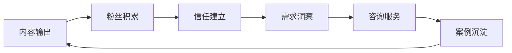
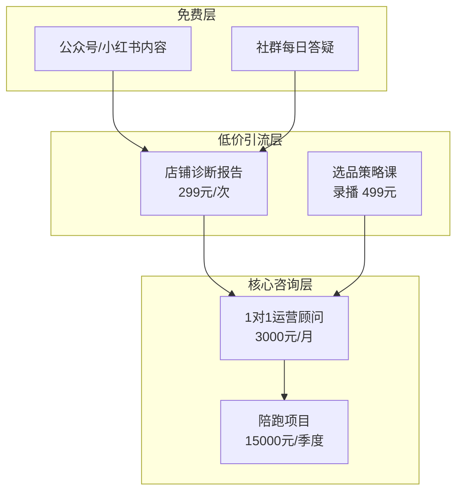
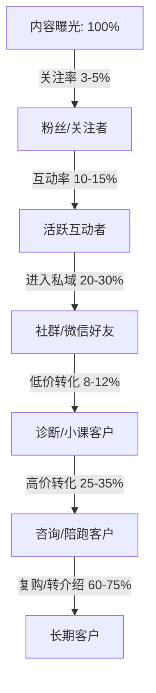

## 案例六：从自媒体到咨询业务的转化

### 案例背景

陈思远（化名），30岁，原某电商公司运营经理，从业7年。2022年初开始在小红书和公众号上分享电商运营实战经验，积累了第一批粉丝后，逐步将流量转化为咨询服务客户，最终在18个月内实现了从自媒体博主到独立电商咨询师的完整转型。

**为什么选这条路径？** 大多数人认为做咨询需要先有"大厂背书"或"名校光环"，但陈思远的经历证明：**持续输出高质量的实战内容，本身就是最有力的能力证明**。自媒体不只是引流工具，更是建立专业信任的"内容资产"。

**核心逻辑链：**



这条路径的关键优势在于：每一篇内容都是"永久在线的销售员"，咨询案例反过来又成为内容素材，形成正向飞轮。

---

### 第一阶段：自媒体冷启动（第1-4个月）

#### 1. 定位与内容策略

陈思远没有选择做"泛电商知识博主"，而是聚焦在**"中小卖家的抖音电商实操"**这个细分赛道。这个定位有三个考量：

| 考量维度 | 具体分析 |
|---------|---------|
| **自身优势** | 7年电商运营经验，亲手操盘过3个从0到月销百万的抖音店铺 |
| **市场空白** | 抖音电商增长迅猛，但实操类内容大多来自培训机构的"割韭菜"课程，真正的一线操盘手分享极少 |
| **目标受众明确** | 中小卖家（月销1万-50万）数量庞大，付费意愿强，但缺少可信赖的专业指导 |

**内容矩阵设计：**

| 内容类型 | 平台 | 频率 | 目的 |
|---------|------|------|------|
| 实操干货长文 | 公众号 | 每周2篇 | 建立专业深度，沉淀搜索流量 |
| 短平快数据拆解 | 小红书 | 每天1条 | 快速涨粉，扩大曝光 |
| 案例复盘视频 | B站/抖音 | 每周1条 | 展示真实操盘能力 |
| 行业趋势分析 | 知乎 | 每周1篇 | 吸引高净值决策者 |

#### 2. 冷启动的具体动作

**第一个月：建立内容基础**

- 梳理了过去7年中最有代表性的10个操盘案例，拆解为系列文章
- 第一篇爆文：《我用3个月把一个新抖音店从0做到月销87万，完整复盘》，在小红书获得2.3万点赞，公众号阅读量突破5万
- 关键技巧：文章中展示了**真实的后台数据截图**（脱敏处理），这在当时充斥"理论派"的电商内容中形成了强烈差异化

**第二个月：互动与社群**

- 开始在评论区和私信中回答粉丝的具体问题，每天花2小时做这件事
- 建立了一个免费的微信社群（200人上限），定期做问答
- 意外发现：粉丝提出的问题高度集中在"选品策略""投流优化""达人对接"三个方向——这成为后来咨询服务的雏形

**第三个月：内容迭代**

- 根据粉丝反馈调整内容方向，从"泛电商经验"聚焦到"抖音电商实操"
- 开始做"店铺诊断"类内容：粉丝提供店铺数据，陈思远在脱敏后做公开分析
- 这类内容互动率极高，因为每个卖家都想被"诊断"

**第四个月：数据积累**

| 指标 | 数据 |
|------|------|
| 小红书粉丝 | 1.2万 |
| 公众号关注 | 4800 |
| 微信社群 | 3个群，共600人 |
| 累计内容产出 | 公众号32篇，小红书90条，B站视频8条 |
| 私信咨询量 | 日均15-20条 |

#### 3. 冷启动阶段的关键教训

**教训一：不要急于变现，先建立"内容信用"**

陈思远在前4个月完全没有做任何商业化动作。这个决定在当时是反直觉的——身边的朋友都在问"你写了这么多，怎么不赚钱？"但事后证明，这段"纯输出期"是最关键的投资。当后来推出付费咨询服务时，转化率高达8%，远高于行业平均水平的2-3%。

**教训二：真实数据是最强的内容武器**

在所有内容形式中，带真实后台数据截图的文章，阅读完成率比纯文字文章高出60%，收藏率高出3倍。这给了陈思远一个启示：**在咨询行业，"证明你能做到"比"告诉别人怎么做"更有说服力**。

**教训三：免费互动是最好的需求调研**

每天2小时的评论区和私信回复，表面上是"免费劳动"，实际上是最精准的市场调研。通过这些问题，陈思远发现了三个核心痛点：
- 中小卖家不懂如何系统化选品（碎片化知识太多，缺乏框架）
- 投流ROI不稳定，不知道问题出在哪里
- 想找达人合作但不知道如何谈判和定价

这三个痛点后来直接对应了三款咨询服务产品。

---

### 第二阶段：从内容到咨询的过渡（第5-9个月）

#### 1. 服务产品设计

基于前4个月的需求调研，陈思远设计了三层服务产品：



**每层产品的设计逻辑：**

| 层级 | 产品 | 价格 | 目的 | 交付物 |
|------|------|------|------|--------|
| 免费层 | 内容+社群答疑 | 0元 | 建立信任，获取潜在客户 | 文章、短视频、群内回复 |
| 低价引流层 | 店铺诊断报告 | 299元/次 | 降低决策门槛，筛选付费意愿 | 5000字诊断报告+30分钟电话 |
| 核心咨询层 | 1对1运营顾问 | 3000元/月 | 核心收入来源 | 每周1次60分钟通话+随时文字咨询 |
| 高价值层 | 陪跑项目 | 15000元/季度 | 高客单价，深度绑定 | 驻场指导+数据监控+方案执行 |

#### 2. 第一批付费客户的获取

**方式一：社群内测**

在已有600人的社群中发布消息："开放5个免费店铺诊断名额，限本周报名。"收到了47份申请。陈思远从中选了5家最具代表性的店铺（覆盖不同品类、不同规模），做了详细的诊断报告。

诊断报告的结构：
1. 店铺现状数据概览（流量、转化、客单价、退货率）
2. 与同类目TOP10店铺的对比分析
3. 核心问题识别（最多列出3个最关键的问题）
4. 针对性优化建议（每个问题给出具体可执行的方案）
5. 预期效果估算（基于历史数据的保守预测）

这5份免费诊断报告发布在社群后，引发了强烈反响。一周内，又有8个人主动付费购买了299元的诊断服务。

**方式二：内容中埋设转化路径**

在公众号文章底部增加了一个固定的"服务入口"模块：

```text
【店铺诊断】如果你的抖音店铺遇到增长瓶颈，
发送"诊断"获取服务详情。已帮助32家店铺找到增长突破口。
```

关键是"已帮助32家店铺"这个数字——随着案例积累不断更新，形成社会证明。

**方式三：私信转化话术**

对于私信咨询问题较多的粉丝，陈思远发展出一套自然的转化话术：

> "你这个问题其实挺典型的，我之前在XX店铺也遇到过类似情况。如果你方便的话，可以把你店铺的后台数据截图发给我，我先帮你大致看一下问题出在哪里。如果情况比较复杂，我有个店铺诊断服务，299元出一份详细报告，你觉得有需要再说。"

这个话术的核心是**先提供价值，再自然过渡到付费**，而不是上来就推销。

#### 3. 收入增长曲线

| 月份 | 诊断报告收入 | 1对1顾问收入 | 陪跑项目收入 | 月总收入 |
|------|-------------|-------------|-------------|---------|
| 第5个月 | 2,400元（8份） | 0 | 0 | 2,400元 |
| 第6个月 | 3,600元（12份） | 6,000元（2人） | 0 | 9,600元 |
| 第7个月 | 4,200元（14份） | 12,000元（4人） | 0 | 16,200元 |
| 第8个月 | 3,900元（13份） | 18,000元（6人） | 15,000元（1个） | 36,900元 |
| 第9个月 | 4,500元（15份） | 24,000元（8人） | 30,000元（2个） | 58,500元 |

**关键观察：**

- 诊断报告的收入增长在第7个月后趋于平缓，但它始终是最重要的"客户筛选器"
- 1对1顾问是稳定的收入基本盘，客户留存率高达75%（平均合作4.5个月）
- 陪跑项目的客单价最高，但获客难度也最大，需要更长的信任建立周期

---

### 第三阶段：规模化与体系化（第10-18个月）

#### 1. 从"卖时间"到"卖方法论"

当1对1顾问客户增加到8个时，陈思远遇到了一个典型瓶颈：**时间不够用**。每个客户每周1小时通话+随时文字咨询，加上内容创作和社群维护，每周工作时间超过70小时。

**解决方案：将隐性经验转化为显性方法论**

陈思远花了1个月时间，把自己7年的电商运营经验梳理成一套"抖音电商增长飞轮模型"：

| 模块 | 核心方法论 | 对应工具/模板 |
|------|-----------|-------------|
| 选品 | "三维度选品法"（市场需求×竞争程度×利润空间） | 选品评估打分表（Excel） |
| 内容 | "爆款内容公式"（痛点切入×数据支撑×行动指令） | 内容策划模板 |
| 投流 | "ROI四象限优化法" | 投流数据监控表 |
| 达人 | "达人合作谈判五步法" | 达人评估矩阵 |
| 复购 | "私域沉淀三件套" | 社群运营SOP |

这套方法论的价值在于：
1. **降低对个人的依赖**：助理可以按照方法论框架做初步分析，陈思远只需做最终审核
2. **提升服务标准化程度**：每个客户得到的服务质量更加一致
3. **创造新的收入来源**：方法论本身可以打包成录播课程或电子书

#### 2. 团队搭建与分工

| 角色 | 人数 | 职责 | 成本 |
|------|------|------|------|
| 陈思远（创始人） | 1 | 核心咨询、内容策略、客户关系维护 | - |
| 内容助理 | 1 | 帮助整理素材、排版、数据收集 | 5000元/月 |
| 初级分析师 | 1 | 按方法论框架做店铺初步诊断 | 8000元/月 |

团队搭建后，陈思远的时间分配发生了根本变化：

| 工作内容 | 之前占比 | 之后占比 |
|---------|---------|---------|
| 1对1咨询通话 | 40% | 25% |
| 内容创作 | 30% | 20% |
| 社群维护 | 15% | 5%（助理接手） |
| 方法论迭代 | 0% | 20% |
| 商务拓展 | 5% | 20% |
| 其他 | 10% | 10% |

#### 3. 获客渠道升级

随着口碑积累，获客渠道从"纯靠内容"升级为多渠道并行：

| 渠道 | 占比 | 特点 |
|------|------|------|
| 老客户转介绍 | 35% | 转化率最高（25%），信任成本最低 |
| 公众号/小红书内容引流 | 30% | 持续稳定的流量来源 |
| 行业社群口碑 | 15% | "陈思远推荐"在电商卖家社群中已成为一个标签 |
| 培训机构合作 | 10% | 为培训机构做定制课程，每场8000-15000元 |
| 线下活动/行业峰会 | 10% | 每季度参加1-2次行业峰会做分享嘉宾 |

#### 4. 最终经营数据

| 指标 | 起步时（第5个月） | 成熟后（第18个月） | 增长倍数 |
|------|-----------------|-----------------|---------|
| 月收入 | 2,400元 | 68,000元 | 28倍 |
| 1对1客户数 | 0 | 12个 | - |
| 陪跑项目数 | 0 | 3个 | - |
| 内容累计产出 | 32篇公众号+90条小红书 | 156篇公众号+480条小红书+52条视频 | - |
| 全平台粉丝 | 1.7万 | 8.5万 | 5倍 |
| 复购率/续约率 | - | 72% | - |
| 月工作时间 | ~200小时 | ~160小时 | 减少20% |

年收入构成（第18个月年化）：
- 1对1顾问：432,000元/年（12人×3000元/月×12月）—— 占53%
- 陪跑项目：180,000元/年（3个×15000元/季度×4季度）—— 占22%
- 诊断报告：54,000元/年（15份/月×300元×12月）—— 占7%
- 培训合作：96,000元/年（8场×12000元/场）—— 占12%
- 课程/电子书：48,000元/年 —— 占6%
- **合计：约81万元/年**

---

### 从自媒体到咨询转化的方法论提炼

陈思远的案例并非不可复制的"运气"，其中包含一套可复用的转化方法论：

#### 核心公式

```text
咨询客户转化 = 内容质量 × 信任深度 × 需求匹配度 × 转化路径清晰度
```

四个变量缺一不可：
- 内容质量不够，吸引不到精准受众
- 信任深度不够，粉丝不会掏钱
- 需求匹配度不够，找不到愿意付费的人
- 转化路径不清晰，粉丝不知道怎么买

#### 转化漏斗的关键节点



**每个节点的优化策略：**

| 节点 | 关键动作 | 陈思远的具体做法 |
|------|---------|----------------|
| 曝光→关注 | 内容要有"钩子" | 每篇文章标题包含具体数字（"月销87万""ROI提升3倍"） |
| 关注→互动 | 降低互动门槛 | 文末设置选择题投票、"你遇到过这种情况吗？"等互动引导 |
| 互动→私域 | 提供私域专属价值 | 社群内提供"每周选品推荐"和"实时政策解读" |
| 私域→低价 | 低风险尝试 | 299元诊断报告，不满意全额退款（实际退款率<2%） |
| 低价→高价 | 展示升级价值 | 诊断报告末尾附"如果想系统解决，可以了解顾问服务" |
| 高价→复购 | 持续交付价值 | 每月提供一份运营数据月报，主动发现新问题 |

#### 五个关键转化技巧

**技巧一：内容中的"问题-方案"桥接**

不要只写"教别人怎么做"，而要写"我是怎么帮客户做到的"。前者是教程，后者是案例。案例天然带有咨询属性——读者看完会想："我的店铺也有类似问题，能不能也让他帮我看一下？"

**技巧二：公开诊断的"示范效应"**

陈思远发现，公开做店铺诊断（在社群或公众号中展示诊断过程和结果）是转化率最高的内容形式。原因有三：
1. 真实案例比理论更有说服力
2. 读者会把被诊断的店铺和自己的店铺做对比
3. 诊断过程中展示的专业度，是最直接的能力证明

**技巧三：设置"自然的付费节点"**

不要生硬地推销，而是在自然的对话节点引入付费选项。比如粉丝私信问了一个复杂问题，可以说："这个问题涉及的因素比较多，如果只是文字沟通可能分析不全面。你要是方便，可以花299元做个诊断，我出一份详细的报告给你。"

**技巧四：用"限量"制造紧迫感**

陈思远的1对1顾问服务一直控制在12个客户上限。这不是饥饿营销，而是真实的产能限制。但这个限制反而提升了转化率——"名额有限"让潜在客户更快做出决策。

**技巧五：转介绍激励**

老客户每成功推荐一个新客户，可以获得下个月服务费的20%作为折扣。这个机制让35%的新客户来自转介绍，是转化率最高（25%）且获客成本最低的渠道。

---

### 常见误区与避坑指南

#### 误区一：粉丝多就能做咨询

**真相：** 粉丝数量和咨询转化能力之间没有线性关系。陈思远在只有1.7万粉丝时就开始有付费咨询客户，而很多百万粉丝博主却无法转化出一个付费客户。关键区别在于**内容是否建立了专业信任**。

**判断标准：** 如果你的评论区和私信中，粉丝问的是"你能不能帮我看一下我的XX"这类个性化问题，而不是"教程太棒了"这种泛泛评价，说明你已经具备了转化的基础。

#### 误区二：先做课程再做咨询

**真相：** 顺序应该反过来——**先做咨询，再做课程**。咨询过程中积累的真实案例、高频问题、客户痛点，才是课程内容的最佳素材。先做课程容易陷入"自嗨式内容生产"——你觉得重要的，未必是客户真正需要的。

#### 误区三：定价太低

**真相：** 很多从自媒体转型的咨询师，因为习惯了"免费内容"的模式，在定价时会严重低估自己的价值。陈思远最初也想把诊断报告定价为99元，后来在一位前辈的建议下提到了299元。结果转化率几乎没有下降，但每单收入提升了3倍。

**定价原则：** 你的定价应该反映你帮客户解决问题后创造的价值，而不是你花费的时间。如果一份诊断报告能帮客户每月多赚5万元，那299元简直是白送。

#### 误区四：把所有内容都免费公开

**真相：** 自媒体博主转型咨询时，最常见的错误是继续把所有干货都免费分享。结果粉丝觉得"你自己都说了，我照着做就行了"，反而不买你的咨询服务。

**正确做法：** 免费内容讲"是什么"和"为什么"（建立认知），付费服务解决"怎么做"和"做到什么程度"（解决具体问题）。就像医生可以免费科普疾病知识，但诊断和开药必须付费。

#### 误区五：忽视交付质量

**真相：** 从自媒体到咨询的转型过程中，很多人把80%的精力放在获客上，只留20%给交付。这在短期内可能没问题，但长期来看会导致两个致命后果：复购率下降和口碑崩塌。

**陈思远的做法：** 他每周会花2小时复盘所有在服务客户的最新数据，主动发现新问题并提出优化建议。这种"主动服务"让他的客户续约率高达72%，远高于行业平均的40%。

---

### 进阶策略：从个体咨询到商业体系

当月收入稳定在5万以上时，需要考虑从"个体户"向"商业体系"的进化：

#### 策略一：知识产品化

将咨询过程中反复使用的方法论，打包成标准化产品：

| 产品形态 | 制作成本 | 交付成本 | 定价 | 适合阶段 |
|---------|---------|---------|------|---------|
| 电子书/白皮书 | 低（1-2周） | 几乎为零 | 99-199元 | 任何时候 |
| 录播课程 | 中（1-2个月） | 几乎为零 | 999-2999元 | 有10+案例后 |
| 训练营 | 高（需持续投入） | 中（需运营） | 3999-6999元 | 有团队后 |
| SaaS工具 | 很高 | 低（研发后） | 月订阅制 | 规模化后 |

#### 策略二：建立咨询团队

当个人产能触顶时，有两条路：
1. **做减法**：砍掉低价产品，只做高客单价咨询（适合追求自由的人）
2. **做加法**：培养初级顾问，自己做品控和高端客户（适合追求规模的人）

陈思远选择了第二条路，在第15个月开始培养第一位初级顾问。他的培训方式很特别：让初级顾问全程旁听自己的咨询通话，然后用方法论框架独立完成分析报告，最后由陈思远做质量审核。

#### 策略三：打造个人IP的"飞轮效应"

```text
咨询案例 → 内容素材 → 更多粉丝 → 更多咨询客户 → 更多案例
```

当这个飞轮转起来后，获客成本会持续下降，而内容资产会持续增值。陈思远在第18个月时，已经不再主动做任何推广——所有新客户都来自内容沉淀和口碑传播。

---

### 可复制的行动清单

如果你也想走"自媒体→咨询"的路径，以下是按时间线整理的行动清单：

**第1-2个月（打基础）：**
- 确定细分定位：选择一个你有3年以上实战经验的领域
- 确定内容平台：至少覆盖1个图文平台+1个短视频平台
- 产出内容：每周至少3条高质量内容，持续8周
- 积累素材：整理你过去的实战案例，至少准备10个可以公开分享的案例

**第3-4个月（验证需求）：**
- 观察粉丝提问：记录所有私信和评论中的具体问题
- 做免费诊断：为5-10个粉丝提供免费的"问题诊断"
- 搭建私域：建立微信群或企业微信，把核心粉丝沉淀下来
- 验证付费意愿：在社群中做一次"如果有一对一咨询服务，你愿意付费吗"的调研

**第5-6个月（推出服务）：**
- 设计低价引流产品（如诊断报告，定价200-500元）
- 设计核心咨询产品（1对1服务，定价2000-5000元/月）
- 先做3-5个免费/低价客户，积累服务案例
- 在内容中自然植入服务入口

**第7-12个月（稳定增长）：**
- 优化服务交付流程，提升客户满意度
- 建立转介绍机制
- 开始梳理方法论，为后续产品化做准备
- 逐步提升客单价

**第13-18个月（规模化）：**
- 将方法论打包成标准化产品（课程/电子书）
- 考虑招助理或培养初级顾问
- 建立多渠道获客体系
- 从"个人品牌"向"咨询品牌"进化

---

### 本案例的核心启示

1. **内容是最强的销售工具**：每一篇高质量内容都在为你"免费打工"，它24小时在线，持续吸引潜在客户。不要把内容创作看作"成本"，它是你最重要的"资产"。

2. **信任是转化的前提**：从自媒体到咨询的转化，本质上是一个"信任积累→信任变现"的过程。没有捷径，只有持续输出有价值的内容，才能建立足够的信任。

3. **需求洞察来自真实互动**：不要坐在办公室里猜测客户需要什么，去评论区、私信、社群里听他们说什么。最好的服务产品设计，来自于对真实需求的精准洞察。

4. **先做咨询，再做课程**：咨询是最好的"产品调研"方式。通过1对1服务，你能最快地发现客户的痛点、理解他们的语言、验证你的方法论。

5. **复购率比新客数更重要**：一个续约12个月的老客户，价值等于4个只合作3个月的新客户。把精力放在交付质量上，而不是获客数量上。
