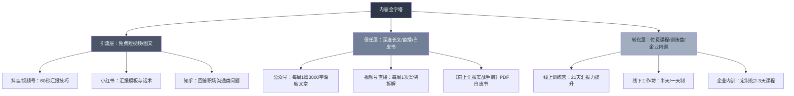
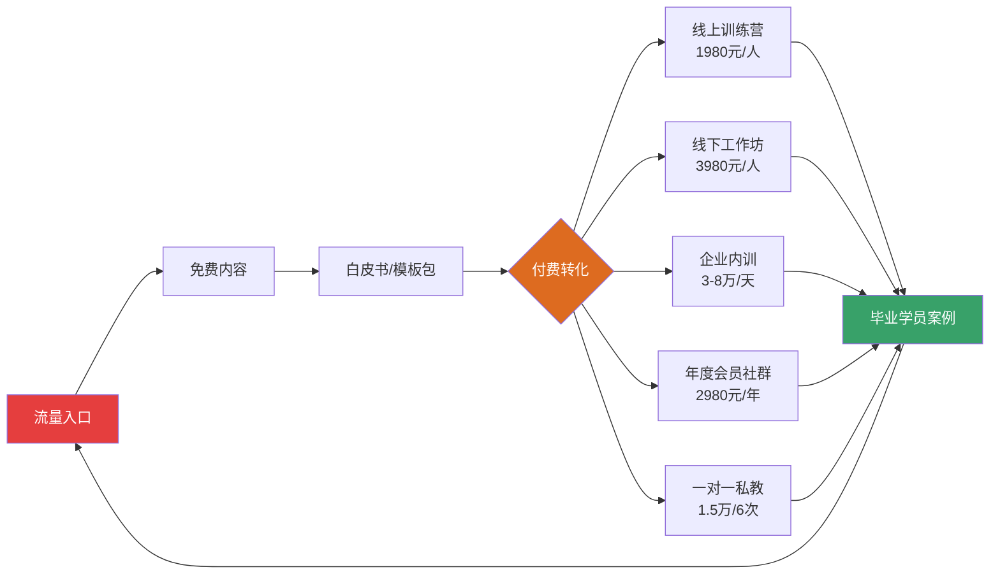
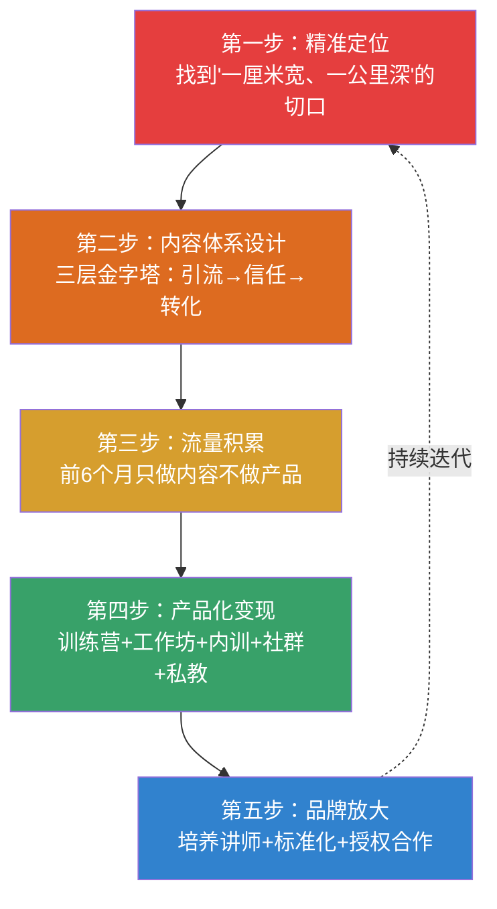

## 案例七：培训师的IP打造之路

### 案例背景

陈思远（化名），32岁，原某上市教育科技公司的高级培训经理，负责企业内训体系搭建和讲师团队管理，从业9年。2022年初决定以"职场沟通与表达力培训"为切入点，走个人IP打造路线，目标是从"公司旗下的讲师"升级为"自带流量的培训IP"。

**为什么选择IP路线而非普通培训师路线？**

陈思远观察到一个行业趋势：传统培训师高度依赖培训机构和经纪公司派单，收入的30%-50%被渠道抽走，且客户认的是机构品牌而非讲师个人。一旦脱离平台，客源立刻断崖。而拥有个人IP的培训师，客户是冲着"你这个人"来的，不仅议价权更强，还能延伸出课程、书籍、社群等多元变现路径。

**他的起点盘点：**

| 维度 | 现状 | 优势/劣势 |
|------|------|-----------|
| 专业能力 | 9年培训经验，年授课量120+天，学员评分均4.8/5 | 优势：实战经验丰富，课程交付能力过硬 |
| 行业人脉 | 认识200+企业HR和培训负责人 | 优势：有初始获客渠道 |
| 个人品牌 | 零——没有公众号、没有短视频账号、没有出过书 | 劣势：线上影响力为零 |
| 变现模式 | 纯靠课酬（每天3000-5000元），年收入约40-60万 | 瓶颈：天花板明显，收入=时间×单价 |
| 个人意愿 | 不满足于"讲课机器"，想建立自己的品牌护城河 | 驱动力强 |

### 第一阶段：定位与内容体系搭建（第1-4个月）

#### 精准定位：找到"一厘米宽、一公里深"的切口

陈思远没有选择做"职场技能培训"这样的大品类，而是聚焦到一个极其具体的场景：**"职场汇报与向上沟通"**。

**定位逻辑拆解：**

1. **需求真实且高频**——几乎每个职场人都需要向领导汇报，但绝大多数人做得不好
2. **痛点明确可量化**——"汇报紧张""逻辑混乱""领导听不懂""提案总被驳回"，这些痛点用户自己就能感知
3. **竞品相对空白**——市面上讲"沟通"的很多，但专门讲"向上沟通与汇报"的几乎没有头部IP
4. **可延伸性强**——从汇报切入，后续可以扩展到演讲、谈判、跨部门协作等整个"职场表达"赛道

**定位一句话公式：** "帮助中基层管理者用结构化汇报赢得领导信任，实现职场晋升加速。"

#### 内容体系设计：三层内容金字塔

陈思远用了一个月时间设计了自己的内容体系，而非盲目开始发内容：

**内容选题库搭建方法：**

陈思远从三个来源收集了200+个选题：

- **学员真实问题**：翻了过去3年收集的学员反馈表，提炼出47个高频问题
- **知乎/小红书热门问答**：搜索"汇报""向上沟通""PPT"等关键词，收集点赞最高的问题
- **自身经验沉淀**：把9年培训中最有感触的案例和方法论整理成选题卡片

最终将选题分为四个系列，每个系列15-20个子话题，保证半年的内容不断更。

#### 第一批内容发布：测试市场反应

| 平台 | 内容形式 | 发布频率 | 一个月数据 |
|------|----------|----------|------------|
| 抖音 | 60秒口播短视频 | 日更 | 粉丝1200，最高单条播放8.3万 |
| 小红书 | 图文笔记（汇报模板+话术） | 隔日更 | 粉丝800，收藏率最高12% |
| 知乎 | 长文回答 | 每周3篇 | 3篇回答被推荐到首页 |
| 公众号 | 深度长文 | 每周1篇 | 粉丝300，篇均阅读150 |

**关键发现：** 抖音的"汇报翻车案例拆解"类视频完播率最高（45%），小红书的"汇报模板"类笔记收藏率远超其他类型。这验证了一个内容策略——**"负面案例+正面方案"的对比结构**最受欢迎。

### 第二阶段：流量积累与信任建设（第5-12个月）

#### 内容矩阵优化：从"什么都发"到"精准打击"

基于第一阶段的数据反馈，陈思远做了三个关键调整：

**调整一：砍掉低效平台，聚焦主战场**

知乎的流量转化路径太长（从知乎到微信到付费的链路断裂），果断减少投入。将80%精力分配给抖音和小红书，20%给公众号。

**调整二：打造"钩子内容"引流到私域**

每条短视频和图文的结尾都引导用户领取《向上汇报实战手册》PDF（30页的干货文档），通过添加企业微信领取。这份白皮书成为核心引流工具。

**白皮书设计要点：**

- 开头1页：痛点共鸣（"你是否有过这些汇报窘境？"）
- 中间25页：5个核心方法论+15个真实案例+10套汇报模板
- 结尾4页：训练营和企业内训的软性介绍+联系方式
- 排版专业，可直接打印使用，增强"获得感"

**调整三：建立"内容-互动-转化"的飞轮**

在评论区和私信中，陈思远亲自回复每一条咨询，将用户分为三个层级：

| 用户层级 | 特征 | 引导动作 |
|----------|------|----------|
| 潜在用户 | 只看不互动 | 持续推送免费内容 |
| 活跃粉丝 | 点赞收藏评论 | 引导进微信，发送白皮书 |
| 高意向用户 | 主动私信咨询 | 1对1沟通，推荐训练营 |

#### 爆款内容复盘：一条视频涨粉2万的拆解

2022年7月，一条标题为"月薪3千和月薪3万的人，汇报差距到底有多大？"的视频在抖音获得了150万播放，单条视频涨粉2.2万。

**这条视频成功的关键因素：**

1. **标题制造冲突**——薪资对比天然吸引点击
2. **前3秒抓注意力**——用一段真实的"汇报翻车"场景开头
3. **中间给出对比**——同一份工作内容，用两种截然不同的汇报方式呈现
4. **结尾留下钩子**——"完整汇报模板在我主页，关注后私信领取"
5. **评论区运营**——置顶一条"你见过最离谱的汇报是什么？"的互动问题，引发500+条UGC内容

#### 信任建设：从"内容创作者"到"行业专家"

仅有流量不够，还需要建立专业信任。陈思远做了三件事：

**第一件：出版行业白皮书**

联合一家企业管理咨询公司，发布了一份《2022中国企业员工汇报能力调研报告》，调研了500+企业、3000+员工。这份报告被36氪、虎嗅等媒体转载，极大提升了专业可信度。

**第二件：争取行业背书**

- 受邀在某知名商学院做了一次主题分享
- 成为某头部企业管理平台的特聘讲师
- 在行业峰会上做了一次15分钟的闪电演讲

**第三件：积累学员案例**

每期训练营结束后，收集学员的真实变化数据：

- "学习后3个月内获得晋升的学员占比：23%"
- "汇报被领导驳回率下降的学员占比：78%"
- "学员平均NPS（净推荐值）：72分"

这些数据成为后续所有营销素材中最有力的背书。

### 第三阶段：产品化变现（第13-24个月）

#### 产品线设计：从单一课酬到多元收入

陈思远的收入结构从"纯课酬"逐步演变为五条产品线：

**各产品线详解：**

**线上训练营（"21天汇报力提升计划"）：**
- 价格：1980元/人
- 形式：21天，每天1个微课视频（15分钟）+1个实战练习+助教点评
- 班级制：每期限50人，保证互动质量
- 转化率：免费内容到训练营的转化率约2-3%
- 完课率：85%（通过押金机制+社群打卡驱动）
- 复购率：35%的学员会报名进阶课程或年度社群

**线下工作坊（"高管汇报力突破营"）：**
- 价格：3980元/人（含午餐和资料）
- 形式：一天制，上午理论+下午实战演练+一对一指导
- 频率：每月1-2期，每期15-20人
- 优势：线下体验感强，学员满意度高，转介绍率40%

**企业内训：**
- 价格：3-8万/天（根据企业规模和定制化程度）
- 频率：每月2-4场
- 客单价提升路径：单次培训→系列课程→年度培训顾问
- 典型客户：互联网公司、金融机构、制造业龙头企业

**年度会员社群（"汇报力研习社"）：**
- 价格：2980元/年
- 权益：每月1次直播答疑、季度线下聚会、案例库持续更新、群内随时提问
- 续费率：62%
- 核心价值：低成本持续触达高粘性用户，是其他产品的转化池

**一对一私教（"高管汇报私教"）：**
- 价格：1.5万元/6次（每次90分钟）
- 目标客户：总监级以上需要高频汇报的高管
- 服务内容：根据其真实汇报场景做定制化辅导，含PPT优化和模拟演练
- 利润率最高，但受时间约束，每月最多接5个

#### 收入结构演变

| 收入来源 | 第12个月 | 第18个月 | 第24个月 |
|----------|----------|----------|----------|
| 企业内训 | 4.5万（100%） | 6万（55%） | 8万（35%） |
| 线上训练营 | 0 | 2.5万（23%） | 5万（22%） |
| 线下工作坊 | 0 | 1.5万（14%） | 4万（17%） |
| 年度社群 | 0 | 0.5万（5%） | 3.5万（15%） |
| 一对一私教 | 0 | 0.3万（3%） | 2.5万（11%） |
| **月收入合计** | **4.5万** | **10.8万** | **23万** |
| **年化收入** | **54万** | **130万** | **276万** |

### 第四阶段：品牌放大与团队化（第25-36个月）

#### 从个人IP到品牌IP

当月收入稳定在20万+之后，陈思远开始思考一个关键问题：**如何让品牌不完全依赖自己一个人？**

**第一步：培养内部讲师**

从训练营的优秀学员中选拔了3位潜力讲师，经过3个月的集中培训和试讲，让他们能够独立交付标准化的企业内训课程。讲师课酬为每天5000-8000元，陈思远赚取品牌溢价和项目管理费。

**第二步：标准化课程体系**

将所有课程内容文档化、标准化，形成完整的课程包：

- 讲师手册（逐页讲解稿+时间分配）
- 学员手册（理论框架+练习模板+案例集）
- 课后工具包（汇报自检清单+模板库+案例库）
- 评估工具（课前测评+课后测评+3个月跟踪问卷）

**第三步：品牌授权与合作**

与3家区域性培训机构达成品牌授权合作，授权他们使用"XX汇报力"品牌在当地开展培训，收取品牌使用费+课程授权费（每场5000-10000元）。

#### 团队搭建

| 角色 | 人数 | 职责 | 薪资模式 |
|------|------|------|----------|
| 运营助理 | 1人 | 社群运营、学员服务、数据统计 | 底薪6000+绩效 |
| 内容编辑 | 1人 | 公众号、小红书内容制作 | 底薪5000+绩效 |
| 签约讲师 | 3人 | 企业内训和工作坊交付 | 按场次结算 |
| 课程顾问 | 1人 | 企业客户对接、方案设计 | 底薪8000+提成 |

团队月成本约5-6万，但带来的是产能的3倍放大和品牌的去个人化。

### 成果数据总览

| 指标 | 起步时（第1个月） | 12个月 | 24个月 | 36个月 |
|------|-------------------|--------|--------|--------|
| 月收入 | 0 | 4.5万 | 23万 | 35万 |
| 全平台粉丝 | 0 | 8.5万 | 32万 | 58万 |
| 付费学员累计 | 0 | 120人 | 1800人 | 4500人 |
| 企业客户数 | 0 | 8家 | 35家 | 80家 |
| 训练营复购率 | — | 35% | 42% | 48% |
| 企业客户复购率 | — | 25% | 55% | 68% |
| 团队人数 | 1人 | 1人 | 5人 | 8人 |

### 关键决策复盘

**决策一：先做内容还是先做课程？**

陈思远选择了"先内容、后课程"。前4个月只发内容不做任何付费产品，看似"浪费"了时间，但实际上积累了第一批种子用户和市场验证数据。当他推出第一个训练营时，首批50个名额在3天内售罄，因为前4个月的内容已经建立了足够的信任。

**决策二：定价策略——高开还是低开？**

训练营定价1980元，在同类产品中属于中高价位。陈思远的逻辑是：**低价吸引的是价格敏感型用户，他们的学习意愿和复购率都较低；中高价筛选出的是真正有痛点、愿意投入的用户，他们的学习效果更好，案例更优质，转介绍更多。** 事实证明，1980元的训练营NPS（72分）远高于市场同类999元训练营的平均水平（45分）。

**决策三：是否接"低价大单"？**

第14个月，一家培训机构提出一次性打包20场培训，但单价压到每天4000元（正常是6000-8000元）。陈思远拒绝了。理由：低价大单会拉低品牌定位，且占用大量时间，挤压产品开发和内容创作的空间。宁可少赚短期钱，不损长期品牌价值。

### 踩坑记录与避坑指南

**坑一：内容选题"自嗨"**

前两个月，陈思远发了很多自己觉得专业但用户不感兴趣的内容（比如"培训体系搭建方法论"）。数据惨淡。后来改为从用户真实痛点出发（"领导说'你到底想说什么'怎么办"），数据立刻好转。教训：**内容选题要从用户视角出发，而非从专业视角出发。**

**坑二：过度依赖单一平台**

第8个月，抖音突然限流了一周（疑似算法调整），陈思远的私域引流几乎断流。此后他建立了"1+N"的内容分发策略——以微信生态（公众号+视频号+企业微信）为核心阵地，抖音、小红书等为辅助引流渠道。核心资产（用户关系、付费用户）只沉淀在微信生态。

**坑三：社群运营精力失控**

年度社群做大后，每天有大量学员提问，陈思远一度每天花3-4小时在社群回复。后来制定了"社群运营SOP"：
- 每天固定2个时间段集中回复（上午10点、晚上8点）
- 高频问题整理成FAQ文档，引导学员自助
- 培养3位活跃学员成为"助教志愿者"，给予社群积分和课程折扣

**坑四：企业内训的"定制化陷阱"**

有客户要求"完全定制化"课程，即根据其公司文化和业务场景从零设计。陈思远接了几个后发现，每个定制项目需要额外投入20-30小时的准备时间，实际利润率大幅下降。后来的策略是：**提供"半定制化"——用标准化课程框架+30%的企业专属案例和练习**，既满足客户需求，又控制成本。

### 可复用的方法论提炼

陈思远的IP打造之路，可以提炼为一套可复制的"培训师IP打造五步法"：

**核心心法：**

1. **定位决定天花板**——选赛道比努力更重要，宁可小而深，不要大而浅
2. **内容是最大的杠杆**——一条优质内容可以持续带来流量，远比一次性的销售拜访高效
3. **信任需要时间沉淀**——不要急于变现，前6个月专注建立专业信任
4. **产品设计要分层**——不同用户有不同的付费意愿和需求，用不同产品承接
5. **品牌最终要"去个人化"**——从"陈思远的课"变成"XX品牌的方法论"，才能实现规模化

### 读者行动清单

**如果你也想走培训师IP路线，按以下清单逐步推进：**

**第1个月（定位期）：**
- [ ] 梳理自己的专业背景，找到3-5个可能的定位方向
- [ ] 在知乎、小红书搜索这些方向的竞争情况和用户需求
- [ ] 确定最终定位，写出一句话价值主张
- [ ] 设计内容金字塔（引流层+信任层+转化层各是什么）

**第2-3个月（内容启动期）：**
- [ ] 选择1-2个主力平台开始发布内容
- [ ] 保持每周至少3-5条内容的更新频率
- [ ] 关注数据反馈，找到最受欢迎的内容类型
- [ ] 制作一份引流用的免费资料（白皮书/模板包/工具包）

**第4-6个月（流量积累期）：**
- [ ] 全平台粉丝达到5000+
- [ ] 私域微信好友达到500+
- [ ] 完成至少3次免费直播或分享，验证用户需求
- [ ] 设计第一个付费产品（训练营或工作坊）

**第7-12个月（变现验证期）：**
- [ ] 完成第一期付费产品交付，收集学员反馈
- [ ] 月收入突破2万
- [ ] 建立标准化的课程交付流程
- [ ] 开始接企业内训订单

**第13-24个月（规模化期）：**
- [ ] 产品线扩展到3个以上
- [ ] 月收入突破10万
- [ ] 组建2-3人的小团队
- [ ] 培养1-2位内部讲师

**第25-36个月（品牌化期）：**
- [ ] 完成课程体系标准化文档
- [ ] 启动品牌授权或合作计划
- [ ] 年收入突破200万
- [ ] 从"个人IP"升级为"品牌IP"
