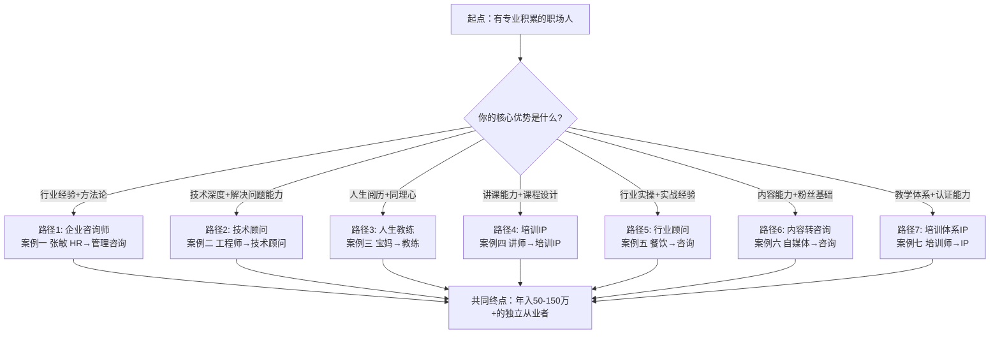
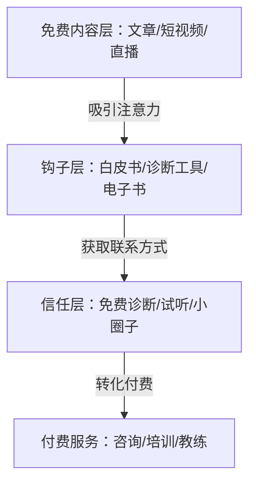
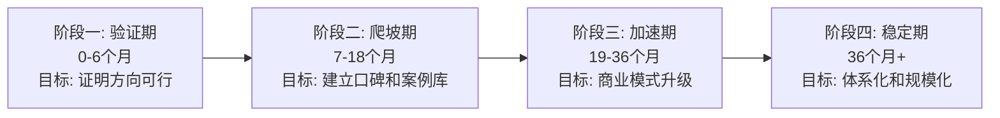

## 最终总结：七条路径，一套底层逻辑

前面七个案例，主角身份各异——HR、工程师、宝妈、培训师、餐饮老板、自媒体人——但他们走过的路，踩过的坑，拿到的结果，呈现出高度一致的规律。本节不是简单重复案例内容，而是从七个真实转型故事中提炼出**可迁移的底层模型**，帮你找到属于自己的那条路，并提前绕开暗礁。

---

### 七条转型路径全景图

先用一张图看清七条路径的全貌，找到与你最接近的那条：



**找到你最近的入口**：不需要从零开始学新技能，而是从你已有的积累出发。张敏用12年HR经验切入，工程师用技术深度切入，宝妈用人生阅历切入——起点不同，但路径的底层结构惊人地相似。

---

### 七个案例核心数据对比

| 案例 | 起点身份 | 转型方向 | 起步收入 | 成熟期年收入 | 转型周期 | 核心商业模式 |
|------|----------|----------|----------|-------------|----------|-------------|
| 案例一 | HR总监 | 企业管理咨询师 | 0（前3月） | 150万+ | 36个月 | 咨询项目+培训+年度顾问 |
| 案例二 | 技术工程师 | 行业技术顾问 | 0 | 14.4万（月1.2万） | 12-18个月 | 技术咨询+方案设计 |
| 案例三 | 全职宝妈 | 人生教练 | 0 | 50万 | 18-24个月 | 1对1教练+团体课 |
| 案例四 | 企业内训师 | 培训IP | 0 | 80-120万 | 24-36个月 | 企业培训+在线课程 |
| 案例五 | 餐饮老板 | 餐饮咨询顾问 | 0 | 60-100万 | 12-24个月 | 行业诊断+运营优化 |
| 案例六 | 自媒体博主 | 咨询顾问 | 广告收入 | 80-150万 | 18-30个月 | 内容引流+高客单价咨询 |
| 案例七 | 企业培训师 | 培训体系IP | 0 | 100-300万 | 36-48个月 | 培训+认证+加盟体系 |

**关键发现**：

1. **起步阶段收入都是零**——所有案例在前3-6个月几乎没有咨询收入，这段时间全部投入在定位、背书建设和内容输出上。如果你指望第一个月就有收入，这个行业不适合你。
2. **收入增长呈指数曲线而非线性**——前期慢，一旦积累到临界点（通常是第一个标杆案例出现后），收入会快速爬升。张敏的收入从第4个月的3万到第18个月的月均12万，增长了4倍。
3. **年收入天花板与商业模式直接相关**——只做1对1咨询的人（案例二）天花板最低，做培训IP和体系化的人（案例七）天花板最高。商业模式的选择比努力更重要。

---

### 从七个案例中提炼的六大成功规律

这六条规律不是鸡汤，而是从数据和真实经历中归纳出的可验证模式。

#### 规律一：精准定位是一切的起点——"一厘米宽，一公里深"

张敏没有做"万能管理咨询师"，而是聚焦"互联网公司组织架构设计与人才梯队建设"这个细分领域。这个选择直接决定了她后续所有动作的方向。

**为什么精准定位如此重要？**

1. **降低获客成本**——当你的定位足够精准，目标客户会自动找到你。"做管理咨询"的说法没人记得住，但"帮互联网公司解决组织架构问题"会让正在经历组织阵痛的CEO主动联系你。
2. **提高转化率**——客户购买咨询服务时，最大的顾虑是"这个人能不能解决我的具体问题"。你的定位越精准，客户越容易判断你是不是他要找的人。
3. **加速口碑积累**——在一个细分领域做出3-5个成功案例后，你会成为这个领域的"默认选项"。转介绍的效率远高于广撒网。

**定位三步法**：

| 步骤 | 操作 | 张敏的案例 |
|------|------|-----------|
| 第一步：盘点 | 列出你所有的技能、经验、人脉、资源 | 12年HR经验，8年互联网，搭过3家公司架构 |
| 第二步：筛选 | 找到交集——你擅长的 × 市场愿意付费的 × 竞争不太激烈的 | 互联网+组织架构，中小公司需求大但供给少 |
| 第三步：验证 | 用最小成本测试市场反应（免费诊断、行业分享、内容测试） | 做了3次免费诊断，发现需求真实存在 |

**定位的常见错误**：
- ❌ 定位太宽："我是管理咨询师"——等于没定位
- ❌ 定位太窄："我是帮杭州西湖区50人以下电商公司做绩效考核的"——市场太小
- ❌ 定位只考虑自己擅长的，不考虑市场是否有付费意愿
- ✅ 正确定位：足够窄到能在3个月内建立认知，足够宽到能支撑年收入百万以上

#### 规律二：第一个成功案例是整个业务的转折点

张敏的关键转折是帮助一家200人的互联网公司在3个月内完成组织架构调整，人效提升40%。这个案例成为她最有说服力的背书——此后所有获客、定价、谈判都有了筹码。

**如何打造你的第一个标杆案例？**

1. **选对第一个客户**——不要选最难的，要选"最容易出成果"的。一个效果显著的小案例，远比一个效果平庸的大案例有价值。
2. **做超预期交付**——第一个案例的目的是"拿结果"，不是"赚钱"。适当降低价格，但把服务质量拉满，确保客户能看到可量化的改善。
3. **把案例转化为资产**——项目结束后，立刻把过程和结果整理成案例研究（Case Study），征得客户同意后用于后续获客。一份详细的案例研究比100篇朋友圈文案都管用。
4. **追求可量化的成果**——"提升了客户满意度"是废话，"客户满意度从72%提升到91%"才是武器。数字是你最好的销售员。

**案例研究的标准模板**：

```text
客户背景：行业、规模、阶段、痛点
诊断过程：用了什么方法，发现了什么问题
解决方案：具体做了什么，分几个阶段
执行过程：关键节点和调整
量化成果：用数字说话（效率提升X%，成本降低X万，收入增长X%）
客户证言：让客户说一句话，比你说十句都管用
```

#### 规律三：内容营销是获客的"滚雪球引擎"

七个案例的获客渠道高度重合，排名前三的是：

1. **转介绍（占比50%-70%）**——老客户推荐新客户，获客成本几乎为零，转化率最高。但转介绍需要时间积累，前6个月别指望。
2. **内容营销（占比20%-30%）**——持续输出专业内容（文章、短视频、直播、白皮书），建立专业形象，吸引陌生客户主动联系。张敏在脉脉和LinkedIn上持续输出组织管理内容，刘工（案例二）在技术社区发表深度技术分析。
3. **行业社群（占比10%-20%）**——加入目标客户所在的社群，通过免费分享、回答问题建立信任。不是在群里发广告，而是先贡献价值。

**内容营销的三层漏斗**：



- **免费内容层**：在公域平台（公众号、知乎、B站、小红书、脉脉、LinkedIn）持续输出专业内容。不需要每篇都是万字长文，但需要保持稳定的更新频率（至少每周1-2篇）。
- **钩子层**：用高价值的免费资源换取用户的联系方式。张敏的《互联网公司组织诊断白皮书》就是典型——读者觉得内容好，愿意留下邮箱/微信获取完整版。
- **信任层**：通过免费诊断、试听课、小范围分享等方式，让潜在客户体验你的专业能力。体验后付费转化率通常是未经体验的5-10倍。

**内容选题的黄金公式**：`目标客户的痛点 × 你的专业经验 × 时效性`

- ❌ "管理咨询行业发展趋势"——太泛，目标客户不关心行业趋势
- ❌ "组织架构设计方法论"——太学术，缺乏场景感
- ✅ "200人互联网公司为什么总在组织架构上翻车？"——有场景、有痛点、有共鸣

#### 规律四：商业模式升级路径——从"卖时间"到"卖体系"

这是决定收入天花板的关键变量。七个案例的商业模式可以归纳为四个层次：

| 层次 | 模式 | 特征 | 典型年收入 | 代表案例 |
|------|------|------|-----------|----------|
| L1 | 卖时间 | 按小时/按天收费，人到场才有收入 | 20-50万 | 案例二（技术顾问） |
| L2 | 卖项目 | 按项目整体报价，交付成果物 | 50-150万 | 案例一（管理咨询）、案例五（餐饮顾问） |
| L3 | 卖产品 | 标准化课程/方法论，可重复销售 | 80-300万 | 案例四（培训IP）、案例六（内容转咨询） |
| L4 | 卖体系 | 认证/加盟/平台，别人用你的体系赚钱 | 200万-1000万+ | 案例七（培训体系IP） |

**升级的关键转折点**：

- **L1→L2**：当你积累了3-5个成功案例后，客户开始信任你能交付结果，你就可以从按时间收费转向按项目收费。这一步的核心是"交付信心"。
- **L2→L3**：当你发现自己在不同项目中重复做类似的事情，就应该把这些重复的部分标准化为课程或方法论。张敏开发的"组织健康度诊断模型"就是从项目经验中提炼出来的。
- **L3→L4**：当你的方法论足够成熟，可以教别人使用你的体系来服务客户时，你就从"卖自己的服务"变成"卖你的品牌和体系"。这一步需要极强的品牌力和体系化能力。

**大多数人卡在哪里？**

- 卡在L1的最多——一直做1对1咨询，收入有天花板，时间有上限。突破方法：主动寻求项目制合作，用案例证明自己的交付能力。
- 卡在L2的也不少——会做项目但不会做产品。突破方法：把项目中的标准流程、工具、模板整理成可复用的体系。

#### 规律五：定价是定位，不是竞争工具

张敏的定价策略值得所有咨询从业者学习——她从不打价格战。

**定价的底层逻辑**：

咨询与培训的定价不是"别人收多少我也收多少"，而是由三个因素决定：

1. **你为客户创造的价值**——如果帮客户省了100万，收10万是合理的。如果只帮客户做了一份报告，收10万就不合理。
2. **你的稀缺性**——如果你是这个细分领域唯一的专家，定价权在你。如果有100个同质竞争者，你只能打价格战。
3. **客户的支付能力**——服务500强和服务小微企业，定价可以差10倍以上。

**不同阶段的定价策略**：

| 阶段 | 策略 | 具体做法 |
|------|------|----------|
| 起步期（0-6个月） | 低价获案例 | 免费诊断+低价项目（市场价的30%-50%），核心目标是积累案例和口碑 |
| 成长期（7-18个月） | 逐步提价 | 每完成2-3个项目提价10%-20%，用案例数量和质量支撑涨价 |
| 成熟期（18个月+） | 价值定价 | 根据项目对客户的价值定价，不再参考"市场均价" |

**定价的常见错误**：
- ❌ 一开始就定高价——没有案例支撑的高价只能吓跑客户
- ❌ 长期低价——低价吸引的是"价格敏感型"客户，他们最难伺候，复购率最低
- ❌ 按时间收费时无限压缩自己的时间——效率越高收入越低，这是最大的讽刺
- ✅ 正确做法：起步低价换案例，用案例换口碑，用口碑换定价权

#### 规律六：复购和转介绍是长期利润的核心

所有成熟案例中，老客户贡献的收入占比都在60%-80%之间。这意味着：**你花在维护老客户上的每一分钱，回报率都是获取新客户的3-5倍。**

**如何提升复购率？**

1. **建立年度服务模式**——从单次项目转向年度顾问，张敏的年度顾问合同每个客户30-50万/年，相当于每个月都在贡献收入。
2. **主动创造新需求**——完成一个项目后，不要等客户找你，主动提供"进阶服务"或"关联服务"。比如做完组织架构咨询后，可以接着做人才梯队建设、绩效体系设计。
3. **定期回访和价值输出**——每个月给老客户发一份行业洞察报告，每季度做一次免费回访。这些"免费"动作会让你在客户需要新服务时第一个被想到。

**如何提升转介绍率？**

1. **做好服务是基础**——客户不会推荐一个让他没面子的服务商给朋友。
2. **主动请求转介绍**——很多咨询师不好意思开口。在项目结束、客户满意度最高的时候，直接说："如果您身边有朋友也面临类似的问题，欢迎推荐给我。"简单直接，效果最好。
3. **给转介绍人奖励**——不一定是现金（很多高端客户不在乎钱），可以是优先服务权、免费咨询时长、或者请一顿好饭。关键是让介绍人感受到你的重视。
4. **让转介绍变得简单**——准备一份简洁的自我介绍和案例集，让老客户可以直接转发给朋友，而不是让老客户帮你"推销"。

---

### 七种转型路径的适用条件速查

不是每条路都适合每个人。根据你的实际情况选择最优路径：

| 你的背景 | 推荐路径 | 核心优势 | 关键挑战 | 预期起步时间 |
|----------|----------|----------|----------|-------------|
| 企业中高管（5年+） | 企业咨询师 | 行业经验+人脉 | 从内部视角切换到外部视角 | 6-12个月 |
| 技术专家 | 技术顾问 | 技术深度+解决问题能力 | 不擅长商业表达和销售 | 3-9个月 |
| 有人生阅历+同理心 | 人生教练 | 信任感+引导能力 | 需要专业教练认证 | 12-18个月 |
| 企业内训师 | 培训IP | 讲课能力+课程设计 | 从企业内到市场的适应期 | 6-18个月 |
| 行业实操经验者 | 行业顾问 | 实战经验+落地能力 | 从"做事"到"教人做事"的转变 | 6-12个月 |
| 自媒体博主（粉丝1万+） | 内容转咨询 | 流量基础+信任积累 | 从免费内容到付费服务的转化 | 3-9个月 |
| 资深培训师 | 培训体系IP | 教学体系+行业口碑 | 从个人IP到可复制体系的跨越 | 18-36个月 |

---

### 七条路径的共性风险与应对

无论走哪条路，以下风险都可能出现。提前准备，才能临危不乱：

#### 风险一：前期收入断崖（0-6个月零收入或极低收入）

**表现**：辞职做咨询/培训后，发现前3-6个月几乎没有付费客户，储蓄快速消耗，心态开始动摇。

**应对策略**：
- **不要裸辞**——在全职工作期间就开始副业试水，等副业收入达到工资的50%-70%再考虑全职转型。
- **准备12个月的生活备用金**——不是6个月，是12个月。咨询行业的起步期比大多数创业项目都要长。
- **用"免费"换"案例"**——前3-6个月的免费服务不是"白干"，而是在投资你的案例库和口碑。

#### 风险二：定位漂移（什么都想做）

**表现**：看到别人做企业培训赚钱就想做培训，看到教练火了就想做教练，看到自媒体好做就想做内容。结果什么都做，什么都不精。

**应对策略**：
- **用一年时间只做一个方向**——给自己设定一个"定位锁定期"，至少12个月内不换方向。
- **用数据做决策**——每个方向测试2-3个月，看数据（获客成本、转化率、客户满意度）而不是凭感觉。
- **接受"做减法"比"做加法"更难**——说"不"的能力，比说"是"的能力更重要。

#### 风险三：交付质量失控（接太多单导致质量下降）

**表现**：客户多了以后，每个项目分配的时间减少，交付质量开始下降，客户满意度降低，口碑受损。

**应对策略**：
- **限制同时服务的客户数量**——1对1咨询同时不超过5-8个项目，培训每月不超过8-10场。
- **建立标准化交付流程**——把每个项目的关键节点、检查清单、质量标准固化下来，减少对个人状态的依赖。
- **宁可涨价也不降低质量**——当你的时间不够用时，正确的做法是涨价而不是压缩质量。

#### 风险四：知识焦虑（觉得自己不够格）

**表现**：总觉得自己学得不够多、经验不够丰富、没有某某专家厉害，迟迟不敢开始接客户、做分享。

**应对策略**：
- **记住"80分教60分"原则**——你不需要是100分的专家才能教别人。你只要比你的目标客户懂得多，就能提供价值。
- **从"学习者"切换到"实践者"**——把学习的时间压缩到20%，把实践和输出的时间拉到80%。真正的成长来自"教"和"做"，而不是"学"。
- **用第一个客户的反馈来校准**——不要自己猜客户需要什么，去做一次免费诊断，让客户的反馈告诉你应该提升什么。

---

### 不同收入阶段的关键任务

从零到年入百万，不是一条匀速的路。每个阶段有不同的核心任务：



| 阶段 | 核心任务 | 关键指标 | 最常犯的错误 |
|------|----------|----------|-------------|
| 验证期（0-6月） | 找到定位，积累2-3个成功案例 | 有没有人愿意付费？ | 过早追求收入规模 |
| 爬坡期（7-18月） | 扩大获客渠道，建立转介绍体系 | 月收入是否稳定增长？ | 定价太低不敢涨价 |
| 加速期（19-36月） | 从卖时间升级到卖项目/产品 | 是否有了可复用的方法论？ | 什么都想做，不肯聚焦 |
| 稳定期（36月+） | 体系化、团队化、平台化 | 老客户复购率和转介绍率 | 忽视交付质量，过度扩张 |

---

### 从案例到行动：你的下一步

读完七个案例，你可能觉得"道理都懂了，但不知道从哪里开始"。下面是一个具体的30天启动计划，每天都有明确的任务：

**第一周：定位与验证**

| 天数 | 任务 | 产出物 |
|------|------|--------|
| 第1天 | 盘点你的技能、经验、人脉、资源 | 一份详细的个人资产清单 |
| 第2天 | 用"三步定位法"确定3个候选方向 | 3个定位选项（每个一句话描述） |
| 第3天 | 在社交媒体上搜索这三个方向的市场需求 | 一份市场需求分析笔记 |
| 第4天 | 选1个方向，写一段"我能帮你解决什么问题"的自我介绍 | 一段100字的定位描述 |
| 第5天 | 联系3个潜在客户，提供免费诊断 | 3个诊断邀约（至少1个成功） |
| 第6天 | 做第一次免费诊断 | 一份诊断报告 |
| 第7天 | 总结诊断经验，调整定位 | 修订后的定位描述 |

**第二周：案例与内容**

| 天数 | 任务 | 产出物 |
|------|------|--------|
| 第8天 | 根据诊断反馈，设计你的第一个服务产品 | 一个服务产品描述（含价格） |
| 第9天 | 完成第一篇专业文章 | 一篇2000字以上的专业文章 |
| 第10天 | 发布文章到1-2个平台 | 发布链接 |
| 第11天 | 联系2个新的潜在客户 | 新的诊断邀约 |
| 第12天 | 做第二次免费诊断 | 第二份诊断报告 |
| 第13天 | 完成第一篇案例研究（基于免费诊断） | 一份标准格式的案例研究 |
| 第14天 | 发布案例研究，同时发出第二篇文章 | 2篇内容已发布 |

**第三周：获客与定价**

| 天数 | 任务 | 产出物 |
|------|------|--------|
| 第15天 | 加入2-3个目标客户所在的行业社群 | 已加入社群列表 |
| 第16天 | 在社群中做一次免费分享或回答问题 | 分享记录/截图 |
| 第17天 | 根据前两次免费诊断的经验，设定正式定价 | 一份定价方案 |
| 第18天 | 联系之前免费诊断的客户，询问是否有付费需求 | 潜在付费客户列表 |
| 第19天 | 完成第三篇文章，发布 | 新文章已发布 |
| 第20天 | 设计你的"产品线"（免费→低价→中价→高价） | 一份产品线设计文档 |
| 第21天 | 回顾前3周的数据，调整策略 | 一份数据复盘报告 |

**第四周：优化与系统化**

| 天数 | 任务 | 产出物 |
|------|------|--------|
| 第22天 | 整理你的咨询/培训标准流程 | 一份SOP文档 |
| 第23天 | 制作一份简洁的个人介绍和服务手册 | 一份可转发的PDF |
| 第24天 | 联系之前所有接触过的客户，请求转介绍 | 转介绍邀约记录 |
| 第25天 | 完成第四篇文章+案例研究 | 2篇新内容 |
| 第26天 | 评估是否需要补充专业认证或培训 | 学习计划（如果需要） |
| 第27天 | 建立客户管理系统（即使只用Excel） | 一份客户跟踪表 |
| 第28天 | 制定下一个月的内容计划 | 一份内容日历 |
| 第29天 | 复盘整个30天的进展 | 一份完整的复盘报告 |
| 第30天 | 制定未来3个月的行动计划 | 一份季度计划 |

---

### 最后的忠告：三个"不要"和三个"一定要"

**三个不要**：

1. **不要裸辞后才开始**——在职期间就开始积累案例和客户。等到副业收入稳定后再考虑全职转型。太多人在"准备好了"的幻觉中浪费了最佳起步期。
2. **不要追求完美再开始**——你的第一个课程、第一篇文章、第一次诊断，一定不会完美。但"做完了再优化"远比"准备好了再开始"有效。完美主义是咨询行业最大的敌人。
3. **不要只学不做**——读完本章后的第一件事，不是去读更多的书，而是去联系你的第一个潜在客户。知识的价值在于应用，不在于积累。

**三个一定要**：

1. **一定要坚持记录和复盘**——每个项目的关键数据（客户满意度、交付周期、收入、成本）都要记录。数据是你做决策的唯一可靠依据。张敏能从3万/月增长到12万/月，靠的不是运气，而是对每个项目的数据复盘。
2. **一定要建立个人品牌**——在AI时代，有专业能力的人很多，但有专业品牌的人很少。品牌是你的定价权、获客能力和抗风险能力的综合体现。从今天开始，在至少一个平台上持续输出专业内容。
3. **一定要关注客户成果而非自己的收入**——当你把注意力放在"如何帮客户拿到结果"而不是"如何多赚点钱"时，收入反而会增长得更快。张敏的第一年几乎没赚到钱，但她帮助的每一个客户都拿到了超出预期的结果——这些结果就是她后来年入150万的基础。

---

### 本节核心数据回顾

| 指标 | 七案例共性数据 |
|------|---------------|
| 前期零收入期 | 3-6个月 |
| 首个标杆案例出现时间 | 第4-8个月 |
| 月收入突破1万的时间点 | 第6-12个月 |
| 月收入稳定在3万+的时间点 | 第12-18个月 |
| 转介绍获客占比 | 50%-70% |
| 老客户复购收入占比 | 60%-80% |
| 从L1升级到L2的平均时间 | 12-18个月 |
| 从L2升级到L3的平均时间 | 24-36个月 |

这些数据不是来自理论推演，而是来自真实案例的归纳。你的实际进度可能更快也可能更慢，取决于你的起点、投入程度和所在行业。但这个时间线给了你一个合理的预期——**咨询与培训不是快钱，但一旦起步，增长曲线会让你惊喜。**

---

