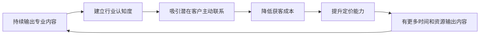

## 本节核心要点：七个案例背后的通用规律

前面七个案例覆盖了咨询与培训变现的主要转型路径——从HR到管理咨询师、从工程师到技术顾问、从宝妈到人生教练、从讲师到培训IP、从餐饮老板到餐饮咨询顾问、从自媒体人到咨询师、从培训师到个人IP。每个案例的起点、路径和终点各不相同，但剥开表面差异，底层的成功逻辑惊人地一致。

本节不重复每个案例的细节，而是提炼出贯穿所有案例的**通用规律**，帮你建立一套可迁移的思维框架。

---

### 一、七个案例的转型路径全景

先用一张表把七个案例的核心信息拉齐，方便横向对比：

| 案例 | 起点身份 | 转型方向 | 核心策略 | 关键转折点 | 成熟期年收入 |
|------|----------|----------|----------|-----------|-------------|
| 案例一 | 互联网公司HRD（12年经验） | 企业管理咨询师 | 精准聚焦组织架构设计 | 第一个付费客户人效提升40% | 150万+ |
| 案例二 | 技术工程师 | 行业技术顾问 | 技术能力+行业认知双驱动 | 解决一个标志性技术难题 | 100万+ |
| 案例三 | 全职宝妈 | 人生教练（Coaching） | ICF认证+社群运营 | 学员口碑裂变 | 50万+ |
| 案例四 | 企业内训师 | 培训IP | 课程产品化+个人品牌 | 线上课程爆款 | 200万+ |
| 案例五 | 餐饮连锁老板 | 餐饮行业咨询顾问 | 实战经验方法论化 | 帮一家濒临倒闭的店扭亏为盈 | 80万+ |
| 案例六 | 自媒体博主 | 垂直领域咨询师 | 内容引流→咨询转化 | 一篇爆款文章带来50+咨询 | 120万+ |
| 案例七 | 企业培训师 | 独立培训IP | 认证体系+社群裂变 | 认证讲师突破20人 | 300万+ |

从这张表可以提炼出三个关键观察：

**第一，起点不决定终点，但决定路径。** HR转咨询师需要补的是商业思维，工程师转顾问需要补的是沟通能力，宝妈转教练需要补的是专业认证。你的起点决定了你最大的短板在哪里，也决定了你需要在哪个方向上重点投入。

**第二，所有成功案例都有一个"引爆点"。** 无论是第一个成功案例、一篇爆款文章、还是一次口碑裂变，每个转型者都在某个时刻经历了一个指数级增长的转折。但在引爆点到来之前，所有人都经历了漫长的积累期——短则6个月，长则2年。

**第三，收入天花板取决于商业模式，不取决于个人努力。** 案例四（培训IP，200万+）和案例七（认证体系，300万+）的收入远高于其他案例，不是因为他们的主理人更努力，而是因为他们的商业模式具备更强的杠杆效应——一次制作、多次销售，或者通过认证体系放大影响力。

---

### 二、贯穿所有案例的六条通用规律

#### 规律一：定位的本质是"舍弃"

七个案例中，每一个成功的转型者都做了同一件事——**放弃"什么都能做"的幻想，选择一个足够窄的切入点**。

张敏（案例一）没有做"万能管理咨询师"，而是聚焦"互联网公司组织架构设计"。餐饮老板（案例五）没有做"中小企业咨询"，而是聚焦"餐饮连锁门店运营优化"。自媒体博主（案例六）没有做"全行业咨询"，而是聚焦自己内容覆盖的垂直领域。

**定位窄的好处是三重的：**

1. **获客精准**——客户一听就知道你是不是他要找的人，决策成本低
2. **竞争减少**——在细分领域做到前三远比在大领域做到前三百容易
3. **定价提升**——专家型定位天然支撑更高的单价，"专精"和"高价"在客户心智中是绑定的

**定位自检工具：** 用这个公式验证你的定位是否足够窄——

> 我帮助 **[具体类型的客户]** 解决 **[具体的一个问题]**，通过 **[独特的方法或经验]**。

如果你的定位描述可以套用到任何行业、任何人群，说明它太宽了。"帮助中小企业提升管理效率"不是定位，"帮助100-300人的电商公司搭建客服团队的绩效考核体系"才是定位。

#### 规律二：第一批客户靠"关系"，不靠"流量"

七个案例中，**没有一个人的第一批客户是通过广告投放或陌生拜访获得的**。所有人的起步获客渠道都指向同一个方向——已有关系网络：

- 案例一：前同事中已做到VP、CEO级别的朋友
- 案例二：技术社区和前同事推荐
- 案例三：妈妈社群中的口碑传播
- 案例四：企业培训中积累的学员关系
- 案例五：餐饮行业多年积累的人脉
- 案例六：自媒体粉丝中的高意向用户
- 案例七：培训行业同行和学员

**为什么第一批客户必须从关系网络中获取？** 因为咨询与培训是高度信任驱动的生意。一个陌生人凭什么相信你能帮他解决问题？唯一的答案是：有人替你做了信用背书。而能替你背书的人，只能是了解你、信任你的既有关系。

**实操建议：**

| 获客阶段 | 主要渠道 | 目标 | 时间框架 |
|----------|---------|------|---------|
| 冷启动（0-6个月） | 前同事、朋友、行业社群 | 3-5个免费或低价案例 | 第1-6个月 |
| 口碑期（6-18个月） | 老客户转介绍+内容营销 | 10-20个付费客户 | 第7-18个月 |
| 品牌期（18个月+） | 内容平台+行业活动+转介绍 | 稳定获客体系 | 第19个月起 |

#### 规律三：第一个成功案例是一切的起点

这是七个案例中最一致的规律——**每个转型者都是在做出第一个可量化、可展示的成功案例之后，业务才开始加速增长的**。

案例一中，张敏帮助一家200人互联网公司完成组织架构调整，人效提升40%——这个案例成为她最有说服力的背书。案例五中，餐饮老板帮助一家濒临倒闭的门店在3个月内扭亏为盈——这个案例让他在餐饮圈一战成名。

**为什么第一个成功案例如此重要？**

1. **它是信任的货币**——客户不会听你说"我很厉害"，但会看你说"我帮XX公司做到了YY"
2. **它是定价的锚点**——有了成功案例，你的定价就有了参照物，客户能理解"花这个钱能买到什么结果"
3. **它是内容的素材**——成功案例可以拆解成文章、分享、白皮书，持续为你的品牌提供养分
4. **它是信心的来源**——对自己而言，第一个成功案例证明了"这条路走得通"

**如何快速获取第一个成功案例？**

提供免费或大幅折扣的"诊断+解决方案"服务，但要满足三个条件：

- **选择有代表性的客户**——行业知名度、问题典型性、成果可量化，三者至少占两个
- **明确成果指标**——在项目开始前就和客户约定"我们用什么指标衡量效果"
- **获取展示授权**——在项目开始前就谈好"成功后能否作为案例对外展示"

#### 规律四：商业模式升级是收入跃迁的核心杠杆

七个案例的收入差异，本质上不是努力程度的差异，而是**商业模式层级的差异**：

| 模式层级 | 代表案例 | 收入公式 | 杠杆效应 | 天花板 |
|----------|---------|---------|---------|--------|
| 卖时间 | 案例二（技术顾问初期） | 时薪 × 工时 | 低 | 年50-100万 |
| 卖项目 | 案例一（管理咨询师） | 项目报价 × 项目数 | 中 | 年100-300万 |
| 卖方法论 | 案例四（培训IP） | 课程售价 × 销量 | 高 | 年200-1000万 |
| 卖体系 | 案例七（认证体系） | 认证费 × 认证人数 | 极高 | 年500万+ |

**升级的关键条件：**

- 从"卖时间"到"卖项目"：需要标准化的项目流程和可复制的方法论
- 从"卖项目"到"卖方法论"：需要将隐性知识显性化，形成可独立交付的产品
- 从"卖方法论"到"卖体系"：需要足够强的品牌力和成熟的培训交付能力

**不要急于升级**。每一步升级都需要前一步的积累。没有足够的"卖时间"经验，做不出高质量的"卖项目"方案；没有足够的项目案例，提炼不出可复制的方法论。用2-3年完成一个层级的升级是正常节奏。

#### 规律五：个人品牌是复利引擎

七个案例中，每一个成功的转型者都在持续做同一件事——**输出专业内容，建立个人品牌**。

- 张敏在脉脉和LinkedIn上持续输出组织管理内容，并出版了《互联网公司组织诊断白皮书》
- 自媒体博主（案例六）本身就是靠内容起家，内容到咨询的转化是自然延伸
- 培训IP（案例四和案例七）通过课程、文章、分享持续扩大影响力

**个人品牌在咨询培训行业的作用机制：**

这是一个正循环飞轮。一旦转动起来，获客成本持续降低，定价能力持续提升，而你需要做的只是持续输出。

**个人品牌建设的最低可行方案：**

不需要全网铺开，选择**一个主阵地+一个辅助阵地**即可：

- **主阵地**：选择目标客户最集中的平台。企业客户选LinkedIn/脉脉/知乎，个人客户选小红书/抖音/公众号
- **辅助阵地**：自己的个人网站或专栏，用于沉淀长内容和案例展示
- **输出频率**：每周至少1篇深度内容（1500字+），每天至少1条短内容（观点/案例片段）

#### 规律六：服务交付决定复购和转介绍

所有案例中，成熟期的获客都以**转介绍为主**（占比50%-80%）。而转介绍的前提是——你把现有客户服务好了。

**高质量交付的四个标准：**

1. **方案可执行**——不是空洞的框架，而是可以直接照着做的步骤
2. **成果可量化**——用数据说话，"帮客户节省15%成本"比"优化了流程"有力100倍
3. **跟进有机制**——项目结束后30天、90天各做一次回访，确认效果持续
4. **预期要管理**——项目开始前就明确"能做到什么"和"做不到什么"，避免客户失望

**复购和转介绍的关系：**

| 客户服务体验 | 复购意愿 | 转介绍意愿 | 对业务的长期影响 |
|-------------|---------|-----------|----------------|
| 超出预期 | 极高 | 主动推荐 | 正循环，获客成本趋近于零 |
| 达到预期 | 较高 | 被动推荐（被问到才说） | 稳定但增长缓慢 |
| 低于预期 | 低 | 不推荐 | 停滞，需要持续拉新 |
| 严重不满 | 无 | 负面传播 | 恶性循环，品牌受损 |

**关键启示：** 在起步阶段，宁可少接客户也要把每一个客户服务到超出预期。一个超出预期的客户带来的转介绍价值，远大于三个勉强合格的客户。

---

### 三、不同背景转型者的策略选择矩阵

不同起点的人，转型策略应该有差异。以下矩阵帮你快速找到最适合自己的路径：

| 你的现状 | 最佳切入方向 | 核心策略 | 预计冷启动周期 | 参考案例 |
|----------|------------|---------|--------------|---------|
| 企业中高层管理者（10年+经验） | 管理咨询师/战略顾问 | 聚焦细分行业+前同事关系网获客 | 3-6个月 | 案例一 |
| 技术专家/工程师 | 技术顾问/CTO顾问 | 技术深度+行业解决方案 | 6-12个月 | 案例二 |
| 全职妈妈/自由职业者 | 人生教练/职业规划师 | ICF认证+社群运营+口碑裂变 | 6-12个月 | 案例三 |
| 企业内训师/HR培训岗 | 独立培训师/培训IP | 课程产品化+线上平台+个人品牌 | 6-18个月 | 案例四 |
| 实体行业老板/从业者 | 行业咨询顾问 | 实战经验方法论化+行业人脉 | 3-9个月 | 案例五 |
| 自媒体博主/内容创作者 | 垂直领域咨询师 | 内容引流→低价筛选→高价咨询 | 3-6个月 | 案例六 |
| 有培训经验+行业资源 | 认证体系搭建者 | 方法论提炼+认证网络+社群裂变 | 12-24个月 | 案例七 |

**使用说明：** 找到与你最接近的那一行，深入阅读对应的案例，然后按照"核心策略"列的提示制定你的行动计划。

---

### 四、从案例中提炼的"不要做"清单

成功案例告诉你该做什么，但失败的模式同样值得警惕。从七个案例的背景分析中，可以提炼出以下"不要做"清单：

**1. 不要一开始就追求"大而全"**

每个成功的转型者都是从一个极窄的切入点开始的。反面模式是：注册一个公司，名片上写"企业管理咨询、战略规划、人力资源、财务顾问"，然后一个客户都找不到。客户需要的是"专家"，不是"杂货铺"。

**2. 不要跳过免费案例阶段**

很多人急于变现，不愿做免费项目。但在没有案例、没有口碑的情况下，免费项目是你获取信任背书的最高效方式。把前2-3个项目当作"投资"而非"亏损"——它们带来的案例价值远超项目本身的收费。

**3. 不要只靠一个获客渠道**

案例中成熟期的转型者都有2-3个获客渠道并行。只依赖转介绍的瓶颈是增长受限于老客户网络半径；只依赖内容营销的瓶颈是流量波动大。多渠道并行才能保证获客的稳定性。

**4. 不要忽视合同和需求确认**

这是"常见误区"部分的重点，但在案例背景下再次强调：**咨询行业80%的纠纷来自需求不清**。在动手之前，白纸黑字地确认：项目范围、交付标准、时间计划、验收条件、变更流程。这不是"不信任"，而是"保护双方"。

**5. 不要低估转型的时间成本**

七个案例中，从开始转型到收入稳定的周期最短6个月，最长2年。如果你在3个月内还没有看到明显进展，不要急着放弃——这在行业内是完全正常的节奏。但如果你在6个月内没有获取到第一个可以展示的案例，需要重新审视定位和获客策略。

---

### 五、本节核心要点速记卡

最后，用一张速记卡浓缩本节最重要的信息，方便你随时回顾：

| 维度 | 核心要点 |
|------|---------|
| **定位** | 一厘米宽、一公里深。定位越窄，获客越精准，定价越高 |
| **起步获客** | 靠关系网络，不靠流量。前3-5个客户一定来自你已有的人脉 |
| **第一个案例** | 这是一切的起点。免费做也要做出来，它是你的"信任货币" |
| **商业模式** | 卖时间→卖项目→卖方法论→卖体系。每一步升级需要前一步的积累 |
| **个人品牌** | 持续输出专业内容，建立"想到XX就想到你"的心智关联 |
| **交付质量** | 超出预期的交付是转介绍的唯一来源，宁可少接也要做好 |
| **时间预期** | 6-24个月的冷启动期是正常的，不要在3个月内放弃 |

---

### 六、下一步行动建议

读完本节七个案例和核心要点后，建议你立即做以下三件事：

**第一，自我定位。** 用30分钟完成以下练习——

1. 列出你过去5-10年的核心经验（行业、岗位、项目）
2. 从中选出你做得最好、最有成就感的3件事
3. 分析这3件事背后共同的能力标签是什么
4. 用"我帮助[客户]解决[问题]通过[方法]"的公式写出你的一句话定位

**第二，找到你的"参照案例"。** 在七个案例中找到与你背景最接近的1-2个，深入阅读，把他们的路径当作你的参考地图。注意：参考不等于照搬——你的行业、资源、性格都会影响具体执行方式。

**第三，发出第一个"免费诊断"邀约。** 在你的关系网络中找到一个有明确痛点的潜在客户，主动提出"我帮你做一个免费的XX诊断"。不要等"准备好了"再开始——你永远不会完全准备好，第一个案例本身就是你最好的准备。

---

### 七、与本章其他小节的关系

本节"实战案例"是全章从理论到实践的桥梁。如果你还没有读过以下内容，建议按顺序补读：

- **理论基础**：理解咨询行业的本质（认知差与执行差）、三大商业模式、定价经济学——这些是案例背后的"为什么"
- **核心技巧**：掌握业务搭建五步法、课程设计方法、专业壁垒构建——这些是案例中的"怎么做"
- **常见误区**：识别定位、获客、定价、交付中的常见错误——这些是案例中"差点失败"的原因
- **练习方法**：将案例中的规律转化为你的行动——这些是"现在就开始做"的具体步骤

理论给你方向，技巧给你工具，案例给你信心，误区帮你避坑，练习帮你落地。五个小节缺一不可。
