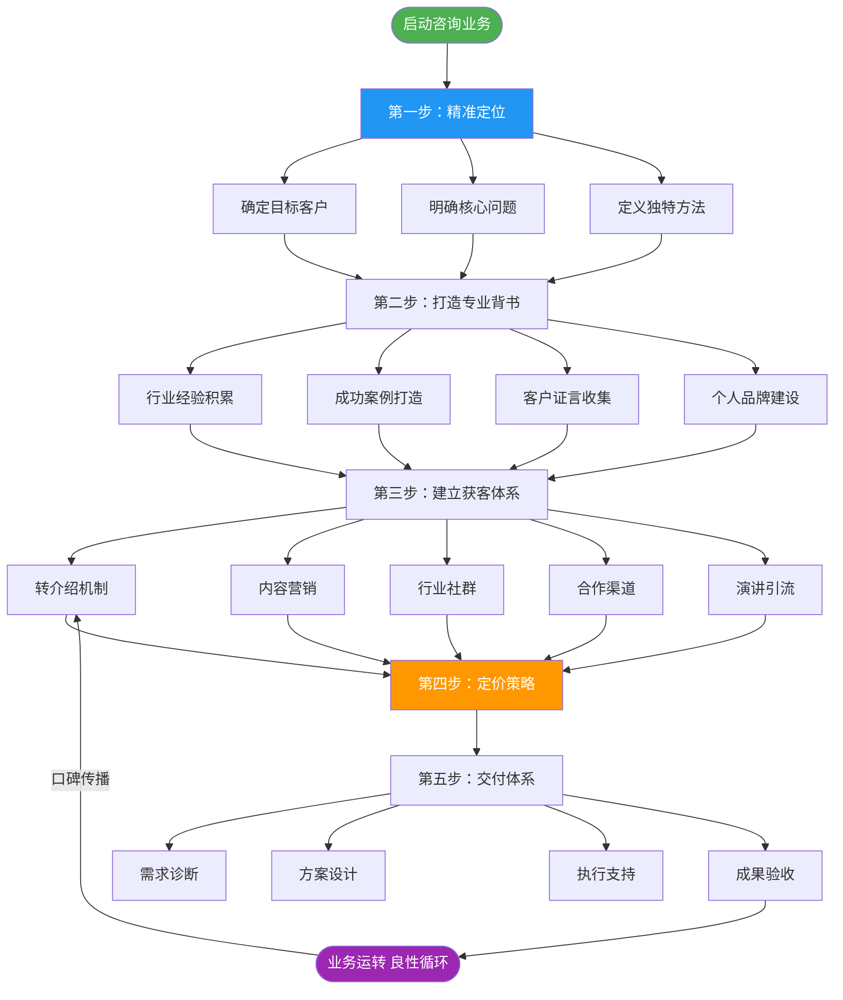
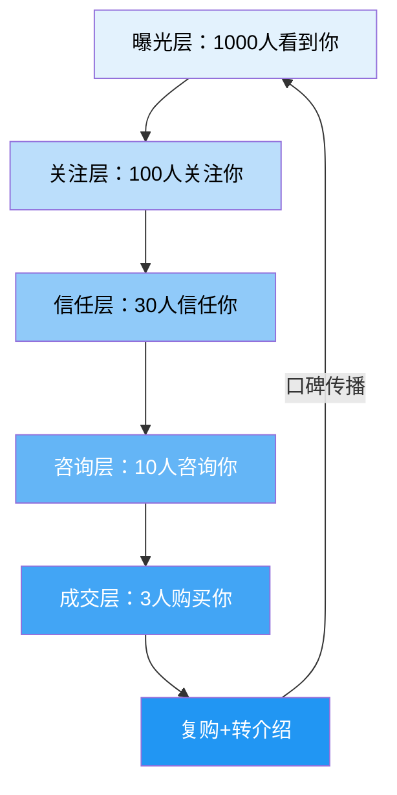
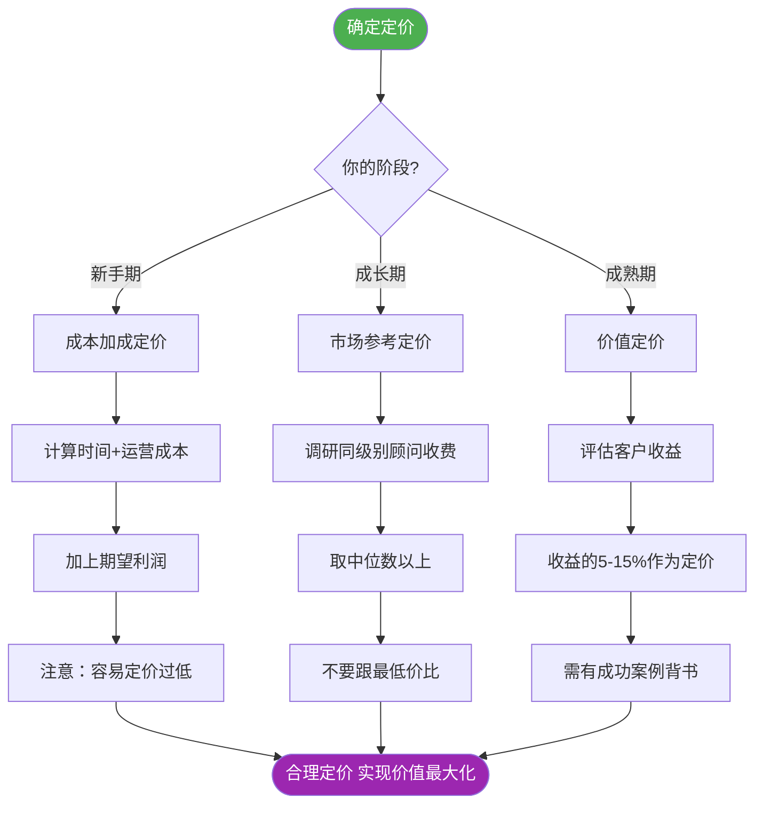

## 一、个人咨询业务搭建五步法

搭建一个能赚钱的咨询业务，本质上就是回答五个问题：**你是谁？服务谁？怎么卖？怎么交付？怎么涨价？** 这五个问题对应五个步骤，缺一不可，顺序也不能乱。

很多有专业能力的人，卡在"不知道怎么开始"上。他们可能在某个领域有十年经验，帮公司解决过无数难题，但一旦想自己出来做咨询，就懵了——不知道怎么定位、不知道怎么定价、不知道客户从哪来。这套五步法就是帮你把"有能力"变成"能赚钱"的完整路径。

### 咨询业务构建全景图

**为什么是这个顺序？** 定位决定你服务谁，背书决定客户信不信你，获客决定有没有客户来，定价决定你赚多少，交付决定客户会不会再来以及帮你推荐新客户。这五步形成一个闭环——好的交付带来口碑，口碑带来更多客户，更多客户积累更多案例，更多案例支撑更高定价。

***

### 第一步：精准定位——找到你的"一厘米宽、一公里深"

定位是咨询业务的地基。地基不稳，后面所有努力都是白费。很多咨询新手犯的最大错误就是"什么都想做"，结果什么都做不好。

#### 定位公式

> 我帮助【目标客户】解决【具体问题】，通过【独特方法】。

这个公式看起来简单，但每一个空都需要认真思考：

| 要素 | 说明 | 示例 |
|------|------|------|
| 目标客户 | 越具体越好，包括行业、规模、阶段 | "年营收5000万-2亿的餐饮连锁品牌" |
| 具体问题 | 客户愿意付费解决的痛点 | "门店扩张速度慢、选址成功率低" |
| 独特方法 | 你区别于其他顾问的核心方法论 | "基于数据分析的选址模型+标准化开店流程" |

#### 定位自检清单

在确定定位之前，用这五个问题检验你的定位是否合格：

1. **能不能一句话说清楚？** 如果你需要用三分钟才能解释你是做什么的，说明定位还不够清晰。
2. **客户听到后会不会说"这个我需要"？** 如果客户的反应是"哦，听起来不错"但没有紧迫感，说明痛点不够痛。
3. **有没有足够的市场容量？** 太窄的定位可能只有十几个潜在客户，撑不起一个业务。
4. **你有没有相关的成功经验？** 定位必须建立在你的真实能力之上，不能凭空想象。
5. **竞争格局如何？** 如果一个细分领域已经有十个成熟顾问，你需要找到差异化的切入点。

#### 常见定位错误

**错误一：定位太宽泛**

- 错误示例："我是做管理咨询的"
- 问题：管理咨询涵盖战略、运营、人力、财务等无数领域，客户无法快速判断你是否适合他
- 修正："我专注帮助制造型企业的生产运营效率提升"

**错误二：定位基于能力而非需求**

- 错误示例："我会数据分析，所以做数据分析咨询"
- 问题：客户不关心你会什么，只关心你能帮他解决什么问题
- 修正："我帮助电商企业通过数据驱动的选品策略，将库存周转率提升30%"

**错误三：定位缺乏差异化**

- 错误示例："我做品牌策划"
- 问题：做品牌策划的人成千上万，客户凭什么选你？
- 修正："我专注新消费品牌的从0到1品牌策划，服务过20+新消费品牌，平均帮助客户在6个月内建立品牌认知"

**错误四：定位太超前或太滞后**

- 太超前：市场还没有意识到这个问题需要外部顾问来解决
- 太滞后：市场已经饱和，头部顾问占据了大部分份额
- 正确做法：选择市场正在觉醒、需求快速增长的领域

#### 正确定位示例

| 定位 | 为什么好 |
|------|----------|
| "我帮助餐饮连锁品牌在6个月内实现门店数量翻倍" | 目标客户明确（餐饮连锁），结果可量化（翻倍），时间有约束（6个月） |
| "我帮助B2B企业通过内容营销降低50%的获客成本" | 痛点精准（获客成本高），方法清晰（内容营销），效果可衡量（降低50%） |
| "我帮助互联网公司技术管理者从技术骨干转型为合格的CTO" | 人群精准（技术转管理），痛点真实（角色转型困难），场景具体 |

#### 定位验证方法

确定定位后，不要急着全面铺开，先做小规模验证：

1. **朋友圈测试：** 用一句话描述你的定位，发到朋友圈，看有没有人私信问"这个具体怎么做"
2. **免费咨询测试：** 找3-5个目标客户做免费咨询，验证他们是否真的有这个痛点、是否愿意为此付费
3. **内容测试：** 围绕定位写3-5篇深度文章，看阅读量和互动量是否高于你其他内容
4. **价格测试：** 尝试报一个价格，看客户的反应——如果客户毫不犹豫就答应了，说明你定价太低

***

### 第二步：打造专业背书——让人相信你值这个价

在咨询行业，信任是最稀缺的资源。客户购买的不是你的服务，而是对你的信任。一个有十年经验但没有案例的顾问，和一个只有三年经验但有三个成功案例的顾问，客户会选择后者。

#### 信任建立的底层逻辑

客户对咨询顾问的信任，本质上回答三个问题：

1. **你懂不懂？** ——你是否真正理解这个行业和这个问题
2. **你做没做过？** ——你是否有成功解决类似问题的经验
3. **别人怎么说你？** ——第三方是否认可你的能力

这三个问题分别对应三种背书：专业能力背书、成功案例背书、社会认同背书。

#### 八大背书建设路径

| 背书类型 | 具体方式 | 权重 | 建设周期 | 适合阶段 |
|----------|----------|------|----------|----------|
| 行业经验 | 10年以上从业经历 | ★★★★★ | 长期 | 所有阶段 |
| 成功案例 | 3-5个可量化的成功案例 | ★★★★★ | 中期 | 起步期必备 |
| 客户证言 | 知名客户的推荐信/视频 | ★★★★ | 中期 | 成长期 |
| 媒体曝光 | 行业媒体采访、专栏 | ★★★★ | 中期 | 成长期 |
| 学术背景 | 名校学位、专业认证 | ★★★ | 长期 | 所有阶段 |
| 个人品牌 | 公众号、知乎、抖音粉丝 | ★★★ | 长期 | 所有阶段 |
| 出版物 | 书籍、白皮书 | ★★★ | 中长期 | 成熟期 |
| 演讲经历 | 行业峰会、论坛演讲 | ★★★ | 中期 | 成长期 |

**关键技巧：** 不需要全部具备，选择2-3个重点突破。初期最重要的两个是"行业经验"和"成功案例"。

#### 案例打造的实操方法

没有案例怎么办？以下是四种获取第一批案例的方法：

**方法一：从现有工作中提炼**

如果你还在职，回顾你过去的工作成果。你帮公司做过哪些项目？取得了什么成果？把公司内部的项目经验，转化为可展示的案例（注意脱敏，不要泄露商业机密）。

**方法二：免费或低价服务种子客户**

找3-5个目标客户，以极低的价格甚至免费提供服务，条件是允许你使用案例（脱敏后）。这是最快积累案例的方式。注意：免费服务也要签正式合同，明确交付范围和成果衡量标准，否则容易变成无底洞。

**方法三：通过内容营销积累案例**

写行业分析文章、做案例拆解视频、发布行业报告。这些内容本身就是你的"作品集"，展示你的专业深度。

**方法四：考取专业认证**

某些行业有权威认证（如PMP、CFA、CPA等），认证本身就是专业能力的背书。选择与你定位相关的认证，投入时间考取。

#### 案例呈现的黄金结构

一个好的案例不是简单地说"我帮客户做得更好了"，而是要用结构化的方式呈现：

| 案例要素 | 说明 | 示例 |
|----------|------|------|
| 客户背景 | 行业、规模、阶段（脱敏） | "某年营收8000万的餐饮连锁品牌" |
| 面临问题 | 具体的痛点和挑战 | "门店扩张速度慢，新店存活率仅60%" |
| 干预措施 | 你做了什么 | "建立选址评估模型+标准化开店流程" |
| 量化成果 | 用数据说话 | "12个月内新开15家门店，存活率提升至90%" |
| 客户证言 | 客户的评价 | "这是我们合作过的最专业的顾问团队" |

#### 没有背书时的破局策略

如果你是纯新手，没有任何行业经验，可以考虑以下路径：

1. **先在企业内部积累：** 在公司内部推动某个项目，积累可量化的成果
2. **做行业研究：** 深度研究一个行业，写出有洞察力的分析报告
3. **找师傅带：** 加入成熟顾问的团队，跟着做项目积累经验
4. **从小客户开始：** 大客户看背书，小客户看性价比。先用低价服务小客户，积累案例后再涨价

***

### 第三步：获客体系——建立稳定的需求来源

咨询行业的获客，不能靠"等客户上门"。你需要建立一套系统化的获客体系，让客户源源不断地找到你。

#### 获客漏斗模型

这个漏斗的每一层都有转化率。你的任务是优化每一层的转化率，让更多人从"看到你"变成"购买你"。

**各层转化率的行业基准：**

| 漏斗层级 | 转化率基准 | 优化方向 |
|----------|------------|----------|
| 曝光→关注 | 5%-10% | 内容质量、标题吸引力 |
| 关注→信任 | 20%-30% | 持续输出、案例展示 |
| 信任→咨询 | 30%-40% | 咨询入口设计、CTA |
| 咨询→成交 | 20%-40% | 诊断能力、方案说服力 |
| 成交→复购 | 30%-50% | 交付质量、客户关系维护 |

#### 七大获客渠道详解

**渠道一：转介绍（占咨询行业获客的50%以上）**

转介绍是咨询行业最优质的获客来源。通过转介绍来的客户，信任度高、成交周期短、价格敏感度低。

转介绍的三个关键动作：

1. **交付超预期：** 客户愿意推荐你，前提是你做得比承诺的更好
2. **主动开口：** 项目结束后，主动跟客户说"如果您身边有朋友遇到类似问题，欢迎推荐给我"
3. **设计激励机制：** 推荐成功后给推荐人返佣（通常5%-10%），或者提供增值服务

转介绍话术模板：

> "张总，这次项目合作很愉快，看到您的团队执行力很强，效果比我们预期的还好。如果您身边有朋友的企业也面临类似的XX问题，欢迎推荐给我。作为感谢，我会为推荐的客户提供首次咨询的8折优惠，同时也会为您安排一次XX主题的深度复盘。"

**渠道二：内容营销**

内容营销是建立长期获客引擎的关键。优质内容可以持续为你带来流量和潜在客户。

内容营销的三个层次：

| 层次 | 形式 | 目的 | 频率 |
|------|------|------|------|
| 引流层 | 短视频、行业热点评论 | 吸引关注 | 每周2-3条 |
| 信任层 | 深度文章、案例分析 | 建立专业形象 | 每周1篇 |
| 转化层 | 白皮书、行业报告 | 筛选意向客户 | 每月1份 |

内容选题的四个方向：

1. **行业痛点：** "为什么你的XX总是做不好？"
2. **方法论分享：** "三步搞定XX的完整方法"
3. **案例拆解：** "某企业如何在6个月内实现XX"
4. **趋势洞察：** "2025年XX行业的三个关键变化"

**渠道三：行业社群**

加入目标客户所在的行业社群（微信群、知识星球、行业协会），在社群中提供价值、建立专家形象。关键原则：先给予，再获取。不要一进群就发广告，而是先回答别人的问题、分享有价值的见解，让大家自然认可你的专业度。

**渠道四：合作渠道**

与互补型咨询公司、行业协会、企业服务平台合作。例如，你做战略咨询，可以找做落地执行的公司合作；你做营销咨询，可以找做品牌设计的公司合作。合作的核心是互利——你帮他们补短板，他们帮你带客户。

**渠道五：演讲/培训引流**

通过免费或低价的公开课、行业会议分享、企业内部分享获取潜在客户。演讲是最好的"活广告"——一个小时的分享，比十篇文章更能建立信任。关键：演讲内容要有干货，结束时留一个"钩子"（如免费诊断名额），引导感兴趣的听众联系你。

**渠道六：线上平台**

在行、知乎咨询、LinkedIn等平台接单。适合新手起步阶段，平台帮你解决信任问题（平台背书+评价体系），但平台会抽成（通常20%-30%），且客户质量参差不齐。

**渠道七：主动BD（商务拓展）**

研究目标企业，找到痛点，主动联系。这是最"笨"但也最可控的方式。关键：不要群发模板邮件，而是针对每家企业定制化地说明你能解决的具体问题，最好附上类似行业的成功案例。

#### 获客体系搭建的时间线

| 阶段 | 时间 | 重点渠道 | 目标 |
|------|------|----------|------|
| 起步期 | 第1-3个月 | 主动BD + 线上平台 | 获得第一批3-5个客户 |
| 成长期 | 第4-12个月 | 内容营销 + 转介绍 | 建立稳定的获客管道 |
| 成熟期 | 12个月以上 | 转介绍 + 演讲引流 | 80%以上客户来自转介绍 |

***

### 第四步：定价策略——定高价还是定低价？

在咨询行业，价格不仅是收入，更是定位。定价太低，客户会质疑你的能力；定价太高，没有案例支撑会吓跑客户。定价是一门需要不断调整的艺术。

#### 咨询定价策略决策图

#### 五种定价策略详解

**策略一：成本加成定价**

计算公式：定价 = （时间成本 + 运营成本）× （1 + 期望利润率）

| 成本项 | 计算方式 | 示例 |
|--------|----------|------|
| 时间成本 | 你的年收入目标 ÷ 可用工作天数 | 目标年入100万 ÷ 200天 = 5000元/天 |
| 运营成本 | 办公、工具、差旅、保险等 | 平均500元/天 |
| 期望利润率 | 行业通常30%-50% | 40% |
| 最终定价 | (5000+500) × 1.4 = 7700元/天 | ≈8000元/天 |

优点：简单易算，适合新手起步。缺点：容易定价过低，因为你可能低估了自己的时间价值。

**策略二：市场参考定价**

参考同行业、同级别、同城市的咨询顾问收费标准。关键技巧：找到3-5个可比较的参照物，取中位数以上。不要跟最低价比——那些低价顾问要么在打价格战，要么服务品质差。

调研方法：

1. 在"在行"等平台搜索同领域顾问，查看其定价
2. 向行业前辈或同行了解市场行情
3. 参加行业协会活动，侧面打听
4. 查看招聘网站上同类岗位的薪资，推算顾问的合理收费

**策略三：价值定价**

这是最高级的定价方式。核心逻辑：根据你为客户创造的价值来定价，而不是根据你投入的时间。

价值定价的计算方式：

| 客户收益类型 | 计算方式 | 定价范围 |
|--------------|----------|----------|
| 帮客户增加收入 | 增量收入 × 5%-15% | 如帮客户多赚100万，收5-15万 |
| 帮客户降低成本 | 节省成本 × 10%-20% | 如帮客户省200万，收20-40万 |
| 帮客户避免损失 | 潜在损失 × 3%-10% | 如帮客户避免500万损失，收15-50万 |

价值定价的前提：你必须有成功案例背书，客户才会相信你真的能创造这些价值。

**策略四：锚定定价**

设定三个价格档位，让客户自然选择中间价位：

| 档位 | 价格 | 内容 | 目的 |
|------|------|------|------|
| 入门 | 2万 | 诊断咨询（1-2周） | 降低决策门槛 |
| 标准 | 20万 | 项目咨询（1-3个月） | 主力产品 |
| 尊享 | 100万 | 年度顾问（12个月） | 价格锚点 |

心理学原理：当客户看到100万的选项时，20万会显得"性价比很高"。这就是锚定效应——高端产品的存在不是为了卖出去，而是为了让中端产品更好卖。

**策略五：阶梯定价**

设计从低到高的产品线，让客户逐步升级：

| 层级 | 产品 | 价格 | 目的 |
|------|------|------|------|
| 免费 | 行业报告、公众号文章 | 0元 | 建立信任，扩大影响力 |
| 低价 | 线上课程、训练营 | 99-999元 | 筛选意向客户 |
| 中价 | 1对1咨询、小型项目 | 1万-10万 | 核心收入来源 |
| 高价 | 年度顾问、大型项目 | 10万-100万+ | 高利润业务 |

阶梯定价的核心逻辑：用低门槛产品让客户"试用"你的专业能力，建立信任后再引导升级到高价产品。

#### 定价的常见误区

| 误区 | 为什么错 | 正确做法 |
|------|----------|----------|
| 跟最低价竞争 | 利润薄、客户质量差、无法持续 | 找中位数以上，用价值而非价格竞争 |
| 不好意思报高价 | 低估自己的价值，客户反而不信任 | 研究市场行情，给自己一个合理的底价 |
| 一口价不灵活 | 不同客户预算差异大 | 设计阶梯产品，让客户有选择 |
| 只按时间收费 | 收入有天花板，效率越高赚得越少 | 逐步转向价值定价或项目定价 |
| 不涨价 | 通胀+能力提升，不涨价等于贬值 | 每年至少调整一次价格，涨幅10%-20% |

#### 涨价的时机和方法

涨价时机：

1. 你的案例积累到一定数量（如5个以上成功案例）
2. 你的客户排期已经排满（供不应求）
3. 你的服务能力有了明显提升（如掌握了新方法论）
4. 市场行情上涨（同类顾问都在涨价）

涨价方法：

- **新客户新价格：** 对新客户直接报新价格，老客户维持原价到合同结束
- **阶梯涨价：** 每次涨价10%-20%，不要一次涨太多
- **增加价值：** 涨价的同时增加服务内容，让客户觉得"物超所值"
- **提前通知：** 提前1-2个月通知老客户即将调价，给他们缓冲时间

***

### 第五步：交付体系——把"做了"变成"做好了"

交付是咨询业务的核心环节。很多顾问把精力都花在获客上，却忽视了交付质量。结果就是：客户不满意、没有转介绍、口碑越来越差。咨询行业的黄金法则：**交付决定一切。**

#### 交付的核心原则

交付的核心不是"做了多少"，而是"客户感受到了多少价值"。以下是三个关键原则：

1. **结果导向：** 客户买的不是你的工作量，而是结果。不要用"我做了多少页PPT"来衡量交付，要用"帮客户解决了什么问题"来衡量。
2. **超预期交付：** 承诺80分，交付100分。客户预期管理是交付的关键——承诺太多做不到会失望，承诺少做到多会惊喜。
3. **可视化进展：** 定期向客户展示阶段性成果，让客户看到"钱花得值"。不要等到项目结束才汇报，中间要有里程碑式的进展展示。

#### 交付体系的四个关键环节

**环节一：需求诊断**

需求诊断是交付的起点，也是最容易被忽视的环节。很多顾问犯的错误是"客户说什么就做什么"，但客户描述的问题往往不是真正的问题。

需求诊断的三层结构：

| 诊断层次 | 问题类型 | 诊断方法 | 示例 |
|----------|----------|----------|------|
| 表层问题 | 客户描述的问题 | 直接询问 | "我们销售额上不去" |
| 中层问题 | 背后的原因 | 结构化访谈+数据分析 | "产品定位不清晰，目标客户不精准" |
| 根层问题 | 系统性障碍 | 深度调研+组织诊断 | "创始人对市场的认知与实际脱节" |

需求诊断的标准流程：

1. **初步访谈（1-2小时）：** 与决策者沟通，了解表面问题和期望成果
2. **资料收集：** 获取企业内部数据、组织架构、业务流程等资料
3. **深度调研（1-2周）：** 访谈关键利益相关者，观察实际业务流程
4. **数据分析：** 用数据验证假设，找到问题的真正原因
5. **输出诊断报告：** 明确问题、原因、建议方案和优先级

**环节二：方案设计**

方案要具体、可执行、可衡量。避免"假大空"的建议——"加强品牌建设"不是方案，"在3个月内通过10场行业活动和20篇深度文章建立品牌认知"才是方案。

好方案的标准（SMART原则）：

| 标准 | 说明 | 反面示例 | 正面示例 |
|------|------|----------|----------|
| Specific（具体） | 明确做什么 | "提升品牌影响力" | "在知乎发布10篇行业深度回答" |
| Measurable（可衡量） | 有量化指标 | "让更多人知道我们" | "知乎粉丝增长5000人" |
| Achievable（可达成） | 现实可行 | "一个月内成为行业第一" | "三个月内进入细分领域前十" |
| Relevant（相关性） | 与核心问题相关 | "做抖音短视频"（但目标客户不在抖音） | "在行业媒体发布专栏" |
| Time-bound（有时限） | 有明确截止日期 | "以后要多做内容营销" | "Q3完成10篇深度文章" |

**环节三：执行支持**

不是给了方案就走人。很多顾问的问题是"方案写得很漂亮，但客户执行不了"。你必须陪伴客户执行，及时调整方案。

执行支持的三种模式：

| 模式 | 适用场景 | 频率 | 价格 |
|------|----------|------|------|
| 里程碑检查 | 简单项目，客户执行力强 | 每2周一次 | 基础价格 |
| 定期辅导 | 中等复杂度项目 | 每周一次 | 基础价格+30% |
| 驻场支持 | 复杂项目，需要深度参与 | 每天 | 基础价格+100% |

**环节四：成果验收**

用数据说话，量化成果。这是你获取案例和证言的关键时刻。

成果验收的标准流程：

1. **数据对比：** 对比项目前后的关键指标变化
2. **案例报告：** 整理完整的案例报告（脱敏后）
3. **客户证言：** 请求客户出具推荐信或录制证言视频
4. **复盘会议：** 与客户一起复盘项目过程，总结经验教训
5. **后续规划：** 讨论下一步合作方向（为复购埋下伏笔）

#### 交付中的常见问题及应对

| 问题 | 原因 | 应对方法 |
|------|------|----------|
| 客户期望过高 | 前期沟通没有管理好预期 | 项目启动前明确交付范围和限制条件 |
| 客户执行力差 | 方案太复杂或客户团队能力不足 | 简化方案，分阶段实施，提供执行模板 |
| 需求不断变更 | 客户想法多变，缺乏决策机制 | 合同中明确变更流程和额外费用 |
| 内部阻力大 | 项目触动了某些人的利益 | 提前识别利益相关者，争取关键人物支持 |
| 沟通效率低 | 没有固定的沟通机制 | 建立周报+双周会议的固定沟通节奏 |

#### 交付工具包

以下是咨询交付中常用的工具和模板：

| 工具类型 | 推荐工具 | 用途 |
|----------|----------|------|
| 项目管理 | 飞书/Notion/Asana | 任务分配、进度跟踪 |
| 文档协作 | 飞书文档/腾讯文档/Google Docs | 方案协作、实时编辑 |
| 数据分析 | Excel/Tableau/Python | 数据处理、可视化 |
| 演示汇报 | PowerPoint/Keynote/Canva | 方案呈现、成果汇报 |
| 沟通工具 | 微信/飞书/Zoom | 日常沟通、远程会议 |
| 知识管理 | Notion/Obsidian | 案例库、方法论沉淀 |

***

### 五步法的联动效应

这五步不是孤立的，而是相互强化的闭环：

| 步骤 | 输入 | 输出 | 下游影响 |
|------|------|------|----------|
| 精准定位 | 你的能力和市场需求 | 清晰的目标客户画像 | 决定获客渠道和定价策略 |
| 专业背书 | 行业经验和案例 | 客户信任 | 支撑高定价，降低获客难度 |
| 获客体系 | 内容和渠道 | 稳定的客户来源 | 提供案例积累的机会 |
| 定价策略 | 市场行情和自身价值 | 合理的价格体系 | 影响客户质量和利润水平 |
| 交付体系 | 客户需求和你的能力 | 超预期的服务体验 | 带来口碑和转介绍 |

**关键洞察：** 这五步的运转速度取决于"交付质量"。如果你的交付质量高，客户会主动帮你推荐新客户，你的获客成本会大幅降低，你可以把更多精力放在提升服务质量上——这就形成了正向飞轮。

***

### 从零到一的行动清单

如果你准备开始搭建自己的咨询业务，以下是前30天的行动计划：

| 天数 | 行动 | 产出 |
|------|------|------|
| 第1-3天 | 梳理自己的专业能力和行业经验 | 能力清单 |
| 第4-7天 | 研究目标市场，确定定位 | 一句话定位 |
| 第8-10天 | 整理过往案例，撰写案例报告 | 3个案例文档 |
| 第11-15天 | 设计服务产品和定价方案 | 产品手册 |
| 第16-20天 | 建立内容营销渠道（公众号/知乎/LinkedIn） | 3篇深度文章 |
| 第21-25天 | 联系潜在客户，做免费诊断 | 3-5个潜在客户 |
| 第26-30天 | 跟进意向客户，签约第一批客户 | 1-2个付费客户 |

***

### 本节核心要点

1. **定位是地基：** 用"我帮助【目标客户】解决【具体问题】，通过【独特方法】"公式，找到你的"一厘米宽、一公里深"
2. **背书是信任：** 初期重点打造"行业经验"和"成功案例"两种背书，其他可以逐步积累
3. **获客要系统：** 建立从曝光到成交的漏斗，初期靠主动BD和线上平台，成熟期靠转介绍和内容营销
4. **定价要自信：** 从成本加成起步，逐步转向价值定价，每年至少调整一次价格
5. **交付是核心：** 结果导向、超预期交付、可视化进展，用数据说话，用案例积累口碑
