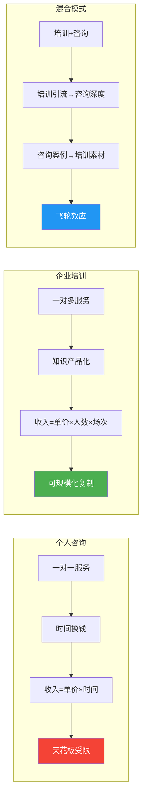
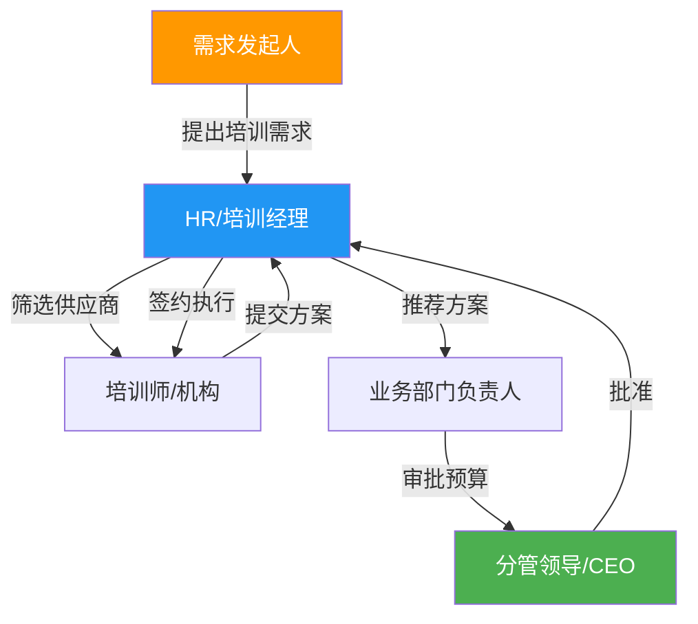
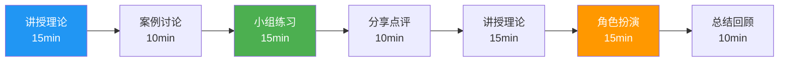
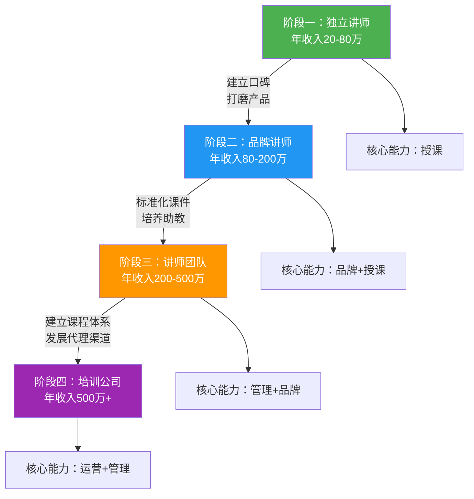

## 二、企业培训业务的核心技巧

企业培训是咨询变现体系中最具规模化潜力的业务形态。与一对一咨询不同，企业培训的商业逻辑是"一对多"——一次课程可以同时服务几十甚至几百人，时间杠杆效应极为显著。一个成熟的企业培训师，年收入可以从几十万到数百万不等，顶级培训师日课酬可达5-10万元。

但企业培训绝非"会讲课就能赚钱"。它是一门融合了专业知识、教学设计、商务谈判、项目管理和品牌运营的复合型技能。本节将从市场定位、产品设计、获客策略、交付执行、效果评估五个维度，系统拆解企业培训业务的核心技巧。

### 1. 企业培训市场的全景认知

#### 1.1 市场规模与增长趋势

中国的企业培训市场规模已超过3000亿元，且每年保持10%以上的增长率。这个市场由三股力量驱动：

- **企业数字化转型需求**：传统企业需要培训员工掌握数字化工具和思维方式，催生了大量数字化转型培训需求
- **人才竞争加剧**：企业越来越重视内部人才培养，培训预算在人力资源总预算中的占比从5%提升到15%以上
- **合规性培训刚需**：安全生产、数据隐私、反洗钱等领域有强制培训要求，形成了稳定的基盘需求

#### 1.2 企业培训的五大细分赛道

| 赛道 | 典型课程 | 客单价 | 竞争程度 | 适合人群 |
|------|----------|--------|----------|----------|
| 管理领导力 | 中层管理、高管教练、领导力发展 | 2-10万/天 | ★★★★★ | 有管理经验的资深人士 |
| 销售与营销 | 大客户销售、渠道管理、数字营销 | 1-5万/天 | ★★★★ | 有销售实战经验者 |
| 技术与数字化 | 编程培训、AI应用、数据治理 | 1-8万/天 | ★★★ | 技术背景的专业人士 |
| 职场通用技能 | 沟通表达、时间管理、PPT制作 | 0.5-3万/天 | ★★★★★ | 门槛低，竞争激烈 |
| 合规与认证 | 安全生产、ISO体系、行业认证 | 0.5-2万/天 | ★★ | 需要行业资质 |

**选择赛道的核心原则：** 选择你既有专业深度、又有企业买单意愿的交叉领域。纯技能类（如PPT培训）天花板低，而结合行业Know-how的培训（如"医药行业合规销售"）壁垒高、客单价高。

#### 1.3 企业培训与个人咨询的本质区别



理解这个区别至关重要：**企业培训的核心能力不是"讲课"，而是"设计学习体验并产生可衡量的行为改变"。** 一个能帮企业解决实际问题的培训师，远比一个"讲课好听"的培训师值钱。

### 2. 培训产品设计：从课程到解决方案

#### 2.1 培训产品的三层金字塔

```text
            ┌─────────────────┐
            │   变革项目       │  ← 客单价50-200万
            │  （长期陪跑）     │     周期6-12个月
            ├─────────────────┤
            │   体系化培训     │  ← 客单价5-50万
            │  （系列课程）     │     周期1-6个月
            ├─────────────────┤
            │   单次课程       │  ← 客单价0.5-5万
            │  （标准化产品）   │     周期1-3天
            └─────────────────┘
```

**单次课程**是入门产品，用于建立信任和获取客户；**体系化培训**是利润产品，解决企业的系统性问题；**变革项目**是高端产品，深度介入企业运营，利润率最高但交付难度也最大。

新手培训师应从单次课程起步，用3-6个月打磨课程质量，积累10个以上成功案例后，再向上延伸到体系化培训。

#### 2.2 课程设计的ADDIE模型

ADDIE是培训行业最经典的教学设计模型，包含五个阶段：

**A - Analysis（分析）**

需求分析是课程设计的起点，也是最容易被忽视的环节。很多培训师接到客户需求后直接写课件，结果讲完后HR说"不是我们想要的"。

需求分析的四个层面：

1. **组织层面**：企业的战略目标是什么？培训如何支撑这些目标？
2. **任务层面**：员工需要完成哪些具体任务？当前的差距在哪里？
3. **人员层面**：参训人员的能力水平如何？学习偏好是什么？
4. **环境层面**：培训在什么场景下进行？有哪些资源限制？

**实操工具：需求分析访谈提纲**

```text
1. 本次培训的业务背景是什么？（了解组织需求）
2. 参训人员目前最突出的问题是什么？（了解痛点）
3. 培训结束后，您希望看到参训人员有什么不同？（明确期望）
4. 之前是否做过类似培训？效果如何？（避免踩坑）
5. 参训人员的职级、年龄、工作年限分布？（了解受众）
6. 培训时间、场地、预算有什么限制？（了解约束）
```

**D - Design（设计）**

设计阶段要解决三个核心问题：

- **学习目标**：用布鲁姆分类法（Bloom's Taxonomy）设定可衡量的学习目标
- **教学策略**：选择适合的教学方法（讲授、案例、角色扮演、行动学习等）
- **评估方案**：如何衡量培训效果

**学习目标的ABCD写法：**

| 要素 | 含义 | 示例 |
|------|------|------|
| A - Audience | 学习者 | 销售团队的客户经理 |
| B - Behavior | 行为 | 能够独立完成SPIN销售法的四个步骤 |
| C - Condition | 条件 | 在模拟客户拜访场景中 |
| D - Degree | 程度 | 成功率达到80%以上 |

**D - Develop（开发）**

课程开发的核心产出包括：

- **课程大纲**：模块化结构，每个模块有明确的学习目标
- **讲师手册**：详细的授课指引，包括时间分配、互动设计、过渡语
- **学员手册**：包含理论框架、案例材料、练习模板、行动计划表
- **PPT课件**：视觉化呈现，每页不超过3个核心信息点
- **评估工具**：课前测试、课后测试、行为观察表、满意度问卷

**I - Implement（实施）**

实施阶段关注的是授课过程中的质量控制，详见本节第4部分。

**E - Evaluate（评估）**

效果评估是企业培训最薄弱的环节，也是培训师最容易被"一锤定音"的环节。详见本节第5部分。

#### 2.3 打造你的"招牌课程"

每个成功的培训师都需要一个"招牌课程"——一提到这个主题，客户第一时间想到你。

**招牌课程的四个标准：**

1. **差异化**：与市面上同类课程有明确区别，有你独特的模型、方法论或案例体系
2. **可验证**：有真实的成功案例和数据支撑，而非纯理论
3. **可感知**：客户在试听或体验后能立即感受到价值
4. **可延展**：能从单次课程延伸到系列课程、工作坊、咨询项目

**打造招牌课程的实操步骤：**

```text
第1步：选择你最有实战经验的1-2个主题
第2步：研究市面上同类课程，找出差异化切入点
第3步：构建你独有的理论模型或方法论（给它起个名字）
第4步：用3-5个真实案例支撑你的模型
第5步：设计3-5个互动练习，让学员当场体验
第6步：录制1-2个试讲视频，用于客户评估
第7步：在2-3个免费或低价场合试讲，收集反馈迭代
第8步：形成标准化课件和讲师手册
```

### 3. 企业培训的获客策略

#### 3.1 企业培训的采购决策链

企业采购培训服务的决策链通常涉及多个角色：



**关键洞察：** HR/培训经理是你的核心对接人，但业务部门负责人才是真正的决策影响者。很多培训师只跟HR打交道，忽略了业务部门的声音，导致方案被否决。正确做法是：**同时搞定HR（流程对接）和业务负责人（需求确认）。**

#### 3.2 六大获客渠道详解

**渠道一：培训机构合作（占比40%-60%）**

培训机构是企业培训市场最大的流量入口。它们掌握着大量的企业客户资源，但需要优质讲师来交付课程。

| 合作方式 | 课酬分成 | 适合阶段 | 优缺点 |
|----------|----------|----------|--------|
| 挂靠机构 | 讲师拿30-50% | 新手期 | 门槛低，但收入被大幅压缩 |
| 平台入驻 | 讲师拿50-70% | 成长期 | 有一定自主权，但竞争激烈 |
| 战略合作 | 讲师拿60-80% | 成熟期 | 互利共赢，需要有品牌影响力 |
| 自建品牌 | 讲师拿100% | 顶级期 | 收入最大化，但获客成本自担 |

**与培训机构合作的关键技巧：**

- 制作专业的讲师介绍（包含授课照片、课程列表、客户logo、学员评价）
- 准备15分钟的试讲视频，展示你的授课风格和专业深度
- 主动联系50家以上的培训机构，建立合作关系
- 维护好与机构BD经理的个人关系，他们是你在机构内部的代言人

**渠道二：转介绍与口碑传播（占比20%-30%）**

企业培训的转介绍逻辑与个人咨询不同。企业客户的转介绍通常发生在以下场景：

- HR换了公司，把之前合作过的培训师带过去
- 业务负责人在行业交流中推荐培训师
- 同一集团的不同子公司之间共享培训资源

**建立转介绍机制的实操方法：**

1. 每次培训结束后，主动请HR填写推荐信或在LinkedIn/脉脉上写评价
2. 设计"老客户推荐奖励"机制（如推荐成功赠送半天微课）
3. 定期向老客户发送行业研究报告或微课视频，保持存在感
4. 建立"客户顾问委员会"，邀请核心客户参与你的课程迭代

**渠道三：内容营销与IP打造（占比10%-20%）**

内容营销是建立长期竞争力的核心手段。当客户在搜索引擎、社交媒体或行业论坛上看到你的专业内容时，信任度会大幅提升。

**高效的内容营销矩阵：**

```text
长内容（每月1-2篇）
├── 行业白皮书/研究报告 → 发布在官网、公众号
├── 深度案例分析 → 发布在知乎、LinkedIn
└── 系列课程免费章节 → 发布在B站、抖音

短内容（每周3-5条）
├── 行业观点/金句 → 发布在朋友圈、微博
├── 培训现场花絮 → 发布在抖音、视频号
└── 学员反馈/成果 → 发布在所有平台
```

**渠道四：行业峰会与论坛演讲（占比5%-10%）**

在行业峰会上做演讲是最高效的获客方式之一。一场30分钟的主题演讲，可能直接带来3-5个企业培训需求。

**如何获得演讲机会：**

- 主动向行业峰会组委会提交演讲提案
- 先从地方性、小型活动开始积累演讲经验
- 录制演讲视频，用于后续申请更高级别的会议
- 与行业协会建立合作关系，成为其常驻讲师

**渠道五：企业直接BD（占比5%-10%）**

直接联系目标企业，主动推销培训服务。这种方式效率最低，但如果目标精准、方案定制化，转化率可以很高。

**BD的正确姿势：**

1. 研究目标企业的近期动态（财报、新闻、招聘信息），找到培训切入点
2. 通过LinkedIn/脉脉找到HR负责人或业务部门负责人
3. 发送一封简洁的邮件/消息，核心信息：我了解你们的XX问题，我曾帮XX企业解决过类似问题
4. 附上一份简短的培训方案概要（不超过2页）
5. 一周后跟进，如果没有回应，间隔两周再跟进一次

**渠道六：线上平台与知识付费（补充渠道）**

在得到、混沌学园、知乎Live等平台开设课程，虽然直接收入不高，但可以快速建立行业知名度，为线下企业培训引流。

#### 3.3 获客漏斗的关键转化率指标

| 漏斗阶段 | 关键指标 | 行业基准 | 优秀水平 |
|----------|----------|----------|----------|
| 曝光→咨询 | 内容转化率 | 0.5%-1% | 2%-5% |
| 咨询→方案 | 需求匹配率 | 30%-40% | 50%-70% |
| 方案→签约 | 方案通过率 | 20%-30% | 40%-60% |
| 签约→复购 | 客户留存率 | 30%-40% | 60%-80% |

### 4. 培训交付与现场执行

#### 4.1 企业培训的定价模型

企业培训的定价远比个人咨询复杂，需要考虑多个维度：

**按天收费（最常见）**

| 讲师资历 | 日课酬范围 | 典型客户 |
|----------|-----------|----------|
| 新手讲师（1-3年） | 3000-8000元/天 | 中小企业、培训机构 |
| 资深讲师（3-8年） | 8000-20000元/天 | 中大型企业 |
| 专家讲师（8-15年） | 20000-50000元/天 | 大型企业、外资企业 |
| 顶级讲师（15年+） | 50000-100000元/天 | 世界500强、行业头部企业 |

**按项目收费**

适用于体系化培训项目，通常包含需求分析、课程设计、授课交付、效果评估全流程。

```text
项目报价 = 设计费 + 授课费 + 材料费 + 差旅费 + 评估费

示例：
- 中层管理能力提升项目（6天授课+2天工作坊+1天评估）
- 设计费：20000元
- 授课费：8天 × 15000元 = 120000元
- 材料费：5000元（含学员手册、工具包）
- 差旅费：实报实销
- 评估费：10000元
- 总报价：约155000元
```

**定价的核心原则：**

1. **价值定价而非成本定价**：如果培训能帮企业提升10%的销售业绩，而这个团队年销售额1亿，你的培训创造了1000万的价值，收10万完全合理
2. **阶梯递增**：每积累10个成功案例，日课酬上调20%-30%
3. **差异化定价**：公开课程和企业内训价格不同，定制化程度越高价格越高
4. **打包优惠**：多天项目给折扣，鼓励客户购买更长的培训周期

#### 4.2 现场授课的核心技巧

**开场的黄金10分钟**

开场决定了学员对你的第一印象，也决定了他们是否愿意投入接下来的学习。

```text
开场结构（10分钟）：

第1-2分钟：破冰
├── 自我介绍（简短，突出与主题相关的经验）
├── 一个引人入胜的故事或数据
└── 表达对学员的尊重和期待

第3-5分钟：建立关联
├── 抛出一个学员面临的痛点问题
├── 用举手调查或投票互动了解学员现状
└── 说明今天的课程如何解决这些问题

第6-8分钟：设定规则
├── 明确学习目标（今天结束后你能做什么）
├── 约定课堂规则（手机静音、积极参与、尊重不同意见）
└── 介绍课程大纲和时间安排

第9-10分钟：激发兴趣
├── 一个悬念或挑战（"今天结束时，我会问你们一个问题..."）
└── 过渡到第一个模块
```

**授课节奏的控制**

成年人的注意力集中时间约为15-20分钟。因此，每15-20分钟需要切换一次教学方式：



**互动设计的五种方法**

| 方法 | 适用场景 | 操作要点 |
|------|----------|----------|
| 提问互动 | 检验理解、引发思考 | 问题要具体，避免"大家觉得呢？"这种泛泛提问 |
| 小组讨论 | 深度思考、观点碰撞 | 4-6人一组，明确任务和时间，安排代表汇报 |
| 角色扮演 | 技能练习、行为训练 | 提供具体场景和评分标准，结束后给予结构化反馈 |
| 案例分析 | 问题解决、决策训练 | 用真实企业案例，引导学员从多个角度分析 |
| 行动学习 | 复杂问题解决 | 围绕企业真实问题，小组协作制定解决方案 |

**控场的八个关键时刻**

1. **学员迟到**：不批评，用幽默化解，课后私下沟通
2. **冷场无人回答**：降低问题难度，点名回答，或用匿名投票工具
3. **个别学员玩手机**：走近该学员，用互动把他拉回来
4. **讨论偏离主题**：温和地总结并引导回来，"这个观点很有意思，不过让我们回到今天的主题..."
5. **学员挑战你的观点**：不防御，先肯定再回应，"您说得对，我来补充一个角度..."
6. **时间不够用**：果断砍掉低优先级内容，保证核心内容完整
7. **技术设备故障**：准备纸质版材料作为备用，不要让设备问题影响节奏
8. **学员水平差异大**：设计分层任务，让不同水平的学员都有收获

#### 4.3 培训材料的标准化管理

一个成熟的企业培训师应该建立自己的"课程资产库"：

```text
课程资产库结构：
├── 课程目录/
│   ├── 课程A-招牌课程/
│   │   ├── 课程大纲.docx
│   │   ├── 讲师手册.docx
│   │   ├── 学员手册.docx
│   │   ├── PPT课件.pptx
│   │   ├── 案例库/
│   │   │   ├── 案例1-情境描述.docx
│   │   │   ├── 案例1-讨论指引.docx
│   │   │   └── 案例1-参考答案.docx
│   │   ├── 练习库/
│   │   │   ├── 练习1-说明.docx
│   │   │   └── 练习1-模板.docx
│   │   ├── 评估工具/
│   │   │   ├── 课前测试.docx
│   │   │   ├── 课后测试.docx
│   │   │   └── 满意度问卷.docx
│   │   └── 版本记录.md
│   └── 课程B-进阶课程/
├── 素材库/
│   ├── 故事库/
│   ├── 数据库/
│   ├── 视频库/
│   └── 图片库/
└── 模板库/
    ├── 培训需求分析模板.docx
    ├── 培训方案模板.docx
    ├── 培训效果评估报告模板.docx
    └── 培训合同模板.docx
```

### 5. 培训效果评估与持续优化

#### 5.1 柯氏四级评估模型

柯氏评估模型（Kirkpatrick Model）是培训效果评估的行业标准，分为四个层级：

| 层级 | 评估内容 | 评估方法 | 评估时间 | 难度 |
|------|----------|----------|----------|------|
| L1-反应层 | 学员满意度 | 课后问卷 | 培训结束当天 | ★ |
| L2-学习层 | 知识技能掌握 | 测试、实操考核 | 培训结束当天或次日 | ★★ |
| L3-行为层 | 工作行为改变 | 上级观察、360度反馈 | 培训后1-3个月 | ★★★★ |
| L4-结果层 | 业务指标变化 | 绩效数据分析 | 培训后3-6个月 | ★★★★★ |

**大多数培训师只做到L1和L2，这远远不够。** 能做到L3和L4的培训师，在客户心中的价值远超同行，续签率和转介绍率也显著更高。

**L3行为层评估的实操方法：**

```text
培训后行为跟踪流程：

第1步（培训结束时）：
└── 让每位学员制定1-2个"行为改变承诺"
    └── 格式："在接下来的30天内，我将在XX场景中，使用XX方法，预期达到XX效果"

第2步（培训后2周）：
└── 向学员发送跟进问卷
    ├── "你是否已经开始实践课上学到的方法？"
    ├── "遇到了哪些障碍？"
    └── "需要什么支持？"

第3步（培训后1个月）：
└── 向学员的直接上级收集反馈
    ├── "您观察到学员在XX方面有变化吗？"
    ├── "变化的程度如何？"
    └── "还有哪些方面需要改进？"

第4步（培训后3个月）：
└── 组织一次"成果分享会"
    ├── 学员分享实践心得和成果
    ├── 讲师给予点评和进阶指导
    └── 收集成功案例用于后续营销
```

#### 5.2 将评估结果转化为商业价值

评估不仅是验收工具，更是你的核心营销素材。当你能向潜在客户展示"我的培训帮助企业XX部门的客户转化率提升了23%"时，你的说服力远超"我的课程满意度98%"。

**建立"效果证据库"：**

```text
效果证据模板：

客户名称：XX科技有限公司
培训主题：大客户销售能力提升
培训时间：2025年3月
参训人数：32人
培训天数：4天

效果数据：
├── L1-反应层：满意度评分 4.8/5.0
├── L2-学习层：课后测试平均分 87分（课前62分）
├── L3-行为层：90%的学员在30天内开始使用SPIN销售法
└── L4-结果层：参训销售团队季度业绩增长18%（对比组增长5%）

客户证言：
"这次培训不是听完就忘的那种，而是真的改变了我们销售团队的工作方式。"
——XX科技销售总监 张XX

授权使用：已获得客户书面授权
```

### 6. 企业培训业务的规模化路径

#### 6.1 从个人讲师到培训公司的进化路径



**每个阶段的关键跃迁动作：**

**阶段一→阶段二：品牌化**
- 打造招牌课程，形成个人IP
- 建立内容营销体系（公众号、短视频、行业文章）
- 积累20个以上可公开的成功案例
- 日课酬从5000提升到15000以上

**阶段二→阶段三：团队化**
- 将招牌课程标准化，培训2-3名助教/副讲师
- 建立课程交付SOP，确保不同讲师的授课质量一致
- 引入项目经理角色，处理客户对接和后勤事务
- 开发2-3门互补课程，形成课程体系

**阶段三→阶段四：公司化**
- 注册公司，建立正式的组织架构
- 发展代理商和渠道合作伙伴
- 建立讲师认证体系，吸纳外部讲师
- 开发线上课程和学习平台，实现OMO（线上线下融合）

#### 6.2 课程标准化的关键要素

规模化的核心是标准化。你需要把课程从"依赖讲师个人魅力"变成"任何人按照流程都能交付80分以上的课程"。

**标准化清单：**

```text
□ 课程大纲（精确到每个模块的时间分配）
□ 讲师手册（包含逐页讲解要点、互动指令、过渡语）
□ 学员手册（独立成册，不依赖PPT）
□ PPT课件（统一视觉风格，注释区有讲解提示）
□ 案例库（每个案例有标准描述、讨论指引、参考答案）
□ 练习库（每个练习有标准说明、模板、评分标准）
□ 教学道具清单（白板纸、便利贴、投票器等）
□ 场地布置图（桌椅摆放方式、设备需求）
□ 常见问题FAQ（学员可能问到的问题及标准回答）
□ 授课录像（作为培训新讲师的教材）
```

### 7. 企业培训业务的风险控制

#### 7.1 常见风险与应对策略

| 风险类型 | 具体表现 | 应对策略 |
|----------|----------|----------|
| 需求错位 | 客户要A，你讲B | 培训前做详细的需求调研，签署培训需求确认书 |
| 课酬拖欠 | 培训结束后迟迟不付款 | 合同约定预付50%，尾款在培训后7个工作日内支付 |
| 知识产权 | 课件被客户复制传播 | 在课件中标注版权信息，合同约定使用范围 |
| 客户流失 | 核心客户换了对接人 | 与多个对接人建立关系，定期维护客户关系 |
| 口碑危机 | 一次差评影响后续获客 | 每次培训后收集反馈，问题课程主动复盘改进 |
| 身体透支 | 高强度授课导致嗓音/体力问题 | 控制每月授课天数（建议不超过12天），学习科学发声 |

#### 7.2 培训合同的核心条款

```text
企业培训合同关键条款清单：

1. 培训内容条款
   ├── 培训主题、目标、大纲
   ├── 授课天数和时间安排
   ├── 参训人数上限
   └── 培训场地和设备要求

2. 费用条款
   ├── 总费用及明细（课酬、材料费、差旅费）
   ├── 付款方式（预付比例、尾款时间）
   ├── 超时费用标准
   └── 取消/改期的费用政策

3. 知识产权条款
   ├── 课件的版权归属
   ├── 客户的使用范围限制
   ├── 录音录像的授权
   └── 培训成果的归属

4. 保密条款
   ├── 双方的保密义务
   ├── 客户案例的使用授权
   └── 保密期限

5. 违约条款
   ├── 讲师违约（迟到、取消、质量不达标）
   ├── 客户违约（拖欠付款、单方面取消）
   └── 不可抗力条款
```

### 8. 新手入行的行动路线图

如果你是从零开始进入企业培训领域，以下是经过验证的12个月行动路线图：

**第1-3个月：基础建设期**

```text
□ 确定你的培训领域和目标客户群体
□ 开发第一门标准化课程（含课件、手册、练习）
□ 在3-5个免费场合试讲（行业沙龙、社群分享、内部分享）
□ 收集反馈，迭代课程至少3个版本
□ 制作专业的讲师介绍（1页PDF+个人网站/公众号）
□ 联系30家培训机构，建立初步合作意向
```

**第4-6个月：市场验证期**

```text
□ 完成5-10次正式的企业内训交付
□ 收集每次培训的效果数据和客户证言
□ 整理3个以上可公开的成功案例
□ 将日课酬从起步价提升20%-30%
□ 建立自己的内容营销渠道（公众号+短视频）
□ 联系机构数量扩展到50家以上
```

**第7-12个月：快速增长期**

```text
□ 每月授课天数稳定在8-12天
□ 日课酬达到同级别讲师的中上水平
□ 开发第二门互补课程
□ 建立客户转介绍机制
□ 在行业会议上做至少2次主题演讲
□ 年收入目标：20-50万
```

### 9. 常见误区与纠正

**误区一："讲得好就能做好企业培训"**

纠正：讲课能力只是基本功。企业培训的核心是"解决问题"，不是"表演才艺"。一个讲课平淡但能帮企业提升业绩的培训师，远比一个讲课精彩但没有实际效果的培训师值钱。

**误区二："课程越多越好"**

纠正：课程不在多，在精。一个培训师有1-2门招牌课程就足够了。课程太多反而会分散精力，每门课都无法做到极致。先做深，再做宽。

**误区三："低价抢市场"**

纠正：企业培训不是价格敏感型市场。客户在意的是效果，不是价格。一个日课酬2万但能解决问题的培训师，比一个日课酬5000但只是走过场的培训师更受欢迎。低价策略只会让你陷入恶性竞争。

**误区四："只跟HR打交道"**

纠正：HR是流程对接人，但业务部门负责人才是真正的决策影响者。很多培训师花了大量精力维护HR关系，却忽略了业务部门的需求，最终导致方案被否决或培训效果不被认可。

**误区五："培训结束就完事了"**

纠正：培训结束才是服务的开始。课后跟进、行为改变追踪、效果评估报告，这些环节才是区分普通培训师和优秀培训师的关键。做好课后服务，复购率和转介绍率会大幅提升。

**误区六："拒绝免费或低价的机会"**

纠正：在入行初期，免费或低价的试讲机会是极其宝贵的。它们帮你打磨课程、积累案例、建立口碑。但要注意：免费机会要选择能带来曝光或人脉的场合，而非被白嫖。

### 10. 工具与资源推荐

#### 10.1 培训师常用工具

| 工具类型 | 推荐工具 | 用途 |
|----------|----------|------|
| 课件制作 | PowerPoint、Canva、Gamma | 制作培训课件 |
| 在线互动 | 雨课堂、ClassIn、腾讯会议 | 线上授课和互动 |
| 问卷评估 | 问卷星、金数据、SurveyMonkey | 培训效果评估 |
| 项目管理 | 飞书、钉钉Teambition、Notion | 培训项目管理 |
| 内容创作 | 公众号编辑器、剪映、Canva | 内容营销 |
| 客户管理 | 纷享销客、销售易、HubSpot | 客户关系管理 |
| 知识管理 | Notion、Obsidian、语雀 | 课程资产库管理 |

#### 10.2 培训师成长资源

**必读书籍：**
- 《培训师21项技能修炼》——段烨，系统学习培训师核心技能
- 《ASTD培训经理指南》——ATD，培训管理的权威指南
- 《引导的秘诀》——Sam Kaner，掌握引导技术
- 《金字塔原理》——Barbara Minto，提升结构化思维和表达能力
- 《刻意练习》——Anders Ericsson，理解技能习得的科学原理

**专业认证：**
- AACTP（美国培训认证协会）——国际认可的培训师认证
- IPTA（国际职业培训师协会）——注重实操能力认证
- CPTM（培训管理专业认证）——适合从讲师转型为培训管理者

**行业社群：**
- 中国培训经理人俱乐部
- 培训江湖
- 各地的Toastmasters演讲俱乐部（提升演讲能力）

***

企业培训是一条需要耐心和专业积累的变现路径。起步阶段可能收入不高，但随着案例积累、口碑建立、品牌成型，收入会呈现指数级增长。核心心法只有一条：**始终以客户的问题为中心，而非以自己的课程为中心。** 当你真正帮企业解决了问题，钱只是自然而然的结果。
