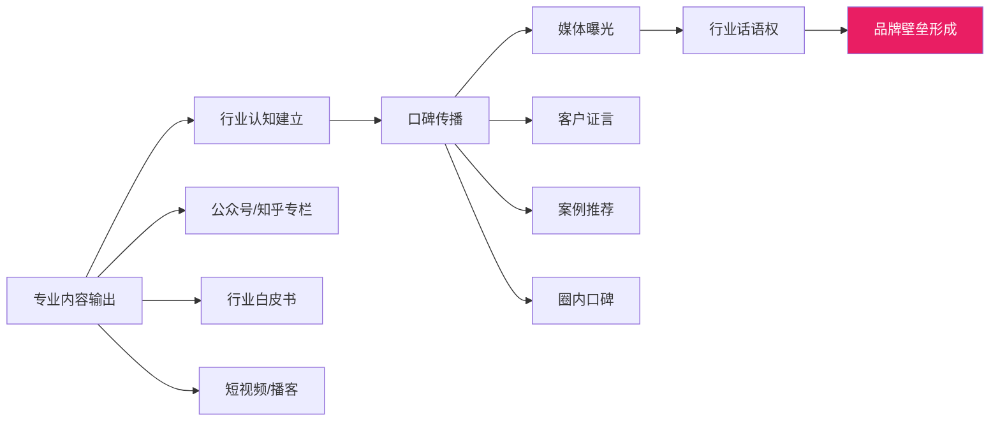
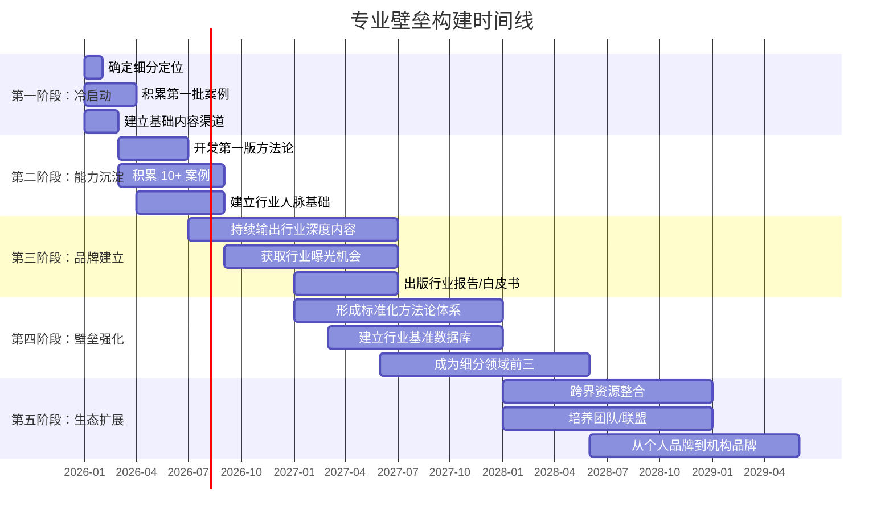

## 三、行业顾问的专业壁垒构建

### 为什么"专业壁垒"是咨询行业的生死线？

咨询行业有一个残酷的真相：**没有壁垒的顾问，本质上只是一个"高级外包"。** 客户找你和找别人没有区别，你只能靠低价竞争，利润越来越薄，最终被更便宜的替代者淘汰。

什么是专业壁垒？一句话概括：**客户因为某个特定问题，只能找你、必须找你、优先找你。** 这种"非你不可"的能力组合，就是专业壁垒。

专业壁垒不是一张证书、一个头衔，而是一套由**知识深度、方法论体系、行业人脉、品牌认知、案例积累**共同构成的复合结构。它决定了你在客户心中的"可替代性"——壁垒越高，可替代性越低，定价权越强。

```mermaid
graph TD
    A[专业壁垒] --> B[知识壁垒]
    A --> C[方法论壁垒]
    A --> D[关系壁垒]
    A --> E[品牌壁垒]
    A --> F[案例壁垒]
    A --> G[数据壁垒]

    B --> B1[行业知识深度]
    B --> B2[跨学科知识广度]
    B --> B3[隐性知识积累]

    C --> C1[独创诊断框架]
    C --> C2[标准化工具包]
    C --> C3[可复用方法论]

    D --> D1[行业人脉网络]
    D --> D2[决策者直达通道]
    D --> D3[上下游资源整合]

    E --> E1[个人品牌认知]
    E --> E2[行业话语权]
    E --> E3[内容资产沉淀]

    F --> F1[可量化的成功案例]
    F --> F2[标杆客户背书]
    F --> F3[行业影响力项目]

    G --> G1[独家行业数据]
    G --> G2[趋势洞察报告]
    G --> G3[基准数据库]

    style A fill:#E91E63,color:#fff
    style B fill:#2196F3,color:#fff
    style C fill:#4CAF50,color:#fff
    style D fill:#FF9800,color:#fff
    style E fill:#9C27B0,color:#fff
    style F fill:#00BCD4,color:#fff
    style G fill:#795548,color:#fff
```



---

### 六大壁垒类型详解

#### 第一类：知识壁垒——你知道别人不知道的

知识壁垒是最基础也最容易构建的壁垒。它的核心是**信息差和认知差**的持续积累。

**信息差**：你知道但客户不知道的信息。比如你了解某个行业的潜规则、某个政策的真实影响、某项技术的落地成本。这些信息在网上搜不到，只有深入行业多年才能获得。

**认知差**：同样的信息，你能看到本质，客户不能。比如同样看到一个企业的财务数据，普通顾问只能指出"利润率下降"，而资深顾问能判断"这是供应链结构问题，不是销售问题"。

**构建知识壁垒的五个层次：**

| 层次 | 内容 | 构建周期 | 壁垒强度 |
|------|------|----------|----------|
| 第一层：通用知识 | 行业常识、基础理论、公开信息 | 1-3个月 | ★☆☆☆☆ |
| 第二层：专业技能 | 专业工具使用、方法论掌握、标准流程 | 6-12个月 | ★★☆☆☆ |
| 第三层：行业洞察 | 行业趋势判断、政策解读、竞争格局分析 | 2-3年 | ★★★☆☆ |
| 第四层：隐性知识 | 行业潜规则、决策背后的真实逻辑、非公开信息 | 5-10年 | ★★★★☆ |
| 第五层：跨界融合 | 多行业交叉知识、跨学科方法论迁移、全局视角 | 10年+ | ★★★★★ |

**实操建议：**

1. **建立行业知识库**。用 Notion 或 Obsidian 建立一个结构化的行业知识库，包含行业报告、政策文件、竞品分析、客户案例、专家访谈记录。每周至少投入 3 小时更新。

2. **定期输出行业分析**。每月写一篇行业深度分析文章，发表在公众号或知乎。这不仅是知识积累的过程，更是品牌建设的过程——你写的东西越多，别人越觉得你是这个领域的专家。

3. **参加行业闭门会**。公开信息的价值有限，真正有价值的信息在闭门会议、行业晚宴、私人饭局中流动。主动参加这些活动，建立"信息节点"的位置。

4. **培养"翻译"能力**。将技术语言翻译成商业语言，将商业语言翻译成执行语言。这种"翻译"能力是知识壁垒的高级形态——客户买的就是你把复杂问题说清楚的能力。

#### 第二类：方法论壁垒——你有别人没有的框架

方法论壁垒是咨询行业**最有价值**的壁垒类型。一个独创的、被验证有效的方法论，可以让客户"非你不可"。

**麦肯锡的案例：** 麦肯锡之所以能收高价，核心不是因为它的顾问更聪明，而是因为它拥有一套标准化的方法论体系——从 7S 模型到金字塔原理，从 MECE 原则到假设驱动分析。这些方法论让客户相信：即使换一个麦肯锡顾问，结果质量也有保障。

**方法论壁垒的构成要素：**

```text
独创方法论 = 诊断框架 + 分析工具 + 解决方案模板 + 效果评估标准
```

**构建方法论的四步法：**

**第一步：从实践中提炼模式**

不要试图一开始就发明一套"完美方法论"。最好的方法论来自反复的实践。每完成一个项目，问自己三个问题：
- 这个项目的核心问题是什么？我用了什么框架来分析？
- 哪些步骤是通用的？哪些是特定于这个客户的？
- 如果再做一次，我会怎么改进？

**第二步：标准化和文档化**

把提炼出的模式写成文档。包括：
- 诊断清单（Checklist）：客户问题的分类和判断标准
- 分析模板（Template）：数据收集和分析的标准表格
- 方案框架（Framework）：解决方案的结构化模板
- 执行手册（Playbook）：执行阶段的标准化操作流程

**第三步：用案例验证和迭代**

方法论不是写出来就完了，必须经过至少 3-5 个真实项目的验证。每个项目结束后，对照方法论复盘：哪些步骤有效？哪些需要调整？哪些是多余的？

**第四步：命名和包装**

给你的方法论起一个好记的名字。"SWOT 分析"、"波特五力"、"平衡计分卡"——这些方法论之所以广为人知，部分原因是名字好记、好传播。

**示例：一个餐饮咨询顾问的方法论体系**

| 组成部分 | 内容 | 工具 |
|----------|------|------|
| 诊断框架 | "餐饮盈利诊断五维模型"：选址、产品、运营、营销、财务 | 五维评分表 |
| 分析工具 | "单店盈利模型计算器"：输入参数自动算出盈亏平衡点 | Excel/在线工具 |
| 解决方案模板 | "门店优化方案模板"：标准结构+填写指引 | Word模板 |
| 效果评估标准 | "三个月改善指标"：客流量、翻台率、客单价、复购率 | KPI看板 |

#### 第三类：关系壁垒——你认识别人不认识的人

在咨询行业，**关系网络本身就是一种壁垒**。很多项目的获取不是通过公开渠道，而是通过熟人推荐、行业圈子、内部消息。

**关系壁垒的三个层次：**

| 层次 | 描述 | 价值 |
|------|------|------|
| 认知层 | 别人知道你是谁，知道你做什么 | 被动获客的基础 |
| 信任层 | 别人相信你的专业能力，愿意推荐你 | 转介绍的核心 |
| 互惠层 | 你和对方有深度合作，利益绑定 | 长期稳定的业务来源 |

**构建关系壁垒的实操方法：**

1. **建立"行业人脉地图"**。列出你所在行业的 100 个关键人物——企业决策者、行业协会负责人、媒体人、其他咨询顾问、投资人。标注与每个人的关系状态（陌生人/认识/熟悉/深度合作），制定接触计划。

2. **成为"连接者"**。不要只想着从人脉中获取价值，要主动为别人创造价值。介绍 A 认识 B，分享有用的信息，帮助别人解决问题——当你成为一个"信息枢纽"，人脉会自动向你聚拢。

3. **维护关系的"最低成本"策略**。不需要天天请客吃饭，但需要保持"存在感"。每季度给重要联系人发一条有价值的信息（行业报告、政策解读、招聘信息），保持联系不断。

4. **建立"顾问团"效应**。与其他领域的咨询顾问建立互荐关系。比如你做营销咨询，找一个做财务咨询的朋友互相推荐客户——客户需要的是"综合解决方案"，你能提供跨领域的资源对接，价值远超单一咨询。

#### 第四类：品牌壁垒——别人提起这个领域就想到你

品牌壁垒的本质是**心智占领**。当客户有某个需求时，脑海中第一个浮现的名字就是你。

**品牌壁垒的建设路径：**



**品牌建设的关键动作：**

1. **选定一个"标签"**。你的品牌必须和一个具体的标签绑定。"餐饮选址专家"、"B2B 获客顾问"、"互联网公司薪酬设计顾问"——标签越具体，品牌认知越强。忌讳："我是做管理咨询的"——这等于什么都没说。

2. **持续输出高质量内容**。品牌不是一天建成的，需要持续 1-3 年的内容输出。内容质量 > 数量。一篇被行业广泛传播的深度文章，胜过 100 篇水文。

3. **争取行业曝光机会**。主动申请行业峰会演讲、接受媒体采访、参与行业报告撰写。每一次曝光都是品牌资产的积累。

4. **打造"记忆点"**。除了专业能力，你需要一个让人记住的"记忆点"——可以是一个独特的表达方式、一个标志性的工具、一个有趣的故事。

#### 第五类：案例壁垒——你做过别人没做成的事

案例壁垒是**最硬核**的壁垒。客户不看你说了什么，看你做了什么。

**案例壁垒的构建策略：**

1. **从第一个项目开始积累案例**。哪怕第一个项目是免费做的、半价做的，也要认真对待，做出可量化的成果。

2. **案例要有"数字"**。"帮助某企业提升效率"是废话，"帮助某餐饮连锁品牌在 6 个月内将单店月营收从 30 万提升到 52 万"才是案例。

3. **案例要有"故事"**。客户不是在看数据报告，他们想听到"这个企业遇到了什么问题→你用了什么方法→取得了什么成果"的完整故事。

4. **案例要有"背书"**。征得客户同意后，使用客户的真实名称、Logo、推荐信。如果客户不方便公开，至少用行业和规模来描述（"某 TOP10 餐饮连锁品牌"）。

**案例积累的阶段性策略：**

| 阶段 | 目标 | 策略 |
|------|------|------|
| 冷启动（0-3个月） | 积累 3 个案例 | 免费/低价服务，选择有代表性的客户 |
| 建立期（3-12个月） | 积累 10 个案例 | 正常收费，主动收集客户证言和数据 |
| 成长期（1-3年） | 积累 30+ 案例 | 形成行业案例库，成为"案例最多的人" |
| 成熟期（3年+） | 标杆案例 | 只接能出标杆案例的项目，宁缺毋滥 |

#### 第六类：数据壁垒——你有别人没有的信息资产

数据壁垒是咨询行业**最被低估**的壁垒类型。当你拥有了行业独家数据，你就有了别人无法复制的优势。

**数据壁垒的构建方式：**

1. **行业基准数据库**。在服务客户的过程中，系统性地收集行业基准数据（如不同规模企业的获客成本、不同行业的利润率区间、不同岗位的薪酬中位数）。这些数据是你服务新客户时的"参照系"。

2. **趋势洞察报告**。基于你积累的数据，定期发布行业趋势报告。这不仅能建立品牌，还能吸引潜在客户主动联系你。

3. **诊断工具**。将你的数据和方法论封装成在线诊断工具——客户输入关键参数，工具给出初步诊断结果和建议。这种工具是获客利器，也是数据积累的载体。

---

### 三大热门行业的壁垒构建实战

不同行业的壁垒构建路径有显著差异。以下针对三个最常见的咨询行业方向，给出具体的壁垒构建策略。

#### 方向一：企业管理咨询

**行业特征：** 服务对象为企业中高层管理者，项目周期 3-12 个月，客单价 5 万-100 万+。竞争激烈，客户决策链长，信任建立周期长。

**核心壁垒构建策略：**

| 壁垒类型 | 构建方法 | 优先级 |
|----------|----------|--------|
| 方法论壁垒 | 开发行业专属诊断工具（如"组织效能诊断五维模型"） | ★★★★★ |
| 案例壁垒 | 前 3 个项目低价/免费做，做出标杆案例 | ★★★★★ |
| 关系壁垒 | 通过行业协会、商会、EMBA 校友圈建立决策者人脉 | ★★★★ |
| 品牌壁垒 | 出版行业白皮书、在行业峰会演讲 | ★★★★ |
| 知识壁垒 | 深入研究 1-2 个行业，做到"比客户更懂行业" | ★★★ |

**关键成功因素：** 管理咨询的客户是企业高管，他们不缺信息，缺的是**判断力和执行力**。你的壁垒不是"我知道更多"，而是"我帮你看得更准、做得更快"。

**实操案例：** 某管理咨询顾问，专注于连锁餐饮行业的"门店扩张"问题。他用了 2 年时间：
- 走访了 200+ 餐饮门店，建立了"餐饮选址评估模型"
- 服务了 15 个餐饮品牌，积累了"从 1 到 10"的扩张案例库
- 出版了《连锁餐饮扩张避坑指南》白皮书，在餐饮行业广泛传播
- 成为 3 个餐饮行业协会的特聘顾问

结果：他的咨询费从最初的 5000 元/天涨到了 3 万元/天，年收入超过 200 万元，且 80% 的客户来自转介绍。

#### 方向二：技术咨询与 IT 顾问

**行业特征：** 服务对象为企业的技术负责人或 CTO，项目周期 1-6 个月，客单价 2 万-50 万。技术迭代快，需要持续学习，但技术壁垒一旦建立，替代成本极高。

**核心壁垒构建策略：**

| 壁垒类型 | 构建方法 | 优先级 |
|----------|----------|--------|
| 知识壁垒 | 深入掌握某个技术栈的全生命周期（从选型到落地到优化） | ★★★★★ |
| 案例壁垒 | 积累"技术选型→架构设计→落地实施→性能优化"的完整案例 | ★★★★★ |
| 数据壁垒 | 建立技术方案的性能基准数据（如不同数据库在特定场景下的 QPS） | ★★★★ |
| 品牌壁垒 | 在技术社区（GitHub、掘金、InfoQ）持续输出深度技术文章 | ★★★★ |
| 关系壁垒 | 与 CTO 群体建立联系（CTO 俱乐部、技术峰会） | ★★★ |

**关键成功因素：** 技术咨询的核心壁垒是**"做过且做成了"**。客户不在乎你理论上多厉害，在乎你实际解决了什么技术难题。每一个你成功解决的技术问题，都是你壁垒的一块砖。

**实操建议：**
- 选择一个技术方向深耕（如数据库优化、微服务架构、AI 落地、云原生迁移），成为这个方向的"活字典"
- 建立"技术选型决策树"——帮助客户在多个技术方案中做出最优选择
- 维护一个"技术方案案例库"，包含架构图、性能数据、踩坑记录
- 在 GitHub 上维护 1-2 个开源项目，展示你的技术实力

#### 方向三：个人成长与职业教练

**行业特征：** 服务对象为个人（职场人、创业者、管理者），项目周期 1-6 个月，客单价 3000 元-10 万元。市场增长快（年增 20%-30%），但入行门槛低，竞争日趋激烈。

**核心壁垒构建策略：**

| 壁垒类型 | 构建方法 | 优先级 |
|----------|----------|--------|
| 品牌壁垒 | 通过短视频/播客/文章建立个人 IP，让客户"先认识你再找你" | ★★★★★ |
| 案例壁垒 | 积累客户蜕变故事（"从 X 到 Y"的转变），用故事打动潜在客户 | ★★★★★ |
| 关系壁垒 | 建立学员社群，老学员成为你的"活广告" | ★★★★ |
| 方法论壁垒 | 开发一套独有的教练流程（如"五步蜕变法"），让服务可标准化 | ★★★ |
| 知识壁垒 | 获取国际认证（ICF、CPCP 等），提升专业可信度 | ★★★ |

**关键成功因素：** 教练服务的核心壁垒是**"信任+情感连接"**。客户选择教练，不仅是选择专业能力，更是选择一个"对的人"。你的个人故事、价值观、沟通风格，都是壁垒的一部分。

**实操建议：**
- 找到你的"教练定位"：是职业转型教练？领导力教练？创业教练？人生规划教练？定位越具体，壁垒越强
- 积累 10 个以上"客户蜕变故事"，用视频或文字形式呈现
- 建立一个"教练效果追踪体系"——跟踪客户在教练结束 3 个月、6 个月、12 个月后的变化
- 持续学习和自我成长——教练的壁垒就是"你活成了客户想要的样子"

---

### 壁垒构建的五个阶段与时间线

构建专业壁垒不是一蹴而就的，它需要系统化的规划和持续的投入。以下是通用的五阶段模型：



**各阶段关键动作与里程碑：**

| 阶段 | 时间 | 关键动作 | 里程碑标志 | 收入预期 |
|------|------|----------|-----------|----------|
| 冷启动 | 0-3个月 | 确定定位、免费/低价做 3 个案例、建立内容渠道 | 有 3 个可展示的案例 | 0-5000元/月 |
| 能力沉淀 | 3-12个月 | 开发方法论、积累 10+ 案例、建立行业人脉 | 方法论被客户认可和传播 | 5000-2万/月 |
| 品牌建立 | 1-2年 | 持续输出内容、获取行业曝光、出版报告 | 行业内有人主动找你 | 2-5万/月 |
| 壁垒强化 | 2-3年 | 标准化方法论、建立数据壁垒、成为细分前三 | 转介绍率超过 50% | 5-15万/月 |
| 生态扩展 | 3年+ | 跨界合作、团队培养、机构化 | 从"卖时间"升级为"卖品牌" | 15万+/月 |

---

### 壁垒构建的常见误区

#### 误区一：把证书当壁垒

**错误认知：** "我考了 XX 证书，我就是专家了。"

**真相：** 证书是入门门票，不是壁垒。一个有 MBA 学位但没有实际项目经验的人，在客户眼中不如一个没有学位但做过 50 个成功项目的人。证书的价值在于"降低信任门槛"，但不能替代实战积累。

**纠正方法：** 考证书的同时，必须同步积累实战案例。证书是"敲门砖"，案例才是"定心丸"。

#### 误区二：什么都懂但什么都不精

**错误认知：** "我的优势是全面，什么都能做。"

**真相：** 在咨询行业，"全面"等于"平庸"。客户不缺"什么都懂"的人，缺的是"在某个问题上比所有人都懂"的人。一个在"餐饮选址"上做到极致的顾问，收入远超一个"什么行业都能做"的通用顾问。

**纠正方法：** 选择一个足够窄的切入点，窄到你能在这个领域做到前三。先深后广——先在一个点上建立壁垒，再逐步扩展。

#### 误区三：只积累不输出

**错误认知：** "我经验很丰富，客户自然会来找我。"

**真相：** 有经验但不输出，等于没有经验（对外界而言）。客户不知道你有什么能力，怎么找你？知识和经验如果不通过内容、演讲、案例等形式"外化"，就无法形成品牌壁垒。

**纠正方法：** 建立"输入-输出"的平衡机制。每学习一个新知识，就写一篇文章；每完成一个项目，就做一个案例复盘；每参加一个行业活动，就写一个参会感悟。

#### 误区四：追求"完美方法论"而迟迟不行动

**错误认知：** "等我的方法论完善了再开始接客户。"

**真相：** 方法论是在服务客户的过程中迭代出来的，不是在书房里冥想出来的。你永远不可能在没有客户反馈的情况下设计出"完美方法论"。

**纠正方法：** 先用一个"60 分"的方法论开始接客户，在实践中快速迭代。你的第一个版本一定不完美，但它比"没有版本"强一万倍。

#### 误区五：忽视关系壁垒的长期价值

**错误认知：** "我只要专业能力强就够了，不需要搞关系。"

**真相：** 在咨询行业，关系网络是获客的主要渠道（占比超过 50%）。一个专业能力 90 分但没有关系网络的顾问，收入可能不如一个专业能力 70 分但关系网络广泛的人。这不是说专业能力不重要，而是说两者缺一不可。

**纠正方法：** 每周至少花 2 小时维护行业关系。不需要功利性地"搞关系"，而是真诚地为别人创造价值——介绍资源、分享信息、提供帮助。关系是"存"出来的，不是"求"出来的。

---

### 进阶：壁垒的"护城河深度"评估

并非所有壁垒都一样坚固。用以下框架评估你的壁垒"深度"——深度越深，竞争对手越难跨越。

**护城河深度评估表：**

| 评估维度 | 问题 | 1分（浅） | 3分（中） | 5分（深） |
|----------|------|-----------|-----------|-----------|
| 时间成本 | 竞争对手复制你的壁垒需要多久？ | 1-3个月 | 1-2年 | 3年以上 |
| 资源门槛 | 复制你的壁垒需要什么资源？ | 仅需学习 | 需要资金+人脉 | 需要行业深耕+独家数据 |
| 网络效应 | 你的壁垒是否会随着客户增多而增强？ | 无 | 有口碑效应 | 有数据飞轮效应 |
| 客户锁定 | 客户切换到竞争对手的成本有多高？ | 很低（随时换） | 中等（需要适应期） | 很高（数据/关系绑定） |
| 品牌认知 | 客户想到这个领域会首先想到你吗？ | 不会 | 可能会 | 一定会 |

**评分标准：**
- 5-10 分：壁垒薄弱，需要重点加固
- 11-15 分：壁垒中等，有基础但需要持续投入
- 16-20 分：壁垒较强，保持维护即可
- 21-25 分：壁垒深厚，竞争对手很难跨越

---

### 本节核心要点

1. **专业壁垒是咨询行业的生死线**——没有壁垒的顾问只能打价格战，有壁垒的顾问掌握定价权。

2. **六大壁垒类型**：知识壁垒、方法论壁垒、关系壁垒、品牌壁垒、案例壁垒、数据壁垒。不同类型适用于不同行业和阶段，但案例壁垒和品牌壁垒是所有顾问都需要的。

3. **方法论壁垒是最高价值壁垒**——一个独创的、被验证有效的方法论，可以让客户"非你不可"。方法论来自实践提炼，不是凭空设计。

4. **壁垒构建需要 2-3 年**——不要指望速成。冷启动阶段（0-3个月）积累案例，能力沉淀阶段（3-12个月）开发方法论，品牌建立阶段（1-2年）持续输出，壁垒强化阶段（2-3年）成为细分领域前三。

5. **避免五大误区**：不把证书当壁垒、不追求全面而要深耕、不只积累不输出、不追求完美方法论、不忽视关系网络。

6. **定期评估壁垒深度**——用"护城河深度评估表"每半年审视一次你的壁垒状态，及时发现薄弱环节并加固。
