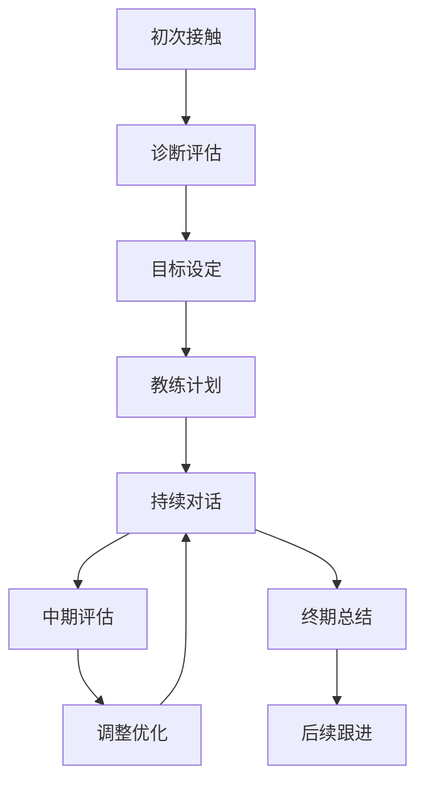

## 四、教练服务的实操技巧

教练服务（Coaching）与传统咨询和培训有本质区别：咨询师给答案，培训师教知识，而教练通过提问、引导和陪伴，帮助客户自己找到答案并持续行动。这种模式的独特价值在于——客户为"被激发的自我成长"付费，而非为"别人的经验"付费。掌握教练服务的实操技巧，是咨询培训变现的高阶形态。

### 1. 教练服务的本质与分类

#### 1.1 教练 vs 咨询 vs 培训

| 维度 | 教练（Coaching） | 咨询（Consulting） | 培训（Training） |
|------|------------------|---------------------|------------------|
| 核心动作 | 提问、引导、督促 | 诊断、分析、给方案 | 讲授、演示、练习 |
| 信息流向 | 客户→自己（教练挖掘） | 专家→客户 | 讲师→学员 |
| 客户角色 | 主动参与者，自己找答案 | 被动接收方案 | 被动学习知识 |
| 交付周期 | 中长期（3-12个月） | 短期（按项目） | 短期（按课程） |
| 价值主张 | 行为改变、习惯养成 | 问题解决、方案输出 | 知识传递、技能训练 |
| 定价逻辑 | 按陪伴时长和效果 | 按项目复杂度 | 按人头或场次 |
| 客户期望 | "我要变成更好的自己" | "帮我解决这个问题" | "教会我这个技能" |

关键区别：教练不提供答案，而是通过结构化的对话框架帮助客户自我觉察、设定目标、制定计划并持续执行。好的教练会让客户觉得"答案是我自己找到的"，这正是教练服务的核心竞争力——客户获得的不只是解决方案，而是解决问题的能力本身。

#### 1.2 教练服务的主要类型

**生活教练（Life Coaching）**
帮助客户处理个人成长、人际关系、生活方式等方面的问题。典型场景：职业迷茫期的年轻人、面临人生转折的中年人、希望改善生活质量的职场人士。按国际教练联合会（ICF）的分类，这是教练行业最大的细分市场，占全球教练市场的35%以上。

**商业教练（Business Coaching）**
面向企业主和创业者，帮助他们提升经营能力、解决管理难题、实现业绩增长。与管理咨询不同，商业教练不直接给方案，而是帮助创始人自己想清楚战略方向。典型客户：年营收100万-5000万的中小企业主。

**职业教练（Career Coaching）**
帮助职场人士进行职业规划、面试准备、职场晋升、转型决策等。市场痛点明确：很多人不知道自己适合什么、如何突破瓶颈、该不该跳槽。

**高管教练（Executive Coaching）**
面向企业高管的一对一深度教练服务，帮助提升领导力、决策能力、团队管理能力。这是教练行业中单价最高的类型，国际市场上单次教练对话收费300-2000美元不等。

**健康教练（Health/Wellness Coaching）**
帮助客户建立健康的生活习惯，包括运动、饮食、睡眠、压力管理等。与营养师、健身教练不同，健康教练更侧重行为改变的心理机制。

**销售教练（Sales Coaching）**
帮助销售团队提升业绩，通过陪访、复盘、角色扮演等方式持续提升销售技能。通常以团队教练的形式开展。

#### 1.3 选择细分领域的决策矩阵

| 评估维度 | 高分特征 | 低分特征 |
|----------|----------|----------|
| 个人经验 | 有3年以上相关实践经验 | 仅有理论知识 |
| 市场需求 | 有明确痛点，客户愿意付费 | 需求模糊，教育成本高 |
| 竞争程度 | 细分市场未饱和 | 大量成熟教练已入局 |
| 可衡量性 | 效果可以量化追踪 | 效果难以评估 |
| 客户支付力 | 目标客户有足够预算 | 目标客户支付能力有限 |
| 复购潜力 | 需要长期陪伴 | 一次解决即可 |

建议用1-10分对每个维度打分，总分最高的2-3个领域做进一步调研，最终选择1个作为主攻方向。不要贪多——教练服务的核心是深度，不是广度。

### 2. 教练服务的核心方法论

#### 2.1 GROW模型：教练对话的骨架

GROW模型是全球使用最广泛的教练对话框架，由John Whitmore在《Coaching for Performance》中系统化提出。GROW代表四个阶段：

**G — Goal（目标）：明确对话目标**
- "这次对话你希望达成什么？"
- "当你离开这次对话时，什么会让你觉得这次对话是值得的？"
- "这个目标是你真正想要的，还是你觉得'应该'要的？"

目标必须满足SMART原则：具体（Specific）、可衡量（Measurable）、可实现（Achievable）、相关（Relevant）、有时限（Time-bound）。教练的责任是帮客户把模糊的愿望转化为清晰的目标。

**R — Reality（现实）：探索当前状态**
- "目前的情况是什么样的？"
- "你已经做了哪些尝试？效果如何？"
- "这个障碍存在多久了？之前有变好过吗？"
- "谁受这个情况的影响？他们怎么看？"

这个阶段最容易出错——教练急于给建议而跳过深入探索。好的教练会在这个阶段花50%以上的时间，因为"正确的问题比正确的答案更重要"。

**O — Options（选择）：拓展可能性**
- "你有哪些选择？"
- "如果没有任何限制，你会怎么做？"
- "你的朋友/导师会给你什么建议？"
- "还有哪些你没想过的选择？"

注意：不要在第一个选项出现时就锁定。教练要做的是一起把所有可能性摊开来，然后逐一评估。

**W — Will/Way Forward（意愿/行动）：制定行动计划**
- "你决定采取什么行动？"
- "什么时候开始？"
- "可能遇到什么障碍？你打算怎么应对？"
- "你怎么确保自己不会放弃？"
- "下次对话时你希望告诉我什么进展？"

GROW模型看似简单，但精髓在于每个阶段的提问质量。同一套框架，新手教练和资深教练的对话深度可能相差10倍。

#### 2.2 教练对话的提问技巧

**开放式问题 vs 封闭式问题**

封闭式问题只能得到"是/否"或简短回答，适合确认事实：
- "你做过了吗？"（封闭）
- "你是什么时候开始的？"（封闭）

开放式问题引发思考和探索，适合教练对话：
- "你觉得最大的障碍是什么？"（开放）
- "这件事对你意味着什么？"（开放）

**强力问题（Powerful Questions）清单**

以下问题经过全球教练行业验证，可以直接用在教练对话中：

关于自我觉察：
- "如果你最好的朋友遇到同样的情况，你会给TA什么建议？"
- "五年后回头看，你会怎么评价现在的决定？"
- "如果失败不是问题，你会怎么做？"
- "你最害怕的结果是什么？那个结果真的会发生吗？"

关于目标澄清：
- "你真正想要的是什么？不是你觉得应该要什么。"
- "达到这个目标会给你带来什么？那个东西对你为什么重要？"
- "你怎么知道自己已经达到了？"

关于行动推进：
- "如果你只能做一件事，你会选哪个？"
- "你需要谁的帮助？你打算怎么开口？"
- "你的第一步是什么？什么时候做？"

#### 2.3 倾听的三个层次

| 层次 | 描述 | 示例 |
|------|------|------|
| Level 1：内部倾听 | 听到对方的话，但脑子里想的是自己的经验、判断、下一步问什么 | 客户在说，教练在想"这个问题我该怎么回应" |
| Level 2：聚焦倾听 | 全部注意力放在对方身上，听到语言、语气、情绪、停顿 | 注意到客户说"我试过了"时叹了口气，追问"那个叹息背后是什么？" |
| Level 3：全局倾听 | 不仅听内容，还感知对方的能量状态、未说出的话、环境氛围 | 感知到客户整体的能量下降，暂停对话，问"你现在感觉怎么样？" |

教练的核心能力不是提问，而是倾听。没有高质量的倾听，再好的问题也只是套路。

### 3. 教练服务的实操流程

#### 3.1 完整教练服务周期

#### 3.2 第一次教练对话（Discovery Session）

第一次对话至关重要，它决定了客户是否愿意继续付费。标准流程：

**前5分钟：建立信任**
- 自我介绍，说明教练的角色和边界
- 询问客户希望如何被称呼
- 确认对话规则：保密性、时间安排、沟通方式

**中间30-40分钟：深度探索**
- "是什么促使你寻找教练？"
- "你现在面临的最大挑战是什么？"
- "如果这个问题解决了，你的生活/工作会有什么不同？"
- "你之前尝试过什么方法？"
- "你希望通过教练达到什么状态？"

**后10-15分钟：明确方向和承诺**
- 总结你听到的核心主题（让客户确认）
- 提出教练方案建议（频次、周期、方式）
- 说明费用和支付方式
- 询问客户的决定

关键技巧：第一次对话不是免费咨询。你可以提供15-20分钟的免费初步沟通，但正式的Discovery Session应该是收费的。免费会降低客户的投入度——人们不珍惜免费得到的东西。

#### 3.3 教练合约与服务协议

标准教练服务协议应包含以下条款：

| 条款 | 内容要点 |
|------|----------|
| 服务定义 | 教练服务的具体内容、不包括的服务（如心理治疗、法律建议） |
| 对话安排 | 频次（每周/每两周）、时长（45-60分钟）、方式（线上/线下） |
| 费用与支付 | 单价、套餐价格、支付方式、退费政策 |
| 保密条款 | 对话内容保密的范围和例外（如客户有自伤风险时的报告义务） |
| 客户责任 | 准时参加、完成作业、主动沟通 |
| 教练责任 | 准备、准时、反馈、持续专业发展 |
| 终止条款 | 提前终止的通知期和未使用费用的处理 |
| 效果说明 | 明确教练不保证特定结果，效果取决于客户的参与度和行动力 |

#### 3.4 教练对话的标准流程

每次教练对话（45-60分钟）的标准流程：

**签到（5分钟）**
- "上次对话后发生了什么？"
- "你完成了哪些行动？"
- "今天你最想聚焦什么？"

**深度探索（25-35分钟）**
- 围绕客户的核心议题展开
- 使用GROW模型或根据情况灵活调整
- 挑战客户的假设和限制性信念
- 推动客户制定具体行动

**总结与承诺（5-10分钟）**
- "今天的对话中，你最大的收获是什么？"
- "你决定采取什么行动？"
- "什么时候完成？"
- "你需要我怎么支持你？"

**签退（2-3分钟）**
- "今天还有什么想说但没说的吗？"
- 确认下次对话的时间

### 4. 定价策略与商业模式

#### 4.1 定价参考体系

| 教练类型 | 新手教练（<100小时经验） | 中级教练（100-500小时） | 资深教练（500+小时） |
|----------|--------------------------|--------------------------|----------------------|
| 生活教练 | 200-500元/次 | 500-1500元/次 | 1500-5000元/次 |
| 职业教练 | 300-800元/次 | 800-2000元/次 | 2000-5000元/次 |
| 商业教练 | 500-1500元/次 | 1500-5000元/次 | 5000-20000元/次 |
| 高管教练 | 1000-3000元/次 | 3000-10000元/次 | 10000-50000元/次 |

定价不取决于经验年限，而取决于你创造的价值。一个帮助企业主多赚100万的商业教练，收费1万元/次完全合理。

#### 4.2 四种主流商业模式

**模式一：单次对话（按次收费）**
适合：试水阶段、低承诺门槛获客
优点：灵活，客户决策快
缺点：收入不稳定，客户粘性低
建议定价：单次价格×1.2（鼓励购买套餐）

**模式二：套餐制（按月/按季度收费）**
适合：已验证服务模式的教练
优点：收入可预测，客户投入度高
缺点：需要足够的信任基础
典型套餐：每月4次对话（每周1次），按月付费

**模式三：会员制（社群+教练）**
适合：希望规模化、降低边际成本的教练
优点：收入稳定，可扩展
缺点：个性化程度降低
结构：月费制，包含每周1次小组教练+每月1次一对一+社群答疑

**模式四：成果对赌（按效果收费）**
适合：商业教练、销售教练等可量化结果的领域
优点：客户感知价值高，定价空间大
缺点：风险高，需要极强的交付能力
结构：基础费（覆盖成本）+业绩分成（按提升比例）

#### 4.3 收入增长路径

| 阶段 | 时间 | 收入预期 | 核心任务 |
|------|------|----------|----------|
| 起步期 | 1-3个月 | 0-3000元/月 | 积累50+小时教练经验，获取3-5个付费客户 |
| 验证期 | 3-6个月 | 3000-10000元/月 | 完善教练流程，建立口碑，获取转介绍 |
| 增长期 | 6-12个月 | 10000-30000元/月 | 建立个人品牌，拓展获客渠道，考虑提价 |
| 成熟期 | 12-24个月 | 30000-80000元/月 | 开发配套产品（课程、工作坊、书籍） |
| 扩展期 | 24个月+ | 80000+元/月 | 培养其他教练、建立教练团队、打造品牌 |

### 5. 获客与客户管理

#### 5.1 教练服务的获客漏斗

教练服务的获客逻辑与普通咨询服务不同——客户买的是"对你的信任"和"对改变的渴望"，不是某个具体方案。因此，获客的核心是展示你的教练能力和客户的真实改变。

**第一层：认知（Awareness）**
- 在社交媒体分享教练相关的洞察和方法论
- 撰写关于行为改变、目标达成、习惯养成的内容
- 参加行业活动、播客、直播做嘉宾
- 关键指标：每月触达1000+目标人群

**第二层：兴趣（Interest）**
- 提供免费的教练体验（15-20分钟微型教练对话）
- 发布客户案例和转变故事（获得客户授权）
- 开设免费工作坊或线上分享
- 关键指标：每月获取50-100个潜在客户联系方式

**第三层：决策（Decision）**
- 提供正式的Discovery Session（可收费或免费）
- 展示清晰的服务方案和投资回报
- 提供满意保障（如前两次对话不满意可退款）
- 关键指标：转化率20-30%

**第四层：留存（Retention）**
- 超预期交付每次教练对话
- 定期发送学习资源和行动提醒
- 建立客户社群，促进互相支持
- 关键指标：客户续约率60%以上

#### 5.2 客户筛选标准

不是所有来找你的人都适合做教练。以下情况不建议接：

| 不适合做教练的情况 | 建议处理方式 |
|---------------------|--------------|
| 客户有严重的心理健康问题（抑郁、焦虑症） | 转介给心理咨询师或治疗师 |
| 客户只想找人倾诉，不愿采取行动 | 明确教练的行动导向，如不接受则婉拒 |
| 客户期望你直接给答案 | 建议转向咨询服务 |
| 客户的诉求超出你的专业范围 | 诚实告知边界，推荐合适的教练 |
| 客户无法保证对话时间 | 建议等时间充裕后再开始 |

#### 5.3 客户管理系统

教练服务需要系统化的客户管理，核心要素：

- **客户档案**：基本信息、教练目标、评估结果、每次对话记录
- **对话记录模板**：日期、议题、洞察、行动承诺、完成情况
- **进度追踪**：客户目标的达成进度、关键指标的变化
- **续约提醒**：套餐到期前2周提醒续约
- **转介绍追踪**：记录每位客户的来源，追踪转介绍率

### 6. 教练能力的持续提升

#### 6.1 ICF认证路径

国际教练联合会（ICF）是全球最权威的教练认证机构，提供三个等级的认证：

| 认证等级 | 英文缩写 | 教练经验要求 | 教练培训时长 | 通过评估方式 |
|----------|----------|-------------|-------------|-------------|
| 助理认证教练 | ACC | 100+小时（75%收费） | 60+小时 | ACSTH或Portfolio路径 |
| 专业认证教练 | PCC | 500+小时（450%收费） | 125+小时 | ACSTH或Portfolio路径 |
| 大师认证教练 | MCC | 2500+小时（2250%收费） | 200+小时 | Portfolio路径 |

ICF认证不是必须的，但在高端市场（尤其是高管教练、企业教练）是重要的信任背书。在国内市场，ICF认证的教练收费通常比非认证教练高30-50%。

#### 6.2 持续提升的四个维度

**1. 教练对话时长**
每月保持至少20小时的教练对话量。教练是实践性极强的技能，没有捷径，只有大量练习。

**2. 同侪教练（Peer Coaching）**
与其他教练结成互练小组，互相做教练、互相反馈。建议每周至少1次，每次60分钟（各30分钟）。

**3. 督导（Mentor Coaching）**
找一位经验更丰富的教练做你的督导，帮助你发现盲点、提升能力。ICF认证要求至少10小时的督导，但建议持续进行。

**4. 理论学习**
持续阅读教练领域的经典著作和最新研究，保持知识更新。推荐书目：
- 《Coaching for Performance》— John Whitmore（GROW模型创始人）
- 《The Coaching Habit》— Michael Bungay Stanier（7个核心教练问题）
- 《Co-Active Coaching》— Karen Kimsey-House（共创式教练方法）
- 《Flawless Consulting》— Peter Block（咨询顾问的圣经）

#### 6.3 教练服务的常见误区

| 误区 | 正确做法 |
|------|----------|
| 急于给建议，变成"披着教练外衣的咨询" | 通过提问让客户自己发现答案，即使你已经看到答案 |
| 过度同理，变成"情绪垃圾桶" | 保持共情但不失专业边界，引导客户从情绪走向行动 |
| 免费做太多，不重视收费 | 免费只用于初步接触，正式教练服务必须收费 |
| 接太多客户，质量下降 | 每位教练的合理负荷是15-25个活跃客户 |
| 不做记录，凭记忆跟进 | 每次对话后立即记录，下次对话前复习 |
| 不评估效果，只凭感觉 | 定期用问卷或量表评估客户的进步和满意度 |
| 只关注内容，忽略关系 | 教练关系的质量直接影响教练效果，要投入时间维护 |

### 7. 教练服务的工具与平台

#### 7.1 对话工具

| 工具 | 用途 | 选择建议 |
|------|------|----------|
| 腾讯会议/Zoom | 线上教练对话 | 国内客户用腾讯会议，海外客户用Zoom |
| Calendly/Cal.com | 约课系统 | 让客户自助选择时间，减少沟通成本 |
| 录音工具 | 记录对话（需客户同意） | 用于复盘和督导，不要依赖录音做记录 |

#### 7.2 客户管理工具

| 工具 | 用途 | 适用场景 |
|------|------|----------|
| Notion/飞书 | 客户档案和对话记录 | 个人教练或小团队 |
| CoachAccountable | 专业教练管理平台 | 需要作业管理、进度追踪、自动提醒 |
| 简单CRM（如HubSpot免费版） | 客户关系管理 | 需要管理获客漏斗和销售流程 |
| 微信群/企业微信 | 客户社群 | 群组教练或会员制服务 |

#### 7.3 评估与反馈工具

- **教练前评估**：使用标准化量表（如Wheel of Life生命之轮）帮助客户评估各维度的满意度
- **过程评估**：每次对话后发送简短反馈问卷（2-3个问题）
- **终期评估**：教练周期结束后进行全面评估，对比教练前后的变化

### 8. 从零到一的启动方案

如果你是教练服务的新手，以下是一个具体的90天启动方案：

**第1-30天：基础建设**
1. 选择1个细分领域（参考1.3节的决策矩阵）
2. 学习GROW模型和基本提问技巧
3. 找3-5个人做免费教练练习（积累20+小时经验）
4. 准备教练服务介绍页面（个人简介、服务说明、客户见证）
5. 定价：起步价设在当地市场中位数的60-70%

**第31-60天：获取付费客户**
1. 在朋友圈/社交媒体发布3-5篇教练相关内容
2. 提供15分钟免费体验对话（每人限1次）
3. 目标：获取3-5个付费客户
4. 每次对话后记录复盘，持续改进

**第61-90天：优化与增长**
1. 收集客户反馈，优化教练流程
2. 请求满意客户写推荐语或做转介绍
3. 开始写教练相关的深度内容（公众号/知乎/小红书）
4. 考虑加入教练社群或找一位教练督导
5. 根据客户反馈调整定价

这个方案的核心逻辑是：先用免费练习验证你是否适合做教练→用低价获取第一批付费客户验证商业模式→用口碑和内容驱动增长。不要跳过任何一步。

### 9. 典型案例分析

**案例一：从HR到职业教练的转型**

李明，32岁，互联网公司HR经理，8年招聘经验。2024年转型为职业教练。

- **起步**：利用HR经验，定位"互联网行业职业发展教练"，服务3-8年经验的互联网从业者
- **获客**：在脉脉和LinkedIn发布职业发展相关内容，3个月积累2000+关注者
- **定价**：单次对话500元，季度套餐（8次对话）3600元
- **6个月成果**：累计服务25个客户，月收入稳定在12000-15000元
- **关键成功因素**：细分领域精准（只做互联网行业）、有真实的招聘和职业发展经验、内容输出持续

**案例二：商业教练的高单价模式**

张华，40岁，连续创业者，有3次创业经历（2次成功、1次失败）。定位为"年营收500万以下的电商企业主商业教练"。

- **起步**：先做免费的创业分享会，每次20-30人参加
- **转化**：分享会后提供30分钟免费一对一，约30%的人购买正式教练服务
- **定价**：单次2000元，半年套餐（24次对话）36000元
- **12个月成果**：稳定服务12个长期客户，月收入35000-40000元
- **关键成功因素**：自己有成功的创业经历（信任背书）、目标客户支付力强、转介绍率高（60%新客户来自老客户推荐）

这两个案例的共同点：都是从自己的核心经验出发，选择了精准的细分领域，通过内容和口碑获客，而非花钱投广告。教练服务的本质是信任生意，信任来自专业能力和真实经历。
