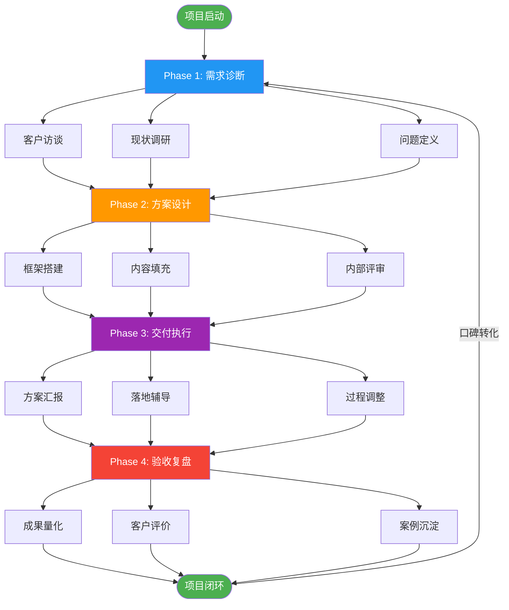
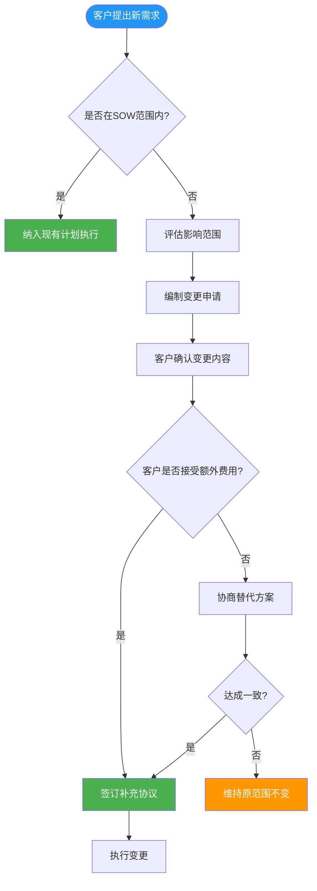

## 六、咨询项目的管理技巧

咨询项目和普通项目最大的区别在于：你卖的是"看不见摸不着"的专业判断，客户买的是"对未来结果的期望"。这种特殊性决定了咨询项目的管理不能照搬传统项目管理方法论，必须有一套针对性的管理框架。

很多咨询顾问技术能力很强，但项目管理一塌糊涂——不是方案写得不好，而是过程中客户不满意、范围不断膨胀、尾款收不回来。项目管理能力，是咨询顾问从"能干活"到"能赚钱"的关键分水岭。

### 咨询项目全生命周期管理



### 一、项目启动：需求诊断与范围锁定

项目管理的第一步不是"干活"，而是"搞清楚要干什么"。超过60%的咨询项目纠纷，根源都在启动阶段没有把需求和范围谈清楚。

#### 1. 结构化需求访谈

不要客户说什么就做什么。客户经常描述的是"症状"而不是"病因"，你需要通过结构化访谈找到真正的问题。

**需求访谈四层漏斗：**

| 层级 | 问题类型 | 示例 | 目的 |
|------|----------|------|------|
| 表层需求 | 客户直接表达的诉求 | "我们想做个品牌升级" | 了解客户期望 |
| 业务痛点 | 驱动需求的业务问题 | "新品牌认知度上不去" | 定位核心问题 |
| 根本原因 | 痛点背后的结构性原因 | "渠道策略和品牌定位脱节" | 找到干预点 |
| 战略意图 | 客户的深层目标 | "3年内做到细分市场前三" | 对齐期望值 |

**需求访谈模板（核心问题清单）：**

```text
一、背景类
- 您发起这个项目的背景是什么？
- 之前尝试过哪些解决方案？效果如何？
- 这个问题存在多久了？为什么现在要解决？

二、期望类
- 项目完成后，您最希望看到什么样的变化？
- 如果用一个指标来衡量成功，您会选什么？
- 您心里理想的项目结果是什么样的？

三、约束类
- 项目的时间约束是什么？有没有硬性截止日期？
- 预算范围大概是多少？
- 有哪些事情是一定不能碰的？（组织敏感区）

四、决策类
- 项目的最终决策人是谁？
- 除了您，还有哪些关键干系人需要参与？
- 如果方案涉及组织调整，推动的权限有多大？
```

#### 2. 范围说明书（SOW）

需求访谈完成后，必须输出一份正式的《咨询服务范围说明书》（Statement of Work），这不是走形式，而是保护双方的核心文件。

**SOW 核心要素：**

```markdown
## 咨询服务范围说明书

### 1. 项目背景与目标
- 客户现状描述
- 项目要解决的核心问题
- 成功标准（可量化的指标）

### 2. 服务范围
- 包含内容（In-Scope）：
  1. XXX
  2. XXX
- 不包含内容（Out-of-Scope）：
  1. XXX
  2. XXX

### 3. 交付物清单
| 交付物 | 形式 | 交付时间 | 验收标准 |
|--------|------|----------|----------|
| 诊断报告 | PPT | 第2周 | 客户签字确认 |
| 解决方案 | PPT+Word | 第4周 | 汇报通过 |
| 执行手册 | Word | 第6周 | 试运行1周 |

### 4. 时间计划
- 项目周期：XX周
- 关键里程碑：X个
- 每周汇报机制

### 5. 双方职责
- 乙方（咨询方）职责：
- 甲方（客户方）职责：

### 6. 变更机制
- 范围变更需双方书面确认
- 变更产生的额外费用计算方式
```

**关键技巧：** "不包含内容"（Out-of-Scope）这一栏是最容易被忽视、也最容易引发争议的部分。一定要写清楚，而且要在签约前和客户确认。比如你做品牌战略咨询，要明确说明"不含VI设计执行"、"不含广告投放执行"，否则客户会理所当然地认为这些都在你的服务范围内。

#### 3. 项目章程与 Kick-off 会议

SOW 签署后，召开项目启动会（Kick-off Meeting），对齐所有关键信息：

**Kick-off 会议议程（建议时长60-90分钟）：**

1. **项目背景回顾**（10分钟）——确认双方对问题的理解一致
2. **项目目标与范围确认**（15分钟）——逐条过SOW
3. **工作计划与里程碑**（15分钟）——明确时间节点
4. **沟通机制建立**（10分钟）——汇报频率、对接人、沟通工具
5. **双方职责分工**（10分钟）——谁提供什么资料、谁配合什么
6. **风险识别**（10分钟）——提前讨论可能的障碍
7. **Q&A**（10-20分钟）

### 二、项目规划：WBS 与资源调度

#### 1. 工作分解结构（WBS）

把项目从"大目标"拆解到"可执行的最小任务单元"。咨询项目的 WBS 通常按阶段→模块→任务三级分解。

**WBS 示例（以营销战略咨询项目为例）：**

```text
项目：某消费品品牌营销战略咨询（8周）
│
├── Phase 1：市场诊断（第1-2周）
│   ├── 1.1 行业分析
│   │   ├── 1.1.1 行业规模与趋势研究
│   │   ├── 1.1.2 产业链分析
│   │   └── 1.1.3 政策与法规梳理
│   ├── 1.2 竞品分析
│   │   ├── 1.2.1 竞品名单确定（5-8家）
│   │   ├── 1.2.2 竞品产品/价格/渠道对比
│   │   └── 1.2.3 竞品营销策略拆解
│   ├── 1.3 消费者研究
│   │   ├── 1.3.1 用户画像构建
│   │   ├── 1.3.2 消费场景梳理
│   │   └── 1.3.3 需求痛点挖掘
│   └── 1.4 客户内部诊断
│       ├── 1.4.1 高管访谈（3-5人）
│       ├── 1.4.2 销售团队访谈
│       └── 1.4.3 历史数据分析
│
├── Phase 2：战略制定（第3-5周）
│   ├── 2.1 市场定位
│   ├── 2.2 产品策略
│   ├── 2.3 渠道策略
│   ├── 2.4 传播策略
│   └── 2.5 预算分配
│
├── Phase 3：执行规划（第6-7周）
│   ├── 3.1 年度营销日历
│   ├── 3.2 关键战役设计
│   ├── 3.3 组织与资源配置建议
│   └── 3.4 KPI体系设计
│
└── Phase 4：汇报与交接（第8周）
    ├── 4.1 终期汇报准备
    ├── 4.2 汇报与答疑
    └── 4.3 知识转移与文档归档
```

#### 2. 资源配置矩阵

咨询项目的资源不只是"人"，还包括时间、信息、工具等。

| 资源类型 | 具体内容 | 获取方式 | 约束条件 |
|----------|----------|----------|----------|
| 人力 | 项目经理、分析师、行业专家 | 内部团队/外部合作 | 可用时间、专业匹配度 |
| 信息 | 行业数据、客户内部资料 | 客户提供/自行采购 | 保密要求、获取难度 |
| 工具 | 分析框架、模板、软件 | 内部积累/购买 | 许可费用、学习成本 |
| 客户配合 | 访谈安排、数据开放、会议协调 | 客户方对接人 | 客户内部流程、政治敏感 |

**关键提醒：** 咨询项目最常见的资源瓶颈不是你自己缺什么，而是"客户配合不到位"。在项目规划阶段就要明确：客户需要在什么时间提供什么配合，如果延迟会怎样影响项目进度。把这些写进SOW，变成客户的合同义务。

#### 3. 里程碑与检查点设计

咨询项目不能"闷头做两个月再汇报"，必须设置中间检查点，及时校准方向。

**里程碑设计原则：**

- **频率：** 每1-2周有一个可见的交付节点
- **形式：** 阶段性汇报 + 客户反馈 + 方向调整
- **作用：** 降低项目风险、维持客户参与感、及时纠偏

**典型的里程碑安排：**

| 时间点 | 里程碑 | 交付物 | 客户参与 |
|--------|--------|--------|----------|
| 第1周 | 需求确认 | 需求确认书 | 签字确认 |
| 第2周 | 诊断汇报 | 诊断报告 | 汇报讨论 |
| 第4周 | 中期汇报 | 框架方案 | 汇报反馈 |
| 第6周 | 方案定稿 | 完整方案 | 终审确认 |
| 第8周 | 终期汇报 | 执行手册 | 正式汇报 |

### 三、项目执行：过程管控的核心技巧

#### 1. 沟通管理

咨询项目的成败，50%取决于方案质量，50%取决于沟通质量。再好的方案，如果沟通不到位，客户不理解、不认可，项目就是失败的。

**沟通管理三要素：**

**（1）汇报节奏**

| 沟通类型 | 频率 | 形式 | 参与人 | 内容 |
|----------|------|------|--------|------|
| 日常同步 | 每周 | 微信/邮件简报 | 项目对接人 | 本周进展、下周计划、需要配合事项 |
| 阶段汇报 | 每2周 | 会议+PPT | 决策层+对接人 | 阶段成果、关键发现、方向调整 |
| 紧急沟通 | 随时 | 电话/面谈 | 视情况 | 重大风险、方向性分歧、突发问题 |

**（2）预期管理**

预期管理是咨询项目最容易出问题的环节。客户期望和你的交付之间永远存在落差，关键是提前管理。

- **签约时：** 明确告诉客户"能做到什么"和"做不到什么"，不要为了签单过度承诺
- **过程中：** 发现问题及时沟通，不要等到汇报时才"给惊喜"
- **交付前：** 提前和核心决策人做非正式沟通，了解他们的态度，避免汇报时被"当面打脸"

**（3）向上管理**

咨询项目中，你需要管理的不只是项目本身，还有客户方的高层关系。

- **找到真正的决策人：** 对接人不一定是决策人，搞清楚"谁说了算"
- **定期给高层"刷存在感"：** 通过阶段汇报、行业洞察分享等方式保持高层的关注
- **建立个人信任：** 高层认可你这个人，项目推进就顺畅得多

#### 2. 范围管理：应对"需求蔓延"

范围蔓延（Scope Creep）是咨询项目利润被吞噬的头号杀手。客户在项目过程中不断"加需求"——"能不能顺便帮我们看看这个问题"、"这个也一起做了吧"。

**范围蔓延的三种典型场景及应对策略：**

| 场景 | 客户说法 | 你的应对 |
|------|----------|----------|
| 搭便车 | "顺便帮我们做个员工培训吧" | "这个可以做，属于额外服务，我出个补充方案和报价" |
| 深度扩展 | "这个分析能不能再深入一些" | "当前深度已经覆盖了SOW约定的范围，进一步分析需要额外2周时间" |
| 方向偏移 | "我们想换个方向，重点做线上" | "方向调整需要重新评估影响范围，建议先讨论清楚再决定" |

**核心原则：** 不拒绝，但要让客户知道"加量=加价"。态度要好，边界要清。

**变更管理流程：**



#### 3. 质量控制

咨询项目的质量不像工厂产品可以检测，但可以通过以下机制来保障：

**质量控制四道关卡：**

**第一关：方法论把关**
- 每个分析模块都要有清晰的方法论支撑
- 不要拍脑袋出结论，要有逻辑链条
- 从数据→分析→洞察→建议，每一步都要有依据

**第二关：内部评审**
- 重要交付物在发给客户之前，必须经过内部评审
- 评审重点：逻辑是否自洽、结论是否有数据支撑、建议是否可执行
- 找一个"局外人"来挑战你的方案，如果他看不懂，客户大概率也看不懂

**第三关：客户预沟通**
- 正式汇报前，先和核心对接人做非正式沟通
- 提前了解客户的关注点和可能的质疑
- 根据反馈做调整，避免汇报时"翻车"

**第四关：汇报后跟进**
- 汇报不是终点，客户的反馈和落地才是
- 汇报后24小时内发送会议纪要和后续行动计划
- 主动跟进客户的执行进展

#### 4. 风险管理

**咨询项目常见风险清单：**

| 风险类型 | 具体表现 | 发生概率 | 影响程度 | 应对策略 |
|----------|----------|----------|----------|----------|
| 客户配合风险 | 客户方对接人不给力、资料提供不及时 | 高 | 高 | 在SOW中明确客户配合义务，设置"配合延迟=项目顺延"条款 |
| 需求变更风险 | 客户在项目中不断加需求 | 高 | 高 | 建立变更管理流程，变更必须书面确认 |
| 决策层变动风险 | 客户方关键决策人离职或调岗 | 中 | 高 | 与多个层级保持关系，不只依赖一个人 |
| 内部政治风险 | 客户内部派系斗争影响项目推进 | 中 | 高 | 保持中立，不站队，让方案本身有说服力 |
| 尾款回收风险 | 项目完成后客户拖延付款 | 中 | 中 | 分阶段收款（3-3-3-1或5-3-2），尾款比例不超过20% |
| 口碑风险 | 客户不满意对外传播负面评价 | 低 | 高 | 过程中及时沟通，发现不满信号立即处理 |

### 四、项目交付：从"做了"到"做好了"

#### 1. 交付物管理

**交付物不是越多越好，而是"刚好够用"。**

很多咨询顾问犯一个错误：做一个200页的PPT，自认为很全面，客户根本看不完。真正好的交付物应该满足三个条件：

- **可读：** 客户能在30分钟内看完核心内容
- **可用：** 客户拿到就能用，不需要你再解释
- **可传：** 客户能把你的方案在内部转述和推广

**交付物质量标准：**

| 维度 | 标准 | 检查方法 |
|------|------|----------|
| 逻辑性 | 每个结论都有推理过程 | 倒推法：从结论往回推，看逻辑链是否完整 |
| 数据支撑 | 关键判断有数据佐证 | 标注数据来源，区分"事实"和"观点" |
| 可执行性 | 建议具体到可操作 | "谁在什么时间做什么"是否清楚 |
| 视觉呈现 | 排版清晰、重点突出 | 打印出来看，黑白打印也能看清 |
| 客户视角 | 用客户的语言而不是专业术语 | 让非专业人士读一遍 |

#### 2. 汇报技巧

汇报是咨询项目的"高光时刻"，也是最容易翻车的环节。

**汇报结构黄金框架（金字塔原理）：**

```text
核心结论（1句话概括）
├── 论点1：关键发现A
│   ├── 数据/事实支撑
│   └── 具体建议
├── 论点2：关键发现B
│   ├── 数据/事实支撑
│   └── 具体建议
└── 论点3：关键发现C
    ├── 数据/事实支撑
    └── 具体建议

下一步行动计划
```

**汇报实战技巧：**

- **开场30秒定胜负：** 开场直接说结论，不要从"背景介绍"开始。决策者的时间很宝贵，他们想知道"所以呢"
- **一页一个核心观点：** 不要在一页PPT上塞三个观点，信息过载等于没有信息
- **用客户的语言说话：** "用户转化率提升15%"不如"每个月多赚30万"有冲击力
- **预判质疑，提前准备：** 在汇报中主动回应客户可能的疑问，比被动被问好得多
- **留出充分讨论时间：** 汇报不是独角戏，要让客户参与讨论，让方案变成"共同产出"

#### 3. 知识转移与项目收尾

项目交付不等于项目结束。真正的收尾包括：

**知识转移清单：**
- [ ] 完整方案文档交付（可编辑版本）
- [ ] 分析方法论说明（客户能复用）
- [ ] 数据来源和获取方式说明
- [ ] 执行操作手册（如有）
- [ ] 常见问题解答文档

**项目收尾检查清单：**
- [ ] 所有交付物已提交并签字确认
- [ ] 客户满意度调查已完成
- [ ] 尾款已确认支付时间
- [ ] 案例使用授权已获得（书面）
- [ ] 客户证言/推荐信已获取
- [ ] 项目文档已归档
- [ ] 经验总结已内部分享
- [ ] 转介绍请求已提出

### 五、项目财务与合同管理

#### 1. 收款节奏设计

**不要等项目全部做完了才收钱。** 咨询项目的收款应该和交付进度挂钩。

**推荐的收款节奏：**

| 收款节点 | 比例 | 触发条件 | 风险提示 |
|----------|------|----------|----------|
| 签约付款 | 30%-40% | 合同签署 | 确保覆盖你的启动成本 |
| 中期付款 | 30%-30% | 中期汇报通过 | 客户确认方向后收第二笔 |
| 终期付款 | 20%-20% | 终期汇报通过 | 不要让尾款比例过大 |
| 质保尾款 | 10%-10% | 质保期满（1-3个月） | 约定质保范围，避免无限兜底 |

**关键原则：** 首付款至少覆盖你的直接成本（人工+差旅+工具），这样即使项目中途出问题，你也不亏本。

#### 2. 合同关键条款

**咨询合同必须包含的核心条款：**

1. **服务范围与交付物：** 越具体越好，引用SOW作为附件
2. **时间计划与里程碑：** 明确每个阶段的时间节点
3. **付款条件：** 金额、时间、方式、逾期罚则
4. **知识产权归属：** 咨询报告的版权归谁、方法论工具能否复用
5. **保密条款：** 双向保密，保护你和客户双方
6. **变更条款：** 范围变更的流程和费用调整方式
7. **终止条款：** 什么情况下可以提前终止，如何结算
8. **争议解决：** 仲裁还是诉讼，管辖地

**特别注意：** 知识产权条款。很多客户会要求"所有成果归甲方所有"，这意味着你做过的分析框架、模板、方法论都不能复用。要在谈判中争取：通用方法论和工具的使用权保留给乙方，仅为该客户定制的内容归甲方。

### 六、多项目并行管理

当你同时在做2-3个咨询项目时，管理复杂度指数级上升。

#### 1. 项目优先级矩阵

| 优先级维度 | 高优先级 | 中优先级 | 低优先级 |
|------------|----------|----------|----------|
| 收入金额 | >10万 | 3-10万 | <3万 |
| 客户重要性 | 战略客户/大客户 | 潜力客户 | 一次性客户 |
| 时间紧迫度 | 有硬性截止日期 | 有弹性空间 | 没有时间压力 |
| 成长价值 | 新领域/高难度 | 熟悉领域 | 重复性工作 |

#### 2. 时间块管理法

将每周时间按项目分配，避免频繁切换导致效率损失：

```text
周一上午：项目A 诊断分析
周一下午：项目B 方案撰写
周二上午：客户A 电话沟通
周二下午：项目A 方案撰写
周三上午：项目B 内部评审
周三下午：项目C 需求访谈
周四上午：项目A 汇报准备
周四下午：客户A 阶段汇报
周五上午：项目B 汇报准备
周五下午：内部复盘 + 下周规划
```

#### 3. 项目仪表盘

用一个简单的表格追踪所有项目的健康状态：

| 项目 | 阶段 | 进度 | 收款状态 | 风险等级 | 本周重点 |
|------|------|------|----------|----------|----------|
| 客户A-营销咨询 | 方案设计 | 60% | 已收40% | 🟢 低 | 完成渠道策略模块 |
| 客户B-组织优化 | 需求诊断 | 20% | 已收30% | 🟡 中 | 协调高管访谈时间 |
| 客户C-品牌升级 | 执行辅导 | 85% | 已收70% | 🔴 高 | 处理客户对执行方案的异议 |

### 七、咨询项目管理的常见陷阱

#### 陷阱一：过度承诺

**表现：** 为了签单，答应客户的所有要求，甚至承诺"保证效果"。

**后果：** 做不到就是打脸，客户不满意，尾款收不回来，口碑受损。

**纠正：** 咨询只能承诺"过程质量"（方法论专业、分析深入、方案可执行），不能承诺"结果质量"（因为结果受很多你无法控制的因素影响）。在合同中写清楚："咨询建议的执行效果取决于甲方的执行力度和市场环境等多重因素。"

#### 陷阱二：不做过程管理

**表现：** 拿到项目后"闷头干活"，两个月后直接交一份报告。

**后果：** 客户不知道你在做什么，没有参与感，拿到报告后觉得"这不是我想要的"。

**纠正：** 保持每周至少一次的沟通频率，让客户始终知道项目进展。阶段性交付比"一次性大交付"效果好得多。

#### 陷阱三：忽视客户内部政治

**表现：** 只和对接人沟通，不了解客户内部的组织关系和权力格局。

**后果：** 你的方案可能触犯了某个部门的利益，在内部评审时被否决。

**纠正：** 在项目启动阶段就画出客户的组织关系图，识别关键利益相关方，评估方案对各方的影响。对可能有阻力的部分，提前和相关方沟通。

#### 陷阱四：文档不规范

**表现：** 用微信聊天代替正式文档，口头约定代替书面确认。

**后果：** 出了问题"口说无凭"，客户翻脸不认账。

**纠正：** 重要的决策、变更、确认，必须有书面记录（邮件、纪要、签字文件）。微信聊天可以作为日常沟通，但关键事项必须有正式的书面确认。

#### 陷阱五：不重视收尾

**表现：** 项目做完就算了，不做复盘，不收证言，不提转介绍。

**后果：** 每个项目都是"一锤子买卖"，没有积累，获客成本越来越高。

**纠正：** 每个项目结束后花2小时做复盘：哪些做得好、哪些可以改进、哪些经验可以复用。同时收集客户证言、请求转介绍。这两个动作的价值，可能比项目本身还大。

### 八、咨询项目管理工具箱

| 工具类别 | 推荐工具 | 用途 | 成本 |
|----------|----------|------|------|
| 项目管理 | 飞书项目/Notion/Asana | 任务分解、进度跟踪、协作 | 免费-中等 |
| 文档协作 | 飞书文档/腾讯文档/石墨文档 | 方案撰写、实时协作 | 免费 |
| 演示制作 | PowerPoint/Keynote/Canva | 汇报PPT制作 | 免费-中等 |
| 思维导图 | XMind/ProcessOn/飞书画板 | 思路梳理、框架搭建 | 免费-中等 |
| 流程图 | draw.io/ProcessOn | 流程设计、组织架构 | 免费 |
| 数据分析 | Excel/Python/SPSS | 数据处理、分析可视化 | 免费-中等 |
| 沟通工具 | 微信/企业微信/飞书 | 日常沟通、会议 | 免费 |
| 合同管理 | e签宝/法大大 | 电子合同签署 | 低 |
| 知识管理 | 飞书知识库/Notion | 案例沉淀、方法论积累 | 免费 |

**工具选择原则：** 不要追求"最强大"的工具，选择"客户在用"的工具。如果客户用飞书，你就用飞书；如果客户用微信，你就用微信。降低客户的协作成本，就是提升你的专业形象。

### 九、核心要点总结

**咨询项目管理的本质是三件事：**

1. **管预期：** 在项目启动时就把"做什么、不做什么、怎么做、做到什么程度"说清楚，写进合同
2. **管过程：** 保持高频沟通，设置检查点，及时发现和解决问题，不让小问题变成大危机
3. **管边界：** 对范围蔓延说"可以但加钱"，对不合理要求说"让我们回到合同约定"

**记住这个公式：**

> 项目成功 = 专业能力 × 项目管理 × 客户关系

三者缺一不可。专业能力决定你能不能做好，项目管理决定你能不能按时做好，客户关系决定客户愿不愿意让你继续做。

***
