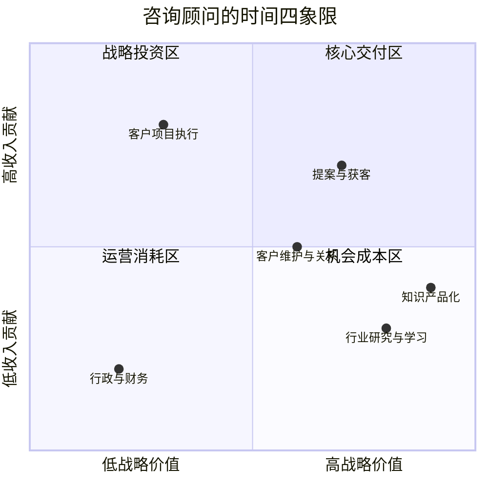
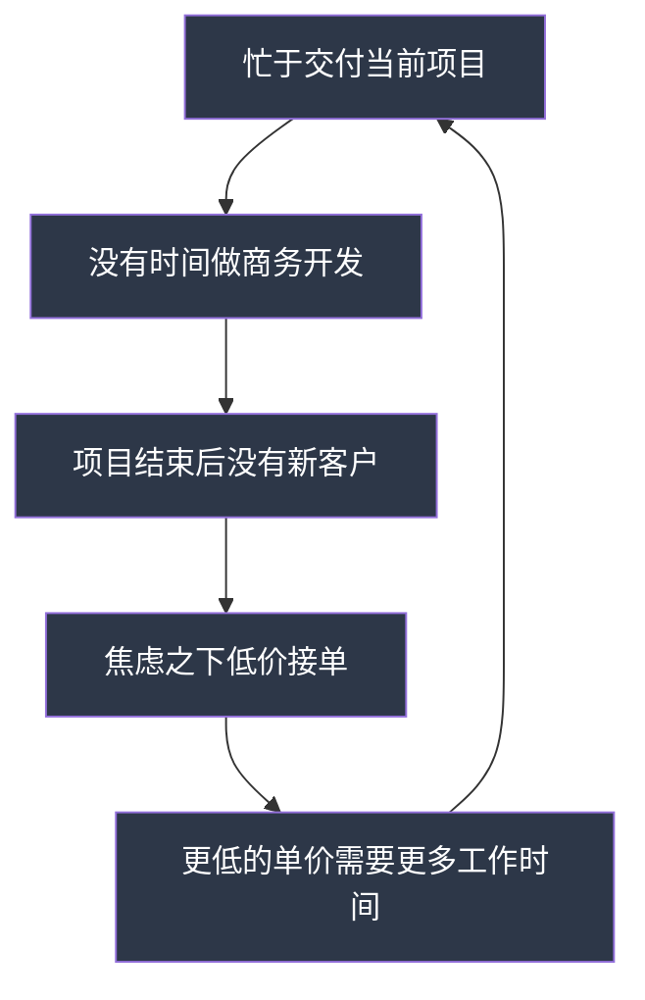
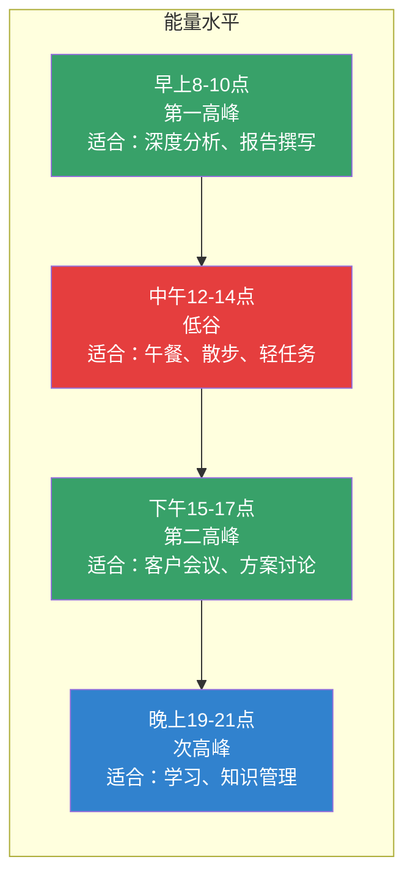
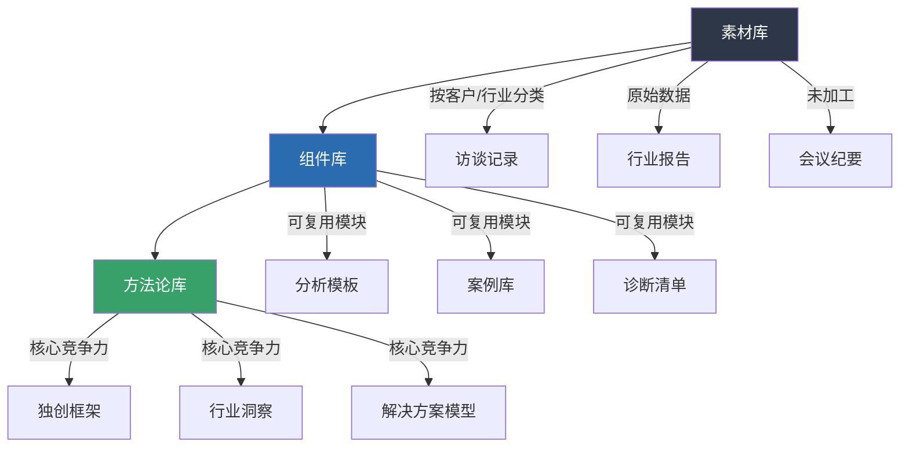
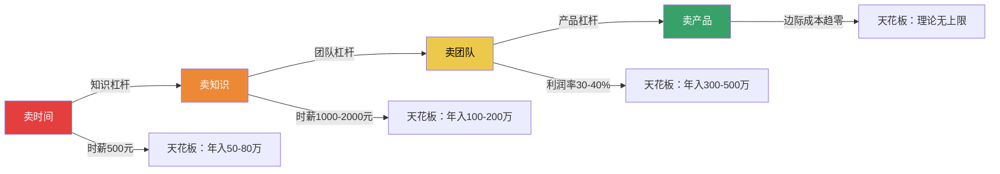

## 七、咨询顾问的时间管理

咨询行业有一条残酷的铁律：**你的时间就是你的产品**。律师按小时计费，管理咨询顾问按天收费，独立顾问按项目报价——无论哪种模式，底层逻辑都一样，你的收入上限由你能有效投入的时间总量决定。一个无法管理好自己时间的咨询顾问，就像一个不会管理库存的零售商，迟早会在某个环节亏本。

但咨询顾问的时间管理，和普通职场人的时间管理有本质区别。你不是在一个固定岗位上执行固定流程，而是在多个客户之间切换、在交付与获客之间平衡、在深度思考与琐碎事务之间取舍。这章将从理论到实操，系统拆解咨询顾问如何构建自己的时间管理系统。

### 1. 咨询时间管理的独特挑战

#### 1.1 为什么通用时间管理方法在咨询行业失效

市面上流行的时间管理方法——番茄工作法、GTD、四象限法则——对咨询顾问来说往往"水土不服"。原因在于咨询工作的三个核心特征：

**特征一：时间的二元性——可售时间与不可售时间**

咨询顾问的时间被天然分为两部分：可计费时间（Billable Hours）和不可计费时间（Non-billable Hours）。一个全职咨询顾问每天工作 10 小时，真正能向客户收费的可能只有 6 小时，剩下的 4 小时用于写提案、做内部沟通、学习新知识、处理行政事务。这意味着你每天有 40% 的时间"免费工作"，而你的收入只来自那 60%。

| 时间类型 | 典型占比 | 内容举例 | 收入贡献 |
|---------|---------|---------|---------|
| 可计费时间 | 50-70% | 客户访谈、方案交付、现场调研、报告撰写 | 直接产生收入 |
| 商务开发 | 10-20% | 写提案、参加行业活动、维护关系、洽谈合作 | 间接产生未来收入 |
| 内部运营 | 10-20% | 开会、行政、财务、合同管理 | 无直接收入 |
| 学习成长 | 5-10% | 行业研究、技能培训、知识管理 | 长期竞争力 |

**特征二：上下文切换的巨大成本**

咨询顾问通常同时服务 2-5 个客户，每个客户的行业背景、项目进展、沟通风格都不同。从客户 A 的财务分析切换到客户 B 的组织架构设计，大脑需要 15-30 分钟才能进入深度工作状态。如果一天切换 4 次，你就白白浪费了 1-2 小时的"启动成本"。

**特征三：工作量的脉冲式分布**

咨询工作不像朝九晚五那样均匀分布。提案阶段可能连续两周每天工作 14 小时，项目间歇期又可能连续三天无所事事。这种脉冲式节奏如果管理不好，要么在高峰期累垮，要么在低谷期焦虑。

#### 1.2 咨询顾问的"时间四象限"

不同于传统的"紧急-重要"四象限，咨询顾问需要按照"收入贡献"和"战略价值"两个维度来划分时间：



**核心交付区（高收入+低战略）**：正在执行的客户项目。这是当下的饭碗，必须保证质量和效率。

**战略投资区（高收入+高战略）**：提案获客、打造行业影响力。这些活动不直接产生今天的收入，但决定了明天有没有客户。

**运营消耗区（低收入+低战略）**：行政事务、报销、合同流程。必须做，但应该压缩到最低限度。

**机会成本区（低收入+高战略）**：行业研究、技能学习、知识产品化。短期看不到回报，但长期决定你能走多远。

一个成熟的咨询顾问的时间分配应该是：核心交付区 50-60%，战略投资区 15-20%，运营消耗区 10-15%，机会成本区 10-15%。如果你发现自己 80% 的时间都在核心交付区，你就是个"计件工人"，不是咨询顾问——你没有为未来投资。

### 2. 咨询顾问的利用率管理

#### 2.1 什么是利用率（Utilization Rate）

利用率是咨询行业最核心的时间指标，计算公式为：

```text
利用率 = 可计费时间 / 总可用工作时间 × 100%
```

举例：一个咨询顾问每月有 22 个工作日，每天 8 小时，总可用时间为 176 小时。如果其中 120 小时是可计费时间，则利用率为 68.2%。

不同角色的利用率目标差异很大：

| 角色 | 目标利用率 | 每月可计费小时 | 实际含义 |
|------|-----------|--------------|---------|
| 初级顾问（分析师） | 75-85% | 132-150 小时 | 主要做执行，少参与获客 |
| 中级顾问（项目经理） | 60-70% | 106-123 小时 | 交付+管理，开始参与获客 |
| 高级顾问（合伙人） | 40-55% | 70-97 小时 | 大量时间用于获客和管理 |
| 独立咨询顾问 | 50-65% | 88-114 小时 | 兼顾交付、获客和运营 |

**关键洞察**：初级顾问追求高利用率是合理的，因为你的任务就是执行。但如果你已经是高级顾问还追求 80% 的利用率，说明你没有在做"顾问"该做的事——拓展业务、培养团队、建立影响力。利用率不是越高越好，而是要匹配你的角色定位。

#### 2.2 利用率的"死亡螺旋"

很多独立咨询顾问会陷入一个恶性循环：



这个循环的根因是：**没有为"商务开发"预留固定的时间块**。打破这个循环的方法很简单：把商务开发当作一个"客户"来对待，给它分配固定的、不可侵犯的时间。

#### 2.3 如何追踪利用率

推荐使用"三色时间日志法"：

- **绿色**：可计费时间（客户会议、报告撰写、现场调研）
- **黄色**：商务开发时间（写提案、参加活动、维护关系）
- **红色**：运营和杂事（行政、报销、内部会议、处理邮件）

每天结束前花 5 分钟记录当天时间的颜色分布，每周汇总一次。一个月后你会清楚看到自己的时间"漏"在了哪里。

实操模板如下：

```text
日期：2026-06-25（周三）
---
08:00-09:00  [红色] 处理邮件和消息（45分钟回复客户，15分钟内部）
09:00-11:30  [绿色] 客户A方案撰写（2.5小时深度工作）
11:30-12:00  [红色] 内部团队站会
12:00-13:00  午休
13:00-14:30  [绿色] 客户B现场访谈（含往返30分钟）
14:30-15:00  [红色] 客户B访谈纪要整理
15:00-16:30  [黄色] 新客户C提案撰写
16:30-17:00  [红色] 处理发票和合同
17:00-18:00  [黄色] 行业文章阅读
---
绿色：4小时 | 黄色：2小时 | 红色：2小时
利用率：50% | 商务开发比：25%
```

### 3. 咨询顾问的时间区块化策略

#### 3.1 时间区块化的核心原则

时间区块化（Time Blocking）是咨询顾问最有效的时间管理方法，但需要根据咨询工作的特点做调整。核心原则有三条：

**原则一：按客户区块化，不按任务区块化**

不要把时间分成"写报告"、"开会"、"做研究"。而应该按客户来分：周二上午是客户 A 的专属时间，周三是客户 B 的专属时间。这样做的好处是减少上下文切换，你不需要反复在不同客户的背景知识之间跳转。

**原则二：保护"深度工作"区块**

咨询的核心交付物——战略方案、分析报告、诊断建议——都需要深度思考。这些工作必须安排在你精力最好的时段，且不被打断。一个被电话和消息打断 5 次的上午，其产出可能不如一个不被打断的 2 小时。

**原则三：预留"缓冲区块"**

咨询工作充满不确定性。客户可能临时要求加一个会议，项目可能出现紧急问题。如果你的时间表排得满满当当，一个意外就能让整天计划崩溃。每天预留 1-1.5 小时的缓冲时间，用于应对突发事务。

#### 3.2 咨询顾问的典型周计划模板

以下是一个独立咨询顾问同时服务 3 个客户时的周计划模板：

| 时间段 | 周一 | 周二 | 周三 | 周四 | 周五 |
|-------|------|------|------|------|------|
| 08:00-09:00 | 周计划+邮件 | 邮件处理 | 邮件处理 | 邮件处理 | 邮件处理 |
| 09:00-12:00 | **客户A**深度交付 | **客户B**现场/访谈 | **客户A**深度交付 | **客户C**深度交付 | 商务开发 |
| 12:00-13:30 | 午休 | 午休 | 午休 | 午休 | 午休 |
| 13:30-16:30 | **客户B**交付 | **客户C**交付 | 缓冲+行政 | **客户B**交付 | 学习+知识管理 |
| 16:30-17:30 | 客户A沟通 | 客户B沟通 | 客户A+B沟通 | 客户C沟通 | 周复盘 |
| 17:30-18:00 | 日志+次日准备 | 日志+次日准备 | 日志+次日准备 | 日志+次日准备 | — |

这个模板的几个设计要点：

1. **周一固定给客户 A**：你的第一个客户（或最重要的客户）获得你精力最好的周一上午
2. **周二是现场日**：集中安排需要线下接触的客户，减少通勤碎片化
3. **周三下午是缓冲区**：处理积压的行政事务和突发需求
4. **周五是战略日**：上午做商务开发（写提案、维护关系），下午学习和复盘
5. **每天最后 30 分钟做日志和次日准备**：保证每天有清晰的起点

#### 3.3 深度工作保护的实操方法

保护深度工作区块需要具体的技术手段，而不仅仅是"意志力"：

**方法一：物理隔离**

在深度工作时段，离开常驻办公地点。去图书馆、咖啡馆或共享办公空间的安静区域。物理环境的切换会给大脑一个信号："现在是深度工作时间"。

**方法二：数字断联**

- 手机开启飞行模式或"专注模式"（iOS/Android 都支持）
- 电脑关闭所有通知（微信、钉钉、邮件的弹窗通知全部关掉）
- 使用网站屏蔽工具（如 Cold Turkey、Freedom）屏蔽社交媒体
- 如果团队使用即时通讯工具，设置状态为"深度工作中，X 点回复"

**方法三：设定"可中断"规则**

告诉客户和团队："深度工作时段（比如每天 9-12 点）请勿打扰，除非是真正的紧急事件（定义紧急：项目关键节点受阻、客户高层突然介入、数据丢失）。"给"紧急"一个明确的定义，可以过滤掉 90% 的"假紧急"。

**方法四：两分钟规则的变体**

深度工作期间遇到的消息，如果两秒内判断不是真正紧急的，标记为"稍后处理"，继续当前工作。不要让"看一眼消息"变成"回复一下"变成"打个电话"——这就是上下文切换的陷阱。

### 4. 客户沟通的时间优化

#### 4.1 会议管理的"3-30-3"法则

咨询顾问的时间大量消耗在客户沟通上。很多顾问的会议时间占总工作时间的 40-50%，其中相当一部分是低效的。"3-30-3"法则可以帮助你把会议效率提升一倍：

- **3 分钟**：会议开始前花 3 分钟明确议程和目标。没有议程的会议不参加
- **30 分钟**：默认会议时长 30 分钟而非 1 小时。时间压力会迫使参与者更聚焦
- **3 行**：会议结束后用 3 行文字总结结论、下一步行动、责任人

实操模板——会议邀请的标准格式：

```text
主题：客户A-第三阶段方案评审（30分钟）
时间：2026-06-26 14:00-14:30
议程：
1. 方案核心结论呈现（10分钟）
2. 客户反馈与疑问（15分钟）
3. 下一步行动确认（5分钟）
输出：评审结论 + 修改清单 + 时间节点
```

#### 4.2 异步沟通替代同步会议

并非所有沟通都需要开会。以下场景应该用异步方式替代：

| 场景 | 同步方式（不推荐） | 异步方式（推荐） |
|------|------------------|-----------------|
| 传递信息 | 开会通报 | 发邮件或文档 |
| 收集反馈 | 开会讨论 | 发文档+标注回复截止时间 |
| 简单确认 | 打电话 | 微信/钉钉消息 |
| 复杂决策 | 开会（必须） | — |
| 头脑风暴 | 开会（必须） | — |
| 关系维护 | 开会（不推荐） | 电话（推荐，更私密） |

**经验法则**：如果一个会议的目的是"告知"而不是"讨论"，它就不应该是一个会议。把信息写成文档发出去，再用一个 15 分钟的短会处理疑问。

#### 4.3 客户沟通的"时间预算"制度

为每个客户设定每周的沟通时间预算，超出时主动管理客户预期。例如：

```text
客户A（月费3万）：每周沟通预算 2小时
  - 周一上午：方案沟通 30分钟
  - 周四下午：进度同步 30分钟
  - 碎片沟通：每周总计不超过 1小时

客户B（月费5万）：每周沟通预算 3小时
  - 周二上午：现场工作 3小时（含沟通）

客户C（项目制10万）：每周沟通预算 1.5小时
  - 周四上午：阶段汇报 1小时
  - 碎片沟通：每周不超过 30分钟
```

当客户临时增加沟通需求时，你可以说："这个议题比较复杂，我建议安排在周四的例会上集中讨论，这样我有时间做充分准备。"这样既没有拒绝客户，又保护了自己的时间。

### 5. 提案与获客的时间杠杆

#### 5.1 提案写作的模板化

独立咨询顾问在提案写作上花费的时间惊人。一份定制化提案可能需要 8-20 小时。但仔细分析你会发现，提案中 60-70% 的内容是通用的（公司介绍、方法论、团队背景、案例展示），只有 30-40% 是针对具体客户的定制内容。

**提案模板化策略**：

1. **建立模块化提案库**：把提案拆成 8-10 个标准模块（封面、目录、公司简介、服务范围、方法论、案例、团队、报价、时间表、附录），每个模块都有标准版本
2. **定制化只做三个地方**：对客户痛点的理解、针对该客户的解决方案设计、报价
3. **建立案例库**：按行业、按问题类型整理过往案例，提案时直接选用最匹配的
4. **报价模板**：不同服务类型（诊断、方案、实施、陪跑）的标准报价区间，微调即可

实操效果：模板化之后，一份新提案的写作时间从 12-16 小时缩短到 4-6 小时，节省 60% 以上。

#### 5.2 获客渠道的时间ROI分析

不同获客渠道的时间投入产出比差异巨大。你需要定期分析自己的获客时间ROI，把时间集中在最高效的渠道上。

| 获客渠道 | 每月时间投入 | 每月获取线索 | 每线索时间成本 | 转化率 | 每成交客户时间成本 |
|---------|------------|------------|-------------|-------|----------------|
| 老客户转介绍 | 2-3 小时 | 2-3 个 | 1 小时 | 40-60% | 2-3 小时 |
| 行业活动演讲 | 8-10 小时 | 5-8 个 | 1.5 小时 | 15-25% | 7-10 小时 |
| 内容营销（文章） | 10-15 小时 | 3-5 个 | 3 小时 | 10-20% | 18-30 小时 |
| 社交媒体运营 | 8-12 小时 | 5-10 个 | 1.5 小时 | 5-10% | 20-30 小时 |
| 主动BD（陌生拜访） | 15-20 小时 | 3-5 个 | 4 小时 | 5-10% | 50-80 小时 |

从表中可以看出：**老客户转介绍的时间效率是陌生拜访的 20-30 倍**。这不是说陌生拜访没有价值，而是说在时间有限的情况下，你应该优先维护好现有客户关系，让他们成为你的"销售团队"。

### 6. 行政事务的自动化与外包

#### 6.1 必须自动化的五类行政事务

咨询顾问最容易忽视的时间黑洞是行政事务。以下五类事务必须尽可能自动化：

**第一类：发票与收款**

手动开发票、跟进催款是巨大的时间浪费。使用自动化工具：

- 电子发票系统（如票易通、百望云）自动生成和发送发票
- 设置自动提醒：发票发出后 7 天、15 天、30 天自动发送催款提醒
- 合同中明确付款条款，逾期自动计算违约金

**第二类：会议安排**

使用日程安排工具（如 Calendly、Cal.com）让客户自助预约你的时间。客户看到你的可用时段，自行选择，省去来回确认的时间。

**第三类：费用报销**

使用记账软件（如随手记、MoneyWiz）实时记录，月底一键导出报表。不要攒到月底再回忆每笔支出。

**第四类：合同管理**

建立合同模板库，80% 的合同条款是固定的，只修改金额、时间、范围等变量。使用合同管理系统（如法大大、e签宝）实现电子签约，省去打印、快递、归档的时间。

**第五类：文件管理**

建立标准化的项目文件夹结构：

```text
客户A_XX集团_管理咨询/
├── 01_商机阶段/
│   ├── 需求沟通记录/
│   ├── 提案_v1.docx
│   └── 报价单.xlsx
├── 02_合同阶段/
│   ├── 合同终版.pdf
│   └── 付款计划.xlsx
├── 03_执行阶段/
│   ├── 01_调研/
│   ├── 02_访谈/
│   ├── 03_分析/
│   └── 04_方案/
├── 04_交付物/
│   ├── 诊断报告_v2.pdf
│   └── 实施方案_v1.pdf
├── 05_沟通记录/
│   └── 周报_2026-W26.docx
└── 06_复盘/
    └── 项目总结.pdf
```

每次新客户启动时，复制这个模板即可，不需要从零开始建文件夹。

#### 6.2 哪些事务值得外包

当你的时薪超过 500 元时，以下事务就应该考虑外包：

- **排版和PPT制作**：找设计师或使用 AI 工具，每小时 50-100 元外包，你省下的时间值 500 元
- **数据整理和清洗**：找兼职数据助理，每小时 80-150 元
- **会议纪要**：使用 AI 语音转文字工具（如讯飞听见、飞书妙记）自动整理
- **社交媒体运营**：找运营助理，每小时 60-100 元
- **基础行业研究**：找研究助理或实习生，每小时 40-80 元

**外包的时间回报率计算**：

```text
时间回报率 = (节省的时间 × 你的时薪) / 外包成本

举例：
你的时薪：500元/小时
PPT排版外包：100元/份，节省你2小时
时间回报率 = (2 × 500) / 100 = 10倍

结论：每花1元外包PPT排版，你获得10元的时间价值
```

### 7. 能量管理：时间管理的隐藏维度

#### 7.1 为什么时间管理不够，还需要能量管理

很多咨询顾问按照"时间管理"的方法论，把日程排得井井有条，但到了下午三四点还是效率暴跌。原因很简单：**时间是均匀的，但人的精力不是**。

一个精力充沛的上午 2 小时，产出可能是疲劳下午 2 小时的 3-5 倍。所以咨询顾问的时间管理，本质上是"把最好的精力分配给最重要的工作"。

#### 7.2 咨询顾问的能量曲线

大多数人的自然能量曲线呈"双峰型"：



**实操建议**：

- **第一高峰（8-10 点）**：安排最需要深度思考的工作——写方案、做分析、设计框架。这段时间不要开会
- **低谷期（12-14 点）**：处理行政事务、回复邮件、吃午饭、散步。不要在低谷期做任何重要决策
- **第二高峰（15-17 点）**：安排客户会议、团队讨论、方案评审。这个时段你的社交能量最高
- **次高峰（19-21 点）**：学习新知识、写行业文章、做知识管理。这个时段适合输入型工作

#### 7.3 咨询顾问的"恢复仪式"

高强度的咨询工作需要刻意的恢复。没有恢复的连续高强度工作，第三天开始效率就会断崖式下降。

**日常恢复**：
- 每工作 90 分钟，休息 15 分钟（不是刷手机，是站起来走动、喝水、远眺）
- 午休 20-30 分钟（科学研究证实，短暂午睡可以恢复 50% 的认知疲劳）
- 晚上 10 点后不处理工作消息

**周度恢复**：
- 每周至少一天完全不工作（不是"少工作"，是"不工作"）
- 这一天做与工作完全不同的活动：运动、烹饪、阅读非专业书籍、陪伴家人

**项目间恢复**：
- 两个高强度项目之间，安排 3-5 天的"低强度期"
- 用这段时间整理上一个项目的经验、更新知识库、补充睡眠

### 8. 知识管理：让时间投入产生复利

#### 8.1 咨询顾问的知识复利效应

普通职场人的工作经验是线性积累的——做一年得一年的经验。但咨询顾问如果做好知识管理，可以产生**复利效应**：你为 A 客户做的行业分析，稍作修改就能用在 B 客户；你总结的方法论框架，可以反复使用在不同项目中。

没有知识管理的咨询顾问，每个项目都从零开始。有知识管理的咨询顾问，60% 的工作可以在已有素材上迭代。这就是为什么同等能力的两个顾问，五年后的产出可能差 3 倍。

#### 8.2 咨询顾问的知识管理系统

推荐使用"三层知识库"结构：

**第一层：素材库（原始资料）**

按客户和行业分类存储所有原始素材——访谈记录、行业报告、数据表格、会议纪要。这些是"原材料"，不经过加工。

**第二层：组件库（可复用模块）**

从素材库中提炼出可复用的"组件"——行业分析模板、常见问题诊断清单、方案框架、案例描述。这些组件可以像乐高积木一样，在不同项目中组合使用。

**第三层：方法论库（核心竞争力）**

最高层是你独创或深度理解的方法论——你对某个行业问题的独特见解、你总结的分析框架、你验证过的解决方案模型。这是你的核心竞争力，也是你的品牌资产。



#### 8.3 知识管理的时间投入建议

每周预留 2-3 小时专门做知识管理。具体活动包括：

- **周五下午复盘**：整理本周的工作笔记，提炼可复用的组件，存入组件库
- **月度知识盘点**：每月最后一个周五，回顾本月项目的收获，更新方法论库
- **季度内容输出**：每季度基于积累的知识，写 1-2 篇行业文章或案例总结，用于建立个人品牌

这 2-3 小时看似"非生产性"时间，但长期回报巨大。一个坚持知识管理三年的咨询顾问，其提案速度是不做知识管理同行的 2-3 倍，方案质量也更高——因为他的方案建立在更丰富的素材和更成熟的框架之上。

### 9. 常见误区与纠正

#### 误区一：把"忙碌"当作"高效"

**症状**：日程排得满满当当，每天工作 12 小时，但月底发现可计费时间只有 60%。

**诊断**：你可能把大量时间花在了低价值的"伪工作"上——反复修改不会提交的方案、参加没有结论的会议、回复本可以延迟处理的消息。

**纠正方法**：连续一周记录每 30 分钟的工作内容和价值贡献。一周后分类统计，你会震惊于有多少时间花在了不产生任何价值的事情上。

#### 误区二：拒绝所有非计费工作

**症状**：只关注当前项目的交付，拒绝所有"不赚钱"的活动——行业活动、知识管理、关系维护。

**诊断**：短期内你的利用率很高，但 6 个月后你会突然发现没有新客户。因为你不做商务开发，你的"客户漏斗"是空的。

**纠正方法**：把商务开发当作"投资"而非"浪费"。每周固定 8-10 小时用于商务开发活动，即使当前项目很忙也不要削减。

#### 误区三：追求完美的时间表

**症状**：花大量时间设计精美的日程表、研究各种时间管理工具，但执行不了三天就放弃。

**诊断**：过度追求系统的完美性，反而消耗了执行系统的精力。工具是手段不是目的。

**纠正方法**：从最简单的系统开始——一个日历 + 一个时间日志。运行两周后根据实际情况迭代。不要在工具选择上花超过 2 小时。

#### 误区四：忽视休息和恢复

**症状**：连续高强度工作不休息，靠咖啡和意志力撑着，直到某天突然"烧尽"（Burnout）。

**诊断**：咨询是高强度的脑力劳动，大脑需要恢复时间。连续工作不休息，第三天开始效率就断崖下降，第五天开始犯低级错误。

**纠正方法**：把休息当作"工作的一部分"而不是"工作的对立面"。在日程表中像安排客户会议一样安排休息时间。

#### 误区五：所有客户一视同仁

**症状**：给每个客户分配相同的时间和精力，不管他们贡献的收入和战略价值。

**诊断**：80/20 法则在咨询行业尤其明显——20% 的客户贡献 80% 的收入。如果你给所有客户相同的关注，就是在用宝贵时间服务低价值客户。

**纠正方法**：每季度做一次客户价值分析，把最多的时间和最好的精力分配给最高价值的客户。对低价值客户，要么提升服务单价，要么优化服务流程减少时间投入。

### 10. 工具推荐与选型

#### 10.1 核心工具链

咨询顾问的时间管理不需要太多工具，以下四类足够：

**日历工具**：管理所有时间区块
- 推荐：飞书日历（团队协作好）、Google Calendar（国际化）、Outlook（企业环境）
- 关键设置：把所有活动分类标记（绿色=计费、黄色=开发、红色=运营），每周回顾颜色分布

**时间追踪工具**：记录实际时间使用
- 推荐：Toggl（简洁好用）、Clockify（免费）、时间块（国产，iOS 优秀）
- 关键习惯：每天结束前花 5 分钟补录，不要攒到周末

**项目管理工具**：管理多客户的并行任务
- 推荐：飞书多维表格（轻量灵活）、Notion（自定义强）、Todoist（纯任务管理）
- 关键结构：按客户分项目，每个项目下有任务列表，标注优先级和截止日期

**知识管理工具**：积累可复用知识
- 推荐：Obsidian（本地优先，双向链接强）、Notion（团队共享好）、Logseq（大纲式）
- 关键结构：按三层知识库（素材→组件→方法论）组织

#### 10.2 工具选型的"5分钟法则"

不要花超过 5 分钟选择工具。如果你已经有一个在用的日历和笔记工具，就用它。切换工具的学习成本和迁移成本，远大于"更好工具"带来的边际收益。

**唯一值得认真选型的是时间追踪工具**——因为你每天都要用，而且它直接影响你对自己时间使用的认知。花 1 小时试用 2-3 个工具，选一个最顺手的，然后坚持用下去。

### 11. 进阶：从时间管理到时间杠杆

#### 11.1 咨询顾问的三种时间杠杆

初级顾问管理时间，高级顾问制造"时间杠杆"——用同样多的时间创造更多的价值。

**杠杆一：知识杠杆——从"卖时间"到"卖知识"**

把你反复使用的分析框架、方法论、案例库打包成可复用的知识产品。一份写好的行业分析报告模板，可以服务 10 个客户，边际成本趋近于零。

**杠杆二：团队杠杆——用别人的时间赚钱**

当你同时有 3 个项目，不是自己全做，而是带 1-2 个初级顾问。你负责方法论和客户沟通，他们负责执行。你的时间从"做事"变成"管事"，同样的时间可以服务更多客户。

**杠杆三：产品杠杆——一次投入，持续收益**

把咨询中积累的知识做成标准化产品——线上课程、行业报告、工具模板、付费社群。这些产品一旦创建，可以持续产生收入，不需要你每次都投入时间。



#### 11.2 从"计件工人"到"杠杆顾问"的转型路径

| 阶段 | 典型年份 | 时间分配特征 | 核心任务 |
|------|---------|------------|---------|
| 新手期（1-2年） | 第1-2年 | 80%交付+20%学习 | 做好执行，建立方法论 |
| 成长期（3-4年） | 第3-4年 | 60%交付+20%获客+20%学习 | 开始获客，建立品牌 |
| 成熟期（5-7年） | 第5-7年 | 40%交付+30%获客+20%管理+10%学习 | 带团队，建杠杆 |
| 领袖期（8年+） | 第8年+ | 20%关键客户+30%获客+30%管理+20%产品化 | 品牌驱动，产品化 |

### 12. 本节核心要点

1. **时间的二元性**：咨询顾问的时间分为可计费和不可计费两部分，管理的核心是提高可计费时间的质量和效率
2. **利用率不是越高越好**：不同角色有不同的最优利用率区间，高级顾问追求过高利用率反而是错误
3. **区块化管理**：按客户而非按任务安排时间区块，保护深度工作时段，预留缓冲区
4. **会议效率**：用"3-30-3"法则压缩会议时间，能异步沟通的就不开会
5. **提案模板化**：60-70% 的提案内容是通用的，模板化可以节省 60% 的写作时间
6. **行政自动化**：发票、日程安排、费用报销、合同管理必须自动化或外包
7. **能量管理**：把最好的精力分配给最重要的工作，遵循 90 分钟工作+15 分钟休息的节奏
8. **知识管理产生复利**：三层知识库（素材→组件→方法论）让你的每次工作都为未来积累价值
9. **避免五个误区**：别把忙碌当高效、别拒绝所有非计费工作、别追求完美系统、别忽视休息、别对所有客户一视同仁
10. **终极目标是时间杠杆**：从卖时间到卖知识、卖团队、卖产品，逐步突破个人时间的天花板
