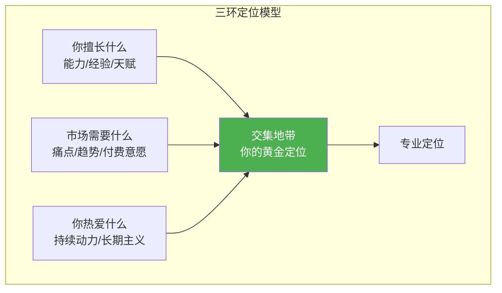
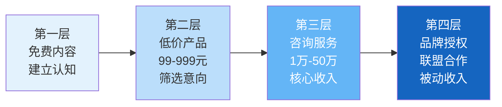

## 八、咨询顾问的个人品牌建设

咨询行业的本质是信任交易——客户把钱交给一个他们相信能解决问题的人。而个人品牌，就是让陌生人在还没见面之前就建立起这种信任的系统工程。一个没有品牌的顾问只能靠低价抢单，一个有品牌的顾问靠溢价接单。

### 为什么咨询顾问必须做个人品牌

很多顾问认为"把活干好就行，品牌是虚的"。这个认知在有稳定客源时没问题，但在以下场景中会付出代价：

- **获客成本高**：没有品牌背书，每次获客都要从零建立信任，转化周期长达3-6个月
- **定价天花板低**：没有差异化认知，客户拿你和所有同行比价，你只能打价格战
- **抗风险能力弱**：没有个人品牌意味着没有"蓄水池"，一旦老客户停止续约，业务立刻归零
- **无法实现规模化**：品牌是唯一能让你从"卖时间"转向"卖影响力"的杠杆

咨询行业的个人品牌不是锦上添花，而是基础设施。

### 咨询顾问个人品牌全景架构

```mermaid
flowchart TD
    Start([个人品牌建设]) --> A[品牌定位层]
    Start --> B[内容输出层]
    Start --> C[信任背书层]
    Start --> D[传播扩散层]
    Start --> E[品牌资产层]

    A --> A1[专业领域界定]
    A --> A2[差异化标签]
    A --> A3[目标受众画像]
    A --> A4[品牌故事提炼]

    B --> B1[长文深度内容]
    B --> B2[短视频/直播]
    B --> B3[行业报告/白皮书]
    B --> B4[课程/训练营]

    C --> C1[成功案例展示]
    C --> C2[客户证言收集]
    C --> C3[行业认证/奖项]
    C --> C4[媒体曝光/出版]

    D --> D1[自媒体矩阵]
    D --> D2[行业社群运营]
    D --> D3[演讲/峰会参与]
    D --> D4[合作互推]

    E --> E1[个人IP资产化]
    E --> E2[品牌溢价变现]
    E --> E3[被动收入构建]
    E --> E4[行业影响力指数]

    style Start fill:#4CAF50,color:#fff
    style A fill:#2196F3,color:#fff
    style B fill:#FF9800,color:#fff
    style C fill:#9C27B0,color:#fff
    style D fill:#F44336,color:#fff
    style E fill:#607D8B,color:#fff
```



---

### 第一层：品牌定位——你是谁，凭什么信你

品牌定位是个人品牌的地基。定位不清的顾问就像一家没有招牌的店——路过的人不知道你卖什么，自然不会进来。

#### 1.1 专业领域界定

专业领域的选择遵循"三环交叉"原则：



**关键判断标准：**

| 维度 | 问自己的问题 | 举例（好的定位） | 举例（差的定位） |
|------|-------------|-----------------|-----------------|
| 能力深度 | 我能在这个领域写出一本300页的书吗？ | "供应链成本优化" | "企业管理" |
| 市场需求 | 有没有人为这个痛点掏过钱？ | "餐饮连锁标准化运营" | "创业指导" |
| 竞争格局 | 这个细分领域我能做到前三吗？ | "母婴品牌私域运营" | "营销咨询" |
| 个人热情 | 我愿意在这个领域深耕10年吗？ | "心理健康与职场效能" | "赚钱" |

**定位的"一厘米宽、一公里深"法则：**

- **错误示范**："我是企业管理咨询师"——全国有几十万个这样的人，客户凭什么选你？
- **正确示范**："我帮助餐饮连锁品牌从10家店扩张到100家店的标准化体系搭建"——客户一听就知道你是做什么的，也知道自己是不是你的目标客户

#### 1.2 差异化标签设计

差异化标签是客户记住你的钩子。好的标签满足三个条件：**具体、可记忆、有背书**。

**标签公式：** [专业领域] + [独特方法/角度] + [量化结果]

| 标签类型 | 示例 | 记忆点 |
|----------|------|--------|
| 方法论标签 | "用精益创业方法帮传统企业数字化转型的顾问" | 精益创业+数字化 |
| 结果标签 | "帮50+企业实现零库存管理的供应链专家" | 50+企业、零库存 |
| 身份标签 | "前麦肯锡高级顾问" | 麦肯锡背书 |
| 场景标签 | "专治中小企业'大企业病'的组织诊断师" | 场景感、诊断感 |

**标签提炼四步法：**

1. **列出你的独特经历**：在哪些知名企业工作过？做过哪些标杆项目？有什么独家方法论？
2. **找到客户最痛的点**：和20个潜在客户聊天，记录他们反复提到的问题
3. **交叉匹配**：你的独特经历中，哪些能解决客户最痛的点
4. **一句话测试**：把定位说给5个非行业朋友听，如果他们在10秒内能复述，说明标签够清晰

#### 1.3 目标受众画像

品牌建设不是自说自话，而是精准对话。你必须清楚知道"我在对谁说话"。

**受众画像模板：**

```text
基础信息：
- 行业：___________
- 企业规模：___________
- 决策者职位：___________
- 年收入/预算范围：___________

痛点信息：
- 他们最头疼的3个问题：___________
- 他们目前的解决方案是什么：___________
- 他们为什么对现有方案不满意：___________

信息获取习惯：
- 他们关注哪些公众号/博主：___________
- 他们活跃在哪些社群/平台：___________
- 他们信任的信息来源类型：___________（案例/数据/权威推荐/同行口碑）

付费决策路径：
- 他们从了解到咨询的平均周期：___________
- 影响他们决策的关键因素：___________
- 他们决策时会咨询谁的意见：___________
```

#### 1.4 品牌故事提炼

人天生爱听故事，不爱听道理。一个好的品牌故事能让客户从"我知道你"变成"我记得你"。

**品牌故事的三幕结构：**

| 阶段 | 内容 | 示例 |
|------|------|------|
| 第一幕：起源 | 你为什么进入这个领域？什么经历触发了你？ | "我在某企业做供应链总监时，亲眼看到一个10亿营收的企业因为库存失控差点倒闭" |
| 第二幕：转折 | 你发现了什么别人没发现的东西？ | "我发现问题不在于管理流程，而在于企业对供应链的认知模型本身就是错的" |
| 第三幕：使命 | 你现在在做什么？为什么要做？ | "现在我的使命是帮助100家中国制造企业建立真正有效的供应链体系" |

**品牌故事的红线：**
- 不要编造，真实经历比精心包装更有力量
- 不要自吹，强调"我帮客户解决了什么"而不是"我多厉害"
- 不要太长，30秒能讲完的核心版本 + 3分钟的完整版本

---

### 第二层：内容输出——用内容建立专业认知

个人品牌的核心载体是内容。没有内容的品牌是空壳——客户搜不到你的文章、看不到你的观点、找不到你的案例，信任就无从建立。

#### 2.1 内容策略矩阵

不同内容类型承担不同的品牌职能：

| 内容类型 | 品牌职能 | 更新频率 | 平台选择 | 制作成本 |
|----------|----------|----------|----------|----------|
| 深度长文/专栏 | 建立专业深度 | 每周1-2篇 | 公众号、知乎、LinkedIn | 高（4-8小时/篇） |
| 短视频/直播 | 扩大认知广度 | 每周3-5条 | 抖音、视频号、小红书 | 中（1-3小时/条） |
| 行业报告/白皮书 | 建立权威性 | 每季度1份 | 官网、公众号、邮件 | 高（20-40小时/份） |
| 案例复盘 | 展示实力 | 每月1-2篇 | 公众号、官网 | 中（3-5小时/篇） |
| 社群互动/问答 | 建立亲和力 | 每天 | 微信群、知识星球 | 低（碎片时间） |
| 课程/训练营 | 变现+影响力 | 每年1-2期 | 小鹅通、自建平台 | 极高（100+小时/套） |

#### 2.2 深度内容创作方法论

深度内容是咨询顾问的"核武器"——它能同时完成三件事：证明你懂、吸引精准客户、建立长期影响力。

**深度文章的结构模板：**

```text
标题：用具体数字+痛点+承诺（如"90%的中小企业都在犯的供应链错误"）

开头（前200字决定读者是否继续）：
- 抛出一个反直觉的观点或数据
- 讲一个真实的故事
- 直击目标读者的痛点

正文：
- 理论框架（为什么这个问题存在？底层逻辑是什么？）
- 诊断方法（怎么判断自己有没有这个问题？）
- 解决方案（分步骤、可操作的具体方法）
- 案例佐证（真实案例，有数据、有细节、有结果）
- 常见误区（读者可能会犯的错误）

结尾：
- 总结核心要点
- 给出明确的下一步行动建议
- 引导互动（提问、关注、咨询）
```

**高效产出深度内容的工作流：**

1. **素材收集（日常积累）**：每次和客户聊天、看行业报告、参加论坛时，随手记录3-5个灵感点到笔记工具
2. **选题筛选（每周一）**：从素材库中筛选本周要写的2个话题，优先选"客户真实问过的问题"
3. **大纲撰写（2小时）**：用思维导图列出文章骨架，确认逻辑通顺
4. **初稿撰写（3-4小时）**：先写完再修改，不要边写边改
5. **润色优化（1小时）**：删废话、加案例、检查数据准确性
6. **分发（30分钟）**：同步到公众号、知乎、LinkedIn等平台

#### 2.3 短视频内容策略

短视频是2024年之后咨询顾问获客的最大增量渠道。很多顾问觉得"我的领域太专业，不适合短视频"——这是误解。专业内容在短视频平台反而因为稀缺性而获得更高推荐权重。

**适合咨询顾问的短视频类型：**

| 视频类型 | 示例 | 时长 | 难度 |
|----------|------|------|------|
| 行业洞察 | "为什么90%的餐饮连锁活不过3年" | 1-2分钟 | ★★ |
| 误区纠正 | "你还在用KPI管95后员工？难怪留不住人" | 30秒-1分钟 | ★★ |
| 案例拆解 | "一个奶茶品牌如何用3招从5家店做到500家" | 2-3分钟 | ★★★ |
| 方法论分享 | "我用这套框架帮企业省了3000万" | 3-5分钟 | ★★★ |
| 行业热点评论 | "XX品牌暴雷，我3年前就说过这个问题" | 1分钟 | ★ |
| 问答互动 | "粉丝问：初创公司要不要请咨询顾问？" | 1分钟 | ★ |

**短视频脚本结构（黄金15秒法则）：**

```text
0-3秒：钩子（抛出一个让人停下来的数字/问题/冲突）
3-10秒：痛点（说出目标受众的真实困境）
10-45秒：干货（给出具体方法，而不是空泛道理）
45-60秒：行动引导（关注/收藏/评论/私信咨询）
```

#### 2.4 行业报告与白皮书

行业报告是咨询顾问的"信任加速器"。一份高质量的行业报告能做到：让客户主动找上门、让媒体免费报道你、让同行把你当权威引用。

**报告选题原则：**
- 选"行业痛点+数据空白"的交叉地带
- 选目标客户关心但找不到系统分析的话题
- 避免选太大太泛的主题（如"中国经济发展趋势"）

**报告结构模板：**

```text
1. 摘要（1页）：核心发现，给忙碌的高管看
2. 行业背景（2-3页）：市场现状、关键趋势
3. 核心问题分析（5-8页）：数据+图表+案例
4. 解决方案框架（3-5页）：你的方法论
5. 典型案例（2-3页）：成功和失败案例对比
6. 行动建议（1-2页）：给不同阶段企业的建议
7. 关于作者（1页）：你的介绍和服务
```

**报告分发策略：**
- 在公众号/官网提供免费下载（换取用户信息，如邮箱、微信）
- 向行业媒体投稿核心发现摘要
- 在演讲/分享中引用报告数据
- 每季度更新数据，保持报告的时效性和传播性

---

### 第三层：信任背书——让品牌从"我知道你"到"我信你"

品牌定位是"你说你是谁"，内容输出是"你证明你懂"，而信任背书是"别人替你说好"。第三者的背书远比自我吹嘘有效。

#### 3.1 成功案例体系

成功案例是咨询顾问最核心的品牌资产。没有案例的顾问就像没有作品的画家——说得再好也没人信。

**案例撰写框架（STAR-R模型）：**

| 环节 | 内容 | 示例 |
|------|------|------|
| Situation（背景） | 客户是谁，面临什么困境 | "某连锁餐饮品牌，50家门店，年营收2亿，但门店标准化率不到30%" |
| Task（任务） | 客户期望达成什么目标 | "在12个月内将标准化率提升到90%以上" |
| Action（行动） | 你具体做了什么（重点） | "分3个阶段：先诊断问题，再设计标准化手册，最后培训落地" |
| Result（结果） | 用数据量化成果 | "标准化率从30%提升到92%，门店人效提升25%，食品安全事故归零" |
| Recognition（认可） | 客户的证言/推荐 | "客户CEO评价：这是我们做过最值的一笔咨询投资" |

**案例管理注意事项：**
- 所有案例必须征得客户书面同意后才能公开使用
- 涉及敏感数据时做脱敏处理（用"某餐饮品牌"代替具体名称）
- 定期更新案例库，至少每季度补充一个新案例
- 准备三个版本：30秒口头版（电梯演讲）、1页书面版（提案附录）、3页详细版（官网展示）

#### 3.2 客户证言收集

客户证言的说服力远超自我宣传。研究显示，92%的B2B买家在做决策前会参考同行评价。

**证言收集的正确时机：**
- 项目交付时（客户满意度最高的时刻）
- 客户获得成果时（数据出来、效果显现的时候）
- 年度回顾时（帮客户盘点一年成果的时候）

**证言收集话术模板：**

```text
X总，这次项目整体合作下来，
1. 您觉得对我们帮助最大的是什么？
2. 如果要向同行推荐我们，您会怎么说？
3. 如果给我们的服务打个分（1-10分），您会打几分？为什么？
```

**证言的呈现形式：**
- 文字证言：最基础，适合官网和提案
- 视频证言：最有说服力，适合社交媒体和演讲
- 数据证言：最硬核，用客户的真实数据说话
- 背书证言：行业大佬的一句推荐，胜过100个普通评价

#### 3.3 行业认证与奖项

认证和奖项是信任的"快捷键"——客户没时间深入了解你时，看到权威机构的背书会快速建立信任。

**值得追求的背书类型：**

| 背书类型 | 获取难度 | 信任价值 | 适用阶段 |
|----------|----------|----------|----------|
| 行业协会认证 | ★★ | ★★★ | 起步期 |
| 专业资格证书（CPA/CFA/PMP等） | ★★★ | ★★★ | 起步期 |
| 行业媒体评选/奖项 | ★★★ | ★★★★ | 成长期 |
| 政府/机构课题参与 | ★★★★ | ★★★★ | 成长期 |
| 出版专业书籍 | ★★★★ | ★★★★★ | 成熟期 |
| 行业峰会主旨演讲 | ★★★★★ | ★★★★★ | 成熟期 |

#### 3.4 媒体曝光策略

媒体曝光的本质是借用媒体的公信力为自己的品牌赋能。一篇行业媒体的报道比10篇自写的文章更有说服力。

**获取媒体曝光的五个路径：**

1. **主动投稿**：向行业媒体投稿高质量分析文章，署名带上你的个人品牌标签
2. **专家采访**：联系行业记者，表达愿意作为行业专家接受采访的意愿
3. **热点评论**：行业热点事件发生时，第一时间发表专业观点，媒体会主动引用
4. **报告合作**：与媒体联合发布行业报告，你出内容、媒体出传播
5. **节目嘉宾**：行业播客、视频节目邀请嘉宾时，主动报名参与

---

### 第四层：传播扩散——让更多人知道你

品牌再好，没有传播就等于不存在。传播不是"撒网"，而是"精准投送"——把对的内容放到对的人面前。

#### 4.1 自媒体矩阵设计

不要把所有鸡蛋放在一个篮子里。咨询顾问的自媒体矩阵应该包含至少3个平台，覆盖不同场景和受众。

**平台选择决策矩阵：**

| 平台 | 内容形式 | 适合领域 | 见效周期 | 流量特征 |
|------|----------|----------|----------|----------|
| 微信公众号 | 长文 | 所有B2B领域 | 慢（3-6个月） | 私域沉淀，适合深度转化 |
| 知乎 | 问答+专栏 | 技术/专业/教育 | 中（2-4个月） | 搜索流量，长尾效应强 |
| LinkedIn | 英文+行业观点 | 外企/跨境/科技 | 中（2-4个月） | 高端决策者集中 |
| 抖音 | 短视频 | C端/生活/消费 | 快（1-3个月） | 流量大但精准度低 |
| 视频号 | 短视频+直播 | B2B/中高端 | 中（2-4个月） | 微信生态加持，适合社交裂变 |
| 小红书 | 图文+短视频 | 生活/消费/设计 | 快（1-2个月） | 年轻用户，种草属性强 |
| B站 | 长视频 | 技术/教育/专业 | 慢（6-12个月） | 高黏性，适合深度内容 |

**矩阵策略建议：**
- **B2B咨询顾问**：微信公众号（深度）+ 知乎（获客）+ LinkedIn（高端）+ 视频号（破圈）
- **B2C咨询顾问**：抖音（流量）+ 小红书（种草）+ 微信公众号（转化）+ 视频号（直播）
- **技术咨询顾问**：知乎（深度）+ B站（教程）+ GitHub（代码背书）+ 公众号（行业分析）

#### 4.2 社群运营策略

社群是个人品牌的"私域池塘"——流量来了之后，社群是沉淀和转化的核心场景。

**顾问型社群的三层结构：**

```text
外层：公开社群（微信群、行业交流群）
  → 目标：扩大认知，筛选意向用户
  → 运营：每周分享1-2条行业干货，不推销

中层：付费社群（知识星球、付费微信群）
  → 目标：建立深度信任，筛选付费客户
  → 运营：每日分享、每周答疑、每月直播

内层：核心圈层（年度顾问客户、老客户社群）
  → 目标：维护关系，促进转介绍
  → 运营：季度聚会、私享会、一对一关怀
```

**社群运营的关键指标：**

| 指标 | 公开社群 | 付费社群 | 核心圈层 |
|------|----------|----------|----------|
| 月活跃率 | >30% | >60% | >80% |
| 内容互动率 | >5% | >15% | >30% |
| 转介绍率 | N/A | >10% | >30% |
| 续费率 | N/A | >60% | >80% |

#### 4.3 演讲与峰会参与

演讲是建立行业影响力最高效的方式——一场30分钟的演讲，能让200人同时记住你。

**演讲机会获取路径：**

1. **从免费开始**：行业沙龙、创业活动、企业内部分享，先积累口碑
2. **主动申请**：关注行业峰会的嘉宾招募信息，提交演讲主题和提纲
3. **被邀请的条件**：当你在某个话题上有足够的内容积累和案例背书时，组织方会主动找你
4. **关键指标**：一年至少参与10场中小型活动 + 2-3场行业峰会

**演讲内容设计原则：**
- 前3分钟抛出让人意外的观点或数据（抓住注意力）
- 中间部分用案例驱动，而不是理论堆砌
- 最后给出可执行的行动建议（让听众带着收获离开）
- 演讲结束后留下联系方式和免费资源（转化钩子）

#### 4.4 合作互推策略

合作互推的本质是"借力"——借用其他品牌/个人的流量和信任为自己的品牌赋能。

**合作互推的五种形式：**

| 形式 | 操作方式 | 适合阶段 |
|------|----------|----------|
| 内容互推 | 互相在公众号推荐对方 | 起步期 |
| 联合直播 | 与互补领域顾问联合做直播分享 | 成长期 |
| 联合课程 | 与互补顾问合作开发课程 | 成长期 |
| 联合报告 | 共同发布行业研究报告 | 成熟期 |
| 品牌联盟 | 组建咨询联盟，共同服务大客户 | 成熟期 |

**选择合作伙伴的标准：**
- 客户群体高度重叠但服务领域互补（你做战略，他做执行）
- 品牌调性和价值观一致
- 双方粉丝量级相当（差距不超过3倍）
- 合作前先互相体验对方的服务

---

### 第五层：品牌资产化——从"做品牌"到"品牌能赚钱"

品牌建设的终极目标不是"出名"，而是"变现"。个人品牌必须能够转化为可衡量的商业价值，否则就是自嗨。

#### 5.1 品牌价值评估指标

**品牌健康度仪表盘：**

| 指标类别 | 具体指标 | 目标值 | 监测频率 |
|----------|----------|--------|----------|
| 认知指标 | 品牌搜索量/提及量 | 月增长10%+ | 每月 |
| 认知指标 | 自媒体粉丝总量 | 根据阶段定 | 每周 |
| 信任指标 | 咨询转化率 | >15% | 每月 |
| 信任指标 | 客户NPS评分 | >60 | 每季度 |
| 变现指标 | 品牌溢价率 | >同行30%+ | 每季度 |
| 变现指标 | 转介绍获客占比 | >40% | 每月 |
| 传播指标 | 内容互动率 | >5% | 每周 |
| 传播指标 | 媒体主动报道次数 | 每季度>1次 | 每季度 |

#### 5.2 品牌溢价变现路径

有品牌的顾问和没有品牌的顾问，最大的差距在于定价权。

**品牌溢价的四层变现模型：**



| 变现层级 | 产品形态 | 定价区间 | 品牌依赖度 | 时间投入 |
|----------|----------|----------|-----------|----------|
| 第一层 | 免费内容（文章/视频/报告） | 免费 | 低 | 高（但可复用） |
| 第二层 | 付费课程/训练营/电子书 | 99-999元 | 中 | 中（一次制作多次销售） |
| 第三层 | 1对1咨询/企业内训/项目咨询 | 1万-50万 | 高 | 高（个性化交付） |
| 第四层 | 品牌授权/联名产品/咨询联盟 | 持续分成 | 极高 | 低（品牌本身就是资产） |

**从第三层到第四层的关键跨越：**
- 建立标准化的服务方法论（让其他顾问能复制你的方法）
- 打造可授权的品牌IP（课程体系、工具包、认证体系）
- 构建顾问团队或合作伙伴网络
- 从"亲自做"变成"教别人做+监督质量"

#### 5.3 被动收入构建

个人品牌最大的价值是让你从"卖时间"转向"卖影响力"。

**被动收入的五种来源：**

1. **知识产品**：录制好的课程、写好的电子书、整理好的工具包——一次制作，持续销售
2. **品牌授权**：把自己的方法论授权给其他顾问使用，收取授权费或分成
3. **内容变现**：公众号流量主、知乎创作者收益、YouTube广告分成
4. **社群会员**：付费社群的年费收入，不需要每天深度运营也能维持
5. **投资收益**：用咨询收入做投资，用品牌背书做天使投资

---

### 品牌建设的常见误区

咨询顾问在品牌建设过程中，以下误区最为普遍，每一个都可能让你的品牌努力付诸东流。

#### 误区一：品牌就是发朋友圈

很多顾问认为"每天发几条朋友圈就是做品牌"。朋友圈确实是品牌触点之一，但零散的朋友圈无法建立系统化的品牌认知。品牌是"别人对你的系统化认知"，不是你碎片化地刷存在感。

**纠正方法：** 建立内容日历，每周至少产出1篇深度内容 + 3条短内容，分发到至少2个公域平台。

#### 误区二：品牌建设要等我准备好了再做

"等我有了更多案例再做品牌"——这是最常见也最致命的拖延。品牌建设是一个积累的过程，越早开始，复利越大。你不需要完美才能开始，你需要开始才能变完美。

**纠正方法：** 现在就开始写第一篇文章、录第一条视频。第一批内容不需要完美，100分的品牌从30分的内容开始迭代。

#### 误区三：只要专业好，品牌自然来

"酒香不怕巷子"在信息过载的时代已经失效。专业能力是品牌的基础，但没有传播的专业能力就像深巷里的好酒——只有住在巷子里的人知道。

**纠正方法：** 把30%的时间用于"做"（咨询服务），30%用于"写"（内容输出），20%用于"讲"（演讲/社交），20%用于"学"（持续提升）。

#### 误区四：抄袭/模仿大V的做法就能成功

照搬其他顾问的品牌策略往往适得其反——因为你的受众、资源、优势都不同。大V的策略是基于他的品牌资产量身定制的，你直接套用就像穿别人的鞋——尺码不对，走不远。

**纠正方法：** 学习大V的底层逻辑（如内容策略、获客漏斗），但根据自己的定位、受众和资源做适配。

#### 误区五：品牌建设只靠线上

很多顾问只做线上内容，忽略了线下场景。咨询行业的高客单价特性决定了，很多客户需要面对面的信任建立才能做出付费决策。

**纠正方法：** 线上建立认知，线下建立信任。每年至少参加6-8场线下行业活动，主动创造面对面交流的机会。

#### 误区六：品牌等于流量

追求粉丝数和阅读量是品牌建设中最常见的"虚荣指标"。10万粉丝但没有一个付费客户，不如1000粉丝但有50个高净值客户。品牌的目标不是"被更多人知道"，而是"被对的人信任"。

**纠正方法：** 关注"粉丝到客户的转化率"，而不是粉丝总数。定期复盘：本月的内容带来了多少咨询？哪些内容转化率最高？

---

### 品牌建设的时间线与里程碑

品牌建设不是一天完成的工程，而是持续投入的长期主义。以下时间线帮助你设定合理预期。

| 阶段 | 时间 | 核心任务 | 里程碑指标 | 常见卡点 |
|------|------|----------|-----------|----------|
| 播种期 | 0-6个月 | 确定定位、开始内容输出、建立基础平台 | 完成10篇深度内容、3个平台账号开通 | 不知道写什么、内容没人看 |
| 扎根期 | 6-12个月 | 稳定内容节奏、积累第一批粉丝、获取初始案例 | 粉丝破1000、完成3个成功案例 | 更新不持续、缺少案例素材 |
| 生长期 | 1-2年 | 扩大传播渠道、建立社群、获取行业曝光 | 粉丝破5000、受邀参加行业活动、月均2个咨询 | 内容瓶颈、精力分配困难 |
| 收获期 | 2-3年 | 品牌资产化、被动收入构建、行业影响力 | 粉丝破2万、品牌溢价>同行30%、转介绍>40% | 品牌老化、内容疲劳 |
| 跃迁期 | 3年+ | 出版/课程/联盟、行业话语权 | 出版至少1本书、建立咨询联盟或团队 | 从个人到组织的转型 |

---

### 个人品牌的日常维护清单

品牌建设不需要每天花大量时间，但需要持续、稳定的投入。

**每日（15-30分钟）：**
- 在社群中回答1-2个问题
- 浏览行业资讯，记录1-2条素材
- 回复评论和私信

**每周（3-5小时）：**
- 产出1篇深度内容（文章或视频脚本）
- 分发到2-3个平台
- 在1-2个行业社群中做一次主题分享

**每月（1-2天）：**
- 复盘本月内容数据（阅读量、互动量、转化量）
- 更新案例库和证言库
- 联系1-2位老客户，维护关系
- 参加1场线下行业活动

**每季度（1-2天）：**
- 更新品牌定位和标签（根据市场变化微调）
- 制作或更新1份行业报告/白皮书
- 评估品牌健康度指标
- 规划下一季度的内容主题和传播计划

---

### 核心要点总结

1. **品牌定位是地基**：用"一厘米宽、一公里深"的原则找到你的黄金定位，做到客户一听就知道你是做什么的
2. **内容是核心载体**：深度内容建立专业认知，短视频扩大传播半径，行业报告建立权威性
3. **信任背书是加速器**：案例、证言、认证、媒体曝光，让第三方替你说话
4. **传播策略要精准**：选对平台比铺所有平台更重要，社群运营是私域转化的核心
5. **品牌必须能变现**：从免费内容到付费产品到品牌授权，构建四层变现模型
6. **长期主义是关键**：品牌建设没有捷径，持续稳定的投入才能产生复利效应

个人品牌是咨询顾问最核心的无形资产——它决定了你是在红海中厮杀，还是在蓝海中从容。
