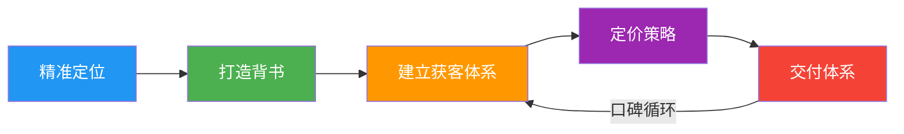
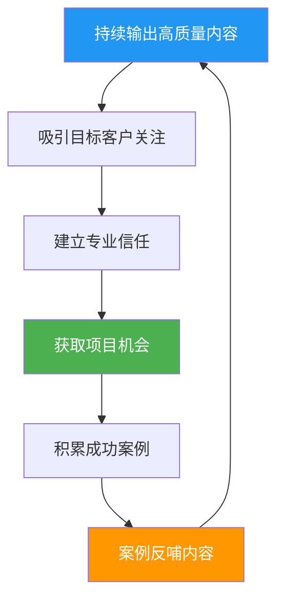
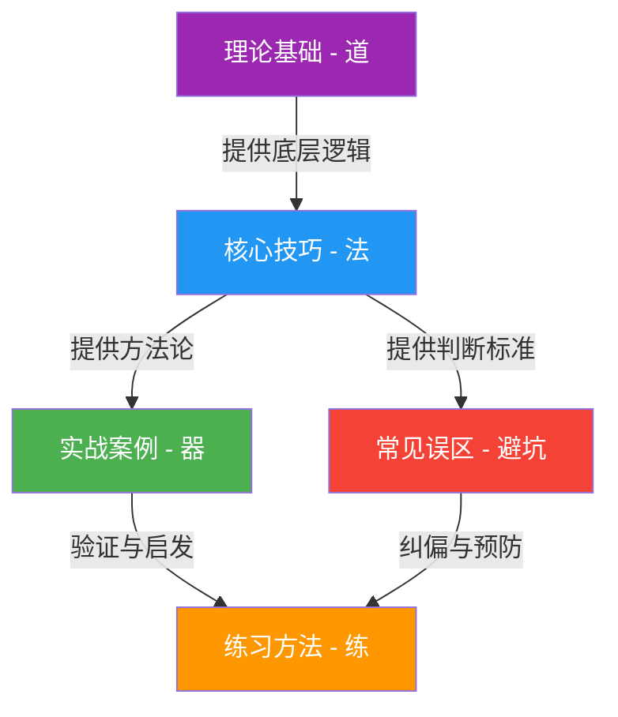

## 九、本节总结

核心技巧一节围绕一个核心命题展开：**如何把你的专业能力变成一门能持续赚钱的生意？** 从个人咨询业务的搭建，到企业培训的规模化交付，再到专业壁垒的构建、教练服务的实操、项目管理、时间管理和个人品牌建设——七个维度构成了咨询与培训变现的完整方法论体系。本节总结将这些分散的知识点串联成一张可执行的行动地图。

---

### 1. 核心技巧全景回顾

本节七个章节覆盖了咨询与培训业务从零到一、从一到N的全流程：

| 章节 | 主题 | 核心解决的问题 | 关键方法论 |
|------|------|---------------|-----------|
| 一 | 个人咨询业务搭建五步法 | 如何从零搭建咨询业务？ | 定位→背书→获客→定价→交付 |
| 二 | 企业培训业务的核心技巧 | 如何切入企业培训市场？ | 需求挖掘→课程设计→交付标准化 |
| 三 | 行业顾问的专业壁垒构建 | 如何建立不可替代的竞争优势？ | 方法论沉淀→案例库→行业话语权 |
| 四 | 教练服务的实操技巧 | 如何开展高客单价的教练业务？ | 建立信任→结构化对话→成果导向 |
| 六 | 咨询项目的管理技巧 | 如何保证项目按时按质交付？ | 范围管理→进度控制→风险预判 |
| 七 | 咨询顾问的时间管理 | 如何在有限时间内创造最大价值？ | 时间分块→利用率优化→批量处理 |
| 八 | 咨询顾问的个人品牌建设 | 如何让客户主动找上门？ | 内容输出→行业影响→口碑飞轮 |

---

### 2. 五步法核心框架：从定位到交付的闭环

个人咨询业务搭建五步法是本节的核心骨架，也是所有咨询与培训业务的底层逻辑：

**第一步：精准定位**——找到"一厘米宽、一公里深"的细分赛道。定位公式：我帮助【目标客户】解决【具体问题】，通过【独特方法】。关键原则是窄到能在细分领域做到前三，痛点足够痛让客户愿意花大价钱，且你能用案例和数据证明自己。

**第二步：打造专业背书**——在咨询行业，信任是最稀缺的资源。八大背书路径（行业经验、成功案例、客户证言、媒体曝光、学术背景、个人品牌、出版物、演讲经历）不需要全部具备，初期重点突破"行业经验"和"成功案例"两项即可。

**第三步：建立获客体系**——咨询行业50%以上的客户来自转介绍。需要建立系统化的获客漏斗：曝光层→关注层→信任层→咨询层→成交层。七大获客渠道（转介绍、内容营销、行业社群、合作渠道、演讲引流、线上平台、主动BD）需要组合使用，而非押注单一渠道。

**第四步：定价策略**——价格不仅是收入，更是定位。五种定价策略（成本加成、市场参考、价值定价、锚定定价、阶梯定价）适用于不同阶段。核心原则：从成本定价起步，逐步过渡到价值定价，用阶梯定价覆盖不同预算的客户群体。

**第五步：交付体系**——交付的核心不是"做了多少"，而是"客户感受到了多少价值"。四个关键环节：需求诊断（找到真正的问题）→方案设计（具体可执行可衡量）→执行支持（陪伴客户执行）→成果验收（用数据量化成果）。

---

### 3. 企业培训的核心差异化

企业培训与个人咨询的最大区别在于：**培训是"一对多"的杠杆模式，而咨询是"一对一"的深度模式。** 企业培训的核心技巧包括：

- **需求挖掘**：不要只听HR说什么，要深入业务部门了解真实痛点。好的培训需求分析应该覆盖组织层面（战略目标）、岗位层面（能力差距）和个人层面（发展意愿）
- **课程设计**：采用"三三制"原则——三分之一理论讲解、三分之一案例分析、三分之一实操练习。纯理论的培训在企业场景中效果最差
- **效果评估**：运用柯氏四级评估模型（反应层→学习层→行为层→结果层），让培训效果可量化、可追溯。这是企业愿意持续采购的关键
- **交付标准化**：将课程拆解为标准化模块，支持不同讲师交付，为规模化做准备

---

### 4. 专业壁垒构建的三层模型

咨询行业的竞争本质是**认知深度的竞争**。专业壁垒的构建分为三层：

| 壁垒层级 | 内容 | 构建周期 | 护城河强度 |
|----------|------|----------|-----------|
| 表层壁垒 | 头衔、证书、学历 | 1-3年 | 弱——容易被模仿 |
| 中层壁垒 | 方法论、案例库、工具包 | 3-5年 | 中——需要持续积累 |
| 深层壁垒 | 行业洞察、预判能力、人脉网络 | 5-10年 | 强——几乎不可复制 |

**关键认知：** 大多数新手咨询顾问把精力花在获取证书和头衔上（表层壁垒），但真正让客户持续买单的是你对行业的深度理解和预判能力（深层壁垒）。一个能帮客户"看到未来三年趋势"的顾问，价值远超一个只有MBA学位的顾问。

---

### 5. 教练服务的独特价值

教练服务（Coaching）与传统咨询的核心区别在于：**咨询是"我告诉你怎么做"，教练是"我帮你发现自己该怎么做"。** 教练服务的实操要点：

- **建立信任是前提**：教练关系的深度远超普通咨询，客户需要在你面前展现脆弱和不确定性。前2-3次对话的核心目标不是解决问题，而是建立信任
- **结构化对话框架**：GROW模型（Goal目标→Reality现状→Options方案→Will意愿）是教练对话的基础框架，但高阶教练会根据客户状态灵活调整
- **成果导向**：教练不是"聊天"，每次对话都应该有明确的议题和产出。好的教练会在每次对话结束时确认客户的"下一步行动"
- **定价策略**：教练服务通常按"包"收费（如12次对话为一个周期），单价高于普通咨询，因为教练服务的时间密度和情感投入更大

---

### 6. 项目管理与时间管理的协同

咨询顾问面临的最大挑战之一是：**同时服务多个客户，每个项目都有截止日期，而你的时间是有限的。** 项目管理和时间管理必须协同运作：

**项目管理的核心原则：**
- **Scope Creep（范围蔓延）是最大的利润杀手**——在合同中明确定义项目范围，任何超出范围的需求都需要重新报价
- **里程碑管理**——将项目拆解为3-5个关键里程碑，每个里程碑都有明确的交付物和验收标准
- **风险预判**——在项目启动时就识别可能的风险点（客户内部政治、数据获取困难、决策者变动），并准备应对方案

**时间管理的核心原则：**
- **利用率是咨询顾问的生命线**——利用率 = 实际收费时间 / 总可用时间。行业基准：独立顾问利用率60%-70%为健康，低于50%需要调整获客策略
- **时间分块**——将时间分为"深度工作时间"（项目交付、方案设计）、"浅层工作时间"（邮件、会议、行政）和"业务发展时间"（获客、内容输出），分别安排在不同的时间段
- **批量处理**——同类任务集中处理，减少上下文切换的成本。例如将所有客户会议安排在周二和周四，其他时间专注交付

---

### 7. 个人品牌建设的飞轮效应

个人品牌不是"锦上添花"，而是咨询顾问的**长期获客引擎**。品牌建设的核心是一个正向飞轮：

**品牌建设的四个层次：**
1. **内容层**：定期输出行业深度文章、案例拆解、方法论分享。内容质量 > 内容数量，一篇能引发行业讨论的深度文章，价值远超100篇泛泛而谈的短文
2. **渠道层**：选择1-2个核心渠道深耕（如公众号+知乎，或抖音+视频号），而非全平台铺开。每个平台的运营逻辑不同，分散精力会导致哪个平台都做不好
3. **影响层**：从"写文章"升级到"定义话题"。当你能提出一个新的概念或框架，并被行业引用时，你的品牌就进入了更高的层次
4. **口碑层**：终极目标是让老客户的口碑成为你最大的获客渠道。当转介绍率超过50%时，你的获客成本将趋近于零

---

### 8. 关键认知升级

本节内容如果提炼为几条核心认知，它们是：

**认知一：咨询卖的不是建议，是"认知差"和"执行差"。** 客户买的不是你的PPT或报告，而是你看到他们看不到的东西、做到他们做不到的事情的能力。持续提升自己的认知深度和执行能力，是咨询顾问永恒的功课。

**认知二：从"按时间卖"到"按价值卖"的跃迁。** 新手按小时收费，因为没有案例背书；成熟的顾问按项目收费，因为能控制交付范围；顶级顾问按成果收费，因为能证明自己创造的价值。你的目标是从第一阶段尽快过渡到第二阶段，最终进入第三阶段。

**认知三：获客能力 > 交付能力。** 在咨询行业，"酒香也怕巷子深"。很多专业能力很强的顾问，因为不擅长营销和获客，收入远低于能力一般但善于建立品牌的顾问。在起步阶段，应该把至少30%的时间用于业务发展（获客、内容输出、人脉建设）。

**认知四：复利效应是这个行业最大的魅力。** 每服务一个客户，你的案例库更丰富、方法论更成熟、口碑更响亮、定价能力更强。这是一个典型的"越老越值钱"的行业——前提是你在持续积累，而非简单重复。

**认知五：AI是放大器，不是替代者。** 善用AI的咨询顾问可以用更短的时间完成方案设计、数据分析、内容输出，从而服务更多客户或投入更多时间在高价值的客户关系维护上。抗拒AI的顾问将被善用AI的顾问淘汰。

---

### 9. 从本节到行动：关键里程碑

将本节内容转化为可执行的行动计划，建议设定以下里程碑：

| 里程碑 | 目标 | 检验标准 | 建议时间 |
|--------|------|----------|----------|
| M1：完成定位 | 明确你要服务谁、解决什么问题 | 能用一句话清晰描述你的定位 | 第1周 |
| M2：打造首个背书 | 建立初步的专业可信度 | 有1个可展示的成功案例或作品 | 第2-4周 |
| M3：搭建获客渠道 | 建立至少1个稳定的客户来源 | 每月有3-5个潜在客户主动咨询 | 第2-3月 |
| M4：完成首单交付 | 跑通从获客到交付的全流程 | 收到第一笔咨询/培训收入 | 第1-3月 |
| M5：建立定价体系 | 形成阶梯式的产品定价 | 有免费→低价→中价→高价的完整产品线 | 第3-6月 |
| M6：启动品牌建设 | 开始系统化的内容输出 | 每周至少1篇高质量行业内容 | 第1月开始 |
| M7：实现口碑循环 | 老客户开始主动推荐新客户 | 转介绍率超过30% | 第6-12月 |

---

### 10. 本节与全章的关系

核心技巧是本章的"术"——它承接理论基础的"道"（理解行业本质和商业模式），为实战案例的"器"（真实案例验证）提供方法论支撑，同时为常见误区的"避坑"提供判断标准。

如果你已经读完理论基础，现在读完核心技巧，你已经掌握了咨询与培训变现的"知道怎么做"。接下来进入实战案例，看看别人是怎么做的；再进入常见误区，看看哪些坑要避开；最后通过练习方法，把知识转化为能力。

**记住：核心技巧的价值不在于"知道"，而在于"做到"。** 每读完一个小节，问自己一个问题：这个方法，我今天就能开始执行的第一步是什么？
