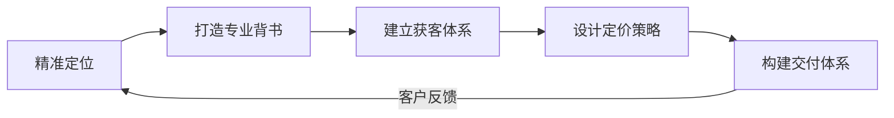
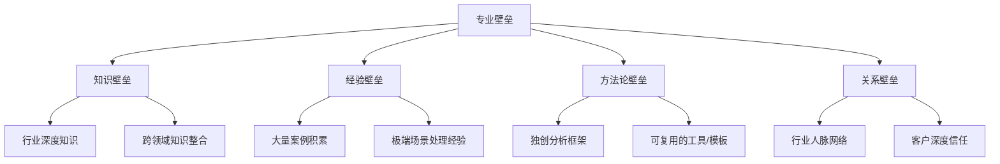
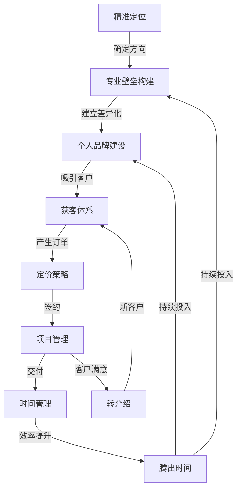

## 五、本节核心要点

本节从七个维度系统拆解了咨询与培训变现的实操方法论。以下将每个维度的核心要点提炼为可直接执行的行动清单，同时梳理各维度之间的逻辑关系，帮助你建立完整的知识框架。

---

### 1. 个人咨询业务搭建五步法：从零到接单的完整路径

搭建咨询业务的本质是依次回答五个核心问题，每一步都是下一步的前提条件，不可跳过也不可乱序。

#### 五步法核心逻辑



#### 每一步的关键行动

**第一步：精准定位**——回答"你帮谁解决什么问题"

定位不是拍脑袋决定的，而是三个圆的交集：

| 维度 | 核心问题 | 自检标准 |
|------|----------|----------|
| 你的专业能力 | 你擅长什么？ | 至少有3个成功案例或5年以上深耕经验 |
| 市场真实需求 | 谁愿意为这个买单？ | 能找到至少10个潜在客户，且他们正在花钱解决类似问题 |
| 竞争差异化 | 你和别人有什么不同？ | 能用一句话说清"为什么选你而不是别人" |

定位公式：**我是[目标客户]的[具体问题]专家，通过[独特方法]帮助他们[可量化的结果]。**

示例："我是年营收500万-2000万电商企业的利润优化专家，通过数据驱动的品类结构调整方法，帮助他们在6个月内将净利润率提升3-8个百分点。"

**第二步：打造专业背书**——回答"凭什么相信你"

客户购买咨询/培训服务时，最大的障碍是信任。专业背书就是消除这个障碍的工具。背书的四个层级（从易到难）：

1. **知识背书**：行业文章、白皮书、公开演讲——证明你"懂"
2. **案例背书**：成功案例、数据结果——证明你"做过"
3. **口碑背书**：客户证言、转介绍——证明你"做得好"
4. **权威背书**：行业奖项、媒体报道、头部客户——证明你是"这个领域最好的"

对于起步阶段，重点打磨前两层。写3-5篇深度行业文章，整理2-3个详细案例（即使是免费做的也要形成案例），这比任何证书都有说服力。

**第三步：建立获客体系**——回答"客户从哪里来"

咨询业务的获客渠道按效果排序：

| 渠道 | 获客成本 | 客户质量 | 适合阶段 | 启动难度 |
|------|----------|----------|----------|----------|
| 老客户转介绍 | 极低 | 极高 | 所有阶段 | 需先有客户 |
| 行业社群/圈子 | 低 | 高 | 起步期 | 中等 |
| 内容营销（文章/视频） | 低 | 中高 | 起步期 | 需持续产出 |
| 公开演讲/分享 | 中 | 高 | 成长期 | 需要邀约机会 |
| 合作渠道（机构/平台） | 中高 | 中 | 成长期 | 需谈判能力 |
| 付费广告 | 高 | 中低 | 成熟期 | 需预算和投放能力 |

**关键原则**：起步期只聚焦1-2个渠道做深做透，不要贪多。转介绍是所有渠道中ROI最高的，必须从第一个客户开始就设计转介绍机制。

**第四步：设计定价策略**——回答"收多少钱"

定价的核心不是成本，而是价值。三种定价模式对比：

| 模式 | 计费方式 | 适用场景 | 优势 | 劣势 |
|------|----------|----------|------|------|
| 按时间计费 | 小时费/日费 | 诊断类、陪伴类咨询 | 简单透明 | 收入有天花板 |
| 按项目计费 | 固定总价 | 明确范围的项目 | 收入可预期 | Scope Creep风险 |
| 按价值计费 | 与成果挂钩 | 能量化价值的项目 | 收入上限极高 | 需要强信任基础 |

**定价策略建议**：

- 起步期：用"按项目计费"降低客户决策门槛，定价为行业均价的60%-80%
- 成长期：引入"按价值计费"，与客户约定KPI和对应报酬
- 成熟期：以"按价值计费"为主，辅以"按时间计费"的顾问保留费

**第五步：构建交付体系**——回答"怎么把活干好"

交付体系的核心是标准化+个性化：

1. **标准化流程**：建立从签约到交付的SOP（标准作业流程），包括需求调研模板、方案框架、汇报模板、验收清单
2. **个性化内容**：在标准化框架内，针对每个客户的具体情况做定制化调整
3. **质量控制**：设置关键节点检查，确保交付物符合预期
4. **知识沉淀**：每个项目结束后，将新知识、新方法论沉淀到你的知识库中

---

### 2. 企业培训业务的核心技巧：从个人能力到组织价值

企业培训与个人咨询的最大区别在于：你面对的不是一个人，而是一个组织。这意味着你需要同时满足决策者（HR/老板）和参与者（学员）的需求。

#### 培训业务的三个关键能力

**课程设计能力**——好的课程不是知识的堆砌，而是学习体验的设计

"三三制"课程设计原则：

- **三分之一理论**：讲清楚"为什么"和"是什么"，建立认知框架
- **三分之一案例**：用真实案例说明理论如何应用，增强可信度
- **三分之一练习**：让学员动手实操，将知识转化为能力

课程设计的底层逻辑：

```text
痛点分析 → 学习目标 → 内容架构 → 教学方法 → 评估方式
```

每一步都要回到原点问自己：学员上完这个课，**能做到什么之前做不到的事**？

**效果评估能力**——用数据证明培训的价值

柯氏四级评估模型是行业标准：

| 级别 | 评估内容 | 评估方法 | 时间节点 |
|------|----------|----------|----------|
| L1 反应层 | 学员满意度 | 课后问卷（满意度评分） | 课程结束当天 |
| L2 学习层 | 知识/技能掌握 | 测验、实操考核 | 课程结束或次日 |
| L3 行为层 | 工作行为改变 | 上级观察、360度反馈 | 课后1-3个月 |
| L4 结果层 | 业务指标变化 | KPI对比分析 | 课后3-6个月 |

**关键洞察**：大多数培训师只做到L1，做到L2的已经算优秀。但真正能证明培训价值、支撑高定价的是L3和L4。建议在培训方案中主动承诺L3/L4的跟踪评估，这是与竞争对手拉开差距的利器。

**客户管理能力**——企业培训是关系生意

- **决策链分析**：搞清楚谁是预算审批人、谁是需求发起人、谁是最终用户，针对不同角色传递不同价值主张
- **需求挖掘**：企业说"要一个沟通培训"，真正的需求可能是"跨部门协作效率低下"。学会追问"为什么需要这个培训"3次以上
- **长期绑定**：从单次培训发展为年度培训计划，从培训延伸到咨询+培训+教练的综合服务

---

### 3. 行业顾问的专业壁垒构建：从"能做"到"不可替代"

专业壁垒是你收费高于同行的底气。没有壁垒的咨询顾问，最终只能拼价格。

#### 专业壁垒的四个维度



**知识壁垒的构建方法**：

1. **纵向深耕**：选择一个细分领域，持续深挖3年以上。比如"电商运营"太大，"跨境电商独立站的Facebook广告投放优化"就是一个有壁垒的定位
2. **横向整合**：将相邻领域的知识融入你的专业体系。比如做人力资源咨询的同时学习组织行为学和数据分析师的技能，就能提供"数据驱动的人才管理"这种跨界服务
3. **持续更新**：订阅行业报告、参加行业会议、跟进政策变化。你必须比客户知道得更多、更早、更深

**经验壁垒的构建方法**：

1. **案例数量**：至少积累30个以上完整案例，涵盖不同类型和规模
2. **案例深度**：每个案例都要形成完整的故事线——背景→问题→诊断→方案→实施→结果→反思
3. **极端案例**：主动争取那些"难啃"的项目，处理过极端场景的顾问，处理常规场景游刃有余

**方法论壁垒的构建方法**：

1. **提炼框架**：将反复使用的工作方法总结为可命名、可教学的框架。比如"五步诊断法""三层需求分析模型"
2. **开发工具**：制作专用的分析模板、评估量表、计算工具。工具化的知识更容易被客户感知到价值
3. **申请保护**：独特的方法论可以申请商标保护，形成品牌资产

---

### 4. 教练服务（Coaching）的实操技巧：引导而非告知

教练服务与传统咨询最大的区别在于：咨询顾问给答案，教练帮客户自己找到答案。这种模式在高管教练、人生教练、团队教练等领域越来越受欢迎。

#### 教练服务的核心技能

**提问能力**——教练的第一工具

| 提问类型 | 目的 | 示例 |
|----------|------|------|
| 澄清式提问 | 理解真实情况 | "你说的'不顺利'具体指什么？" |
| 聚焦式提问 | 收窄问题范围 | "在所有这些挑战中，最紧迫的是哪一个？" |
| 假设式提问 | 打破思维定式 | "如果没有任何限制，你会怎么做？" |
| 挑战式提问 | 推动深度思考 | "是什么让你觉得这不可能？" |
| 行动式提问 | 推动落实 | "你打算在什么时间之前完成第一步？" |

**教练会谈的标准流程**（GROW模型）：

1. **Goal（目标）**：明确本次会谈要达成什么——"今天讨论结束后，你希望带走什么？"
2. **Reality（现状）**：深入了解当前状况——"目前的情况是怎样的？你已经尝试过什么？"
3. **Options（选项）**：探索所有可能的路径——"还有哪些可能性？如果换个角度呢？"
4. **Will（意愿）**：确定行动承诺——"你决定采取什么行动？什么时候开始？"

**教练服务的定价参考**：

| 服务类型 | 单次时长 | 定价范围（人民币） | 适合对象 |
|----------|----------|-------------------|----------|
| 个人成长教练 | 60-90分钟 | 500-2000元/次 | 职场新人、转型期人士 |
| 职业发展教练 | 60-90分钟 | 1500-5000元/次 | 中层管理者、专业人士 |
| 高管教练 | 60-90分钟 | 3000-15000元/次 | 企业高管、创业者 |
| 团队教练 | 半天-全天 | 8000-50000元/次 | 管理团队、创业团队 |

---

### 5. 咨询项目的管理技巧：从接单到交付的全流程管控

咨询项目管理的核心目标是：在预算内按时交付高质量成果，同时控制好范围蔓延（Scope Creep）。

#### 项目管理的五个关键节点

**节点一：签约阶段——把丑话说在前面**

- 明确项目范围（Scope Statement）：详细列出做什么、不做什么
- 定义交付物清单：每个交付物的形式、标准、交付时间
- 设定变更机制：超出范围的需求如何评估、如何报价
- 约定付款节点：建议按里程碑付款，避免"做完再付"的被动局面

**节点二：调研阶段——诊断比治疗更重要**

- 用结构化框架收集信息，避免"聊天式"调研
- 至少访谈3个层级（决策层、管理层、执行层），获取不同视角
- 用数据补充访谈，定量+定性结合

**节点三：方案阶段——方案是"卖"出去的**

- 方案不是越厚越好，而是越清晰越好
- 每个建议都要回答"为什么""怎么做""谁来做""什么时候完成"
- 用一页纸总结核心方案，细节放在附录

**节点四：实施阶段——陪伴比方案更重要**

- 定期检查进度，及时发现偏差
- 帮助客户处理实施过程中的阻力（来自员工、流程、文化等）
- 根据实际情况灵活调整方案

**节点五：收尾阶段——为下一次合作铺路**

- 项目复盘：总结成功经验和改进点
- 成果量化：用数据展示项目带来的变化
- 客户反馈：收集书面证言和改进建议
- 后续规划：提出下一阶段的优化方向

#### 控制Scope Creep的实操技巧

Scope Creep（范围蔓延）是咨询项目利润被侵蚀的最大杀手。防范方法：

1. **书面化**：所有需求和变更必须书面确认，口头承诺不算数
2. **变更单制度**：超出范围的需求填写变更单，评估影响后报价
3. **定期对齐**：每周与客户对齐进度和范围，避免最后一刻发现偏差
4. **缓冲设计**：项目时间预留10%-20%的缓冲，应对不可预见的需求

---

### 6. 咨询顾问的时间管理：从"卖时间"到"卖杠杆"

咨询顾问最稀缺的资源是时间。初级顾问卖时间赚钱，高级顾问用杠杆赚钱。

#### 时间管理的核心框架

**时间投资矩阵**（将所有工作分为四类）：

| 类别 | 说明 | 占比目标 | 典型活动 |
|------|------|----------|----------|
| 高价值·交付类 | 直接产生收入的工作 | 40%-50% | 客户咨询、培训授课、方案撰写 |
| 高价值·发展类 | 未来产生收入的工作 | 20%-30% | 内容创作、学习提升、案例整理 |
| 低价值·必要类 | 不产生收入但必须做 | 15%-20% | 行政事务、沟通协调、合同处理 |
| 低价值·消耗类 | 既不产生收入也非必要 | <5% | 无效社交、过度会议、琐碎杂事 |

**关键行动**：

- **提升高价值占比**：将低价值但必要的工作外包（行政助理、设计排版、财务记账）
- **消灭消耗类工作**：严格筛选会议和社交，对不创造价值的活动说"不"
- **批量处理**：将同类工作集中处理（如集中在周一回复邮件、集中在周三写作）
- **时间块管理**：将日历分为"创作时间块"（不被打扰的深度工作）和"沟通时间块"（会议、电话、邮件）

#### 提升时间杠杆的方法

1. **产品化**：将定制化的咨询服务转化为标准化产品（模板、课程、工具），一次开发、多次售卖
2. **团队化**：在业务量稳定后，培养助理或初级顾问处理低复杂度工作，自己聚焦高价值客户
3. **技术化**：用AI工具提升效率——用AI辅助写方案初稿、做数据分析、生成报告框架，将节省的时间用于客户深度沟通

---

### 7. 咨询顾问的个人品牌建设：让客户主动找上门

个人品牌是咨询顾问最强大的获客引擎。有品牌的顾问不需要找客户，客户会主动来找你。

#### 个人品牌建设的四个阶段

**阶段一：专业可见**（0-6个月）

目标：让目标客户知道你存在

- 选择1-2个内容平台持续输出（公众号、知乎、小红书、LinkedIn）
- 每周至少发布1篇高质量行业内容
- 加入3-5个目标客户所在的行业社群，积极参与讨论
- 关键指标：粉丝数/阅读量稳步增长

**阶段二：专业认可**（6-18个月）

目标：让目标客户认可你的专业能力

- 发布深度案例分析和行业洞察文章
- 争取行业活动的分享/演讲机会
- 主动为行业媒体撰写专栏
- 关键指标：开始有客户主动咨询

**阶段三：专业首选**（18-36个月）

目标：成为目标客户在该领域的第一选择

- 出版行业书籍或系统化课程
- 建立个人方法论品牌（命名+注册商标）
- 获得行业头部客户的背书
- 关键指标：50%以上的客户来自主动咨询或转介绍

**阶段四：行业标杆**（36个月以上）

目标：成为行业定义者，而非跟随者

- 发起或参与行业标准制定
- 培养行业后辈，建立人才网络
- 跨界合作，扩大影响力半径
- 关键指标：行业内提到该领域，你的名字会被自动提及

#### 内容创作的实操建议

| 内容类型 | 制作难度 | 传播效果 | 信任建立 | 建议频率 |
|----------|----------|----------|----------|----------|
| 行业分析文章 | 中 | 高 | 高 | 每周1篇 |
| 案例复盘 | 中 | 中高 | 极高 | 每月2篇 |
| 短视频/图文 | 低 | 高 | 中 | 每周2-3条 |
| 直播分享 | 中 | 中 | 高 | 每月1-2次 |
| 深度白皮书 | 高 | 低 | 极高 | 每季度1份 |
| 书籍/课程 | 极高 | 中 | 极高 | 1-2年一部 |

---

### 8. 七大维度的内在关联与行动优先级

上述七个维度不是孤立的，它们构成了一个有机的业务系统：



#### 行动优先级矩阵

根据你当前所处的阶段，优先做的事情不同：

**刚起步（0-3个月）**：

1. 完成精准定位（用定位公式写出一句话介绍）
2. 准备2-3个案例素材（即使是免费做的也要形成案例）
3. 选择1个平台开始输出内容
4. 获得第一个付费客户

**初见成效（3-12个月）**：

1. 建立标准化的交付流程和模板
2. 积累到10个以上案例
3. 设计转介绍机制，提升老客户推荐率
4. 开始尝试按价值定价

**规模化阶段（12个月以上）**：

1. 培养团队或外包伙伴，释放自己的时间
2. 将方法论产品化（课程、工具、模板）
3. 建立个人品牌护城河
4. 探索教练服务等高客单价模式

---

### 9. 本节关键数据速查表

| 指标 | 行业基准 | 优秀水平 | 顶级水平 |
|------|----------|----------|----------|
| 咨询顾问日费（独立） | 2000-5000元 | 8000-15000元 | 20000-50000元 |
| 企业培训日费（讲师） | 3000-8000元 | 10000-30000元 | 50000-100000元 |
| 高管教练单次费 | 1500-3000元 | 5000-10000元 | 15000-50000元 |
| 客户转介绍率 | 10%-20% | 30%-50% | 60%以上 |
| 时间利用率（收费时间/总时间） | 30%-40% | 50%-60% | 70%以上 |
| 项目利润率 | 40%-50% | 60%-70% | 75%以上 |
| 内容获客转化率 | 0.5%-1% | 2%-5% | 5%以上 |
| 客户续约率 | 20%-30% | 40%-60% | 70%以上 |

---

### 10. 核心要点自检清单

在进入实战案例之前，用以下清单检验自己是否掌握了本节核心内容：

- [ ] 能用一句话说清自己的咨询/培训定位
- [ ] 知道按时间、按项目、按价值三种定价模式的区别和适用场景
- [ ] 能画出自己的获客渠道组合，并知道每个渠道的优劣
- [ ] 了解柯氏四级评估模型，且能说出L3/L4的评估方法
- [ ] 能列出至少3种控制Scope Creep的方法
- [ ] 知道GROW模型的四个步骤及其用途
- [ ] 能说出个人品牌建设的四个阶段及每个阶段的关键指标
- [ ] 有明确的时间投资矩阵，知道自己的高价值工作占比目标
- [ ] 能描述专业壁垒的四个维度及各自的构建方法
- [ ] 知道自己当前所处的阶段和接下来3个月的优先行动

如果以上10项中有3项以上回答"不确定"，建议回看对应章节后再继续。
