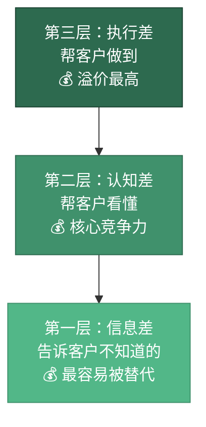
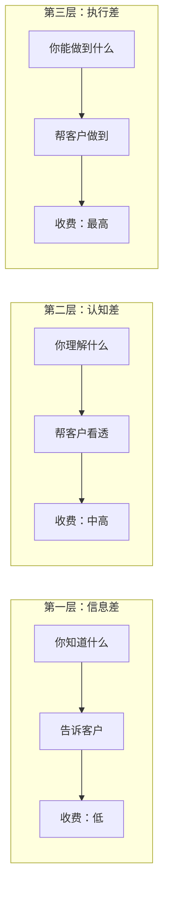
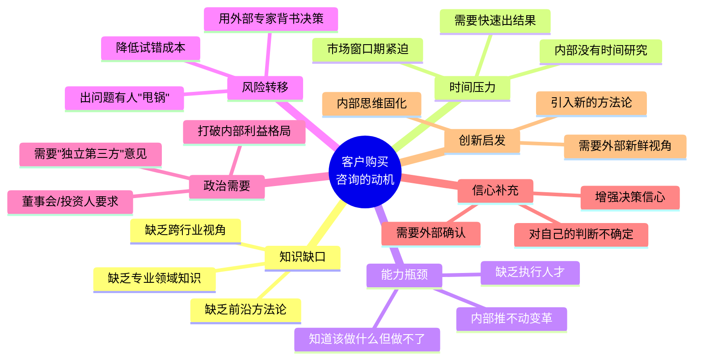
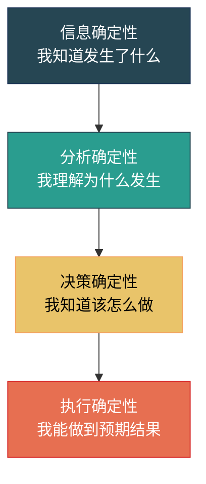
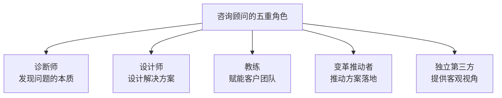
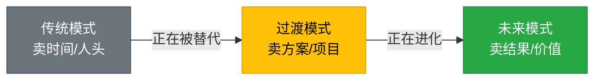

# 一、咨询行业的本质：卖的是什么？

## 1.1 开篇：一个颠覆性的认知

很多人对咨询行业有一个根深蒂固的误解：以为咨询就是"卖建议"。

如果仅仅是卖建议，那咨询行业早就被搜索引擎和AI取代了——你遇到任何问题，Google一下就能获得上万条建议，ChatGPT可以在30秒内给你一份结构化的分析报告。但现实是，全球管理咨询市场规模在2025年已突破3000亿美元，而且仍在以每年8%-12%的速度增长。

这个事实说明一个关键问题：**客户买的从来不是建议本身，而是建议背后的东西。**

理解这一点，是进入咨询行业的第一道门槛，也是决定你能在行业里走多远的核心认知。

---

## 2. 咨询价值的三层金字塔模型

咨询行业真正卖的东西，可以拆解为三层，形成一个"价值金字塔"：

### 第一层：信息差——"你不知道的，我知道"

**定义：** 客户不知道的信息，你知道。这包括行业最新趋势、政策变化、竞品动态、技术路径、人才市场行情等。

**本质：** 信息差的核心是"知道"（Knowing）。你扮演的是一个信息节点的角色。

**具体表现：**

| 信息差类型 | 示例场景 | 收费水平 |
|------------|----------|----------|
| 行业趋势信息 | "你们行业的头部企业明年将全面转向AI客服" | 低（容易被替代） |
| 政策法规信息 | "这个新规下月实施，你们需要提前做合规调整" | 中（有时效性） |
| 竞品情报信息 | "你的三个主要竞争对手分别在做这些布局" | 中（需要渠道） |
| 跨行业信息 | "互联网行业的增长黑客方法论可以迁移到你们行业" | 中高（需要翻译能力） |
| 内部视角信息 | "我曾经在你的竞争对手公司做过三年高管" | 高（稀缺性强） |

**信息差的致命弱点：**

信息差是最容易被抹平的咨询价值。原因有三：

1. **信息透明化趋势。** 互联网让信息获取成本趋近于零。你花三天整理的行业报告，客户用AI工具可能30分钟就能生成类似内容。
2. **时效性短。** 今天的信息差，明天可能就是公开信息。你卖的不是"信息"，而是"信息的时间窗口"。
3. **可替代性高。** 客户可以从多个渠道获取信息——行业报告、竞争对手的公开信息、甚至直接挖一个行业内的人。

**搞钱启示：** 如果你只停留在信息差层面，你的价值会持续贬值。今天收5000元一次的咨询费，明年可能只能收2000元。你必须向第二层和第三层进化。

### 第二层：认知差——"同样的信息，我比你看得透"

**定义：** 同样的信息摆在面前，客户看了但理解不了或理解不深，你能从中提炼出关键洞察、看透本质、预判趋势。

**本质：** 认知差的核心是"理解"（Understanding）和"判断"（Judging）。你扮演的是一个认知翻译器的角色。

**认知差的四个维度：**

**维度一：模式识别能力**

普通人看到的是一堆散乱的数据点，你能从中识别出模式和规律。

> **案例：** 一位餐饮咨询顾问发现，某连锁品牌的三家门店中，商场店的营收是社区店的3倍，但利润率只有社区店的一半。老板只看到了"商场店更赚钱"的表象，顾问却识别出"商场店的高营收被高租金和高人工成本吞噬了"这个模式，进而建议将扩张重心转向社区店。这一建议让品牌在次年利润率提升了12个百分点。

**维度二：因果推理能力**

普通人看到相关性，你能区分因果性。

> **案例：** 某公司发现"参加培训的员工离职率更低"，于是决定加大培训投入来降低离职率。一位管理咨询顾问指出：因果关系可能是反的——不是培训降低了离职率，而是本来就不会离职的员工（忠诚度高、认同公司文化）更愿意参加培训。真正降低离职率的，是培训中建立的社交关系和归属感，而非培训内容本身。这个洞察改变了培训方案的设计方向。

**维度三：系统思维能力**

普通人看到单点问题，你能看到系统和结构。

> **案例：** 一家电商公司的客服投诉率上升，各部门互相推诿——产品部说是运营活动引来了低质量客户，运营部说是产品质量下降导致投诉，客服部说是物流太慢引发不满。一位咨询顾问画了一张系统因果图，发现问题的根源是：公司为了冲刺GMV，在Q3大幅降低了准入门槛，引入了大量价格敏感型客户，而这些客户的售后需求天然更高。解决方案不是优化客服流程，而是调整获客策略。

**维度四：逆向思维能力**

普通人顺着想，你能反着想。

> **案例：** 大多数人认为"要提高转化率，就要优化详情页"。一位营销咨询顾问却提出了相反的视角："也许问题不在详情页，而在你的流量来源。如果你引来的人本身就不会买你的产品，再好的详情页也没用。"他建议客户暂停详情页优化项目，先花两周时间分析流量来源质量，结果发现60%的付费流量来自不匹配的渠道。

**认知差的价值量化：**

| 认知层次 | 典型动作 | 客户感知价值 | 价格区间 |
|----------|----------|-------------|----------|
| 浅层认知 | "你的问题是XX" | 低（客户自己也能发现） | 500-2000元/次 |
| 中层认知 | "你的问题根源是XX，因为XX" | 中（客户认可你的分析深度） | 5000-20000元/次 |
| 深层认知 | "你的问题根源是XX，而且如果不解决，会导致YY" | 高（客户看到了他看不到的风险） | 20000-100000元/次 |
| 战略认知 | "你应该放弃XX，全力做YY" | 极高（改变了客户的决策方向） | 100000元以上/项目 |

**搞钱启示：** 认知差是大多数咨询顾问的核心竞争力。它不像信息差那样容易被技术替代，因为它需要深度思考、行业经验和跨学科知识的融合。但认知差有一个问题——它仍然停留在"说"的层面。

### 第三层：执行差——"你不只会说，还能帮客户做到"

**定义：** 客户知道该做什么，但做不了或做不好。你不仅能告诉客户"做什么"，还能帮他"做到"。你能把战略拆解为可执行的步骤，能带团队落地，能解决执行过程中的具体问题。

**本质：** 执行差的核心是"做到"（Doing）和"帮他做到"（Enabling）。你扮演的是一个教练、推动者和共同战斗者的角色。

**执行差的三种模式：**

**模式一：陪伴式执行**

你和客户的团队一起工作，手把手带他们完成。

> **案例：** 一位数字化转型咨询顾问，不是写完方案就走，而是驻场三个月，带着客户的IT团队从选型、采购、部署到上线，全程参与。每周开一次进度会，遇到技术难题直接现场解决。最终项目按时交付，客户非常满意，后续又介绍了三个同行客户。

**模式二：教练式执行**

你教客户怎么做，定期检查进度，纠正偏差。

> **案例：** 一位人生教练（Life Coach）帮助一位创业者在六个月内从零搭建起了自己的咨询业务。教练不是替他做，而是每周一次电话，帮他设定目标、拆解行动、复盘结果。六个月后，这位创业者实现了月入5万的咨询收入。

**模式三：系统式执行**

你帮客户搭建一套可运行的系统或流程，让执行可以脱离你独立运转。

> **案例：** 一位HR咨询顾问为一家100人的创业公司搭建了完整的绩效管理体系——包括绩效指标库、评分标准、面谈流程、结果应用规则、以及配套的IT系统。培训了HR团队如何使用，并在前三个月亲自参与了两轮绩效面谈的旁听和辅导。体系搭建完成后，客户的HR团队可以独立运行。

**三层价值的对比总结：**

| 维度 | 信息差 | 认知差 | 执行差 |
|------|--------|--------|--------|
| 核心动作 | 告知 | 分析 | 做到 |
| 客户价值 | "我知道了" | "我理解了" | "我做到了" |
| 可替代性 | 高（AI/报告可替代） | 中（需要经验积累） | 低（需要深度参与） |
| 收费模式 | 按次/按报告 | 按项目/按天 | 按项目/按成果 |
| 客户粘性 | 低（用完即走） | 中（信任建立后会复购） | 高（深度绑定） |
| 天花板 | 低（信息贬值快） | 高（认知是稀缺资源） | 极高（交付结果最有说服力） |
| 典型产品 | 行业报告、市场调研 | 战略方案、诊断分析 | 驻场顾问、教练服务、系统搭建 |

**搞钱的关键认知：** 只停留在第一层，你的价值会不断贬值；努力提升到第二层和第三层，你的收入天花板才会真正打开。最优秀的咨询顾问，往往三层能力兼备——用信息差建立初步接触，用认知差建立专业信任，用执行差锁定长期客户。

---

## 3. 为什么客户愿意付高价买这些？

理解了咨询卖的是什么之后，下一个问题是：客户为什么不自己做，而要花高价请咨询顾问？

### 3.1 客户购买咨询的七大动机

**动机一：知识缺口**

客户在某个专业领域缺乏深度知识，而这个知识对决策至关重要。

> **典型场景：** 一家传统制造企业想做数字化转型，但内部没有人懂数字化。他们需要一个既懂数字化技术、又懂制造业流程的咨询顾问，帮他们制定转型路线图。

**动机二：时间压力**

客户知道问题存在，但没有时间自己去研究和解决。

> **典型场景：** 一家创业公司要在三个月内完成A轮融资，需要一份专业的商业计划书和财务模型。自己写可能要半年，请咨询顾问三周就能搞定。

**动机三：能力瓶颈**

客户知道该做什么，但内部缺乏执行能力。

> **典型场景：** 一家公司想搭建供应链管理体系，但内部没有供应链专家。即使有方案，也没有人能落地。

**动机四：风险转移**

客户想把决策风险转移给"专家"。

> **典型场景：** CEO想收购一家公司，但不确定是否值得。请一家咨询公司做尽职调查，如果后续出了问题，CEO可以说"这是咨询公司建议的"。

**动机五：政治需要**

客户的组织决策需要外部权威背书。

> **典型场景：** 一家企业的CFO和COO对战略方向有分歧，董事会决定请麦肯锡来做一份"独立的第三方分析"。本质上，麦肯锡卖的不是答案，而是"公信力"。

**动机六：信心补充**

客户对自己的判断不够自信，需要外部确认。

> **典型场景：** 一位创业者觉得自己选的方向没问题，但还是花了5000元请了一位行业顾问验证。顾问说"你的方向没问题，但你的定价策略有问题"——创业者得到了确认，同时也获得了一个关键修正。

**动机七：创新启发**

客户的内部团队思维固化，需要外部的新鲜视角。

> **典型场景：** 一家消费品公司的营销团队做了十年传统媒体广告，已经不知道怎么玩社交媒体了。请一位新媒体营销顾问来，不是因为他比团队更了解产品，而是因为他能带来新的玩法和视角。

### 3.2 客户购买的本质：降低不确定性

如果用一句话总结客户为什么买咨询，那就是：**客户购买咨询，本质上是在购买确定性。**

商业世界充满不确定性。一个战略决策可能让公司飞黄腾达，也可能让公司万劫不复。咨询顾问的价值，就是帮客户降低这种不确定性——通过专业知识减少"不知道"，通过深度分析减少"看不清"，通过执行支持减少"做不到"。

**确定性的四个层次：**

- **信息确定性：** "我知道行业发生了什么"——对应信息差
- **分析确定性：** "我理解这对我意味着什么"——对应认知差
- **决策确定性：** "我知道我应该怎么做"——对应认知差+执行差
- **执行确定性：** "我能做到我想要的结果"——对应执行差

你提供的确定性层次越高，客户愿意付的钱就越多。

---

## 4. 咨询行业的价值公式

理解了咨询卖的是什么之后，我们可以用一个公式来描述咨询顾问的收入：

### 4.1 价值公式

$$
咨询收入 = 专业深度 \times 影响力半径 \times 信任密度 \times 交付确定性
$$

**四个变量的解释：**

| 变量 | 含义 | 影响因素 |
|------|------|----------|
| 专业深度 | 你能在多深的层次上帮客户解决问题 | 行业经验、方法论积累、跨学科知识 |
| 影响力半径 | 有多少人知道你、能触达到你 | 个人品牌、内容输出、社交网络、口碑推荐 |
| 信任密度 | 客户在多大程度上相信你能帮他 | 成功案例、客户评价、专业资质、沟通能力 |
| 交付确定性 | 客户对你能交付结果的信心程度 | 过往成功率、方法论成熟度、保障机制 |

### 4.2 公式的实际应用

这个公式解释了很多咨询行业的现象：

**现象一：为什么有些专家很厉害但赚不到钱？**

因为他们的"专业深度"很高，但"影响力半径"太小。没有人知道他们，自然没有客户。这是很多技术型专家的通病——闷头做研究，不做个人品牌。

**现象二：为什么有些"网红"咨询师水平一般但收费很高？**

因为他们的"影响力半径"很大，"信任密度"通过大量内容输出和成功案例包装也做到了较高水平。但他们的"专业深度"可能不够，长期来看会遇到口碑问题。

**现象三：为什么麦肯锡的年轻顾问能收高价？**

因为麦肯锡品牌提供了"信任密度"（全球最知名的咨询品牌），成熟的方法论提供了"交付确定性"（知道怎么做到），庞大的网络提供了"影响力半径"（客户主动找上门）。个人的"专业深度"相对不足，被品牌弥补了。

**现象四：为什么独立咨询顾问比大公司顾问更需要个人品牌？**

因为独立顾问没有品牌的"信任密度"背书，必须用个人品牌来弥补。同时，独立顾问的"影响力半径"完全靠自己拓展，不像大公司有销售团队。

### 4.3 如何提升每个变量

```mermaid
graph TD
    subgraph "提升专业深度"
        PD1["深耕一个行业3-5年"] --> PD2["建立自己的方法论"]
        PD2 --> PD3["跨学科学习（心理学+商业+技术）"]
        PD3 --> PD4["持续服务客户积累案例"]
    end
    subgraph "扩大影响力半径"
        IR1["写专业文章/出版书籍"] --> IR2["做行业演讲/培训"]
        IR2 --> IR3["社交媒体持续输出"]
        IR3 --> IR4["建立行业社群"]
    end
    subgraph "增强信任密度"
        TD1["积累可量化的成功案例"] --> TD2["获取客户推荐和背书"]
        TD2 --> TD3["取得行业认证/资质"]
        TD3 --> TD4["提升沟通和表达能力"]
    end
    subgraph "提高交付确定性"
        DC1["标准化方法论和流程"] --> DC2["建立质量控制体系"]
        DC2 --> DC3["提供保障机制（不满意退款等）"]
        DC3 --> DC4["展示过往成功率数据"]
    end
```

---

## 5. 咨询与其他知识变现方式的本质区别

很多人容易混淆咨询、培训、教练和知识付费。它们看似都在"卖知识"，但本质上有根本区别：

### 5.1 四种模式的本质对比

| 维度 | 咨询（Consulting） | 培训（Training） | 教练（Coaching） | 知识付费 |
|------|--------------------|-----------------|--------------------|----------|
| 核心卖点 | 解决特定问题 | 传授知识和技能 | 激发潜能和改变 | 提供信息和启发 |
| 交互方式 | 深度定制，1对1或1对少 | 标准化内容，1对多 | 深度对话，1对1 | 单向传播，1对多 |
| 客户角色 | 委托人（你帮他做） | 学员（你教他做） | 被教练者（他自己做，你陪他） | 读者/听众（他自己学） |
| 交付物 | 方案/报告/结果 | 课程/认证/技能 | 行动计划/成长 | 内容/知识 |
| 收费水平 | 高（万元-百万元级） | 中高（千元-数十万元级） | 中高（千元-数万元/月） | 低（几十-几千元） |
| 复利效应 | 强（案例越多越值钱） | 强（课程可复用） | 中（受制于时间） | 强（内容可无限复制） |
| 典型时长 | 数周到数月 | 数小时到数天 | 数月到数年 | 即时消费 |

### 5.2 一个真实的区分场景

假设一位创业者遇到了团队管理问题：

- **咨询顾问会说：** "我帮你做一次组织诊断，分析你的团队问题出在哪里，然后给你一份改进方案。费用5万元，三周交付。"
- **培训师会说：** "我有一门《高效团队管理》的课程，两天时间教你的管理层学会目标管理、绩效沟通和冲突处理。费用3万元。"
- **教练会说：** "我们每周做一次1小时的教练对话，持续三个月。我会通过提问帮你发现自己的领导力盲区，找到适合你的管理方式。费用1.5万元/月。"
- **知识付费作者会说：** "我出了一本书叫《带团队》，里面有20个管理工具和50个案例。39元一本。"

**搞钱启示：** 这四种模式不是互相排斥的，而是可以组合的。很多成功的咨询顾问同时也在做培训、出书、做教练。不同模式解决不同的变现需求——咨询赚高客单价，培训赚规模效应，教练赚持续收入，知识付费赚长尾流量。

---

## 6. 深入理解：咨询顾问的真正角色

### 6.1 咨询顾问不是"专家"那么简单

很多人以为咨询顾问就是"行业专家"，但这个理解过于简化。咨询顾问实际上同时扮演着至少五个角色：

**角色一：诊断师**

像医生一样，通过访谈、数据分析、现场观察等方式，找到客户问题的真正根源。很多客户描述的是症状，不是病因。"销售业绩下滑"是症状，病因可能是产品力不足、团队激励机制失效、市场定位错误、或者组织内耗严重。诊断能力是咨询顾问的基本功。

**角色二：设计师**

找到病因之后，设计针对性的解决方案。这个方案必须考虑客户的资源约束、组织文化、执行能力、时间窗口等多个因素。好的方案不是理论最优解，而是在约束条件下的可行最优解。

**角色三：教练**

帮助客户的团队理解方案、学会方法、提升能力。好的咨询顾问做完项目后，客户的团队能力应该有所提升，而不是更加依赖外部顾问。

**角色四：变革推动者**

方案再好，推不动就是废纸。咨询顾问需要帮助客户处理组织变革中的阻力——包括利益冲突、文化惯性、恐惧心理等。这需要政治敏感度和影响力。

**角色五：独立第三方**

咨询顾问可以提出企业内部人员不方便提出的问题，可以挑战高层的决策，可以推动不受欢迎但必要的变革。这个"外部人"的身份本身就是一种价值。

### 6.2 咨询的本质是"关系"而非"交易"

一个经常被忽视的事实是：**咨询行业本质上是一个关系行业。**

你卖的不仅是知识和能力，还有信任、安全感和陪伴感。一个客户选择你，往往不是因为你比竞争对手聪明多少，而是因为他信任你、觉得你理解他、愿意和你一起面对问题。

这解释了为什么：
- 很多咨询项目是通过关系介绍获得的，而不是通过投标
- 客户忠诚度极高——一旦建立了信任关系，客户很少更换咨询顾问
- 咨询顾问的个人魅力和沟通能力，和专业能力一样重要

**关系的四个层次：**

| 层次 | 特征 | 客户行为 | 商业价值 |
|------|------|----------|----------|
| 认知层 | 客户知道你的存在 | 偶尔看你的文章/视频 | 低（潜在客户） |
| 信任层 | 客户相信你的专业能力 | 主动咨询你的意见 | 中（咨询项目） |
| 依赖层 | 客户遇到问题第一个想到你 | 长期合作、主动推荐 | 高（稳定收入来源） |
| 共生层 | 你和客户的业务深度绑定 | 共同成长、利益共享 | 极高（战略伙伴关系） |

---

## 7. 从"卖知识"到"卖结果"：咨询行业的进化方向

### 7.1 行业趋势：从知识密集型到结果导向型

传统咨询行业的商业模式是"卖人头"——按顾问的人天收费。这种模式正在经历深刻变革：

**传统模式（卖时间）：** 按顾问的人天收费，收入 = 顾问人数 × 天数 × 日费率。这种模式正在被AI和远程协作工具侵蚀——以前需要5个顾问做两周的数据分析，现在一个顾问加AI工具三天就能完成。

**过渡模式（卖方案）：** 按项目收费，交付一份方案或报告。这种模式仍然主流，但客户越来越不满足于"纸面方案"，他们要看到执行效果。

**未来模式（卖结果）：** 按成果收费，和客户的业务结果挂钩。营销顾问按业绩增长分成，融资顾问按融资额提成，猎头按成功入职收费。这种模式的风险更高，但天花板也更高。

### 7.2 AI时代咨询行业的变与不变

**会被AI替代的部分：**
- 信息收集和整理（信息差层被严重侵蚀）
- 基础数据分析和报告生成
- 标准化方案的初步框架
- 行业知识的快速检索

**不会被AI替代的部分：**
- 对客户隐性需求的理解（"客户说要A，其实他真正需要的是B"）
- 复杂组织变革中的政治判断和利益平衡
- 建立信任关系和情感连接
- 跨领域的创造性整合（把A行业的方法论创造性地应用到B行业）
- 执行落地中的应变能力和现场判断

**搞钱启示：** 在AI时代，咨询顾问应该把AI当作效率工具，用来加速信息收集和分析，从而把更多时间投入到高价值的认知差和执行差层面。善用AI的咨询顾问，效率可以提升3-5倍，服务半径可以扩大数倍。

---

## 8. 案例深度解析：三层价值在真实项目中的应用

### 8.1 案例：一家餐饮连锁品牌的咨询项目

**背景：** 一家拥有50家门店的中式快餐连锁品牌，过去三年营收停滞不前，老板请了一位餐饮行业咨询顾问。

**第一层（信息差）的应用：**

顾问在第一周完成了行业调研，提供了以下信息：
- 同品类竞争对手在过去一年的门店扩张数据
- 外卖平台在该品类的流量分配规则变化
- 消费者在外卖平台上的搜索热词变化趋势
- 三个新进入市场的竞争品牌及其打法

这些信息老板自己也能找到，但需要花大量时间，而且容易遗漏关键情报。顾问帮他在一周内获得了全面的行业信息。

**第二层（认知差）的应用：**

在信息收集完毕后，顾问做了深入分析：
- **发现一：** 品牌的堂食营收占比从70%下降到40%，外卖占比从30%上升到60%，但外卖的利润率只有堂食的一半。表面上营收持平，实际上利润率在持续恶化。
- **发现二：** 门店的选址策略还停留在五年前的逻辑——选人流大的商圈。但外卖时代的选址逻辑应该是"覆盖半径内的人口密度"，而不是"门口经过的人流"。
- **发现三：** 老板一直在犹豫是否要做预制菜来降低人工成本，但顾问分析后认为，该品牌的核心竞争力是"现炒"的品质感，做预制菜会自毁长城。真正的问题不在成本端，而在营收端——需要提高客单价和复购率。

这些洞察是老板自己看不到的。他看到了"营收停滞"的症状，但看不到"利润率恶化"和"选址逻辑过时"的本质。

**第三层（执行差）的应用：**

顾问不仅给出了方案，还深度参与了执行：
- **行动一：** 重新设计了外卖菜单——将高毛利的招牌菜放在首页，设计了3个"必点组合"套餐，提高了外卖客单价15%。
- **行动二：** 帮老板建立了新的选址模型——基于外卖平台的配送热力图和人口密度数据，而不是传统的商圈人流统计。用新模型开了3家新店，半年后都实现了盈利。
- **行动三：** 设计了一套"老客复购"运营体系——包括会员积分、生日优惠、新品试吃等活动，并帮老板的运营团队搭建了自动化执行流程。

**项目结果：** 一年后，品牌的营收增长了35%，利润率提升了8个百分点。顾问收费30万元，客户认为非常值得。

### 8.2 案例启示

这个案例完美展示了三层价值的叠加效应：

- 如果顾问只提供了信息差（行业报告），价值可能值5000元
- 加上认知差（战略诊断），价值升到5万元
- 再加上执行差（落地执行），价值达到30万元

**每一层价值的叠加，带来的是非线性的收费增长。**

---

## 9. 常见误区与纠正

### 误区一："我是专家，客户应该听我的"

**错误本质：** 混淆了"专业权威"和"客户关系"。咨询的本质是服务，不是教育。客户付钱不是为了听你炫耀知识，而是为了解决他的问题。

**纠正方法：** 把"我有什么"转变为"你需要什么"。先理解客户的业务、痛点、约束条件，再提供针对性的建议。专家心态是"我知道答案"，服务心态是"我帮你找到适合你的答案"。

### 误区二："咨询就是出报告"

**错误本质：** 把交付物等同于价值。一份100页的报告，如果客户不执行，价值为零。

**纠正方法：** 关注"客户得到了什么结果"，而不是"我交付了什么东西"。在项目设计阶段就明确预期成果，并在项目结束后跟踪执行效果。

### 误区三："价格越高显得越专业"

**错误本质：** 混淆了"定价策略"和"价值交付"。高价需要高价值支撑，否则就是一锤子买卖。

**纠正方法：** 定价应该基于你能为客户创造的价值，而不是你觉得自己"值多少"。一个让客户多赚100万的建议，收10万是合理的；一个让客户没有感知到改变的建议，收1000元都嫌贵。

### 误区四："我需要服务所有行业"

**错误本质：** 贪多嚼不烂。一个什么都能做的咨询顾问，往往什么都做不好。

**纠正方法：** 选择1-2个行业深耕，建立真正的行业壁垒。垂直行业专家的收费通常比"通用型顾问"高3-5倍，因为客户更信任深度而非广度。

### 误区五："咨询不需要营销"

**错误本质：** "酒香不怕巷子"在咨询行业不成立。再专业的能力，客户不知道你就等于不存在。

**纠正方法：** 把个人品牌建设作为和专业能力同等重要的事情来对待。写文章、做演讲、建立社交网络、积累客户案例——这些都是你的"营销资产"。

---

## 10. 本节核心要点

1. **咨询卖的不是建议，而是确定性。** 客户购买咨询的本质是降低决策和执行中的不确定性。

2. **咨询价值分三层：信息差、认知差、执行差。** 信息差最容易被替代，执行差溢价最高。最优秀的咨询顾问三层能力兼备。

3. **客户购买咨询有七大动机：** 知识缺口、时间压力、能力瓶颈、风险转移、政治需要、信心补充、创新启发。理解动机才能精准匹配服务。

4. **收入公式：** 咨询收入 = 专业深度 × 影响力半径 × 信任密度 × 交付确定性。四个变量缺一不可。

5. **咨询的本质是关系而非交易。** 信任、理解和陪伴感，和专业能力一样重要。

6. **行业正在从"卖时间"进化到"卖结果"。** 越早建立结果导向的服务模式，越能在竞争中占据优势。

7. **AI是工具而非威胁。** 善用AI的咨询顾问效率可以提升3-5倍，但AI无法替代深度关系、执行陪伴和组织变革推动。

8. **咨询与其他知识变现方式（培训、教练、知识付费）不是互相排斥的，而是可以组合的。** 不同模式解决不同的变现需求。

---

## 11. 思考题

在进入下一节之前，请思考以下问题：

1. 你目前拥有的能力，主要处于"三层金字塔"的哪一层？你如何向更高层进化？
2. 如果你今天开始做咨询，你能为客户提供什么独特的"差"（信息差、认知差或执行差）？
3. 在你的专业领域，客户最常有的"隐性需求"是什么（他们嘴上说的和真正想要的，是否一致）？
4. 你的收入公式中，哪个变量最薄弱？你打算如何提升它？
