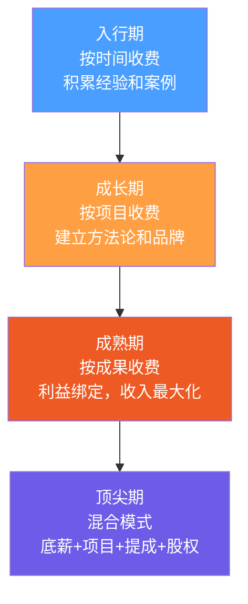

## 二、咨询行业的三大商业模式

咨询行业的商业模式决定了你的时间如何定价、风险如何分配、收入天花板在哪里。选错模式，你可能越努力越穷；选对模式，同样的专业能力可以实现十倍甚至百倍的收入差异。

理解这三大模式的本质区别，是制定咨询变现策略的第一步。

### 1. 按时间收费模式（Time-based）

#### 1.1 模式本质

按时间收费是最古老、最直观的咨询商业模式。核心逻辑是**将专业服务标准化为时间单位**——你出售的是"一小时的专业注意力"，客户购买的是"这个时间段内你为他解决问题的能力"。

从经济学角度看，这是一种**劳动力套利**：你用自己受过多年训练的专业能力换取高于普通劳动力的时薪。客户之所以愿意支付溢价，是因为你的每一小时可以为他们节省数十小时的摸索时间，或避免数十万的决策失误。

#### 1.2 典型场景与价格区间

| 服务类型 | 入门级价格 | 资深级价格 | 顶级价格 | 计费单位 |
|---------|-----------|-----------|---------|---------|
| 法律咨询 | 300-800元 | 1000-3000元 | 5000-10000元 | /小时 |
| 财务/税务咨询 | 500-1500元 | 2000-5000元 | 8000-15000元 | /小时 |
| 管理咨询顾问 | 2000-5000元 | 8000-20000元 | 30000-50000元 | /天 |
| 外聘CTO/技术顾问 | 15000-30000元 | 30000-60000元 | 80000-150000元 | /月 |
| 职业教练/人生教练 | 300-800元 | 1000-3000元 | 5000-10000元 | /小时 |
| 心理咨询 | 200-500元 | 600-1500元 | 2000-5000元 | /小时 |

价格差异巨大的根本因素不是"咨询"本身，而是**你所解决问题的经济规模**。帮个人做职业规划和帮上市公司做并购策略，同样是"一小时"，后者解决的问题价值高千倍，定价自然不同。

#### 1.3 优势深度分析

**对顾问的优势：**

- **现金流可预测**。按月/按周计费可以精确预测未来三个月的收入，这对个人财务规划极其友好。例如，如果你签了3个按月付费的客户，每月收入90000元，你可以非常有信心地规划房贷和投资。
- **启动门槛低**。不需要事先投入大量时间做方案、准备交付物，从第一次会议就开始产生收入。
- **关系粘性强**。长期按时计费的客户通常会持续续约，因为转换成本高——新顾问需要重新了解情况。这种粘性为你提供了稳定的基本盘。
- **灵活性高**。可以同时服务多个客户，自由安排时间块。

**对客户的优势：**

- **风险可控**。客户只为实际使用的时间付费，不满意可以随时终止。相比一次性投入几十万的项目制，这种模式下客户的试错成本极低。
- **需求弹性**。业务忙时多约顾问时间，淡季少约，费用自然波动，避免"花了大价钱但项目结束发现只用了三分之一"的浪费。
- **透明度高**。每一分花费都可以追溯到具体的时间段和工作内容。

#### 1.4 劣势与应对策略

**劣势一：收入天花板——时间悖论**

你每天最多只有24小时，即使按8小时有效工作计算，每月最多160-176小时。假设时薪3000元，月收入天花板约48-52万元。看起来不少，但对比项目制动辄一个项目50-100万的收入，天花板显而易见。

> **应对策略：** 建立"时间分层"——用助理或初级顾问处理基础工作（收资料、整理会议纪要），你只投入高价值环节（策略建议、关键决策）。本质上是把你的时薪"杠杆化"。

**劣势二：效率悖论**

你越专业，解决问题越快，收入反而越少。一个经验丰富的企业战略顾问可能1小时就理清了客户需要3天才能想明白的问题，但如果按小时收费，他只收到了1小时的钱。

> **应对策略：** 提高时薪来对冲效率优势。把"我1小时能解决别人3天的问题"转化为定价话术："我的一小时等于你团队一周的摸索，所以我一小时收费20000元是合理的。"

**劣势三：时间追踪的信任成本**

客户可能质疑"你真的花了这么多时间吗？"尤其在远程咨询场景下，信任缺失会导致摩擦。

> **应对策略：** 使用专业的时间追踪工具（如Toggl、Clockify、Harvest），每条记录附带简要工作说明。每周发送时间报告，让客户清楚看到每一分钟花在了哪里。

#### 1.5 适用人群画像

- **刚入行的咨询顾问**：缺乏品牌背书和成功案例，按时计费是最低风险的起步方式
- **提供陪伴式服务的教练**：职业教练、健身教练、语言教练——核心价值就是"持续陪伴和即时反馈"
- **专业服务领域**：律师、会计师、税务师——行业惯例就是按小时收费，客户预期已经形成
- **风险厌恶型顾问**：偏好稳定可预测的现金流，不愿意为不确定的成果承担风险

#### 1.6 实操：如何做好按时计费

**第一步：确定你的时薪基准**

```text
基准时薪 = 年度目标收入 ÷ 有效可售小时数

有效可售小时数 = 工作日天数 × 每天可售小时 × 利用率

示例：
- 年度目标收入：120万元
- 工作日天数：250天
- 每天可售小时：4小时（另一半时间用于营销、管理、学习）
- 利用率：70%（不是所有时间都能卖出去）
- 有效可售小时数 = 250 × 4 × 0.7 = 700小时
- 基准时薪 = 1,200,000 ÷ 700 = 1,714元/小时
```

**第二步：设计计费单元**

不要只提供"按小时"一个选项，设计阶梯式计费单元：

| 计费单元 | 适用场景 | 定价策略 |
|---------|---------|---------|
| 15分钟快速咨询 | 简单问题、电话咨询 | 时薪的30%（高于线性比例，因为有切换成本） |
| 1小时标准咨询 | 常规咨询、一对一会议 | 基准时薪 |
| 半天（4小时） | 深度诊断、工作坊 | 时薪的3.5倍（给12.5%折扣） |
| 全天（8小时） | 现场调研、全天陪伴 | 时薪的6.5倍（给19%折扣） |
| 月度包（40小时） | 长期顾问关系 | 时薪的35倍（给12.5%折扣） |

**第三步：建立清晰的时间记录系统**

每次服务结束后24小时内，发送时间记录摘要给客户。摘要格式：

```text
日期：2026-06-25
时长：2小时
服务内容：Q3营销战略方向讨论
关键产出：
  - 确认了三个重点渠道（抖音、小红书、B站）
  - 输出了渠道优先级评估矩阵
下一步：准备详细的渠道执行方案（下次会议前）
本次费用：3,000元
```

---

### 2. 按项目收费模式（Project-based）

#### 2.1 模式本质

按项目收费的核心逻辑是**将咨询服务产品化为"交付物"**。你不卖时间，卖的是"一个品牌策划方案"、"一套数字化转型路线图"、"一份商业计划书"。

这种模式的本质转变是：**定价基础从"你投入了多少"变为"客户得到了什么"**。同样一个方案，一个资深顾问花3天做出来，一个新手花30天做出来，但它们的定价应该是一样的——甚至资深顾问的方案因为更精准、更高效，应该定价更高。

#### 2.2 典型场景与价格区间

| 项目类型 | 入门级 | 中级 | 高端 | 交付周期 |
|---------|-------|------|------|---------|
| 品牌策划方案 | 3-8万 | 10-30万 | 50-200万 | 2-8周 |
| 企业数字化转型咨询 | 20-50万 | 50-200万 | 200-1000万 | 2-6个月 |
| 商业计划书 | 5000-2万 | 2-10万 | 10-50万 | 1-4周 |
| 企业内训课程设计 | 1-5万 | 5-20万 | 20-80万 | 1-4周 |
| 市场调研报告 | 2-5万 | 5-20万 | 20-100万 | 2-8周 |
| 组织架构调整方案 | 5-15万 | 15-50万 | 50-300万 | 4-12周 |
| IPO财务规范化 | 30-80万 | 80-300万 | 300-1000万 | 3-12个月 |

#### 2.3 优势深度分析

**收入与价值对齐**

这是项目制最大的优势。当你的方案帮助客户节省了500万的成本或增加了1000万的营收，你收取50万的项目费是完全合理的——客户获得了20倍的投资回报。而如果按小时收费，即使你收5000元/小时，100小时也才50万，但如果这个方案你只花了20小时就做出来了呢？你就只收了10万，价值被严重低估了。

**利润杠杆效应**

一旦你交付过同类项目，后续的边际成本会急剧下降。第一个品牌策划项目可能需要你花200小时，但第五个同类型项目可能只需要50小时——因为你可以复用模板、方法论和行业洞察。定价不变，但成本大幅下降，利润率从30%提升到80%。

**案例积累形成正循环**

每一个成功的项目交付都是一个可展示的案例。案例越多，品牌越强，定价越高，客户质量越好。这个正循环是按时计费模式很难实现的。

#### 2.4 劣势与应对策略

**劣势一：范围蔓延（Scope Creep）**

项目制最大的噩梦。客户说"能不能顺便帮我看看这个？""方案里能不能再加一个模块？"每一次"顺便"都是免费劳动。

> **应对策略：** 在项目合同中明确定义三个要素：
> 1. **交付物清单**：列出每一份文档、每一个方案的具体名称和页数/字数
> 2. **变更流程**：任何超出范围的需求，需要书面确认变更单，包含额外费用和延期时间
> 3. **包含的修改次数**：如"本项目包含2轮修改，超出部分按500元/次收取"
>
> 在项目启动会上，把这些条款当面讲解一遍，让客户签字确认。

**劣势二：前期投入风险**

你可能花2周写投标方案、做免费诊断、参加比稿，最后没拿到项目。这些时间全部沉没。

> **应对策略：** 两种方法结合：
> 1. 对初次接触的客户，收取"方案设计费"（通常为项目总额的5%-10%），如果最终签约，这笔费用抵扣项目费；如果不签约，这笔费用不退。
> 2. 把每次投标的方案文档资产化——即使这次没中标，方案中的方法论、模板、行业洞察可以复用到未来项目中。

**劣势三：收入波动与空窗期**

项目之间可能有1-3个月的空窗期，这段时间收入为零。对需要稳定现金流的人来说，这种波动会造成巨大的心理压力。

> **应对策略：** 采用"项目+顾问"混合模式——用项目制获取高额收入，同时保留1-2个按时计费的长期客户作为"收入保底"。具体比例建议：70%收入来自项目，30%来自按时计费的常客。

#### 2.5 项目定价的三种方法

**方法一：成本加成法（Cost-plus）**

```text
项目报价 = 预估工时 × 时薪 × (1 + 利润率) + 直接成本

示例：
- 预估工时：200小时
- 内部时薪：500元（你的成本价）
- 目标利润率：60%
- 直接成本：差旅2万 + 工具费5000
- 报价 = 200 × 500 × 1.6 + 25,000 = 185,000元
```

这是最保守的方法，适合新手和低风险项目。缺点是跟按时计费类似，定价基础仍然是"你投入了多少"。

**方法二：市场对标法（Market-based）**

参考同类项目的市场价格，结合自身品牌定位来定价。关键信息来源：

- 行业协会的收费标准（如律师协会、管理咨询协会）
- 同行的公开报价（官网、提案模板）
- 客户的预算范围（从需求沟通中获取）
- 招投标平台的中标价格

**方法三：价值定价法（Value-based）**

这是利润最高的方法。核心公式：

```text
项目报价 = 客户预期收益 × 顾问价值占比

示例：
- 客户问题：供应链效率低，每年多花2000万
- 你的方案预期可以节省40%（800万）
- 顾问价值占比：10%-20%（即客户拿大头）
- 报价 = 800万 × 15% = 120万
```

使用价值定价法的前提是：你需要在项目开始前，跟客户一起量化"这个问题值多少钱"。这本身就需要专业能力，因此价值定价法通常只适用于有丰富经验的顾问。

#### 2.6 项目管理的关键流程


每个阶段的关键动作：

| 阶段 | 时间占比 | 关键动作 | 风险点 |
|-----|---------|---------|-------|
| 需求诊断 | 10% | 深度访谈、数据收集、问题定义 | 诊断不准确导致方向错误 |
| 方案设计 | 15% | 方法论选择、路线图规划、资源评估 | 方案过于理想化 |
| 报价签约 | 5% | 价值量化、合同条款、付款节点 | 定价过低或范围不清 |
| 项目启动会 | 2% | 对齐预期、确认接口人、建立沟通机制 | 客户方关键人未到场 |
| 执行交付 | 45% | 按计划推进、定期同步、风险管理 | 执行偏离方案 |
| 阶段性汇报 | 8% | 展示阶段性成果、收集反馈、调整方向 | 客户期望值管理失败 |
| 成果验收 | 10% | 交付物清单核对、质量检查、文档归档 | 验收标准不明确 |
| 项目复盘 | 5% | 总结得失、收集评价、优化流程 | 流于形式不做真实复盘 |

---

### 3. 按成果收费模式（Value-based / Outcome-based）

#### 3.1 模式本质

按成果收费是咨询行业**收入上限最高**的模式，也是**风险最大**的模式。核心逻辑是：你的收入直接取决于客户获得的可量化成果。

这不再是卖时间或卖方案，而是**卖结果**。你和客户成为了真正的利益共同体——客户赚得多，你才赚得多。这种深度绑定会带来极高的信任度和合作深度，但同时也意味着你必须对自己的专业能力有绝对的信心。

#### 3.2 典型场景与价格区间

| 服务类型 | 收费结构 | 典型比例 | 收入范围 |
|---------|---------|---------|---------|
| 营销顾问 | 基础费 + 销售额提成 | 基础费3-10万 + 增量的5%-15% | 5万-500万 |
| 猎头顾问 | 候选人年薪比例 | 年薪的20%-30% | 5万-100万/人 |
| 融资顾问 | 融资额比例 | 融资额的1%-5% | 10万-2000万 |
| 并购顾问 | 交易额比例 | 交易额的1%-3% | 50万-1亿 |
| 股权咨询 | 期权/股权 | 0.5%-5%公司股权 | 取决于退出时估值 |
| 降本增效顾问 | 节省金额比例 | 节省额的10%-30% | 10万-500万 |
| 私域运营顾问 | GMV提成 | GMV的2%-8% | 5万-300万 |

#### 3.3 收费结构的四种设计

**结构一：纯提成制（Pure Commission）**

没有任何基础费用，收入100%来自成果提成。

```text
收入 = 成果金额 × 提成比例

示例（融资顾问）：
- 帮客户融资2000万，提成3%
- 收入 = 2000万 × 3% = 60万
```

**适用场景：** 你对成功有极高把握（>80%），且项目的潜在收益足够大。

**风险：** 如果失败，你的全部投入颗粒无收。

**结构二：基础费 + 提成制（Retainer + Commission）**

这是最常用的混合结构。基础费覆盖你的基本成本和时间投入，提成部分体现价值分享。

```text
总收入 = 基础费 + (成果金额 - 基准线) × 提成比例

示例（营销顾问）：
- 基础费：5万/月
- 提成：增量销售额的8%（基准线为月均100万）
- 客户当月销售额150万，增量50万
- 收入 = 5万 + 50万 × 8% = 9万
```

**适用场景：** 大多数按成果收费的场景。基础费确保你不会"白干"，提成体现价值共享。

**结构三：阶梯提成制（Tiered Commission）**

成果越好，提成比例越高，激励顾问全力以赴。

```text
示例（私域运营顾问）：
- GMV 0-100万：提成3%
- GMV 100-300万：提成5%
- GMV 300万以上：提成8%

如果当月GMV为400万：
收入 = 100万×3% + 200万×5% + 100万×8% = 3万+10万+8万 = 21万
```

**结构四：对赌制（Performance Guarantee）**

顾问做出明确承诺：如果不达到某个成果，全额退款或不收费。

```text
示例：
- 项目费：30万
- 承诺：6个月内帮客户获取5000个付费用户
- 对赌条款：如果未达到5000个，退还50%费用
```

**适用场景：** 你对自己方法论有极高信心，且需要在竞争中脱颖而出。

#### 3.4 优势深度分析

**收入天花板极高**

按时计费的天花板是"你的可用时间×时薪"，项目制的天花板是"你能同时管理的项目数×项目费"。而按成果收费的天花板取决于**客户业务的规模增长**——理论上没有上限。

一个帮客户做到年销售额从1000万增长到1个亿的营销顾问，按增量的8%收费，仅这一个客户就可能贡献720万收入。

**深度信任带来长期合作**

当你和客户的利益绑在一起时，客户会把你视为"合伙人"而非"外部供应商"。这种关系的深度会带来：
- 更开放的信息共享（客户愿意告诉你真实的财务数据）
- 更高的配合度（客户更愿意执行你的建议）
- 更长的合作周期（合伙人关系比甲乙方关系更持久）
- 更多的转介绍（客户会主动把你推荐给合作伙伴）

**优秀的案例具有复利效应**

一个"帮某品牌从0做到年销5000万"的案例，可以为你带来数十个同等级别的客户。这种品牌溢价是时间和方案定价模式很难实现的。

#### 3.5 劣势与应对策略

**劣势一：收入不确定性极高**

你可能投入3个月的精力，最终因为客户执行不力、市场环境变化、内部政治斗争等你完全不可控的因素，导致成果不达标，收入大幅缩水。

> **应对策略：** 三条防线：
> 1. **基础费覆盖成本**：确保基础费至少能覆盖你的时间成本，这样即使提成为零，你也不会亏损
> 2. **成果定义多维度**：不要只挂钩一个指标（如销售额），设计3-5个维度的成果指标，降低单一指标失败的风险
> 3. **设置保底收入**：在合同中约定"无论成果如何，最低支付金额为XX万"

**劣势二：归因困难**

你的方案确实帮客户提升了业绩，但客户说"这是市场大环境好"或"这是我们销售团队努力的结果"。如何证明成果是你的贡献？

> **应对策略：** 在项目开始前建立**清晰的归因框架**：
> 1. **定义基准线**：签约前的业绩数据必须双方确认并书面记录
> 2. **隔离变量**：明确哪些业务板块纳入你的服务范围，哪些不纳入
> 3. **定期数据同步**：每月/每季度同步一次成果数据，避免事后扯皮
> 4. **第三方验证**：在可能的情况下，引入独立的第三方数据源（如Google Analytics、ERP系统导出的数据）

**劣势三：道德风险**

当收入完全挂钩成果时，你可能会倾向于"短视策略"——帮客户冲短期业绩（如疯狂打折促销）而忽略长期健康（如品牌价值、客户留存）。

> **应对策略：** 在成果指标中加入"健康度指标"：
> - 提成挂钩销售额的同时，要求客户毛利率不低于某个阈值
> - 计算提成时扣除退货/退款金额
> - 加入客户满意度或复购率指标

#### 3.6 适用人群画像

- **有明确成功案例的资深顾问**：能用数据证明"我做过，且做到了"
- **对特定行业有深度洞察的专家**：行业认知让你能预判结果，降低不确定性
- **有风控意识的创业者**：理解概率思维，能接受部分项目的失败
- **追求高收入上限的冒险者**：愿意用不确定性换取无限的收入可能

---

### 4. 三大模式的系统性对比

#### 4.1 核心维度对比表

| 维度 | 按时间收费 | 按项目收费 | 按成果收费 |
|-----|-----------|-----------|-----------|
| **定价基础** | 投入的时间 | 交付物的价值 | 客户获得的收益 |
| **收入上限** | 低（受限于时间） | 中（受限于项目数） | 高（理论上无限） |
| **收入稳定性** | 高 | 中 | 低 |
| **风险承担** | 客户承担 | 共同分担 | 顾问承担为主 |
| **专业门槛** | 低-中 | 中-高 | 高 |
| **客户信任要求** | 低 | 中 | 极高 |
| **规模化难度** | 高（依赖个人时间） | 中（可通过团队杠杆） | 低（收入随客户增长） |
| **典型利润率** | 40%-60% | 30%-80% | 10%-90%（波动大） |
| **适合阶段** | 入行期 | 成长期 | 成熟期 |

#### 4.2 进化路径



大多数成功咨询师的职业轨迹是：**先用时间定价入行，积累案例后转向项目制，建立口碑后开始按成果收费，最终形成多种模式组合的收入结构**。

#### 4.3 混合模式设计

成熟咨询师很少只用一种模式，更常见的是三种模式的组合：

**组合示例一：技术顾问**
- 基础顾问费：3万/月（按时间，保底）
- 项目费：每个技术方案10-30万（按项目）
- 年度绩效奖：如果系统稳定性达到99.9%，额外10万（按成果）

**组合示例二：营销顾问**
- 月度策略费：2万/月（按时间，包含每周一次策略会）
- 活动执行费：每场活动5-15万（按项目）
- 销售提成：增量GMV的5%（按成果）

**组合示例三：管理咨询顾问**
- 诊断阶段：按天收费（5000-20000元/天）
- 方案阶段：按项目收费（20-100万）
- 实施阶段：按成果收费（降本增效金额的15%）

---

### 5. 模式选择的决策框架

#### 5.1 四个关键决策因素

选择商业模式时，从以下四个维度评估自己：

**因素一：专业成熟度**

| 阶段 | 特征 | 推荐模式 |
|-----|------|---------|
| 新手期 | 0-3年经验，缺乏案例 | 按时间收费 |
| 成长期 | 3-8年，有5-10个成功案例 | 按项目收费 |
| 资深期 | 8年以上，行业公认专家 | 按成果收费 |
| 顶尖期 | 15年以上，行业意见领袖 | 混合模式+股权 |

**因素二：风险承受能力**

按时计费的风险最低，按成果收费的风险最高。评估你的：
- 财务缓冲：如果连续3个月没有收入，你能维持生活吗？
- 心理承受力：你能接受投入3个月精力却颗粒无收吗？
- 家庭责任：有房贷、车贷、孩子教育等刚性支出时，需要更保守的模式。

**因素三：行业惯例**

不同行业对收费模式有固有预期：
- **法律/财务/审计**：客户默认接受按小时收费，突然提出按成果收费反而会让客户不安
- **品牌/营销/设计**：客户更习惯按项目收费，一个明确的交付物让双方都有安全感
- **投融资/并购**：行业标准就是按交易金额提成，不提成反而显得不专业

**因素四：服务性质**

- **过程型服务**（陪伴、监督、持续优化）→ 适合按时间
- **交付型服务**（方案、报告、系统设计）→ 适合按项目
- **结果型服务**（增长、降本、融资）→ 适合按成果

#### 5.2 决策矩阵

```text
如果你满足以下条件越多，越适合按成果收费：
□ 有至少3个可量化的成功案例
□ 客户业务成果可以清晰归因到你的贡献
□ 有足够的财务缓冲（6个月以上生活费）
□ 客户对你有高度信任（愿意分享核心数据）
□ 你对客户的行业有深度理解（能预判结果）

如果你满足以下条件越多，越适合按时间收费：
□ 刚入行不久，缺乏行业案例
□ 服务性质是持续陪伴型（教练、顾问）
□ 客户需求不明确，范围经常变化
□ 你需要稳定可预测的现金流
□ 行业惯例就是按时收费（法律、财务）

其余情况，按项目收费是最安全的中间选择。
```

---

### 6. 常见误区与纠正

#### 误区一："按时收费太低级了，我要直接按成果收费"

**真相：** 模式没有高低之分，只有适不适合。一个刚入行的管理顾问，连基本的诊断框架都不成熟，就去跟客户签对赌协议，结果几乎可以预见——失败率极高，品牌受损。

**纠正：** 尊重进化规律。先用按时收费积累1000小时以上的实战经验，再逐步过渡到项目制，有足够成功案例后再考虑按成果收费。

#### 误区二："按项目报价就是随便报个数"

**真相：** 随意报价导致两个极端：报价过低，做着做着发现亏本；报价过高，直接丢失客户。

**纠正：** 每次报价前完成"定价三步"：
1. 估算内部成本（工时×成本价+直接费用）
2. 调研市场对标价（同类项目多少钱）
3. 评估客户价值（这个问题值多少钱给客户）

取三者中最高的那个作为报价基准。

#### 误区三："按成果收费不需要基础费"

**真相：** 纯提成制意味着你承担了100%的风险。如果项目失败（无论什么原因），你的时间投入全部白费。

**纠正：** 始终收取基础费，确保覆盖你的直接成本和基本利润。提成部分是"超额收益"的分享，而非"你的劳动报酬"。

#### 误区四："定价越高越显得专业"

**真相：** 定价必须与你的交付能力匹配。一个定价50万但交付质量只有10万水平的顾问，会迅速被市场淘汰。高价带来的是高期望，交付不了就会口碑崩塌。

**纠正：** 定价策略应该是"略高于你当前水平"——留出20%-30%的"成长空间"，但不能虚高。随着交付能力的提升，逐步提价。

#### 误区五："签了合同就万事大吉"

**真相：** 合同只是底线保障。真正决定项目成败的是**过程管理**——需求对齐、定期沟通、期望管理、风险预警。

**纠正：** 合同之外，建立这些机制：
- 项目启动会：当面确认所有关键假设
- 周度进度同步：邮件或简报，让客户知道进展
- 阶段性汇报：每2-4周一次正式汇报，展示成果
- 风险预警机制：发现偏离立即沟通，不要等到最后才说

---

### 7. 进阶：从收费模式到商业模式

当你熟练掌握了三种收费模式后，可以进一步思考**商业模式**的创新：

#### 7.1 咨询产品化

把你的咨询方法论封装成可复制的产品：
- **在线课程**：把你的专业知识录制为系列课程，一次制作、无限销售
- **SaaS工具**：把诊断和评估流程开发成自助工具
- **知识付费**：行业报告、方法论白皮书、案例集
- **社群会员**：付费社群提供持续的行业洞察和问答

产品化的本质是**让你的知识脱离你的时间**——你睡觉的时候，课程还在销售。

#### 7.2 咨询+投资模式

用咨询服务换取客户的股权或期权，从"顾问"升级为"合伙人"。这种模式适合：
- 早期创业公司（拿不出高额咨询费，但有大把股权）
- 你对客户的业务有极高信心
- 你愿意投入更多精力（因为你在为自己的投资负责）

#### 7.3 平台化模式

从个人咨询升级为平台：你不再是亲自服务客户的顾问，而是**连接客户和顾问的平台方**。你的收入来源从"卖时间"变为"抽佣"——每一个通过你平台成交的项目，你抽取10%-30%的管理费。

这是咨询行业的终局形态，也是收入天花板最高的模式。但它需要强大的品牌、成熟的流程、和持续的客户获取能力。

---

### 8. 本节核心要点

1. **三大模式的本质区别**：按时间卖"投入"、按项目卖"产出"、按成果卖"结果"。定价基础从"你投入了多少"逐步转向"客户得到了什么"。
2. **没有最好的模式，只有最合适的模式**。选择取决于你的专业成熟度、风险承受力、行业惯例和服务性质。
3. **进化路径清晰**：按时计费→按项目收费→按成果收费→混合模式。不要跳级，每个阶段都需要积累。
4. **混合模式是终局**：成熟的咨询师通常同时使用2-3种收费模式，用按时计费做保底、用项目制做主体、用成果收费做上限。
5. **定价是一门独立的专业能力**。它需要市场调研、价值量化、谈判技巧的综合运用，值得你投入专门的时间去学习和练习。
6. **合同之外的过程管理同样重要**。再好的收费模式，没有扎实的项目管理，都会变成亏损。
