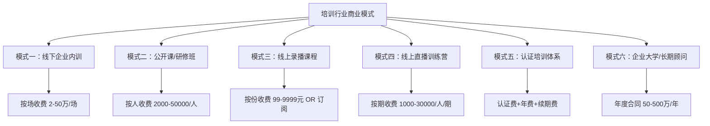
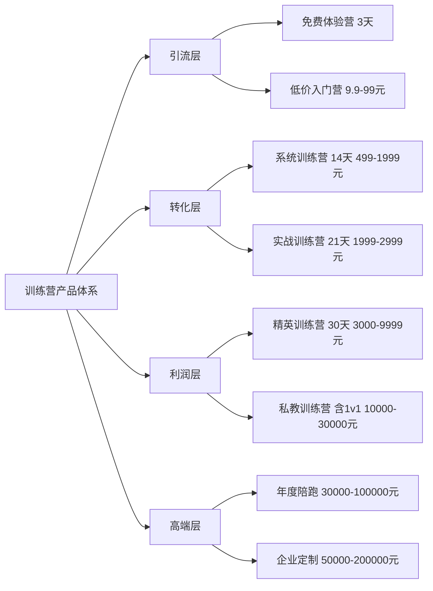
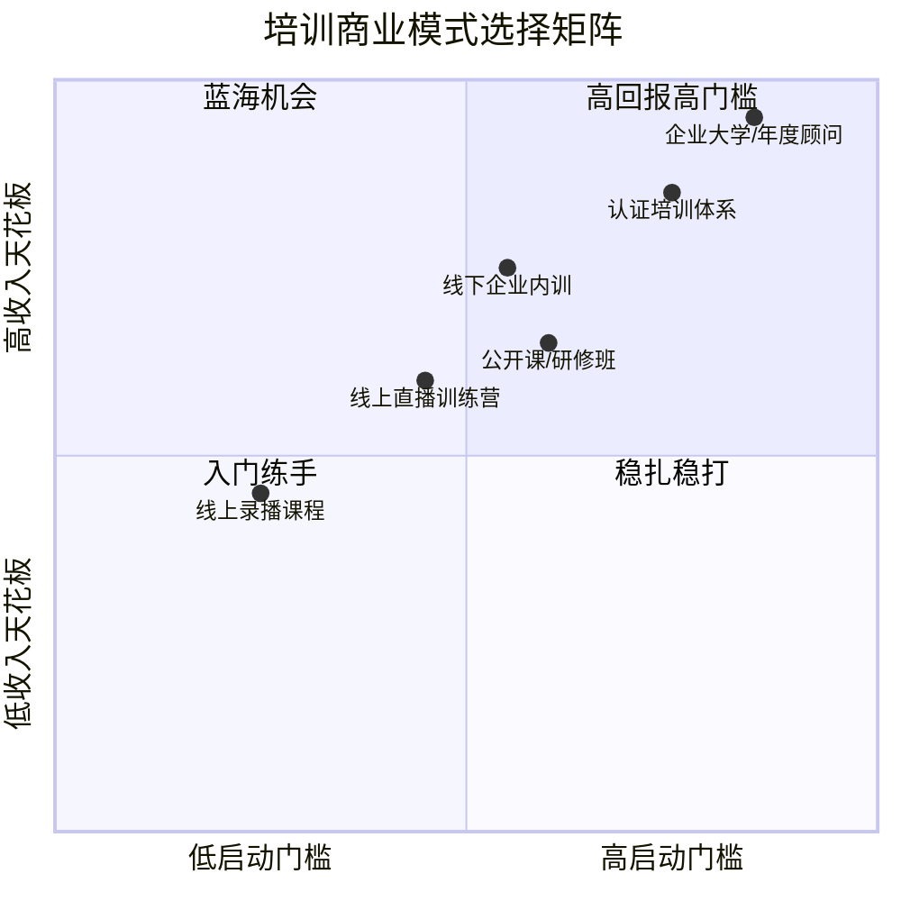
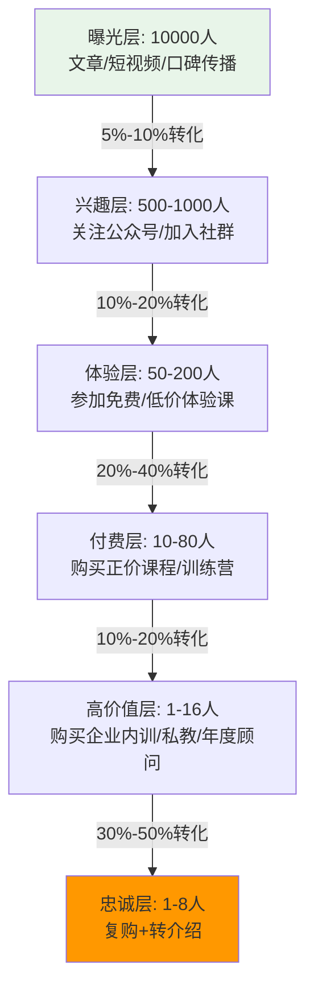
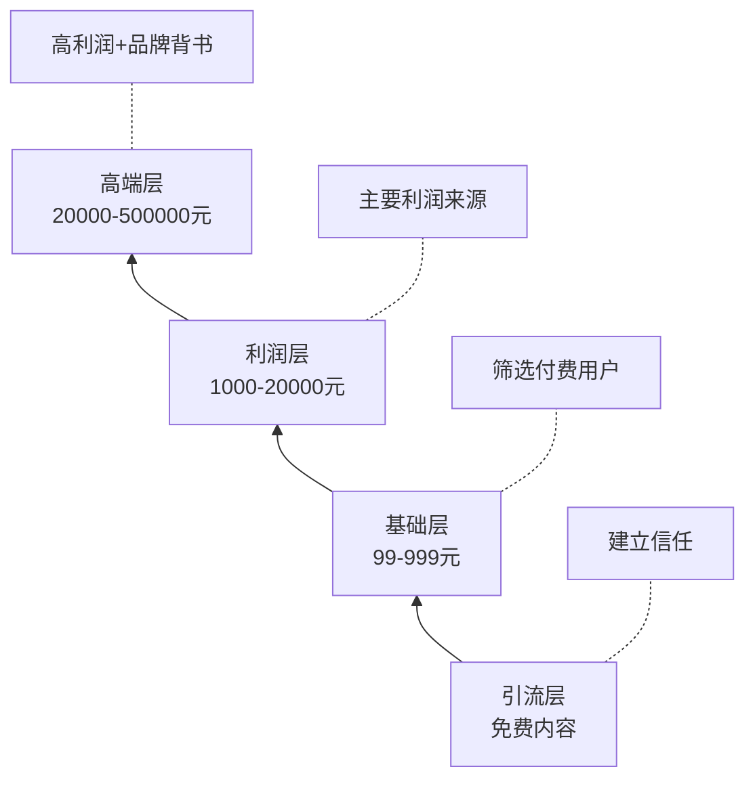

## 三、培训行业的商业模式

上一节我们拆解了咨询行业的三大收费模式——按时间、按项目、按成果。但培训行业虽然与咨询同属"知识变现"范畴，其商业模式却有本质区别：**咨询卖的是"诊断+方案"，培训卖的是"知识转移+能力提升"**。这一字之差，决定了两个行业在获客方式、交付形态、收入结构和规模化路径上的根本不同。

本节将系统拆解培训行业的六种核心商业模式，帮助你找到最适合自己资源禀赋的那条路。

---

### 1. 培训行业与咨询行业的本质区别

在深入商业模式之前，必须先厘清一个容易混淆的问题：培训和咨询到底有什么不同？

| 维度 | 咨询 | 培训 |
|------|------|------|
| **核心价值** | 诊断问题 + 提供解决方案 | 知识转移 + 能力建设 |
| **服务对象** | 通常是决策层（老板/高管） | 可以是任何层级（管理层/执行层/新人） |
| **交付物** | 报告、方案、建议 | 课程、工作坊、训练营 |
| **效果衡量** | 问题是否被解决 | 学员是否掌握了知识/技能 |
| **可规模化程度** | 较低（深度定制） | 较高（课程可复用） |
| **客户决策链** | 短（通常一个人拍板） | 长（培训部门→HR→业务部门→预算审批） |
| **复购逻辑** | 新问题出现时复购 | 同一课程可卖给不同客户，老客户复购新课程 |

理解这个区别至关重要——很多从咨询转培训或从培训转咨询的人失败，根源就在于用错了商业模式。咨询的杠杆在于"深度"，培训的杠杆在于"广度"。

---

### 2. 培训行业的六种核心商业模式

培训行业的商业模式可以归纳为以下六种，每种模式对应不同的资源要求、收入天花板和发展路径。



#### 模式一：线下企业内训（B2B高客单价）

**定义：** 受企业邀请，到企业现场为其员工提供定制化培训服务，按场次或按天收费。

**典型价格区间：**
- 初级培训师：5000-15000元/天
- 中级培训师：15000-30000元/天
- 高级培训师/行业大咖：30000-80000元/天
- 顶级专家（前500强高管/知名学者）：80000-200000元/天

**收入结构示例：**

| 收入项 | 占比 | 说明 |
|--------|------|------|
| 课酬 | 60%-70% | 核心收入来源 |
| 课件定制费 | 10%-20% | 根据企业需求定制内容 |
| 后续辅导/跟踪 | 5%-15% | 培训后的落地辅导 |
| 教材/工具包 | 5%-10% | 配套学习资料销售 |

**优势：**
- 客单价高，一场培训收入可达数万甚至数十万
- 客户黏性强，企业一旦认可能形成年框合作
- B端客户决策理性，不太受个人情绪影响
- 可以积累行业案例，反哺个人品牌建设

**劣势：**
- 获客依赖渠道（培训公司/HR圈子/转介绍），初期困难
- 需要频繁出差，体力消耗大
- 收入受淡旺季影响明显（年初、年底是旺季，暑假是淡季）
- 企业培训预算受经济周期影响大

**关键成功要素：**
- 课程内容必须与企业业务痛点紧密关联，不能"通用鸡汤"
- 需要强大的现场控场能力——企业内训学员是"被动参加"的，不像公开课学员那么积极
- 培训后必须有落地工具（checklist、模板、行动清单），否则企业会觉得"没效果"
- 建立培训公司合作关系是核心获客渠道——80%的企业内训订单来自培训公司转介

**适用人群：** 有5年以上行业经验的专业人士，有企业资源或培训公司渠道，能接受频繁出差。

---

#### 模式二：公开课/研修班（B2B+B2C混合）

**定义：** 培训师或培训机构自行组织的开放性课程，学员来自不同企业或个人，按人头收费。

**典型价格区间：**
- 半天公开课：800-2000元/人
- 1-2天公开课：2000-5000元/人
- 3-5天研修班：5000-15000元/人
- 高端总裁班/EMBA类：20000-100000元/人

**收入模型计算：**

```text
单场收入 = 人数 × 单价 - 场地成本 - 招生成本 - 运营成本

示例：
- 课程定价：4800元/人
- 参训人数：40人
- 场地费用：8000元/天 × 2天 = 16000元
- 招生渠道佣金：4800 × 30% × 40人 = 57600元（渠道合作模式）
- 运营成本（物料/茶歇/助教）：约 12000元
- 总收入：4800 × 40 = 192000元
- 总成本：16000 + 57600 + 12000 = 85600元
- 净利润：106400元（利润率约55%）
```

**优势：**
- 单次收入高，利润率可观
- 学员来自不同企业，网络效应明显
- 可以现场转化为高客单价产品（企业内训/咨询/私教）
- 建立同学社群，形成二次传播

**劣势：**
- 招生难度大，依赖品牌知名度和渠道合作
- 人数不足时亏损风险高（固定成本已投入）
- 场地、餐饮、物料等运营细节繁琐
- 公开课内容需要兼顾不同水平学员，深度受限

**关键成功要素：**
- 招生渠道建设是核心——至少需要3-5个稳定的合作渠道
- 课程设计要"有料+有趣+有用"，公开课学员的口碑传播是最重要的招生来源
- 现场必须设计"升级转化"环节，将学员导入更高价值的产品体系
- 控制好成本结构，单场低于30人不划算

**适用人群：** 有一定知名度的培训师，擅长现场授课和互动，有招生渠道资源。

---

#### 模式三：线上录播课程（规模化长尾）

**定义：** 将培训内容录制为视频课程，通过在线平台或自建渠道销售，学员按需购买、自主学习。

**典型价格区间与平台：**

| 平台类型 | 代表平台 | 典型价格 | 平台抽成 |
|----------|----------|----------|----------|
| 综合知识付费平台 | 得到、知乎、喜马拉雅 | 99-399元 | 30%-50% |
| 专业课程平台 | 网易云课堂、腾讯课堂 | 199-1999元 | 20%-40% |
| SaaS建课工具 | 小鹅通、知识星球 | 自主定价 | 平台费固定（年费3000-30000元） |
| 自建平台 | 自己的网站/小程序 | 自主定价 | 仅支付支付通道费（0.6%-1%） |

**收入模型分析：**

```text
线上录播课程的收入公式：
年收入 = 课程数 × 单价 × 销量 × 复购率

三种典型情况：

1. 低价走量模式（99元课程）
   - 需要月销1000+份才能年入120万
   - 依赖平台流量和持续推广
   - 适合有大量粉丝基础的IP

2. 中价中量模式（999元课程）
   - 月销100份即可年入120万
   - 需要精准获客和口碑传播
   - 适合垂直领域专家

3. 高价精品模式（4999元课程）
   - 月销20份即可年入120万
   - 需要强品牌背书和高质量内容
   - 适合行业大咖/知名企业高管
```

**优势：**
- 边际成本趋近于零——录制一次，无限销售
- 不受时间和地域限制，7×24小时自动交付
- 可以与其他模式组合形成产品矩阵
- 长尾效应明显，好课程可以持续卖数年

**劣势：**
- 完课率低是行业痛点——平均完课率仅10%-30%
- 低价课程竞争激烈，同质化严重
- 缺乏互动，学员学习效果难以保证
- 平台抽成高，自建平台需要技术投入

**关键成功要素：**
- 课程结构设计是核心——必须有清晰的学习路径和阶段目标
- 每节课控制在10-20分钟，降低学习门槛
- 配套作业、测验、社群，提高完课率和满意度
- 定期更新内容，保持课程新鲜度
- "免费引流课+付费进阶课"的漏斗模型是主流获客方式

**适用人群：** 擅长内容创作和知识体系化表达的专家，有一定粉丝基础或愿意长期投入内容建设。

---

#### 模式四：线上直播训练营（高转化+高互动）

**定义：** 通过直播或社群形式，在固定周期内（通常7-30天）进行集中式、高强度的在线培训，包含授课、作业、点评、答疑等环节。

**典型价格区间：**
- 入门训练营（7天）：9.9-199元（引流型）
- 进阶训练营（14-21天）：499-2999元
- 高端训练营（30天+）：3000-30000元
- 私教型训练营（含1对1辅导）：10000-50000元

**训练营产品结构：**



**优势：**
- 完课率远高于录播课（训练营完课率可达60%-90%）
- 互动性强，学员满意度高，口碑传播效果好
- 可以批量交付，规模效应明显
- 训练营是转化高客单价产品的最佳场景
- 可以沉淀学员案例和成果，反哺营销

**劣势：**
- 运营成本高——需要助教团队、社群运营、内容更新
- 对培训师的时间要求高——训练营期间需要频繁互动
- 学员质量参差不齐，需要投入精力管理
- 容易陷入"低价引流→转化困难"的循环

**关键成功要素：**
- 训练营设计必须有"可量化的学习成果"——学员在X天内必须能做出Y
- 助教团队的建设至关重要——1个主讲+3-5个助教是标配
- 社群氛围的营造决定完课率——打卡、PK、排行榜、优秀作业展示
- 结营时的"成果展示+升级转化"环节是盈利关键
- 复训机制（老学员免费复训新一期）可以大幅提升口碑

**适用人群：** 有社群运营能力的培训师，能组建助教团队，擅长设计学习体验。

---

#### 模式五：认证培训体系（高壁垒+持续收入）

**定义：** 培训师开发一套标准化的知识体系和考核标准，授权其他讲师授课或为企业提供认证培训服务，收取认证费、年费和续期费。

**典型价格结构：**

| 收入项 | 价格区间 | 说明 |
|--------|----------|------|
| 认证培训费（个人） | 3000-20000元/人 | 学员参加培训并通过考核获得认证 |
| 企业认证包 | 50000-200000元/套 | 为企业批量培养认证人员 |
| 讲师授权费 | 10000-50000元/人 | 授权其他讲师使用你的课程体系授课 |
| 年费/续期费 | 1000-5000元/年 | 认证有效期1-3年，到期需续期 |
| 教材/工具销售 | 500-2000元/套 | 配套教材、工具包、测评工具 |

**典型认证体系案例：**
- PMP（项目管理专业人士认证）：全球年收入数亿美元，认证费约4000元
- CFA（特许金融分析师）：三级考试，总费用约3-5万元
- 六西格玛认证（绿带/黑带）：企业内训+认证，单人5000-30000元
- 国内各类职业技能认证：心理咨询师、人力资源管理师等

**优势：**
- 建立行业标准，形成极强的竞争壁垒
- 收入具有持续性（年费、续期费）
- 可以通过授权讲师实现"杠杆式"规模化
- 品牌效应极强，认证本身就成为行业通行证

**劣势：**
- 前期投入巨大——需要数年时间建立体系、积累口碑
- 需要行业影响力和权威背书
- 认证体系的标准化和质量控制难度大
- 政策风险——国家可能调整职业资格认证政策

**关键成功要素：**
- 认证体系必须有"硬核"的考核标准，不能是交钱就过的"水证"
- 需要行业协会、企业、高校等多方背书
- 持续更新知识体系，保持认证的行业前沿性
- 建立"校友网络"，让认证持有者形成社群效应

**适用人群：** 在某一领域有深厚积累和行业影响力的专家，有长期投入的耐心和资源。

---

#### 模式六：企业大学/年度顾问（最高客单价）

**定义：** 为企业提供长期、系统的培训体系建设服务，包括课程开发、讲师培养、学习平台搭建、培训效果评估等，通常以年度合同形式合作。

**典型价格区间：**
- 小型企业年度培训顾问：10万-30万元/年
- 中型企业培训体系建设：30万-100万元/年
- 大型企业企业大学共建：100万-500万元/年
- 世界级企业大学（如华为大学模式）：1000万+元/年

**服务内容矩阵：**

| 服务模块 | 内容 | 交付物 |
|----------|------|--------|
| 培训需求诊断 | 组织能力盘点、岗位胜任力模型 | 需求诊断报告 |
| 课程体系设计 | 课程地图、学习路径、内容开发 | 课程体系蓝图+10-20门核心课程 |
| 讲师队伍培养 | 内训师选拔、培训、认证、督导 | 20-50名认证内训师 |
| 学习平台搭建 | LMS选型/定制、内容迁移 | 可运行的学习管理平台 |
| 效果评估体系 | 柯氏四级评估、ROI分析 | 评估体系+季度报告 |
| 年度复盘优化 | 培训数据分析、方案迭代 | 年度培训白皮书 |

**优势：**
- 客单价最高，单个合同可以覆盖全年收入
- 客户黏性极强，切换成本高
- 深度了解客户业务，可以自然延伸到咨询服务
- 案例积累丰富，品牌价值持续提升

**劣势：**
- 销售周期长（3-12个月），前期投入大
- 需要团队协作，个人难以独立完成
- 高度依赖少数大客户，风险集中
- 企业经营状况变化可能影响培训预算

**适用人群：** 有团队的培训机构或资深培训师，有大客户服务经验，具备培训体系设计能力。

---

### 3. 六种模式的对比分析与选择指南



**核心对比表：**

| 维度 | 线下企业内训 | 公开课 | 线上录播 | 线上训练营 | 认证体系 | 企业大学 |
|------|------------|--------|----------|-----------|----------|---------|
| **启动门槛** | 中 | 中高 | 低 | 中 | 高 | 很高 |
| **收入天花板** | 中高 | 中 | 中低 | 中 | 高 | 很高 |
| **规模化潜力** | 低 | 中 | 高 | 高 | 很高 | 中 |
| **时间自由度** | 低 | 中 | 高 | 中 | 中高 | 低 |
| **被动收入** | 无 | 无 | 高 | 低 | 中 | 低 |
| **品牌积累** | 中 | 高 | 中 | 高 | 很高 | 很高 |
| **适合阶段** | 0-3年 | 1-5年 | 0-2年 | 1-3年 | 5年+ | 10年+ |

**选择建议：**

**刚入行（0-1年）：** 从线上录播课程开始练手，同时尝试做小型训练营。这个阶段的核心目标是打磨内容、积累案例、验证市场需求。

**有一定基础（1-3年）：** 主攻线下企业内训 + 线上训练营双轮驱动。企业内训提供高客单价收入，训练营提供规模化收入和品牌传播。

**行业专家（3-5年）：** 在内训和训练营基础上，开始布局公开课和研修班，建立行业影响力。同时考虑开发认证体系的雏形。

**行业领袖（5年+）：** 构建认证培训体系，通过授权讲师实现杠杆式规模化。同步推进企业大学/年度顾问业务，锁定大客户。

---

### 4. 培训行业的关键经济学概念

理解以下几个经济学概念，是做好培训生意的前提。

#### 4.1 课酬单价与日单价

培训师的收入核心指标是"日单价"——即一天授课的报酬。

```text
日单价的决定因素：

1. 专业稀缺性（权重40%）
   - 通用管理类：5000-15000元/天（供给多，竞争激烈）
   - 垂直行业类：15000-30000元/天（供给有限）
   - 前沿技术类：20000-50000元/天（供给极少）

2. 品牌知名度（权重30%）
   - 无知名度：需要通过培训公司接单，被抽成30%-50%
   - 有知名度：企业直接找你，定价权在自己手中
   - 行业大咖：溢价能力极强，客户排队等档期

3. 课程定制化程度（权重20%）
   - 标准课：成本低但单价也低
   - 半定制：根据行业微调，单价中等
   - 深度定制：针对企业具体情况设计，单价最高

4. 服务附加值（权重10%）
   - 纯授课：基础单价
   - 授课+辅导：单价上浮20%-50%
   - 授课+辅导+落地跟踪：单价上浮50%-100%
```

#### 4.2 讲师利用率

```text
利用率 = 实际授课天数 / 全年可用天数

行业数据：
- 全职企业培训师：利用率约 40%-60%（受淡旺季影响）
- 独立培训师（有稳定渠道）：利用率约 30%-50%
- 兼职培训师：利用率约 10%-20%
- 头部培训师（供不应求）：利用率可达 70%-80%（但会主动控制在60%以下避免过劳）

利用率的隐含陷阱：
- 高利用率 ≠ 高收入。如果日单价太低，即使天天上课也赚不多
- 高利用率会导致内容疲劳——同一个课讲太多遍，质量必然下降
- 合理的利用率目标：50%-60%，剩余时间用于课程迭代、内容营销、客户开发
```

#### 4.3 课程复用率

```text
课程复用率 = 同一门课程的累计授课次数 / 课程开发投入时间

这是培训行业最核心的效率指标：
- 开发一门课程投入40小时
- 第1次授课：复用率 = 1/40 = 0.025（极低，投入远大于回报）
- 第10次授课：复用率 = 10/40 = 0.25（开始回本）
- 第30次授课：复用率 = 30/40 = 0.75（进入盈利期）
- 第100次授课：复用率 = 100/40 = 2.5（高利润阶段）

结论：培训行业的盈利公式 = 开发高价值课程 × 最大化复用次数
这就是为什么"标准化课程"比"完全定制化"更有利可图
```

#### 4.4 转化漏斗模型

培训业务的获客和转化遵循典型的漏斗模型：



**关键转化率指标：**

| 转化环节 | 行业平均 | 优秀水平 | 提升策略 |
|----------|----------|----------|----------|
| 曝光→兴趣 | 3%-5% | 8%-15% | 内容质量+精准投放 |
| 兴趣→体验 | 10%-15% | 25%-40% | 体验课设计+限时优惠 |
| 体验→付费 | 15%-25% | 35%-50% | 社群运营+案例见证+紧迫感 |
| 付费→高价值 | 5%-10% | 15%-25% | 1v1沟通+痛点匹配+信任建设 |
| 高价值→忠诚 | 20%-30% | 50%-70% | 超预期交付+持续跟进 |

---

### 5. 培训行业的收入结构与成长路径

#### 5.1 典型培训师的收入成长曲线

```text
阶段一：起步期（第1年）
├── 收入区间：5万-20万/年
├── 收入来源：培训公司派单（被抽成30%-50%）
├── 日单价：3000-8000元
├── 授课天数：30-60天/年
└── 核心任务：打磨课程、积累案例、建立口碑

阶段二：成长期（第2-3年）
├── 收入区间：20万-60万/年
├── 收入来源：培训公司派单 + 企业直签 + 线上课程
├── 日单价：8000-15000元
├── 授课天数：60-100天/年
└── 核心任务：建立直签渠道、开发线上产品、形成个人品牌

阶段三：成熟期（第4-6年）
├── 收入区间：60万-200万/年
├── 收入来源：企业直签为主 + 线上产品 + 训练营 + 少量咨询
├── 日单价：15000-30000元
├── 授课天数：80-120天/年
└── 核心任务：产品矩阵化、建立团队、行业影响力

阶段四：专家期（第7年+）
├── 收入区间：200万-1000万+/年
├── 收入来源：高端内训 + 企业大学 + 认证体系 + 版权收入
├── 日单价：30000-100000元
├── 授课天数：60-100天/年（主动控制）
└── 核心任务：行业标准制定、IP资产化、被动收入体系
```

#### 5.2 培训师的产品金字塔

一个成熟的培训师应该构建四层产品金字塔，从低到高分别是：

| 层级 | 产品类型 | 价格区间 | 目的 | 占收入比 |
|------|----------|----------|------|----------|
| 引流层 | 免费文章/短视频/直播/电子书 | 免费 | 建立信任、获取流量 | 0%（营销投入） |
| 基础层 | 录播课程/低价训练营/社群 | 99-999元 | 筛选付费用户、建立口碑 | 10%-20% |
| 利润层 | 系统训练营/公开课/认证培训 | 1000-20000元 | 主要利润来源 | 40%-50% |
| 高端层 | 企业内训/私教/年度顾问 | 20000-500000元 | 高利润+品牌背书 | 30%-40% |



---

### 6. 培训行业的常见商业模式陷阱

#### 陷阱一：过度依赖单一渠道

很多培训师80%以上的订单来自培训公司，这意味着你把定价权和客户关系都让渡给了渠道方。一旦渠道更换合作讲师，你的收入会断崖式下跌。

**应对策略：** 建立"433"获客结构——40%来自直签客户、30%来自培训公司、30%来自线上转化和转介绍。

#### 陷阱二：追求授课天数而非课程质量

"今年讲了200天课"听起来很厉害，但如果课程没有迭代更新，你在消耗自己的口碑。学员之间会交流——"这个老师的课去年和今年一模一样"。

**应对策略：** 每年至少花30%的时间用于课程迭代和内容创新，控制年授课天数在120天以内。

#### 陷阱三：只做B端不做C端

纯B端培训师的风险在于——企业培训预算受经济周期影响大，且客户决策链长、不可控。2020年疫情期间，大量纯B端培训师收入断崖式下跌。

**应对策略：** 至少30%的收入来自C端（个人学员、线上产品），形成B+C双轮驱动。

#### 陷阱四：低价竞争

"别人收2万一天，我收8000就能抢到单子"——这是最危险的策略。低价不仅压缩利润，还传递了"我的价值不如别人"的信号，吸引来的都是最不优质的客户。

**应对策略：** 差异化定位而非低价竞争。找到你的独特价值主张——是行业深度？是落地工具？是后续跟踪？用差异化支撑溢价。

#### 陷阱五：忽视知识产权保护

你的课程内容、案例、工具模板就是你的核心资产。不做知识产权保护，内容被抄袭后你毫无还手之力。

**应对策略：** 
- 课程内容申请版权登记
- 核心工具/方法论申请商标
- 与企业签订保密协议（NDA）
- 关键内容留一手——线上只讲70%，线下补完30%

---

### 7. 培训行业的未来趋势

#### 趋势一：AI+培训成为标配

AI正在重塑培训行业的每个环节：
- **内容生成：** AI辅助课程大纲设计、案例编写、试题生成
- **个性化学习：** 基于学员画像的自适应学习路径
- **效果评估：** AI分析学员行为数据，精准评估培训效果
- **虚拟助教：** AI助教7×24小时答疑，降低人力成本

**对培训师的影响：** 标准化知识传递将被AI替代，培训师的价值将更聚焦于"经验判断、案例洞察、情感连接、变革引导"这些AI无法胜任的领域。

#### 趋势二：培训效果可视化

企业越来越要求培训投入产出比的量化证明。"培训满意度95%"已经不够了，企业要看到"培训后销售转化率提升了多少"。

**对培训师的影响：** 需要掌握数据思维和效果评估方法（柯氏四级评估、ROI分析），能够用数据证明培训价值的培训师将获得显著竞争优势。

#### 趋势三：碎片化学习与体系化培训并存

短视频和直播让碎片化学习成为常态，但企业仍然需要体系化的培训来建设组织能力。未来的培训师需要同时具备两种能力——用碎片化内容引流获客，用体系化课程深度交付。

#### 趋势四：垂直细分领域的精品培训师崛起

大而全的"通用管理培训"正在被细分领域的精品培训师取代。"新能源汽车供应链管理培训师"比"通用管理培训师"更有市场。

---

### 8. 本节核心要点

1. 培训行业有六种核心商业模式：线下企业内训、公开课/研修班、线上录播课程、线上直播训练营、认证培训体系、企业大学/年度顾问
2. 六种模式的启动门槛、收入天花板和规模化潜力各不相同，需要根据自身阶段选择
3. 培训行业的核心经济学指标：日单价、利用率、课程复用率、转化漏斗
4. 成熟的培训师应构建四层产品金字塔：引流层→基础层→利润层→高端层
5. 避免五大陷阱：过度依赖单一渠道、追求天数而非质量、只做B端不做C端、低价竞争、忽视知识产权
6. 未来趋势：AI赋能、效果可视化、碎片化与体系化并存、垂直细分崛起

***

