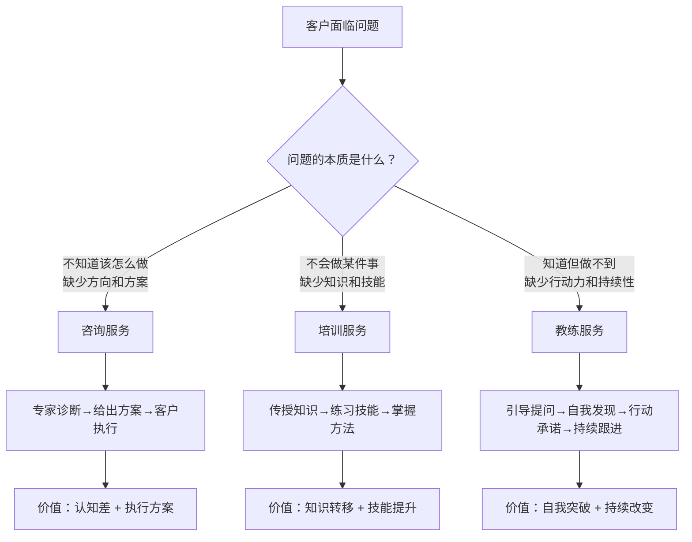
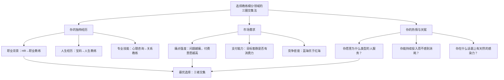
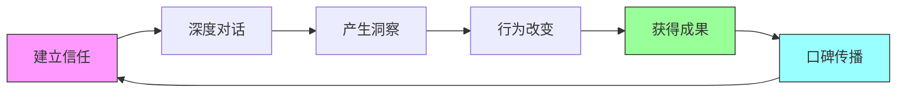
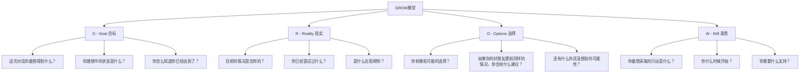
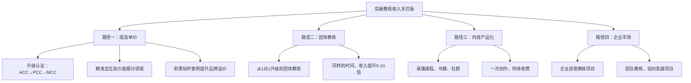
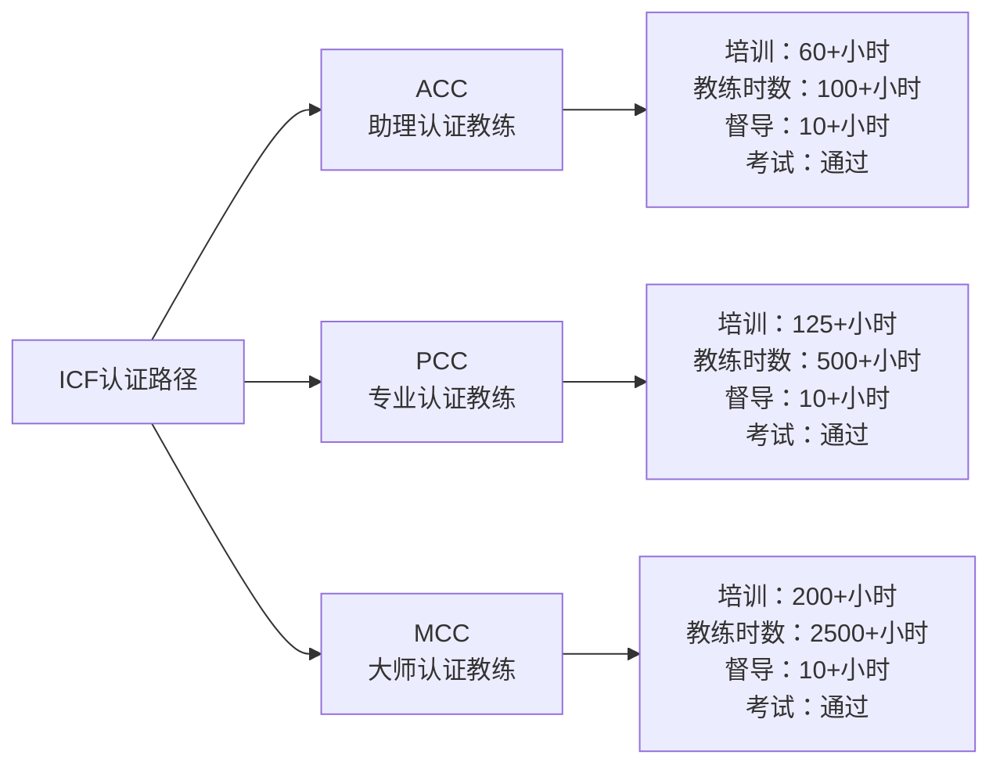
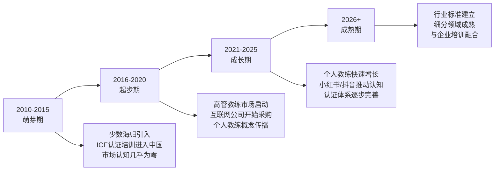

## 四、教练服务（Coaching）的特殊价值

### 1. 什么是教练服务：与咨询、培训的本质区别

在咨询与培训行业中，教练服务（Coaching）是一个经常被误解的概念。很多人把它等同于"咨询"或"培训"，但实际上，教练服务在底层逻辑上与前两者有根本性的差异。

#### 1.1 三种服务模式的核心差异

理解教练服务的特殊价值，首先要厘清它与咨询、培训之间的边界：

| 维度 | 咨询（Consulting） | 培训（Training） | 教练（Coaching） |
|------|-------------------|------------------|-----------------|
| 核心交付物 | 解决方案与建议 | 知识与技能 | 自我发现与行动承诺 |
| 信息流向 | 专家→客户（单向） | 讲师→学员（单向为主） | 教练↔客户（双向引导） |
| 服务对象的问题 | "我不知道该怎么做" | "我不会做这件事" | "我知道该怎么做，但做不了" |
| 客户角色 | 接受方案的决策者 | 接受知识的学习者 | 自己找到答案的主体 |
| 服务提供者的角色 | 领域专家，给出答案 | 知识传递者，教会方法 | 引导者，通过提问激发客户思考 |
| 价值来源 | 信息差+认知差 | 知识体系+教学能力 | 深度聆听+有力提问+结构化引导 |
| 典型交付方式 | 报告、方案、建议书 | 课程、工作坊、训练营 | 1对1对话、团体教练、教练项目 |
| 服务周期 | 项目制（几周到几个月） | 课程制（几小时到几天） | 对话制（持续数周到数月） |
| 客户参与度 | 低（提供信息，等待方案） | 中（听课、练习） | 高（全程深度参与） |
| 可规模化程度 | 低（依赖个人专家时间） | 高（录播/大班） | 中（1对1受限，团体可行） |



#### 1.2 教练服务的学术定义

国际教练联合会（ICF，International Coaching Federation）对教练的定义是：

> 教练是教练与客户之间的伙伴关系，通过一个发人深省和富有创造力的过程，激励客户最大化地发挥个人和职业潜力。

这个定义包含三个关键要素：

**要素一：伙伴关系（Partnership）**
教练不是"老师"或"顾问"，而是与客户平等对话的伙伴。教练不提供答案，而是通过专业的对话技术帮助客户自己找到答案。这与咨询的"专家-客户"关系有本质区别。

**要素二：发人深省的过程（Thought-provoking）**
教练的核心技术是"有力提问"（Powerful Questions）——不是普通的聊天，而是通过精心设计的问题，帮助客户看到自己看不到的盲点、突破思维定式、产生新的洞察。

**要素三：激励客户（Inspiring）**
教练的最终目标不是"告诉客户该怎么做"，而是"激发客户的内在动力"。真正的改变必须来自客户自身，外部强加的改变往往不可持续。

#### 1.3 教练服务的核心假设

教练服务建立在几个关键假设之上，理解这些假设有助于判断教练是否适合解决特定问题：

**假设一：客户本身是完整的、有资源的**
教练不认为客户"有问题需要修复"，而是认为客户拥有解决自己问题的全部资源，只是暂时没有看到或激活这些资源。这与心理咨询形成对比——心理咨询处理的是心理创伤和病理问题，教练处理的是正常人在成长过程中遇到的瓶颈和迷茫。

**假设二：答案在客户心中，不在教练脑中**
教练相信，客户自己找到的答案，比教练给出的答案更适合客户的具体情况，也更容易被客户执行。因为客户最了解自己的处境、资源和约束条件。

**假设三：觉察（Awareness）是改变的起点**
很多行为模式之所以反复出现，是因为客户处于"自动驾驶"状态——没有意识到自己的思维模式、情绪反应和行为习惯。教练通过提问和反馈，帮助客户提升自我觉察，而觉察本身就是改变的开始。

**假设四：客户为自己的改变负责**
教练不替客户做决定，不替客户执行计划。客户是自己人生的"驾驶员"，教练是"副驾驶"——提供视角、提问、提醒，但方向盘始终在客户手中。

### 2. 教练服务的分类与细分领域

教练服务不是一个笼统的概念，它有明确的细分领域，每个领域有不同的客户群体、服务内容和商业模式。

#### 2.1 按服务对象分类

| 教练类型 | 目标客户 | 核心服务内容 | 典型价格区间（中国市场） | 市场成熟度 |
|----------|----------|-------------|------------------------|-----------|
| 高管教练（Executive Coaching） | 企业C-level、VP、总监 | 领导力提升、战略思维、团队管理、职场政治导航 | 2000-10000元/小时 | 高 |
| 职业教练（Career Coaching） | 职场人士、求职者、转型者 | 职业规划、简历优化、面试辅导、职场瓶颈突破 | 500-2000元/小时 | 中高 |
| 人生教练（Life Coaching） | 任何需要人生方向感的人 | 人生目标梳理、自信重建、身份转换、关系改善 | 300-1000元/小时 | 中 |
| 创业教练（Business Coaching） | 创业者、中小企业主 | 商业模式梳理、融资辅导、团队建设、决策支持 | 1000-5000元/小时 | 中 |
| 健康教练（Health Coaching） | 关注健康生活方式的人 | 体重管理、运动习惯、饮食调整、压力管理 | 300-800元/小时 | 中低 |
| 关系教练（Relationship Coaching） | 情侣、夫妻、家庭成员 | 沟通技巧、冲突解决、亲密关系修复 | 500-1500元/小时 | 中 |
| 表现教练（Performance Coaching） | 运动员、艺术家、专业人士 | 目标设定、专注力训练、压力管理、巅峰表现 | 800-3000元/小时 | 中 |
| 团队教练（Team Coaching） | 企业团队 | 团队协作、冲突管理、目标对齐、文化建设 | 5000-30000元/次 | 中低 |

#### 2.2 按教练风格与方法论分类

**（1）成果导向型教练（Results-based Coaching）**
- 核心方法：GROW模型（Goal-Reality-Options-Will）
- 特点：结构化、目标明确、可衡量
- 适用场景：有明确目标但执行力不足的客户
- 代表流派：John Whitmore体系、GROW模型

**（2）存在主义教练（Ontological Coaching）**
- 核心方法：关注客户的"存在方式"——语言、情绪、身体
- 特点：深层转化、关注身份层面的改变
- 适用场景：客户感到"卡住"但说不清具体问题
- 代表流派：Newfield Network、Fernando Flores体系

**（3）系统性教练（Systemic Coaching）**
- 核心方法：将客户放入更大的系统（家庭、组织、文化）中看待
- 特点：关注系统动力、关系模式、代际影响
- 适用场景：涉及复杂人际关系和组织动力的问题
- 代表流派：Bert Hellinger家族系统排列、组织系统教练

**（4）正念教练（Mindfulness-based Coaching）**
- 核心方法：结合正念冥想和教练对话
- 特点：关注当下觉察、情绪调节、内在平静
- 适用场景：高压人群、焦虑/倦怠问题
- 代表流派：正念减压（MBSR）+ 教练整合

**（5）叙事教练（Narrative Coaching）**
- 核心方法：通过重新讲述和重新建构生命故事来促进改变
- 特点：关注语言和叙事的力量
- 适用场景：身份认同、人生意义探索
- 代表流派：David Drake叙事教练体系

#### 2.3 教练细分领域的选择策略

选择细分领域是教练创业的第一步，也是最关键的一步。选择标准不是"哪个最热门"，而是"你的独特经历能支撑哪个方向"：



**选择细分领域的四个实操步骤：**

第一步：列出你的"人生高光经历清单"
- 你在哪些事情上取得过显著成果？
- 你在哪些领域被人反复请教？
- 你经历过哪些重大转折并成功跨越？

第二步：验证市场需求
- 在小红书、知乎搜索相关话题的讨论量和互动量
- 在在行、得到等平台搜索同类教练的数量和定价
- 与5-10个目标客户做深度访谈，了解他们的付费意愿

第三步：评估竞争格局
- 头部玩家有多少？定价如何？
- 你的差异化优势是什么？
- 是否有"蓝海"细分市场未被满足？

第四步：用"最小可行定位"测试
- 先用一个具体的小定位做3-5个免费教练对话
- 观察客户的反馈和转化意愿
- 根据反馈迭代定位

### 3. 教练服务的价值创造机制

教练服务为什么能收取高价？它的价值从何而来？理解教练服务的价值创造机制，是做好教练业务的前提。

#### 3.1 教练服务的三层价值模型

```mermaid
graph TD
    A[教练服务的价值] --> B[第一层：对话价值]
    A --> C[第二层：改变价值]
    A --> D[第三层：系统价值]
    
    B --> B1[深度聆听<br>客户第一次被真正听见]
    B --> B2[有力提问<br>看到自己看不到的盲点]
    B --> B3[结构化对话<br>从混乱到清晰]
    
    C --> C1[行为改变<br>打破自动驾驶模式]
    C --> C2[认知升级<br>新的思维框架和视角]
    C --> C3[情绪转化<br>从焦虑到平静，从迷茫到清晰]
    
    D --> D1[人生方向调整<br>重大决策的突破]
    D --> D2[关系模式改变<br>职场/家庭/亲密关系的改善]
    D --> D3[自我认同升级<br>从"我不行"到"我可以"]
```

**第一层：对话价值——被真正听见**

在日常生活中，大多数人从未被真正"听见"过。朋友聊天有评判，家人沟通有立场，同事交流有利益。教练对话是客户唯一一个可以完全放下防备、不被评判、不被催促、不被建议的场域。

这种"被听见"的体验本身就具有巨大的疗愈力量。很多客户在第一次教练对话中就会流泪——不是因为悲伤，而是因为终于有一个地方可以安全地表达自己的真实感受。

**第二层：改变价值——打破自动驾驶模式**

人的行为模式在25岁之后基本固化。大多数人每天都在"自动驾驶"——用相同的思维模式处理不同的问题，得到相同的结果。教练通过提问和反馈，帮助客户跳出自动驾驶模式，看到自己的思维盲区和行为习惯。

一个经典的教练场景：
- 客户说："我总是遇到控制欲很强的领导"
- 教练不给建议，而是问："你注意到你在描述这些领导时，都用了哪些词？"
- 客户回顾后发现，每次都在说"他们不信任我"
- 教练继续问："如果'不信任'是一个信号，它可能在告诉你什么？"
- 客户逐渐意识到，自己在无意识中表现出"需要被控制"的行为模式

这个觉察的瞬间，就是教练服务最核心的价值——客户自己发现了真相，而这个真相如果由教练直接说出来，客户很可能会防御和抵触。

**第三层：系统价值——人生方向的调整**

对于人生教练和高管教练来说，一次深度教练对话可能帮助客户做出影响数年甚至一生的决策：是否辞职创业、是否结束一段关系、是否接受一个新机会、如何面对人生的重大转折。

这类决策的价值无法用"每小时多少钱"来衡量。一个年薪50万的高管，通过教练对话找到了正确的战略方向，避免了一次可能导致数百万损失的决策失误——教练服务的价值在这种场景下是巨大的。

#### 3.2 教练服务的"信任-深度-效果"循环

教练服务的商业模式本质上是一个信任驱动的循环：



信任是入口，深度是过程，效果是出口，口碑是飞轮。这个循环的每一步都不可跳过：

- 没有信任，客户不会打开自己，对话无法深入
- 没有深度，客户不会产生真正的洞察
- 没有洞察，就不会有行为改变
- 没有改变，就不会有口碑
- 没有口碑，就无法获得新客户的信任

**这个循环解释了教练服务的两个关键商业特征：**

1. **教练服务不能"快消"**：它不像电商那样可以"一锤子买卖"，必须通过深度服务建立口碑
2. **教练服务的获客成本极高**：新客户的第一个决策门槛是"我为什么要相信你"，解决这个信任问题需要时间和案例积累

#### 3.3 教练服务定价的经济学逻辑

教练服务的定价不基于成本，而基于价值。这与培训（通常按课时计费）和咨询（通常按项目计费）有显著区别。

**教练定价的三个决定因素：**

**因素一：客户问题的紧迫性和价值**
一个帮助创业者避免100万损失的创业教练，定价自然高于帮助大学生做职业规划的教练。定价的上限是客户获得价值的一定比例（通常为10%-30%）。

**因素二：教练的资质与背书**
ICF认证等级（ACC→PCC→MCC）、教练时数、客户案例、行业影响力，这些都是定价的支撑因素。在中国市场：

| 认证等级 | 教练时数要求 | 典型定价区间（1对1） | 市场认可度 |
|----------|-------------|---------------------|-----------|
| ACC（助理教练） | 100+小时 | 300-800元/小时 | 入门级，需要案例背书 |
| PCC（专业教练） | 500+小时 | 800-3000元/小时 | 主流市场认可 |
| MCC（大师教练） | 2500+小时 | 3000-10000元/小时 | 高端市场，稀缺资源 |

**因素三：市场竞争与定位**
在同一个细分领域，定位不同（人生教练 vs 高管教练），价格可以差10倍。定位越精准、越高端，定价空间越大。

### 4. 教练服务的核心方法论框架

教练服务不是"随便聊天"，它有严谨的方法论框架。掌握这些框架是成为专业教练的基础。

#### 4.1 GROW模型：教练对话的基础框架

GROW模型由John Whitmore在《Coaching for Performance》一书中提出，是全球使用最广泛的教练对话框架。



**GROW模型的使用要点：**

**Goal（目标）阶段的关键原则：**
- 目标必须是客户自己的目标，不是教练认为"应该"的目标
- 目标必须具体、可衡量、有时限
- 需要区分"表现目标"（如"拿到offer"）和"成长目标"（如"提升面试自信"）
- 常见陷阱：客户说的目标其实是手段，真正的目标需要进一步探索

**Reality（现实）阶段的关键原则：**
- 不带评判地了解现状
- 关注事实，而非客户的"故事"和"解释"
- 探索客户已经尝试过什么，避免重复建议
- 关注客户的情绪和身体感受，不仅仅是"事情"

**Options（选择）阶段的关键原则：**
- 先发散，不急于评判和筛选
- 用"如果你知道答案，会是什么？"这样的假设性问题激发创意
- 避免教练把自己的选项塞给客户
- 通常客户会想到教练想不到的、更适合自己的选择

**Will（意愿）阶段的关键原则：**
- 行动承诺必须具体到"做什么、什么时候做、在哪里做"
- 识别可能的障碍，提前制定应对方案
- 评分1-10分的行动意愿，低于7分需要重新审视
- 建立问责机制：下次对话时首先回顾行动完成情况

#### 4.2 教练核心能力模型（ICF八项核心能力）

ICF（国际教练联合会）定义了专业教练必须掌握的八项核心能力，这些能力是教练服务的"操作系统"：

**第一组：建立基础（Foundation）**

| 能力 | 定义 | 关键行为 | 常见错误 |
|------|------|----------|----------|
| 展示道德规范 | 遵守ICF道德准则，维护教练职业的诚信 | 保密、明确边界、不越界给建议 | 把客户的秘密告诉别人 |
| 体现教练心态 | 保持开放、好奇、灵活、以客户为中心 | 不带预设、不评判、对客户充满信任 | 自以为比客户更懂客户的问题 |

**第二组：共同建立（Co-engaging）**

| 能力 | 定义 | 关键行为 | 常见错误 |
|------|------|----------|----------|
| 建立和维护协议 | 与客户建立清晰的合作关系和对话协议 | 明确对话目标、时间、角色边界 | 没有明确协议就开始对话 |
| 建立信任和安全感 | 创造一个客户可以放心表达的场域 | 深度聆听、不打断、不评判、情感回应 | 急于提问而忽视客户的情绪 |

**第三组：沟通（Communicating）**

| 能力 | 定义 | 关键行为 | 常见错误 |
|------|------|----------|----------|
| 保持在场 | 全身心关注客户，不被自己的思绪分散 | 100%专注、观察语言和非语言信号 | 心里在想"接下来问什么" |
| 积极聆听 | 听到客户说的、没说的、以及话背后的含义 | 回应关键词、探索隐含信息、觉察矛盾 | 只听表面意思 |
| 唤起觉察 | 通过提问和反馈帮助客户产生新的洞察 | 有力提问、直接反馈、使用隐喻 | 给建议而非提问 |

**第四组：培养学习和成长（Cultivating）**

| 能力 | 定义 | 关键行为 | 常见错误 |
|------|------|----------|----------|
| 促进客户成长 | 帮助客户将觉察转化为行动，并在过程中持续学习 | 行动承诺、障碍预判、庆祝进步 | 只有洞察没有行动 |

#### 4.3 有力提问（Powerful Questions）的艺术

有力提问是教练服务最核心的技术。一个好的教练问题，能瞬间改变客户的视角。

**有力提问的五个特征：**

1. **开放式**：不能用"是/否"回答。"你对此感觉如何？"优于"你是不是觉得不舒服？"
2. **面向未来**：聚焦"什么可能"而非"为什么过去"。"你想要什么？"优于"你为什么会这样？"
3. **简洁**：一次只问一个问题。复杂的问题让客户混乱
4. **触及本质**：触及客户的假设、信念和价值观
5. **有挑战性**：让客户感到轻微不适，但不至于防御

**12个经典教练问题（按场景分类）：**

```text
【探索目标类】
1. "如果这个对话结束后你得到了完美的答案，那会是什么？"
2. "你真正想要的是什么？（不是你认为'应该'想要的）"
3. "你怎么知道自己已经到达了那里？"

【探索现状类】
4. "目前最困扰你的是什么？"
5. "你在这件事上花了多少时间和精力？得到了什么结果？"
6. "你注意到自己在描述这件事时有什么反复出现的模式吗？"

【拓展选择类】
7. "如果你没有任何限制——时间、金钱、能力都不是问题——你会做什么？"
8. "如果你的偶像/导师遇到同样的情况，他们会怎么做？"
9. "还有什么你还没考虑过的可能性？"

【促进行动类】
10. "你接下来要做的第一步是什么？什么时候开始？"
11. "什么可能阻碍你？你打算怎么应对？"
12. "你对这个行动的承诺程度，1到10分是多少？如果不到10分，差在哪里？"
```

**"为什么"问题的陷阱：**

教练对话中应尽量避免"为什么"开头的问题，如"你为什么会这样想？"。原因：

- "为什么"引导客户为过去辩护，而非面向未来探索
- "为什么"暗示客户的行为有问题，容易触发防御
- 替代方案：用"什么"和"如何"代替——"是什么让你做出了这个选择？""你注意到自己在什么情况下会有这种反应？"

### 5. 教练服务的商业模式与收入结构

#### 5.1 教练服务的三种主流商业模式

**模式一：1对1教练（Individual Coaching）**

| 维度 | 详情 |
|------|------|
| 服务形式 | 教练与客户1对1对话，通常通过视频会议或面对面 |
| 单次时长 | 45-90分钟（主流60分钟） |
| 服务周期 | 通常6-12次为一个教练项目，持续3-6个月 |
| 定价方式 | 按次收费或按项目打包收费 |
| 典型定价 | 300-5000元/次（中国市场），顶级教练可达10000+元/次 |
| 优势 | 深度个性化、客户体验好、转化率高 |
| 劣势 | 时间天花板明显（每月最多服务15-20个客户） |
| 适合阶段 | 起步期和成长期，建立口碑和案例 |

**模式二：团体教练（Group Coaching）**

| 维度 | 详情 |
|------|------|
| 服务形式 | 1个教练同时服务4-12个客户 |
| 单次时长 | 90-120分钟 |
| 服务周期 | 通常6-12周为一期 |
| 定价方式 | 按人头收费 |
| 典型定价 | 500-3000元/人/期 |
| 优势 | 时间杠杆高（同样的时间，收入提升5-10倍）；参与者之间互相支持；社群效应 |
| 劣势 | 个性化程度降低；需要更强的场控能力；客户筛选更严格 |
| 适合阶段 | 成熟期，有稳定的方法论和口碑后 |

**模式三：教练式课程/工作坊（Coaching-infused Programs）**

| 维度 | 详情 |
|------|------|
| 服务形式 | 将教练元素融入培训课程或工作坊 |
| 单次时长 | 半天到两天 |
| 服务周期 | 一次性或系列制 |
| 定价方式 | 按场次或按人头 |
| 典型定价 | 企业端：5000-50000元/场；个人端：200-2000元/人 |
| 优势 | 客单价高（企业市场）；可规模化；与培训形成互补 |
| 劣势 | 需要培训设计能力；教练深度受限于时间 |
| 适合阶段 | 所有阶段，特别是有企业客户资源的教练 |

#### 5.2 教练服务的收入天花板与突破策略

1对1教练的收入天花板计算：

```text
月收入上限 = 每日最大教练时长 × 每月工作天数 × 每小时定价

示例（中等水平教练）：
= 4小时/天 × 22天/月 × 500元/小时
= 44,000元/月 = 528,000元/年

示例（高端教练）：
= 3小时/天 × 22天/月 × 2000元/小时
= 132,000元/月 = 1,584,000元/年
```

**突破天花板的四条路径：**



### 6. 教练服务的认证体系与专业门槛

#### 6.1 全球三大教练认证体系

| 认证机构 | 全称 | 总部 | 认证等级 | 中国市场认可度 | 认证费用（大致） |
|----------|------|------|----------|---------------|----------------|
| ICF | International Coaching Federation | 美国 | ACC→PCC→MCC | 最高，行业通用标准 | 2-10万元（含培训） |
| EMCC | European Mentoring & Coaching Council | 欧洲 | Foundation→Practitioner→Master→Senior | 欧洲市场主流，中国逐步认可 | 1-5万元 |
| CCE | Center for Credentialing & Education | 美国 | BCC（Board Certified Coach） | 北美市场认可 | 1-3万元 |

**ICF认证路径详解：**



**是否必须获得认证？**

这个问题的答案取决于你的目标市场：

- **企业客户和高端个人客户**：几乎必须有ICF认证（至少ACC），这是信任的入场券
- **个人教练副业**：认证不是必须的，但有认证会显著提升转化率
- **内容IP型教练**：粉丝更看重你的内容质量和人格魅力，认证是加分项而非必须项

**务实建议**：如果你刚开始做教练，可以先积累50-100小时免费教练经验，确认自己适合这个方向后，再投入2-3万元考取ICF ACC认证。这个顺序可以避免"先花大钱考证，结果发现自己不适合"的风险。

#### 6.2 教练服务的法律与伦理边界

教练服务有几个必须遵守的法律和伦理边界，越界可能导致严重后果：

**边界一：教练 vs 心理咨询**
- 教练不能处理心理疾病（抑郁症、焦虑症、PTSD等）
- 教练不能做心理诊断
- 如果客户在对话中表现出心理健康问题，教练必须转介给专业心理咨询师
- 实操建议：在服务协议中明确注明"本服务不替代心理咨询和医疗建议"

**边界二：教练 vs 医疗建议**
- 健康教练不能提供医疗诊断或治疗建议
- 不能推荐具体的药物或治疗方案
- 可以引导客户建立健康的生活习惯，但涉及医疗问题必须建议客户咨询医生

**边界三：教练 vs 法律/财务建议**
- 教练不能提供法律意见或财务投资建议
- 可以帮助客户梳理决策思路，但具体法律和财务问题需要转介专业人士

**边界四：保密义务**
- 客户在教练对话中分享的所有信息必须严格保密
- 例外情况：客户有自伤或伤人风险时，有义务通知相关方
- 匿名化后的案例分享需要事先获得客户同意

### 7. 教练服务 vs 相关职业的对比

很多人在选择职业方向时，会在教练、心理咨询、培训师、导师（Mentor）之间纠结。以下是一个全面的对比：

| 维度 | 教练（Coach） | 心理咨询师 | 培训师 | 导师（Mentor） |
|------|-------------|-----------|--------|---------------|
| 关注焦点 | 未来行动 | 过去创伤与当下问题 | 知识和技能传授 | 经验分享和指引 |
| 关系模式 | 平等伙伴 | 专家-来访者 | 讲师-学员 | 前辈-后辈 |
| 核心技术 | 提问与引导 | 诊断与治疗 | 教学与训练 | 经验分享与建议 |
| 准入门槛 | 无强制（但有行业认证） | 需要心理学学位和执照 | 无强制 | 无 |
| 服务周期 | 数周到数月 | 数月到数年 | 数小时到数天 | 长期非正式关系 |
| 收费模式 | 按次/按项目 | 按次 | 按场次/按人头 | 通常免费或低费 |
| 典型价格 | 300-5000元/小时 | 300-1500元/小时 | 5000-50000元/场 | 免费或象征性收费 |
| 可规模化程度 | 中 | 低 | 高 | 低 |
| 适合人群 | 擅长提问和聆听、对人的成长有热情 | 对心理学有专业训练 | 有专业知识和表达能力 | 有丰富行业经验愿意分享 |

### 8. 教练服务市场的现状与趋势

#### 8.1 中国教练市场的发展阶段

中国教练市场正处于从"萌芽期"向"成长期"过渡的阶段：



#### 8.2 五大趋势

**趋势一：从"高管专属"到"大众化"**
教练服务最初是企业高管的"特权"，现在正在向普通职场人渗透。小红书上"人生教练"话题的浏览量超过10亿次，个人教练的搜索量每年增长50%以上。

**趋势二：从"线下为主"到"线上优先"**
疫情加速了线上教练的普及。目前70%以上的个人教练对话通过视频会议完成，这大幅降低了教练和客户的地理限制，也为教练提供了更大的服务半径。

**趋势三：从"纯对话"到"教练+科技"**
AI教练工具、教练对话记录分析、客户进展追踪App等科技工具正在改变教练的工作方式。善用科技的教练可以提高效率、扩大服务半径。

**趋势四：从"通用教练"到"细分专家"**
市场对"什么都做"的通用教练需求在下降，对"在某个特定领域有深度积累"的细分专家教练需求在上升。"我是人生教练"不如"我是帮助30+职场女性重返职场的职业教练"有说服力。

**趋势五：从"个人品牌"到"教练组织"**
越来越多的教练开始组建团队、建立教练公司、发展教练网络。从个人从业者到组织化运营，是教练商业化的必然趋势。

### 9. 教练服务的常见认知误区

**误区一："教练就是聊天，谁都能做"**
真相：教练对话与普通聊天有本质区别。普通聊天是随意的、无结构的、双向分享的；教练对话是有目的的、有结构的、以客户为中心的、使用专业技术的。没有经过训练的人做"教练"，很可能变成"给建议"或"讲道理"。

**误区二："教练必须是某个领域的专家"**
真相：教练的核心能力不是领域知识，而是对话技术。一个优秀的高管教练不需要懂技术、懂营销、懂财务——他需要懂的是如何通过提问帮助高管自己看清问题、找到答案。领域知识是咨询师的核心，不是教练的核心。

**误区三："教练效果无法衡量"**
真相：教练效果可以通过多种方式衡量——客户自我评估（满意度、目标达成率）、行为指标（行动计划完成率）、客观数据（收入变化、职位晋升、关系改善）。ICF的教练效果评估框架提供了系统化的衡量方法。

**误区四："做教练就不用学商业了"**
真相：教练技术和商业能力是两个独立的维度。很多教练技术很好但不会获客、不会定价、不会做品牌，导致无法持续经营。教练服务的商业化需要定位、获客、定价、交付、品牌、运营等全方位的商业能力。

**误区五："教练不能给建议，所以价值有限"**
真相：教练不给建议恰恰是它的价值所在。研究表明，外部强加的建议执行率不到20%，而客户自己找到的答案执行率超过70%。教练的价值不在于"告诉你答案"，而在于"帮你找到属于你自己的答案"——这个答案更贴合你的实际，你也更愿意去执行。

### 10. 本节核心要点

1. **教练服务与咨询、培训的本质区别**：咨询卖方案，培训卖知识，教练卖的是"帮助客户自我发现的过程"
2. **教练服务的价值创造机制**：通过深度聆听、有力提问、结构化引导，帮助客户提升自我觉察、打破行为模式、实现持久改变
3. **教练服务的核心方法论**：GROW模型是最基础的对话框架，ICF八项核心能力是专业教练的能力标准
4. **教练服务的商业模式**：1对1教练、团体教练、教练式课程三种模式各有优劣，需要根据自身阶段选择
5. **教练服务的认证路径**：ICF认证是行业通用标准，但认证不是必须的——先积累经验，再投入认证
6. **教练服务的市场趋势**：从高管专属走向大众化、从线下走向线上、从通用走向细分——这为新入行者提供了巨大的机会窗口
