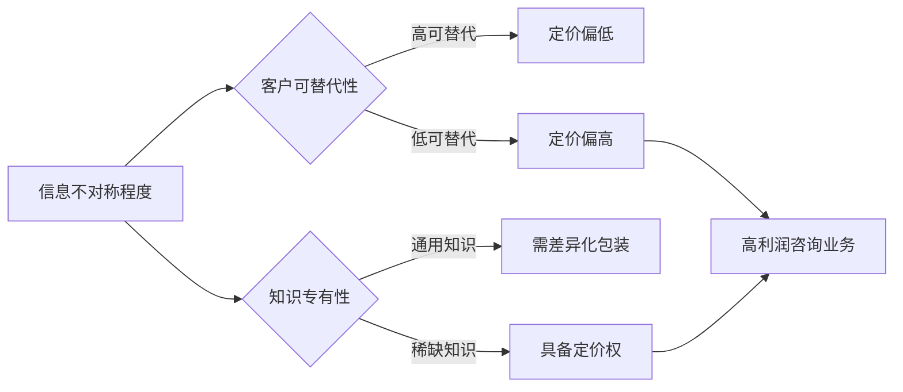
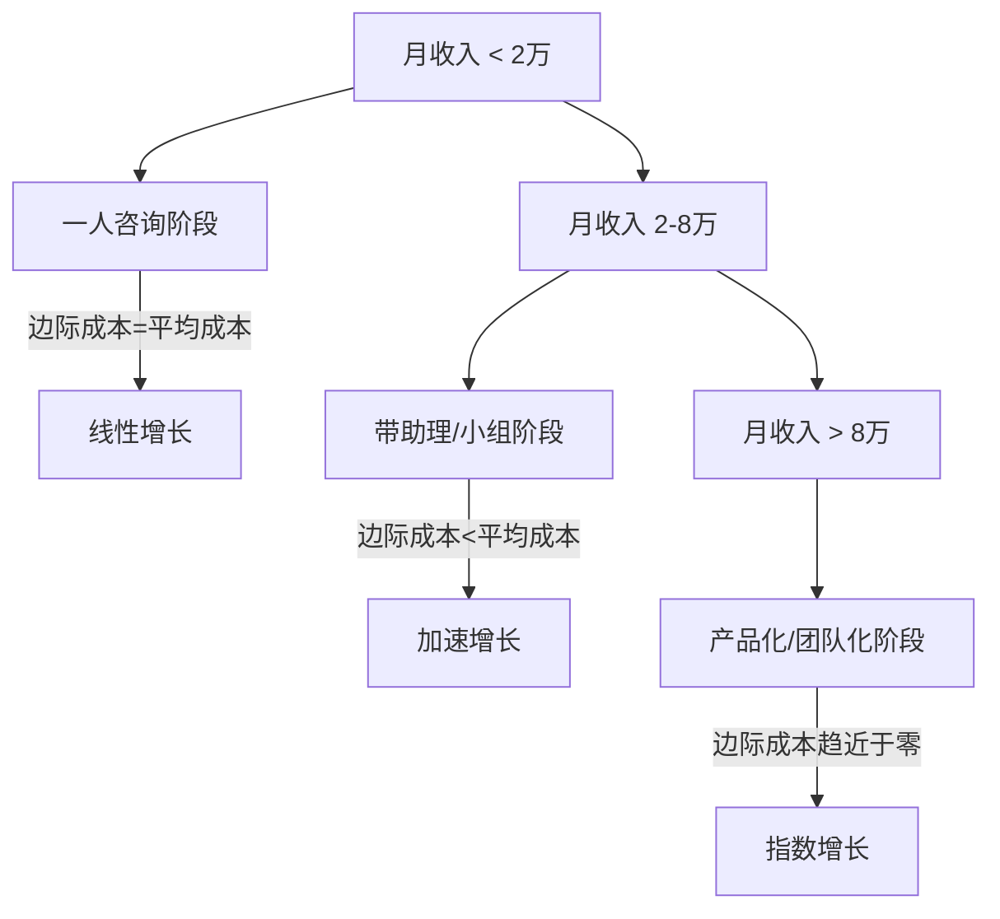
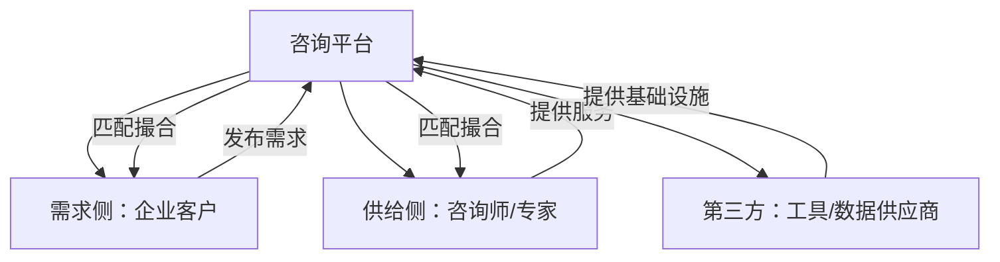
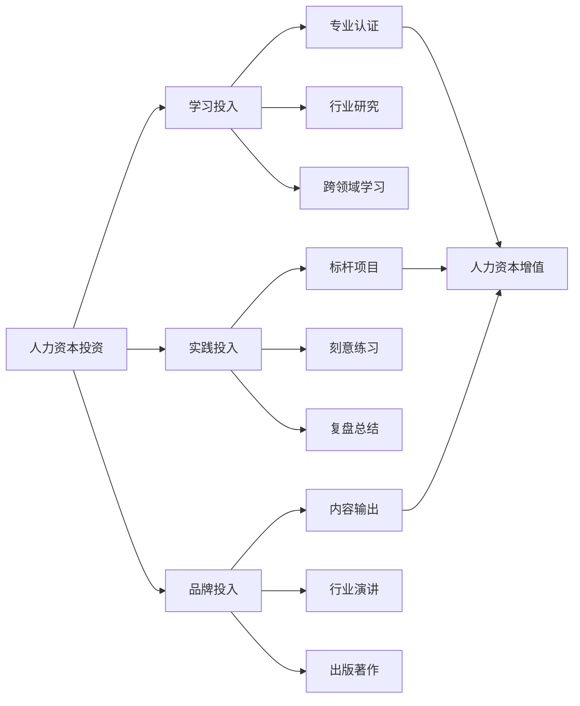

## 五、咨询行业的关键经济学概念

理解咨询行业的经济学逻辑，是建立可持续咨询业务的基石。很多咨询师技术能力强、专业素养高，但始终无法突破收入瓶颈，根本原因往往在于缺乏对行业底层经济规律的认知。本节将系统梳理咨询行业中最核心的经济学概念，帮助你从"手艺人思维"升级为"经营者思维"。

### 1. 信息不对称（Information Asymmetry）

#### 1.1 概念定义

信息不对称是咨询行业存在的根本经济学原因。这一概念由经济学家乔治·阿克洛夫（George Akerlof）、迈克尔·斯彭斯（Michael Spence）和约瑟夫·斯蒂格利茨（Joseph Stiglitz）提出，三人因此获得2001年诺贝尔经济学奖。

**核心含义**：在市场交易中，买卖双方拥有的信息量不对等。在咨询场景中，咨询师掌握客户所不具备的专业知识、行业经验或方法论，客户则掌握自身业务的内部信息。这种双向的信息不对称构成了咨询交易的基础。

#### 1.2 在咨询行业中的具体体现

**正向信息不对称（咨询师优势）：**
- **专业知识壁垒**：咨询师经过数年甚至数十年的行业积累，掌握了客户团队不具备的专业方法论。例如，一位薪酬体系咨询师可能研究过上百种岗位评估模型，而企业HR可能只接触过其中两三种。
- **行业横向视野**：咨询师服务多家客户，能将A行业的成功经验迁移到B行业。这种跨企业的模式识别能力是企业内部人员难以具备的。
- **趋势预判能力**：长期关注行业动态的咨询师，能比企业经营者更早识别政策变化、技术革新或市场趋势带来的影响。

**反向信息不对称（客户优势）：**
- **内部运营细节**：只有客户自己知道企业真正的财务状况、团队矛盾、老板的真实意图。
- **隐性需求**：客户表面上可能说"我们需要一套绩效考核体系"，实际需求可能是"老板想借此淘汰一批人"。
- **历史背景**：企业过去尝试过哪些方案、为什么失败，这些信息客户未必主动告知。

#### 1.3 经济学意义

信息不对称导致了咨询市场的两个核心问题：

**逆向选择（Adverse Selection）**：客户在购买咨询服务前，很难准确判断咨询师的真实水平。这导致"柠檬市场"效应——劣质咨询师可能通过低价和夸大宣传抢占市场，而优质咨询师因为不愿参与价格战而被挤出。解决逆向选择的关键机制包括：
- 建立可验证的案例库和客户证言
- 通过内容营销（文章、课程、演讲）展示专业深度
- 获取行业认证和权威背书
- 提供诊断性服务让客户先体验价值

**道德风险（Moral Hazard）**：签约后，客户难以监控咨询师的工作投入程度。同样，咨询师也面临客户的道德风险——客户可能采纳了咨询方案后拒绝支付尾款，或将咨询师的建议转给内部团队执行而终止合作。应对策略包括：
- 分阶段交付和付款（如30%预付+40%中期+30%验收）
- 过程透明化（每周进度报告、阶段汇报会）
- 合同中明确知识产权归属和竞业限制条款

#### 1.4 实操应用：利用信息不对称定价



**实际操作**：评估你所在领域的信息不对称程度。如果某个知识领域客户完全不了解、且市场上极少有人能提供，你的定价空间就非常大。例如，"国内某细分行业的合规咨询"因为信息高度不对称，单次咨询报价可以达到普通管理咨询的2-3倍。

### 2. 边际成本与规模经济

#### 2.1 咨询行业的成本结构

理解成本结构是咨询师从"卖时间"走向"卖价值"的关键。

**固定成本（Fixed Costs）：**
- 知识体系建设投入（学习、研究、工具购买）
- 品牌建设投入（网站、内容创作、个人IP打造）
- 办公场地与设备
- 软件工具订阅（项目管理、协作平台等）

**变动成本（Variable Costs）：**
- 每个项目的直接时间投入
- 差旅费用
- 外包协作费用（如聘请助理、设计师、数据分析师）
- 获客成本（广告投放、活动参与）

**边际成本（Marginal Cost）：** 每多服务一个客户所增加的成本。传统一对一咨询的边际成本几乎等于平均成本——你服务1个客户花10小时，服务第2个客户还是花10小时。这是咨询行业最大的经济学困境。

#### 2.2 边际成本递减的三种路径

要突破"卖时间"的天花板，必须找到降低边际成本的方法：

**路径一：产品化（Productization）**

将咨询服务转化为标准化产品，使边际成本趋近于零。

| 产品形态 | 边际成本 | 初始投入 | 收入上限 |
|----------|----------|----------|----------|
| 一对一咨询 | 高（≈平均成本） | 低 | 受限于时间 |
| 小组咨询/工作坊 | 中（约一对一的40-60%） | 低-中 | 中等 |
| 线上课程 | 低（趋近于零） | 高 | 理论上无限 |
| 工具/模板/SaaS | 极低（趋近于零） | 高 | 理论上无限 |
| 出版物/书籍 | 极低 | 中 | 有限但持久 |

**路径二：杠杆化（Leverage）**

通过团队和系统放大个人产出。麦肯锡等顶级咨询公司的核心经济模型就是"杠杆模型"：

```text
合伙人（Partner）：负责获客和客户关系，费率 ¥5,000-15,000/小时
    ↓ 管理
项目经理（Manager）：负责项目执行管理，费率 ¥2,000-5,000/小时
    ↓ 管理
咨询顾问（Associate）：负责具体分析工作，费率 ¥800-2,000/小时
    ↓ 支持
研究分析师（Analyst）：负责数据收集和基础分析，费率 ¥300-800/小时
```

一个人效比极高的团队结构：1个合伙人 + 2个经理 + 5个顾问 + 3个分析师，可以同时服务6-8个项目，合伙人的时间杠杆率达到1:6以上。

**路径三：网络化（Network Effect）**

当你的咨询服务能创造网络效应时，边际成本会随规模扩大而持续下降：
- 建立咨询师协作网络，共享客户资源
- 创建行业社群，成员之间的互动本身创造价值
- 开发认证体系，授权其他咨询师使用你的方法论

#### 2.3 规模经济的临界点



**关键判断**：当你的客户等待名单超过3个月时，说明需求已经远超你的个人产能，此时必须选择杠杆化或产品化路径。继续一个人硬扛不仅会累垮自己，还会因为服务延迟而流失客户。

### 3. 交易成本理论

#### 3.1 科斯定理与咨询存在的意义

罗纳德·科斯（Ronald Coase）在《企业的性质》（1937）中提出了交易成本理论：企业存在的原因是因为市场交易存在成本。当企业内部完成某项工作的成本低于市场交易成本时，企业选择内部完成；反之则选择外包。

**客户选择聘请咨询师的核心逻辑：**

```text
内部完成的总成本 = 招聘成本 + 培训成本 + 薪酬成本 + 管理成本 + 试错成本 + 机会成本
外部咨询的总成本 = 咨询费 + 内部对接成本 + 知识转移成本

当 外部咨询的总成本 < 内部完成的总成本 时，客户选择聘请咨询师
```

#### 3.2 交易成本的五个维度

奥利弗·威廉姆森（Oliver Williamson）将交易成本细化为五个维度，每个维度都影响客户是否选择咨询服务：

**（1）资产专用性（Asset Specificity）**

资产专用性越高，交易成本越高。在咨询场景中：
- **低专用性**：通用管理知识、基础财务分析。客户容易找到替代者，交易成本低，咨询师定价权弱。
- **高专用性**：特定行业的深度经验、定制化方法论、长期积累的客户关系。客户难以找到替代者，交易成本高，咨询师定价权强。

**实操建议**：不断提升你的资产专用性。通用的"管理咨询"市场红海竞争，但"新能源汽车供应链优化咨询"或"跨境电商税务合规咨询"因为资产专用性高，竞争对手少、客户黏性强、定价空间大。

**（2）不确定性（Uncertainty）**

项目不确定性越高，客户越倾向选择咨询师而非内部团队：
- 明确、可预测的任务 → 内部完成更经济
- 模糊、高不确定性的任务 → 外部咨询更经济

这解释了为什么企业在"战略转型""危机处理""新市场进入"等高不确定性场景中更愿意聘请咨询师。

**（3）交易频率（Frequency）**

- **高频交易**：月度财务分析、季度绩效评估。适合内部化或建立长期顾问关系。
- **低频交易**：组织架构重组、并购尽职调查。适合项目制咨询。

**（4）信息可编码程度**

- **可编码知识**：流程文档、操作手册。容易转移到内部团队，交易成本低。
- **隐性知识**：行业判断力、危机处理直觉、关系网络。难以编码和转移，交易成本高，咨询师的价值更持久。

**（5）信任成本**

初次合作的信任建立成本最高。这也是为什么咨询行业80%以上的新客户来自转介绍——转介绍能显著降低信任成本。

#### 3.3 降低交易成本的实操策略

| 交易成本维度 | 降低策略 | 具体做法 |
|-------------|---------|---------|
| 搜寻成本 | 让客户容易找到你 | 内容营销、行业社群、搜索引擎优化 |
| 评估成本 | 让客户快速判断你的能力 | 免费诊断、案例展示、试用服务 |
| 谈判成本 | 标准化服务产品 | 固定价格套餐、标准化交付物 |
| 监督成本 | 过程透明化 | 定期汇报、可视化进度看板 |
| 执行成本 | 简化合作流程 | 标准合同模板、在线签约、自动化付款 |

### 4. 网络效应与平台经济学

#### 4.1 咨询行业的网络效应类型

网络效应是指一个产品或服务的价值随用户数量增加而增加的现象。在咨询行业中，网络效应体现在以下层面：

**直接网络效应：**
- 行业社群：成员越多，信息交流越充分，社群价值越高
- 咨询师联盟：联盟成员越多，交叉推荐机会越多
- 客户社区：使用同一方法论的企业越多，最佳实践越丰富

**间接网络效应：**
- 品牌效应：服务过的标杆客户越多，新客户的信任成本越低
- 知识积累：项目经验越多，方法论越成熟，服务质量越高
- 数据优势：服务同类客户越多，行业洞察越精准

#### 4.2 平台化思维

传统咨询是线性的"咨询师→客户"关系，平台化思维则是构建多边市场：



**平台化的三个层次：**
- **初级**：个人品牌下建立专家网络，将超出自身能力的客户需求转介绍给其他咨询师，收取佣金（通常15-30%）。
- **中级**：建立咨询师社群或行业协会，提供共享的获客渠道、知识库、工具平台。
- **高级**：构建真正的咨询服务平台，实现需求匹配、质量监控、支付担保等功能。

#### 4.3 网络效应强度评估

并非所有咨询业务都适合走网络效应路线。评估标准如下：

| 评估维度 | 弱网络效应（适合个人深耕） | 强网络效应（适合平台化） |
|---------|----------------------|---------------------|
| 客户类型 | 大企业、政府 | 中小企业、个人 |
| 服务标准化 | 高度定制化 | 可标准化 |
| 专家可替代性 | 高度专业化，难以替代 | 通用技能，可批量培养 |
| 复购率 | 低频（年级别） | 高频（月/季度） |
| 信息匹配难度 | 低（靠关系） | 高（需要平台撮合） |

### 5. 人力资本理论

#### 5.1 咨询行业的核心资产

西奥多·舒尔茨（Theodore Schultz）和加里·贝克尔（Gary Becker）的人力资本理论指出，人的知识、技能和经验是一种资本形态，可以通过投资（教育、培训）来增值。

在咨询行业中，人力资本是唯一的真正的核心资产。与制造业不同，咨询公司没有厂房、设备、库存等有形资产。麦肯锡、波士顿咨询等顶级咨询公司的估值，本质上就是其合伙人和顾问团队人力资本的折现。

#### 5.2 人力资本的三种形态

**（1）通用人力资本（General Human Capital）**

可在不同行业、不同客户之间迁移的知识和技能：
- 沟通与表达能力
- 项目管理能力
- 数据分析能力
- 演示与汇报能力
- 商业写作能力

通用人力资本的价值在于其可迁移性，但竞争也最为激烈，因为大量从业者都具备这些能力。

**（2）专用人力资本（Specific Human Capital）**

只在特定客户或特定行业才产生价值的知识和关系：
- 对某个企业内部流程的深度了解
- 特定行业的政策法规知识
- 行业人脉网络
- 客户内部的政治生态理解

专用人力资本的价值在于其不可替代性，但风险在于一旦该客户或行业衰退，这部分资本会快速贬值。

**（3）声誉资本（Reputation Capital）**

长期积累的品牌影响力和信任度：
- 行业知名度
- 客户口碑和转介绍率
- 媒体曝光度
- 学术或专业影响力

声誉资本是咨询行业最珍贵的资产，积累最慢但价值最高。它直接决定了咨询师的定价能力和获客效率。

#### 5.3 人力资本投资策略



**投资回报率排序**（从高到低）：

1. **标杆项目经验**：参与一个行业标杆项目的ROI最高。一个知名企业的成功案例可以支撑未来3-5年的获客。
2. **持续内容输出**：写作和分享是最高效的知识内化和品牌建设方式。
3. **专业认证**：特定领域的权威认证（如PMP、CFA、ICF等）能快速建立信任。
4. **跨领域学习**：将不同领域的知识组合创新，形成独特的竞争优势。

#### 5.4 人力资本折旧风险

人力资本与金融资本不同，它会随时间折旧：
- **技术折旧**：技术知识的半衰期约为2-5年。5年前的热门技术可能已经过时。
- **关系折旧**：人脉关系如果不维护，价值会随时间递减。
- **声誉折旧**：长期不出新成果，行业影响力会逐渐消退。

**抗折旧策略**：
- 每年投入至少200小时用于学习和研究
- 保持稳定的内容输出节奏（至少每月2-4篇深度文章）
- 持续维护核心人脉网络（每季度至少一次深度交流）
- 定期更新案例库，淘汰过时案例，补充新案例

### 6. 价格歧视与差异化定价

#### 6.1 三级价格歧视在咨询中的应用

价格歧视是指对不同客户收取不同价格的策略。在咨询行业中，三级价格歧视是最常见的定价策略：

**按客户规模分级定价：**
- **大型企业客户**：支付能力强，对价格敏感度低，但对品牌和服务质量要求高。定价最高，但获客成本也最高。
- **中型企业客户**：性价比导向，愿意为确定的价值付费。中等定价，是多数咨询师的核心收入来源。
- **小型企业和个人**：价格敏感，但数量庞大。低单价、高周转。

**按服务深度分级定价：**
- **诊断级**（5,000-20,000元）：2-5天的快速诊断，输出问题清单和方向建议。
- **方案级**（30,000-100,000元）：1-3个月的深度分析，输出完整解决方案和实施路线图。
- **陪跑级**（100,000-500,000元）：6-12个月的全程陪伴，从方案设计到落地执行。
- **战略级**（500,000元以上）：年度战略合作，深度参与企业决策。

#### 6.2 捆绑定价与拆分定价

**捆绑定价（Bundling）：** 将多个服务打包销售，降低客户的感知单价。
- 示例：战略咨询（20万）+ 组织诊断（10万）+ 培训体系搭建（15万）= 捆绑价35万（原价45万）

**拆分定价（Unbundling）：** 将一个大服务拆分为多个小服务，降低客户的决策门槛。
- 示例：将"年度顾问服务"拆分为"季度诊断"（2万/次）+ "月度1对1咨询"（5,000元/次）+ "紧急问题响应"（按次计费）

**选择策略**：
- 新客户 → 拆分定价（降低试用门槛）
- 老客户 → 捆绑定价（提高客单价和黏性）
- 大客户 → 定制化定价（按价值而非成本定价）

### 7. 沉没成本与转换成本

#### 7.1 咨询行业的沉没成本

沉没成本是已经发生且无法收回的成本。在咨询行业中，沉没成本主要体现在：

**咨询师侧：**
- 获取认证和学历的投入
- 行业知识积累的时间成本
- 品牌建设的前期投入
- 开发方法论和工具的研发成本

**客户侧：**
- 之前聘请其他咨询师的费用（如果项目失败）
- 内部团队为配合咨询项目投入的时间
- 已经实施但效果不佳的方案的执行成本

#### 7.2 转换成本的战略价值

转换成本是客户从一个咨询师/公司切换到另一个时需要承担的额外成本。高转换成本是咨询师最强的护城河之一。

**构建转换成本的六种方法：**

| 方法 | 具体操作 | 转换成本强度 |
|------|---------|------------|
| 定制化方法论 | 为客户的业务流程量身定制工具和模板 | ★★★★★ |
| 深度关系嵌入 | 成为客户决策圈的核心成员 | ★★★★★ |
| 知识系统化 | 建立只有你能高效操作的知识管理系统 | ★★★★☆ |
| 数据积累 | 持续收集和分析客户的业务数据 | ★★★★☆ |
| 培训绑定 | 培训客户团队使用你的方法论和工具 | ★★★☆☆ |
| 长期合同 | 签订年度或多年期顾问协议 | ★★★☆☆ |

**注意**：构建转换成本必须以真实价值为基础。如果仅仅通过制造信息壁垒或流程依赖来锁定客户，短期可能有效，长期必然损害口碑。健康的转换成本应该来自于"因为你的服务确实好、确实深入，客户换了别人做不出同样的效果"。

### 8. 咨询行业的帕累托分布

#### 8.1 收入的幂律分布

咨询行业严格遵循帕累托法则（二八定律），甚至比大多数行业更为极端：

- **收入分布**：头部10%的咨询师获取了行业80%以上的收入。
- **客户分布**：80%的收入往往来自20%的客户。
- **获客渠道**：80%的有效客户来自20%的获客渠道。
- **知识投资回报**：80%的职业竞争力来自20%的核心知识。

#### 8.2 帕累托分布的实操指导

**聚焦原则**：
- 识别并深耕那20%给你带来80%收入的客户群体
- 将80%的学习时间投入到那20%最核心的专业领域
- 把80%的营销精力放在那20%最有效的获客渠道上

**二八分配的动态调整**：

每半年进行一次"二八审计"：
1. 列出过去半年所有收入来源
2. 按收入从高到低排序
3. 计算前20%客户的收入占比
4. 如果占比低于70%，说明客户结构过于分散，需要聚焦
5. 如果占比高于90%，说明客户集中度过高，需要适度分散

### 9. 竞争经济学：垄断竞争市场

#### 9.1 咨询行业的市场结构

经济学将市场结构分为完全竞争、垄断竞争、寡头垄断和完全垄断四种。咨询行业属于典型的**垄断竞争（Monopolistic Competition）**市场：

**垄断竞争的特征：**
- **大量参与者**：进入门槛相对较低，市场上有大量咨询师和咨询公司
- **产品差异化**：每个咨询师的服务都有所不同（方法论、风格、行业侧重）
- **有限的定价权**：因为差异化而拥有一定定价权，但因为竞争者众多，定价权有限
- **非价格竞争**：主要通过品牌、专业度、服务质量来竞争，而非价格

#### 9.2 在垄断竞争中建立竞争优势

在垄断竞争市场中，长期成功的关键是**差异化**。差异化程度越高，越接近垄断地位，定价权越大。

**差异化金字塔（从基础到高级）：**

```text
           △  行业定义者
          /  \  → 重新定义行业标准
         /    \
        / 创新者 \  → 独创方法论和工具
       /          \
      /  专家型     \  → 特定领域深度专精
     /              \
    /  专业服务型     \  → 高质量标准化服务
   /                  \
  /   通用咨询师        \  → 基础咨询服务（红海）
 /______________________\
```

**每个层级的经济学特征：**

| 层级 | 市场结构 | 定价权 | 利润率 | 竞争强度 |
|------|---------|--------|--------|---------|
| 行业定义者 | 接近垄断 | 极强 | 极高 | 极低 |
| 创新者 | 强差异化 | 强 | 高 | 低 |
| 专家型 | 中等差异化 | 中强 | 较高 | 中低 |
| 专业服务型 | 弱差异化 | 中 | 中等 | 中高 |
| 通用咨询师 | 接近完全竞争 | 弱 | 低 | 极高 |

### 10. 行为经济学在咨询中的应用

#### 10.1 锚定效应（Anchoring）

客户对咨询费的判断高度依赖于"锚点"——他们看到的第一个价格数字。

**实操技巧：**
- 报价时先给出完整服务的高价（如年度顾问费50万），再给出拆分后的方案（季度诊断12万），客户会觉得后者"划算"。
- 在提案中先展示标杆客户的项目规模和投入（如"某上市公司同类项目投入约200万"），让客户的心理锚点设置在较高水平。
- 永远不要先报价。先了解客户的预算范围，让客户先出价。

#### 10.2 损失厌恶（Loss Aversion）

人们对损失的痛感约为等量收益快感的2-2.5倍。利用损失厌恶，可以显著提升咨询方案的说服力。

**话术框架：**

```text
❌ "如果采用我们的方案，预计每年可以增加300万利润"
✅ "如果不解决这个问题，预计每年会继续损失300万利润"

❌ "投资30万做组织优化，可以提升30%的效率"
✅ "目前的组织效率损失相当于每年浪费150万人力成本，投入30万可以挽回其中的大部分"
```

#### 10.3 社会证明（Social Proof）

在咨询行业中，社会证明是降低客户决策风险感知的最有效手段。

**社会证明的层级（效力从高到低）：**
1. **同行业标杆客户的推荐**：最强说服力，但获取难度最大
2. **可量化的成功案例**：如"帮助某企业3个月提升30%的转化率"
3. **权威机构背书**：行业协会认证、知名媒体报道
4. **客户数量和规模**：如"已服务200+企业，覆盖15个行业"
5. **教育背景和从业经历**：名校学历、知名企业经历

#### 10.4 禀赋效应（Endowment Effect）

人们对已经拥有的东西赋予更高的价值。在咨询业务中，可以通过"先让客户拥有"来利用禀赋效应：

**实操方法：**
- **免费诊断报告**：给客户一份初步诊断报告，客户会因为"拥有"了这份报告而更倾向于付费深入。
- **试用期方案**：提供1-2周的免费试用顾问服务，让客户体验到你的价值后再签约。
- **方法论预览**：让客户先看到你的方法论框架（但不给完整细节），激发其"想要完整版"的欲望。

### 11. 核心概念之间的系统关系

以上经济学概念并非孤立存在，它们共同构成了咨询行业的完整经济逻辑：

```mermaid
graph TD
    A[信息不对称] -->|创造| B[咨询需求]
    B -->|受制于| C[交易成本]
    C -->|可通过| D[品牌+信任|降低]
    D -->|积累| E[人力资本]
    E -->|形成| F[差异化优势]
    F -->|带来| G[定价权]
    G -->|支撑| H[可持续高收入]
    H -->|再投资| E
    I[边际成本递减] -->|通过产品化实现| H
    J[网络效应] -->|放大| F
    K[行为经济学] -->|优化| C
    L[帕累托分布] -->|指导聚焦| E
    M[转换成本] -->|保护| G
```

**系统运作逻辑**：
1. 信息不对称创造了咨询需求的基础
2. 交易成本决定了客户是否选择外部咨询
3. 品牌和信任降低交易成本，促进成交
4. 持续服务积累人力资本和声誉资本
5. 人力资本转化为差异化竞争优势
6. 差异化带来定价权
7. 定价权支撑可持续的高收入
8. 高收入再投资于人力资本提升，形成正向循环
9. 边际成本递减（通过产品化）打破线性增长瓶颈
10. 网络效应放大竞争优势
11. 转换成本保护定价权不被侵蚀
12. 行为经济学优化每个环节的效率
13. 帕累托分布指导资源的最优配置

### 12. 常见误区与纠偏

#### 误区一：认为"专业好就能赚钱"

**错误逻辑**：我的专业能力很强，所以客户应该愿意付高价。

**经济学纠偏**：专业能力只是咨询价值的必要条件，不是充分条件。咨询收入 = 专业能力 × 信息不对称程度 × 品牌溢价 × 获客效率。只提升专业能力而忽视其他三个因子，收入天花板会非常低。

**正确做法**：在持续提升专业能力的同时，同步投资于品牌建设、获客渠道和差异化定位。

#### 误区二：用成本定价而非价值定价

**错误逻辑**：我一天的工作成本是2,000元，所以一天的咨询费应该收3,000-5,000元。

**经济学纠偏**：成本定价法是制造业的逻辑，不适用于知识服务业。咨询的价值不在于你花了多少时间，而在于你帮客户解决了多大的问题、创造了多大的价值。一个帮你避免500万损失的咨询建议，哪怕只花了咨询师2个小时，也值得收取10-20万的费用。

**正确做法**：先评估客户的"痛点价值"（解决这个问题值多少钱），再据此定价。具体方法见本章"定价经济学"一节。

#### 误区三：追求大客户忽视长尾

**错误逻辑**：只服务大企业客户，不屑于小客户。

**经济学纠偏**：大客户虽然客单价高，但获客周期长、决策链复杂、付款周期长。中小客户虽然客单价低，但决策快、付款快、容易产生口碑传播。最健康的客户结构是：20%大客户贡献50%收入 + 50%中型客户贡献35%收入 + 30%小客户贡献15%收入。

**正确做法**：设计分层服务体系，用标准化产品服务小客户（低边际成本），用定制化服务服务大客户（高客单价）。

#### 误区四：忽视沉没成本的陷阱

**错误逻辑**：我已经在这个行业投入了5年，不能轻易转型。

**经济学纠偏**：沉没成本不应该影响未来的决策。如果行业趋势已经转向，继续投入只是在累积更多沉没成本。决策应该基于"未来的投入产出比"，而非"过去的投入"。

**正确做法**：每年评估一次行业的趋势方向，如果发现所在领域正在萎缩，果断向相邻增长领域迁移。之前的积累不会完全浪费——通用能力和行业认知可以跨领域迁移。

#### 误区五：低估品牌建设的经济学价值

**错误逻辑**：品牌建设是大公司的事，个人咨询师不需要。

**经济学纠偏**：品牌本质上是一种降低交易成本的经济机制。有品牌的咨询师，客户搜寻成本低（容易被找到）、评估成本低（已有信任基础）、谈判成本低（客户默认接受你的报价区间）。品牌建设的投入是一次性的固定成本，但带来的获客效率提升是长期的——这是典型的边际成本递减投资。

**正确做法**：从第一天起就开始品牌建设。写文章、做分享、出书、建社群，这些投入的复利效应会在2-3年后显著显现。

### 13. 本节核心要点

1. **信息不对称**是咨询行业存在的根本原因。利用正向信息不对称（专业知识）创造价值，管理反向信息不对称（客户内部信息）降低风险。

2. **边际成本递减**是咨询师突破收入天花板的关键。通过产品化、杠杆化、网络化三种路径，将线性增长转变为指数增长。

3. **交易成本理论**解释了客户为什么选择外部咨询。降低客户的搜寻成本、评估成本和监督成本，是获客的核心策略。

4. **人力资本**是咨询行业唯一的真正资产。投资于通用人力资本（可迁移能力）、专用人力资本（行业深度）和声誉资本（品牌影响力）的组合。

5. **价格歧视和差异化定价**是最大化收入的利器。按客户规模、服务深度、服务形态设计分层定价体系。

6. **转换成本**是保护定价权的护城河。通过深度定制化、关系嵌入和知识系统化构建健康的客户黏性。

7. **帕累托分布**指导资源的最优配置。定期进行"二八审计"，聚焦高价值客户、高价值技能和高价值渠道。

8. **垄断竞争市场**中，差异化是唯一的长期生存策略。从通用咨询师向专家型、创新型、行业定义者持续升级。

9. **行为经济学**是优化每个商业环节的效率工具。善用锚定效应、损失厌恶、社会证明和禀赋效应，但必须以真实价值为基础。

10. 这些经济学概念构成一个**自我强化的正向循环系统**：信息不对称创造需求→品牌降低交易成本→服务积累人力资本→差异化带来定价权→高收入再投资于能力提升。
