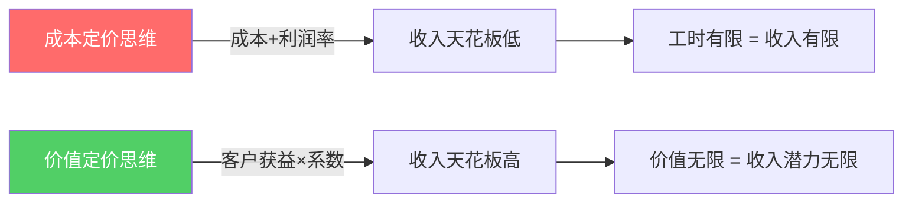
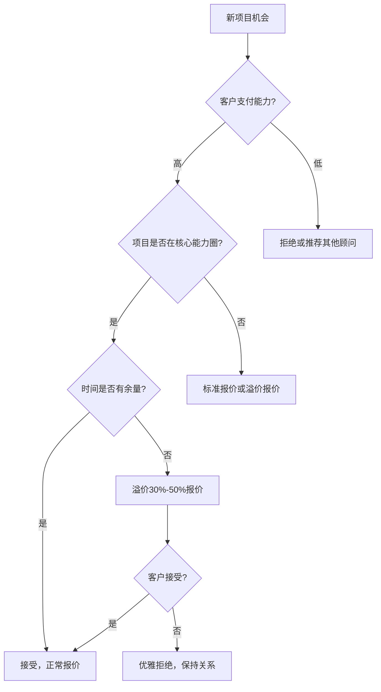
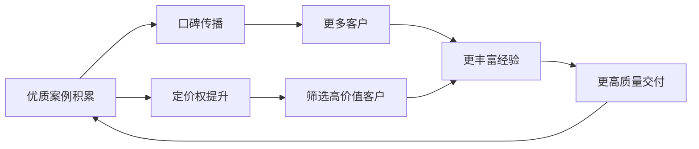

## 七、咨询行业的定价经济学

定价是咨询业务中最关键的战略决策之一。它不仅决定了你的收入上限，更直接影响客户对你专业价值的感知。很多咨询师在定价上犯的错误不是"定高了"或"定低了"，而是根本没理解定价背后的经济学逻辑——他们用成本思维去定价，却忽略了咨询本质上是一种价值交易。

### 1. 咨询定价的经济学本质

#### 1.1 为什么咨询定价与传统商品定价截然不同

传统商品定价遵循"成本 + 利润"的逻辑：原材料100元，加工费50元，利润率30%，售价195元。但咨询行业完全不同——你的成本（时间、知识、经验）和客户获得的价值之间，存在巨大的非对称性。

举个例子：一位供应链咨询顾问为企业优化了采购流程，帮助企业每年节省500万元。顾问投入了20个工作日，按日薪5000元计算，顾问的"成本"是10万元。如果按成本定价，顾问最多收10-15万元。但客户获得的价值是每年500万——即使顾问收取50万，客户的投入产出比仍然是1:10。

这就是咨询定价的第一个核心原则：**你卖的不是时间，而是结果。**



#### 1.2 咨询定价的三个经济学支柱

**支柱一：信息不对称（Information Asymmetry）**

咨询交易中，卖方（咨询师）拥有的专业知识远多于买方（客户）。客户在购买前无法完全评估咨询质量，只有在项目结束后才知道结果。这种信息不对称产生了两个后果：

- 客户倾向于用价格作为质量判断的代理指标（价格越高 = 越专业）
- 咨询师需要通过信号传递（Signal）来证明自己的价值

**支柱二：经验品属性（Experience Goods）**

咨询是一种"经验品"——客户必须体验后才能评价质量。这与"搜寻品"（购买前就能判断质量，如衣服、手机）不同。经验品的定价逻辑是：

- 首次合作：客户靠品牌、口碑、案例来预判质量，价格敏感度较低
- 复购决策：客户基于上次体验来判断是否值得，价格敏感度取决于上次ROI
- 溢价能力：来自信任积累，而非单纯的技能提升

**支柱三：边际成本趋近于零**

知识型服务的特点是：第一个客户的获取成本最高（需要投入时间建立方法论、案例库），后续客户的边际交付成本逐渐降低。同一套方法论可以服务10个客户、100个客户，而你的额外投入微乎其微。

这意味着：**定价策略应该随着经验积累而上移，而不是保持不变。**

#### 1.3 咨询定价与供需关系

咨询市场的供需关系有其特殊性：

| 维度 | 特点 | 对定价的影响 |
|------|------|-------------|
| 供给端 | 顶级咨询师稀缺，但初级从业者众多 | 头部溢价极高，底部价格战激烈 |
| 需求端 | 企业需求持续增长，但预算受经济周期影响 | 经济好时溢价空间大，经济差时预算压缩 |
| 替代品 | 内部团队、AI工具、自学方案 | 中低端咨询面临替代压力 |
| 信息透明度 | 行业定价不透明，缺乏标准参考 | 定价自由度高，但也容易自我设限 |

### 2. 咨询行业的七大定价模型

#### 2.1 按时间计费（Time-Based Pricing）

**运作方式：** 按小时、按天、按月收取固定费用。

**典型费率参考：**

| 咨询师级别 | 小时费率（人民币） | 日费率（人民币） | 适用场景 |
|-----------|------------------|-----------------|---------|
| 初级顾问（1-3年经验） | 500-1,500 | 3,000-8,000 | 执行层支持、数据收集分析 |
| 中级顾问（3-7年经验） | 1,500-4,000 | 8,000-25,000 | 项目管理、方案设计 |
| 高级顾问（7-15年经验） | 4,000-10,000 | 25,000-60,000 | 战略咨询、复杂问题诊断 |
| 行业权威（15年以上） | 10,000-30,000+ | 60,000-150,000+ | 企业战略、行业顶层规划 |

**优势：**
- 定价简单，客户容易理解
- 收入可预测，现金流稳定
- 适合服务范围不确定的项目

**劣势：**
- 你的收入与时间直接挂钩，存在天花板
- 效率越高收入反而越低（做好了10小时的工作，只能收10小时的钱）
- 客户倾向于压缩时间，导致质量下降
- 鼓励"磨时间"而非"出结果"

**适用场景：** 适合刚入行的咨询师建立现金流；适合长期陪伴式服务；适合范围难以预估的探索性项目。

#### 2.2 按项目计费（Project-Based Pricing）

**运作方式：** 根据项目范围、复杂度和预期交付物，报出一个固定总价。

**定价公式：**

```text
项目报价 = 预估工时 × 目标时薪 × 风险系数(1.2-1.5) + 直接成本 + 合理利润
```

**实际操作中的关键点：**

1. **范围界定（Scope of Work）**：必须在合同中明确列出包含和不包含的工作内容。模糊的范围是项目亏损的第一大原因。
2. **变更管理（Change Request）**：任何超出原始范围的变更，必须走书面变更流程并追加费用。
3. **里程碑付款**：按项目阶段设置付款节点（如30%预付 + 40%中期 + 30%尾款），避免全部垫资。

**优势：**
- 客户预算确定，决策更容易
- 效率提升直接转化为利润（10天的工作5天完成 = 利润翻倍）
- 与结果绑定的定价更有说服力

**劣势：**
- 范围蔓延（Scope Creep）风险
- 预估不准确时可能亏损
- 需要较强的项目管理能力

**适用场景：** 有明确交付物的项目（方案报告、系统搭建、流程优化）；客户预算固定的企业项目。

#### 2.3 按价值计费（Value-Based Pricing）

**运作方式：** 根据你为客户创造的价值来定价，而非根据你的投入。

这是定价模型中最高级、也是利润最丰厚的一种。它的核心逻辑是：**如果你能证明帮客户赚了（或省了）1000万，收100万是完全合理的。**

**价值定价的四步法：**

**第一步：量化客户的问题成本**

不要问"你愿意付多少钱"，而要问"这个问题让你损失了多少钱"。

例如，企业面临人才流失问题：
- 年流失率30%，行业平均15%
- 每流失一名核心员工的替换成本 = 该员工年薪的1.5-2倍
- 年流失造成的直接损失 = 流失人数 × 平均年薪 × 1.5

**第二步：定义可衡量的结果指标**

将咨询成果与客户关心的业务指标挂钩：

| 咨询类型 | 结果指标 | 衡量方式 |
|---------|---------|---------|
| 人力资源咨询 | 员工流失率下降 | 对比项目前后12个月数据 |
| 营销咨询 | 获客成本降低 | 对比项目前后CAC |
| 运营咨询 | 效率提升/成本降低 | 对比项目前后运营数据 |
| 战略咨询 | 新业务线收入 | 项目落地后12个月收入 |

**第三步：设定价值分享比例**

行业惯例是咨询师分享创造价值的10%-30%。这个比例取决于：

- 风险承担程度：如果用"底薪+绩效"模式，绩效部分可以占更高比例
- 价值可归因程度：越容易直接归因于你的工作，比例越高
- 客户支付能力：大企业和小企业的承受能力不同

**第四步：构建定价方案**

提供三档方案（高/中/低），让客户选择而非被动接受报价：

```text
方案A（全面版）：150万
  - 全面诊断 + 方案设计 + 落地辅导 + 效果跟踪（6个月）
  - 预期ROI：500万-800万

方案B（标准版）：80万
  - 重点诊断 + 方案设计 + 关键节点辅导（3个月）
  - 预期ROI：300万-500万

方案C（精简版）：35万
  - 诊断报告 + 方案设计（无落地辅导）
  - 预期ROI：150万-300万
```

这种"三档定价"的妙处在于：大多数客户会选择中间档，而你通过对比让中间档看起来"性价比最高"。

#### 2.4 保留顾问费（Retainer）

**运作方式：** 客户按月/季度支付固定费用，换取你持续可用的咨询服务。

**典型定价结构：**

| 服务级别 | 月费范围 | 包含内容 |
|---------|---------|---------|
| 基础顾问 | 5,000-15,000 | 每月2-4小时电话/视频咨询 + 邮件答疑 |
| 标准顾问 | 15,000-50,000 | 每月8-16小时咨询 + 季度现场拜访 |
| 高级顾问 | 50,000-150,000 | 每月不限时咨询 + 月度现场 + 参与关键决策 |
| 战略顾问 | 150,000+ | 全方位嵌入 + 董事会/高管层支持 |

**关键注意事项：**

1. **明确可用性边界**：合同中写清楚每月可用时间上限、响应时间承诺、超出部分的计费方式。
2. **最低承诺期**：通常要求6-12个月的最低合作期，避免客户用1个月就撤。
3. **预付机制**：按月预付，而非后付。现金流的主动权必须在你手里。
4. **未用时间不结转**：每月未用完的咨询时间不累积到下月，否则客户会囤积时间然后一次性消耗。

**优势：**
- 收入稳定可预测
- 深入了解客户业务，交付质量更高
- 客户粘性强，续约率高

**劣势：**
- 客户可能觉得"付了钱但没用够"而流失
- 需要持续投入精力维护关系
- 同一时期能服务的客户数量有限

#### 2.5 成功费/绩效定价（Success Fee / Performance-Based Pricing）

**运作方式：** 部分或全部费用与可衡量的业务结果挂钩。

**常见模式：**

- **底薪 + 成功费**：收取较低的基础费用（覆盖成本），再根据结果收取绩效奖金
- **纯成功费**：完全基于结果收费，零底薪
- **阶梯式成功费**：基础目标以上按比例分成，超额部分提高分成比例

**案例：** 一位营销咨询顾问与电商企业签订的绩效合同：
- 基础服务费：3万元/月（覆盖人力和工具成本）
- 成功费：月销售额增长部分的5%
- 结果：3个月内帮客户月销售额从200万提升到350万，增长150万
- 成功费 = 150万 × 5% = 7.5万/月
- 月总收入 = 3万 + 7.5万 = 10.5万

**优势：**
- 客户风险极低，决策门槛低
- 上不封顶的收入潜力
- 最能体现价值定价的理念

**劣势：**
- 收入不确定性高
- 很多因素不在你控制范围内（市场环境、客户执行力）
- 需要强大的数据追踪和归因能力
- 容易产生争议（客户认为结果是自己做的，不是你的功劳）

**适用场景：** 营销类咨询、销售流程优化、利润提升类项目——即结果可直接量化归因的领域。

#### 2.6 培训/课程定价

**运作方式：** 按课程/工作坊/训练营形式打包定价。

**定价参考框架：**

| 课程形式 | 时长 | 单人价格 | 企业内训价格 |
|---------|------|---------|------------|
| 线上录播课 | 2-10小时 | 99-999元 | N/A |
| 线上直播课 | 2-4小时 | 299-1,999元 | 5,000-20,000元 |
| 线下工作坊 | 1天 | 999-3,999元 | 20,000-80,000元 |
| 系统训练营 | 2-4周 | 2,999-19,999元 | 50,000-200,000元 |
| 企业内训 | 1-3天 | N/A | 30,000-150,000元/天 |

**培训定价的特殊考量：**

1. **讲师权威度溢价**：有畅销书、媒体曝光、知名案例的讲师，价格可以是普通讲师的3-10倍
2. **行业稀缺性溢价**：细分领域专家比通用培训师定价更高
3. **效果可验证溢价**：能提供学员前后测评对比的课程，定价空间更大
4. **后续转化价值**：课程本身利润可以薄，但后续1对1咨询、企业项目转化才是利润大头

#### 2.7 混合定价模型

实际操作中，成熟的咨询师往往采用混合定价：

```text
总收入 = 项目费（核心收入）+ 保留顾问费（稳定基础）+ 培训收入（规模杠杆）+ 成功费（上行空间）
```

**混合定价的典型组合：**

- **组合一**：诊断项目（固定价）→ 落地辅导（月度顾问费）→ 效果达标（成功费）
- **组合二**：公开课引流（低价/免费）→ 训练营（中价）→ 企业内训（高价）→ 常年顾问（持续收入）
- **组合三**：标准化产品（SaaS工具/模板/课程）→ 定制化咨询（高价值）→ 行业社群（年费制）

### 3. 定价心理学：客户是怎么做决策的

#### 3.1 锚定效应（Anchoring Effect）

人们对价格的判断是相对的，而非绝对的。第一个出现的价格会成为"锚点"，影响后续所有价格的感知。

**实操应用：**

- 永远先报高价方案，再报中价和低价方案
- 在报价前先展示客户的损失金额（"这个问题每年让你损失300万"），让300万成为锚点
- 用"原价 vs 优惠价"制造对比感

**案例：** 一位组织架构咨询师在提案时这样呈现：

> "根据我们的初步分析，贵公司当前组织效率损失每年约800-1200万元。我们的全面优化方案费用为120万元，预期在6个月内实现30%-50%的效率提升。"

先抛出800-1200万的损失锚点，120万的咨询费就显得"非常划算"了。

#### 3.2 价格-质量推断（Price-Quality Inference）

当客户缺乏判断质量的客观标准时，会用价格来推断质量。这在咨询行业尤其明显——客户买之前无法"试用"你的服务，只能靠价格来猜测。

**这意味着：定价过低不仅损失利润，还会损害你的专业形象。**

一位从日费率3000元涨到8000元的营销咨询师分享："涨价之后，客户反而更尊重我的时间了。以前客户经常在周末发消息让我改方案，涨价后这种情况几乎消失了。而且客户对方案的执行度明显更高——他们花了更多钱，就更认真地对待。"

#### 3.3 损失厌恶（Loss Aversion）

人们对损失的痛感是获得快乐感的2-2.5倍。在定价沟通中，强调"不做的损失"比"做了的收益"更有效。

**话术对比：**

| 弱话术（强调收益） | 强话术（强调损失） |
|------------------|------------------|
| "做了这个项目，你的效率能提升30%" | "每个月不优化这个流程，你损失约50万" |
| "我们的方案帮你降低获客成本" | "按目前的获客成本，你每年多花了200万" |
| "培训后员工能力会提升" | "员工流失导致的替换成本每年超过100万" |

#### 3.4 框架效应（Framing Effect）

同样的价格，不同的呈现方式会导致完全不同的决策。

**三档定价的框架效应：**

当你只有一个方案时，客户的决策是"要不要买"（接受或拒绝）。
当你有三个方案时，客户的决策变成"买哪个"（选择A/B/C）。

三档定价的设计原则：
- **低价档**：覆盖基础需求，利润率较低，用于吸引价格敏感客户
- **中价档**：你最希望客户选择的方案，包含核心服务 + 部分增值服务
- **高价档**：全面服务，利润率最高，用于锚定价格感知

研究表明，在三档定价中，60%-70%的客户会选择中间档。

#### 3.5 心理定价节点

价格的"尾数"也会影响感知：

- **整数价格**（10,000、50,000）：传递权威感和专业感，适合高端咨询
- **精确价格**（9,800、48,500）：暗示经过精确计算，适合项目报价
- **尾数9**（999、2,999）：适合课程、训练营等面向个人消费者的产品

### 4. 不同阶段的定价策略

#### 4.1 起步期定价策略（0-50万元年收入）

**核心目标：** 积累案例和口碑，而非最大化收入。

**策略要点：**

1. **采用"入场价"策略**：初期定价可以略低于市场平均水平，但不要打价格战。你的目标是用合理的价格快速获取第一批客户。
2. **用免费/低价获取标杆案例**：选择1-2个有影响力的客户，以优惠价格甚至免费服务，换取案例授权和推荐。
3. **快速迭代定价**：每完成3-5个项目就重新评估定价。如果成交率超过70%，说明定价太低；如果低于20%，说明定价太高或目标客户选错了。
4. **建立定价"基线"**：记录每个项目的实际工时、客户反馈、结果数据，为后续定价调整积累依据。

**起步期参考定价公式：**
```text
项目报价 = 你的月收入目标 ÷ 每月可服务客户数 × 项目周期（月）× 1.3（风险系数）
```

#### 4.2 成长期定价策略（50-200万元年收入）

**核心目标：** 从"卖时间"过渡到"卖价值"。

**策略要点：**

1. **引入价值定价**：对已有成熟方法论的服务项目，尝试用价值定价替代时间定价。
2. **产品化你的服务**：将反复使用的咨询流程标准化，形成可复制的"产品"，降低边际成本。
3. **分层定价**：为不同规模的客户提供不同层次的服务包。
4. **涨价节奏**：每6-12个月评估一次定价，逐步提价。新客户直接用新价格，老客户提前1-2个月通知调价。
5. **开始收取成功费**：在你有信心的领域引入绩效定价，打开收入上限。

**成长期涨价话术模板：**

> "感谢过去一年的合作。基于我们在过去12个月取得的成果（具体数据），以及我在专业能力和方法论上的持续投入，我的服务费用将于下季度起调整为新的标准。作为现有客户，您将享受90天的过渡期优惠。"

#### 4.3 成熟期定价策略（200万元以上年收入）

**核心目标：** 建立定价权（Pricing Power），实现"选择性定价"。

**策略要点：**

1. **只接受高价值客户**：你的稀缺时间应该只服务于愿意且有能力支付高价的客户。
2. **引入"说不"机制**：拒绝低价项目、拒绝范围不清晰的项目、拒绝价值观不合的客户。
3. **多元化收入结构**：从单一咨询费扩展到"咨询 + 培训 + 产品 + 投资"组合。
4. **建立行业定价话语权**：通过出版、演讲、行业活动，成为你所在领域的定价标杆。
5. **考虑"股权/期权"模式**：对高增长潜力的客户，可以用部分服务费换取股权，分享长期增长收益。

**成熟期的定价决策矩阵：**



### 5. 定价的经济学陷阱与破解

#### 5.1 价格战陷阱

**症状：** 不断降价以获取客户，利润率持续下降。

**根因：** 你没有差异化，客户把你和其他咨询师视为同质化商品。

**破解方法：**

1. **垂直细分**：成为某个极小领域的绝对权威，而不是"什么都做"的通才
2. **构建独特方法论**：拥有自己的框架、工具、模型，让客户无法直接比价
3. **案例壁垒**：积累同行业的成功案例，新客户选你不是因为你"便宜"，而是因为你"做过"
4. **退出价格战**：直接涨价30%-50%，筛选掉价格敏感客户，聚焦高价值客户

#### 5.2 成本膨胀陷阱

**症状：** 报价后发现实际成本远超预期，项目亏损。

**根因：** 低估了项目的复杂度、沟通成本、返工风险。

**破解方法：**

1. **加30%风险缓冲**：在预估工时基础上增加30%作为风险缓冲
2. **明确范围边界**：合同中详细列出包含和不包含的内容
3. **变更管理流程**：所有超出范围的工作必须书面确认并追加费用
4. **里程碑检查点**：设置阶段性检查点，及时发现偏差

#### 5.3 "免费试用"陷阱

**症状：** 为了获取客户，先免费做一部分工作，期望后续转化为付费项目。

**根因：** 你把"销售过程"和"交付过程"混淆了。

**破解方法：**

1. **销售阶段可以免费**：初步沟通、需求理解、方案框架——这些是销售成本，可以免费
2. **交付阶段必须收费**：一旦开始做实质性的工作（数据收集、分析、方案撰写），就必须收费
3. **用"微型交付物"代替免费试做**：提供一份免费的"诊断摘要"（1-2页），展示你的专业度，但不提供完整方案

#### 5.4 老客户"锁定低价"陷阱

**症状：** 老客户一直用3年前的价格享受服务，而你的能力和市场价早已上涨。

**根因：** 不好意思涨价，怕失去老客户。

**破解方法：**

1. **合同约定价格调整机制**：在初始合同中写入"服务费用每年可能根据市场情况调整"
2. **阶梯式涨价**：每次涨价不超过15%-20%，避免一次涨太多导致客户流失
3. **增值服务替代涨价**：保持基础价格不变，但新增的增值服务需要额外付费
4. **勇敢面对流失**：如果老客户因为合理涨价就离开，说明他们看重的是低价而非你的价值——这样的客户不值得保留

#### 5.5 "竞争对手定价"陷阱

**症状：** 定价总是参照竞争对手，别人降价你也降价。

**根因：** 你把自己定位为"同类产品的替代品"，而非"独特价值的提供者"。

**破解方法：**

1. **停止关注竞争对手价格**：竞争对手的定价反映的是他们的成本结构、目标客户和品牌定位，与你无关
2. **关注客户获得的价值**：同一份咨询报告，对A客户价值100万，对B客户价值10万，定价应该不同
3. **构建"无法比较"的服务**：加入竞争对手没有的元素（独家数据、行业关系、执行辅导）

### 6. 定价实操工具箱

#### 6.1 报价信模板

```text
尊敬的[客户称呼]：

感谢您与我们进行的深入沟通。基于对贵公司[具体问题]的了解，
我们制定了以下咨询服务方案：

━━━━━━━━━━━━━━━━━━━━━━━━
方案一：全面优化方案
━━━━━━━━━━━━━━━━━━━━━━━━
服务内容：[具体内容列表]
项目周期：[X]个月
项目费用：[金额]元
付款方式：签约时30%，中期40%，验收后30%
预期成果：[具体可衡量指标]
━━━━━━━━━━━━━━━━━━━━━━━━
方案二：重点突破方案
━━━━━━━━━━━━━━━━━━━━━━━━
服务内容：[具体内容列表]
项目周期：[X]个月
项目费用：[金额]元
付款方式：签约时50%，验收后50%
预期成果：[具体可衡量指标]
━━━━━━━━━━━━━━━━━━━━━━━━
方案三：精简方案
━━━━━━━━━━━━━━━━━━━━━━━━
服务内容：[具体内容列表]
项目周期：[X]周
项目费用：[金额]元
付款方式：全额预付
预期成果：[具体可衡量指标]

以上方案有效期为[X]天。如有任何疑问，欢迎随时沟通。

此致
[咨询师姓名]
```

#### 6.2 定价自检清单

在向客户报价之前，用以下清单检验你的定价是否合理：

- [ ] 你是否了解客户的预算范围？
- [ ] 你是否量化了客户问题的成本？
- [ ] 你的报价是否包含合理的利润空间（至少30%以上）？
- [ ] 你是否设置了风险缓冲（至少20%）？
- [ ] 你的报价是否提供了多档选择？
- [ ] 你是否明确了付款条件和时间节点？
- [ ] 你是否在合同中写入了范围边界和变更条款？
- [ ] 你的报价是否传递了足够的价值信号（案例、方法论、保障）？
- [ ] 你是否准备好应对客户"太贵了"的异议？
- [ ] 你是否设定了报价的底线（低于此价格宁可不做）？

#### 6.3 应对"太贵了"的话术框架

当客户说"太贵了"时，不要急于降价。先判断对方是真的预算不足，还是在试探你的底线。

**话术框架一：价值回顾法**
> "我理解您对价格的考虑。让我们回顾一下：您提到这个问题每年造成的损失约[X]万。我们的方案费用是[Y]万，预期在[Z]个月内解决这个问题。从投入产出比来看，这笔投入是非常值得的。"

**话术二：选项降级法**
> "如果全面方案超出了您的预算，我们可以看看重点突破方案——聚焦最核心的问题，费用会更可控。"

**话术三：价值拆解法**
> "12万元的项目费，分摊到6个月，每月2万元。而这个问题每个月给您造成的损失是[X]万。您觉得每月2万的投入，换回[X]万的改善，是否值得？"

**话术四：反问法**
> "在您看来，解决这个问题应该投入多少预算呢？"——让客户先给出数字，你再评估是否可行。

**绝对不要做的事：**
- 客户一说贵就立刻降价（这会让你的所有报价都显得"水分很大"）
- 在没有了解客户真实预算的情况下自行打折
- 用"我可以给你便宜一点"来回应——这等于承认你之前的报价不诚实

### 7. 定价经济学的进阶思考

#### 7.1 价格歧视与客户分层

经济学中的"价格歧视"在咨询行业非常普遍，而且完全合法合理：

- **一级价格歧视**：对每个客户单独定价（高端咨询的常态）
- **二级价格歧视**：通过产品版本区分不同支付意愿的客户（三档定价）
- **三级价格歧视**：对不同客户群设定不同价格（企业客户 vs 个人客户、不同行业）

**实操案例：** 同一套供应链优化方法论：

| 客户类型 | 年营收 | 咨询费 | 占客户营收比 |
|---------|--------|--------|------------|
| 大型制造企业 | 50亿 | 200万 | 0.04% |
| 中型贸易公司 | 5亿 | 50万 | 0.1% |
| 小型电商公司 | 5000万 | 15万 | 0.3% |

同样的专业能力，同样的方法论，定价差异高达13倍——因为不同规模的企业从中获得的价值完全不同。

#### 7.2 网络效应与定价权

咨询师的定价权不是静态的，它会随着你的网络效应（Network Effect）增强而提升：



这个正循环一旦启动，你的定价权会呈指数级增长。前100万年收入可能需要3-5年，但从100万到500万可能只需要2-3年。

#### 7.3 通缩性技术对咨询定价的冲击

AI工具的普及正在重塑咨询行业的定价格局：

**受到冲击的领域（定价下行压力）：**
- 数据收集与分析：AI可以快速处理大量数据
- 标准化方案生成：AI可以基于模板快速输出方案
- 基础研究与竞品分析：AI可以7×24小时不间断工作
- 翻译与本地化：AI翻译质量持续提升

**不受冲击甚至增值的领域（定价上行空间）：**
- 复杂决策判断：需要整合行业经验、政治智慧、商业直觉
- 人际关系与谈判：AI无法替代面对面的信任建立
- 变革管理与组织推动：需要理解人的心理和组织动力学
- 创造性战略设计：需要跨领域的知识融合和创造性思维

**应对策略：**
1. 向上移动——从执行层咨询升级到战略层咨询
2. 拥抱AI——将AI作为工具提升效率，而非视为威胁
3. 强化不可替代性——深耕人际关系、行业洞察、变革推动等AI难以复制的能力

#### 7.4 长期定价博弈

咨询师与客户之间的定价关系是一场长期博弈。短期的过度定价会损害长期关系，而长期的定价过低会损害你的职业发展。

**健康定价关系的标志：**
- 你对自己的价格有信心，不需要反复解释
- 客户对你的价格有清晰预期，不会每次谈判
- 价格随价值增长而自然上升
- 双方都认为交易是公平的

**定价关系恶化的信号：**
- 客户开始频繁要求折扣
- 你需要花大量时间解释"为什么这么贵"
- 项目利润率持续下降
- 客户开始把你的方案交给内部团队执行（只买你的想法，不买你的执行）

### 8. 常见误区与纠正

| 误区 | 纠正 |
|------|------|
| 按自己的生活成本定价 | 按客户获得的价值定价，你的成本与客户无关 |
| 担心报价太高吓跑客户 | 报价高但能证明价值，比报价低但被视为廉价更有效 |
| 所有客户同一价格 | 不同客户获得的价值不同，定价应该不同 |
| 涨价需要理由 | 你的能力和经验在增长，这就是最好的理由 |
| 免费是获客的好方式 | 免费获来的客户往往是最差的客户 |
| 参考竞争对手定价 | 竞争对手的成本结构和你不同，他们的价格不应该是你的参考 |
| 价格是唯一竞争因素 | 价格只是客户决策的一个因素，信任、案例、方法论更重要 |
| 一次定价定终身 | 定价应该随着你的能力、市场地位和客户需求动态调整 |

### 9. 本节核心要点

1. **咨询定价的本质是价值交易，不是时间交易。** 按时间定价是最原始的方式，随着经验积累应逐步转向价值定价和成果定价。

2. **七大定价模型各有所长。** 初期用时间定价建立现金流，中期用项目定价和价值定价提升利润率，成熟期用混合定价模型实现收入多元化。

3. **定价心理学是你的秘密武器。** 锚定效应、损失厌恶、框架效应——理解这些心理机制，能让你的报价更有说服力。

4. **不同阶段需要不同的定价策略。** 起步期以获取案例为主，成长期逐步引入价值定价，成熟期建立定价权。

5. **避免五大定价陷阱。** 价格战、成本膨胀、免费试用、锁定低价、跟随竞争——每一个都可能让你陷入被动。

6. **AI时代的定价应向上移动。** 执行层咨询面临AI冲击，战略层和关系层咨询的定价空间反而在扩大。

7. **定价是一个动态博弈过程。** 没有一成不变的正确价格，只有不断调整、不断优化的定价策略。
