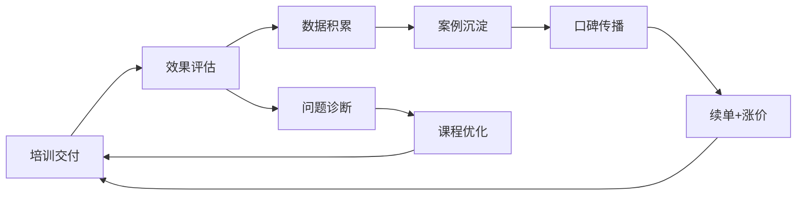
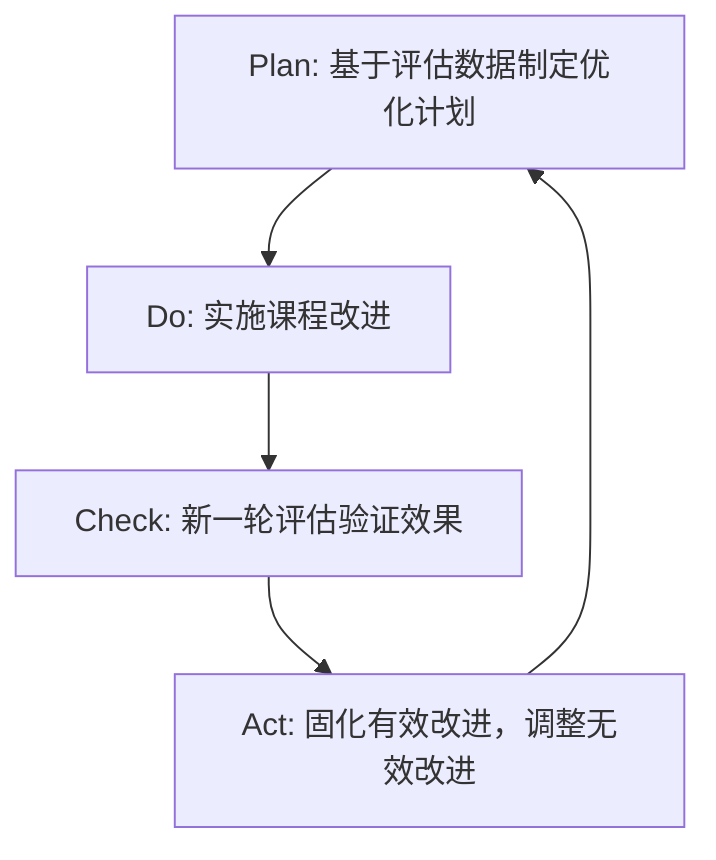

## 八、培训效果的评估与优化

### 1. 为什么评估是培训业务的生命线

很多独立培训师和咨询顾问犯一个致命错误：把课程交付当作服务的终点。讲完课、拍完合影、拿到尾款，就认为项目结束了。这种思维模式决定了你只能做"一锤子买卖"——客户上过一次课，觉得"还行"，但说不出具体好在哪里，下次换一个培训师试试。

**评估不是锦上添花，而是你的商业基础设施。** 原因有三：

**第一，评估是续单的核心武器。** 企业培训的复购率远高于新客获取，但复购的前提是客户能"看到"效果。没有评估数据，你说"学员反馈很好"，客户说"我也觉得还行，但老板要看数据"——然后就没有然后了。有了评估数据，你说"培训后3个月，团队人效提升了18%，离职率下降了7个百分点"，这才是客户采购委员会能用来推动续签的语言。

**第二，评估是涨价的底气来源。** 市面上80%的培训师不敢涨价，因为他们无法证明自己的价值。当你能拿出系统的评估数据，证明你的课程带来了可量化的业务改善，你的报价就从"市场行情价"变成了"投资回报价"——客户不是在花成本，而是在做投资。

**第三，评估是产品迭代的导航仪。** 没有评估的培训师，靠直觉改课。有评估体系的培训师，靠数据改课。哪个迭代效率更高，不言而喻。



---

### 2. 经典评估模型全景

培训效果评估经过70多年的发展，已经形成了多个成熟的理论模型。作为从业者，你不需要全部精通，但必须理解每个模型的适用场景和局限性，才能在不同项目中选择最合适的工具。

#### 2.1 柯氏四级评估模型（Kirkpatrick Model）

这是培训评估领域最经典、应用最广泛的模型，由唐纳德·柯氏（Donald Kirkpatrick）在1959年提出，至今仍是行业标准。

| 级别 | 名称 | 核心问题 | 评估时机 | 数据来源 |
|------|------|----------|----------|----------|
| L1 | 反应（Reaction） | 学员满意吗？ | 培训结束当天 | 满意度问卷、课堂反馈 |
| L2 | 学习（Learning） | 学到东西了吗？ | 培训中/刚结束 | 测试、实操考核、前后对比 |
| L3 | 行为（Behavior） | 用起来了吗？ | 培训后1-3个月 | 上级观察、360度反馈、行为检查表 |
| L4 | 结果（Results） | 业务有改善吗？ | 培训后3-6个月 | KPI数据、业务报表、ROI计算 |

**关键理解：** 四个层级的价值是递增的，但获取难度也是递增的。大多数培训师只做到L1（发个满意度问卷），少数做到L2（做个课后测试），能做到L3和L4的凤毛麟角——而这恰恰是拉开竞争差距的地方。

**L1 反应层评估详解**

这是最基础的评估层级，但做好的培训师并不多。常见的做法是培训结束后发一张满意度问卷，学员打个分就走了。这种做法有两个问题：一是问卷设计太粗糙（全是"非常满意/满意/一般/不满意"），二是收集后不分析。

高质量的L1评估应该包含以下维度：

| 评估维度 | 具体问题示例 | 权重建议 |
|----------|-------------|----------|
| 内容相关性 | "课程内容与您实际工作的相关程度？" | 25% |
| 讲师能力 | "讲师对主题的专业深度如何？" | 25% |
| 教学方法 | "案例分析、小组讨论等环节的有效性？" | 20% |
| 实用性 | "您预计多久能在工作中应用所学？" | 20% |
| 整体体验 | "您向同事推荐此课程的可能性（NPS）？" | 10% |

**NPS（净推荐值）是L1评估中最有商业价值的指标。** 计算方法：推荐者（9-10分）占比 - 贬损者（0-6分）占比。NPS > 50为优秀，> 70为卓越。这个数字可以直接用于你的销售话术："我的课程NPS评分72分"——比"学员反馈很好"有力100倍。

**L2 学习层评估详解**

L2回答的是"学员是否掌握了知识和技能"。评估方法因培训类型而异：

| 培训类型 | L2评估方法 | 具体工具 |
|----------|-----------|----------|
| 知识类（如合规培训） | 笔试/在线测试 | 问卷星、考试星、自建题库 |
| 技能类（如销售技巧） | 情景模拟/角色扮演 | 录像回放、评分表、同伴互评 |
| 态度类（如领导力） | 自评+他评量表 | 前后测对比、行为锚定量表 |
| 工具类（如软件操作） | 实操任务完成度 | 任务清单、完成时间、错误率 |

**前后测设计是L2评估的核心技术。** 在培训前测一次学员的基线水平，培训结束后再测一次，用差值来衡量学习效果。没有前测数据，你无法证明学员的进步是来自你的培训还是他们本来就懂。

```text
前后测设计模板：
━━━━━━━━━━━━━━━━━━━━━━━━━━━━━━━━
前测（培训第一天开始前）
  - 知识测试：20道选择题，覆盖核心知识点
  - 技能评估：1个实操任务，记录完成时间和质量
  - 自评问卷：10个维度的5分制自评

后测（培训最后一天结束后）
  - 同一知识测试：题目顺序打乱，增加2-3道进阶题
  - 同一实操任务：记录完成时间和质量
  - 同一自评问卷：对比前后差异

数据处理：
  知识提升率 = (后测均分 - 前测均分) / (满分 - 前测均分) × 100%
  技能提升率 = (前测用时 - 后测用时) / 前测用时 × 100%
━━━━━━━━━━━━━━━━━━━━━━━━━━━━━━━━
```

#### 2.2 柯氏-菲利普斯五级模型（Phillips ROI Model）

杰克·菲利普斯（Jack Phillips）在柯氏四级基础上增加了第五级——投资回报率（ROI）。这一级直接回答老板最关心的问题："这笔培训费花得值不值？"

| 级别 | 名称 | 核心问题 | 计算方式 |
|------|------|----------|----------|
| L5 | 投资回报率（ROI） | 培训的经济回报是多少？ | (培训收益 - 培训成本) / 培训成本 × 100% |

**ROI计算实操框架：**

```text
培训成本构成：
┌─────────────────────────────────┐
│ 直接成本                        │
│   ├── 讲师费用（课酬+差旅）     │
│   ├── 场地及设备租赁            │
│   ├── 教材及工具采购            │
│   └── 学员餐饮及茶歇            │
│ 间接成本                        │
│   ├── 学员工时成本（参训期间）   │
│   ├── 组织协调人力成本          │
│   └── 培训管理平台费用          │
│ 机会成本                        │
│   └── 学员参训期间的产出损失     │
└─────────────────────────────────┘

培训收益构成：
┌─────────────────────────────────┐
│ 可量化收益                      │
│   ├── 生产效率提升（人效/时薪）  │
│   ├── 质量改善（错误率/返工率）  │
│   ├── 销售增长（成交率/客单价）  │
│   ├── 成本节约（损耗/浪费降低）  │
│   └── 人员稳定性（离职率降低）   │
│ 难量化收益（需合理转化）         │
│   ├── 满意度提升→复购率/转介绍   │
│   ├── 团队协作改善→项目交付速度  │
│   └── 创新能力提升→新产品/新方案 │
└─────────────────────────────────┘
```

**ROI计算示例：**

某销售技巧培训项目：
- 培训成本：讲师费8万 + 场地2万 + 学员工时成本15万 = 25万
- 培训后3个月，参训团队成交率从12%提升到18%，团队月均销售额增加50万
- 3个月增量收益：50万 × 3 = 150万
- 剔除其他因素影响（保守估计培训贡献度60%）：150万 × 60% = 90万
- ROI = (90万 - 25万) / 25万 × 100% = 260%

**这个数字怎么用？** 在你的提案中写："同类项目历史ROI为260%，即每投入1元培训费用，3个月内可获得2.6元的业务回报。" 这比任何销售话术都有说服力。

#### 2.3 CIPP评估模型

CIPP模型由斯塔弗尔比姆（Daniel Stufflebeam）于1966年提出，强调评估应该贯穿培训的全过程，而非仅仅在培训结束后。CIPP是四个评估维度的首字母缩写：

| 维度 | 英文 | 评估时机 | 核心问题 |
|------|------|----------|----------|
| 背景评估 | Context | 培训需求分析阶段 | 培训要解决什么问题？问题的优先级如何？ |
| 输入评估 | Input | 培训设计阶段 | 资源配置是否合理？方案是否可行？ |
| 过程评估 | Process | 培训实施阶段 | 执行是否按计划进行？学员参与度如何？ |
| 成果评估 | Product | 培训结束后 | 是否达到预期目标？有哪些改进空间？ |

**CIPP模型的优势在于它是一个"过程性评估"，而非"终结性评估"。** 柯氏模型侧重于培训结束后"效果如何"，CIPP模型则从培训需求分析阶段就开始介入，确保"方向正确"。对于大型企业培训项目（预算50万+），建议同时使用CIPP和柯氏模型：CIPP管过程质量，柯氏管结果质量。

#### 2.4 CIRO评估模型

CIRO模型由伯德（Bird）、里克曼（Rackham）等人提出，特别适合评估管理类培训项目。CIRP代表：

- **C - Context（情境评估）：** 收集关于培训需求和目标的信息
- **I - Input（输入评估）：** 评估培训资源和方法的适当性
- **R - Reaction（反应评估）：** 收集学员对培训的即时反馈
- **O - Output（输出评估）：** 在四个层面衡量培训结果——即时输出、中期输出、最终输出、长远影响

CIRO的独特之处在于它将输出分为四个时间维度，更精细地追踪培训效果的持续性和衰减曲线。

#### 2.5 模型选择指南

| 项目类型 | 推荐模型 | 理由 |
|----------|----------|------|
| 短期公开课/讲座 | 柯氏L1-L2 | 成本低、快速反馈，适合批量评估 |
| 企业内训（单次） | 柯氏L1-L4 | 全面覆盖，客户认可度高 |
| 系统性培训项目（多期） | CIPP + 柯氏 | 过程+结果双重保障 |
| 高管教练/领导力项目 | CIRO | 关注长期行为改变和组织影响 |
| 需要ROI数据的大项目 | 菲利普斯五级 | 直接回答"值不值"的问题 |
| 内部课程迭代优化 | 柯氏L1-L3 | 聚焦内容质量和行为转化 |

---

### 3. 评估落地实操：从数据采集到报告输出

理论模型再好，落不了地就是废纸。这一节给出可直接执行的操作流程。

#### 3.1 评估方案设计（培训前完成）

在培训项目启动前，就应该把评估方案写进项目计划书。这不是"做完再想"的事情，而是"想好再做"的事情。

**评估方案模板：**

```yaml
项目名称: [培训项目名称]
客户: [客户公司名称]
培训日期: [日期]
参训人数: [人数]

评估目标:
  - 主要目标: 证明培训对[具体业务指标]的改善效果
  - 次要目标: 识别课程优化方向，积累案例素材

评估层级与方法:
  L1反应层:
    工具: 定制化满意度问卷（含NPS）
    时机: 培训结束当天
    负责人: 培训助理
  L2学习层:
    工具: 前后测+实操考核
    时机: 培训开始前+结束后
    负责人: 讲师
  L3行为层:
    工具: 行为改变追踪表+上级访谈
    时机: 培训后30/60/90天
    负责人: 项目经理
  L4结果层:
    工具: 业务KPI对比分析
    时机: 培训后90天
    负责人: 客户HR+我方项目经理

数据收集计划:
  培训前:
    - [ ] 发送前测问卷（培训前7天）
    - [ ] 收集学员基线KPI数据（与客户HR对接）
    - [ ] 确认对照组设置（如有）
  培训中:
    - [ ] 每日课堂观察记录
    - [ ] 学员参与度统计
    - [ ] 关键环节即时反馈
  培训后:
    - [ ] L1满意度问卷（当天）
    - [ ] L2后测（当天或次日）
    - [ ] L3行为追踪（30/60/90天）
    - [ ] L4业务数据分析（90天）

报告交付物:
  - 培训后3天内: 即时效果报告（L1+L2数据）
  - 培训后30天: 行为改变中期报告（L3初步数据）
  - 培训后90天: 完整效果评估报告（L1-L4全量数据+ROI估算）
```

#### 3.2 数据采集工具箱

**满意度问卷设计原则：**

1. **控制长度：** 15-20题为最佳，超过25题回收率和质量都会下降
2. **混合题型：** 封闭式题目（打分）占70%，开放式题目占30%
3. **避免引导性措辞：** 不要问"您是否觉得讲师非常专业？"，要问"请评价讲师的专业水平"
4. **加入NPS题：** "您向同事推荐此课程的可能性是多少？（0-10分）"
5. **加入开放题：** "课程中最有价值的一个收获是什么？"和"如果改进一点，您最希望改什么？"

**行为追踪工具——行为改变检查表（BCL）：**

```text
行为改变检查表
━━━━━━━━━━━━━━━━━━━━━━━━━━━━━━━━━━━━━
学员姓名: ___________  部门: ___________
评估人: ___________    日期: ___________

培训目标行为清单（根据课程目标定制）：
┌──┬────────────────────┬────┬────┬────┬──────────┐
│序│ 目标行为            │培训前│30天│60天│ 备注     │
│号│                     │频率 │频率│频率│          │
├──┼────────────────────┼────┼────┼────┼──────────┤
│1 │ 每日站会使用结构化  │从不 │偶尔│经常│ 需持续   │
│  │ 汇报模板            │     │    │    │ 强化     │
├──┼────────────────────┼────┼────┼────┼──────────┤
│2 │ 与下属进行定期1对1  │从不 │每周│每周│ 已形成   │
│  │ 绩效沟通            │     │1次 │1次 │ 习惯     │
├──┼────────────────────┼────┼────┼────┼──────────┤
│3 │ 用数据支撑决策建议  │偶尔 │经常│总是│ 进步明显 │
├──┼────────────────────┼────┼────┼────┼──────────┤
│4 │ ...                 │     │    │    │          │
└──┴────────────────────┴────┴────┴────┴──────────┘

频率标准：从不(0) / 偶尔(1-2次/月) / 经常(1-2次/周) / 总是(几乎每天)
━━━━━━━━━━━━━━━━━━━━━━━━━━━━━━━━━━━━━
```

**上级访谈提纲（L3行为层评估用）：**

```text
访谈对象：参训学员的直接上级
访谈时机：培训后30-45天
访谈时长：15-20分钟/人

核心问题：
1. 您观察到[学员姓名]在培训前后有哪些行为变化？请举具体例子。
2. 这些变化对团队/业务产生了什么影响？（正面或负面）
3. 您认为培训内容是否与实际工作场景匹配？哪里匹配得好，哪里不够？
4. 您觉得[学员姓名]还需要哪些后续支持来巩固培训效果？
5. 如果同类培训再次开展，您有什么建议？
6. （关键问题）您愿意让团队其他成员参加同样的培训吗？为什么？
```

#### 3.3 评估报告撰写

评估报告是你的"成绩单"，也是续签和涨价的核心武器。一份好的评估报告应该让没有参加培训的人也能清楚地理解培训的价值。

**报告结构模板：**

```text
《[培训项目名称] 效果评估报告》

一、项目概要
  - 培训背景与目标
  - 参训人员概况（人数、层级、部门）
  - 培训内容概要

二、评估方法说明
  - 采用的评估模型
  - 数据采集方法和时机
  - 样本量和回收率

三、评估结果
  3.1 学员满意度（L1）
    - 整体满意度得分：X.X/5.0
    - NPS评分：XX分
    - 各维度得分对比图
    - 学员典型反馈摘录（正面+建设性）

  3.2 学习效果（L2）
    - 前后测成绩对比
    - 知识提升率：XX%
    - 技能考核通过率：XX%
    - 各模块掌握情况热力图

  3.3 行为改变（L3）
    - 行为改变追踪数据
    - 上级访谈关键发现
    - 行为转化率：XX%的学员在XX个目标行为上有明显改善

  3.4 业务成果（L4）
    - KPI变化趋势图
    - 与对照组的对比分析（如有）
    - ROI估算：XX%

四、关键发现与洞察
  - 本次培训最有效的3个环节
  - 需要改进的3个方面
  - 学员后续发展建议

五、后续行动建议
  - 对客户：后续培训计划建议
  - 对我方：课程优化方向
  - 对学员：自学资源推荐

附录：原始数据、问卷模板、访谈记录摘要
```

---

### 4. 评估数据的商业转化：从数据到收入

评估数据的价值不仅在于"证明效果"，更在于它能直接驱动业务增长。以下是五个将评估数据转化为收入的具体策略。

#### 4.1 用L1数据优化获客

把满意度数据和NPS评分放进你的提案和官网：

```text
话术示例：
"过去12个月，我们为32家企业提供了管理培训服务，
 平均满意度评分4.7/5.0，NPS评分68分。
 85%的客户在首次合作后12个月内进行了复购。"
```

**注意：** 满意度数据必须真实，不能造假。一旦被客户发现数据注水，你的信誉将不可修复。如果某次培训满意度不高，把它当作改进的机会，而不是掩盖的事实。

#### 4.2 用L2数据证明专业度

前后测数据是你专业能力的直接证明。在提案中加入：

```text
"我们的销售技巧培训采用前后测评估体系：
 参训学员的平均知识掌握率从培训前的42%提升到培训后的87%，
 平均提升45个百分点。以下为近5个项目的前后测数据汇总……"
```

#### 4.3 用L3数据支撑续签

行为改变数据是续签谈判中最有力的武器。当客户HR说"培训效果不好量化"时，你可以拿出：

```text
"培训后60天的跟踪数据显示：
 - 78%的参训经理已建立定期1对1沟通机制（培训前为23%）
 - 65%的参训经理在汇报中使用了结构化表达框架（培训前为12%）
 - 团队成员对上级沟通满意度从3.2分提升到4.1分（5分制）"
```

#### 4.4 用L4数据支撑涨价

ROI数据是你涨价的终极武器。当你能证明每投入1元培训费带来3元回报时，客户关注的不再是"你的课多少钱一天"，而是"我应该投入多少预算来获取更大回报"。

**涨价话术：**

```text
"基于过去3个项目的数据，我们的销售培训平均ROI为280%。
 基于这个回报率，我们将下一期培训费用从X万调整为Y万——
 这意味着您的预期投资回报将从280%提升到320%，
 因为新版本课程增加了[新模块]，针对性更强。"
```

#### 4.5 用评估数据构建案例库

每次项目结束后，将评估数据脱敏处理后沉淀为案例素材：

```text
案例模板：
━━━━━━━━━━━━━━━━━━━━━━━━━━━━━━━━━━━
客户行业: [行业]
项目类型: [培训/咨询/教练]
参训规模: [人数]
项目周期: [时长]
核心挑战: [客户面临的具体问题]

解决方案:
  [你提供的服务内容概述]

效果数据:
  - L1满意度: X.X/5.0，NPS: XX
  - L2知识提升: XX%
  - L3行为转化: XX%的学员在XX方面有改善
  - L4业务成果: [具体KPI改善数据]

客户评价:
  "[客户原话引用]"
━━━━━━━━━━━━━━━━━━━━━━━━━━━━━━━━━━━
```

---

### 5. 评估中的常见陷阱与纠偏

#### 陷阱一：只做L1就声称"培训效果很好"

**问题本质：** 满意度≠效果。学员觉得课程"有趣""讲师讲得好"，不代表他们学到了东西，更不代表他们会用。

**纠偏方法：** 至少做到L2，用前后测数据说话。如果客户预算有限，可以将L2评估融入课程本身（如课堂练习、角色扮演考核），不额外增加时间和成本。

#### 陷阱二：不做前测，只做后测

**问题本质：** 没有基线数据，你无法证明学员的进步来自培训。学员考了85分，你能说培训效果好吗？如果他们培训前就已经能考80分呢？

**纠偏方法：** 每次培训必须设置前测。即使时间紧张，用5分钟做10道快速测试题也比没有强。前测还有一个好处：它能帮讲师了解学员的真实水平，从而调整授课深度。

#### 陷阱三：评估时机不对

**问题本质：** 培训刚结束就评估行为改变，或者培训结束半年才收集满意度数据——时机不对，数据就没有参考价值。

**纠偏方法：** 遵循各层级的标准评估时机。L1在培训当天，L2在培训结束时，L3在培训后30-90天，L4在培训后90-180天。把这个时间表写进项目计划，设置提醒。

#### 陷阱四：把所有业务改善都归功于培训

**问题本质：** 培训后业绩提升了，就说是培训的功劳。但业绩提升可能是因为市场行情好、新产品上线、竞争对手出问题等多种因素。

**纠偏方法：**
1. 尽可能设置对照组（未参训的同类团队）
2. 使用"剔除法"——保守估计培训的贡献度（通常取40%-60%）
3. 在报告中说明其他可能的影响因素，增强可信度
4. 用"排除法"——如果可能，请客户提供同期其他因素的数据

#### 陷阱五：评估问卷设计有偏差

**问题本质：** 问卷措辞引导学员打高分，或者选项设置不合理，导致数据失真。

**常见错误及修正：**

| 错误设计 | 问题 | 正确设计 |
|----------|------|----------|
| "您是否同意讲师非常专业？" | 引导性措辞 | "请评价讲师的专业水平（1-5分）" |
| 只有正面选项 | 无法区分真实评价 | 设置完整的5级量表 |
| "课程整体感觉如何？" | 太笼统 | 拆分为内容、讲师、方法、实用性等维度 |
| 问卷在讲师在场时填写 | 社会压力导致高分 | 线上匿名填写，或讲师离场后填写 |

#### 陷阱六：收集了数据不分析不使用

**问题本质：** 问卷发了一堆，数据收了一堆，但从来没有认真分析过，更没有用于课程改进。评估变成了"走流程"。

**纠偏方法：**
1. 每次培训后48小时内完成L1数据分析
2. 建立数据看板，追踪趋势而非单次数据
3. 每季度做一次数据汇总，识别系统性问题
4. 将分析结论转化为具体的课程改进动作

---

### 6. 建立你的评估体系：从零到一

如果你目前没有任何评估体系，不需要一步到位。以下是分阶段建设的路径：

#### 第一阶段：基础评估（第1-3个月）

```text
目标：建立L1+L2评估的标准化流程

行动清单：
[ ] 设计标准化满意度问卷模板（含NPS题）
[ ] 设计2-3门核心课程的前后测题库
[ ] 建立数据收集SOP（谁收集、什么时候、用什么工具）
[ ] 选择数据工具（推荐起步方案：问卷星/腾讯问卷 + Excel）
[ ] 完成第一次完整的L1+L2评估并输出报告

投入：约10-15小时（一次性），之后每次培训额外增加30分钟
```

#### 第二阶段：行为追踪（第4-6个月）

```text
目标：建立L3行为层评估机制

行动清单：
[ ] 设计行为改变检查表（BCL）模板
[ ] 设计上级访谈提纲
[ ] 与客户HR建立数据对接机制
[ ] 设置30/60/90天的跟踪提醒
[ ] 完成第一次L3评估并输出中期报告

投入：每个项目增加2-3小时的跟踪工作
```

#### 第三阶段：ROI量化（第7-12个月）

```text
目标：建立L4结果层评估和ROI计算能力

行动清单：
[ ] 与客户协商确定KPI基线数据获取方式
[ ] 建立ROI计算模板
[ ] 学习归因分析方法（如何区分培训效果和其他因素）
[ ] 积累3-5个完整的L1-L4评估案例
[ ] 用ROI数据支撑第一次涨价

投入：每个项目增加3-5小时的分析工作
```

#### 第四阶段：体系化运营（第12个月+）

```text
目标：评估成为业务的标准组成部分

行动清单：
[ ] 将评估方案写入标准合同条款
[ ] 建立跨项目的数据库和行业基准
[ ] 开发评估报告的自动化生成工具
[ ] 用评估数据指导课程产品线规划
[ ] 将评估能力本身作为服务产品（帮客户做培训评估）
```

---

### 7. 评估驱动的课程优化方法论

评估的终极目的不是"证明效果"，而是"持续改进"。以下是基于评估数据的课程优化方法论。

#### 7.1 L1数据驱动的体验优化

**分析框架：** 将L1各维度得分绘制成雷达图，找出短板维度。

```text
L1维度分析与优化方向：
┌────────────────┬──────────────────────────────────┐
│ 得分最低维度    │ 优化方向                          │
├────────────────┼──────────────────────────────────┤
│ 内容相关性低    │ 课前调研不够深入，需加强需求分析   │
│ 讲师能力低      │ 授课技巧需提升，考虑参加TTT培训    │
│ 教学方法单一    │ 增加互动环节：案例讨论、角色扮演   │
│ 实用性不足      │ 增加实操练习，减少纯理论讲授       │
│ 整体体验差      │ 关注场地、节奏、氛围等细节         │
└────────────────┴──────────────────────────────────┘
```

**开放题分析技巧：** 对L1中的开放题做词频分析。提取高频正面关键词（如"案例""接地气""实用"）和高频负面关键词（如"太理论""时间紧""案例少"），形成课程优化的优先级清单。

#### 7.2 L2数据驱动的内容优化

**分析框架：** 按知识模块统计前后测正确率，找出"高投入低产出"和"低投入高产出"的模块。

```text
模块效率矩阵：
┌───────────────┬──────────────────┬──────────────────┐
│               │ 前测得分低       │ 前测得分高       │
├───────────────┼──────────────────┼──────────────────┤
│ 后测提升大     │ ✅ 高效模块      │ ⚠️ 重复内容      │
│               │ 保持或增加时长   │ 可压缩时长       │
├───────────────┼──────────────────┼──────────────────┤
│ 后测提升小     │ ❌ 低效模块      │ ✅ 已掌握内容    │
│               │ 需重新设计教学法 │ 可改为选修/自学  │
└───────────────┴──────────────────┴──────────────────┘
```

#### 7.3 L3数据驱动的教学方法优化

如果L2数据好（学员学会了）但L3数据差（学员没用上），问题通常出在"知行转化"环节。可能的原因和对策：

| 症状 | 可能原因 | 优化对策 |
|------|----------|----------|
| 学员说"忘了" | 训后缺乏复习机制 | 增加训后30天微课/打卡/复习材料 |
| 学员说"没机会用" | 课上场景与实际工作脱节 | 用客户真实业务场景重新设计案例 |
| 学员说"上级不支持" | 缺乏组织层面的推动力 | 增加上级参与环节（如上级作为课后辅导人） |
| 学员说"太复杂了" | 工具/方法的上手门槛太高 | 简化工具，提供"最小可用版本" |
| 学员说"不好意思用" | 缺乏安全感和练习机会 | 增加课内练习比重，建立学习社群互促 |

#### 7.4 建立课程迭代的PDCA循环



**迭代节奏建议：**
- **每期微调：** 根据L1开放题反馈，调整案例、话术、时间分配等细节
- **每季度小改：** 根据L2数据，重新设计低效模块的教学方法
- **每年大改：** 根据L3/L4数据和市场变化，重新审视课程整体架构和核心内容

---

### 8. 数字化评估工具与技术趋势

#### 8.1 主流评估工具对比

| 工具类别 | 代表工具 | 适用场景 | 成本 | 优势 | 劣势 |
|----------|----------|----------|------|------|------|
| 问卷工具 | 问卷星、腾讯问卷 | L1/L2数据收集 | 免费-几百元/年 | 简单易用，数据自动汇总 | 功能有限 |
| LMS平台 | 云学堂、魔学院 | L2在线测试+学习追踪 | 数千-数万元/年 | 功能全面，数据可追溯 | 学习成本高 |
| 项目管理 | 飞书/钉钉多维表格 | L3行为追踪 | 免费 | 与工作流集成 | 需要自建模板 |
| BI工具 | 帆软、Power BI | L4数据分析与可视化 | 数千-数万元/年 | 专业分析能力强 | 需要数据分析能力 |
| AI辅助 | ChatGPT/Claude | 开放题分析、报告生成 | API费用 | 大幅提升分析效率 | 需人工审核 |

#### 8.2 AI赋能的评估新趋势

AI正在改变培训评估的方式，以下是几个值得关注的方向：

**自动化开放题分析：** 将学员的开放题反馈输入大语言模型，自动提取主题、情感倾向和改进建议。过去需要人工阅读200份问卷花2小时，现在AI可以在5分钟内完成初步分析，你只需要审核和补充。

**智能学习路径推荐：** 基于L2前后测数据，AI可以自动识别每位学员的知识薄弱点，生成个性化的学习路径。这不仅提升了培训效果，也为你提供了差异化的服务卖点。

**行为改变预测模型：** 基于历史L3数据，训练预测模型来识别哪些学员最可能出现行为改变，哪些可能"学了不用"。针对高风险学员提前介入，提升整体转化率。

**自然语言生成报告：** AI可以根据结构化数据自动生成评估报告初稿，你只需要审核、补充洞察和调整措辞，报告撰写时间可以从1天缩短到2小时。

---

### 9. 核心要点总结

| 要点 | 关键信息 |
|------|----------|
| 评估的本质 | 不是"走流程"，而是商业基础设施——支撑续签、涨价和产品迭代 |
| 四级递进 | L1满意度→L2学习→L3行为→L4结果，价值递增，难度也递增 |
| 最低标准 | 至少做到L1+L2，L3是竞争力分水岭，L4是涨价利器 |
| 前测必须有 | 没有基线数据，一切"效果好"都是自说自话 |
| ROI是终极武器 | "每投入1元获得2.6元回报"比任何销售话术都有力 |
| 评估驱动优化 | 数据不是用来存档的，而是用来改进课程的 |
| 分阶段建设 | 不需要一步到位，从L1+L2开始，逐步扩展到L3+L4 |
| AI是加速器 | 善用AI工具可以将评估效率提升5-10倍 |
