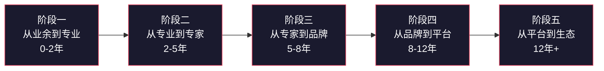
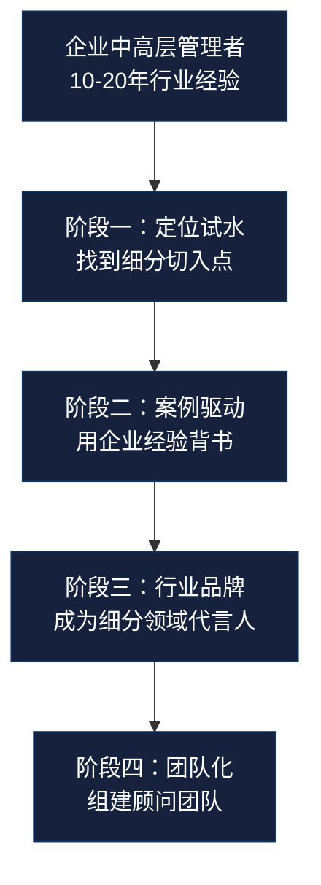
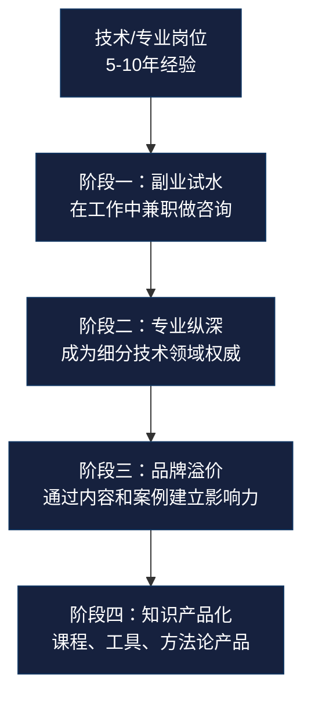
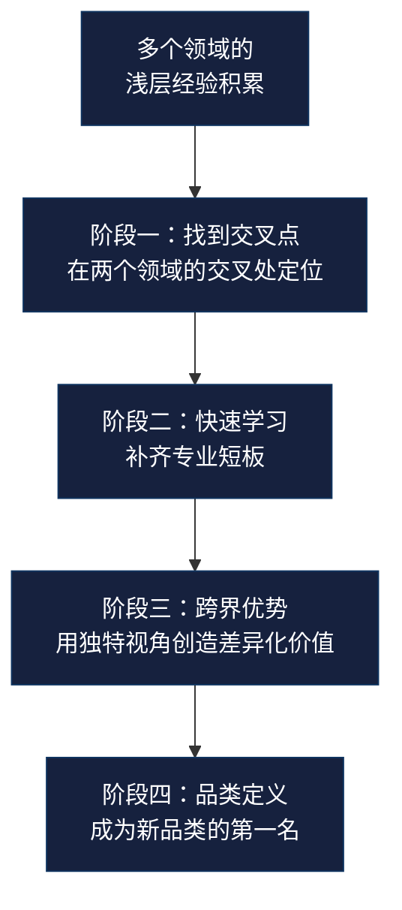
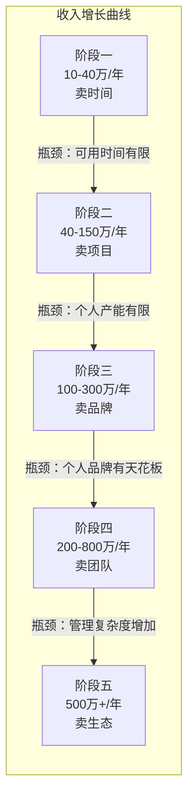
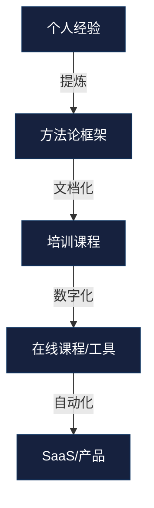

## 九、咨询顾问的职业发展路径

### 1. 为什么需要理解职业发展路径

咨询行业有一句老话："前三年淘汰一半，前五年再淘汰一半。"这不是危言耸听——根据全球咨询行业调研机构Source Global Research的数据，独立咨询顾问在创业第一年的存活率约为62%，第三年降至38%，第五年仅剩23%。大量顾问并非能力不足，而是在错误的阶段做了错误的事情：刚入行就想做战略咨询，还没建立口碑就想规模化扩张，或者在应该深耕专业的时候选择了多元化。

理解职业发展路径的核心价值在于：**知道自己在哪个阶段、该做什么事、不该做什么事。** 它不是一条死板的路线图，而是一张标注了关键节点和陷阱的导航图。每个顾问的具体路径可以不同，但底层的成长逻辑是相通的。

### 2. 咨询顾问的五阶段发展模型

咨询顾问的职业发展可以分为五个阶段，每个阶段都有明确的能力要求、收入特征、核心任务和常见陷阱。



#### 2.1 阶段一：从业余到专业（入行期，0-2年）

**阶段定义：** 从企业员工、自由职业者或其他身份转型为咨询顾问，完成从"会做事"到"能教人做事"的认知转变。

**能力特征：**

这个阶段的核心矛盾是：你有足够的行业经验，但缺乏将经验转化为咨询服务的能力。具体表现为：

- **诊断能力不足：** 面对客户的问题，你可能知道答案，但不知道如何系统地拆解问题、找到根因。你需要从"直觉判断"升级为"结构化诊断"。
- **方法论未形成：** 你做事靠经验和感觉，还没有将隐性知识提炼为可复用的方法论框架。客户买的不是你的感觉，而是一套可验证的方法。
- **商业意识薄弱：** 不知道如何定价、如何写提案、如何管理客户期望、如何处理合同纠纷。这些"做咨询的技能"和"做业务的技能"完全是两回事。

**收入特征：**

| 收入来源 | 占比 | 典型月收入 | 说明 |
|---------|------|-----------|------|
| 按小时/天收费 | 60%-80% | 5,000-20,000元 | 以时间换钱，收入上限受限 |
| 小型项目 | 10%-30% | 2,000-10,000元 | 单个交付物，如诊断报告、方案建议 |
| 其他（培训、写稿） | 0%-10% | 0-3,000元 | 附带收入，非核心 |

**年收入参考范围：** 10万-40万元。这个数字看起来不高，但考虑到很多人是从零起步，第一年能有10万收入已经跑赢了大多数人。

**核心任务清单：**

1. **完成定位：** 明确你要服务的行业、解决的问题类型、目标客户画像。定位越窄越好——"帮中小企业做数字化转型"不如"帮年营收5000万-2亿的制造企业做ERP选型"。
2. **积累前5个案例：** 前3-5个案例可以免费或低价做，但必须要有完整的交付记录和客户评价。这些案例是你未来获客的"弹药"。
3. **建立基础方法论：** 将自己的经验提炼为至少一个可复用的框架。不需要多复杂，但要有逻辑、有步骤、能解释"为什么这样做有效"。
4. **学习咨询基本功：** 提案写作、问题诊断框架（如麦肯锡的MECE原则、BCG的增长矩阵）、客户沟通技巧、项目管理流程。

**常见陷阱：**

- **定位过宽：** "什么都能做"等于"什么都不精"。第一年最忌讳的就是没有明确的细分定位。
- **免费太久：** 前3个案例可以免费，但之后必须收费。免费服务会吸引错误的客户（不珍惜你的时间、不认真执行你的建议），也会固化你"不值钱"的心理暗示。
- **忽视商业技能：** 很多技术背景的顾问花90%的时间提升专业能力，只留10%学商业技能。但实际上，在入行期，商业技能和专业技能同等重要。

#### 2.2 阶段二：从专业到专家（成长期，2-5年）

**阶段定义：** 在细分领域建立专业声誉，从"能做咨询"升级为"做得好的咨询顾问"，开始有稳定的客户来源和可预测的收入。

**能力特征：**

这个阶段的关键突破是从"解决问题的人"变成"客户信任的专家"。具体表现为：

- **诊断效率大幅提升：** 你见过足够多的案例，能在30分钟内识别出客户问题的核心，而不是花3天做调研才得出结论。这种效率来自模式识别能力——你见过的问题类型越多，识别新问题的速度就越快。
- **方法论体系化：** 你不再只有一两个框架，而是形成了一套完整的方法论体系，覆盖从诊断到方案到落地的全流程。这套体系是你区别于其他顾问的核心壁垒。
- **客户管理成熟：** 你知道如何管理客户期望、如何处理冲突、如何在不损害关系的前提下说"不"。你知道哪些客户值得服务，哪些客户应该放弃。

**收入特征：**

| 收入来源 | 占比 | 典型月收入 | 说明 |
|---------|------|-----------|------|
| 按项目收费 | 50%-70% | 20,000-80,000元 | 固定范围、固定价格，效率越高利润越大 |
| 顾问费/年框协议 | 10%-30% | 5,000-30,000元 | 长期客户按月付费，提供持续咨询服务 |
| 培训/工作坊 | 10%-20% | 3,000-20,000元 | 将方法论转化为培训产品，边际成本低 |

**年收入参考范围：** 40万-150万元。这个阶段的收入增长主要来自两个因素：单价提升和客户数量增加。

**核心任务清单：**

1. **建立内容资产：** 持续输出高质量内容（文章、案例分析、行业报告），让潜在客户通过搜索或推荐找到你。内容是咨询顾问最好的"销售员"——它7×24小时工作，不需要你亲自出面。
2. **打造标志性案例：** 至少要有2-3个可公开引用的标杆案例，包含具体的数据和成果（"帮客户将人效提升了40%"比"帮客户优化了组织"有说服力100倍）。
3. **建立转介绍网络：** 在这个阶段，60%-80%的新客户应该来自老客户转介绍。如果你还在靠冷启动获客，说明你的服务质量或客户关系管理有问题。
4. **形成标准化交付流程：** 从需求确认、提案、签约、执行、交付、复盘，每个环节都应该有标准化的流程和模板。这不仅提升效率，也降低出错概率。

**关键转折点——从"卖时间"到"卖项目"：**

这是阶段二最重要的认知升级。按时间收费的逻辑是"我花多少时间，你付多少钱"，这对顾问不利（你越熟练、越快，收入越低），对客户也不利（他不知道最终要付多少钱）。按项目收费的逻辑是"我交付这个结果，你付这个价格"——双方的激励对齐了：顾问有动力高效交付，客户有明确的预算预期。

**如何完成这个转变？** 三步走：

1. 记录你过去所有按时间计费的项目，统计每个项目的实际耗时和交付物。
2. 根据交付物的复杂度将项目分为3-5个等级，每个等级设定固定价格。
3. 在下一个客户提案中，尝试用项目定价代替时间定价。如果客户质疑，可以提供"时间估算参考"作为辅助信息，但主报价坚持用项目价格。

**常见陷阱：**

- **定价焦虑：** 很多顾问在涨价时会焦虑"客户会不会觉得贵"。事实是：定价过低的客户质量通常也低（要求多、执行差、付款慢）。涨价是筛选优质客户最有效的方式。
- **过度依赖单一大客户：** 如果一个客户贡献了你50%以上的收入，你不是在做咨询，你是在做"外包员工"。单一客户依赖是咨询业务最大的风险——一旦这个客户流失，你的收入直接腰斩。健康的比例是：单一客户贡献不超过总收入的30%。
- **拒绝学习新东西：** 有些顾问在某个领域做到专家后就停止学习了。但行业在变、客户的需求在变、竞争格局在变。如果你的方法论三年没有更新，你已经落后了。

#### 2.3 阶段三：从专家到品牌（成熟期，5-8年）

**阶段定义：** 在行业或领域内建立个人品牌，成为客户"第一个想到"的咨询顾问。从"被找到"升级为"被选择"。

**能力特征：**

这个阶段的核心标志是：客户不是因为"需要咨询"才找你，而是因为"需要你"才找你。你不再需要向客户证明自己的能力——你的品牌已经替你完成了这件事。

- **行业影响力：** 你在目标行业内的知名度足以让潜在客户主动联系你。你可能在行业会议上演讲、在专业媒体上发表文章、或者被行业报告引用。
- **定价权：** 你不再需要参考"市场行情"来定价——你就是行情。你的报价可能比同行高50%-100%，但客户仍然愿意选择你，因为他们信任你的品牌。
- **选择客户的权利：** 你开始拒绝不适合的客户，而不是来者不拒。这种"反向选择"不仅提升了你的工作质量，也进一步强化了你的品牌定位。

**收入特征：**

| 收入来源 | 占比 | 典型月收入 | 说明 |
|---------|------|-----------|------|
| 高端项目咨询 | 40%-60% | 50,000-200,000元 | 大型项目，复杂度高，利润丰厚 |
| 顾问年框/retainer | 20%-30% | 20,000-80,000元 | 长期客户固定月费，提供优先服务权 |
| 培训/演讲/课程 | 10%-20% | 10,000-50,000元 | 将专业知识产品化，边际成本极低 |
| 内容变现（出版、专栏） | 5%-10% | 5,000-20,000元 | 附属收入，主要价值在于品牌建设 |

**年收入参考范围：** 100万-300万元。突破百万的关键不是"接更多项目"，而是"接更贵的项目"。

**核心任务清单：**

1. **系统化内容营销：** 从零散的内容输出升级为系统化的内容矩阵——长文（深度分析）、短视频（观点输出）、演讲（行业活动）、出版物（书籍/白皮书）。每种内容形式覆盖不同的受众和场景。
2. **建立知识产品：** 将你的方法论封装为可交付的知识产品——课程、工具包、评估框架、行业报告。这些产品不仅能带来直接收入，更重要的是降低新客户的信任门槛（客户可以先买你的课程，体验你的专业水平，再决定是否购买咨询服务）。
3. **构建合作伙伴网络：** 与其他领域的咨询顾问建立转介绍关系。比如你是做人力资源咨询的，可以和做财务咨询、法务咨询的顾问互相推荐客户。这让你在不增加自身业务范围的情况下，为客户提供更全面的服务。
4. **培养助理或初级顾问：** 你的时间越来越贵，不可能所有事情都亲力亲为。开始培养1-2名助理或初级顾问，让他们承担执行层面的工作，你专注于诊断和方案设计。

**定价策略升级——价值定价法：**

在这个阶段，你应该开始使用"价值定价法"（Value-based Pricing）。核心逻辑是：你的收费应该基于你为客户创造的价值，而不是你投入的时间或成本。

举个例子：你帮一家企业优化了供应链流程，每年节省了500万元的采购成本。如果你按项目收费，可能只能收20万。但如果你按价值定价，收取节省金额的10%-20%，那就是50万-100万元——客户仍然觉得"划算"（他们净省了400万-450万），而你的收入翻了几倍。

**价值定价的操作步骤：**

1. 在项目启动前，与客户共同量化"成功指标"——这个项目完成后，预期带来多少收入增长或成本节省。
2. 根据预期价值设定你的报价范围（通常为预期价值的5%-20%，具体比例取决于项目的确定性和你的议价能力）。
3. 在合同中设定"价值对赌条款"——如果实际效果超过预期，你获得额外奖励；如果未达到预期，你退还部分费用。这种机制让客户的利益和你的利益完全对齐。

**常见陷阱：**

- **品牌光环下的自满：** 建立品牌后，有些顾问停止了专业精进，靠过去的名气吃饭。但品牌是有"折旧"的——如果你两年没有新的标志性案例，市场会认为你"过气了"。
- **过度承诺：** 品牌越大，客户期望越高。有些顾问为了维持"无所不能"的形象，接受超出自己能力范围的项目。一旦交付失败，品牌受损远大于项目本身。
- **忽视团队建设：** 一个人的品牌天花板是有限的。如果你想突破300万年收入，必须开始建立团队——哪怕只是2-3个人的小团队。

#### 2.4 阶段四：从品牌到平台（扩展期，8-12年）

**阶段定义：** 从个人执业升级为咨询业务的经营者，建立可脱离个人运转的咨询业务体系。

**能力特征：**

这个阶段的核心转变是：你不再只是"做咨询的人"，而是"运营咨询业务的人"。你的收入不再完全依赖你个人的时间投入，而是来自团队、产品和系统的协同。

- **团队管理能力：** 你管理的不再是项目，而是人。你需要招聘、培训、激励、考核团队成员，确保团队的交付质量不低于你个人的水平。
- **产品化思维：** 你开始将个人经验转化为团队可复用的工具、模板、流程和培训体系。新加入的顾问可以快速上手，而不需要从零摸索。
- **业务开发能力：** 你从"等客户找上门"转变为"主动构建业务管道"。你可能建立BD团队、与渠道合作、或者通过投资/并购扩展业务范围。

**收入特征：**

| 收入来源 | 占比 | 典型月收入 | 说明 |
|---------|------|-----------|------|
| 团队项目收入 | 40%-60% | 100,000-500,000元 | 团队承接的项目，你负责管理和关键交付 |
| 产品化收入（课程、工具、SaaS） | 15%-25% | 30,000-150,000元 | 标准化产品，边际成本趋近于零 |
| 顾问费/年框 | 10%-20% | 20,000-100,000元 | 作为"首席顾问"的角色参与大客户 |
| 其他（出版、投资、合作分成） | 5%-15% | 10,000-50,000元 | 多元化收入来源 |

**年收入参考范围：** 200万-800万元。这个阶段的收入增长主要来自团队杠杆和产品杠杆。

**核心任务清单：**

1. **建立团队：** 从"一人公司"升级为"小型咨询公司"。核心团队通常包括：1-2名高级顾问（能独立交付）、1-2名初级顾问（负责执行）、1名运营/BD人员。团队规模控制在5-10人为宜——太小无法承接大项目，太大管理成本过高。
2. **产品化交付体系：** 建立标准化的项目管理流程、质量控制体系、知识管理系统。每个项目结束后，都要进行复盘并将经验沉淀到系统中。
3. **建立分销渠道：** 除了直接获客，开始与渠道合作——企业培训平台、行业协会、政府项目、其他咨询公司的转包。
4. **探索产品化收入：** 将核心方法论转化为可规模化的产品——在线课程、评估工具、行业报告、SaaS工具。产品化收入是突破"时间天花板"的关键。

**常见陷阱：**

- **团队扩张过快：** 很多顾问在业务好的时候快速招人，但在业务低谷时面临巨大的人力成本压力。咨询业务的现金流天然不稳定，团队扩张必须谨慎——宁可小而精，不可大而散。
- **管理能力跟不上：** 做好咨询和管好团队是两种完全不同的能力。很多优秀的咨询顾问在管理岗位上表现平庸，因为他们习惯了"自己做"而不是"让别人做"。
- **产品化失败：** 将咨询服务产品化是一个常见的战略，但失败率很高。最常见的错误是试图把所有服务都产品化——只有标准化程度高、客户需求频次高的服务才适合产品化。

#### 2.5 阶段五：从平台到生态（领袖期，12年+）

**阶段定义：** 成为行业思想领袖，建立超越个人和公司的行业影响力。你的价值不仅在于你做了什么，更在于你影响了什么。

**能力特征：**

- **思想领导力：** 你的观点影响着行业的方向。你可能定义了某个领域的术语、框架或最佳实践，后来者都在你的理论基础上发展。
- **生态系统构建：** 你不再只是服务客户，而是在构建一个生态系统——包括合作伙伴网络、知识社区、行业标准、投资组合。
- **行业话语权：** 你参与行业标准制定、政策咨询、学术研究，你的意见会影响整个行业的发展方向。

**收入特征：**

这个阶段的收入来源高度多元化，且很多收入来源具有被动性。年收入通常在500万以上，顶级顾问可以达到数千万。收入结构中，直接咨询服务的占比通常降至30%以下，更多收入来自投资、出版、演讲、品牌授权、合作伙伴分成等。

**核心任务：**

1. 建立或参与行业组织，推动行业标准化
2. 出版行业专著，建立理论体系
3. 培养下一代咨询顾问，建立人才梯队
4. 通过投资或合作扩展影响力边界

### 3. 职业发展路径的三种典型模式

并非所有咨询顾问都遵循相同的路径。根据起点不同，可以归纳出三种典型模式。

#### 3.1 模式A：企业高管转型路径



**典型画像：** 企业HRD转HR咨询、CTO转技术顾问、营销总监转品牌咨询、供应链VP转供应链咨询。

**优势：** 深厚的行业经验、广泛的人脉网络、对企业决策流程的深刻理解。

**挑战：** 从"甲方思维"到"乙方思维"的转变。在企业里，你是决策者；做咨询，你只能是建议者。很多企业高管转型后最大的不适应是"我明明知道答案，但客户不听我的"。

**关键成功因素：**
- 在离职前就开始建立个人品牌（写文章、做分享、参加行业活动）
- 第一个客户最好是前东家或前同事推荐的
- 学会用"建议"而不是"指令"的方式工作

#### 3.2 模式B：专业人士深耕路径



**典型画像：** 工程师转技术顾问、设计师转设计咨询、数据分析师转数据咨询、律师转法律咨询。

**优势：** 专业深度强、实操能力突出、能"自己动手"而不只是"动嘴指点"。

**挑战：** 商业意识薄弱、沟通表达能力待提升、容易陷入"技术完美主义"（花太多时间在交付质量上，忽视了商业效率）。

**关键成功因素：**
- 从"我会什么"转向"客户需要什么"——技术能力是基础，但不是全部
- 学会用非技术语言解释技术问题——你的客户通常是不懂技术的决策者
- 在副业期就验证商业模式，不要裸辞创业

#### 3.3 模式C：斜杠青年跨界路径



**典型画像：** 产品经理+心理学背景转用户体验咨询、程序员+教育背景转编程教育咨询、销售+数据分析背景转增长咨询。

**优势：** 独特的交叉视角、差异化定位空间大、容易定义新品类。

**挑战：** 在每个单独领域都不够深、客户可能质疑你的专业性、需要花更多时间建立信任。

**关键成功因素：**
- 选择两个领域的交叉点作为定位，而不是试图在两个领域都做到顶尖
- 用实际案例证明你的交叉视角确实能创造价值
- 找到认可你独特价值的客户群体（通常是创新型企业，而不是传统企业）

### 4. 各阶段的收入增长模型

咨询顾问的收入增长并非线性，而是呈阶梯状——每个阶段的收入增长到一定水平后会遇到瓶颈，需要通过模式升级才能突破。



**每个阶段的收入瓶颈和突破方法：**

| 阶段 | 收入瓶颈 | 瓶颈原因 | 突破方法 |
|------|---------|---------|---------|
| 阶段一 | 20-40万/年 | 按时间收费，可用时间有限 | 从"卖时间"转向"卖项目" |
| 阶段二 | 100-150万/年 | 个人产能有限，无法同时做太多项目 | 从"卖项目"转向"卖品牌"（提高单价） |
| 阶段三 | 200-300万/年 | 个人品牌有天花板，一天只有24小时 | 从"卖品牌"转向"卖团队"（杠杆他人的时间） |
| 阶段四 | 500-800万/年 | 团队管理复杂度增加，利润率下降 | 从"卖团队"转向"卖生态"（产品化、投资、授权） |

### 5. 阶段之间的关键转折点

每个阶段之间的过渡都不是自然而然的——它需要刻意的策略调整和能力建设。以下是每个转折点需要关注的核心问题。

#### 5.1 从阶段一到阶段二：从"能做"到"做好"

**核心转变：** 从"有没有客户"到"有没有好客户"。

**关键动作：**
- 建立至少1个标志性案例（有数据、有成果、可公开引用）
- 开始系统化输出内容（每周至少1篇专业文章）
- 从"来者不拒"转变为"有选择地接客户"
- 学会写专业的项目提案

**判断标准：** 当你开始拒绝客户（而不是来者不拒），并且你的客户开始主动向别人推荐你时，你已经完成了这个转变。

#### 5.2 从阶段二到阶段三：从"做好"到"出名"

**核心转变：** 从"被找到"到"被选择"。

**关键动作：**
- 出版行业相关的书籍或白皮书
- 在行业会议上进行演讲
- 建立个人内容矩阵（公众号/博客、短视频、播客）
- 从"按项目收费"转向"价值定价"

**判断标准：** 当潜在客户在联系你之前就已经知道你是谁、你做什么、你的方法论是什么时，你已经完成了这个转变。

#### 5.3 从阶段三到阶段四：从"出名"到"规模化"

**核心转变：** 从"个人执业"到"业务经营"。

**关键动作：**
- 招聘第一批团队成员（从1-2名助理开始）
- 将个人方法论文档化，使其可被团队成员复用
- 建立质量控制体系，确保团队交付质量
- 开发产品化收入来源

**判断标准：** 当你的团队能独立完成80%的项目交付，而你主要负责BD和关键客户关系时，你已经完成了这个转变。

#### 5.4 从阶段四到阶段五：从"规模化"到"生态化"

**核心转变：** 从"做生意"到"做行业"。

**关键动作：**
- 建立行业社区或协会
- 出版行业专著，建立理论体系
- 投资或孵化相关领域的创业公司
- 参与行业标准和政策制定

**判断标准：** 当你的名字已经成为某个领域的代名词（"提到XX领域就想到你"），你的影响力已经超越了你的公司边界时，你已经完成了这个转变。

### 6. 不同行业咨询顾问的发展路径差异

不同行业的咨询顾问，其发展路径的节奏和关键节点有所不同。

| 行业 | 入行门槛 | 成长速度 | 收入天花板 | 关键壁垒 | 典型路径特点 |
|------|---------|---------|-----------|---------|-------------|
| 管理咨询 | 高（名校+名企背景） | 中（3-5年建立口碑） | 极高（500万+） | 品牌+人脉 | 通常从大咨询公司出来独立 |
| 技术咨询 | 中高（深度技术经验） | 快（技术迭代快，机会多） | 高（200-500万） | 技术深度+行业理解 | 从技术专家转型，细分定位 |
| 人力资源咨询 | 中（HR专业背景） | 中（3-5年） | 中高（100-300万） | 行业案例+方法论 | 从HRD/HRBP转型 |
| 营销咨询 | 中低（有成功案例即可） | 快（市场变化快，需求大） | 高（200-500万） | 案例数据+方法论 | 从CMO/营销总监转型 |
| 财务咨询 | 高（CPA/CFA等资质） | 慢（信任建立周期长） | 极高（500万+） | 资质+信任 | 从四大会计师事务所出来 |
| 教育培训咨询 | 低（有教学经验即可） | 快（市场需求大） | 中（50-200万） | 内容+个人IP | 从教师/培训师转型 |
| 心理/教练咨询 | 中（需要认证） | 慢（信任建立周期长） | 中（50-200万） | 认证+口碑+个人IP | 从心理咨询师转型 |

### 7. 加速职业发展的五个杠杆

无论你处于哪个阶段，以下五个杠杆都能帮助你加速发展。

#### 7.1 案例杠杆

**原理：** 一个好案例的说服力超过100次自我推销。案例是咨询顾问最核心的"货币"。

**操作方法：**
- 每个项目结束后，花2小时撰写案例摘要（背景、问题、方案、结果、客户评价）
- 征得客户同意后，将案例用于营销材料
- 定期发布案例分析文章，展示你的思考过程
- 建立案例库，按行业、问题类型、服务类型分类管理

**案例撰写模板：**

```markdown
## [项目名称]

### 客户背景
- 行业：
- 规模：年营收 / 员工数
- 核心挑战：用一句话概括

### 问题诊断
- 表面问题：
- 根因分析：
- 关键发现：

### 解决方案
- 策略：
- 关键动作（3-5个）：
- 实施周期：

### 量化结果
- 指标1：从 X 提升/降低到 Y（提升/降低 Z%）
- 指标2：...
- 客户直接评价（原文引用）：

### 方法论提炼
- 本案例验证的方法论：
- 可复用的经验：
- 适用场景：
```

#### 7.2 内容杠杆

**原理：** 内容是咨询顾问的"自动获客引擎"。一篇高质量的文章可以在几年内持续为你带来客户。

**操作方法：**
- 选择1-2个核心内容平台（公众号、知乎、LinkedIn、个人博客），持续输出
- 每篇文章围绕一个具体问题，给出可操作的解决方案
- 在文章中嵌入你的方法论框架，建立专业辨识度
- 定期将文章内容转化为演讲、课程、短视频等其他形式

#### 7.3 人脉杠杆

**原理：** 在咨询行业，80%的业务来自关系网络。你认识谁，比你会什么更重要（当然，能力是基础）。

**操作方法：**
- 维护一个"核心人脉清单"（50-100人），定期更新和互动
- 每月参加1-2次行业活动，主动结识新朋友
- 建立"互惠关系"——在帮助别人的同时，也让别人有机会帮你
- 与互补领域的顾问建立长期转介绍关系

#### 7.4 产品化杠杆

**原理：** 将你的知识和方法论封装为可规模化交付的产品，突破时间天花板。

**产品化路径：**



#### 7.5 合作杠杆

**原理：** 一个人走得快，一群人走得远。通过与他人合作，你可以服务更大的客户、承接更复杂的项目、覆盖更广的市场。

**合作形式：**
- **联合咨询：** 与其他顾问组成临时团队，共同服务一个大客户
- **转介绍分成：** 与互补领域的顾问建立转介绍机制，互相推荐客户并分成
- **品牌联盟：** 与知名机构合作，借助其品牌背书获取客户
- **渠道合作：** 通过培训平台、行业协会、商会等渠道获取客户

### 8. 职业发展中的常见认知误区

#### 误区一："我需要先成为行业顶尖专家才能做咨询"

**现实：** 你只需要比你的客户更专业就够了。一个在某个领域有5年经验的人，完全有能力为在这个领域零经验的企业提供咨询服务。等待"足够专业"的那一天，那一天永远不会来——因为"足够专业"的标准会随着你的成长不断提高。

**正确做法：** 在你当前的专业水平上开始服务那些比你"弱"的客户。在服务过程中持续学习和提升。边做边学的效率远高于"先学再做"。

#### 误区二："做咨询就是靠关系"

**现实：** 关系确实重要，但关系只是获客的入口，不是成交的保障。如果你的专业能力不行，关系再好也只是一次性买卖——客户不会因为你"认识人"就持续为糟糕的服务买单。

**正确做法：** 把关系作为获客杠杆，但把专业能力作为留存基础。短期靠关系获客，长期靠口碑获客。

#### 误区三："收费越低客户越多"

**现实：** 恰恰相反——收费过低会吸引低质量客户（预算有限、要求多、执行差），同时也会让高质量客户怀疑你的能力（"这么便宜，是不是不专业？"）。

**正确做法：** 定价要与你的价值匹配。如果你觉得自己的服务不值高价，那就提升服务质量，而不是降低价格。记住：在咨询行业，价格本身就是一种信号。

#### 误区四："我应该什么都会，才能服务更多客户"

**现实：** 什么都做的结果是什么都做不好。在咨询行业，"专而精"远比"广而浅"有价值。一个在"中小企业供应链优化"这个极窄领域做到顶尖的顾问，收入可能比一个"什么都做的管理咨询师"高10倍。

**正确做法：** 选择一个足够窄的细分领域，成为这个领域的绝对权威。当你在细分领域建立了足够的声誉后，再考虑横向扩展。

#### 误区五："转型做咨询意味着放弃稳定收入"

**现实：** 转型不必一步到位。你可以先在现有工作中开始兼职做咨询——周末为企业提供咨询服务、在平台上做付费问答、在行业活动中做分享。当你积累了足够的客户和案例后，再全职转型。这种"渐进式转型"的风险远低于"一步到位式转型"。

**正确做法：** 设定一个"转型触发条件"——比如"当副业收入连续6个月超过主业收入的50%时，再考虑全职转型"。这个条件可以帮你避免过早或过晚的转型。

### 9. 职业发展自检清单

无论你处于哪个阶段，都可以用以下清单自检你的发展状态。

**阶段一自检（入行期）：**
- [ ] 已完成明确的市场定位（行业+问题类型+客户画像）
- [ ] 已积累3-5个可展示的案例
- [ ] 已形成至少1个基础方法论框架
- [ ] 已建立基础的提案和合同模板
- [ ] 月收入已超过1万元

**阶段二自检（成长期）：**
- [ ] 60%以上的新客户来自转介绍
- [ ] 已将定价模式从"按时间"转向"按项目"
- [ ] 每月稳定产出2-4篇专业内容
- [ ] 拥有2-3个可公开引用的标杆案例
- [ ] 年收入已超过40万元

**阶段三自检（成熟期）：**
- [ ] 客户在联系你之前就知道你是谁
- [ ] 已出版至少1本行业相关的书籍或白皮书
- [ ] 年度收入中超过30%来自非直接咨询服务
- [ ] 拥有可复用的标准化交付流程
- [ ] 年收入已超过100万元

**阶段四自检（扩展期）：**
- [ ] 团队能独立完成80%的项目交付
- [ ] 已建立标准化的方法论培训体系
- [ ] 拥有产品化收入来源（课程、工具、报告）
- [ ] 单一客户收入占比低于30%
- [ ] 年收入已超过200万元

### 10. 本节核心要点

1. **咨询顾问的职业发展分为五个阶段：** 入行期（0-2年）→ 成长期（2-5年）→ 成熟期（5-8年）→ 扩展期（8-12年）→ 领袖期（12年+）。每个阶段都有明确的能力要求、收入特征和核心任务。

2. **每个阶段都有收入瓶颈和对应的突破方法：** 阶段一靠卖时间→阶段二靠卖项目→阶段三靠卖品牌→阶段四靠卖团队→阶段五靠卖生态。突破瓶颈的关键是模式升级，而不是在同一模式下"更努力"。

3. **存在三种典型发展路径：** 企业高管转型路径（优势在经验和人脉）、专业人士深耕路径（优势在技术深度）、斜杠青年跨界路径（优势在独特视角）。选择哪条路径取决于你的起点和优势。

4. **五个加速杠杆：** 案例杠杆（好案例是最好的销售）、内容杠杆（内容是自动获客引擎）、人脉杠杆（80%业务来自关系网络）、产品化杠杆（突破时间天花板）、合作杠杆（借力他人扩展边界）。

5. **最常见的错误是"在错误的阶段做错误的事"：** 入行期就想做战略定位、成长期就停止学习、成熟期拒绝团队化、扩展期盲目扩张。理解自己所处的阶段，做该阶段最重要的事，才能稳步前进。
