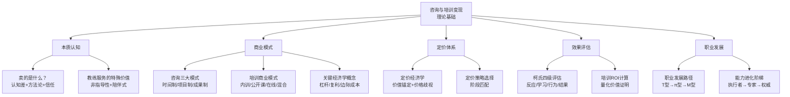
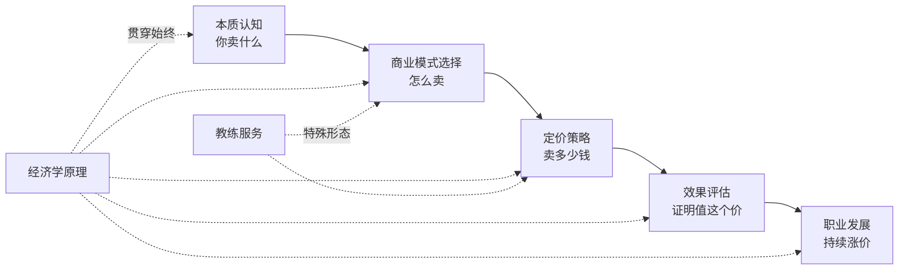

## 十、本节总结

### 1. 理论基础全景回顾

本节从八个维度系统拆解了咨询与培训行业的底层逻辑。在进入核心技巧和实战案例之前，有必要将这些理论框架串联成一个完整的认知地图，让你在实操时始终知道"为什么这样做"。

#### 核心知识框架



---

### 2. 八大理论模块核心要点提炼

#### 模块一：咨询行业的本质——卖的到底是什么？

咨询行业卖的不是时间，不是报告，不是PPT，而是三样东西：

| 层级 | 卖的是什么 | 客户感知价值 | 举证方式 |
|------|-----------|-------------|---------|
| 表层 | 方案与建议 | "他给了我们一份很专业的报告" | 交付物质量 |
| 中层 | 认知差与方法论 | "他看到了我们看不到的东西" | 诊断深度、框架独创性 |
| 底层 | 信任与确定性 | "有他在，我心里踏实" | 过往案例、行业口碑 |

**关键洞察：** 新手咨询顾问卖表层，资深顾问卖中层，行业权威卖底层。你的定价能力和你能卖到哪一层直接相关。一个年收费500万的战略顾问，卖的不是那份200页的报告，而是"让CEO做出这个重大决策时心里有底"的信任感。

#### 模块二：咨询行业的三大商业模式

本节详细对比了按时间收费、按项目收费、按成果收费三种模式的优劣：

| 维度 | 按时间收费 | 按项目收费 | 按成果收费 |
|------|-----------|-----------|-----------|
| 收入可预测性 | 高 | 中 | 低 |
| 收入天花板 | 低（受限于工时） | 中 | 高（理论上无上限） |
| 效率悖论 | 存在（越快赚越少） | 不存在 | 不存在 |
| 适用阶段 | 入行初期 | 有一定案例积累 | 顶级专家 |
| 典型报价 | 500-5000元/小时 | 5万-500万/项目 | 基础费+绩效提成 |
| 核心风险 | 时间碎片化 | 范围蔓延 | 成果不可控 |

**关键洞察：** 三种模式不是"选一个"的关系，而是职业发展的阶梯。大多数成功的独立咨询顾问最终会形成"基础时间收费（维护老客户）+ 项目收费（主力收入）+ 少量成果收费（高端客户）"的组合模式。

#### 模块三：培训行业的商业模式

培训行业的四种商业模式各有适用场景：

| 模式 | 单场收入 | 规模化能力 | 品牌效应 | 门槛 |
|------|---------|-----------|---------|------|
| 企业内训 | 2万-50万/场 | 低（受限于讲师时间） | 中 | 高（需行业口碑） |
| 公开课 | 500-5000元/人 | 中（受限于场地） | 高 | 中 |
| 在线课程 | 99-9999元/份 | 极高（边际成本趋零） | 高（长尾效应） | 低（但竞争激烈） |
| 混合式（OMO） | 灵活组合 | 高 | 高 | 中高 |

**关键洞察：** 最优路径是"内训立口碑 → 公开课建品牌 → 在线课程做规模化"。直接跳到在线课程，缺乏线下授课的打磨和案例积累，很难做出真正有竞争力的产品。

#### 模块四：教练服务（Coaching）的特殊价值

教练服务与传统咨询/培训的本质区别在于：咨询顾问是"给答案的人"，培训师是"教方法的人"，而教练是"帮你找到自己答案的人"。

| 维度 | 咨询顾问 | 培训师 | 教练 |
|------|---------|--------|------|
| 核心方法 | 诊断+方案 | 教授+练习 | 提问+引导 |
| 知识流向 | 顾问→客户 | 讲师→学员 | 双向探索 |
| 客户角色 | 信息提供者 | 学习者 | 思考主体 |
| 适用场景 | 明确问题需要解决方案 | 需要系统学习某项技能 | 自我认知、决策、成长 |
| 交付周期 | 数周到数月 | 数小时到数天 | 数月到数年 |
| 收费模式 | 项目制/时间制 | 按场/按人 | 按月/按季度/按年 |

**关键洞察：** 教练服务的壁垒不在方法论，而在信任关系和陪伴深度。因此它的客户粘性最强、续费率最高、转介绍率最高。一个成熟的个人教练，60%以上的新客户来自老客户转介绍。

#### 模块五：关键经济学概念

咨询与培训行业有几个独特的经济学特征，理解它们是制定商业策略的基础：

**杠杆效应：** 你花100小时研发的方法论，可以服务100个客户。每新增一个客户的边际成本趋近于零，但收入是100%增量。这是咨询行业"越做越轻松"的底层逻辑。

**复利效应：** 每一个成功案例都在为下一个项目背书。从业5年和从业15年的咨询顾问，收费差距可以达到10-20倍，但工作强度差距可能不到2倍。经验积累本身就是最深的护城河。

**信息不对称：** 客户之所以找你，是因为他们"知道自己不知道什么"。这种信息不对称是咨询行业存在的根本原因，但也是信任危机的根源——客户永远在怀疑"你是不是真的值这个价"。

**锚定效应：** 你的定价不需要等于你的成本加合理利润，而需要等于客户感知到的价值。一个帮助企业节省500万成本的咨询项目，收费100万客户觉得便宜；收费5万的方案如果没效果，客户觉得贵。

**网络效应：** 你的每一个客户关系都可能带来新的客户关系。咨询行业70%以上的业务来自口碑和转介绍，这是所有获客方式中成本最低、转化率最高的。

#### 模块六：定价经济学

定价是咨询与培训变现中最被低估的能力。同样的专业水平，定价能力的差异可以导致收入差距达到5-10倍。

**定价的核心原则：**

| 原则 | 解释 | 实操建议 |
|------|------|---------|
| 价值锚定 | 定价基于客户获得的价值，而非你投入的时间 | 永远先问"这个问题如果得不到解决，客户损失多少钱" |
| 价格歧视 | 不同客户可以接受不同价格 | 设计阶梯产品（基础版/标准版/高级版） |
| 心理定价 | 价格传递品质信号 | 低于市场均价会被质疑能力，高于均价需要更强的背书 |
| 动态定价 | 随品牌成长逐步提价 | 每完成10个成功案例，提价10%-20% |

**不同阶段的定价策略：**

- **入行期（0-2年）：** 低价切入积累案例，但不要免费——免费会毁掉你的价值感。可以按市场价的50%-70%收费。
- **成长期（2-5年）：** 提价到市场均价水平，开始筛选客户。不再接所有项目，只接能出成果的项目。
- **成熟期（5年以上）：** 定价高于市场均价，用案例和口碑筛选客户。可以拒绝不匹配的客户。

#### 模块七：培训效果的评估与优化

培训效果评估是培训师能否持续获得订单的关键。没有效果评估的培训，就是"自说自话"。

**柯氏四级评估模型：**

| 层级 | 评估内容 | 评估方法 | 时间节点 |
|------|---------|---------|---------|
| L1 反应层 | 学员满意度 | 课后问卷（目标>4.5/5） | 课程结束当天 |
| L2 学习层 | 知识技能掌握 | 测试/实操考核（目标>80%通过率） | 课程结束前后 |
| L3 行为层 | 学以致用程度 | 360度评估/行为观察 | 课后1-3个月 |
| L4 结果层 | 业务指标改善 | KPI对比分析 | 课后3-6个月 |

**培训ROI计算公式：**

```text
培训ROI = (培训带来的收益 - 培训总成本) / 培训总成本 × 100%
```

其中：
- 培训收益 = 效率提升带来的成本节省 + 业绩提升带来的增量收入 + 错误减少带来的损失避免
- 培训总成本 = 讲师费用 + 场地费用 + 学员误工成本 + 材料费用 + 后勤费用

**关键洞察：** 大多数培训师只做到L1评估（满意度），做到L3（行为改变）的不到20%，做到L4（业务结果）的不到5%。但恰恰是L3和L4的评估数据，才是你下次报价时最有力的武器。

#### 模块八：咨询顾问的职业发展路径

咨询顾问的成长不是线性的，而是阶梯式的：

| 阶段 | 典型年限 | 核心能力 | 典型收入（年） | 关键任务 |
|------|---------|---------|--------------|---------|
| 执行者 | 0-2年 | 执行交付、工具使用 | 10万-30万 | 学会"怎么做" |
| 项目负责人 | 2-5年 | 项目管理、客户沟通 | 30万-80万 | 学会"管项目" |
| 行业专家 | 5-10年 | 行业洞察、方法论 | 80万-300万 | 学会"诊断问题" |
| 思想领袖 | 10年+ | 商业判断、资源整合 | 300万+ | 学会"定义问题" |

**T型→π型→M型的能力进化：**

- **T型：** 一个专业领域的深度 + 跨领域的基本素养。适合初级顾问，聚焦一个细分领域做到极致。
- **π型：** 两个以上专业领域的深度 + 跨领域整合能力。适合中高级顾问，能够处理复杂的跨领域问题。
- **M型：** 多个领域的深度 + 战略视野 + 资源整合能力。适合行业领袖，能够定义问题和引领方向。

---

### 3. 理论之间的逻辑关系

这八个模块不是孤立的，它们构成一个从"认知"到"行动"的完整链条：



**逻辑链条说明：**

1. 先搞清楚"你卖的到底是什么"（模块一），这是所有决策的起点。
2. 然后选择"怎么卖"（模块二、三、四），根据你的资源、能力和阶段选择合适的商业模式。
3. 接着解决"卖多少钱"（模块五、六），利用经济学原理制定定价策略。
4. 交付后需要"证明值这个价"（模块七），用效果评估数据建立信任。
5. 最终实现"持续涨价"（模块八），随着职业发展不断提升单价和影响力。

---

### 4. 从理论到下一节的衔接

掌握了理论基础之后，你已经理解了咨询与培训行业的"道"——为什么这样做、底层逻辑是什么。接下来的"核心技巧"节将进入"术"和"器"的层面：

| 理论基础（本节） | 核心技巧（下一节） | 对应关系 |
|-----------------|-------------------|---------|
| 咨询的本质 | 个人咨询业务搭建五步法 | 从认知到落地 |
| 商业模式选择 | 企业培训业务核心技巧 | 从模式到执行 |
| 经济学原理 | 行业顾问专业壁垒构建 | 从原理到护城河 |
| 教练服务价值 | 教练服务实操技巧 | 从价值到交付 |
| 定价经济学 | 咨询项目管理技巧 | 从定价到交付管理 |
| 效果评估 | 时间管理 | 从评估到效率 |
| 职业发展路径 | 个人品牌建设 | 从路径到品牌 |

---

### 5. 自检清单：你的理论认知到位了吗？

在进入实操之前，用以下问题检验自己对理论基础的掌握程度：

**本质认知：**
- [ ] 我能用一句话说清楚"我卖的是什么"
- [ ] 我知道我的服务在客户眼中的价值层级（表层/中层/底层）
- [ ] 我能区分咨询、培训、教练三种服务形态的本质差异

**商业模式：**
- [ ] 我选择了适合当前阶段的收费模式（时间/项目/成果）
- [ ] 我设计了从低价到高价的产品阶梯
- [ ] 我了解每种模式的风险和应对策略

**定价能力：**
- [ ] 我的定价基于客户感知价值，而非自我评估
- [ ] 我能说清楚"为什么我值这个价"
- [ ] 我有明确的提价计划和触发条件

**效果证明：**
- [ ] 我有至少一种方式量化我的服务效果
- [ ] 我收集了至少3个可量化的成功案例
- [ ] 我能用数据（而非感觉）证明我的价值

**职业规划：**
- [ ] 我知道自己处于职业发展的哪个阶段
- [ ] 我有清晰的下一步能力提升计划
- [ ] 我知道从当前位置到下一个阶段需要跨越的关键障碍

如果以上清单有超过3项未勾选，建议重新阅读对应的理论模块，再进入下一节的实操内容。

---

### 6. 常见的认知误区总结

基于理论基础的学习，以下是最容易产生的认知误区：

| 误区 | 正确认知 | 实际影响 |
|------|---------|---------|
| "我的专业能力越强，收入越高" | 专业能力只是入场券，商业模式和定价能力才是收入的决定因素 | 很多顶级专家收入不如会包装的普通顾问 |
| "客户买的是我的时间" | 客户买的是结果和确定性，时间只是计量单位之一 | 按时间收费会陷入效率悖论 |
| "培训效果好自然有口碑" | 没有量化评估的效果等于没有效果，没有数据支撑的口碑是脆弱的 | 很多优秀培训师因为不会量化价值而无法提价 |
| "教练就是聊天，门槛低" | 教练需要极强的倾听能力、提问能力和情绪管理能力，训练周期长达数百小时 | 大量半吊子教练涌入拉低了行业信任度 |
| "先免费做，有名气了再收费" | 免费会永久性地锚定你的价值感，付费客户的满意度和配合度远高于免费客户 | 免费客户不珍惜，也无法转化为付费客户 |
| "定价越高越好" | 定价需要匹配你的品牌力和交付能力，超出能力范围的定价会透支信任 | 承诺过高、交付不足，口碑崩塌 |

---

### 7. 核心公式与模型速查

将本节涉及的关键公式和模型汇总，方便后续实操时快速查阅：

**个人产能公式：**

```text
年收入 = 日费率 × 有效工作天数 × 产能利用率
```

示例：日费率5000元 × 200个工作日 × 80%产能利用率 = 80万元/年

**培训ROI公式：**

```text
ROI = (培训收益 - 培训成本) / 培训成本 × 100%
```

**客户终身价值公式：**

```text
客户终身价值 = 单次服务费 × 复购次数 × 转介绍系数
```

示例：单次5万 × 年均2次 × 3年周期 × 1.5转介绍系数 = 45万元/客户

**定价区间公式：**

```text
合理定价区间 = [客户感知价值 × 10%, 客户感知价值 × 30%]
```

示例：你帮客户解决的问题价值100万，你的收费区间在10万-30万之间。

**时间杠杆公式：**

```text
杠杆率 = 总收入 / 个人直接服务时间
```

杠杆率越高，说明你的时间利用效率越高。目标是从1:1（卖时间）提升到1:10甚至1:100（通过产品化、团队化、品牌化）。

---

### 8. 下一步行动建议

理论学习的最终目的是指导行动。以下是基于本节内容的具体行动建议：

**如果你是完全的新手（从未做过咨询/培训）：**
1. 完成上一节的自检清单，明确自己的知识缺口
2. 选择一个你最有经验的细分领域，用一句话定义"我卖的是什么"
3. 阅读下一节"核心技巧"中的"个人咨询业务搭建五步法"，开始搭建你的第一个服务产品

**如果你已经在做但收入不高（年收入<30万）：**
1. 审视自己的定价策略——很可能你的定价低于你的价值
2. 用柯氏四级评估模型重新设计你的效果评估体系
3. 收集3个可量化的成功案例，作为提价的依据

**如果你已经是资深从业者（年收入>50万）：**
1. 思考如何从"卖时间"转向"卖产品"——在线课程、方法论授权、合伙人模式
2. 构建你的第二专业领域（从T型到π型）
3. 建立个人品牌护城河——出书、演讲、行业影响力

无论你处于哪个阶段，下一步都是：进入"核心技巧"节，将理论转化为可执行的行动方案。
