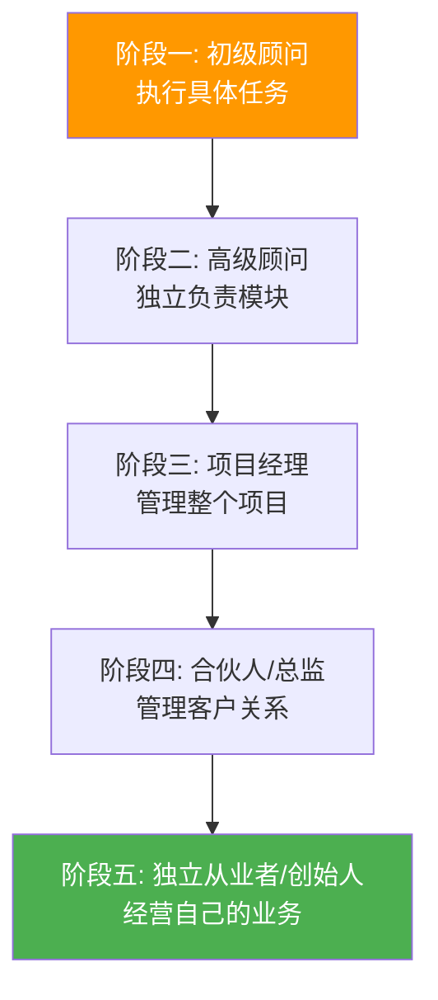
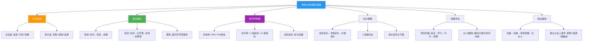

## 六、本节核心要点

本节从行业本质、商业模式、经济学原理、定价策略、效果评估和职业路径六个维度，系统拆解了咨询与培训行业的理论根基。以下将本节所有关键认知浓缩为可随时查阅的要点地图，帮助你在实操阶段快速回溯理论支撑。

---

### 要点一：咨询行业的本质——卖认知差和执行差

这是整个咨询行业最底层的逻辑。理解它，你才能理解后面的定价、获客、交付一切行为的合理性。

**认知差（Cognition Gap）：** 同样的信息，你能看到本质，客户不能。认知差来自三个层面：

| 层次 | 定义 | 示例 |
|------|------|------|
| 信息差 | 你知道但客户不知道的事实 | 某行业的供应链成本结构、竞品的真实运营数据 |
| 分析差 | 你能从数据中提取洞察，客户不能 | 从财务报表中识别出业务健康度的隐藏风险 |
| 判断差 | 你能预判趋势和风险，客户不能 | 看到某商业模式三年后的结构性瓶颈 |

**执行差（Execution Gap）：** 客户知道该做什么但做不了，你能帮他做到。执行差来自：

| 层次 | 定义 | 示例 |
|------|------|------|
| 流程差 | 你有成熟的方法论和工具，客户没有 | 标准化的选址评估模型、项目管理模板 |
| 经验差 | 你踩过的坑，客户不需要再踩 | 知道某个供应商会在什么环节掉链子 |
| 资源差 | 你有客户没有的人脉、渠道、技术 | 行业数据库、专家网络、技术团队 |

**核心公式：** 你的定价能力 ∝ 认知差深度 × 执行差宽度

**自检三问：**
1. 在我的领域，我能告诉客户哪些他不知道的事情？
2. 同样的任务，我做比他内部团队做快多少倍？
3. 如果客户把我的方案拿给另一个执行者做，效果会差多少？

如果三个问题你都答不上来，说明差异化还不够清晰，需要继续积累。

---

### 要点二：三大商业模式——按时间、按项目、按成果

这不是三种"选择"，而是一条阶梯式升级路径。每个阶段的咨询顾问都应该清楚自己在哪里、下一步往哪走。

| 维度 | 按时间收费 | 按项目收费 | 按成果收费 |
|------|-----------|-----------|-----------|
| 收入公式 | 时薪 × 工时 | 固定报价 | 基础费 + 成果分成 |
| 收入天花板 | 低（受限于个人时间） | 中（受限于项目数量） | 高（与客户价值挂钩） |
| 核心能力 | 专业执行 | 项目管理 | 商业洞察 |
| 客户关系 | 甲乙方 | 合作伙伴 | 利益共同体 |
| 风险承担 | 低 | 中 | 高 |
| 典型适用 | 起步阶段、技术顾问 | 成长阶段、管理咨询 | 成熟阶段、战略顾问 |
| 价格区间（参考） | 500-50000元/天 | 1万-500万/项目 | 基础费 + 5%-30%提成 |

**升级条件：**

```text
按时间 → 按项目：需要足够的案例和流程，能准确估算项目工时和成本
按项目 → 按成果：需要对客户业务有足够深的理解，能预测和量化咨询带来的价值
```

**关键提醒：** 不要跳级。没有足够的案例和流程能力就做按项目收费，会导致报价不准、亏损交付。没有深入理解客户业务就做按成果收费，会导致收入极不稳定、甚至倒贴。

---

### 要点三：培训行业的四大商业模式

培训行业与咨询行业有本质区别——咨询卖的是"解决方案"，培训卖的是"能力转移"。这个区别决定了培训的商业模式有其独特性。

| 模式 | 定义 | 收入结构 | 典型价格 | 核心挑战 |
|------|------|----------|----------|----------|
| 企业内训 | 到客户公司现场授课 | 按场收费 | 2万-50万/天 | 获客依赖渠道和口碑 |
| 公开课 | 面向社会招生的开放课程 | 按人头收费 | 2000-20000元/人 | 招生压力大，需要品牌 |
| 在线课程 | 录播或直播的数字课程 | 课程费 + 持续分成 | 9.9-9999元 | 需要流量和内容运营 |
| 训练营 | 带练习和反馈的系统化培训 | 按期收费 | 5000-50000元/期 | 交付重，运营成本高 |

**杠杆效应对比：**


**收入结构演进路径：** 内训起步（积累案例和口碑）→ 公开课（建立品牌）→ 在线课程（扩大规模）→ 训练营（高客单+高口碑）。不要一开始就做在线课程，因为没有案例和口碑的在线课程很难卖出高价。

---

### 要点四：教练服务（Coaching）的特殊价值

教练服务是咨询与培训的"第三条赛道"，它与传统咨询有根本性的区别。

**三者对比：**

| 维度 | 咨询（Consulting） | 培训（Training） | 教练（Coaching） |
|------|-------------------|-----------------|-----------------|
| 核心动作 | 诊断+给方案 | 讲授+练习 | 提问+引导 |
| 知识流向 | 顾问 → 客户 | 讲师 → 学员 | 学员自己发现 |
| 适用场景 | 有明确问题需要解决方案 | 需要系统学习某项能力 | 需要自我认知和行为改变 |
| 客户参与度 | 低（等方案） | 中（听课练习） | 高（深度对话） |
| 效果衡量 | 方案是否落地 | 知识是否掌握 | 行为是否改变 |
| 典型价格 | 1万-500万/项目 | 5000-50万/场 | 500-5000元/小时 |

**教练服务的核心价值在于：** 帮助客户自己找到答案，而不是替客户做决定。这听起来很"虚"，但恰恰是高管和高净值人群最需要的——他们不缺建议，缺的是能帮他们梳理思路、做出决策的"思维伙伴"。

**教练服务的三大增长驱动力：**
1. **个人成长意识觉醒**——越来越多人愿意为自我提升付费
2. **企业高管需求**——高管教练已成为大企业的标配
3. **心理健康意识提升**——人生教练与心理咨询形成互补

**入行门槛：** 教练服务的进入门槛看似低（不需要特定行业经验），但要做好很难。需要：系统的教练技术训练（ICF认证课程）、持续的督导和自我觉察、以及极强的共情和倾听能力。

---

### 要点五：关键经济学概念——利用率、杠杆率、边际成本

这三个概念是理解咨询业务财务模型的基石。

#### 利用率（Utilization Rate）

**定义：** 实际收费时间 ÷ 总可用时间

```text
利用率 = 收费天数 / 250个工作日（年）
```

**行业基准：**

| 利用率水平 | 含义 | 对应状态 |
|-----------|------|----------|
| <40% | 严重低效，大量时间空转 | 起步期，获客能力不足 |
| 40%-60% | 正常水平 | 稳定期 |
| 60%-75% | 高效运转 | 成熟期 |
| >75% | 过载，需要提价或扩团队 | 涨价信号 |

**关键洞察：** 利用率不是越高越好。超过75%意味着你没有时间做品牌建设、学习提升和客户关系维护，长期会导致服务质量下降。最佳策略是维持60%-70%的利用率，用剩余时间做"非收费但有价值"的事。

#### 杠杆率（Leverage Ratio）

**定义：** 团队人数 ÷ 合伙人/核心顾问人数

| 杠杆率 | 模型 | 代表 | 利润来源 |
|--------|------|------|----------|
| 1:1 | 独立顾问 | 个人工作室 | 全部归己 |
| 3:1 | 小型团队 | 精品咨询公司 | 团队溢价 |
| 6:1 | 中型团队 | 区域咨询公司 | 规模效应 |
| 10:1+ | 大型机构 | MBB/四大 | 品牌溢价+规模效应 |

**独立咨询顾问的核心矛盾：** 杠杆率为1:1意味着收入完全依赖个人时间，天花板很低。突破方式有两条：（1）提高单价（从按时间收费升级到按项目或按成果收费）；（2）建立小团队（雇佣初级顾问，自己做高级工作）。

#### 边际成本（Marginal Cost）

**咨询行业的核心优势：** 第一次交付成本最高（需要研究、准备、开发方法论），之后每次交付的边际成本趋近于零。

```text
边际成本曲线：
第1个客户: ████████████████████ 高（开发成本）
第2个客户: ████████ 中（调整适配）
第3个客户: ████ 低（流程复用）
第10个客户: █ 极低（成熟复用）
```

**实操意义：** 前几个客户注定是"亏"的（如果把开发时间算进去），这是正常的。关键是让方法论快速成熟，从第3-5个客户开始盈利。不要因为前几个项目"性价比低"就放弃——它们是你的"产品研发成本"。

---

### 要点六：定价经济学——价值锚定而非成本加成

咨询行业最常见的定价错误是按成本定价（"我花了一天，所以收一天的钱"），正确的做法是按价值定价（"我帮你省了100万，所以收10万"）。

**定价的三层逻辑：**

| 定价层次 | 逻辑 | 适用阶段 | 价格区间 |
|----------|------|----------|----------|
| 成本定价 | 我的时间成本 + 合理利润 | 起步期 | 500-2000元/小时 |
| 市场定价 | 同行的平均价格水平 | 成长期 | 参考市场均价 |
| 价值定价 | 客户获得的价值 × 合理比例 | 成熟期 | 无上限 |

**价值定价的实操方法：**

1. **量化客户的痛点成本：** 客户当前面临的问题，每年给他造成多少损失？如果损失是500万，你收50万解决它，客户会觉得"太值了"。
2. **设定锚定价格：** 先给客户看一个高价格的方案（比如100万的全流程咨询），再给一个中等价格的方案（比如30万的核心模块），客户更可能选择后者。
3. **提供价格阶梯：** 给客户三个选项（基础/标准/高级），让客户自己选择，而不是你单方面报价。

**涨价的信号和节奏：**

```text
涨价信号：
- 利用率持续超过70%
- 客户犹豫时间从"一周"缩短到"一天"
- 老客户转介绍率上升
- 你的交付质量明显高于同行

涨价节奏：
- 每年涨价10%-20%（常规）
- 每积累5个成功案例涨一次价（案例驱动）
- 每次服务完大客户后涨价（品牌驱动）
```

---

### 要点七：培训效果评估——柯氏四级评估模型

培训行业最大的痛点是"效果说不清"。柯氏四级评估模型（Kirkpatrick Model）是行业公认的评估标准，帮你从"感觉有用"进化到"数据证明有用"。

| 级别 | 评估内容 | 评估方式 | 时间节点 | 权重 |
|------|----------|----------|----------|------|
| L1 反应 | 学员满不满意 | 满意度问卷 | 课程结束当天 | ★★ |
| L2 学习 | 学员学没学会 | 考试/测评 | 课程结束1周内 | ★★★ |
| L3 行为 | 学员用没用上 | 上级评估/行为观察 | 课程结束1-3个月 | ★★★★ |
| L4 结果 | 业务有没有改善 | KPI对比 | 课程结束3-6个月 | ★★★★★ |

**关键认知：** 大多数培训师只做到L1（满意度），企业真正买单的是L4（业务结果）。能够提供L3-L4评估的培训师，定价能力和续约率远高于只做L1的培训师。

**如何从L1升级到L4：**
- L1→L2：设计课后测验，量化知识掌握程度
- L2→L3：设计"课后行动计划"，让学员的上级参与监督
- L3→L4：与客户约定可量化的业务KPI，培训前后对比

---

### 要点八：咨询顾问的职业发展路径

咨询顾问的职业发展不是线性的，而是一条从"执行者"到"经营者"的阶梯式升级。



**各阶段核心能力和收入参考：**

| 阶段 | 核心能力 | 年收入参考 | 关键转折 |
|------|----------|-----------|----------|
| 初级顾问 | 专业执行、报告撰写 | 15-40万 | 学会结构化思维 |
| 高级顾问 | 独立诊断、方案设计 | 40-100万 | 学会客户沟通 |
| 项目经理 | 项目管理、团队协调 | 80-200万 | 学会管理他人 |
| 合伙人/总监 | 客户经营、业务拓展 | 150-500万+ | 学会卖项目 |
| 独立从业者 | 全栈能力、个人品牌 | 50-1000万+ | 学会经营自己 |

**独立从业的关键决策点：** 从"高级顾问"到"独立从业者"的跳转，是大多数人面临的最关键决策。需要满足三个条件：（1）有至少3个可展示的成功案例；（2）有稳定的获客渠道（至少2个）；（3）有6-12个月的生活储备金。不要在没有准备的情况下裸辞创业。

---

### 要点九：本节核心知识图谱

将本节所有内容串联为一张知识地图，方便快速回忆和查阅：



---

### 要点十：理论到实践的行动清单

理论的价值在于指导行动。以下是本节每个核心概念对应的实操行动项：

| 理论概念 | 立即行动 | 完成标准 |
|----------|----------|----------|
| 认知差/执行差 | 写出你所在领域的3个认知差和3个执行差 | 能一句话说清楚你的差异化价值 |
| 三大商业模式 | 确定你当前所处的收费阶段 | 知道自己该按时间/项目/成果收费 |
| 培训商业模式 | 选择一个最适合你的培训模式 | 能描述你的培训产品形态 |
| 教练服务 | 评估你是否适合做教练 | 做出"进入/不进入"的判断 |
| 利用率 | 计算你当前的利用率 | 知道自己的效率水平 |
| 定价策略 | 用价值定价法重新计算你的报价 | 至少比当前价格高20% |
| 柯氏评估 | 设计一个L2级别的评估方案 | 有可执行的测评方案 |
| 职业路径 | 确定你当前的职业阶段 | 知道下一步需要突破什么能力 |

**最重要的一个行动：** 如果你还没有开始做咨询或培训，现在就用"定位公式"写出你的定位——"我帮助【目标客户】解决【具体问题】，通过【独特方法】。"把这句话发到朋友圈，看看有没有人回复"这个具体怎么做"。如果有，你就有了第一个潜在客户。

---

### 要点十一：常见理论认知误区

| 误区 | 真相 | 纠正方法 |
|------|------|----------|
| "咨询就是卖建议" | 咨询卖的是认知差+执行差，建议只是载体 | 问自己：客户能不能自己在网上搜到这些建议？ |
| "培训师讲课好就行" | 讲课是基本功，获客和交付才是核心 | 把50%的精力花在课前需求调研和课后效果跟踪上 |
| "按时间收费最安全" | 按时间收费是效率悖论——你越高效赚得越少 | 尽快建立可复用的方法论，向按项目收费升级 |
| "教练就是聊天" | 教练有系统的技术框架（GROW模型、NLP等） | 接受正规的教练技术培训，考取ICF认证 |
| "价格低好卖" | 低价吸引的是最挑剔的客户，高价吸引的是最信任你的客户 | 先建立信任，再报价；先给价值，再谈价格 |
| "我需要很多证书" | 案例和口碑 > 证书 | 先积累3个成功案例，再考虑考证 |
| "边上班边做副业太难" | 很多成功的独立咨询顾问都是从副业起步的 | 用周末时间做第一个免费项目，验证可行性 |

---
