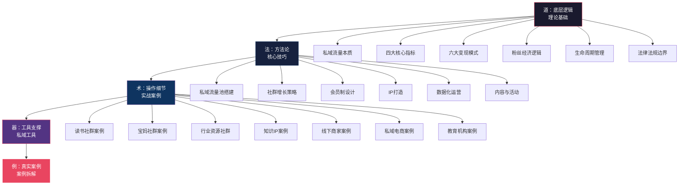
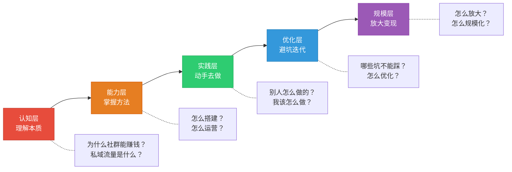

# 第二十四章 社群与私域流量

## 一、本章定位与核心命题

如果说上一章的咨询与培训是"一对一"的价值交付，那么社群与私域流量就是"一对多"的价值放大器——它解决的不是"如何服务一个人"，而是**"如何用同一份精力同时服务一千个人，并让这一千个人互相产生价值"**。

这背后有一个关键的经济学原理：**边际成本递减**。你写一篇干货文章，发给1个人和发给1000个人的成本几乎一样；你做一场直播分享，10个人看和1000个人看，你付出的时间完全相同。社群和私域流量的本质，就是把你的知识、技能、资源的交付成本摊薄到接近于零，从而实现"一份时间卖多次"的商业模式。

2024-2026年，中国互联网的获客环境发生了根本性变化。抖音、小红书、微信公众号等公域平台的获客成本在过去5年上涨了3-10倍，单个粉丝获取成本从几毛钱飙升到几块甚至几十块钱。与此同时，平台算法的不确定性意味着——你今天有100万播放量，明天可能只有1000。**把用户沉淀到自己可控的私域中，从"租流量"变为"拥有流量"，已经成为每一个想靠互联网赚钱的人的必修课。**

本章将从底层逻辑到实操方法，从0到1系统拆解社群运营和私域流量变现的完整知识体系，帮你搭建属于自己的"流量资产"。

***

## 二、知识框架全景图

本章的知识体系可以概括为"道、法、术、器、例"五个层次：

**五层之间的关系：**

- **道（理论基础）** 是地基——不理解私域流量的本质和底层逻辑，后面所有操作都是空中楼阁
- **法（核心技巧）** 是框架——告诉你"怎么做"，提供可复制的方法论
- **术（实战案例）** 是验证——通过真实案例告诉你"别人怎么做到的"，以及你如何借鉴
- **器（工具）** 是加速器——好的工具可以让效率提升10倍
- **例（练习方法）** 是转化——知识只有通过实践才能变成能力

***

## 三、读者自测：你处于哪个阶段？

在正式学习之前，花2分钟做个小测试，了解自己当前的水平，以便有针对性地学习：

| 阶段 | 描述 | 需要重点学习的内容 |
|------|------|-------------------|
| **纯小白** | 从未建过社群，不知道私域流量是什么 | 从理论基础开始，逐节学习 |
| **有概念** | 知道社群/私域的概念，但没有实操经验 | 重点学习核心技巧，跳过基础理论 |
| **有尝试** | 建过群，但群很快就"死"了或变现困难 | 重点学习实战案例和常见误区 |
| **有基础** | 运营过社群，有一些付费会员，想做大 | 重点学习增长策略和变现模式优化 |
| **有规模** | 社群规模500+，想系统化运营和规模化变现 | 重点学习数据化运营、商业模式创新 |

无论你处于哪个阶段，建议至少快速浏览理论基础部分——很多看似"简单"的概念，大多数人的理解都是片面的。

***

## 四、本章核心内容导览

### 第一节：理论基础——社群与私域的底层逻辑

本节解决的核心问题：**社群为什么能赚钱？私域流量的本质是什么？**

这一节是整章的"地基"。你将理解：

- **私域流量的本质**：不是"加了多少微信好友"，而是一种你可以自由触达、反复使用、不依赖平台的数字资产。类比房产——公域流量是租房（房东随时可以赶你走），私域流量是买房（完全属于你）
- **四大核心指标体系**：活跃度、留存率、转化率、裂变系数。这四个指标就像汽车的仪表盘——不看仪表盘开车是找死，不看指标运营社群是"盲人摸象"
- **六大变现模式**：付费会员、广告合作、电商带货、活动变现、咨询培训、资源对接。不是只能选一种，而是要根据你的社群特点组合使用
- **粉丝经济的底层逻辑**：1000个铁杆粉丝理论的中国市场验证——你不需要百万粉丝，200-2000个铁杆粉丝就能支撑一份体面的收入
- **社群生命周期管理**：从创建期到衰退期的五个阶段，每个阶段的核心任务和关键指标
- **法律法规边界**：社群运营不是法外之地，涉及用户隐私、广告法、分销合规等法律红线

### 第二节：核心技巧——社群搭建与运营实操

本节解决的核心问题：**如何从0到1搭建一个能赚钱的社群？**

这是整章的"实操手册"。你将学会：

- **私域流量池搭建**：微信生态（视频号→公众号→个人微信/企业微信→微信群→小程序）的完整布局，以及企业微信与个人微信的选择策略
- **从0到1000人的增长路径**：冷启动（0-100人，靠个人邀请和种子用户）→快速增长（100-500人，靠裂变和内容引流）→稳定增长（500-1000人，靠口碑和分层运营）
- **会员制商业模式设计**：定价策略、权益设计、升级路径，如何让"价格"成为最好的筛选器
- **社群IP打造**：从个人品牌到社群品牌，如何让你的社群成为某个领域的"代名词"
- **数据化运营**：如何用数据驱动决策，而非靠"感觉"运营
- **内容运营与活动策划**：每日/每周/每月的运营节奏，以及高参与度活动的策划方法
- **私域工具推荐**：企业微信工具、社群管理工具、内容创作工具、数据分析工具

### 第三节：实战案例——成功案例拆解

本节解决的核心问题：**别人是怎么通过社群年入百万的？**

本节拆解了7个真实案例，覆盖了社群变现的主要模式：

| 案例 | 类型 | 核心模式 | 年收入规模 |
|------|------|---------|-----------|
| 读书社群 | 学习社群 | 会员制+课程+活动 | 200万 |
| 宝妈社群 | 兴趣社群 | 电商带货+广告 | 150万 |
| 行业资源社群 | B端社群 | 资源对接+活动 | 300万 |
| 知识IP社群 | 个人品牌 | 会员制+咨询+培训 | 500万 |
| 线下商家社群 | 本地生活 | 私域电商+复购 | 80万 |
| 私域电商 | 电商社群 | 自营产品+分销 | 1000万 |
| 教育培训机构 | 教育行业 | 课程+续费+转介绍 | 800万 |

每个案例都会拆解：背景→定位→冷启动→增长→变现→数据→踩过的坑。不是让你照搬，而是理解背后的逻辑，找到适合自己的路径。

### 第四节：常见误区——避坑指南

本节解决的核心问题：**社群运营有哪些常见的"坑"？**

总结了8个最常见的误区：

1. 把"拉群"等同于"做社群"
2. 只关注拉新，不关注留存
3. 过度商业化，把社群变成"广告群"
4. 不做筛选，来者不拒
5. 忽视社群的"社交价值"
6. 定价太低，价值感不足
7. 不做数据追踪，"感觉"运营
8. 一个人扛所有运营工作

每个误区都配有：表现症状、问题根源、真相揭示、解决方案。建议在开始运营社群之前通读一遍，能帮你避开80%的坑。

### 第五节：练习方法——实战练习

本节解决的核心问题：**如何一步步培养社群运营能力？**

设计了7个递进式练习：

1. **社群定位画布**（30分钟）——确定你的社群定位和核心价值主张
2. **社群冷启动实战**（7天）——从0搭建50人种子社群
3. **社群内容日历制作**（1小时）——规划4周的内容节奏
4. **社群活动策划**（1次活动）——策划并执行一次线上活动
5. **私域转化路径设计**（1小时）——设计从陌生人到付费会员的完整路径
6. **会员权益设计实战**（1.5小时）——设计完整的会员权益体系
7. **30天社群运营挑战**（30天）——从0搭建一个能产生收入的社群

这些练习从易到难，建议按顺序完成。完成全部7个练习后，你就具备了独立运营一个社群的完整能力。

***

## 五、本章的逻辑主线

整章围绕一条清晰的逻辑主线展开：

每个阶段的学习重点不同：

- **认知层**（理论基础）：不要跳过。很多人的社群做不好，不是因为执行力不够，而是认知有偏差。花1-2小时建立正确的认知框架
- **能力层**（核心技巧）：重点学习。这是"怎么做"的部分，建议边学边做笔记
- **实践层**（实战案例+练习方法）：核心输出。案例帮你理解，练习帮你落地
- **优化层**（常见误区）：避坑指南。建议在开始实操前通读一遍
- **规模层**（深度拓展）：进阶内容。适合有基础的读者，涉及数据分析、技术架构、商业模式创新、社群治理等高阶话题

***

## 六、学完本章你能获得什么？

完成本章学习和练习后，你将具备以下五项核心能力：

| 能力 | 具体描述 | 对应章节 |
|------|---------|---------|
| **认知判断力** | 理解私域流量的本质、社群的核心指标和变现逻辑，能判断一个社群模式是否可行 | 理论基础 |
| **搭建执行力** | 掌握从0到1搭建私域流量池和社群的完整方法，包括渠道选择、增长策略、运营节奏 | 核心技巧 |
| **变现设计力** | 能根据社群特点设计最优的变现组合（会员制、电商、活动、咨询等），而不是只会"卖课" | 核心技巧+案例 |
| **避坑免疫力** | 熟知8大常见误区及其解决方案，在实操中能避开绝大多数"坑" | 常见误区 |
| **持续优化力** | 能通过数据分析发现社群运营的问题，并持续优化。不是"建了就完事"，而是长期经营 | 练习方法+深度拓展 |

***

## 七、前置知识与后续延伸

**建议先学习的章节：**
- 第22章（个人IP与品牌建设）——社群的根基是个人品牌，先有"人设"才能做社群
- 第23章（咨询与培训）——社群变现的重要方式之一，先理解一对一交付再学一对多

**学完后可以延伸的方向：**
- 第25章（电商与新零售）——社群电商是私域变现的重要模式，学完本章后可深入学习电商运营
- 第26章（内容创业）——社群与内容是互相赋能的关系，好的内容引流社群，好的社群反哺内容
- 第27章（知识付费）——付费社群是知识付费的重要载体，两者有大量交叉

***

## 八、关键术语速查

在正式学习之前，先了解以下核心术语，避免后续阅读时产生困惑：

| 术语 | 英文 | 定义 |
|------|------|------|
| 私域流量 | Private Traffic | 你可以自由触达、反复使用、不需要额外付费的用户资源 |
| 公域流量 | Public Traffic | 依赖平台获取的流量，需要持续投入才能获得 |
| 用户画像 | User Persona | 目标用户的人口统计、行为习惯、需求偏好的综合描述 |
| 裂变系数 | Viral Coefficient | 平均每个成员能带来的新成员数量，>1表示社群可自我增长 |
| 留存率 | Retention Rate | 一定时间后仍留在社群中的成员比例 |
| 转化率 | Conversion Rate | 从社群成员到付费用户的转化比例 |
| LTV | Lifetime Value | 客户终身价值，一个用户在整个关系周期内贡献的总价值 |
| CAC | Customer Acquisition Cost | 客户获取成本，获取一个新用户的平均花费 |
| AARRR模型 | — | 获取→激活→留存→收入→推荐的用户增长漏斗模型 |
| SOP | Standard Operating Procedure | 标准操作流程，确保运营动作可复制、可规模化 |

***

## 九、写在前面的忠告

在正式开始学习之前，有三句话想提前说：

**第一句：社群不是"赚快钱"的工具。** 社群运营需要持续投入时间和精力，它的回报是"慢热型"的——前3个月可能看不到明显收入，但一旦社群运转起来，它会成为你最稳定的收入来源。急于变现的人不适合做社群。

**第二句：先服务好100个人，再想1000个人的事。** 很多人一上来就想做"万人群"，结果什么都做不好。先用小规模社群验证你的模式、打磨你的服务、积累你的口碑，再考虑规模化。

**第三句：社群的核心是"人"，不是"群"。** 一群人聚在一起不叫社群，一群有共同目标、共同价值观、有互动关系的人聚在一起才叫社群。运营社群，本质上是在运营人与人之间的关系。

准备好之后，我们正式开始。
