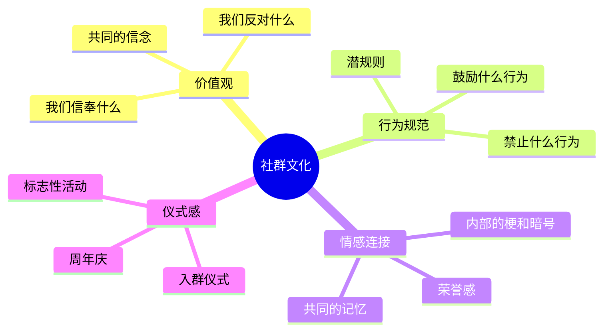

# 第二十四章 社群与私域流量——常见误区

社群运营看似门槛低——拉个群、发点内容、搞搞活动，谁都能做。但现实是，超过90%的社群在建立3个月内沦为"死群"，超过80%的付费社群续费率低于30%。失败的原因不是社群模式不行，而是运营者踩了坑却不自知。

本节系统梳理社群运营和私域流量中最常见的12个误区，每个误区都配有真实案例、数据佐证、诊断方法和纠正方案。建议在阅读时对照自检：你正在犯几个？

---

## 误区一：把"拉群"等同于"做社群"

**表现：** "我把500个人拉到一个微信群里，就是做社群了。"于是你拉了一个又一个群，看着人数从50到500到2000，很有成就感。但三个月后回看，群里除了广告就是沉默。

**本质问题：** 一群人聚在一起不叫社群，一群有共同目标、共同价值观、有互动关系的人聚在一起才叫社群。微信群只是一个容器，社群是一种关系网络。没有运营的微信群，只是一个"聊天室"，而且很快就会变成"广告群"或"死群"。

**真实案例：** 某知识博主在2023年一次性拉了20个微信群，每个群约300人，总计覆盖6000人。他没有安排运营人员，只在群里偶尔转发自己的公众号文章。6个月后，20个群中17个日活跃人数低于5人，3个群已经有人开始发赌博广告。最终他不得不解散所有群，重新开始。

**关键数据：** 根据行业观察，未运营的微信群平均"存活期"仅为28天。28天内如果没有建立有效的互动机制，群就会进入不可逆的衰退。

**诊断清单：**
- 你的群是否有明确的群规？（有/无）
- 你的群是否有固定的互动时间？（有/无）
- 你的群是否有专人负责运营？（有/无）
- 过去7天内，非管理员发起的讨论有几次？（__次）
- 你的群是否有入群门槛？（有/无）

如果以上5项中有3项以上回答"无"或数字很低，你的群大概率正在走向死亡。

**纠正方案：**

1. **建群前先回答三个问题：** 这个群为谁服务？提供什么核心价值？为什么他们需要聚在一起？
2. **设计运营节奏：** 每日早报/话题、每周分享/活动、每月复盘/福利，让成员形成期待。
3. **安排专人负责：** 哪怕只是兼职，也必须有人每天花30分钟维护群秩序和引导讨论。
4. **设置入群门槛：** 付费、问卷、推荐制——门槛本身就是筛选器，也是社群价值的信号。
5. **控制群规模：** 单个群不超过300人。超过300人后，成员之间的连接密度下降，互动质量降低。如果用户量大，宁可建多个垂直群，也不要一个大杂烩群。

***

## 误区二：只关注"拉新"，不关注"留存"

**表现：** "我的社群有5000人，每天还在增长。"但实际上，活跃的不到200人，付费的不到50人。你每天花大量时间做裂变、搞活动拉新人，却对老成员的流失视而不见。

**本质问题：** 社群的价值不在于总人数，而在于活跃度和转化率。一个500人的活跃社群，变现能力可能超过一个5000人的沉默社群。更关键的是，拉新的成本是留存成本的5-10倍——获取一个新用户的成本（内容制作、广告投放、活动策划）远高于维护一个老用户（一条关心的消息、一次专属福利）。

**真实案例：** 某健身社群创始人在半年内通过裂变活动将社群规模从200人扩展到3000人，月均增长超过400人。但他忽略了老成员的体验——新人涌入后社群质量下降，老成员觉得"变味了"，纷纷退群。半年后统计：累计入群3200人，仍在群内的仅800人，实际月活跃仅150人。他每月花5000元做拉新活动，但流失造成的隐性损失超过2万元。

**关键数据：**
- 拉新成本通常是留存成本的5-10倍（含内容、广告、人力）
- 用户留存率每提升5%，利润可提升25%-95%（贝恩咨询研究）
- 老用户的付费转化率是新用户的3-5倍
- 社群中60%-70%的收入来自20%的活跃老用户

**纠正方案：**

1. **建立留存监控机制：** 每周统计以下数据——7日活跃率、30日留存率、退群率、沉默用户占比。任何一个指标出现连续两周下滑，立即启动干预。
2. **设计"分层运营"策略：** 将成员分为活跃层（每周发言3次以上）、普通层（偶尔发言）、沉默层（超过14天无互动）。对不同层级采用不同策略——活跃层给予荣誉和特权，普通层引导参与，沉默层主动触达。
3. **建立"召回机制"：** 对超过30天未活跃的成员，发送私信——不是群发，而是一对一的、有具体内容的消息。例如："张哥，上周我们讨论了XX话题，想到你之前分享过类似经验，欢迎回来看看。"
4. **定期清理：** 对超过60天无互动且无付费行为的成员，礼貌告知后移出社群。这看似"减员"，实际上是在保护社群质量。

***

## 误区三：过度商业化，把社群变成"广告群"

**表现：** 每天在群里推产品、发广告、做促销。群成员感受到的不是"社群"，而是"被营销"。你觉得自己在"提供好物推荐"，成员觉得你在"割韭菜"。

**本质问题：** 社群的本质是"社交关系"，不是"销售渠道"。成员加入社群的初衷是获取价值、结交同好、获得归属感——而不是被当成"待转化的流量"。过度商业化会快速消耗信任，而信任一旦崩塌，几乎无法修复。

**真实案例：** 某母婴社群有2000名成员，起初以育儿知识分享为主，活跃度很高。后来运营者开始接母婴产品广告，从每周1次逐渐增加到每天2-3次。3个月内，社群退群率达到45%，剩余成员中活跃度下降70%。最终广告主也因为效果太差而终止合作——运营者既丢了用户，也丢了收入。

**黄金比例：** 社群中商业内容和价值内容的比例建议控制在2:8——20%的商业内容，80%的价值内容。超过30%的商业内容占比，社群活跃度会出现断崖式下降。

**纠正方案：**

1. **建立"内容日历"：** 每周7天，至少5天提供纯价值内容（知识、讨论、答疑），最多2天包含商业内容。
2. **商业内容要"软"：** 不要直接发广告链接，而是通过使用体验、案例拆解、对比评测的方式呈现。让成员感受到"你在帮他们筛选好东西"，而不是"你在卖东西给他们"。
3. **控制频率和形式：** 商业推送每周不超过2次，优先使用限时优惠、专属折扣等"稀缺感"形式，而非无差别的日常推送。
4. **先建立信任再变现：** 新成员入群后的前30天，不推送任何商业内容。先用价值建立信任，再考虑变现。

***

## 误区四：不做筛选，来者不拒

**表现：** "人越多越好，谁想进都可以进。"你把群二维码到处发，朋友圈、公众号、甚至贴到线下门店。结果进来了各种人——有同行来"学习"的，有来打广告的，有来"白嫖"的，真正有需求的用户反而被淹没了。

**本质问题：** 不做筛选的社群，成员质量参差不齐，低质量成员会拉低整个社群的体验和价值。更重要的是，不同需求的人混在一起，社群无法提供有针对性的价值。一个社群如果什么人都能进，那就等于什么人都服务不好。

**真实案例：** 某设计师社群最初面向UI设计师，后来为了扩大规模取消了入群审核，只要扫码就能进。结果大量平面设计师、淘宝美工、甚至完全不懂设计的人涌入。社群讨论内容从"UI组件库搭建""设计系统"变成了"求PS安装包""帮我P个图"。核心成员（资深UI设计师）感到失望，3个月内流失了60%。运营者不得不重新设置门槛，但已经流失的核心成员很难再拉回来。

**纠正方案：**

1. **设计入群门槛：** 根据社群定位选择合适的门槛形式：
   - **付费门槛：** 最有效的筛选方式，付费本身就是承诺
   - **问卷筛选：** 设置3-5个与社群主题相关的问题，通过问卷了解申请者背景
   - **推荐制：** 需要现有成员推荐才能加入，利用社交关系做背书
   - **作品/案例审核：** 适合专业类社群，要求提交作品或案例证明能力
2. **宁可少而精：** 100个精准用户的价值远大于1000个泛用户。精准用户有更好的付费能力、更高的活跃度、更强的口碑传播力。
3. **定期评估和清理：** 每季度评估一次成员质量。对长期不活跃、经常发布违规内容、与社群调性不符的成员，礼貌劝退。

***

## 误区五：忽视社群的"社交价值"

**表现：** 社群只有管理员在发内容，成员之间没有互动和连接。整个社群的模式是"管理员→成员"的单向广播，而不是"成员↔成员"的网状连接。看起来每天都有内容更新，但本质上这是一个"披着社群外皮的公众号"。

**本质问题：** 社群最大的价值不是"内容"，而是"关系"。成员之间的横向连接，才是社群区别于公众号、课程、短视频的核心竞争力。内容可以被复制，关系不能。

**用户留存的三大驱动力：**
- **内容价值（30%）：** 知识、信息、资源——这些在其他渠道也能获取
- **社交关系（50%）：** 在社群中结识的朋友、合作伙伴——这是社群独有的
- **身份认同（20%）：** "我是这个群体的一员"的归属感——这需要社群文化来建立

社交关系占比最大，但最容易被忽视。很多运营者把90%的精力花在内容生产上，只留10%给社交关系建设——本末倒置。

**真实案例：** 某产品经理社群采用"小组制"运营：每10人分为一个小组，每组选一名组长。每周小组内部讨论一个产品话题，每两周小组之间PK一次方案。成员之间因为频繁互动建立了深厚的私人关系——有人跳槽时互相推荐，有人创业时互相投资。这个社群的续费率高达85%，远超行业平均的30%。

**纠正方案：**

1. **设计促进成员互动的机制：**
   - **自我介绍模板：** 新成员入群时填写，包括职业、兴趣、能提供的资源、希望获得的帮助
   - **话题讨论：** 每周抛出一个有争议性或有趣的话题，引导成员发表观点
   - **互助接龙：** "我需要XX""我能提供XX"——让成员之间直接对接需求
2. **组织线下活动：** 面对面建立的关系最牢固。哪怕是小规模的同城聚餐（5-10人），效果也远好于线上100次互动。
3. **培养"连接者"角色：** 发现社群中天然擅长社交的成员，赋予他们"连接大使"的称号和职责，专门负责介绍成员互相认识。
4. **建立子社群/兴趣小组：** 在大群之下，按兴趣、地区、职业等维度建立子群，增加成员之间的连接密度。

***

## 误区六：定价太低，价值感不足

**表现：** "我先定个9.9元/年的价格，吸引更多人进来。"你以为低价能换来量，结果吸引来的是一群"价格敏感型"用户——他们对社群的投入度低，参与度低，付费意愿也低。更糟糕的是，低价会降低社群的价值感——"这么便宜，应该没什么价值吧"。

**本质问题：** 社群的定价不仅影响收入，更影响成员质量和社群调性。价格是最好的筛选器——愿意付费的人，本身就是有需求、有行动力的人。而低价甚至免费吸引来的，往往是"试试看"的观望者。

**定价心理学：**

| 价格区间 | 吸引的用户画像 | 典型行为特征 | 适合的社群类型 |
|----------|---------------|-------------|---------------|
| 免费 | 泛人群，需求模糊 | 潜水为主，极少互动 | 引流群、品牌曝光群 |
| 9.9-99元 | 有一定兴趣但不够重视 | 偶尔看看，不深度参与 | 体验群、入门群 |
| 199-499元 | 有明确需求和行动力 | 会主动参与和提问 | 学习社群、成长社群 |
| 500-1999元 | 有较强需求和预算 | 高度参与，重视社群 | 专业社群、圈子社群 |
| 2000元以上 | 有强烈需求或高端需求 | 深度参与，重视人脉 | 高端人脉圈、私董会 |

**真实案例：** 某写作教练最初定价99元/年，招了800人，但活跃度不到10%，续费率仅15%。第二年他将价格调整为699元/年，人数降至200人，但活跃度提升到45%，续费率达到72%。更关键的是，高价社群成员的口碑推荐带来了更多精准用户——最终总收入反而比低价时高出40%。

**纠正方案：**

1. **定价与价值匹配：** 如果你的社群提供每周一次的直播答疑+每日内容更新+一对一咨询机会，定价99元/年显然太低。按照"单次服务价值×频次×社群附加价值"来估算合理价格。
2. **阶梯定价：** 设置免费层（引流）→基础层（199-499元，核心内容）→高端层（1000元以上，深度服务）的三级体系，让用户自己选择适合的层级。
3. **先建信任再推高价：** 通过免费内容（公众号、短视频、公开课）建立信任，让用户认可你的价值后再推出付费社群。
4. **用"早鸟价"测试市场：** 新社群可以先用早鸟价（正式价的50%-70%）招募第一批50-100人，验证需求后再调整正式价格。

***

## 误区七：不做数据追踪，靠"感觉"运营

**表现：** "我觉得社群挺活跃的啊。""应该还不错吧。""最近好像退群的人多了点？"——所有的判断都基于感觉，没有数据支撑。你觉得活跃，可能只是几个话多的人在刷屏；你觉得增长不错，可能流失率比增长率还高。

**本质问题：** 没有数据支撑的运营判断，往往是错觉。人类天生有"幸存者偏差"——你只看到群里还在说话的人，看不到那些已经默默退群的人。数据是社群运营的"指南针"，不看数据就不知道该优化什么、该坚持什么。

**核心指标体系：**

| 指标 | 计算方式 | 优秀 | 良好 | 需改进 |
|------|---------|------|------|--------|
| 日活跃率 | 每日发言人数÷总人数 | >20% | 10%-20% | <10% |
| 7日活跃率 | 7天内发言人数÷总人数 | >40% | 20%-40% | <20% |
| 30日留存率 | 30天后仍在群人数÷入群人数 | >80% | 60%-80% | <60% |
| 付费转化率 | 付费人数÷总人数 | >10% | 5%-10% | <5% |
| 裂变系数 | 每个用户平均带来的新用户数 | >1 | 0.5-1 | <0.5 |
| 退群率（月） | 月退群人数÷月初总人数 | <5% | 5%-10% | >10% |
| 互动深度 | 平均每人每日发言条数 | >3条 | 1-3条 | <1条 |

**纠正方案：**

1. **建立数据看板：** 使用Excel或在线表格，每周记录一次核心数据。不需要复杂工具，一个表格就能搞定。
2. **每周数据复盘：** 每周花30分钟看一次数据——哪些指标在上升？哪些在下降？下降的原因可能是什么？
3. **设置预警线：** 例如，当日活跃率连续3天低于10%时，立即启动一次话题讨论或活动；当月退群率超过10%时，分析退群原因并调整策略。
4. **A/B测试：** 对不同时间段、不同内容类型、不同互动形式的效果做对比测试，用数据而非直觉来优化运营策略。

**简单数据追踪模板：**

```text
日期：____
总人数：____
今日发言人数：____（日活跃率：____%）
本周新增：____
本周退群：____
本周付费转化：____人
重点事件：____
```

每周填写一次，坚持3个月，你就能看到清晰的趋势。

***

## 误区八：一个人扛所有运营工作

**表现：** "社群就是我一个人在运营，每天忙到半夜。"你既要做内容、又要搞活动、还要处理投诉、回答问题、统计数据、拉新人……最终要么降低质量草草应付，要么累垮自己选择放弃。

**本质问题：** 一个人的精力是有限的。当社群规模超过200人时，一个人无法保证运营质量。社群运营至少需要三个角色：**内容生产者**（负责知识输出）、**活动策划者**（负责互动设计）、**社群管家**（负责日常秩序和答疑）。初期可以一个人兼任，但规模扩大后必须分工。

**真实案例：** 某个人成长社群创始人，社群规模达到500人时，每天花4-5小时在社群运营上——早上发早报，上午回答问题，下午整理内容，晚上做分享。坚持了3个月后身心俱疲，内容质量明显下降，成员开始抱怨。后来他从活跃成员中招募了3名志愿者，分别负责早报编辑、话题讨论和新人引导，自己只负责每周一次的直播分享。运营时间缩减到每天1小时，社群活跃度反而提升了30%。

**纠正方案：**

1. **培养"社群志愿者"：** 从活跃成员中发现有意愿、有能力的人，给予他们"社群管理员""话题主持人""新人导师"等称号和相应权限（如群管理权限、优先参与活动等）。注意：志愿者的动力来自荣誉感、归属感和额外福利，不是金钱。
2. **使用工具自动化：**
   - **自动欢迎语：** 新成员入群时自动发送欢迎消息和入群须知
   - **定时发布：** 使用工具预设每日内容的发布时间
   - **关键词自动回复：** 常见问题设置自动回复，减少人工答疑
   - **数据统计工具：** 使用第三方工具自动生成社群数据报告
3. **SOP标准化：** 将重复性工作（发早报、搞活动、做复盘）整理成标准操作流程（SOP），让任何人都能按流程执行。这样即使你不在，社群也能正常运转。
4. **规模扩大后组建团队：** 社群规模超过500人时，考虑组建兼职运营团队或外包部分工作。成本可能只有几百到几千元/月，但能解放你的时间去做更有价值的事情（如内容创作、商业合作）。

***

## 误区九：把社群当成唯一的私域阵地

**表现：** 你所有的私域运营都依赖微信群——内容发在群里，活动在群里搞，转化也在群里做。微信群就是你的"全部家当"。

**本质问题：** 微信群是一个"借用的平台"，你对它没有任何控制权。微信群有诸多限制：500人上限、消息容易被刷掉、无法做精细化标签管理、一旦被封所有关系链断裂。把所有鸡蛋放在一个篮子里，风险极大。

**真实案例：** 2023年某社群运营者的主群因被人举报（群内有人发了敏感内容）被微信封禁，3000多名成员的关系链一夜之间归零。他花了半年时间重建的社群生态，因为没有其他触达渠道，只能从头开始。此后他建立了"微信群+企业微信+公众号+小程序"的四维私域体系，任何单一渠道出问题都不影响整体运营。

**纠正方案：**

1. **建立多渠道私域体系：**
   - **微信群：** 用于日常互动和讨论（社交场景）
   - **企业微信：** 用于一对一服务和标签管理（服务场景）
   - **公众号/视频号：** 用于内容沉淀和品牌建设（内容场景）
   - **小程序/网站：** 用于课程、商城、会员管理（交易场景）
2. **定期备份核心数据：** 成员名单、聊天记录、核心内容，定期导出备份。
3. **引导成员多渠道关注：** 在社群中引导成员关注公众号、添加企业微信，确保至少有2个以上触达渠道。
4. **建立"私域资产清单"：** 列出你所有的私域渠道及其数据（粉丝数、好友数、社群人数），定期评估各渠道的健康度。

***

## 误区十：忽视社群合规与法律风险

**表现：** 你觉得"不就是建个群嘛，能有什么法律问题？"于是你随意收集成员信息、在群里发未经核实的商业推荐、允许成员发布各种内容不做审核。

**本质问题：** 社群运营涉及多项法律法规——《个人信息保护法》《广告法》《电子商务法》《消费者权益保护法》等。一旦违规，面临的可能是罚款、诉讼甚至刑事责任。更重要的是，合规问题往往在你最春风得意的时候爆发，造成的损失远超你的想象。

**常见法律风险：**

| 风险类型 | 具体表现 | 可能后果 |
|---------|---------|---------|
| 个人信息违规 | 未经同意收集、使用、分享成员个人信息 | 罚款5万-5000万元 |
| 虚假宣传 | 在社群中夸大产品效果、虚构用户评价 | 罚款20万-200万元 |
| 传销嫌疑 | 多层级裂变返佣、拉人头模式 | 刑事责任 |
| 税务问题 | 社群收入未申报纳税 | 补税+滞纳金+罚款 |
| 侵权内容 | 未经授权分享他人付费内容、盗版资料 | 赔偿+下架 |
| 群主责任 | 群内成员发布违法信息，群主未制止 | 行政处罚甚至刑事责任 |

**纠正方案：**

1. **制定《社群公约》：** 明确社群的规则、成员的权利义务、违规处理方式。新成员入群时要求阅读并同意。
2. **隐私合规：** 收集成员信息前告知用途并取得同意；不将成员信息分享给第三方；定期清理不必要的个人信息。
3. **内容审核：** 对社群中的商业推荐、产品推广进行审核，确保不涉及虚假宣传。
4. **税务合规：** 社群收入按规纳税。个人年收入超过12万元需要年度汇算清缴；如果是经营性收入，建议注册个体工商户或公司。
5. **购买保险：** 如果社群规模较大且涉及商业服务，考虑购买职业责任险。

***

## 误区十一：盲目模仿成功案例，忽略自身条件

**表现：** "某某大V的社群年入千万，我也照着做。"你看到别人做付费社群成功了，你也做付费社群；看到别人搞裂变增长了，你也搞裂变；看到别人做私董会了，你也做私董会。结果东施效颦，每个都做不好。

**本质问题：** 成功的社群运营是"人、内容、时机、资源"四要素的综合结果。你看到的只是别人呈现出来的"结果"，看不到背后的积累——他们花了多少年建立个人品牌？有多少前期粉丝基础？有什么独特的资源和能力？盲目模仿表面形式，忽略底层条件，注定失败。

**真实案例：** 某职场博主看到某知名商业IP做19999元/年的私董会非常成功，于是自己也做了一个同等价位的私董会。但问题在于：那位知名IP有200万粉丝、20年企业管理经验、广泛的行业人脉；而这位职场博主只有10万粉丝、5年工作经验。结果招了3个月只招到5个人，远低于预期的30人。最终不得不降价到4999元，并大幅削减服务内容，口碑反而受损。

**纠正方案：**

1. **先做自我评估：** 你的粉丝基础有多大？你的专业能力在什么水平？你能投入多少时间和资源？你有什么独特优势？
2. **从"小而精"开始：** 不要一上来就做大社群。先从50-100人的小社群开始，跑通模式、积累口碑后再扩大。
3. **借鉴"底层逻辑"而非"表面形式"：** 不要抄别人的定价、活动形式、推广话术，而要理解他们为什么这样做——背后的用户需求是什么？市场环境是什么？资源条件是什么？
4. **做"差异化"定位：** 找到你的独特价值——你能提供什么是别人提供不了的？你的社群有什么别人没有的特色？

***

## 误区十二：只建群不"养"群，忽略社群文化

**表现：** 你有群规、有运营节奏、有内容输出，但社群氛围总是"冷冰冰"的——成员之间客客气气但没有温度，讨论都是公事公办缺少人情味，遇到问题也没有人主动帮忙。社群像一台运转良好的机器，但缺少灵魂。

**本质问题：** 社群文化是社群的"灵魂"——它决定了成员的归属感和认同感。没有文化的社群，只是一个"功能性组织"，成员用完就走。有文化的社群，是一个"精神家园"，成员会自发维护和传播。

**社群文化的四个维度：**



**真实案例：** 某跑步社群的文化核心是"死磕精神"——他们有自己的口号（"今天你跑了吗？"）、自己的勋章体系（累计跑100公里铜牌、500公里银牌、1000公里金牌）、自己的年度活动（每年元旦集体跑"新年第一跑"）。成员之间互相叫"跑友"，分享PB（个人最好成绩）时会得到全群祝贺。这种文化让成员产生了强烈的归属感——即使有人后来不怎么跑步了，也舍不得退群。

**纠正方案：**

1. **提炼社群的核心价值观：** 用3-5个关键词概括你的社群精神。例如："真实、互助、成长""死磕、极致、分享"。在社群中反复强调和践行。
2. **创造社群的"专属符号"：** 专属称呼（如"圈友""家人""战友"）、专属口号、专属表情包——这些看似微小的东西，能极大地增强认同感。
3. **建立仪式感：** 新人入群时的欢迎仪式、成员达成里程碑时的庆祝、年度总结和表彰——仪式感能让普通的互动变得有温度。
4. **记录和传播社群故事：** 定期整理社群中的精彩讨论、感人故事、成员成就，形成社群的"集体记忆"。
5. **创始人的个人风格：** 社群文化往往是创始人人格的延伸。你的真诚、幽默、专业、热情，会自然地感染社群成员。不要刻意模仿别人的风格，做最真实的自己。

***

## 误区自检总表

在结束本节之前，用以下自检表对照你的社群运营现状。每项1分，总分越高，说明踩坑越少：

| 序号 | 检查项 | 是(1分) | 否(0分) |
|------|-------|---------|---------|
| 1 | 社群有明确的定位和核心价值主张 | | |
| 2 | 有固定的运营节奏（每日/每周/每月） | | |
| 3 | 有入群门槛（付费/问卷/推荐） | | |
| 4 | 商业内容占比不超过20% | | |
| 5 | 有专人负责社群运营 | | |
| 6 | 每周追踪核心数据指标 | | |
| 7 | 有促进成员互动的机制 | | |
| 8 | 有分层运营策略（活跃/普通/沉默） | | |
| 9 | 有多渠道私域体系（不只依赖微信群） | | |
| 10 | 有社群公约/规则且执行到位 | | |
| 11 | 价格与提供的价值匹配 | | |
| 12 | 有社群文化和仪式感 | | |

**评分标准：**
- **10-12分：** 优秀。你的社群运营基础扎实，继续深耕即可。
- **7-9分：** 良好。有一些薄弱环节，建议针对性优化。
- **4-6分：** 及格。存在较多隐患，需要系统性改进。
- **0-3分：** 危险。建议暂停扩张，先补齐基础运营能力。

***

## 本节核心要点

1. **拉群不等于做社群** ——运营才是核心，没有运营的群28天就会死亡
2. **留存比拉新更重要** ——拉新成本是留存的5-10倍，老用户贡献60%-70%的收入
3. **商业内容控制在20%以内** ——超过30%社群活跃度会断崖式下降
4. **入群门槛决定社群质量** ——宁可少而精，不要多而杂
5. **社交关系是社群最大的价值** ——内容可以被复制，关系不能
6. **定价要合理** ——价格是最好的筛选器，低价吸引不来高质量用户
7. **数据驱动运营** ——不看数据的运营就是盲人摸象
8. **运营要团队化** ——超过200人就必须分工，一个人扛不住
9. **不要把鸡蛋放在一个篮子里** ——建立多渠道私域体系，防范平台风险
10. **合规是底线** ——涉及个人信息、广告、税务的法律风险不容忽视
11. **不要盲目模仿** ——借鉴底层逻辑，而非表面形式
12. **社群需要灵魂** ——文化、仪式感和归属感是长期留存的关键
