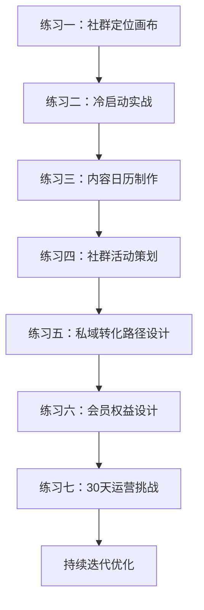
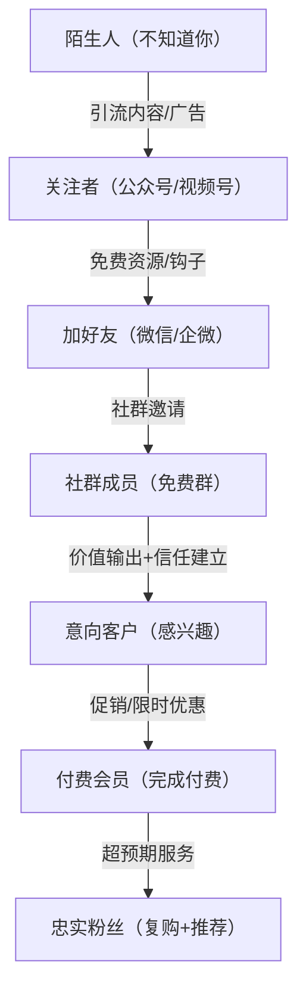
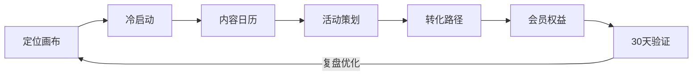

# 第二十四章 社群与私域流量——练习方法

## 为什么需要刻意练习

社群运营不是"建个群拉几个人"那么简单。一个能持续变现的社群，背后是定位能力、内容能力、活动策划能力、转化设计能力和数据分析能力的综合体现。这些能力无法通过"看懂了"获得，必须通过反复练习才能内化。

本章设计了七个递进式练习，覆盖从社群定位到持续变现的完整链路。每个练习都包含理论背景、详细步骤、真实案例、常见误区和进阶技巧，确保你不仅能"做完"，更能"做对"。

**练习路径总览：**



***

## 练习一：社群定位画布

### 理论背景

社群定位决定了你后续所有运营动作的方向。定位模糊的社群，成员不知道"这个群能给我什么"，运营者不知道"该输出什么内容"，最终沦为广告群或死群。定位清晰的社群，成员知道自己为什么在这里，运营者知道每天该做什么，双方形成正向循环。

定位的本质是回答一个问题：**你的社群为谁、解决什么问题、用什么方式、提供什么不可替代的价值？**

### 目标

用30分钟确定你的社群定位和核心价值主张。

### 详细步骤

**第1步：回答五个核心问题（10分钟）**

拿一张纸或打开一个文档，依次回答以下五个问题。每个问题用完整的句子回答，不要只写关键词：

1. **你的社群服务谁？（目标人群画像）** — 越具体越好。"职场人"太宽泛，"工作3-5年、在互联网公司做产品经理、月薪1.5-3万、想提升数据分析能力的职场人"才够具体。画像越精准，你越知道去哪里找到他们、用什么话术吸引他们。

2. **他们最大的痛点/需求是什么？** — 痛点必须是真实存在的、强烈的、他们愿意花钱解决的。判断标准：如果有人能帮他们解决这个问题，他们愿意付多少钱？如果答案是"免费还行"，说明痛点不够强。

3. **你的社群能提供什么独特价值？** — 这里要区分"独特价值"和"人人都能提供的价值"。"分享行业资讯"不算独特，因为你打开任何一个公众号都能看到。"每周拆解一个真实商业案例，附带原始数据和可复用的分析模板"才算独特。

4. **市面上有没有类似的社群？你跟他们有什么不同？** — 去微信、知识星球、小红书搜索同类社群，至少找5个。分析他们的定位、定价、内容、运营方式。然后问自己：我能提供什么是他们没有的？如果找不到差异化，要么换方向，要么深耕某个细分领域。

5. **用户为什么要付费加入你的社群？** — 付费意味着用户用金钱投票。你的社群必须提供"找不到免费替代品"的价值。常见的付费理由：独家资源（行业数据、内部工具）、高质量社交圈（精准人脉）、系统化学习路径（比自学效率高10倍）、持续陪伴和监督。

**第2步：用一句话表述社群定位（5分钟）**

用以下公式，把你的定位浓缩成一句话。这句话将用于所有对外宣传场景：

> 「社群名称」是一个帮助【目标人群】通过【独特方式】解决【核心问题】的【社群类型】。

**反面示例（常见错误）：**
> "XX学习社群"是一个帮助所有人学习成长的社群。

问题：人群太宽泛（所有人）、方式不明确（学习成长）、问题不具体。

**正面示例：**
> "精读会"是一个帮助职场人通过每月精读1本商业好书来提升思维方式的学习社群，通过领读+讨论+实践的方式提供价值。

为什么这个好：人群明确（职场人）、方式具体（每月精读1本+领读+讨论+实践）、问题清晰（提升思维方式）。

**更多示例：**

| 定位示例 | 人群 | 方式 | 问题 | 类型 |
|----------|------|------|------|------|
| "增长黑客实验室" | 创业公司增长负责人 | 每周拆解1个增长案例+实战复盘 | 用户增长瓶颈 | 实战社群 |
| "设计灵感库" | UI/UX设计师 | 每日精选设计案例+配色方案+设计规范 | 设计灵感枯竭 | 资源社群 |
| "跨境卖家联盟" | 亚马逊新卖家 | 选品数据+运营SOP+老卖家1对1辅导 | 从0到1不知如何起步 | 互助社群 |

**第3步：设计社群的价值清单（15分钟）**

列出你的社群能提供的所有价值，按重要性排序。价值清单是后续内容日历和会员权益设计的基础。

| 价值类型 | 具体内容 | 频率 | 交付形式 | 免费/付费 |
|----------|----------|------|----------|----------|
| 内容价值 | 每日行业资讯精选+解读 | 日更 | 图文消息 | 免费层可见 |
| 内容价值 | 每周1篇深度长文（3000字+） | 周更 | PDF/公众号 | 付费专属 |
| 社交价值 | 新成员自我介绍+行业交流 | 持续 | 群内互动 | 全员 |
| 社交价值 | 精准人脉对接（按需撮合） | 按需 | 私聊牵线 | 付费专属 |
| 学习价值 | 每周1次主题分享（嘉宾/群主） | 周更 | 直播/语音 | 付费专属 |
| 学习价值 | 系统化课程（录播+作业+点评） | 季度更新 | 课程平台 | 高端层专属 |
| 工具价值 | 行业模板、工具包、数据报告 | 每月更新 | 文件下载 | 付费专属 |
| 活动价值 | 季度线下聚会/游学 | 季度 | 线下活动 | 按次付费 |

### 常见误区

1. **定位太宽**："什么人都欢迎"等于"什么人都留不住"。宁可精准服务100人，也不要模糊服务10000人。
2. **模仿头部**：大V的社群定位不一定适合你。他们有个人IP背书，你没有。你需要更垂直、更细分。
3. **只考虑自己能提供什么，不考虑用户需要什么**：社群价值由用户定义，不是由你定义。先调研需求，再设计供给。
4. **价值清单写得太多**：列出20项价值，每项都做不到高质量，不如只列5项但每项做到极致。

### 进阶技巧

- **"价值三角"验证法**：你的价值清单必须同时满足三个条件——用户需要（需求真实）、你能提供（能力匹配）、竞品没有（差异化）。三个条件缺一不可。
- **定位测试**：把你的定位用一句话写出来，发给10个目标用户。问他们："这个社群你想加入吗？如果想，你最期待什么？如果不想，为什么？"根据反馈调整。

***

## 练习二：社群冷启动实战

### 理论背景

冷启动是社群运营最难的阶段。没有内容积累、没有口碑传播、没有从众效应，你面对的是一片空白。冷启动的核心原则是：**不要追求规模，要追求质量**。50个活跃的核心成员，比500个沉默的围观者有价值得多。

冷启动的关键指标不是"拉了多少人"，而是"入群后48小时内的互动率"。如果入群后48小时内有超过60%的人参与了互动（发言、自我介绍、参与讨论），说明冷启动质量合格。

### 目标

用7天时间，从0开始搭建一个50人的种子社群。

### 详细步骤

**Day 1-2：准备阶段**

1. **确定社群名称**：好名称的标准——能让人一眼看出"这个群是干什么的"。避免太文艺、太抽象的名字。"增长黑客实验室"比"星辰大海"好。"产品经理加油站"比"初心社"好。

2. **设计群规**：群规不是为了限制，而是为了保护社群氛围。核心群规包括：
   - 禁止广告（包括软广、二维码、链接刷屏）
   - 禁止人身攻击和政治敏感话题
   - 鼓励有价值的分享和讨论
   - 允许的自我介绍格式（避免变成名片交换群）

3. **准备入群欢迎语**：欢迎语是新成员对社群的第一印象。好的欢迎语包含四部分：
```text
   欢迎语模板：
   【欢迎】@新成员 欢迎加入XXX社群！
   【介绍】这是一个XXX的社群，每周会XXX。
   【行动】请花2分钟做一个自我介绍（模板见置顶），这是你融入社群的第一步。
   【资源】以下是入群资料包，包含XXX，请查收。
   ```

4. **设计入群钩子**：钩子是用户加入社群的"即时奖励"，让他们觉得"加入就值了"。好的钩子举例：
   - 一份独家行业报告（PDF，20页以上，有数据有图表）
   - 一套实用工具模板（可直接使用的Excel/Notion模板）
   - 一个限时免费的线上课程（录播，3-5节）
   - 一次1对1的免费咨询（限时15分钟，制造稀缺感）

5. **列出邀请名单**：翻遍你的通讯录，列出所有可能感兴趣的人。按照以下优先级排序：
   - 第一优先：和你有信任基础的人（朋友、同事、合作伙伴）
   - 第二优先：和你有共同兴趣/行业的人
   - 第三优先：在朋友圈/社群中表达过相关需求的人

**Day 3-4：逐一邀请**

核心原则：**逐一私聊，不要群发**。群发的邀请转化率通常低于5%，而逐一私聊的转化率可以达到30-50%。

**邀请话术模板（根据关系远近调整）：**

熟人版本：
> "嗨XX，我最近在做一个【XX主题】的小社群，想到你在这方面很有经验/兴趣，想邀请你加入。群里会每周分享【XX内容】，也会组织一些交流活动。目前是邀请制，限50人，你有兴趣吗？"

半熟人版本：
> "XX你好，我是XXX，之前在XX场合/群里看到过你分享的XX内容，觉得很专业。我最近在做一个【XX主题】的付费社群，想邀请你加入。群里有XX、XX等行业人士，每周会有XX活动。目前是邀请制，前50位成员享受XX优惠。你有兴趣了解吗？"

**话术拆解——为什么这样说有效：**

| 话术元素 | 作用 | 示例 |
|----------|------|------|
| 个性化称呼 | 让对方感到被尊重 | "嗨XX"，不是"亲" |
| 说明认识背景 | 建立信任 | "想到你在这方面很有经验" |
| 说明社群价值 | 激发兴趣 | "每周分享XX内容" |
| 制造稀缺感 | 促进决策 | "邀请制，限50人" |
| 降低决策门槛 | 减少犹豫 | "你有兴趣吗？"（而不是"加入吧"） |

**跟进策略：**
- 发出邀请后，如果24小时没有回复，发一条跟进消息："之前发的社群邀请看到了吗？如果有任何疑问随时问我~"
- 最多跟进2次。如果对方明确拒绝或不回复，不要继续纠缠。

**Day 5-6：入群引导**

新成员入群后的前48小时，决定了他是否会成为活跃成员。引导流程：

1. **发送欢迎语**（入群后1分钟内）：使用准备好的欢迎语模板。
2. **引导自我介绍**（入群后10分钟内）：@新成员，提供自我介绍模板：
```text
   【姓名/昵称】
   【所在城市和行业】
   【目前做什么/负责什么】
   【加入社群最想获得什么】
   【你能为社群提供什么价值】
   ```
3. **发起第一个话题讨论**（入群后1小时内）：选择一个容易参与的话题，降低发言门槛。例如："大家最近在工作中遇到的最大挑战是什么？"
4. **主动连接**：如果发现两个成员有互补的背景或需求，主动@他们互相认识。

**Day 7：复盘总结**

制作一张复盘表格，记录关键数据：

| 指标 | 数据 | 分析 |
|------|------|------|
| 邀请人数 | 50人 | — |
| 入群人数 | X人 | 转化率=X/50=Y% |
| 自我介绍人数 | X人 | 互动率=X/入群人数=Y% |
| 主动发言人数 | X人 | 活跃率=X/入群人数=Y% |
| 退群人数 | X人 | 留存率=1-X/入群人数=Y% |

**转化率基准：**
- 私聊邀请转化率：30-50%为正常，低于20%说明话术或定位有问题
- 入群后48小时互动率：60%以上为优秀，40-60%为正常，低于40%需要优化引导流程
- 7天留存率：80%以上为优秀，低于70%说明社群价值未被感知

### 常见误区

1. **群发邀请**：群发消息没有个性化，对方觉得自己只是"被群发的其中之一"，转化率极低。
2. **一拉进来就发广告/卖课**：新成员对社群还没有信任基础，此时推销只会让他们退群。
3. **不设群规**：没有群规的社群，广告、灌水、争吵会迅速侵蚀社群氛围。
4. **只拉人不运营**：拉完人就不管了，群里没人说话，3天就变成死群。
5. **追求人数忽略质量**：拉了500人但90%是"僵尸粉"，不如50个真正活跃的人。

### 进阶技巧

- **"种子用户筛选器"**：在邀请话术中加入一个简单问题，例如"你目前在做XX方面的工作吗？"只邀请回答"是"的人。这样虽然入群人数少，但质量更高。
- **"入群红包"策略**：新成员入群后发一个小红包（1-5元），金额不重要，重要的是触发"领了红包要说话"的社交心理。
- **"破冰活动"**：组织一个简单的互动活动，例如"用一张图介绍你的工作"，降低新成员发言的心理门槛。

***

## 练习三：社群内容日历制作

### 理论背景

内容是社群的血液。没有持续、有规律的内容输出，社群会迅速失去活力。内容日历是社群运营的"骨架"，它解决三个问题：发什么（内容主题）、什么时候发（发布节奏）、怎么发（交付形式）。

好的内容日历遵循"3:3:3:1"法则：30%干货内容（建立专业度）、30%互动内容（提升活跃度）、30%情感内容（建立归属感）、10%商业内容（实现变现）。

### 目标

制作一份为期4周的社群内容日历。

### 详细步骤

**第1步：确定内容主题库（20分钟）**

从以下六个维度建立你的内容主题库。每个维度至少列出10个具体主题：

1. **行业资讯和趋势分析** — 不只是转发新闻，而是加上你自己的解读。例如："XX公司发布了XX功能，这意味着XX，对我们来说XX。"
2. **实用干货和方法论** — 具体可执行的方法，有步骤、有模板、有案例。例如："如何用3步写出一篇高转化的文案（附模板）"。
3. **案例拆解和经验分享** — 拆解真实案例，分析成功/失败的原因。例如："XX品牌从0到100万粉丝的增长路径拆解"。
4. **成员故事和成长记录** — 让成员成为内容的主角，增强归属感。例如："加入社群3个月，XX是如何从月薪8K涨到15K的"。
5. **互动话题和讨论** — 开放性问题，鼓励成员表达观点。例如："你觉得XX行业未来3年最大的机会在哪里？"
6. **活动预告和回顾** — 提前预告活动制造期待，活动后回顾沉淀价值。

**第2步：设计每周内容节奏（10分钟）**

每周的内容节奏要形成固定预期，让成员知道"周几能看到什么"。

**基础版节奏（适合初期运营）：**

| 周一 | 周二 | 周三 | 周四 | 周五 | 周六 | 周日 |
|------|------|------|------|------|------|------|
| 本周资讯 | 干货分享 | 互动话题 | 案例拆解 | 轻松一刻 | 直播活动 | 周报总结 |

**进阶版节奏（适合成熟社群）：**

| 时间 | 周一 | 周二 | 周三 | 周四 | 周五 | 周六 | 周日 |
|------|------|------|------|------|------|------|------|
| 上午 | 行业资讯+解读 | 成员分享 | 干货文章 | 案例拆解 | 工具推荐 | — | — |
| 下午 | — | — | 互动话题 | — | — | 直播分享 | 周报+下周预告 |
| 晚间 | — | 话题讨论 | — | 问答时间 | 轻松话题 | — | — |

**第3步：填写具体内容（30分钟）**

为每一周的每一天填写具体内容标题和简要描述。模板如下：

```text
第X周 主题：XXXXX
├── 周一 [资讯] XX行业最新政策解读——对我们的3个影响
│   └── 描述：简述内容要点，预计字数，是否需要配图
├── 周二 [干货] 3步搞定XX——附完整模板
│   └── 描述：目标读者痛点，解决方案概述
├── 周三 [互动] 你遇到过XX问题吗？分享你的解决方法
│   └── 描述：讨论引导语，预期参与人数
├── 周四 [案例] XX品牌XX案例深度拆解
│   └── 描述：案例来源，拆解维度，可复用的经验
├── 周五 [推荐] 本周我用过最好的XX工具/资源
│   └── 描述：工具名称，使用场景，优缺点
├── 周六 [直播] 主题：XXXXX（嘉宾：XX）
│   └── 描述：直播大纲，互动环节设计
└── 周日 [总结] 本周精华回顾+下周预告
    └── 描述：精华内容汇总，下周活动预告
```

**第4步：准备素材（持续）**

提前准备每期内容所需的素材。建议建立一个"素材库"：

- **文章素材**：收藏夹、行业报告、竞品内容、个人笔记
- **图片素材**：配图、截图、数据图表、表情包
- **视频素材**：录屏教程、直播回放、短视频
- **工具素材**：模板文件、工具链接、操作指南
- **案例素材**：真实案例、数据截图、用户反馈

### 常见误区

1. **内容日历变成"自嗨清单"**：只写自己想发的，不考虑成员想看的。解决方法：每月做一次成员需求调研。
2. **节奏太密或太疏**：每天发10条消息，成员会觉得被打扰；一周发1条，成员会忘记这个群。找到你的社群的"最佳频率"。
3. **不做内容储备**：临时抱佛脚，每天想"今天发什么"，质量必然下降。至少提前储备1周的内容。
4. **忽略数据反馈**：不统计哪些内容被阅读/讨论最多，无法优化内容策略。

### 进阶技巧

- **"内容复用"策略**：一篇深度文章可以拆成：1篇公众号长文 + 5条社群短内容 + 1个直播主题 + 1份PDF资料包。一次创作，多次分发。
- **"成员共创"模式**：邀请成员贡献内容（经验分享、案例拆解、工具推荐），既减轻运营压力，又增强成员参与感。
- **"内容日历+数据复盘"闭环**：每周日统计本周内容的阅读量、互动量、转发量，据此调整下周内容计划。

***

## 练习四：社群活动策划

### 理论背景

活动是社群活跃度的"催化剂"。一个精心策划的活动，能在短时间内大幅提升社群互动量、增强成员粘性、甚至直接带来新成员和收入。活动策划的核心是"四有原则"：有主题（明确）、有互动（参与感）、有价值（获得感）、有复盘（可优化）。

不同类型活动的作用不同：

| 活动类型 | 主要作用 | 适合阶段 | 典型频率 |
|----------|----------|----------|----------|
| 直播分享 | 建立专业度+输出价值 | 全阶段 | 每周1次 |
| 话题讨论 | 提升互动+增强归属 | 全阶段 | 每周2-3次 |
| 案例拆解 | 输出方法论+建立信任 | 全阶段 | 每周1次 |
| 线上竞赛 | 制造话题+提升活跃 | 成长期 | 每月1次 |
| 线下聚会 | 深度社交+增强粘性 | 成熟期 | 每季度1次 |
| 拼团/砍价 | 裂变拉新+促进转化 | 增长期 | 每月1次 |

### 目标

策划并执行一次社群线上活动。

### 详细步骤

**第1步：确定活动形式（10分钟）**

选择一种适合你社群当前阶段和成员偏好的活动形式。以下是六种常见形式的详细对比：

| 活动形式 | 参与门槛 | 准备成本 | 互动性 | 适合人群 |
|----------|----------|----------|--------|----------|
| 线上直播分享 | 低 | 高 | 中 | 有专业嘉宾资源 |
| 话题讨论会 | 极低 | 低 | 高 | 成员活跃度较高 |
| 读书分享会 | 中 | 中 | 中 | 学习型社群 |
| 案例拆解会 | 中 | 高 | 中 | 商业/营销类社群 |
| 问答互动会 | 低 | 低 | 极高 | 有明确需求的社群 |
| 线上游戏/竞赛 | 中 | 中 | 极高 | 年轻化社群 |

**第2步：设计活动方案（20分钟）**

填写活动方案模板：

```text
活动名称：第X期XX主题分享会
活动时间：X月X日（周X）晚上8:00-9:00
活动时长：60分钟
活动形式：直播分享+互动问答
目标参与人数：XX人（建议设置为当前群人数的30-50%）

活动流程：
  ├── 开场（5分钟）
  │   └── 主持人介绍活动主题和嘉宾，说明互动规则
  ├── 主题分享（30分钟）
  │   └── 嘉宾分享核心内容，控制节奏，每10分钟设一个互动点
  ├── 互动问答（15分钟）
  │   └── 收集群内问题，选择3-5个最有代表性的问题回答
  └── 总结（10分钟）
      └── 回顾核心要点，预告下次活动，引导付费转化

需要准备的物料：
  ├── 活动海报（尺寸：750x1334px）
  ├── 分享PPT/大纲
  ├── 互动问题收集表
  └── 活动复盘模板

推广方式：
  ├── 社群内提前3天预告（每天1条，逐步升温）
  ├── 朋友圈海报转发
  ├── 公众号/视频号预告文章
  └── 老成员邀请新成员（设置邀请奖励）
```

**第3步：执行活动**

活动执行的关键时间节点和注意事项：

| 时间节点 | 动作 | 注意事项 |
|----------|------|----------|
| 提前3天 | 社群内发预告海报+文字说明 | 要突出"你能获得什么"，而不是"我们做什么" |
| 提前1天 | 再次提醒+收集问题 | "明天晚上8点，XX老师分享XX主题，想问什么提前留言~" |
| 活动前1小时 | 发最终提醒 | "还有1小时开始，准备好了吗？" |
| 活动开始 | 准时开始，不要等人 | 等人=惩罚准时的人。迟到的人看回放即可 |
| 活动中 | 控制节奏，适时互动 | 每10分钟设一个互动点（投票、提问、举手） |
| 活动结束 | 发总结+回放链接 | 24小时内发布，趁热打铁 |

**第4步：复盘优化**

活动结束后24小时内完成复盘，使用以下模板：

```text
活动复盘报告
━━━━━━━━━━━━━━━━━━━━
活动名称：XXXXX
活动时间：XXXXX

核心数据：
  ├── 预告触达人数：XX人
  ├── 实际参与人数：XX人（参与率=XX%）
  ├── 峰值在线人数：XX人
  ├── 平均观看时长：XX分钟
  ├── 互动次数：XX次（提问XX次，发言XX次）
  └── 活动后转化：XX人咨询/XX人付费

亮点：
  1. XXX
  2. XXX

问题：
  1. XXX
  2. XXX

改进方案：
  1. XXX
  2. XXX

下次活动建议：
  ├── 时间：XXXXX
  ├── 主题：XXXXX
  └── 形式：XXXXX
```

### 常见误区

1. **活动太频繁**：每周办3次活动，成员疲劳，参与度反而下降。初期建议每周1-2次。
2. **活动没有主题**："大家随便聊聊"不是活动，是闲聊。每个活动必须有明确主题和预期成果。
3. **不守时**：活动迟到、拖延、临时取消，会严重损害社群信任度。
4. **活动后没有沉淀**：活动结束就结束了，没有总结、没有回放、没有二次传播，白白浪费了内容。
5. **只办"学习型"活动**：社群活动不只有分享和讨论，也要有趣味性活动（游戏、竞赛、抽奖），让成员觉得"这个群好玩"。

### 进阶技巧

- **"嘉宾邀请"策略**：邀请行业KOL做分享，嘉宾自带流量，一次活动可以带来几十个新成员。关键：给嘉宾足够的曝光和尊重，不要让他觉得"被白嫖"。
- **"活动系列化"**：把单次活动变成系列（如"每周案例拆解"、"月度行业报告"），形成固定期待，提升成员粘性。
- **"活动+变现"组合**：活动结尾自然植入付费产品，例如"今天分享的内容在我们的付费课程中有更详细的讲解，感兴趣的朋友可以XX"。

***

## 练习五：私域转化路径设计

### 理论背景

私域转化的本质是**信任的逐层建立**。从"陌生人"到"付费会员"，每一步都需要提供价值、建立信任、降低决策门槛。转化路径设计的核心是"漏斗思维"——每一层都有流失，你的目标是让每一层的流失率尽可能低。

关键概念——**转化率基准**：

| 转化层级 | 行业平均转化率 | 优秀转化率 | 关键影响因素 |
|----------|---------------|-----------|-------------|
| 陌生人→关注者 | 1-3% | 5-10% | 内容质量+分发渠道 |
| 关注者→加好友 | 5-15% | 20-30% | 钩子吸引力+信任基础 |
| 加好友→社群成员 | 20-40% | 50-70% | 社群价值感知+邀请话术 |
| 社群成员→意向客户 | 10-20% | 30-50% | 价值输出+成功案例 |
| 意向客户→付费会员 | 5-15% | 20-30% | 定价+促销+信任 |
| 付费会员→忠实粉丝 | 10-20% | 30-50% | 服务质量+超预期体验 |

### 目标

设计一条从"陌生人"到"付费会员"的完整转化路径。

### 详细步骤

**第1步：画出转化漏斗（15分钟）**

用以下漏斗图作为模板，根据你的实际情况调整每一层：



**第2步：设计每一层的"转化触发点"（20分钟）**

每一层的转化都需要一个"触发点"——让用户愿意迈向下一层的行动。以下是每层的详细策略：

| 层级 | 转化目标 | 具体策略 | 执行细节 | 预期转化率 |
|------|----------|----------|----------|----------|
| 陌生人→关注者 | 关注公众号/视频号 | 产出10篇高质量干货文章 | 每篇3000字+，有数据有案例，标题用数字+痛点 | 3-5% |
| 关注者→加好友 | 添加个人微信 | 文章末尾放微信+免费资料包 | 资料包要足够诱人，例如"XX行业100个真实案例" | 10-20% |
| 加好友→社群成员 | 加入免费社群 | 朋友圈展示社群价值+私聊邀请 | 朋友圈每周发3-5条社群精彩内容截图 | 30-50% |
| 社群成员→意向客户 | 产生付费意愿 | 社群内持续输出价值+分享成功案例 | 每周至少1个成功案例，真实数据+用户证言 | 20-30% |
| 意向客户→付费会员 | 完成付费 | 限时优惠+从众效应+零风险承诺 | "前50名XX元+7天无理由退款" | 15-25% |
| 付费会员→忠实粉丝 | 复购+推荐 | 超预期服务+推荐奖励 | 推荐1人返现XX元或延长会员期 | 20-30% |

**第3步：设计每一层的"内容/话术"**

转化不是靠"硬推"，而是靠"内容驱动"。为每一层设计对应的内容策略：

**陌生人→关注者：引流内容设计**
- 选题：选择目标用户最痛的3-5个问题，每个问题写一篇深度文章
- 标题公式：数字+痛点+解决方案，例如"月薪8K到30K，我用了这3个方法"
- 分发渠道：公众号、知乎、小红书、视频号、抖音，至少选2个主力渠道

**关注者→加好友：钩子设计**
- 钩子类型：免费资料包、工具模板、行业报告、限时咨询
- 钩子标准：用户看到后会觉得"这个东西我确实需要，而且不容易找到"
- 放置位置：每篇文章的结尾、公众号菜单栏、自动回复

**加好友→社群成员：邀请话术**
```text
"Hi XX，我是XXX，看到你对XX很感兴趣。我建了一个XX主题的社群，
每周会分享XX内容，也会组织XX活动。目前是邀请制，限XX人。
群里已经有XX位XX行业的从业者，你有兴趣加入吗？"
```

**社群成员→意向客户：培育策略**
- 持续输出高价值内容，让成员感受到"远超预期的价值"
- 分享成功案例（真实用户+真实数据+真实效果）
- 定期做需求调研，了解成员的痛点和付费意愿
- 在社群中自然提及付费产品（不是硬广，而是"顺便一提"）

**意向客户→付费会员：促转化策略**
- 限时优惠：设置明确的截止时间，制造紧迫感
- 从众效应："已有XX人加入"、"XX位行业大佬也在用"
- 零风险承诺："7天无理由退款"，降低决策门槛
- 一对一私聊：对高意向用户做一对一沟通，解答顾虑

**第4步：测试和优化**

转化路径不是设计完就结束了，需要持续测试和优化：

1. **小规模测试**：先用100个流量测试每个环节的转化率，找到瓶颈
2. **A/B测试**：对转化率最低的环节，设计2-3个版本对比测试
3. **数据跟踪**：建立转化数据表，每周更新，追踪趋势变化
4. **持续迭代**：每2周做一次转化路径复盘，优化薄弱环节

### 常见误区

1. **只关注"拉新"不关注"留存"**：花大量精力引流，但进来的人很快就流失了。问题出在后面几层的转化策略。
2. **跳过信任建立直接卖**：关注者刚加好友就推付费产品，没有社群培育环节，转化率极低。
3. **所有用户用同一套话术**：不同层级的用户需要不同的沟通方式。陌生人需要价值展示，意向客户需要案例证明。
4. **不跟踪数据**：不知道每一层的转化率是多少，无法优化。数据是优化的基础。

### 进阶技巧

- **"自动化转化"**：利用企业微信的自动化功能（自动欢迎语、标签分组、定时群发），实现部分转化流程的自动化。
- **"分层运营"**：根据用户的标签和行为，推送不同的内容和优惠。高活跃用户推高端产品，低活跃用户推入门产品。
- **"裂变式转化"**：设计"推荐有礼"机制，让老用户帮你拉新用户。推荐者和被推荐者都有奖励，形成正向循环。

***

## 练习六：会员权益设计实战

### 理论背景

会员权益设计的核心原则是"价值大于价格"。用户付费的不是"加入一个群"，而是"获得一种价值"。好的会员权益设计，要让用户觉得"这个价格买到的东西，远超预期"。

会员体系的经济学逻辑：免费层负责引流和筛选，基础付费层负责覆盖运营成本，高端付费层负责利润增长。三层之间的价格梯度要合理——基础层是高端层价格的1/3到1/5。

### 目标

为你的社群设计一套完整的会员权益体系。

### 详细步骤

**第1步：确定会员等级（10分钟）**

建议从3个等级开始，每个等级有明确的定位：

| 等级 | 定位 | 目的 | 典型价格区间 |
|------|------|------|-------------|
| 免费层 | 入口+筛选 | 引流，让用户感受价值 | 免费 |
| 基础付费层 | 主力变现 | 覆盖运营成本，形成稳定收入 | 99-399元/年 |
| 高端付费层 | 利润增长 | 提供深度服务，获取高利润 | 999-4999元/年 |

**第2步：设计每个等级的权益（30分钟）**

使用"权益矩阵"，为每个等级设计具体的权益内容：

| 权益 | 免费 | 基础（199元/年） | 高端（999元/年） |
|------|------|-----------------|-----------------|
| 社群内容 | 每周精选3篇 | 全部内容 | 全部内容+独家深度 |
| 线上课程 | 免费试听1节 | 全部门课（5门） | 全部门课+进阶课（10门） |
| 直播分享 | 无 | 每月1次 | 每周1次+回放 |
| 线下活动 | 无 | 9折购票 | 全年2次免费参加 |
| 1对1咨询 | 无 | 无 | 每季度1次（30分钟） |
| 资源对接 | 无 | 基础对接 | 优先对接+专属推荐 |
| 专属标识 | 无 | 基础会员标签 | VIP标签+专属编号 |
| 工具模板 | 基础3个 | 全部模板库 | 全部+定制模板 |
| 数据报告 | 无 | 月度报告 | 月度+周度+定制报告 |

**权益设计的四个原则：**

1. **差异化**：不同等级的权益必须有明显差异，让用户觉得"升级是值得的"
2. **感知价值**：权益的"标价"要让用户觉得"超值"。例如，一门课程单独卖299，会员价包含5门课程只要199
3. **持续性**：权益要能持续交付，不要设计"一次性"的权益（用完就没了）
4. **稀缺性**：高端层要有"只有这个等级才能获得"的权益，例如1对1咨询、定制服务

**第3步：定价验证（10分钟）**

定价不是拍脑袋决定的，需要科学验证：

**定价公式：**
```text
基础层定价 = 目标年收入 / 目标基础会员数
高端层定价 = 基础层价格 × 3-5倍

示例：
目标年收入：10万元
目标基础会员数：500人
基础层定价 = 100,000 / 500 = 200元/年
高端层定价 = 200 × 5 = 1000元/年
```

**定价验证清单：**
- [ ] 如果我是用户，这个价格我愿意付吗？
- [ ] 同类社群的定价是多少？我在什么位置？
- [ ] 我的权益内容，如果单独购买要多少钱？会员价是否明显更划算？
- [ ] 需要多少会员才能覆盖运营成本？这个数字现实吗？
- [ ] 是否设置了退款机制？（降低用户决策风险）

**第4步：制作权益说明（20分钟）**

写一份清晰的会员权益说明文档，用于对外宣传。文档结构：

```text
XXX社群会员权益说明
━━━━━━━━━━━━━━━━━━━━

一、会员等级总览
  ├── 免费层：适合XX人群
  ├── 基础层（199元/年）：适合XX人群
  └── 高端层（999元/年）：适合XX人群

二、权益详细说明
  ├── 权益1：XXXXX
  │   ├── 具体内容：XXXXX
  │   ├── 交付频率：XXXXX
  │   └── 单独价值：XX元
  ├── 权益2：XXXXX
  └── ...

三、会员见证
  ├── 用户A的评价+具体效果
  └── 用户B的评价+具体效果

四、常见问题
  ├── Q：可以退款吗？ A：7天无理由退款
  ├── Q：到期后内容还能看吗？ A：XXXXX
  └── Q：可以升级/降级吗？ A：XXXXX

五、加入方式
  └── 扫码/链接/联系XX
```

### 常见误区

1. **权益太多但质量不高**：列了20项权益，每项都做不到高质量。不如只做8项但每项都做到极致。
2. **定价过高或过低**：过高无人购买，过低让用户觉得"便宜没好货"。建议先做市场调研。
3. **免费层和付费层差异太小**：如果免费层就能满足大部分需求，没有人会付费。免费层要"让人尝到甜头但吃不饱"。
4. **没有退款机制**：没有退款承诺，用户会犹豫。设置7天无理由退款，反而能提升转化率。
5. **权益交付不及时**：承诺了"每周1次直播"但经常爽约，会严重损害信任。

### 进阶技巧

- **"权益动态调整"**：根据会员反馈，每季度调整一次权益内容。淘汰不受欢迎的权益，增加新需求。
- **"老会员专属"**：为续费的老会员设计专属权益（价格优惠、额外服务），提升续费率。
- **"会员分层运营"**：高端会员不是"付费更高的普通会员"，而是"有专属服务的核心用户"。为高端会员建立专属小群、专属服务流程。

***

## 练习七：30天社群运营挑战

### 理论背景

30天是一个社群从0到1的最佳验证周期。太短（如7天）无法验证内容和变现效果，太长（如90天）容易失去动力。30天刚好覆盖了冷启动→内容运营→增长裂变→首次变现的完整周期，能让你快速验证社群模式是否可行。

30天挑战的核心目标不是"赚到多少钱"，而是"验证这个模式是否可行"。如果30天内能完成从0到首次付费的完整闭环，说明模式可行，值得持续投入。

### 目标

用30天时间，从0开始搭建并运营一个能产生收入的社群。

### 每日任务详解

**第1周：定位与搭建（Day 1-7）**

| Day | 任务 | 具体动作 | 预计耗时 | 产出 |
|-----|------|----------|----------|------|
| 1 | 完成社群定位画布 | 完成练习一的全部步骤 | 2小时 | 定位文档 |
| 2 | 设计名称+Logo+群规 | 确定名称，用Canva做Logo，写群规 | 2小时 | 名称+Logo+群规文档 |
| 3 | 准备入群欢迎语+资料包 | 写欢迎语，准备3-5份入群资料 | 3小时 | 欢迎语+资料包 |
| 4 | 列出50个潜在邀请对象 | 翻通讯录，按优先级排序 | 1小时 | 邀请名单（含备注） |
| 5-7 | 逐一邀请+入群引导 | 每天邀请15-20人，引导入群互动 | 每天2小时 | 30+人入群 |

**第2周：内容与互动（Day 8-14）**

| Day | 任务 | 具体动作 | 预计耗时 | 产出 |
|-----|------|----------|----------|------|
| 8 | 发布第一篇社群内容 | 写一篇3000字+的干货文章 | 3小时 | 首篇内容+互动数据 |
| 9 | 发起第一个话题讨论 | 发一个开放性问题，引导讨论 | 1小时 | 讨论帖+参与数据 |
| 10 | 组织第一次线上分享 | 邀请嘉宾或自己分享 | 2小时 | 直播/语音+回放 |
| 11 | 收集成员反馈和需求 | 发问卷或私聊收集 | 2小时 | 需求调研报告 |
| 12-14 | 持续输出+每日互动 | 每天至少1条内容+1个互动话题 | 每天1.5小时 | 内容+互动记录 |

**第3周：增长与活跃（Day 15-21）**

| Day | 任务 | 具体动作 | 预计耗时 | 产出 |
|-----|------|----------|----------|------|
| 15 | 设计裂变机制 | 制定"邀请有礼"规则+海报 | 2小时 | 裂变方案+海报 |
| 16 | 发起裂变活动 | 在社群和朋友圈推广 | 1小时 | 裂变数据 |
| 17-18 | 公域平台引流 | 写2篇文章/发2条视频号内容 | 每天2小时 | 引流内容+数据 |
| 19 | 组织第二次线上活动 | 规模更大，邀请外部嘉宾 | 3小时 | 活动数据+反馈 |
| 20-21 | 持续运营+目标冲刺 | 内容+互动+邀请，目标100人 | 每天2小时 | 群人数+活跃数据 |

**第4周：变现与复盘（Day 22-30）**

| Day | 任务 | 具体动作 | 预计耗时 | 产出 |
|-----|------|----------|----------|------|
| 22 | 设计付费产品 | 根据需求调研设计付费产品/会员 | 3小时 | 产品方案 |
| 23 | 社群内需求调研 | 验证付费意愿和价格敏感度 | 1小时 | 调研数据 |
| 24 | 发布付费产品预告 | 海报+文案+限时优惠信息 | 2小时 | 预告内容+期待数据 |
| 25 | 正式推出付费产品 | 开放购买+群内推荐+私聊跟进 | 2小时 | 付费数据 |
| 26-28 | 跟进付费转化 | 私聊意向用户+解答疑问+追单 | 每天1.5小时 | 转化数据 |
| 29 | 30天数据总结 | 统计所有关键数据，写复盘报告 | 3小时 | 完整数据报告 |
| 30 | 制定下一个30天计划 | 根据复盘结果制定优化方案 | 2小时 | 优化计划 |

### 关键里程碑和成功标准

| 里程碑 | 目标时间 | 成功标准 | 失败时的调整方向 |
|--------|----------|----------|----------------|
| 种子群搭建 | Day 7 | 30+人入群 | 降低邀请门槛/调整定位 |
| 内容体系建立 | Day 14 | 每天有互动，50+人 | 调整内容方向/增加互动活动 |
| 裂变增长 | Day 21 | 达到100人 | 优化裂变机制/加大公域引流 |
| 首次变现 | Day 28 | 至少1人付费 | 调整定价/优化产品/加强信任 |
| 完整闭环 | Day 30 | 从0到1的完整验证 | 重新评估方向，决定是否继续 |

### 数据跟踪表

在整个30天挑战中，每天记录以下数据：

```text
日期：Day X
━━━━━━━━━━━━━━━━━━━━
群成员总数：XX人（较昨日+X）
今日新增：XX人
今日退群：XX人
今日发言人数：XX人
今日发言条数：XX条
今日发布内容：XX条
内容互动数据：点赞XX，评论XX，转发XX
今日收入：XX元
累计收入：XX元

备注：
  ├── 今天做得好的地方：XXXXX
  ├── 今天需要改进的地方：XXXXX
  └── 明天的重点任务：XXXXX
```

### 常见误区

1. **Day 1就开始卖**：社群还没有建立信任，直接卖东西只会吓跑人。至少花2周建立信任。
2. **只关注人数不关注质量**：拉了500人但没人说话，不如50个活跃的人。
3. **内容断更**：中间有几天没发内容，成员会觉得"这个群没人管了"。宁可发短内容也不要断更。
4. **不做复盘**：每天忙忙碌碌但不总结，不知道什么有效什么无效。复盘是进步的唯一方式。
5. **放弃太早**：第2周觉得"没人买"就放弃了。30天挑战需要坚持到最后一周才能看到结果。

### 进阶技巧

- **"30天挑战打卡"**：在社群内公开你的30天挑战进度，让成员见证你的成长过程。这本身就是最好的内容。
- **"30天后评估矩阵"**：挑战结束后，用以下矩阵评估结果：

| 评估维度 | 评分（1-10） | 下一步行动 |
|----------|-------------|-----------|
| 社群活跃度 | X分 | 具体优化措施 |
| 内容质量 | X分 | 具体优化措施 |
| 增长速度 | X分 | 具体优化措施 |
| 变现效果 | X分 | 具体优化措施 |
| 个人成长 | X分 | 具体优化措施 |

***

## 综合复盘：七个练习的串联应用

完成七个练习后，你需要将它们串联成一个完整的运营体系：



**串联的关键节点：**

1. **定位→冷启动**：定位画布输出的"目标人群画像"直接用于冷启动的邀请名单筛选
2. **冷启动→内容日历**：冷启动阶段收集的成员需求，决定内容日历的主题方向
3. **内容日历→活动策划**：内容日历中的"直播/活动"栏目，就是活动策划的输入
4. **活动策划→转化路径**：活动是转化路径中"社群成员→意向客户"的关键触发点
5. **转化路径→会员权益**：转化路径设计的"付费触发点"，需要会员权益来承接
6. **会员权益→30天验证**：30天挑战是验证整个体系是否可行的最终测试

**最终产出清单：**
- [ ] 社群定位文档（一句话定位+价值清单）
- [ ] 社群运营手册（群规+欢迎语+引导流程）
- [ ] 4周内容日历（每日主题+素材清单）
- [ ] 活动SOP（策划→执行→复盘模板）
- [ ] 转化路径图（每一层的策略+话术+数据）
- [ ] 会员权益体系（等级+权益+定价+说明文档）
- [ ] 30天数据报告（关键指标+复盘分析+优化计划）

## 本节核心要点

1. **定位是一切的起点**：花30分钟想清楚定位，比花30天盲目拉人有效得多。定位模糊的社群注定失败。
2. **冷启动追求质量而非数量**：50个活跃的核心成员比500个沉默的围观者有价值得多。入群后48小时互动率是衡量冷启动质量的核心指标。
3. **内容日历是社群运营的骨架**：遵循"3:3:3:1"法则（干货:互动:情感:商业），确保内容的多样性和持续性。
4. **活动是活跃度的催化剂**：遵循"四有原则"——有主题、有互动、有价值、有复盘。每次活动都要有完整策划→执行→复盘的闭环。
5. **转化路径要逐层设计**：每一层都需要"触发点"，让用户愿意迈向下一层。转化率基准是优化的参照系。
6. **会员权益的核心是"价值大于价格"**：三层体系（免费/基础/高端），让用户觉得"不升级就亏了"。
7. **30天挑战是最终验证**：从0到1的完整闭环验证，决定这个社群模式是否值得持续投入。
