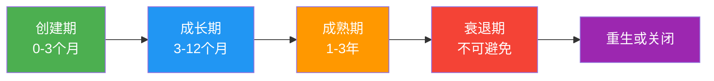
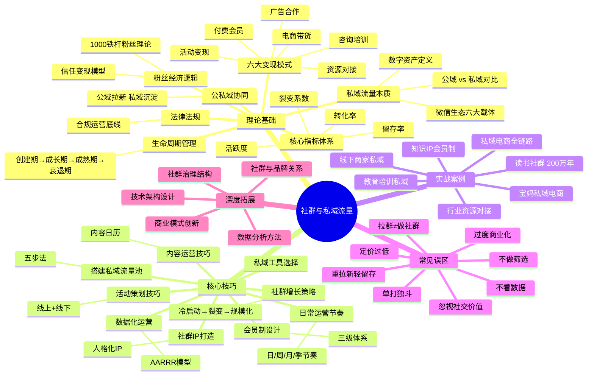
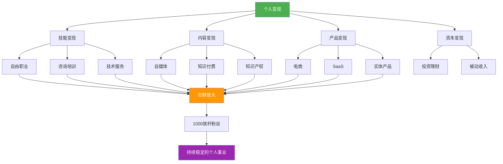

# 第二十四章 社群与私域流量——本章小结

## 一、核心认知回顾

本章从理论基础、核心技巧、实战案例三个维度，系统拆解了社群运营与私域流量的完整方法论。以下是贯穿全章的六条核心认知，每一条都经过实战验证。

### 认知一：私域流量是你最重要的数字资产

公域流量是"租"来的——平台算法一变，你的曝光量可能一夜归零。私域流量是"买"来的——每一个沉淀到微信/企微/社群的用户，都是你可以反复触达的资产，边际成本趋近于零。

具体数据对比：

| 维度 | 公域流量 | 私域流量 |
|------|----------|----------|
| 触达成本 | 每次付费（CPC/CPM） | 趋近于零 |
| 触达频率 | 受限于平台规则 | 自由控制 |
| 用户数据 | 归平台所有 | 归你所有 |
| 抗风险能力 | 低（平台封号即归零） | 高（多触点备份） |
| 信任积累 | 慢（需要多次曝光） | 快（高频互动加速） |
| 适合场景 | 拉新引流 | 深度运营、转化变现 |

近五年各平台获客成本上涨了3-10倍。以电商行业为例，2020年平均获客成本约50元/人，到2025年已涨至200-500元/人。在这种趋势下，把每一次公域曝光带来的用户沉淀到私域，是降低长期获客成本的唯一出路。

### 认知二：社群的核心价值是社交关系

社群不是内容发布渠道，不是广告平台，而是一个社交网络。用户留在社群的三大驱动力中，社交关系占比最大：

- **社交关系**（50%）：成员之间的横向连接，认识了谁、跟谁合作了、跟谁成了朋友
- **内容价值**（30%）：获得的资讯、方法、资源
- **身份认同**（20%）：属于某个群体的归属感和荣誉感

这意味着：如果你的社群只有管理员在发内容，成员之间没有互动，你就只开发了30%的价值。运营社群的本质，是运营人与人之间的关系——让成员之间产生连接、合作、互助，社群才真正具有不可替代性。

### 认知三：社群运营的四大核心指标

脱离数据谈运营就是盲人摸象。四个核心指标缺一不可：

| 指标 | 含义 | 优秀 | 良好 | 一般 | 优化方向 |
|------|------|------|------|------|----------|
| 日活跃率 | 每天参与互动的成员占比 | 20%-40% | 10%-20% | 5%-10% | 增加互动话题、活动频率 |
| 30日留存率 | 30天后仍留在群中的比例 | >80% | 60%-80% | 40%-60% | 提升内容质量、增强社交连接 |
| 付费转化率 | 成员转化为付费用户的比例 | 10%-20% | 5%-10% | 2%-5% | 优化信任建设、产品设计 |
| 裂变系数 | 每个老成员平均带来的新成员数 | >1.0 | 0.5-1.0 | <0.5 | 设计裂变机制、激励方案 |

除了四大核心指标，还需关注三个辅助指标：

- **商业内容占比**：控制在20%以内，超过30%社群就会变味
- **LTV/CAC比值**：客户终身价值÷获客成本，健康值>3
- **内容消费率**：发布的内容被阅读/观看的比例，低于50%说明内容不对路

### 认知四：六大变现模式可以组合使用

本章详细拆解了社群变现的六种模式，实际运营中应该根据社群特点选择2-3种组合：

| 变现模式 | 适用社群类型 | 收入特征 | 启动难度 |
|----------|-------------|----------|----------|
| 付费会员 | 学习型、行业型 | 稳定、可持续 | 中（需要持续输出价值） |
| 广告合作 | 大规模、高活跃 | 波动、依赖规模 | 低（需要达到一定体量） |
| 电商带货 | 消费型、宝妈型 | 可观、需要供应链 | 中高（需要选品能力） |
| 活动变现 | 行业型、兴趣型 | 集中、爆发力强 | 中（需要策划执行能力） |
| 咨询培训 | 专业型、IP型 | 高客单、难规模化 | 高（需要专业壁垒） |
| 资源对接 | 行业型、商务型 | 高利润、依赖人脉 | 高（需要资源积累） |

以本章案例一"精读会"为例，其年收入200万的构成：基础会员59.7万 + 高级会员47.9万 + VIP会员40万 + 企业团购7.5万 + 训练营17.9万 + 出版社合作25万。六种模式中用了五种，收入来源多元且健康。

### 认知五：社群有生命周期，需要持续创新

社群不是"建了就完事"的资产，它有明确的生命周期：



每个阶段的核心任务完全不同：

| 阶段 | 核心任务 | 关键动作 | 常见陷阱 |
|------|----------|----------|----------|
| 创建期 | 验证定位、积累种子用户 | 逐一邀请、免费体验、快速迭代 | 追求规模忽视质量 |
| 成长期 | 扩大规模、建立运营体系 | 裂变增长、内容日历、活动体系 | 过度依赖单一流量源 |
| 成熟期 | 深度变现、品牌建设 | 产品线扩展、品牌IP化、生态构建 | 过度商业化透支信任 |
| 衰退期 | 创新激活或体面收尾 | 新主题注入、核心成员焕新、转型 | 强撑导致口碑崩塌 |

90%的微信群在建立30天后变成"死群"，根本原因不是社群模式不行，而是运营者没有根据生命周期调整策略。

### 认知六：1000个铁杆粉丝足以支撑一个事业

凯文·凯利的"1000个铁杆粉丝"理论在社群运营中得到了完美验证。不要追求百万粉丝，先服务好1000个愿意为你付费的铁杆粉丝。

算一笔账：如果你有1000个年费会员，每人399元/年，年收入就是39.9万。加上高阶产品、活动、资源对接等收入，年入50-100万完全可以实现。关键在于：这1000个人的复购、推荐和口碑，就是你最稳固的收入来源。

---

## 二、方法论体系梳理

### 2.1 私域流量搭建的完整路径

本章核心技巧部分给出了从0到1搭建私域流量池的五步法：

```text
第一步：确定目标用户画像
    ↓  年龄、职业、痛点、平台偏好
第二步：设计引流产品
    ↓  免费资源 / 低价体验 / 限时福利
第三步：搭建承接体系
    ↓  入群欢迎语、群规、新人引导流程
第四步：设计留存机制
    ↓  每日价值输出、互动活动、积分等级
第五步：建立转化路径
    ↓  免费→付费阶梯、关键节点触发、复购升级
```

微信生态私域布局的六大载体及其分工：

| 载体 | 核心作用 | 关键指标 | 优先级 |
|------|----------|----------|--------|
| 视频号 | 短视频引流 + 直播带货 | 播放量、关注转化率 | 高（流量入口） |
| 公众号 | 内容输出、信任建立 | 阅读量、关注增长率 | 中（内容沉淀） |
| 个人微信号 | 1对1深度沟通、朋友圈营销 | 好友数、互动率 | 高（信任核心） |
| 企业微信 | 规模化客户管理 | 客户数、消息触达率 | 高（规模化必备） |
| 微信群 | 社群运营、氛围营造 | 活跃度、转化率 | 高（运营核心） |
| 小程序 | 电商、会员管理、工具 | UV、转化率、复购率 | 中（交易闭环） |

个人微信 vs 企业微信的选择原则：个人IP、小团队以个人微信为主（信任度高）；企业、团队化运营以企业微信为主（可规模化、可交接）。最佳方案是两者组合使用。

### 2.2 社群增长的三大阶段

**冷启动阶段（0-100人）：** 不追求规模，追求质量。逐一邀请、免费体验、快速迭代。案例一"精读会"的做法是：从公众号筛选200个高互动用户 → 逐一私聊邀请 → 7天免费读书挑战 → 52人付费（转化率52%）。冷启动阶段的核心公式：邀请人数 × 邀请转化率 × 体验完成率 × 付费转化率 = 首批会员数。

**增长阶段（100-1000人）：** 裂变 + 内容引流双轮驱动。裂变机制设计要点：奖励要对双方都有吸引力（如"邀请1位好友，双方各延长1个月会员"）；内容引流要选对平台（小红书、抖音、视频号）；线下活动是信任加速器。

**规模化阶段（1000人+）：** 产品线分层、团队化运营、品牌化建设。需要从"一个人扛"转变为团队协作，至少覆盖内容、活动、客服三个角色。

### 2.3 社群运营的日常节奏

运营节奏是社群的"心跳"，没有节奏的社群必然走向沉默：

| 周期 | 动作 | 目的 |
|------|------|------|
| 每日 | 早报/晚报、话题互动、问题解答 | 保持活跃、提供日常价值 |
| 每周 | 干货分享、案例拆解、周报总结 | 深度价值输出、建立专业感 |
| 每月 | 线上直播、线下活动、月度复盘 | 强化社交连接、收集反馈 |
| 每季 | 会员权益更新、产品迭代、数据大复盘 | 持续优化、保持新鲜感 |

### 2.4 会员制商业模式设计

三级会员体系是最成熟的模型：

| 层级 | 功能 | 定价参考 | 权益示例 |
|------|------|----------|----------|
| 免费层 | 引流和筛选 | 0元 | 部分社群内容、基础资讯 |
| 基础付费层 | 主力变现 | 199-599元/年 | 全部内容、线上课程、每月直播 |
| 高端付费层 | 高价值服务 | 1999-9999元/年 | 全部权益 + 1对1咨询 + 线下活动 + 资源对接 |

定价核心原则：价格是最好的筛选器。9.9元/年吸引来的用户投入度低、参与度低、付费意愿也低。定价要与你提供的价值匹配，先通过免费内容建立信任，再推出合理定价的付费社群。

### 2.5 八大常见误区与纠正

| 误区 | 表现 | 真相 | 纠正方法 |
|------|------|------|----------|
| 把拉群等同于做社群 | 500人微信群无人运营 | 90%微信群30天后变死群 | 建群前想清核心价值，设计运营节奏 |
| 只关注拉新不关注留存 | 5000人社群活跃不到200人 | 拉新成本是留存的5-10倍 | 每周跟踪留存率，设计召回机制 |
| 过度商业化 | 每天推产品发广告 | 超过20%商业内容社群就变味 | 先提供价值再变现，商业内容要"软" |
| 不做筛选来者不拒 | 人越多越好 | 低质量成员拉低整体体验 | 设计入群门槛，宁少勿杂 |
| 忽视社交价值 | 只有管理员发内容 | 社交关系占留存因素50% | 设计互动机制、组织线下活动 |
| 定价太低 | 9.9元/年起步 | 低价降低价值感和成员质量 | 定价匹配价值，可用早鸟价引流 |
| 不做数据追踪 | 靠"感觉"运营 | 数据是运营的指南针 | 建立核心看板，每周数据复盘 |
| 一个人扛所有运营 | 社群规模>200人还在单打独斗 | 超过200人必须分工 | 培养志愿者、使用自动化工具、组建团队 |

---

## 三、实战案例核心启示

本章七个实战案例覆盖了社群变现的主要路径，提炼共性规律：

| 案例 | 核心模式 | 关键数据 | 最大启示 |
|------|----------|----------|----------|
| 读书社群"精读会" | 会员制 + 活动 + 出版合作 | 5000人、年入200万 | 精准定位 + 仪式感设计 = 高粘性 |
| 宝妈社群 | 私域电商 + 社群带货 | — | 信任是电商转化的前提 |
| 行业社群 | 资源对接 + 活动变现 | — | 人脉价值 > 内容价值 |
| 知识IP会员制 | 三级会员 + 咨询培训 | — | IP本身就是最好的筛选器 |
| 线下商家私域 | 线上引流 + 线下成交 | — | 本地化社群的LTV更高 |
| 私域电商之路 | 全链路私域运营 | 从0到100万 | 私域电商的关键是选品+复购 |
| 教育培训私域 | 获客 + 转化 + 续费 | — | 教育行业的私域LTV是公域的5-10倍 |

七个案例的共性成功因素：

1. **精准定位**：不是"什么人都服务"，而是聚焦一个细分人群的特定需求
2. **信任先行**：先提供免费价值建立信任，再推出付费产品
3. **社交设计**：刻意促进成员之间的横向连接，而非单向输出
4. **数据驱动**：追踪四大核心指标，用数据而非感觉做决策
5. **持续创新**：定期注入新内容、新活动、新产品，对抗生命周期衰退

---

## 四、知识框架全景图

将本章内容整合为一张完整的知识体系图：



---

## 五、关键数据速查

以下是社群运营各环节的参考数据基准，可用于自检和对标：

### 5.1 社群健康度指标

| 指标 | 优秀 | 良好 | 一般 | 需要干预 |
|------|------|------|------|----------|
| 日活跃率 | 20%-40% | 10%-20% | 5%-10% | <5% |
| 30日留存率 | >80% | 60%-80% | 40%-60% | <40% |
| 付费转化率 | 10%-20% | 5%-10% | 2%-5% | <2% |
| 裂变系数 | >1.0 | 0.5-1.0 | 0.3-0.5 | <0.3 |
| 商业内容占比 | ≤15% | 15%-20% | 20%-30% | >30% |

### 5.2 私域运营效率指标

| 指标 | 参考值 | 说明 |
|------|--------|------|
| 好友通过率 | 30%-50% | 主动添加好友的通过比例 |
| 入群转化率 | 40%-60% | 好友转化为群成员的比例 |
| 首次互动率 | 60%-80% | 入群后7天内参与互动的比例 |
| LTV/CAC比值 | >3 | 客户终身价值÷获客成本 |
| 内容消费率 | >50% | 发布内容被阅读/观看的比例 |
| 1对1回复率 | >80% | 私聊消息的回复比例 |

### 5.3 变现效率基准

| 变现模式 | 行业平均客单价 | 复购率 | 适合规模 |
|----------|---------------|--------|----------|
| 付费会员 | 99-599元/年 | 50%-70% | 200人+ |
| 电商带货 | 50-300元/单 | 30%-50% | 500人+ |
| 线上课程 | 99-999元/期 | 20%-40% | 300人+ |
| 咨询服务 | 500-5000元/次 | 40%-60% | 100人+ |
| 线下活动 | 99-999元/人 | 30%-50% | 200人+ |
| 资源对接 | 按成交抽佣 | — | 500人+ |

---

## 六、立即行动清单

将行动拆解为三个阶段，按优先级排列：

### 第一阶段：定位与冷启动（第1-2周）

- [ ] 完成社群定位画布：用一句话写清楚社群服务谁、解决什么问题、提供什么独特价值
- [ ] 列出50个潜在种子用户，逐一邀请（不要群发）
- [ ] 设计入群门槛和群规（付费/问卷/推荐/审核四选一）
- [ ] 准备入群欢迎语和自我介绍模板
- [ ] 设计一个"入群钩子"（免费资源、限时体验等）

### 第二阶段：运营体系建设（第3-4周）

- [ ] 制作一份4周的内容日历（每日/每周主题明确）
- [ ] 设计社群运营节奏：每日互动话题 + 每周干货分享 + 每月活动
- [ ] 设计会员权益体系（免费→基础→高端三级结构）
- [ ] 建立核心数据看板，开始追踪活跃率、留存率、转化率、裂变系数
- [ ] 完成第一次社群活动的策划和执行

### 第三阶段：增长与变现（第5-8周）

- [ ] 设计裂变机制并执行第一次裂变活动
- [ ] 在公域平台（小红书/抖音/视频号）发布引流内容
- [ ] 正式推出付费产品/会员体系
- [ ] 做第一次数据复盘：哪些指标达标？哪些需要优化？
- [ ] 制定下一个30天的迭代计划

---

## 七、深度拓展方向

本章深度拓展部分从五个维度提供了进阶知识，如果你想进一步深耕社群与私域领域，以下是学习路径：

| 方向 | 核心内容 | 适合人群 | 推荐学习顺序 |
|------|----------|----------|-------------|
| 数据分析方法 | AARRR模型、漏斗分析、同期群分析 | 数据驱动型运营者 | 第一优先 |
| 私域技术架构 | CDP、MAP、CRM系统集成 | 技术背景/企业运营者 | 按需学习 |
| 商业模式创新 | 平台化、订阅制、服务化、投资化 | 已有成熟社群的运营者 | 第二优先 |
| 社群治理结构 | 中心化/去中心化/混合治理 | 规模化社群管理者 | 500人+时学习 |
| 社群与品牌关系 | 品牌社群化、社群品牌化 | 品牌运营者/创业者 | 长期关注 |

特别值得关注的商业模式创新趋势：社群正从1.0的内容付费，演进到2.0的社群电商、3.0的社群服务，最终走向4.0的社群生态——以社群为基础构建开放商业生态，连接多个利益相关方实现价值共创。混沌大学、樊登读书、知识星球分别是这四个阶段的典型代表。

---

## 八、全书总结

至此，《搞钱指南》二十四章的核心内容已全部呈现。让我们用一张图回顾全书的变现路径体系：



从第1章的基础认知到第24章的社群与私域流量，全书系统拆解了个人变现的各种路径和方法。而社群与私域流量之所以放在最后一章，是因为它是所有变现路径的"放大器"——无论你靠什么技能、内容、产品赚钱，一个活跃的社群和稳固的私域流量池，都能让你的收入乘以一个倍数。

最后送你三句话：

**第一句：搞钱的本质，是为他人创造价值。** 当你能持续为更多人创造更大的价值时，钱自然会来。

**第二句：先完成，再完美。** 不要等到万事俱备才开始，先用最小可行方案验证模式，再迭代优化。

**第三句：长期主义是最好的策略。** 社群运营、私域建设、个人品牌，都不是一朝一夕的事。坚持输出价值、坚持服务用户、坚持数据驱动，时间会给你答案。

现在，行动起来吧。
