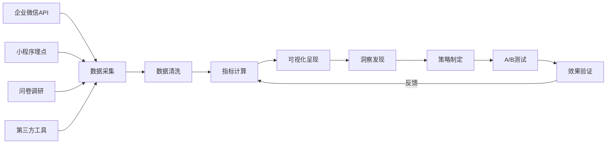
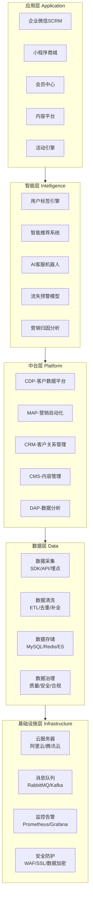
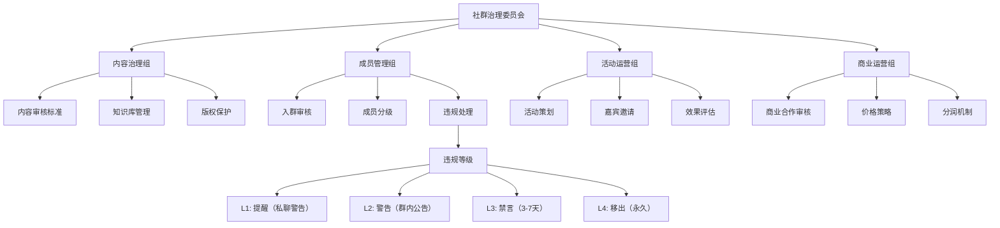
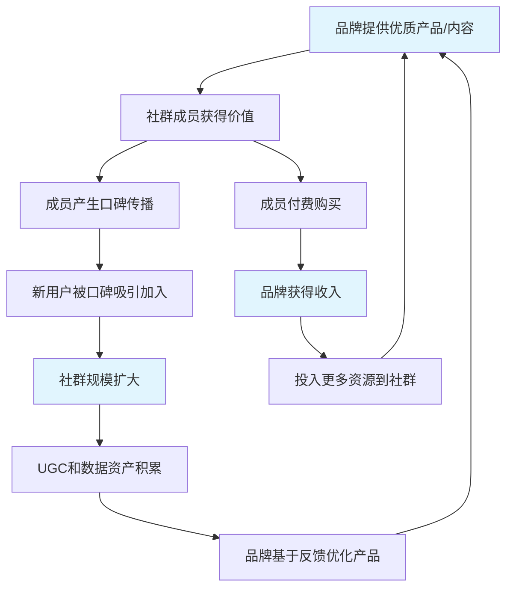

# 第24章 社群与私域流量 — 深度拓展

本章前几节已经搭建了社群运营的理论框架、核心技巧、实战案例和避坑指南。这一节将带你进入真正的"高手区"——数据驱动的精细化运营、企业级技术架构设计、商业模式的深度创新、治理结构的系统化建设，以及AI与Web3时代的前沿趋势。如果你的目标是把社群做成一门规模化、可持续的生意，这一节的内容将直接决定你的天花板。

***

## 一、社群运营的数据分析方法

### 1.1 为什么数据是社群运营的"方向盘"

多数社群运营者靠直觉决策：今天发什么内容、什么时候做活动、谁该被踢出群——全部凭感觉。但数据显示，采用数据驱动决策的社群，其成员留存率比"拍脑袋"运营的社群高出42%，付费转化率高出28%（数据来源：神策数据2024年私域运营白皮书）。

数据不是用来"看"的，而是用来"做决策"的。每一个数据指标背后都应该对应一个运营动作。下面这张图展示了完整的数据分析工作流：



### 1.2 核心指标体系：从"虚荣指标"到"可行动指标"

很多运营者只关注"成员总数"——这是一个典型的虚荣指标。一个500人的高质量社群，变现能力可能远超一个5万人的死群。以下是真正值得关注的核心指标：

| 指标类别 | 具体指标 | 计算公式 | 健康基准值 | 对应运营动作 |
|---------|---------|---------|-----------|------------|
| 增长指标 | 7日成员增长率 | (本周新增-本周流失)/上周总数×100% | ≥3% | 优化裂变路径 |
| 活跃指标 | 消息互动率 | 日发言人数/总成员数×100% | ≥15% | 设计互动话题 |
| 留存指标 | 30日留存率 | 第30天仍活跃人数/当日新增人数×100% | ≥45% | 优化新人引导 |
| 转化指标 | 付费转化率 | 付费人数/总活跃人数×100% | ≥5% | 优化销售漏斗 |
| 价值指标 | 用户终身价值(LTV) | 见下方公式 | ≥3倍CAC | 提升客单价/复购 |
| 推荐指标 | 裂变系数(K值) | 每位用户平均邀请人数×邀请转化率 | ≥1.2 | 优化邀请激励 |

**LTV计算公式（适用于订阅制社群）：**

```text
LTV = ARPU × 毛利率 × (1 / 月流失率)

示例：
- 月会员费 199 元，ARPU（月均每用户收入）= 199 元
- 毛利率 = 85%（内容型社群，边际成本低）
- 月流失率 = 8%
- LTV = 199 × 0.85 × (1/0.08) = 199 × 0.85 × 12.5 = 2,114 元

如果 CAC（获客成本）= 50 元，则 LTV/CAC = 42.3，商业模型非常健康
```

### 1.3 同期群分析：用Python追踪社群健康度

同期群分析（Cohort Analysis）是社群运营中最强大的分析方法之一。它将同一时期加入的成员归为一个"群组"，追踪每个群组在后续时间段的留存表现。下面是完整的Python实现：

```python
import pandas as pd
import numpy as np
from datetime import datetime, timedelta
import matplotlib.pyplot as plt
import seaborn as sns

# ============================================================
# 第一步：准备数据（模拟社群成员行为数据）
# ============================================================
np.random.seed(42)
n_members = 2000

# 生成2000个成员的加入时间（分布在最近6个月）
join_dates = [
    datetime(2024, 1, 1) + timedelta(days=int(x))
    for x in np.random.exponential(scale=30, size=n_members).cumsum()
    if datetime(2024, 1, 1) + timedelta(days=int(x)) < datetime(2024, 7, 1)
]

records = []
for i, join_date in enumerate(join_dates[:1500]):
    member_id = f"M{i:04d}"
    # 模拟该成员在加入后每个月的活跃天数
    for month_offset in range(7):
        activity_date = join_date + timedelta(days=month_offset * 30)
        if activity_date > datetime(2024, 7, 1):
            break
        # 留存衰减：新成员前3个月活跃度较高，之后逐渐下降
        base_prob = max(0.1, 0.8 - month_offset * 0.12)
        is_active = np.random.random() < base_prob
        records.append({
            'member_id': member_id,
            'join_date': join_date,
            'activity_month': activity_date.strftime('%Y-%m'),
            'cohort': join_date.strftime('%Y-%m'),
            'is_active': int(is_active)
        })

df = pd.DataFrame(records)

# ============================================================
# 第二步：计算同期群留存矩阵
# ============================================================
df['month_number'] = (
    pd.to_datetime(df['activity_month']) - 
    pd.to_datetime(df['cohort'])
).dt.days // 30

cohort_data = (
    df.groupby(['cohort', 'month_number'])['is_active']
    .sum()
    .reset_index()
)

cohort_sizes = df.groupby('cohort')['member_id'].nunique()
cohort_data['retention_rate'] = cohort_data.apply(
    lambda row: row['is_active'] / cohort_sizes[row['cohort']] * 100, axis=1
)

retention_matrix = cohort_data.pivot(
    index='cohort', 
    columns='month_number', 
    values='retention_rate'
)

# ============================================================
# 第三步：可视化留存热力图
# ============================================================
plt.figure(figsize=(12, 6))
sns.heatmap(
    retention_matrix, 
    annot=True,          # 在格子中显示数值
    fmt='.1f',           # 保留1位小数
    cmap='YlOrRd_r',    # 颜色映射：越深越好
    linewidths=0.5
)
plt.title('社群同期群留存率热力图（%）', fontsize=14)
plt.xlabel('加入后的月份', fontsize=12)
plt.ylabel('加入月份（群组）', fontsize=12)
plt.tight_layout()
plt.savefig('cohort_retention_heatmap.png', dpi=150)
plt.show()

# ============================================================
# 第四步：计算关键指标并输出报告
# ============================================================
print("=" * 60)
print("社群健康度分析报告")
print("=" * 60)

# 整体留存
avg_m1_retention = retention_matrix[1].mean()
avg_m3_retention = retention_matrix[3].mean() if 3 in retention_matrix.columns else None

print(f"\n📊 核心指标：")
print(f"   总成员数：{df['member_id'].nunique()}")
print(f"   平均月留存率（第1个月）：{avg_m1_retention:.1f}%")
if avg_m3_retention:
    print(f"   平均月留存率（第3个月）：{avg_m3_retention:.1f}%")

# 留存趋势判断
if avg_m1_retention > 60:
    print("   ✅ 评价：留存表现优秀，社群价值输出稳定")
elif avg_m1_retention > 40:
    print("   ⚠️  评价：留存表现中等，需优化新人激活流程")
else:
    print("   ❌ 评价：留存偏低，建议检查社群定位和内容质量")

# 找出最佳和最差群组
best_cohort = retention_matrix[1].idxmax()
worst_cohort = retention_matrix[1].idxmin()
print(f"\n   最佳获客月份：{best_cohort}（首月留存 {retention_matrix[1][best_cohort]:.1f}%）")
print(f"   最差获客月份：{worst_cohort}（首月留存 {retention_matrix[1][worst_cohort]:.1f}%）")
print(f"\n   → 建议复盘 {best_cohort} 月份的运营策略，分析留存高的具体原因")
```

**输出解读**：当你运行这段代码后，热力图中颜色越深的格子代表留存率越高。如果你发现某个群组的留存率明显低于其他群组，就需要回溯那个时间段的运营动作——是内容质量下降了？还是做了一次低质量的裂变活动？

### 1.4 AARRR漏斗的完整实施清单

AARRR模型的每一个环节都需要具体的工具和动作来落地：

| 环节 | 核心指标 | 关键动作 | 推荐工具 | 目标值 |
|------|---------|---------|---------|-------|
| **Acquisition（获取）** | 新增成员数/获客成本 | 裂变海报设计、KOL合作、内容引流 | 任务宝、零一裂变、媒想到 | CAC < LTV/3 |
| **Activation（激活）** | 新人7日活跃率 | 新人欢迎流程、打卡任务、首周活动 | 企业微信自动欢迎语、小裂变 | ≥50% |
| **Retention（留存）** | 30日留存率 | 日签到、周活动、月度主题 | 群勾搭、微伴助手、艾客 | ≥45% |
| **Revenue（收入）** | 付费转化率/ARPU | 会员体系、限时优惠、阶梯定价 | 有赞、小鹅通、知识星球 | ≥5%转化 |
| **Referral（推荐）** | 裂变系数K值 | 邀请奖励、拼团、分销机制 | 零一裂变、人人秀、小裂变 | K≥1.2 |

### 1.5 数据分析工具对比选型

选择数据分析工具时，需要综合考虑团队规模、预算和分析深度：

| 对比维度 | GrowingIO | 神策数据 | 友盟+ |
|---------|-----------|---------|-------|
| **基础版价格** | 5万元/年起 | 15万元/年起 | 免费基础版 |
| **企业版价格** | 20-50万元/年 | 50-200万元/年 | 5-30万元/年 |
| **数据采集** | 无埋点+代码埋点 | 代码埋点为主 | SDK埋点 |
| **用户画像** | 支持，中等深度 | 支持，深度最强 | 基础画像 |
| **漏斗分析** | 支持，可视化好 | 支持，功能最强 | 基础支持 |
| **留存分析** | 支持 | 支持，同期群强 | 支持 |
| **A/B测试** | 内置支持 | 需额外付费 | 不支持 |
| **私域场景适配** | ★★★★☆ | ★★★★☆ | ★★★☆☆ |
| **学习成本** | 低 | 中等 | 低 |
| **最佳适用场景** | 中小企业快速上手 | 大型企业深度分析 | 移动APP分析为主 |
| **推荐指数** | 预算有限选这个 | 追求深度选这个 | APP为主选这个 |

**选型建议**：如果你的社群主要在微信生态（企业微信+小程序），优先选择GrowingIO或神策数据，它们对微信生态的数据打通做得更好。友盟+更适合移动APP场景。预算在10万以内选GrowingIO，预算充足且需要深度分析选神策。

***

## 二、私域流量的技术架构

### 2.1 企业级私域技术架构全景

一个完整的私域流量技术架构包含5层，从底层数据到顶层应用，层层递进。下面是完整的架构图：



### 2.2 各层工具选型与成本估算

根据企业规模不同，技术架构的复杂度和投入差异巨大：

**基础层工具推荐：**
- 云服务器：腾讯云（微信生态亲和度最高）或阿里云（生态最完整），入门配置2核4G约3000元/年
- 消息队列：小规模用Redis，大规模用RabbitMQ
- 监控：Grafana+Prometheus（开源免费），或用云厂商自带监控

**中台层工具推荐：**

| 系统类型 | 推荐工具 | 价格区间 | 核心功能 | 适用规模 |
|---------|---------|---------|---------|---------|
| CDP | 神策CDP / Linkflow | 10-50万/年 | 用户数据整合、统一ID、标签体系 | 中大型企业 |
| CDP（轻量） | 企微自带标签+Excel | 免费 | 基础标签、手动分群 | 小微企业 |
| MAP | 致趣百川 / JINGdigital | 5-30万/年 | 自动化触达、线索培育、ABM | B2B企业 |
| MAP（轻量） | 微伴助手 / 艾客SCRM | 3000-2万元/年 | 自动欢迎语、标签管理、群发 | 中小企业 |
| CRM | 纷享销客 / 销售易 | 5-30万/年 | 销售管理、客户跟进、商机管理 | 中大型企业 |
| CRM（轻量） | 企业微信+腾讯企点 | 1-5万元/年 | 客户管理、聊天记录、跟进提醒 | 中小企业 |
| CMS | 微擎 / FastAdmin | 0-5万元 | 内容发布、模板管理、API接口 | 通用 |
| DAP | GrowingIO / FineBI | 5-50万/年 | 数据看板、多维分析、自动报告 | 中大型企业 |

**实施时间线与总成本估算：**

| 阶段 | 周期 | 主要工作 | 预算（人力+工具） |
|------|------|---------|----------------|
| 基础搭建 | 1-2个月 | 企业微信部署、基础标签体系、SCRM选型 | 3-8万元 |
| 能力完善 | 2-4个月 | 自动化流程、用户画像、内容体系搭建 | 10-30万元 |
| 智能升级 | 3-6个月 | AI客服、预测模型、个性化推荐 | 20-50万元 |
| 持续优化 | 长期 | A/B测试、模型迭代、策略优化 | 5-15万元/年 |

### 2.3 载体选型：企业微信 vs 个人微信 vs APP vs 小程序

不同业务规模和类型适合不同的私域载体，选错载体会直接导致运营成本飙升或触达效率低下：

| 对比维度 | 企业微信 | 个人微信 | 自建APP | 微信小程序 |
|---------|---------|---------|--------|-----------|
| **搭建成本** | 低（免费开通） | 极低 | 高（10-50万开发） | 中（2-10万开发） |
| **单号好友上限** | 5万（可扩容至10万） | 5000 | 无限制 | 无限制 |
| **群发能力** | 支持（每月4次） | 不支持批量 | 推送通知 | 模板消息 |
| **自动化程度** | 高（开放API） | 低（需第三方工具，有封号风险） | 完全可控 | 中等 |
| **数据打通** | 好（可对接CRM/CDP） | 差（数据孤岛） | 完全自主 | 中等（需开发） |
| **用户使用门槛** | 低（微信内） | 低 | 高（需下载安装） | 低（即用即走） |
| **适合团队规模** | 5人以上 | 1-2人 | 20人以上 | 3人以上 |
| **适合年营收** | 50万-5亿元 | 50万以下 | 5000万以上 | 100万-5000万 |
| **核心优势** | 专业合规、API丰富 | 灵活、个人化 | 数据自主、体验最好 | 轻量、易传播 |
| **核心风险** | 内容受限、审核严格 | 封号风险、不可规模化 | 推广难、维护成本高 | 功能受限、依赖微信 |
| **推荐指数** | ★★★★★ | ★★★☆☆ | ★★★★☆ | ★★★★☆ |

**结论**：绝大多数中小企业的最佳选择是**企业微信+小程序**的组合。企业微信负责客户管理和触达，小程序负责交易和服务。个人微信只适合个人IP型的小规模运营。APP适合用户基数超过50万且有高频使用场景的业务。

### 2.4 企业微信API集成实战：自动化消息推送

以下代码展示如何通过企业微信API实现自动化消息推送，这是私域运营中最基础也最常用的技术能力：

```python
import requests
import json
import time
from datetime import datetime

class WeComBot:
    """企业微信群机器人封装"""
    
    def __init__(self, webhook_url):
        """
        初始化
        Args:
            webhook_url: 企业微信群机器人的Webhook地址
        """
        self.webhook_url = webhook_url
    
    def send_text(self, content, mentioned_list=None):
        """发送文本消息"""
        payload = {
            "msgtype": "text",
            "text": {
                "content": content,
                "mentioned_list": mentioned_list or []
            }
        }
        return self._send(payload)
    
    def send_markdown(self, content):
        """发送Markdown消息（仅企业微信群内部支持）"""
        payload = {
            "msgtype": "markdown",
            "markdown": {
                "content": content
            }
        }
        return self._send(payload)
    
    def send_news(self, articles):
        """
        发送图文消息
        Args:
            articles: [{"title": "标题", "description": "描述", 
                        "url": "链接", "picurl": "图片链接"}]
        """
        payload = {
            "msgtype": "news",
            "news": {
                "articles": articles[:8]  # 最多8条
            }
        }
        return self._send(payload)
    
    def _send(self, payload):
        resp = requests.post(
            self.webhook_url,
            json=payload,
            headers={"Content-Type": "application/json"}
        )
        result = resp.json()
        if result.get("errcode") == 0:
            print(f"[{datetime.now()}] 消息发送成功")
        else:
            print(f"[{datetime.now()}] 发送失败: {result}")
        return result


class WeComAPI:
    """企业微信客户联系API封装"""
    
    BASE_URL = "https://qyapi.weixin.qq.com/cgi-bin"
    
    def __init__(self, corpid, corpsecret):
        self.corpid = corpid
        self.corpsecret = corpsecret
        self._access_token = None
        self._token_expires = 0
    
    @property
    def access_token(self):
        if time.time() > self._token_expires:
            self._refresh_token()
        return self._access_token
    
    def _refresh_token(self):
        url = f"{self.BASE_URL}/gettoken"
        params = {
            "corpid": self.corpid,
            "corpsecret": self.corpsecret
        }
        resp = requests.get(url, params=params).json()
        if resp.get("errcode") == 0:
            self._access_token = resp["access_token"]
            self._token_expires = time.time() + resp.get("expires_in", 7200) - 300
        else:
            raise Exception(f"获取token失败: {resp}")
    
    def send_customer_message(self, external_userid, content, msg_type="text"):
        """
        通过应用消息接口向客户发送消息
        注意：需要在企业微信管理后台配置"客户联系"权限
        """
        url = f"{self.BASE_URL}/externalcontact/message/send?access_token={self.access_token}"
        
        # 构造消息体
        if msg_type == "text":
            payload = {
                "chat_type": "single",
                "external_userid": [external_userid],
                "sender": "",  # 留空则使用配置的默认发送人
                "text": {"content": content},
                "msgid": f"msg_{int(time.time())}"
            }
        
        resp = requests.post(url, json=payload).json()
        return resp
    
    def get_customer_list(self, userid):
        """获取指定员工的客户列表"""
        url = f"{self.BASE_URL}/externalcontact/list?access_token={self.access_token}"
        params = {"userid": userid}
        return requests.get(url, params=params).json()
    
    def add_customer_tag(self, group_name, tags):
        """创建客户标签"""
        url = f"{self.BASE_URL}/externalcontact/add_corp_tag?access_token={self.access_token}"
        payload = {
            "group_name": group_name,
            "tag": [{"name": tag} for tag in tags]
        }
        return requests.post(url, json=payload).json()


# ============================================================
# 使用示例：新人入群自动欢迎 + 打标签
# ============================================================
if __name__ == "__main__":
    # 配置（替换为你的真实信息）
    CORP_ID = "your_corp_id"
    CORP_SECRET = "your_corp_secret"
    WEBHOOK_URL = "https://qyapi.weixin.qq.com/cgi-bin/webhook/send?key=your_key"
    
    # 1. 群机器人发送欢迎消息
    bot = WeComBot(WEBHOOK_URL)
    welcome_msg = """🎉 欢迎新成员加入！

📌 入群必读：
1. 请先修改群昵称格式：姓名-城市-行业
2. 查看群公告了解本周活动安排
3. 完成自我介绍可获得50积分

💡 新人福利：加入前3天可免费领取《社群运营SOP手册》"""
    
    bot.send_text(welcome_msg)
    
    # 2. 通过API给新客户打标签
    api = WeComAPI(CORP_ID, CORP_SECRET)
    # 假设有一个新客户加入
    api.send_customer_message(
        external_userid="wm_external_userid_xxx",
        content="你好！欢迎加入我们的社群，有任何问题随时联系我~"
    )
```

***

## 三、社群商业模式的创新

### 3.1 社群商业模式进化史：从1.0到4.0

社群商业模式经历了四个阶段的进化，每个阶段的变现效率和天花板都在指数级提升：

```mermaid
graph LR
    subgraph V1["1.0 内容付费"]
        A1[知识付费/课程销售]
        A2[代表: 罗辑思维]
        A3["天花板: ~500万/年"]
    end
    
    subgraph V2["2.0 社群电商"]
        B1[社群渠道卖货]
        B2[代表: 云集]
        B3["天花板: ~5000万/年"]
    end
    
    subgraph V3["3.0 社群服务"]
        C1[培训+咨询+资源对接]
        C2[代表: 混沌学园]
        C3["天花板: ~5亿/年"]
    end
    
    subgraph V4["4.0 社群生态"]
        D1[平台化+投资+品牌授权]
        D2[代表: YC/黑马会]
        D3["天花板: ~50亿/年"]
    end
    
    V1 -->|商业模式升级| V2
    V2 -->|服务延伸| V3
    V3 -->|生态构建| V4
```



### 3.2 六种变现模式的深度对比

选择变现模式时，不能只看利润率，还要考虑可扩展性、运营成本和团队能力的匹配度：

| 变现模式 | 利润率 | 可扩展性 | 运营成本 | 适合阶段 | 启动资金 | 典型案例 | 年营收天花板 |
|---------|-------|---------|---------|---------|---------|---------|-----------|
| 付费会员 | 60-80% | ★★★☆☆ | 低 | 0-6个月 | <1万元 | 知识星球 | 500万 |
| 课程/培训 | 70-85% | ★★★★☆ | 中 | 3-12个月 | 2-5万元 | 混沌学园 | 2000万 |
| 社群电商 | 15-35% | ★★★★★ | 高 | 6-18个月 | 5-20万元 | 云集 | 5亿 |
| 咨询/服务 | 50-70% | ★★☆☆☆ | 中 | 0-3个月 | <1万元 | 各类顾问 | 1000万 |
| 资源对接 | 80-95% | ★★★☆☆ | 低 | 6-12个月 | <3万元 | 黑马会 | 3000万 |
| 品牌授权 | 90-98% | ★★★★★ | 低 | 12个月以上 | 10-50万元 | 樊登读书 | 10亿 |

### 3.3 案例拆解：从0到年入2000万的社群商业模式设计

**案例：某B2B行业社群的商业模式创新**

| 时间节点 | 里程碑 | 关键动作 | 营收 | 核心指标 |
|---------|-------|---------|------|---------|
| 第1个月 | 启动期 | 创始人个人IP打造，发布30篇行业深度文章 | 0 | 公众号粉丝3000 |
| 第3个月 | 冷启动 | 开设免费行业交流群，邀请100位行业KOL | 5万 | 社群成员800人 |
| 第6个月 | 付费验证 | 推出年度会员（1999元/年），提供行业报告+线下活动 | 50万 | 付费会员250人 |
| 第12个月 | 模式跑通 | 增加企业定制咨询服务（5万/单），推出行业峰会 | 300万 | 付费会员800人 |
| 第18个月 | 规模化 | 开放城市分站合伙人模式，每城市收取加盟费10万 | 800万 | 覆盖15个城市 |
| 第24个月 | 生态化 | 推出行业SaaS工具、投资行业创业项目、品牌授权 | 2000万 | 付费会员3000人，企业客户120家 |

**商业模式画布（Business Model Canvas）：**

| 画布模块 | 具体内容 |
|---------|---------|
| **价值主张** | 为B2B从业者提供行业洞察、人脉资源和商业机会 |
| **客户细分** | 大中型企业中高层管理者（年收入50万+）、创业公司CEO |
| **渠道通路** | 微信公众号（引流）→ 企业微信（转化）→ 线下活动（深度连接） |
| **客户关系** | 1对1顾问式服务（高价值客户）+ 社群互动（普通会员）+ 自助服务（免费用户） |
| **收入来源** | 会员费（40%）、咨询服务（30%）、活动收入（15%）、品牌授权（10%）、投资收益（5%） |
| **核心资源** | 行业人脉网络、创始人IP、内容生产能力、数据资产 |
| **关键活动** | 内容生产、社群运营、线下活动、客户开发、产品迭代 |
| **重要伙伴** | 行业协会、投资机构、媒体平台、SaaS服务商 |
| **成本结构** | 人力成本（45%）、活动成本（20%）、技术成本（15%）、获客成本（10%）、办公成本（10%） |

### 3.4 订阅制定价策略框架

订阅制是社群最稳定的变现模式，但定价是一门精细的技术活：

**定价三原则：**
1. **锚定效应**：先展示高价格版本，再展示目标版本，让用户感觉"划算"
2. **三档定价**：基础版（入门门槛）、专业版（利润核心，占比60-70%）、旗舰版（锚定高端）
3. **年付折扣**：月付价格×10=年付价格，引导用户选择年付，提高留存

**定价公式参考：**

```text
合理月费 = 目标用户月收入的 1-3%

示例（面向年收入50万人群的行业社群）：
- 月收入约 4.2 万
- 合理月费区间：420-1260 元
- 推荐定价：基础版 998元/年 → 专业版 2998元/年 → 旗舰版 9998元/年

三种版本的权益差异：
基础版：行业报告 + 社群交流 + 每月1次线上分享
专业版：基础版全部 + 每月线下活动 + 1对1咨询2次 + 资源对接
旗舰版：专业版全部 + 年度峰会VIP席位 + 创始人私董会 + 项目路演机会
```

### 3.5 商业模式创新的风险控制

**过度商业化风险清单及应对：**

| 风险类型 | 具体表现 | 预警信号 | 应对措施 |
|---------|---------|---------|---------|
| 广告过载 | 群内频繁推送广告 | 消息打开率下降超过20% | 广告频次上限：每周不超过2次 |
| 价格虚高 | 产品价格远超价值感知 | 续费率低于40% | 每季度做一次用户价值感知调研 |
| 承诺过度 | 承诺的权益无法兑现 | 投诉率超过5% | 建立权益交付SOP和质量检查机制 |
| 分销失控 | 多级分销触碰法律红线 | 层级超过2级 | 严格限制在二级分销以内，法务审核 |
| 数据违规 | 用户数据被滥用或泄露 | 用户投诉数据问题 | 建立数据安全管理体系，定期审计 |

***

## 四、社群治理结构

### 4.1 从"人治"到"法治"：系统化治理框架

一个成熟的社群治理结构应该像一家小型公司一样运转。下图展示了完整的治理层级：



### 4.2 治理文档模板

**新人欢迎消息模板：**

```text
🎉 欢迎加入【社群名称】！

━━━━━━━━━━━━━━━━━━━━━━
📋 入群三步走：

【第一步】修改群昵称
格式：姓名-城市-行业
示例：张三-北京-电商

【第二步】阅读群规
发送「群规」查看完整群规
发送「导航」查看社群资源目录

【第三步】完成自我介绍
请用以下模板介绍自己：
- 姓名/昵称：
- 所在城市：
- 从事行业：
- 你能提供什么：
- 你希望获得什么：

━━━━━━━━━━━━━━━━━━━━━━
🎁 新人福利（入群7天内有效）：
1. 免费领取《行业报告合集》→ 回复「报告」
2. 1对1语音咨询30分钟 → 预约联系管理员
3. 参加本周新人专属线上交流会 → 回复「报名」

⏰ 每日互动时间：上午 9:00-10:00 / 晚上 20:00-21:00
```

**社群行为准则模板：**

```text
📜 【社群名称】行为准则 v2.1

━━━ ✅ 鼓励的行为 ━━━
• 分享行业洞察、实战经验、数据案例
• 主动回答他人提问，互帮互助
• 发布有质量的资源和工具推荐
• 参与群内讨论和线下活动
• 对社群建设提出建设性意见

━━━ ❌ 禁止的行为 ━━━
• 发布广告、推销信息（包括软广告）
• 转发未经核实的信息和谣言
• 发布政治敏感、色情、暴力内容
• 恶意攻击、人身侮辱其他成员
• 未经授权拉人进群或私加好友推销
• 频繁刷屏、发布无意义内容

━━━ ⚖️ 违规处理 ━━━
• 第1次：私聊提醒，记录存档
• 第2次：群内警告公告
• 第3次：禁言7天
• 第4次：永久移出社群
• 严重违规（如人身攻击、发布违法内容）：直接移出，不设申诉

━━━ 📮 申诉机制 ━━━
对处理结果有异议的，可在3日内联系社群管理员申诉，
由治理委员会在5个工作日内给出最终裁定。

生效日期：2024年X月X日
```

### 4.3 危机管理手册：三个高频场景的标准化应对

**场景一：负面评价/投诉**

| 步骤 | 动作 | 时间要求 | 负责人 | 具体话术/操作 |
|------|------|---------|-------|-------------|
| 1 | 响应 | 30分钟内 | 值班管理员 | "收到您的反馈，我们非常重视，正在核实情况" |
| 2 | 私聊 | 1小时内 | 运营负责人 | 私聊了解详情，记录问题，表达歉意 |
| 3 | 核实 | 2小时内 | 相关部门 | 调查事实，确认责任归属 |
| 4 | 解决 | 24小时内 | 运营负责人 | 提供解决方案（退款/补偿/改进承诺） |
| 5 | 公告 | 24小时内 | 管理员 | 在群内发布处理结果（不透露当事人隐私） |
| 6 | 复盘 | 48小时内 | 全团队 | 分析根因，更新SOP，防止再次发生 |

**场景二：成员间冲突**

```text
处理流程：

1. 立即介入 → 管理员在群内公开表态："两位的观点都有道理，
   咱们先冷静一下，我分别和你们私聊沟通"

2. 分别私聊 → 了解双方诉求，寻找共识点
   话术："我理解你的感受，对方可能也是出于好意但表达方式不太好..."

3. 调解方案 → 
   - 轻度冲突：引导双方互相道歉，在群内和解
   - 中度冲突：双方暂时禁言24小时，冷却后再沟通
   - 重度冲突：建议一方暂时退群，由管理员分别维护关系

4. 群内收尾 → 发布公告："感谢大家的关心，刚才的误会已经化解。
   我们社群的价值是互相尊重、求同存异..."
```

**场景三：PR危机（如社群被媒体曝光负面新闻）**

```text
应对时间线：

T+0（发现后立即）：
  → 启动危机应对小组（创始人+法务+PR+运营）
  → 全面了解事件始末，收集证据
  → 暂停所有营销活动

T+2小时：
  → 内部统一口径，准备官方声明
  → 法律顾问审核声明内容
  → 确定对外发言人

T+4小时：
  → 发布第一份官方声明（承认问题+表达态度+承诺调查）
  → 内部安抚核心成员，防止核心用户流失
  → 社群内暂停对外开放，控制新成员加入

T+24小时：
  → 公布调查结果和整改措施
  → 对受影响的用户进行补偿
  → 启动品牌修复计划

T+7天：
  → 发布整改进展报告
  → 核心成员一对一沟通，重建信任
  → 逐步恢复社群正常运营

T+30天：
  → 发布整改完成报告
  → 复盘整个危机事件，更新危机管理手册
```

### 4.4 自动化治理：用Python实现社群违规检测

```python
import re
from datetime import datetime, timedelta
from collections import defaultdict

class CommunityModerator:
    """社群自动化内容审核引擎"""
    
    def __init__(self):
        # 违规关键词库（分类管理）
        self.violation_keywords = {
            'advertising': [
                '免费领取', '扫码加我', '日赚', '月入', '兼职',
                '代理', '招商', '加盟费', '零风险', '稳赚不赔'
            ],
            'sensitive': [
                # 根据实际需求添加敏感词
            ],
            'harassment': [
                '傻', '滚', '废物', '白痴'
            ]
        }
        
        # 用户违规记录
        self.violation_records = defaultdict(list)
        
        # 违规处理规则
        self.penalty_rules = [
            {'count': 1, 'action': 'warn', 'desc': '私聊提醒'},
            {'count': 2, 'action': 'public_warn', 'desc': '群内警告'},
            {'count': 3, 'action': 'mute', 'duration': 7, 'desc': '禁言7天'},
            {'count': 4, 'action': 'kick', 'desc': '永久移出'},
        ]
    
    def check_message(self, user_id: str, message: str) -> dict:
        """
        检查消息是否违规
        Returns: {"is_violation": bool, "category": str, "action": dict}
        """
        result = {
            'is_violation': False,
            'category': None,
            'matched_keywords': [],
            'action': None,
            'timestamp': datetime.now().isoformat()
        }
        
        # 检查每一类违规
        for category, keywords in self.violation_keywords.items():
            matched = [kw for kw in keywords if kw in message]
            if matched:
                result['is_violation'] = True
                result['category'] = category
                result['matched_keywords'] = matched
                
                # 记录违规
                self.violation_records[user_id].append({
                    'time': datetime.now(),
                    'category': category,
                    'keywords': matched,
                    'message': message[:100]  # 只保留前100字作为证据
                })
                
                # 根据累计违规次数确定处罚
                violation_count = len(self.violation_records[user_id])
                result['action'] = self._get_penalty(violation_count)
                break
        
        return result
    
    def _get_penalty(self, count: int) -> dict:
        """根据违规次数返回对应处罚"""
        for rule in reversed(self.penalty_rules):
            if count >= rule['count']:
                return rule
        return self.penalty_rules[0]
    
    def get_user_risk_score(self, user_id: str) -> dict:
        """计算用户风险评分"""
        records = self.violation_records.get(user_id, [])
        if not records:
            return {'risk_score': 0, 'level': '正常', 'record_count': 0}
        
        # 风险评分规则：基础分 + 时间衰减
        score = 0
        now = datetime.now()
        for record in records:
            days_ago = (now - record['time']).days
            # 30天内的违规有效，超过30天衰减为0
            weight = max(0, 1 - days_ago / 30)
            # 不同类别权重不同
            category_weight = {
                'advertising': 3,
                'sensitive': 5,
                'harassment': 4
            }.get(record['category'], 2)
            score += category_weight * weight
        
        level = '正常' if score < 5 else '关注' if score < 15 else '警告' if score < 25 else '高危'
        
        return {
            'risk_score': round(score, 1),
            'level': level,
            'record_count': len(records),
            'recent_violations': [
                r for r in records 
                if (now - r['time']).days <= 7
            ]
        }


# 使用示例
moderator = CommunityModerator()

# 模拟消息检测
test_messages = [
    ("user_001", "大家好，我今天分享一个行业报告"),
    ("user_002", "免费领取资料，扫码加我微信"),
    ("user_002", "日赚500的兼职项目分享"),
    ("user_002", "代理我们的产品零风险稳赚"),
    ("user_003", "你这个方案不太好，我有不同意见"),
]

for user_id, msg in test_messages:
    result = moderator.check_message(user_id, msg)
    if result['is_violation']:
        print(f"⚠️  [{user_id}] 违规类型:{result['category']} "
              f"关键词:{result['matched_keywords']} "
              f"处罚:{result['action']['desc']}")
    
# 查看用户风险评分
for uid in ['user_001', 'user_002', 'user_003']:
    risk = moderator.get_user_risk_score(uid)
    if risk['risk_score'] > 0:
        print(f"用户 {uid}: 风险分={risk['risk_score']} "
              f"等级={risk['level']} 违规次数={risk['record_count']}")
```

### 4.5 DAO治理前瞻：Web3时代的社群治理

DAO（去中心化自治组织）正在重新定义社群治理的边界。以下是传统治理与DAO治理的对比：

| 维度 | 传统社群治理 | DAO治理 |
|------|------------|---------|
| 决策方式 | 创始人/管理团队决策 | Token持有者投票决策 |
| 利益分配 | 创始人拿大头 | 按Token持有比例分配 |
| 规则执行 | 人工执行 | 智能合约自动执行 |
| 透明度 | 低（内部决策） | 高（链上记录，公开透明） |
| 参与门槛 | 受邀请或付费 | 持有治理Token即可 |
| 治理成本 | 低 | 较高（需要技术基础设施） |
| 适用场景 | 大多数商业社群 | Web3项目、创作者社区、开源社区 |
| 中国合规性 | 高 | 需注意Token发行的合规风险 |

**中国市场的DAO实践建议**：在国内监管环境下，不建议发行Token进行治理。可以借鉴DAO的理念（如透明决策、利益共享、社区投票），通过企业微信投票、问卷星调研等工具实现"类DAO"治理，既保留去中心化的优势，又避免合规风险。

***

## 五、社群与品牌的关系

### 5.1 品牌社群的三种类型对比

不同行业和品牌策略适合不同类型的社群，选错类型会导致运营方向迷失：

| 对比维度 | 用户社群 | 开发者社群 | 粉丝社群 |
|---------|---------|-----------|---------|
| **典型代表** | 小米社区、蔚来APP | 阿里云开发者社区、掘金 | 明星粉丝群、品牌忠粉群 |
| **核心目的** | 产品反馈+口碑传播 | 生态建设+技术布道 | 情感连接+品牌拥护 |
| **成员构成** | 产品用户为主 | 开发者/技术决策者 | 品牌爱好者/追随者 |
| **内容类型** | 使用技巧、问题反馈、功能建议 | 技术文档、案例分享、Bug讨论 | 品牌故事、周边内容、应援活动 |
| **核心指标** | NPS（净推荐值）、留存率 | 开发者活跃度、集成数 | 品牌提及量、UGC产出量 |
| **运营重点** | 快速响应用户问题 | 提供优质文档和工具 | 打造归属感和仪式感 |
| **变现路径** | 复购+交叉销售+口碑拉新 | 付费API/增值服务/技术认证 | 周边销售+活动门票+联名产品 |
| **投入规模** | 中等（3-5人运营团队） | 高（需要技术布道师） | 低-中（1-3人运营团队） |
| **回报周期** | 3-6个月见效 | 6-12个月见效 | 1-3个月见效 |
| **适合品牌阶段** | 成长期-成熟期 | 产品型/SaaS型企业 | 有强IP或明星代言的品牌 |

### 5.2 品牌社群健康度记分卡

每月用这张记分卡评估社群健康度，总分100分，低于60分需要立即调整策略：

| 评估维度 | 指标 | 优秀（≥90分） | 良好（70-89分） | 警告（<70分） | 权重 | 得分 |
|---------|------|-------------|---------------|-------------|------|------|
| **增长力** | 月新增成员增长率 | ≥10% | 5-10% | <5% | 15% | — |
| **活跃力** | 周活跃率（发言人数/总人数） | ≥30% | 15-30% | <15% | 20% | — |
| **留存力** | 90日留存率 | ≥60% | 40-60% | <40% | 20% | — |
| **转化力** | 月付费转化率 | ≥8% | 3-8% | <3% | 15% | — |
| **推荐力** | NPS净推荐值 | ≥50 | 20-50 | <20 | 15% | — |
| **内容力** | UGC占比（用户生产内容/总内容） | ≥40% | 20-40% | <20% | 10% | — |
| **品牌力** | 品牌正面提及率 | ≥85% | 60-85% | <60% | 5% | — |

**评分方法**：每个指标根据实际数据落在对应区间，区间内按线性插值得分，乘以权重后求和得到总分。

### 5.3 品牌-社群飞轮：正向循环的构建

品牌与社群之间存在一个可以自我加速的飞轮效应：



**飞轮启动的关键**：飞轮的启动需要一个"初始推力"——通常是品牌方主动投入高质量内容和资源，让第一批成员获得超预期的价值。当飞轮转起来后，UGC和口碑传播会成为主要驱动力，品牌方的投入可以逐步减少。

**数据验证飞轮是否转起来的三个信号：**
1. 自然增长占比超过50%（不需要主动拉人，用户自己来）
2. UGC内容占比超过PGC（用户生产的内容超过官方生产的内容）
3. 续费率超过70%（用户愿意持续付费留在社群）

### 5.4 用户共创框架：六步实现品牌与社群的深度协作

| 步骤 | 具体动作 | 工具支持 | 产出物 | 时间周期 |
|------|---------|---------|-------|---------|
| 1. 需求收集 | 在社群中发起"你最想要什么功能/产品"调研 | 问卷星、腾讯文档 | 需求清单 | 1-2周 |
| 2. 需求投票 | 社群成员对需求优先级进行投票 | 小程序投票、企业微信投票 | 优先级排序 | 3天 |
| 3. 方案共创 | 邀请核心成员参与产品方案讨论 | 腾讯会议、飞书文档 | 共创方案 | 1-2周 |
| 4. 原型测试 | 将产品原型发给社群成员内测 | 小程序内测版、问卷反馈 | 测试报告 | 2-4周 |
| 5. 联合发布 | 社群成员作为"共创官"参与产品发布 | 社群传播、直播 | 首批销量+口碑 | 1周 |
| 6. 效果反馈 | 收集共创产品的市场反馈 | 社群讨论、数据看板 | 迭代方向 | 持续 |

**共创案例数据**：小米的MIUI系统早期通过100个"梦想赞助商"（核心粉丝）参与产品设计，这100人后来带来了超过10万的种子用户。蔚来汽车的NIO Day活动由车主社群主导策划，单次活动的UGC内容产出超过50万条，品牌曝光价值超过2000万元。

### 5.5 IP授权与商业化清单

如果你的社群已经建立了品牌影响力，可以考虑通过IP授权实现商业化：

**IP授权合作协议核心条款清单：**

| 条款 | 要点 | 注意事项 |
|------|------|---------|
| 授权范围 | 明确授权使用的品牌元素（logo、名称、形象） | 列出具体可使用的素材清单 |
| 授权期限 | 通常1-3年，含续约条款 | 设定最低业绩要求作为续约条件 |
| 授权区域 | 明确地域范围（全国/某省/某市） | 不同区域可授权给不同合作方 |
| 授权费用 | 固定授权费 + 销售分成（通常5-15%） | 设定保底授权费，防止"白嫖" |
| 品质标准 | 产品/服务的最低品质要求 | 设定审核机制和惩罚条款 |
| 品牌保护 | 禁止损害品牌形象的行为清单 | 明确违约责任和终止条件 |
| 数据共享 | 授权方需定期提供销售和用户数据 | 数据格式、频率、保密义务 |
| 争议解决 | 协商 → 调解 → 仲裁/诉讼 | 约定管辖法院或仲裁机构 |

***

## 六、前沿趋势与未来展望

### 6.1 AI驱动的社群运营：从人工到智能

AI正在深刻改变社群运营的效率和模式。以下是最值得关注的三个AI应用场景：

**场景一：AI客服机器人**

传统的社群客服依赖人工，响应速度慢、成本高。AI客服机器人可以7×24小时在线，处理80%以上的常见问题：

| 能力 | 传统人工客服 | AI客服机器人 | 效率提升 |
|------|------------|-------------|---------|
| 响应速度 | 5-30分钟 | <3秒 | 100-600倍 |
| 服务时长 | 8小时/天 | 24小时/天 | 3倍 |
| 并发处理 | 1-3人同时 | 无上限 | ∞ |
| 成本 | 5000-8000元/月/人 | 500-2000元/月 | 4-16倍 |
| 问题解决率 | 95% | 70-85%（复杂问题仍需人工） | — |
| 学习能力 | 需要培训周期 | 持续学习优化 | — |

**推荐工具链**：ChatGPT API（通用对话）+ RAG知识库（企业专属知识）+ 企业微信机器人接口（消息收发）

**场景二：情感分析与舆情监控**

```python
"""
基于AI的社群舆情监控方案
使用场景：实时监控社群消息，识别负面情绪并预警
"""
from transformers import pipeline
from collections import deque
from datetime import datetime, timedelta

class CommunitySentimentMonitor:
    """社群情感分析监控系统"""
    
    def __init__(self):
        # 使用中文情感分析模型
        # 实际部署时可替换为自训练的模型
        self.analyzer = pipeline(
            "sentiment-analysis",
            model="uer/roberta-base-finetuned-chinanews-chinese"
        )
        
        # 滑动窗口：保留最近1000条消息的情感数据
        self.sentiment_window = deque(maxlen=1000)
        
        # 预警阈值
        self.alert_threshold = {
            'negative_ratio': 0.3,    # 负面消息占比超过30%触发预警
            'consecutive_negative': 5  # 连续5条负面消息触发预警
        }
    
    def analyze_message(self, message: str, user_id: str) -> dict:
        """分析单条消息的情感"""
        result = self.analyzer(message[:512])[0]
        
        sentiment_record = {
            'timestamp': datetime.now().isoformat(),
            'user_id': user_id,
            'message': message[:100],
            'sentiment': result['label'],
            'score': result['score']
        }
        self.sentiment_window.append(sentiment_record)
        
        return sentiment_record
    
    def check_alert(self) -> dict:
        """检查是否需要触发预警"""
        if len(self.sentiment_window) < 10:
            return {'need_alert': False, 'reason': '样本不足'}
        
        recent = [
            r for r in self.sentiment_window
            if datetime.fromisoformat(r['timestamp']) > 
               datetime.now() - timedelta(hours=1)
        ]
        
        if not recent:
            return {'need_alert': False, 'reason': '近1小时无消息'}
        
        negative_count = sum(1 for r in recent if r['sentiment'] == 'NEGATIVE')
        negative_ratio = negative_count / len(recent)
        
        # 检查连续负面
        consecutive = 0
        for r in reversed(list(self.sentiment_window)):
            if r['sentiment'] == 'NEGATIVE':
                consecutive += 1
            else:
                break
        
        alerts = []
        if negative_ratio > self.alert_threshold['negative_ratio']:
            alerts.append(f"近1小时负面消息占比 {negative_ratio:.0%}，"
                         f"超过阈值 {self.alert_threshold['negative_ratio']:.0%}")
        
        if consecutive >= self.alert_threshold['consecutive_negative']:
            alerts.append(f"连续 {consecutive} 条负面消息，"
                         f"超过阈值 {self.alert_threshold['consecutive_negative']}")
        
        return {
            'need_alert': len(alerts) > 0,
            'alerts': alerts,
            'stats': {
                'total_recent': len(recent),
                'negative_count': negative_count,
                'negative_ratio': f"{negative_ratio:.1%}",
                'consecutive_negative': consecutive
            }
        }
```

**场景三：预测性流失预警**

通过分析用户行为模式（发言频率下降、互动减少、不再参加活动），AI可以在用户真正流失前2-3周发出预警，让运营团队有时间进行挽留干预。典型特征包括：

| 预警信号 | 权重 | 数据来源 | 干预策略 |
|---------|------|---------|---------|
| 周发言量下降超过60% | 30% | 社群消息统计 | 私聊关怀，了解原因 |
| 连续7天未打开社群 | 25% | 企业微信已读数据 | 推送高质量内容吸引回访 |
| 未参加最近2次活动 | 20% | 活动报名数据 | 1对1邀请，提供专属福利 |
| 不再续费/购买 | 15% | 支付数据 | 限时优惠，专属折扣 |
| 社交关系断裂（好友退群） | 10% | 社交网络分析 | 介绍新的社群伙伴 |

### 6.2 Web3与DAO：社群治理的范式转移

Web3技术为社群带来了根本性的范式转移——从"平台拥有社群"到"社群成员共同拥有社群"。

**Web3社群的核心机制：**

1. **Token经济**：社群发行自己的Token，成员通过贡献获得Token奖励，Token可以用于治理投票、兑换权益、甚至在二级市场交易
2. **NFT会员卡**：将社群会员资格铸造为NFT，会员资格可以转让、交易，且链上记录公开透明
3. **智能合约治理**：社群规则写入智能合约，自动执行，任何人无法篡改
4. **链上声誉系统**：成员的贡献、评价、历史行为记录在链上，形成不可篡改的声誉体系

**中国市场合规实践路径：**

由于中国对加密货币和Token发行有严格监管，Web3社群在中国需要走"去币化"的路径：

| Web3机制 | 中国合规替代方案 | 实现工具 |
|---------|---------------|---------|
| Token治理投票 | 积分制投票（积分不可交易） | 小程序+数据库 |
| NFT会员卡 | 数字会员证书（区块链存证但不可交易） | 蚂蚁链/长安链 |
| 智能合约 | 自动化运营规则（代码执行，非链上） | Python脚本+企业微信API |
| 链上声誉 | 积分+等级+标签体系（中心化存储） | SCRM系统 |
| DAO金库 | 社群基金（由管理委员会管理） | 公司账户+财务透明报告 |

### 6.3 元宇宙社群：下一代社交空间

元宇宙社群正在从概念走向实践。目前的主要形态包括：

- **虚拟空间聚会**：使用Spatial、VRChat等平台举办虚拟活动，参与感远超视频会议
- **数字藏品社群**：围绕数字藏品形成的收藏者社群，通过空投、白名单等机制增强粘性
- **游戏化社群**：在Roblox、我的世界等游戏中建立品牌空间，吸引年轻用户

**当前局限**：VR设备渗透率不足5%（中国约7000万台），元宇宙社群目前更适合品牌实验和PR传播，还不适合作为主力私域阵地。建议关注但不押注。

### 6.4 出海私域：跨境社群运营策略

中国社群运营方法论正在加速出海，以下是海外私域运营的核心差异：

| 维度 | 中国私域 | 海外私域 |
|------|---------|---------|
| 核心平台 | 微信+企业微信 | WhatsApp Business+Telegram+Discord |
| 支付基础设施 | 微信支付（无缝） | Stripe/PayPal（需要额外集成） |
| 自动化能力 | 企业微信API丰富 | 各平台API成熟度不同 |
| 文化差异 | 群内活跃讨论 | 西方用户更注重隐私，反感频繁推送 |
| 合规要求 | 个人信息保护法 | GDPR（欧洲）/CCPA（加州）/各本地法规 |
| 定价策略 | 99-9999元人民币 | $9-$999美元（海外付费意愿更高） |
| 最佳切入点 | 跨境电商+华人群体 | DTC品牌社群+创作者经济 |

### 6.5 监管趋势：不可忽视的合规红线

社群运营者必须关注以下监管趋势，违规可能导致社群被关停甚至承担法律责任：

| 法规/政策 | 生效时间 | 对社群运营的影响 | 合规建议 |
|----------|---------|----------------|---------|
| 《个人信息保护法》 | 2021年11月 | 收集用户信息需获得明确同意 | 制定隐私政策，获取用户授权 |
| 《数据安全法》 | 2021年9月 | 用户数据不能跨境传输，需安全评估 | 数据本地化存储，定期安全审计 |
| 《互联网信息服务算法推荐管理规定》 | 2022年3月 | 个性化推荐需提供关闭选项 | 在推荐功能中提供"不感兴趣"按钮 |
| 《网络信息内容生态治理规定》 | 2020年3月 | 社群内容需要审核，违法内容必须删除 | 建立内容审核机制，保留审核记录 |
| 《反电信网络诈骗法》 | 2022年12月 | 社群内出现诈骗行为，运营者可能承担连带责任 | 加强成员身份验证，建立举报机制 |
| 《电子商务法》 | 2019年1月 | 社群内卖货需办理营业执照和相关资质 | 办理营业执照，商品需符合质量标准 |

**合规自检清单：**
- 是否有明确的用户隐私政策并获得用户同意？
- 是否建立内容审核机制并保留审核记录？
- 社群内商品销售是否有营业执照和相关资质？
- 分销层级是否控制在2级以内？
- 是否建立了用户投诉和争议解决机制？
- 用户数据是否存储在中国境内的服务器？

***

## 本节核心要点

1. **数据分析是社群运营的"方向盘"**：用同期群分析追踪留存、用AARRR漏斗优化转化、用Python自动化报表，告别"拍脑袋"决策
2. **技术架构决定运营天花板**：企业微信+小程序+CDP是中小企业的最优组合，大企业需要完整的五层技术栈
3. **商业模式需要持续进化**：从内容付费到社群生态，每一步升级都需要新的能力和资源，但天花板也指数级提升
4. **治理结构是长期主义的基石**：从行为准则到危机管理手册，系统化的治理机制能让社群在创始人不在时依然健康运转
5. **品牌与社群是飞轮关系**：品牌提供优质价值→社群成员传播口碑→新用户加入→社群规模扩大→反哺品牌，形成正向循环
6. **AI和Web3是下一个十年的变量**：AI客服、情感分析、流失预警已经在改变运营效率；Web3治理模式虽然在中国需要合规变通，但其理念（透明、共建、共享）值得借鉴

> 本节作为全书最后一章的深度拓展，旨在为你提供从"会运营社群"到"用社群构建商业帝国"的进阶路径。数据是基础，技术是杠杆，模式是方向，治理是保障，而品牌与社群的共生关系，是这一切的终极目标。掌握这些，你就拥有了在私域时代持续赚钱的底层能力。
