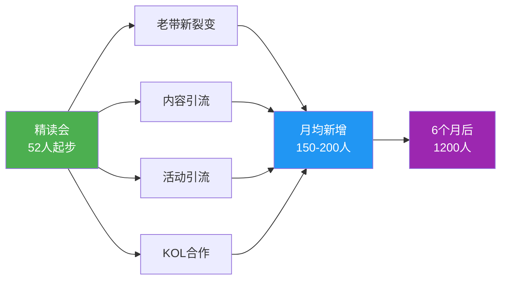
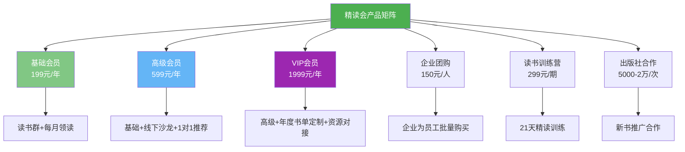
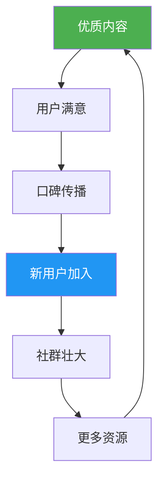

## 案例一：从0到5000人的读书社群，年变现200万

本案例完整复盘一个读书社群从零起步到年营收200万的全过程。重点拆解每个阶段的核心策略、关键决策节点和可复用的方法论。读者可按图索骥，将这套打法迁移到自己的垂类社群中。

### 一、案例主角与背景

刘洋（化名），30岁，原某出版社编辑，有5年图书行业经验，每年精读100+本书。2021年开始在公众号写读书笔记，凭借专业的选书眼光和扎实的笔记功底，一年内积累了1万粉丝。

**关键背景信息：**

| 维度 | 具体情况 |
|------|----------|
| 专业背景 | 出版社编辑5年，熟悉图书产业链 |
| 内容积累 | 公众号1万粉丝，日均阅读量800-1200 |
| 个人优势 | 选书能力强、笔记方法论成熟、表达清晰 |
| 启动资金 | 约5000元（主要用于工具和活动物料） |
| 时间投入 | 前6个月每天3-4小时，稳定后每天1-2小时 |

**为什么选择读书社群这个赛道？**

刘洋做过详细的赛道分析。读书社群有几个天然优势：

1. **需求刚性**——职场人普遍存在"想读书但读不下去"的痛点，这不是伪需求
2. **内容复利**——一本书的领读内容可以反复使用，边际成本趋近于零
3. **社交货币**——"我在一个读书社群"本身就有社交价值，用户愿意主动传播
4. **供给稀缺**——市面上的读书产品要么太浅（听书），要么太散（豆瓣小组），缺乏"带读+社交+实践"的闭环体验

### 二、社群定位与价值设计

**社群名称：** "精读会"

**一句话定位：** 帮助职场人每月精读1本商业好书，用读书改变思维方式

**目标人群画像：**

| 维度 | 描述 |
|------|------|
| 年龄 | 25-40岁 |
| 职业 | 互联网、金融、咨询等知识密集型行业 |
| 收入 | 月薪1-3万，有付费能力 |
| 痛点 | 想读书但读不完、读了记不住、记住了用不上 |
| 需求 | 结构化阅读方法 + 同频社交圈 + 学以致用的场景 |

**定位的精妙之处——"每月精读1本"**

这个定位暗含三层设计：

- **降低门槛**——"每月1本"比"多读书"具体得多，用户知道自己在承诺什么
- **制造节奏**——月度周期天然形成运营节奏（选书→领读→讨论→总结），用户有预期
- **筛选用户**——愿意"精读"的人，本身就有较强的学习意愿和付费能力

> **定位方法论：** 好的社群定位 = 目标人群 + 具体承诺 + 可衡量的结果。"精读会"的公式是"职场人 + 每月精读1本 + 改变思维方式"。避免模糊定位如"一起成长""终身学习"，这类定位无法筛选用户，也无法衡量交付。

### 三、冷启动阶段：0-100人（第1个月）

#### 3.1 核心策略：个人邀请 + 免费体验 + 筛选机制

冷启动的关键不是"拉人"，而是"选人"。刘洋没有追求人数，而是追求质量。

**具体执行步骤：**

**第一步：从公众号粉丝中筛选种子用户（第1-3天）**

从1万粉丝中筛选了200个高互动用户，筛选标准：

- 近30天内有留言或点赞行为
- 留言内容体现思考深度（不是"好文"这类泛泛评论）
- 头像和昵称看起来是真实用户（排除营销号）

筛选工具：公众号后台 → 用户分析 → 留言管理，手动标记。

**第二步：逐一私聊邀请（第3-7天）**

私聊话术模板：

```text
你好，我是精读会的刘洋。看到你经常在公众号留言，感觉你对读书
很有热情。我最近在做一个7天读书挑战的实验，想邀请你一起参加。
不收费，就是每天读1章，然后在群里分享你的收获。有兴趣吗？
```

话术设计要点：
- **说明来源**——"看到你经常留言"，让对方知道不是群发
- **降低承诺**——"7天挑战"，不是"加入社群"，心理负担小
- **不提钱**——先体验，后转化，避免在信任不足时谈付费
- **制造稀缺**——"实验"暗示名额有限，激发参与意愿

200人私聊，100人回复并报名，转化率50%。这个数字说明筛选标准是有效的。

**第三步：7天免费读书挑战（第7-14天）**

挑战设计：

| 天数 | 任务 | 交付形式 |
|------|------|----------|
| Day 1 | 阅读序言+第1章，写下3个关键词 | 群内文字打卡 |
| Day 2 | 阅读第2章，画1张思维导图 | 图片打卡 |
| Day 3 | 阅读第3章，写100字读后感 | 群内文字 |
| Day 4 | 阅读第4章，找1个可以应用到工作的点 | 群内文字 |
| Day 5 | 阅读第5章，对比自己的经验 | 群内文字 |
| Day 6 | 全书回顾，写500字总结 | 朋友圈+群内 |
| Day 7 | 线上分享会，每人3分钟 | 视频会议 |

关键设计：
- **任务难度递进**——从关键词到思维导图到完整输出，循序渐进
- **Day 6要求发朋友圈**——自然裂变，完成挑战的人会有成就感愿意分享
- **Day 7线上分享会**——创造社交连接，让成员之间产生关系

**第四步：转化付费（第14-21天）**

挑战结束后，52人付费成为"精读会"正式会员，定价199元/年。转化率52%（基于完成挑战的70人）。

转化话术的核心逻辑：

```text
过去7天我们一起读完了《XXX》，大家的反馈都不错。
接下来我会把这个模式持续下去，每月精读1本好书。
正式会员199元/年，包含：
- 每月1本书的完整领读（每天30分钟音频+笔记）
- 每周1次线上讨论会
- 精选书单推荐
- 会员专属交流群
前100名创始会员额外赠送：年度精选书单（50本）
```

转化率52%的秘密：
- **先体验后付费**——7天挑战已经建立了信任和习惯
- **价格锚定**——199元/年≈16.6元/月，比一杯奶茶还便宜
- **创始会员身份**——制造稀缺感和归属感
- **赠品加码**——书单是零成本的，但对用户有高感知价值

#### 3.2 冷启动阶段的数据复盘

| 指标 | 数据 | 行业参考值 |
|------|------|------------|
| 私聊邀请数 | 200人 | — |
| 回复率 | 50% | 20-40% |
| 挑战报名数 | 100人 | — |
| 挑战完成率 | 70% | 30-50% |
| 付费转化率 | 52% | 10-30% |
| 创始会员数 | 52人 | — |
| 客单价 | 199元 | — |
| 首月收入 | 10,348元 | — |

> **复盘要点：** 完成率70%远高于行业平均，关键原因是任务设计合理、群内互相督促。转化率52%说明"先体验后付费"是最有效的冷启动策略。

### 四、增长阶段：100-1000人（第2-7个月）

#### 4.1 四大增长引擎

进入增长阶段后，刘洋搭建了四条并行的增长通道：



#### 4.2 引擎一：老带新裂变机制

**机制设计：** "邀请1位好友入会，双方各延长1个月会员"

这个裂变设计有几个巧妙之处：
- **双向激励**——邀请者和被邀请者都有奖励，降低推荐的心理负担
- **延长期限而非现金**——避免"卖课赚钱"的功利感，更像朋友间的推荐
- **可叠加**——邀请3人就多3个月，激励深度用户持续推荐

**裂变系数：1.3**（每个老会员平均带来1.3个新会员）

裂变系数计算公式：

```text
裂变系数 K = 邀请率 × 邀请转化率

邀请率 = 发出邀请的老会员比例（本案例约60%）
邀请转化率 = 被邀请人最终付费的比例（本案例约55%）

K = 60% × 55% ≈ 1.3
```

K > 1 意味着社群可以自增长，不需要持续投入外部流量。这是社群运营的理想状态。

**提升裂变系数的实操技巧：**

| 策略 | 具体做法 | 预期效果 |
|------|----------|----------|
| 降低分享门槛 | 提供一键生成的邀请海报 | 邀请率+15% |
| 制造分享素材 | 每月书单、金句卡片、读书笔记模板 | 邀请率+10% |
| 设计分享场景 | "读完这本书，你想推荐给谁？" | 邀请率+20% |
| 优化新用户体验 | 新人入群后48小时内跟进 | 转化率+20% |
| 设置阶梯奖励 | 邀请3人解锁专属书单，邀请5人解锁1v1推荐 | 深度裂变+30% |

#### 4.3 引擎二：内容引流

**平台选择与内容策略：**

| 平台 | 内容形式 | 发布频率 | 单篇平均数据 |
|------|----------|----------|--------------|
| 小红书 | "1分钟读完一本书"图文笔记 | 每周3篇 | 阅读2000，收藏300 |
| 抖音 | "1分钟读完一本书"短视频 | 每周2条 | 播放5000，点赞200 |
| 公众号 | 深度书评+社群故事 | 每周1篇 | 阅读1500，转发100 |

**爆款内容模板——"1分钟读完一本书"**

结构：
1. **痛点切入**（5秒）——"你有没有读完一本书却什么都没记住的经历？"
2. **核心观点**（20秒）——提炼全书最核心的1个观点，用故事或案例说明
3. **行动建议**（10秒）——给出1个今天就能用的行动建议
4. **引导关注**（5秒）——"想看完整版笔记？关注我，回复'书名'领取"

**引流转化路径：**

```text
短视频/笔记 → 关注账号 → 私信领取资料 → 添加个人微信 → 邀请免费体验 → 付费入会
```

每个环节的转化率：
- 短视频 → 关注：3-5%
- 关注 → 私信：15-20%
- 私信 → 加微信：60-70%
- 加微信 → 免费体验：40-50%
- 免费体验 → 付费：30-40%

**综合转化率：约0.3-1.4%**（即每1000个短视频播放，产生3-14个付费会员）

#### 4.4 引擎三：活动引流

每月举办1次线下读书沙龙，规则设计：

- **免费参加**——降低参与门槛
- **参加条件**：必须是会员，或者由现有会员带入（每人每次可带1位非会员朋友）
- **活动流程**：破冰（15分钟）→ 主题分享（30分钟）→ 分组讨论（30分钟）→ 自由交流（30分钟）
- **活动成本**：场地费（书店/咖啡馆合作，零成本或500元以内）+ 物料（书签、手册，约200元）

**线下活动的隐藏价值：**
- 面对面建立的信任远超线上，现场转化率高达40-60%
- 参与者拍照发朋友圈，产生二次传播
- 优质参与者可以发展为社群志愿者或KOC

#### 4.5 引擎四：KOL合作

邀请3位知名读书博主做客社群分享，合作模式：

| KOL类型 | 合作方式 | 成本 | 预期效果 |
|----------|----------|------|----------|
| 10万粉读书博主 | 线上分享1次 | 2000-5000元 | 新增200-500关注 |
| 出版社编辑 | 联合推荐新书 | 资源置换（免费赠书） | 新增100-200关注 |
| 企业高管/作者 | 读书会嘉宾 | 资源置换（社群推广） | 新增50-100关注 |

**KOL合作的关键原则：**
- 不找头部大V（费用高、粉丝不精准），找垂类中腰部博主
- 提供社群作为博主的"粉丝福利"渠道，博主免费获得活跃社群的曝光
- 合作内容要对博主的粉丝有真实价值，不是硬广

#### 4.6 增长阶段数据汇总

| 月份 | 月初人数 | 新增 | 流失 | 月末人数 | 月收入 |
|------|----------|------|------|----------|--------|
| 第2月 | 52 | 120 | 5 | 167 | 约2.4万 |
| 第3月 | 167 | 180 | 10 | 337 | 约3.6万 |
| 第4月 | 337 | 200 | 15 | 522 | 约4.0万 |
| 第5月 | 522 | 220 | 20 | 722 | 约4.4万 |
| 第6月 | 722 | 250 | 25 | 947 | 约5.0万 |
| 第7月 | 947 | 280 | 30 | 1197 | 约5.6万 |

**月流失率约3-4%**，行业平均为5-10%。低流失率的原因：持续的内容价值+强社交关系+合理的会员权益。

### 五、变现深化阶段：1000-5000人（第8-19个月）

#### 5.1 从单一会员到产品矩阵

当会员突破1000人后，单一的199元/年会员模式遇到了天花板：

- **增长瓶颈**——199元的定价筛选出了价格敏感型用户，但漏掉了高净值用户
- **需求分化**——有人只要线上内容，有人要线下社交，有人要深度定制服务
- **营收瓶颈**——199元 × 1000人 = 19.9万/年，扣除成本后利润有限

**解决方案：设计分层产品矩阵**



#### 5.2 各产品线详细拆解

**产品线一：基础会员（199元/年）——流量入口**

| 维度 | 详情 |
|------|------|
| 价格 | 199元/年 |
| 权益 | 每月领读音频+笔记、每周线上讨论、会员群交流 |
| 人数 | 约3000人 |
| 年收入 | 59.7万 |
| 定位 | 低价引流，建立用户基础，筛选高意向用户 |

**产品线二：高级会员（599元/年）——利润核心**

| 维度 | 详情 |
|------|------|
| 价格 | 599元/年 |
| 权益 | 基础会员全部权益 + 每月线下沙龙 + 1对1书单推荐 + 优先参加训练营 |
| 人数 | 约800人 |
| 年收入 | 47.9万 |
| 定位 | 满足社交需求的用户，线下体验是核心差异化 |

**产品线三：VIP会员（1999元/年）——高端服务**

| 维度 | 详情 |
|------|------|
| 价格 | 1999元/年 |
| 权益 | 高级会员全部权益 + 年度书单定制（根据职业和目标） + 资源对接（人脉推荐） + 专属微信群 |
| 人数 | 约200人 |
| 年收入 | 40万 |
| 定位 | 高净值用户，提供稀缺的定制服务和人脉价值 |

**产品线四：企业团购（150元/人，50人起）——规模化**

| 维度 | 详情 |
|------|------|
| 价格 | 150元/人（团购折扣） |
| 权益 | 基础会员权益 + 企业专属书单 + 团队读书报告 |
| 人数 | 约500人（10家企业） |
| 年收入 | 7.5万 |
| 定位 | B端渠道，批量获客，提升总人数 |

**产品线五：读书训练营（299元/期）——高转化**

| 维度 | 详情 |
|------|------|
| 价格 | 299元/期（21天） |
| 权益 | 21天精读1本书 + 每天领读+作业 + 结营证书 + 优秀学员奖励 |
| 规模 | 每期100人，每年6期 |
| 年收入 | 17.9万 |
| 定位 | 非会员的付费入口，转化率为20-30%进入年费会员 |

**产品线六：出版社合作（5000-20000元/次）——品牌溢价**

| 维度 | 详情 |
|------|------|
| 价格 | 5000-20000元/次 |
| 内容 | 新书领读推广、联合活动、书评撰写 |
| 频次 | 约20次/年 |
| 年收入 | 25万 |
| 定位 | 品牌变现，出版社愿意为精准的读书人群付费 |

#### 5.3 产品矩阵的营收结构

```text
基础会员    59.7万  29.9%  ██████████████
高级会员    47.9万  24.0%  ████████████
VIP会员     40.0万  20.0%  ██████████
出版社合作  25.0万  12.5%  ██████
训练营      17.9万   9.0%  ████
企业团购     7.5万   3.8%  ██
───────────────────────────────
合计       198.0万  100%
```

**营收结构分析：**
- 基础会员贡献最大营收（30%），但利润率最低（主要成本是内容制作）
- 高级会员和VIP会员合计贡献44%营收，且利润率高（线下活动成本可控）
- 出版社合作是纯利润（零边际成本），占比12.5%但利润贡献超20%
- 训练营和企业团购是增量来源，未来有放大空间

### 六、运营体系与日常节奏

#### 6.1 社群运营的"月度节奏"

精读会的运营围绕"每月一本书"形成了稳定的月度节奏：

```mermaid
gantt
    title 精读会月度运营节奏
    dateFormat  DD
    axisFormat %d日

    section 内容运营
    选书+书单发布       :a1, 01, 2d
    每日领读音频         :a2, 03, 25d
    每周讨论会(4次)      :a3, 07, 1d
    月度总结+证书        :a4, 28, 2d

    section 社群活动
    新人欢迎+破冰        :b1, 01, 2d
    线下沙龙            :b2, 15, 1d
    读书分享会           :b3, 22, 1d

    section 增长运营
    裂变活动             :c1, 10, 3d
    内容发布(全月)       :c2, 01, 28d
    KOL合作             :c3, 20, 2d
```



#### 6.2 每日运营SOP

| 时间 | 任务 | 负责人 | 工具 |
|------|------|--------|------|
| 08:00 | 发布今日领读音频（5-10分钟） | 刘洋 | 录音笔+剪辑软件 |
| 08:30 | 发布领读笔记到群内 | 助理 | 飞书文档 |
| 12:00 | 群内话题引导（与今日内容相关） | 助理 | 企业微信 |
| 20:00 | 回复群内问题，参与讨论 | 刘洋 | 企业微信 |
| 21:00 | 朋友圈发布读书金句/感悟 | 刘洋 | 微信 |

#### 6.3 每周运营SOP

| 星期 | 任务 |
|------|------|
| 周一 | 发布本周阅读计划+讨论话题预告 |
| 周三 | 线上讨论会（1小时，腾讯会议） |
| 周五 | 本周学习精华汇总（群公告+公众号） |
| 周日 | 下周预告+裂变提醒 |

### 七、关键成功因素深度拆解

#### 7.1 精准定位："每月精读1本"比"多读书"更有可执行性

定位的底层逻辑是**降低决策成本**。用户不需要想"我该读什么书""我该怎么读"，社群已经替他做好了选择。这本质上是一种**认知外包**——用户把自己的阅读决策外包给社群，换取确定性和效率。

可复制的定位公式：

```text
好的社群定位 = [目标人群] + [具体承诺] + [可衡量的结果]

示例：
- "帮助程序员每周精读1篇技术论文" → 具体、可衡量
- "帮助销售每月掌握1个成交技巧" → 解决真实痛点
- "帮助宝妈每天15分钟完成亲子阅读" → 降低行动门槛
```

#### 7.2 仪式感设计：让"读书"变成"事件"

精读会的仪式感体系：

| 仪式 | 频率 | 具体设计 | 心理效果 |
|------|------|----------|----------|
| 月度书单发布 | 每月1号 | 精美海报+选书理由+阅读指南 | 期待感、仪式感 |
| 每日领读 | 每天 | 固定时间、固定格式的音频 | 习惯养成、陪伴感 |
| 讨论会 | 每周 | 主持人引导、有主题、有总结 | 参与感、归属感 |
| 完读证书 | 每月 | 电子证书+实体证书（VIP） | 成就感、分享欲 |
| 年度书单回顾 | 每年 | 全年阅读数据报告 | 数据可视化、成就感 |

**仪式感的本质**是给用户**可预期的正反馈**。每次仪式都是一次"奖励"，强化用户继续参与的动机。

#### 7.3 社交价值：从"读书群"到"人脉圈"

精读会的会员构成：互联网从业者35%、金融从业者20%、创业者15%、自由职业者10%、其他20%。

这个构成创造了一个**高质量的弱关系网络**。会员之间自发产生了：
- **求职内推**——社群内发布招聘信息，成功率远高于招聘网站
- **业务合作**——不同行业的会员互相提供资源和渠道
- **经验交流**——跨行业的视角碰撞产生新想法

> **私域流量的终极价值不是"卖东西"，而是"建网络"。** 当社群成为一个高质量的人际网络时，它的价值远超会员费本身。用户续费不是因为"内容好"，而是因为"离不开这个圈子"。

#### 7.4 内容IP：让"精读会"本身成为品牌

刘洋刻意打造了"精读会"的品牌资产：

- **视觉识别**——统一的logo、配色、海报模板
- **内容品牌**——"精读会书单"成为用户选书的权威参考
- **口碑传播**——"我在精读会"成为一种身份标签
- **IP延伸**——从社群延伸到公众号、短视频、线下活动

### 八、踩过的坑与避坑指南

#### 8.1 冷启动阶段的坑

**坑1：贪多求快，一开始就追求规模**

刘洋最初想通过免费社群快速拉到500人再转化，但发现免费群活跃度极低，转化率不到5%。后来改为"小规模高质量种子用户+免费体验"的策略，效果好了10倍。

**教训：** 冷启动阶段，质量远比数量重要。100个精准用户 > 1000个泛用户。

**坑2：免费体验时间太长**

最初设计了14天免费体验，但发现第7天之后完成率急剧下降。因为14天太长，用户失去了新鲜感。

**教训：** 免费体验控制在7天以内，刚好够建立习惯，又不至于让用户失去兴趣。

#### 8.2 增长阶段的坑

**坑3：裂变活动"用力过猛"**

一次裂变活动设置了"邀请5人送实体书"的奖励，结果出现了大量薅羊毛行为——有人用小号凑数，导致社群质量下降。

**教训：** 裂变奖励要与社群价值挂钩（如延长会员期限），避免用物质奖励吸引非目标用户。

**坑4：盲目追求日活**

有一段时间刘洋每天在群里发起话题讨论，结果群变成了"信息过载"，部分高质量用户因为消息太多而退群。

**教训：** 社群活跃度不是越高越好。要控制信息密度，宁可少而精，不要多而杂。

#### 8.3 变现阶段的坑

**坑5：VIP会员服务跟不上**

VIP会员推出后，200人中有30人要求"年度书单定制"，但刘洋一个人做不过来，导致交付延迟，引发投诉。

**教训：** 推出高端产品前，先确认交付能力。可以先小范围测试（如20人），跑通流程后再扩大。

**坑6：出版社合作接太多**

一度为了收入接了过多的出版社推广，导致领读书单变成了"广告书单"，会员信任度下降。

**教训：** 合作收入不能超过总收入的15%，且每本推荐书必须经过严格筛选，宁可推掉合作也不能损害会员信任。

### 九、可复制的方法论

将本案例的方法论提炼为可直接复用的框架：

#### 9.1 社群冷启动公式

```text
冷启动成功 = 精准种子用户 × 低门槛体验 × 强交付 × 自然转化

第一步：从已有渠道筛选200个高互动用户
第二步：设计7天免费体验（每天1个简单任务）
第三步：确保体验期内超额交付（比承诺的多给20%）
第四步：体验结束后自然推出付费产品（转化率30-50%）
```

#### 9.2 社群增长飞轮



核心逻辑：内容是飞轮的发动机，口碑是飞轮的加速器。

#### 9.3 产品分层设计模板

| 层级 | 定价策略 | 核心差异 | 目标占比 |
|------|----------|----------|----------|
| 入门层 | 99-299元 | 标准化内容，高性价比 | 60% |
| 进阶层 | 499-999元 | 增加社交+互动元素 | 25% |
| 高端层 | 1999元以上 | 定制服务+稀缺资源 | 10% |
| 企业层 | 按人头计价 | 团队管理+批量服务 | 5% |

#### 9.4 社群健康度检查清单

每月用以下指标检查社群健康度：

| 指标 | 健康值 | 警戒值 | 危险值 |
|------|--------|--------|--------|
| 月留存率 | >95% | 90-95% | <90% |
| 日活跃率 | >30% | 15-30% | <15% |
| 裂变系数 | >1.2 | 1.0-1.2 | <1.0 |
| 付费转化率 | >30% | 15-30% | <15% |
| NPS推荐值 | >50 | 30-50 | <30 |
| 内容完成率 | >60% | 40-60% | <40% |

### 十、本案例的核心启示

1. **社群不是微信群，是产品。** 精读会的成功在于把社群当产品来设计——有定位、有定价、有分层、有迭代。
2. **冷启动的关键是"选"不是"拉"。** 200个精准用户中筛选52个付费会员，比从2000个泛用户中转化效果好10倍。
3. **增长飞轮的发动机是内容，加速器是口碑。** 裂变机制只是放大器，核心还是内容和体验足够好。
4. **变现不能一步到位。** 从199元单品到200万产品矩阵，是18个月的渐进过程。每一步都要验证模型再放大。
5. **社群的终极价值是网络效应。** 当会员之间产生了自发的连接和价值交换，社群就拥有了超越内容本身的生命力。

***
