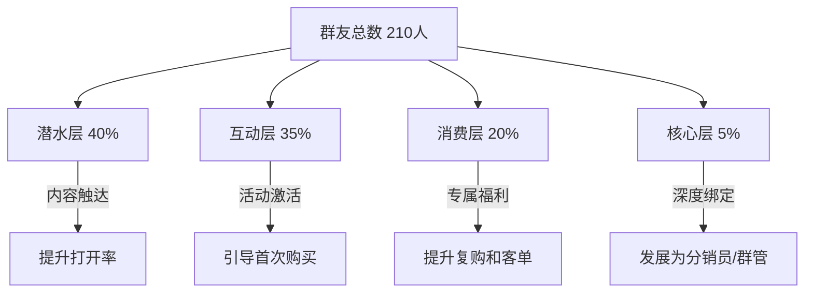

## 案例二：宝妈社群的私域电商变现

### 案例背景

王敏（化名），32岁，原外贸公司跟单员，2020年怀孕后辞职在家。孩子出生后，她发现身边大量宝妈有强烈的育儿交流需求和品质母婴用品的购买需求，但缺乏可信赖的信息源。2021年3月，她以"敏妈好物"为名在微信上开始运营第一个宝妈社群，从0起步，到2023年底实现月均收入15000元以上。

**为什么选择宝妈赛道？**

宝妈群体在私域电商中有天然优势，这些优势构成了选赛道时的核心逻辑：

| 维度 | 宝妈群体特征 | 对私域电商的价值 |
|------|-------------|-----------------|
| 决策链 | 高度依赖口碑和真实体验 | 社群推荐转化率远高于广告 |
| 消费频次 | 母婴用品消耗快，复购周期短 | 单用户LTV高 |
| 社交属性 | 强烈的交流和归属需求 | 社群活跃度天然高 |
| 信任传递 | 宝妈之间的信任度极高 | 裂变系数大 |
| 时间分布 | 全职妈妈白天时间相对碎片化 | 碎片化运营可行 |

### 社群定位与冷启动

#### 精准定位

王敏没有泛泛地做"母婴好物群"，而是聚焦了三个关键点：

1. **人群聚焦：** 0-3岁宝宝的全职/半职妈妈（孩子年龄越小，消费决策越焦虑，社群价值越高）
2. **地域聚焦：** 以二线城市为核心（一线妈妈选择多、价格敏感度低；三四线购买力有限；二线城市是甜蜜点）
3. **价值聚焦：** 不是"卖货群"，而是"帮你省时间、少踩坑的育儿好物交流群"（定位为信息筛选服务而非销售）

**社群名称：** "敏妈0-3岁好物避坑群"

这个命名包含了四个信息锚点：人格IP（敏妈）、人群（0-3岁）、功能（好物）、价值（避坑）。

#### 冷启动阶段（0-200人，用时45天）

**第一周：种子用户获取（目标50人）**

王敏没有花钱投广告，而是用了三条低成本路径：

1. **妈妈班/产检群转化：** 她怀孕时加入了3个本地妈妈微信群（医院建的孕妈群、月子中心群、早教机构群），在群里长期活跃、回答问题，积累了"靠谱妈妈"的人设。她私聊了30个互动较多的群友，说明建群目的（交流育儿好物，不卖货），邀请入群。第一周进群42人。

2. **朋友圈预热：** 连续7天发布"踩坑日记"系列朋友圈——记录自己买过的鸡肋母婴用品和真正好用的产品，附上真实使用照片。每条朋友圈末尾加一句"想看完整避坑清单的私信我"。这条路径带来了18个精准用户。

3. **小红书引流：** 发布了3篇笔记（《我花了2万买的母婴用品，这10样千万别买》《0-1岁真正好用的20件东西》《二胎妈妈的待产包极简清单》），其中第一篇获得800+赞，通过评论区和私信引导，有23人入群。

**第二至第六周：内容沉淀+口碑扩散**

入群后，王敏做了几件关键的事：

- **每日固定栏目：** 早上8:30发一条"今日好物点评"（一个真实产品的优缺点分析），晚上9:00发一条"宝妈夜话"（育儿经验分享，非卖货内容）。这两个栏目建立了用户每天打开群的习惯。
- **真实测评机制：** 每周发起1次"众测"——王敏自费购买一款产品，邀请5位群友试用，然后把真实评价整理成图文发到群里。这个机制极大提升了信任度。
- **"不卖货"承诺兑现：** 前45天，群里没有发过任何购买链接。这个克制反而让群友主动问"在哪里买"。

到第45天，群人数达到210人，其中约60%是老成员邀请进来的新成员。

### 电商变现的三层产品体系

王敏设计了从低到高的三层变现体系，每一层解决不同的商业目标：

#### 第一层：引流品——低价好物拼团

**目的：** 建立购买习惯，验证需求，筛选活跃买家

**运营方式：**
- 每周发起1-2次拼团，选择单价20-80元的母婴消耗品（湿巾、辅食工具、绘本等）
- 拼团价格比淘宝低15%-25%（王敏通过1688和品牌方直谈拿到低价）
- 拼团链接通过小程序发布，不刷屏，每次只推1-2个品
- 每个品附带王敏自己的使用体验和对比分析（不少于300字）

**数据表现：**
- 每次拼团参与人数：30-60人（占群人数的15%-30%）
- 平均客单价：45元
- 月均拼团GMV：8000-12000元
- 佣金/差价利润率：15%-20%
- 月均利润：1200-2400元

#### 第二层：利润品——品牌团购专场

**目的：** 主要利润来源，建立"独家优惠"的认知

**运营方式：**
- 每月2-3次专场团购，选择中高客单价产品（婴儿推车、安全座椅、辅食机等，客单价200-800元）
- 与品牌方或总代谈判"社群专属价"，通常比天猫旗舰店低20%-35%
- 团购前做3天预热：产品对比测评→使用场景展示→价格揭晓
- 限时48小时下单，营造紧迫感
- 每次团购设置"满XX人解锁赠品"的阶梯机制

**选品标准（王敏的五条红线）：**
1. 自己和孩子必须实际使用过，至少2周以上
2. 有正规品牌授权和质检报告
3. 售后服务有保障（7天无理由退换）
4. 利润率不低于20%
5. 不碰食品、药品、入口类产品（风险太高）

**数据表现：**
- 每次团购下单人数：40-80人
- 平均客单价：350元
- 月均团购GMV：30000-50000元
- 利润率：20%-30%
- 月均利润：6000-15000元

#### 第三层：高价值品——定制化服务

**目的：** 服务头部用户，提升ARPU值

**具体形式：**
1. **"敏妈严选"年度会员卡：** 299元/年，享受全年团购额外5%折扣、每月1次专属选品咨询、优先参与新品试用
2. **"待产包/辅食方案"定制服务：** 199元/次，根据孕周或月龄定制个性化采购清单+购买渠道+预算规划
3. **闲置物品寄卖：** 帮群友转让二手母婴用品，收取10%服务费

**数据表现：**
- 年度会员：80人×299元 = 23920元/年
- 定制服务：月均8单×199元 = 1592元/月
- 闲置寄卖：月均佣金约400元

### 运营体系与日常节奏

王敏的社群运营不是"想到什么发什么"，而是有严格的SOP（标准操作流程）：

#### 每日运营节奏

| 时间 | 内容 | 目的 |
|------|------|------|
| 8:30 | 今日好物点评（1个产品，300字+实拍图） | 建立专业感，培养打开习惯 |
| 12:00 | 育儿小知识/辅食食谱 | 非卖货内容，保持群价值 |
| 15:00 | 群友问题答疑 | 增强互动和信任 |
| 21:00 | 宝妈夜话（育儿经验/情感话题） | 情感连接，提高留存 |
| 不定期 | 拼团/团购信息（每周不超过3次） | 变现 |

#### 每周运营节奏

| 日期 | 重点工作 |
|------|---------|
| 周一 | 发布本周好物计划预告 |
| 周二 | 1次拼团活动 |
| 周三 | 众测招募+产品试用 |
| 周四 | 拼团结果公示+发货通知 |
| 周五 | 本周精华内容整理（发到公众号/小红书） |
| 周六 | 周末团购专场（如有） |
| 周日 | 休息/下周选品调研 |

#### 用户分层管理

王敏用企业微信的标签功能对用户进行分层，不同层级采用不同策略：

**核心层管理策略：**
王敏从消费频次高、互动积极的群友中筛选出8位"敏妈推荐官"，给予以下权益：
- 每月赠送1款新品试用
- 专属推荐码（好友通过推荐码购买，推荐官获得8%返利）
- 优先参与产品选品讨论
- 每季度1次线下聚会

这8位推荐官每月平均带来15-20个新客户，贡献约15%的月度GMV。

### 关键转折点与危机处理

#### 转折点一：从"不卖货"到"第一次卖货"的信任跨越

第46天，王敏发起了第一次拼团。她在群里写了一段长文说明：

> "姐妹们，这45天大家看我测评了这么多东西，不少人问我在哪买。我想了很久，决定以后看到好东西会帮大家谈个团购价。但有三条我跟你们保证：第一，我推荐的每一样东西我自己都在用；第二，价格一定比你们自己买便宜；第三，如果觉得不好，7天内我帮你们退。如果哪天我做不到这三条，你们随时可以骂我。"

这段话的效果是：第一次拼团参与率达到48%（101人下单），远高于行业平均的5%-10%。核心原因是45天的"克制"积累了足够的信任资本。

#### 转折点二：一次产品质量危机的处理

2021年9月，王敏团购了一批婴儿湿巾，有3位群友反映收到的产品包装有破损。王敏的处理方式成为社群运营的经典案例：

1. **2小时内响应：** 看到反馈后立刻在群里公开道歉，承诺所有购买者都可以无条件退换
2. **超预期补偿：** 不仅全额退款，还额外赠送了一包其他品牌的湿巾作为体验
3. **溯源追责：** 联系供应商查明原因（物流环节挤压），要求供应商更换包装方案
4. **公开复盘：** 把整个处理过程写成图文发到群里，附上供应商的改进承诺

结果：3位投诉用户全部成为后续高频复购者，群内信任度反而因为这次危机处理而提升。

### 从微信社群到全域私域的进化

2022年下半年，王敏开始将单一微信群扩展为全域私域体系：

#### 私域流量矩阵

| 平台 | 定位 | 粉丝数 | 功能 |
|------|------|--------|------|
| 微信群（3个） | 核心交流+团购 | 共600人 | 主要变现场景 |
| 企业微信 | 1对1服务+标签管理 | 800好友 | 高价值客户维护 |
| 公众号 | 深度内容沉淀 | 3500粉 | SEO引流+内容资产 |
| 小红书 | 公域获客 | 1.2万粉 | 每月引流50-80人到私域 |
| 抖音 | 短视频种草 | 8000粉 | 品牌曝光+引流 |
| 微信小程序 | 下单+会员管理 | 600注册用户 | 交易闭环 |

#### 内容复用策略

王敏的内容生产遵循"一次创作，多平台分发"原则：

1. **源头：** 每周深度测评1款产品，产出1篇2000字长文+10张实拍图+1段60秒短视频
2. **公众号版：** 完整长文，附详细参数对比表
3. **小红书版：** 提炼为500字图文笔记，突出"避坑"和"省钱"关键词
4. **抖音版：** 60秒短视频，展示产品使用过程，口播核心结论
5. **社群版：** 精简为300字+3张图的群消息
6. **朋友圈版：** 1句话总结+1张图+1个表情

这种复用策略让王敏以每天2-3小时的内容投入覆盖了5个平台。

### 成果数据总览

#### 收入增长曲线

| 阶段 | 时间 | 月均收入 | 月均GMV | 核心动作 |
|------|------|---------|---------|---------|
| 冷启动期 | 第1-2月 | 0元 | 0元 | 建群、内容沉淀、不卖货 |
| 验证期 | 第3-4月 | 2000元 | 12000元 | 小规模拼团测试 |
| 增长期 | 第5-8月 | 6000元 | 30000元 | 品牌团购+裂变增长 |
| 稳定期 | 第9-12月 | 12000元 | 55000元 | 产品线完善+用户分层 |
| 扩展期 | 第13-18月 | 15000元+ | 70000元+ | 全域私域+分销体系 |

#### 成本结构

| 成本项 | 月均支出 | 说明 |
|--------|---------|------|
| 产品自购测评 | 800元 | 每月约5-8款新品试用 |
| 工具费用 | 200元 | 企业微信SCRM、小程序年费 |
| 快递补贴 | 300元 | 部分团购包邮补贴 |
| 赠品/补偿 | 200元 | 客户维护和危机处理 |
| **合计** | **1500元** | **利润率约85%-90%** |

### 经验总结与方法论提炼

#### 宝妈社群私域电商的五个核心法则

**法则一：信任先行，变现后置**

王敏的案例证明，前期的"克制"是后期高转化的基础。具体操作建议：新社群建立后，至少用2-4周时间做纯价值输出（不发任何购买链接），建立"这个人是真的在帮我"的认知后再开始变现。

**法则二：真实体验是最强的销售话术**

宝妈群体对广告的辨识能力极强，任何模板化的推销话术都会被识别和排斥。王敏的每条推荐都基于真实使用体验，包括产品的缺点（"这个推车好用，但是收起来有点重，力气小的妈妈可能吃力"）。这种"不完美的诚实"反而比完美话术更有说服力。

**法则三：选品决定生死**

宝妈社群的选品必须遵循三个原则：
1. **自用优先：** 你自己和孩子不用的东西不要推荐
2. **安全红线：** 入口类、药品类、二手安全座椅等高风险品类坚决不碰
3. **复购驱动：** 优先选择消耗品（纸尿裤、湿巾、辅食），而非耐用品（推车、床）

**法则四：社群温度比社群规模更重要**

王敏始终保持微信群不超过200人。超过200人时，她会开新群而不是扩容。原因：
- 200人以内，她能记住大部分群友的名字和孩子月龄
- 小群的互动率是大群的3-5倍
- 用户的"被重视感"直接决定购买意愿

**法则五：把售后变成二次营销的机会**

每一次售后处理都是展示人品和专业度的窗口。王敏的标准是"比用户期望多做一步"——用户要求退款，她退款+送赠品；用户问产品问题，她回答+推荐替代方案。这些额外动作的成本很低，但带来的复购和口碑效应是巨大的。

#### 常见误区警示

| 误区 | 正确做法 |
|------|---------|
| 疯狂拉人，追求群人数 | 质量>数量，精准人群200人胜过泛人群2000人 |
| 每天刷屏发产品链接 | 80%内容价值输出，20%商业转化 |
| 什么品类都卖 | 聚焦母婴垂直品类，宁可少而精 |
| 用个人微信运营 | 用企业微信+SCRM工具，实现标签化管理 |
| 只做微信群 | 构建公众号+小红书+小程序的全域私域 |
| 遇到投诉就删评/踢人 | 透明处理危机，把投诉变成信任升级的机会 |
| 完全依赖社群变现 | 社群是信任场，变现要配合公众号、小程序等交易场景 |

### 适用人群与复用建议

本案例的模式适用于以下人群复用：

- **全职妈妈：** 有育儿实战经验，时间相对灵活
- **母婴行业从业者：** 有供应链资源和产品知识
- **社区团购团长：** 有本地用户基础，可向垂直品类转型
- **任何有垂直领域专业知识的人：** 核心逻辑（信任积累→分层变现）是通用的

复用时需要注意的关键变量：

1. **选品供应链：** 没有供应链经验的新手，可以从品牌分销平台（如云集、贝店、好省等）起步，用现成供应链验证模式，再逐步对接独立供应商
2. **内容能力：** 不需要文笔多好，关键是真实。一张随手拍的使用照片比精修图更有说服力
3. **时间投入：** 前3个月每天至少投入2-3小时，稳定后可以缩减到1-2小时/天
4. **启动资金：** 理想启动资金3000-5000元（用于产品自购测评和初期补贴），最低500元也能起步（只做纯信息筛选和对接，不囤货）

***
