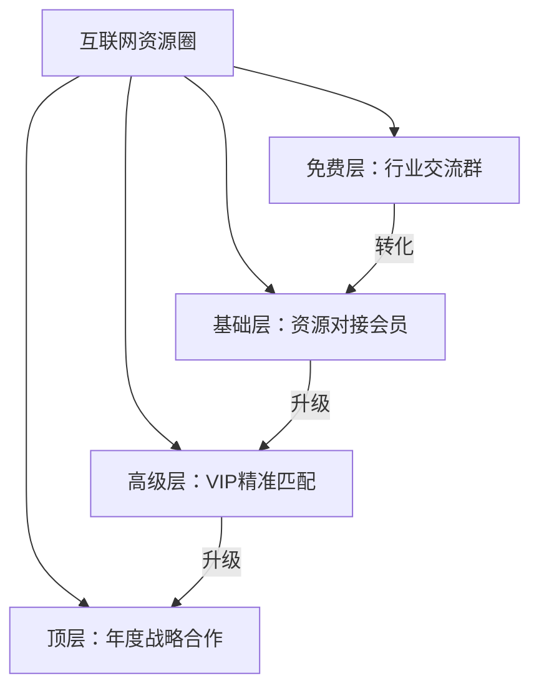
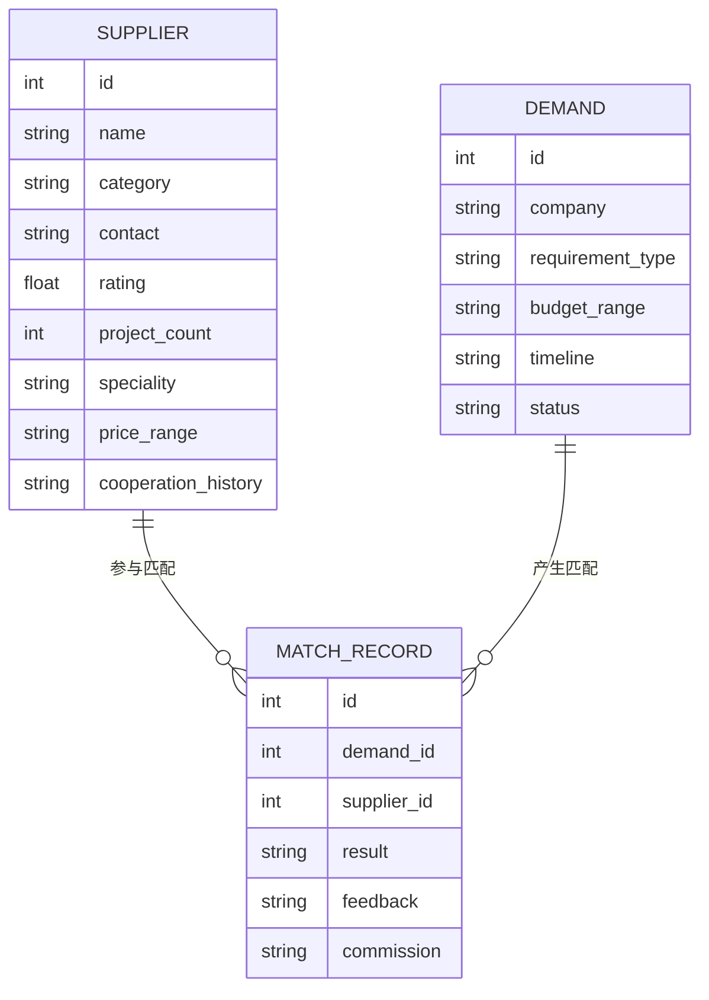

## 案例三：行业社群的资源对接变现

### 案例背景

陈磊（化名），32岁，原某互联网公司BD（商务拓展）总监，在互联网行业深耕8年，积累了大量的供应商、服务商和企业客户资源。2021年离职创业，搭建了一个面向互联网行业的资源对接社群，第一年实现年收入180万，第三年突破500万。

**为什么选择行业资源对接这个赛道？**

陈磊在做BD的过程中发现一个普遍痛点：**企业找供应商靠熟人介绍，效率极低，信息严重不对称。** 一个创业公司要找技术外包团队，可能要花2-3个月才能找到靠谱的；一个品牌方要找MCN机构合作，面对市场上上千家机构根本无从筛选。而他自己手上正好有大量经过验证的资源和人脉。

**行业资源对接的本质是什么？** 本质上是**信息中介+信任背书+匹配效率**。你做的事情有三层价值：

| 价值层 | 具体内容 | 举例 |
|--------|----------|------|
| 信息层 | 汇聚分散的供需信息 | 把200家技术外包团队的信息整合到一个库里 |
| 筛选层 | 帮用户做初步筛选和质量评估 | 已验证团队的历史项目、客户评价、擅长领域 |
| 匹配层 | 精准推荐最合适的资源 | 根据项目预算、行业、技术栈匹配最优团队 |

这种模式的优势在于：**一旦建立，护城河极深。** 因为你积累的不仅是信息，更是信任关系和行业口碑，这些很难被竞争对手复制。

### 社群定位与设计

#### 精准定位

陈磊没有做"大而全"的商务社交群，而是做了精准定位：

- **社群名称：** "互联网资源圈"
- **定位：** 互联网行业的资源精准对接平台，帮企业快速找到靠谱的供应商和合作伙伴
- **目标人群：** 互联网公司创始人、BD负责人、采购负责人、供应商/服务商老板
- **核心价值：** 降低企业寻找合作伙伴的时间成本和试错成本

**定位的关键决策：**

1. **行业聚焦而非泛行业。** 只做互联网行业，不跨到传统行业。聚焦意味着你能做到真正专业，成员之间的共同语言更多，对接成功率更高。
2. **To B而非To C。** 企业客户的付费能力强、决策理性、合作周期长，适合做深度服务。
3. **资源对接而非社交。** 不做"认识人"的泛社交，而是做"解决具体业务需求"的精准对接。每次对接都有明确的业务场景。

#### 社群结构设计



| 层级 | 价格 | 权益 | 适合人群 |
|------|------|------|----------|
| 免费交流群 | 免费 | 行业资讯、每周精选需求、群内自由交流 | 想了解行业的新人 |
| 资源对接会员 | 3,999元/年 | 每月3次精准资源推荐、需求发布优先展示、季度线下对接会 | 有明确合作需求的企业 |
| VIP精准匹配 | 12,999元/年 | 不限次推荐、1对1专人对接、优先获得独家资源、专属行业报告 | 高频需求的企业 |
| 年度战略合作 | 50,000元/年 | 所有VIP权益 + 定制化资源拓展、专属BD支持、品牌露出 | 大型企业和平台型公司 |

### 冷启动阶段：从0到200人

#### 第一步：梳理存量资源

陈磊离职后第一件事，不是急着建群，而是花了整整两周梳理自己8年积累的资源：

1. **通讯录整理：** 从微信、钉钉、邮件中提取了3,000+个行业联系人
2. **分类标注：** 按"供应商/客户/中间人"分类，按"技术外包/营销/设计/SaaS"等行业细分
3. **关系评级：** 标注每个联系人的关系深度（强关系/中关系/弱关系）
4. **需求摸底：** 逐一联系强关系和中关系，了解他们当前最急需的资源类型

**摸底结果：**
- 60%的企业有明确的供应商更换或新增需求
- 40%的供应商希望获得更多客户资源
- 信息不对称是最核心的痛点

#### 第二步：种子用户招募

**招募策略：先服务，再建群**

陈磊没有先建群再找人，而是反过来——先提供价值，再邀请入群。

1. **定向私聊：** 从3,000个联系人中筛选了300个"活跃且有需求"的人，逐一发消息
2. **提供免费对接：** 前10次对接完全免费，帮他们解决实际问题
3. **建立口碑：** 成功帮5家企业找到了合适的技术外包团队，帮3家MCN找到了品牌合作方
4. **邀请入群：** 在成功对接后，邀请双方加入"互联网资源圈"交流群

**关键话术：**

> "王总，上次帮你对接的那个技术团队项目进展怎么样？我这边又整理了一批优质的技术服务商资源，想建一个行业资源交流群，方便大家随时发布和对接需求，您有兴趣加入吗？"

**效果：** 两周内招募了180个种子用户，其中60%是企业决策者（创始人、VP、总监级别）。

#### 第三步：制造早期成功案例

种子群建立后，陈磊没有急于变现，而是集中精力制造成功案例：

1. **需求收集：** 每天在群里发布"今日需求速递"，汇总群成员的资源需求
2. **主动撮合：** 看到匹配的供需双方，主动私聊推荐
3. **跟踪反馈：** 每次对接后，跟进合作进展，收集反馈
4. **案例包装：** 将成功案例包装成"资源对接战报"在群内分享

**一个月成果：**
- 累计对接需求 87 次
- 成功促成合作 23 次
- 成功率 26.4%（行业平均约 10%）
- 成员自发邀请了 50+ 新成员入群

### 增长阶段：从200人到2000人

#### 增长策略一：内容引流

陈磊开始在多个平台输出行业内容，吸引精准用户：

**内容矩阵：**

| 平台 | 内容形式 | 更新频率 | 粉丝量（6个月） |
|------|----------|----------|------------------|
| 公众号 | 行业深度分析、供应商评测 | 每周2篇 | 15,000 |
| 知乎 | 行业问题回答、资源推荐 | 每周3篇 | 8,000 |
| 小红书 | 行业避坑指南、合作经验 | 每周4篇 | 12,000 |
| 朋友圈 | 日常对接案例、行业洞察 | 每天1-2条 | — |

**爆款内容案例：**

一篇《互联网公司找外包的10个大坑，第7个90%的人都中过》在知乎获得 5,000+ 赞同，带来了 800+ 精准关注者。文章详细列举了找外包过程中的常见陷阱，并给出了具体的避坑方法，文末引导加入资源对接群获取"靠谱供应商白名单"。

#### 增长策略二：裂变机制

**"以需求裂变"模式：**

传统裂变靠利益驱动（邀请返现），陈磊设计了独特的"需求驱动裂变"：

1. 会员发布一个资源需求
2. 社群运营团队匹配后推荐2-3个供应商
3. 如果会员对结果不满意，可以邀请更多供应商入群
4. 新供应商入群后，也会带来自己的客户资源

**这种裂变的妙处在于：** 每次裂变都在增加社群的资源密度，资源越多，对所有成员的价值越大，形成正向飞轮。

**裂变数据：**

- 裂变系数：1.6（每个会员平均带来1.6个新成员）
- 新成员构成：60%企业需求方，40%供应商/服务商
- 6个月后总会员数：1,800人（含免费群和付费会员）

#### 增长策略三：线下活动

**"资源对接会"品牌活动：**

每月举办1次线下资源对接会，成为社群的核心增长引擎：

- **形式：** 每次50-80人，上午主题分享，下午自由对接
- **地点：** 北京、上海、深圳、杭州轮流举办
- **费用：** 免费会员需付费 299元/次，付费会员免费参加
- **流程：**
  1. 参会者提前提交"我能提供的资源"和"我需要的资源"
  2. 运营团队制作"资源手册"，参会当天发放
  3. 设置3-5分钟的快速介绍环节
  4. 大量自由交流和对接时间
  5. 会后一周内跟踪对接结果

**线下活动的三重价值：**
1. **增加信任：** 线下见面后，后续线上合作的信任度大幅提升
2. **制造内容：** 活动现场的照片、视频、案例都是优质内容素材
3. **促进转化：** 参加过线下活动的人，付费转化率是纯线上的3倍

### 变现体系：从月入1万到月入15万

#### 变现模式一：会员费收入（占比40%）

会员费是基础收入，也是筛选高质量用户的门槛：

| 会员类型 | 定价 | 人数 | 年收入 |
|----------|------|------|--------|
| 资源对接会员 | 3,999元/年 | 350人 | 139.96万 |
| VIP精准匹配 | 12,999元/年 | 50人 | 64.99万 |
| 年度战略合作 | 50,000元/年 | 8人 | 40万 |
| **合计** | — | **408人** | **244.95万** |

**定价策略解析：**

- **3,999元不是拍脑袋定的。** 陈磊做过调研：一个BD总监找一个靠谱供应商，平均需要2-3个月，综合成本（人力+时间+试错）至少2-5万。3,999元/年换来全年无限次精准推荐，性价比极高。
- **VIP和战略合作是利润核心。** 虽然人数少，但贡献了超过40%的收入。关键是这些客户的服务成本并不比基础会员高太多。

#### 变现模式二：成交佣金（占比35%）

这是资源对接社群最核心的变现方式：

**佣金模式设计：**

| 交易类型 | 佣金比例 | 典型客单价 | 单笔佣金 |
|----------|----------|------------|----------|
| 技术外包项目 | 项目金额的3-5% | 50万 | 1.5-2.5万 |
| 营销合作 | 合作金额的5-8% | 10万 | 5,000-8,000元 |
| 人才推荐 | 年薪的10-15% | 30万 | 3-4.5万 |
| 投融资对接 | 融资额的1-2% | 500万 | 5-10万 |

**佣金收入数据（年化）：**
- 年促成交易：约120笔
- 平均单笔佣金：8,000元
- 年佣金收入：约96万

**关键点：佣金必须透明。** 陈磊的做法是在会员协议中明确写明佣金比例，而且只有成功合作后才收取。这种透明度反而增加了信任感。

#### 变现模式三：增值服务（占比25%）

| 服务项目 | 定价 | 年服务次数 | 年收入 |
|----------|------|------------|--------|
| 供应商尽职调查 | 5,000-15,000元/次 | 40次 | 40万 |
| 行业资源报告 | 2,999元/份 | 100份 | 30万 |
| 定制化BD外包 | 20,000元/月 | 3个客户 | 72万 |
| 企业参访团 | 3,999元/人 | 6次×20人 | 48万 |

**供应商尽职调查** 是一个高利润服务。企业要和一个新供应商合作前，陈磊的团队会做全面的背景调查，包括：历史项目交付质量、客户评价、团队稳定性、财务状况等。这份调查报告帮助企业避免了大量试错成本。

### 运营体系：日/周/月节奏

#### 日常运营（每日）

| 时间 | 事项 | 负责人 | 目的 |
|------|------|--------|------|
| 9:00 | 发布"今日行业资讯"（3-5条精选） | 运营助理 | 提供信息价值，保持群活跃 |
| 10:00 | 整理昨日新增需求，匹配潜在供应商 | 陈磊 | 核心服务——资源匹配 |
| 14:00 | 发布"今日需求速递"（汇总当日需求） | 运营助理 | 让需求被更多人看到 |
| 16:00 | 1对1跟进进行中的对接项目 | 陈磊 | 确保服务质量 |
| 20:00 | 发布"成功案例速报"（当日促成的合作） | 运营助理 | 制造信任和口碑 |

#### 每周运营

- **周一：** 发布"本周行业热点"长文分析
- **周三：** 组织1次线上主题分享（邀请行业大咖）
- **周五：** 发布"本周对接总结"，公布成功案例和数据
- **周末：** 整理本周新增资源入库，更新资源数据库

#### 每月运营

- **月初：** 发布月度行业报告（付费会员专享）
- **月中：** 举办线下资源对接会
- **月末：** 会员满意度调查 + 下月活动预告

### 核心资源数据库建设

陈磊花了大量时间建设资源数据库，这是社群最核心的资产：

#### 数据库结构



#### 数据库规模（运营2年后）

- 供应商/服务商：2,800+ 家
- 已验证供应商：1,200+ 家
- 累计匹配记录：5,600+ 条
- 成功合作案例：1,100+ 个
- 行业分类：28个细分领域

#### 数据库维护流程

1. **入库审核：** 新供应商需要填写详细的资料表，并提供至少2个客户参考
2. **定期回访：** 每季度对已入库供应商进行回访，更新信息
3. **评分更新：** 每次合作后更新供应商评分（1-5分）
4. **淘汰机制：** 连续两次评分低于3分的供应商标记为"谨慎推荐"

### 关键成功因素分析

#### 成功因素一：行业深耕的壁垒

陈磊8年的BD经验是最不可复制的壁垒。他对供应商的判断力、对行业趋势的敏感度、对客户需求的理解深度，都不是短期能建立的。

**启示：** 如果你想做行业资源对接，必须在该行业有至少3-5年的深度经验。没有行业积累的资源对接群，最终会沦为广告群。

#### 成功因素二：信任体系的构建

信任是资源对接生意的命脉。陈磊通过以下方式建立信任：

1. **双向验证：** 供应商入库要审核，企业发布需求也要验证
2. **透明评价：** 每次合作后双方互评，评价公开可见
3. **质量担保：** 如果推荐的供应商出现严重问题，社群提供调解和补偿
4. **个人品牌：** 陈磊本人就是最大的信任背书，他的行业口碑是多年积累的

#### 成功因素三：网络效应的积累

资源对接社群有极强的网络效应：

- **供应商越多 → 越容易匹配需求 → 企业满意度越高 → 付费意愿越强**
- **企业需求越多 → 供应商越愿意入驻 → 资源库越丰富**
- **成功案例越多 → 口碑越好 → 新用户增长越快**

这就是为什么先做免费服务、先积累案例是正确的策略。早期的投入换来的是后期的指数增长。

#### 成功因素四：标准化的服务流程

陈磊把资源对接做成了标准化流程，而不是靠个人经验随机匹配：

**需求对接SOP（标准操作流程）：**

```text
Step 1: 需求收集（24小时内响应）
  → 填写标准化需求表（行业/预算/时间/具体要求）
  
Step 2: 需求分析（1个工作日内）
  → 运营团队分析需求，明确匹配标准
  
Step 3: 资源筛选（1-2个工作日）
  → 从数据库中筛选3-5个候选供应商
  → 按匹配度排序，准备推荐理由
  
Step 4: 推荐对接（2个工作日内）
  → 向需求方发送推荐报告
  → 征得双方同意后，建立对接群
  
Step 5: 跟踪反馈（持续）
  → 合作后1周、1个月、3个月分别回访
  → 更新评分和匹配记录
```

### 踩过的坑与应对策略

#### 坑一：早期免费用户不愿付费

**问题：** 前期积累了大量免费用户，推出付费会员时转化率极低（不到3%）。

**原因：** 免费群已经能满足基本需求，用户没有升级动力。

**解决方案：**
1. 将免费群的功能限制为"只看不发"——能看到别人的需求，但不能自己发布
2. 设置"免费体验期"——新用户可以免费体验7天付费功能
3. 推出"首次加入半价"优惠，降低决策门槛
4. 最终付费转化率提升到12%

#### 坑二：供应商质量参差不齐

**问题：** 早期为了扩充资源库，入库标准较低，导致推荐的供应商质量不稳定。

**影响：** 3次严重的服务质量投诉，差点影响社群口碑。

**解决方案：**
1. 建立严格的入库审核机制（资料审核 + 客户访谈 + 试用期）
2. 推出"供应商分级"制度——A级（强烈推荐）、B级（可以尝试）、C级（谨慎选择）
3. 设置"黑名单"机制——严重违约的供应商永久拉黑
4. 引入"保证金"制度——高评级供应商缴纳保证金，作为质量承诺

#### 坑三：大客户过度依赖

**问题：** 收入过度集中在前5个大客户（贡献了40%收入），一旦流失影响巨大。

**解决方案：**
1. 主动开发更多中型客户，分散收入风险
2. 提升增值服务占比，降低对单一收入来源的依赖
3. 与大客户签订年度框架协议，锁定长期合作
4. 最终实现了前5大客户贡献不超过25%收入的健康结构

#### 坑四：竞争对手模仿

**问题：** 社群模式跑通后，出现多个模仿者，用低价策略抢客户。

**解决方案：**
1. 不打价格战，而是提升服务质量和差异化
2. 推出"独家资源"——与头部供应商签订独家合作
3. 强化社区文化——组织更多线下活动、建立成员之间的深度连接
4. 用数据证明效果——发布年度报告，展示社群促成的合作金额和成功率

### 三年发展数据总览

| 指标 | 第1年 | 第2年 | 第3年 |
|------|-------|-------|-------|
| 付费会员数 | 150人 | 320人 | 408人 |
| 年收入 | 180万 | 360万 | 520万 |
| 促成交易数 | 45笔 | 90笔 | 120笔 |
| 资源库规模 | 800家 | 1,800家 | 2,800家 |
| 线下活动 | 8场 | 15场 | 20场 |
| 团队规模 | 1人（兼职） | 3人 | 5人 |
| 净利润率 | 65% | 55% | 48% |

**数据解读：**

- **会员数增长放缓但收入持续增长**——说明产品结构在优化，高价值客户占比在提升
- **净利润率逐年下降**——因为团队扩张和线下活动成本增加，但绝对利润在增长
- **资源库是最大的资产**——2,800家已验证的供应商资源，是任何竞争对手短期内无法复制的

### 可复制的操作框架

如果你也想搭建一个行业资源对接社群，以下是可直接复用的框架：

#### Phase 1：准备期（1-2个月）

```text
□ 梳理行业经验和个人资源
□ 确定目标行业和细分领域
□ 建立初始资源数据库（至少100家供应商/服务商）
□ 设计社群产品结构（免费/基础/高级/顶级）
□ 准备个人介绍和社群介绍文案
□ 选择运营工具（企业微信 + 知识星球 + 简道云）
```

#### Phase 2：冷启动期（2-3个月）

```text
□ 从存量资源中筛选50个种子用户
□ 提供10-20次免费资源对接服务
□ 记录和包装成功案例
□ 建立日常运营节奏
□ 在1-2个内容平台开始输出
□ 目标：200人社群 + 10个成功案例
```

#### Phase 3：增长期（6-12个月）

```text
□ 推出付费会员
□ 启动内容引流（公众号+知乎+小红书）
□ 设计裂变机制
□ 举办第一次线下活动
□ 建立资源数据库管理系统
□ 目标：1000人社群 + 50个付费会员 + 月入5万
```

#### Phase 4：规模期（12-24个月）

```text
□ 扩展增值服务品类
□ 招聘运营团队
□ 深化数据库建设
□ 建立行业影响力（白皮书、年度报告）
□ 探索跨行业扩展
□ 目标：2000人社群 + 200个付费会员 + 月入15万
```

### 本案例核心启示

1. **资源对接是最持久的商业模式之一。** 信息不对称永远存在，你的价值就是消除这种不对称。只要你能持续提供高质量的匹配服务，收入就会持续增长。

2. **行业深耕是最大的壁垒。** 没有行业积累的人不适合做资源对接。你的判断力、人脉、行业认知都是长期积累的结果，无法速成。

3. **先服务，再变现。** 冷启动阶段不要急于收费，先把成功率做上去，用数据和案例说话。

4. **标准化是规模化的前提。** 把资源对接从"靠个人经验"变成"靠系统流程"，才能脱离对个人的依赖，实现团队化运营。

5. **数据库是核心资产。** 你的资源数据库越丰富、越准确，匹配成功率就越高，用户就越愿意付费。这是需要长期投入但回报巨大的工作。
