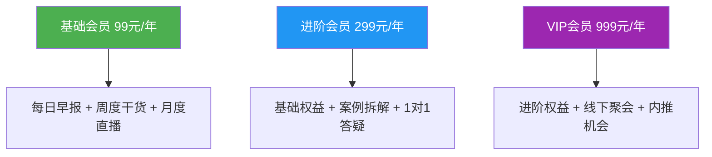
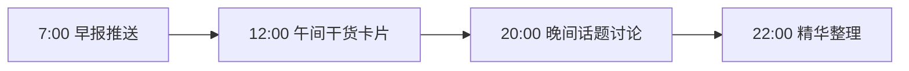
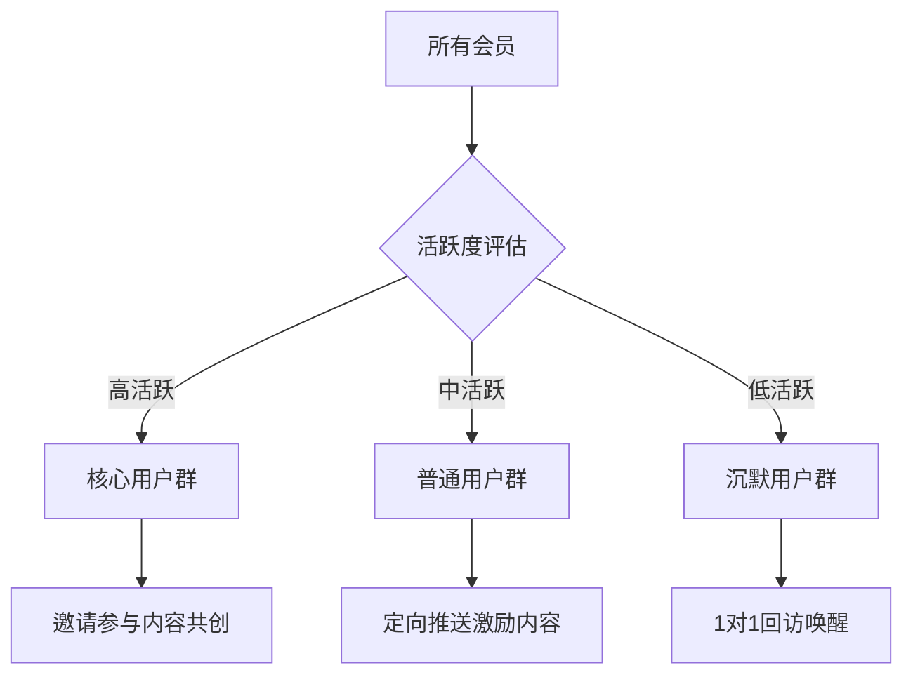

## 案例四：知识IP的会员制社群——从职场副业到月入12000的蜕变之路

### 一、案例背景

#### 1. 人物画像

陈晨（化名），32岁，某互联网公司产品经理，工龄8年。日常工作涉及需求分析、项目管理、团队协作等核心技能。性格偏内向，但文字表达能力强，在公司内部经常被同事请教产品方法论相关问题。

#### 2. 发现契机

2023年初，陈晨在公司内部做了一次关于"产品经理如何高效沟通"的分享，反响很好。会后有十几位同事私聊他，表示希望系统学习相关内容。这让他意识到：**自己习以为常的工作经验，对很多人来说是有价值的知识**。

与此同时，他观察到几个市场信号：

- 知识付费市场持续增长，2023年中国知识付费市场规模超过1800亿元
- 职场技能类内容需求旺盛，尤其在经济下行期，职场人更愿意投资自我提升
- 会员制社群模式正在兴起，相比一次性课程，会员制能提供持续价值和稳定收入

#### 3. 核心约束条件

陈晨启动副业时面临三个现实约束：

| 约束类型 | 具体情况 | 应对策略 |
|----------|----------|----------|
| 时间有限 | 全职工作，每天仅有2-3小时可支配 | 聚焦内容复用，一次产出多次分发 |
| 预算有限 | 初始投入不愿超过2000元 | 选择低成本工具，利用免费平台引流 |
| 经验为零 | 没有做社群、没有写过公域内容 | 从最小可行产品起步，边做边学 |

### 二、从0到1的冷启动（第1-2个月）

#### 1. 自我定位：找到差异化标签

陈晨没有选择"产品经理培训"这个已经红海的赛道，而是做了一个更精准的定位：

**定位公式：** 具体人群 + 具体场景 + 具体价值

```text
普通定位：产品经理社群
精准定位：帮助3-5年经验的产品经理，用结构化方法提升跨部门沟通效率
```

选择这个定位的逻辑：

- **人群精准**：3-5年经验的产品经理，已经入行但还没到管理层，提升需求最强烈
- **痛点明确**：跨部门沟通是产品经理最普遍的痛点之一
- **有专业壁垒**：陈晨在这个领域有8年实战经验，能提供真实案例

#### 2. 内容测试：验证市场需求

在搭建社群之前，陈晨先用一个月时间做了内容测试：

**第一周：** 在知乎回答了10个"产品经理沟通"相关问题，总浏览量8万+，最高赞回答获得200+赞同

**第二周：** 在公众号发布3篇深度文章，阅读量分别为1200、850、2100，通过评论区收集读者反馈

**第三周：** 在小红书发布10条笔记，测试不同角度（方法论、案例、工具），发现"具体话术模板"类内容互动率最高

**第四周：** 在知识星球开通免费试运营，邀请50位高互动读者加入，观察他们的讨论质量和活跃度

**测试结论：**

```text
✅ 话题有需求：知乎回答和公众号文章都有不错的自然流量
✅ 用户愿意付费：知识星球试运营期间，有12人主动询问是否有付费社群
✅ 内容方向可行："话术模板+真实案例"是最受欢迎的内容类型
✅ 社群有活跃度：50人的试运营群，日均消息20+条
```

#### 3. 产品设计：会员制社群的三层架构

基于测试结果，陈晨设计了三层会员体系：



**各层级权益详解：**

| 权益项目 | 基础会员 | 进阶会员 | VIP会员 |
|----------|----------|----------|---------|
| 每日早报（行业资讯+方法论碎片） | ✅ | ✅ | ✅ |
| 周度深度文章 | ✅ | ✅ | ✅ |
| 月度主题直播 | ✅ | ✅ | ✅ |
| 专属交流群 | ✅ | ✅ | ✅ |
| 案例拆解库（200+真实案例） | ❌ | ✅ | ✅ |
| 每月1次1对1答疑（30分钟） | ❌ | ✅ | ✅ |
| 季度线下聚会 | ❌ | ❌ | ✅ |
| 优质岗位内推 | ❌ | ❌ | ✅ |
| 个人品牌诊断报告 | ❌ | ❌ | ✅ |

#### 4. 冷启动动作

**动作一：种子用户招募（第1周）**

从知识星球试运营的50人中，筛选出20位最活跃的用户，逐一私聊：

```text
话术模板：
"XX你好，感谢你这段时间在星球里的积极分享。我准备搭建一个更系统的产品经理
沟通社群，首期限额50人，定价99元/年。作为老朋友，给你一个专属福利：
前20位报名享受永久半价（49元/年），并且首批会员会进入'创始会员群'，
后续社群的方向和内容优先参考你们的建议。有兴趣了解一下吗？"
```

结果：20人中15人付费，转化率75%

**动作二：朋友圈预热（第2周）**

连续7天在朋友圈发布"产品经理沟通避坑指南"系列，每条配一张精心设计的卡片图。第7天发布社群招募信息。

结果：朋友圈带来8位付费用户

**动作三：公众号引流（第3-4周）**

发布一篇《我在大厂8年，总结出产品经理跨部门沟通的7个核心原则》，文末附社群介绍和限时优惠。

结果：文章阅读量5000+，带来27位付费用户

**冷启动总结：**

| 招募渠道 | 新增会员数 | 占比 | 获客成本 |
|----------|------------|------|----------|
| 老用户私聊 | 15人 | 30% | 0元 |
| 朋友圈 | 8人 | 16% | 0元 |
| 公众号文章 | 27人 | 54% | 约3元/人 |
| **合计** | **50人** | **100%** | **约1.6元/人** |

### 三、从1到100的增长期（第3-6个月）

#### 1. 内容体系搭建

陈晨建立了一套标准化的内容生产流程：

**每日内容节奏：**



**内容类型与配比：**

| 内容类型 | 频率 | 目的 | 制作时间 |
|----------|------|------|----------|
| 每日早报 | 每天1期 | 保持社群活跃，提供日常价值 | 15分钟 |
| 深度文章 | 每周1篇 | 树立专业形象，吸引新用户 | 3-4小时 |
| 案例拆解 | 每周2个 | 提供可复用的实操经验 | 1小时/个 |
| 月度直播 | 每月1场 | 深度互动，提升信任感 | 2小时准备+1小时直播 |
| 话术模板 | 每月1套 | 高频使用，增加用户粘性 | 2小时 |

**内容复用策略：**

一篇深度文章的生命周期：

```text
原始产出（3小时）→ 公众号长文 → 知乎回答（改编）→ 小红书笔记（拆分3条）
→ 早报素材（摘录金句）→ 社群讨论话题 → 案例库沉淀
```

通过复用，1次内容产出可以触达7个渠道，ROI极高。

#### 2. 增长引擎：三轮驱动

**第一轮：口碑裂变**

设计了"邀请返现"机制：

```text
规则：
- 基础会员邀请1人：双方各返10元（可提现或抵扣续费）
- 进阶会员邀请1人：双方各返30元
- VIP会员邀请1人：双方各返50元
- 每月邀请榜前3名：额外奖励（书籍/课程/线下活动名额）
```

裂变数据：

| 月份 | 新增会员 | 裂变来源 | 裂变占比 |
|------|----------|----------|----------|
| 第3个月 | 35人 | 12人 | 34% |
| 第4个月 | 48人 | 18人 | 38% |
| 第5个月 | 62人 | 25人 | 40% |
| 第6个月 | 75人 | 33人 | 44% |

**第二轮：内容引流**

在知乎、小红书、公众号三个平台持续输出，形成引流矩阵：

```text
知乎（长尾流量）：回答产品经理相关问题，文末引导关注公众号
小红书（精准流量）：发布话术模板和职场干货，评论区引导私信
公众号（私域沉淀）：深度文章 + 社群入口
```

**第三轮：跨界合作**

- 与3位不同领域的产品经理KOL互推（各自推荐对方的社群）
- 与2家在线教育平台合作，为其学员提供社群体验名额
- 接受2个播客节目采访，分享产品经理成长经验

#### 3. 用户分层运营

随着会员数增长，陈晨开始做精细化运营：



**沉默用户唤醒策略：**

```text
触发条件：连续14天未发言
唤醒动作：
1. 私信推送本周精华内容合集
2. 邀请参加即将举办的直播活动
3. 如果连续21天未互动，进行1对1回访：
   "XX你好，好久没在群里看到你了，最近在忙什么呢？
    社群最近更新了XX内容，我觉得对你应该有帮助。"
```

### 四、稳定变现期（第7-12个月）

#### 1. 收入结构

到第12个月，陈晨的社群形成了稳定的收入结构：

| 收入来源 | 月均收入 | 占比 | 说明 |
|----------|----------|------|------|
| 基础会员续费+新增 | 3,200元 | 27% | 350人×99元/年÷12 |
| 进阶会员续费+新增 | 4,500元 | 38% | 180人×299元/年÷12 |
| VIP会员续费+新增 | 2,500元 | 21% | 30人×999元/年÷12 |
| 企业团购 | 800元 | 7% | 偶发订单 |
| 课程/训练营 | 1,000元 | 8% | 季度性收入均摊 |
| **月均合计** | **12,000元** | **100%** | |

#### 2. 续费率优化

续费是会员制社群的生命线。陈晨的续费率从第一年的55%提升到第二年的72%，关键动作包括：

**续费前60天：** 推送"年度成长报告"，展示会员一年来参与的活动、阅读的内容、获得的成长

**续费前30天：** 发起"老会员专属优惠"，续费享8折

**续费前7天：** 1对1私信提醒，附上下一年的内容规划

**续费当天：** 简化续费流程，一键续费

**不续费用户调研：** 每月对不续费用户做问卷调研，持续优化内容

#### 3. 知识IP的复利效应

随着社群运营时间增长，陈晨积累了多重资产：

```text
内容资产：200+篇原创文章、50+场直播回放、100+个案例拆解
用户资产：500+付费会员、2000+公众号粉丝、5000+知乎关注者
品牌资产："产品沟通力"成为细分领域有辨识度的个人品牌
关系资产：与多位行业KOL建立合作关系
```

这些资产形成正向飞轮：内容资产吸引用户 → 用户资产扩大品牌影响力 → 品牌影响力带来更多合作机会 → 合作机会产出更多优质内容。

### 五、踩过的坑与关键教训

#### 1. 坑一：过度承诺导致精力透支

**问题：** 初期为了吸引用户，承诺"每日答疑"，结果每天花2-3小时回复问题，严重影响本职工作。

**解决：** 将"每日答疑"改为"每周集中答疑日+案例库自助查询"，同时培养3位核心用户作为"社群助教"，分担答疑压力。

**教训：** 会员权益设计要量力而行，承诺了就必须做到，否则会损害信任。

#### 2. 坑二：忽视用户分层，内容"大锅饭"

**问题：** 初期所有会员看同样的内容，导致初级用户觉得太难，高级用户觉得太浅。

**解决：** 搭建内容分层体系：

| 层级 | 内容定位 | 呈现方式 |
|------|----------|----------|
| 入门级 | 基础概念、通用方法 | 每日早报、公众号文章 |
| 进阶级 | 深度案例、实操技巧 | 周度深度文、案例拆解库 |
| 专家级 | 行业洞察、战略思考 | VIP专属直播、线下闭门会 |

**教训：** 会员制社群的核心价值是"持续提供适配的内容"，而不是"把所有内容堆给所有人"。

#### 3. 坑三：只关注拉新，忽视留存

**问题：** 第4-5个月花了大量精力做裂变活动，新增会员数创新高，但同期流失率也在上升，净增长反而下降。

**解决：** 建立"健康度仪表盘"，每周监控以下指标：

```text
核心指标：
- 周活跃率（发言人数/总人数）：目标>40%
- 内容消费率（阅读/观看人数/总人数）：目标>60%
- 续费率（到期续费人数/到期总人数）：目标>65%
- NPS（净推荐值）：目标>50

预警规则：
- 周活跃率连续2周<30%：启动沉默用户唤醒
- 续费率<55%：启动用户满意度调研
- NPS<30：立即排查问题
```

**教训：** 增长 = 拉新 - 流失。只看拉新数字是自欺欺人，留存才是根基。

#### 4. 坑四：定价过低，吸引错人群

**问题：** 初始定价99元/年，吸引了大量"薅羊毛"用户，参与度低，续费率低，还在群里传播负能量。

**解决：** 将基础会员从99元涨到199元，同时增加"7天无理由退款"保障。涨价后，新用户质量明显提升，社群氛围改善。

**教训：** 价格是筛选器。过低的价格会吸引低意愿用户，反而增加运营成本。合理定价 + 退款保障 > 低价策略。

#### 5. 坑五：内容创作瓶颈

**问题：** 独自运营到第6个月时，陈晨遇到了严重的创作瓶颈，感觉"能写的都写了"。

**解决：** 三个方法打破瓶颈：

1. **用户共创**：发起"会员故事征集"，让会员分享自己的沟通案例，陈晨负责点评和总结
2. **外部输入**：每周花2小时阅读行业报告、参加其他社群的分享，获取新素材
3. **内容矩阵**：从"纯原创"转向"原创+翻译+解读+整理"的混合模式

**教训：** 一个人的内容产出有上限，必须建立可持续的内容供给机制。用户是最好的内容来源。

### 六、关键成功因素总结

#### 1. 定位精准：做小池塘里的大鱼

陈晨没有做"产品经理大社群"，而是聚焦"产品经理跨部门沟通"这个细分领域。虽然天花板较低，但竞争也小得多，更容易建立专业壁垒。

```text
选赛道的公式：
市场规模够大 × 竞争强度够低 × 你的优势够明显 = 最佳切入点
```

#### 2. 先验证再投入：用最低成本测试市场

在正式搭建社群之前，陈晨用一个月时间在知乎、公众号、知识星球做了充分的市场测试。这避免了"闭门造车"的风险。

#### 3. 内容复用：一鱼多吃

一篇内容在7个渠道分发，大幅降低了内容生产的时间成本。这是时间有限的副业者必须掌握的技巧。

#### 4. 数据驱动：每周复盘关键指标

不凭感觉做决策，而是通过"健康度仪表盘"监控社群状态，及时发现问题并调整。

#### 5. 持续迭代：小步快跑

从50人的种子群到500+人的成熟社群，每一步都在验证和调整。没有一步到位的完美方案，只有不断迭代的最优解。

### 七、给读者的行动清单

如果你想复制这个路径，按以下步骤执行：

**第一步（第1周）：自我评估**
- 列出你的专业技能清单
- 评估每个技能的市场需求（在知乎/小红书搜索相关话题的热度）
- 选择一个你最擅长且市场需求最大的方向

**第二步（第2-4周）：内容测试**
- 在1-2个平台持续输出相关内容
- 观察阅读量、互动量、私信咨询量
- 如果4周内没有正向反馈，调整方向重新测试

**第三步（第5-6周）：社群搭建**
- 设计会员体系和权益
- 确定定价策略
- 搭建社群基础设施（微信群/知识星球/小程序）

**第四步（第7-8周）：冷启动**
- 招募50位种子用户
- 用2周时间打磨内容和服务
- 收集反馈，优化产品

**第五步（第3-6个月）：增长期**
- 建立内容生产SOP
- 启动裂变机制
- 开始跨平台引流

**第六步（第7-12个月）：稳定期**
- 关注续费率和用户满意度
- 优化收入结构
- 沉淀内容资产

### 八、关键数据速查表

| 里程碑 | 时间节点 | 会员数 | 月收入 | 关键动作 |
|--------|----------|--------|--------|----------|
| 冷启动完成 | 第2个月末 | 50人 | ~400元 | 种子用户招募 |
| 增长期启动 | 第4个月末 | 150人 | ~2,000元 | 裂变+内容引流 |
| 规模化拐点 | 第8个月末 | 350人 | ~8,000元 | 跨界合作+企业团购 |
| 稳定变现 | 第12个月末 | 500+人 | ~12,000元 | 体系成熟，续费驱动 |

这个案例的核心启示是：**知识IP的会员制社群不是一夜暴富的捷径，而是一个需要持续投入、精心运营的长期事业**。但一旦运转起来，它会像飞轮一样越转越快——你的内容资产、用户资产、品牌资产会形成正向循环，最终实现"睡后收入"。

关键不在于你有多少粉丝，而在于你能为多少人持续提供不可替代的价值。

***

