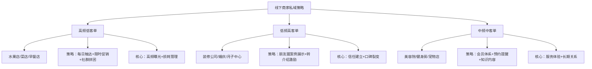

## 案例五：线下商家的私域运营

> 线下商家做私域，不是把顾客拉进微信群发广告那么简单。真正的私域运营，是让到店顾客变成"熟人"，让"熟人"变成"自来水"，让"自来水"带来持续复购和转介绍。本案例完整还原一家社区水果店从零搭建私域体系、半年内月营收从3万增长到12万的全过程。

### 一、案例背景

#### 1.1 商家基本情况

| 维度 | 详情 |
|------|------|
| 商家类型 | 社区生鲜水果店（非连锁，个体经营） |
| 门店位置 | 二线城市某大型社区底商，周边3个小区约8000户 |
| 经营面积 | 45㎡，前店后仓格局 |
| 经营时长 | 开业18个月，前12个月亏损，后6个月微利 |
| 月均营收 | 私域运营前约3万元，扣除房租水电人工后月利润约4000元 |
| 核心痛点 | 客流不稳定、价格战严重、复购率低、损耗率高达20% |

#### 1.2 面临的困境

这家水果店的困境极具代表性——几乎所有社区线下商家都会遇到：

**困境一：客流全靠自然流量，毫无掌控力**

门店日均客流约80-120人，但这些顾客全是"路过型"——今天路过就买，明天换条路走就不来了。商家对顾客没有任何触达能力，只能被动等待上门。

**困境二：陷入价格战死循环**

周边500米内有3家水果店、1个菜市场水果摊位、2个社区团购自提点。竞争的唯一手段就是降价，一斤砂糖橘从8元卷到5元，利润被压缩到几乎为零。

**困境三：损耗惊人，卖不掉就是纯亏**

水果不像日用品可以放半年。草莓放两天就开始烂，芒果熟透了卖不掉就是垃圾。20%的损耗率意味着每进10000元的货，有2000元直接变成垃圾。

**困境四：复购全凭"距离近"**

顾客没有忠诚度可言，"哪家便宜去哪家"是常态。没有会员体系、没有情感连接、没有理由让顾客"只来你家"。

#### 1.3 为什么选择做私域

老板张姐（化名）在一次偶然的机会中听说了"私域流量"的概念。她不懂什么SaaS工具、裂变模型，但她理解一个朴素的道理：**如果每个来买过水果的顾客，我都能在他们想买水果的时候"喊"他们一声，那我就不用干等着了。**

这个朴素的想法，就是私域运营最本质的逻辑——**把"一次性交易关系"变成"可反复触达的长期关系"**。

---

### 二、私域运营的完整执行过程

#### 2.1 第一阶段：基础搭建（第1-2周）

##### 2.1.1 选工具：用微信个人号而非公众号

张姐最初考虑过做公众号，但很快否决了：

| 对比维度 | 微信公众号 | 微信个人号（企业微信） |
|----------|-----------|---------------------|
| 打开率 | 平均1%-3% | 朋友圈触达率约15%-30% |
| 互动性 | 单向推送，互动弱 | 双向聊天，像朋友交流 |
| 信任感 | 官方感，距离远 | 个人感，像隔壁邻居 |
| 学习成本 | 需要排版、运营能力 | 会发微信就行 |
| 适合阶段 | 品牌成熟期 | 起步期、社区型商家 |

最终方案：用**企业微信**作为主阵地。原因有三：一是企业微信可以加好友上限到2万人，个人号上限约1万人；二是企业微信支持自动回复、客户标签、群发等基础功能；三是离职员工的客户关系可以转移，不因人员变动而流失。

##### 2.1.2 打造"人设"：让顾客记住你

张姐给企业微信设计了一个非常接地气的人设：

```text
昵称：张姐鲜果铺｜社区自提
头像：门店实拍照片（干净明亮的水果陈列）
签名：每天早上6点去批发市场挑货，只选A级果｜坏果包换
朋友圈背景图：门店地址+营业时间+配送范围
```

这个人设的核心策略：

- **用"张姐"而非"XX水果店"**：个人化称呼更容易建立信任
- **"每天早上去批发市场"**：传递专业感和辛苦感，让顾客觉得你靠谱
- **"坏果包换"**：降低顾客首次尝试的心理门槛
- **"社区自提"**：明确服务方式，避免误解

##### 2.1.3 准备钩子：给顾客一个加你的理由

直接说"加我微信吧"，绝大多数顾客不会理你。需要一个**无法拒绝的理由**——行业术语叫"钩子"或"诱饵"。

张姐设计了三层钩子：

**即时钩子（到店场景）：**
- "加微信首单立减3元"——直接利益驱动
- "加微信送一个保鲜盒"——实物赠品，成本0.8元

**持续钩子（长期价值）：**
- "每天朋友圈发今日到货和特价信息，不用你跑一趟来看"
- "每周群里发一次水果知识，教你怎么挑、怎么存"

**社交钩子（转介绍动力）：**
- "拉一个邻居朋友进群，你和朋友各得一张5元券"

#### 2.2 第二阶段：引流加粉（第3-8周）

##### 2.2.1 线下到店引流：抓住每一个进店的人

线下商家最大的私域优势就是**有天然的线下接触场景**——每个进店的顾客都是面对面的真实接触，信任基础远强于线上。

**场景一：收银台话术**

张姐培训收银员（就是她老公老李）一套标准话术：

```text
收银员："一共28块5，扫这个码加个微信吧，首单减3块，今天只要25块5。"
顾客犹豫："加了不打扰你，就是每天发个今日特价，你想买什么水果直接群里问就行。"
顾客问："不会天天发广告吧？"
收银员："不会不会，就发个今天到了什么新鲜货，你不想看划过去就行。"
```

关键点：
- **先说利益**（减3块），再解释**不打扰**——降低抗拒感
- **"你想买什么直接群里问"**——暗示加微信后有售后保障
- 话术不能太长，**15秒内说完**

**场景二：收银小票/袋子里放卡片**

每个购物袋里放一张精美卡片：

```text
正面：
  🍎 张姐鲜果铺 | 老顾客专属福利
  加微信领取 ¥5 无门槛券
  （二维码）
  
反面：
  ✅ 每日特价早知道
  ✅ 坏果包换，售后无忧  
  ✅ 每周三会员日全场8折
  ✅ 免费配送（满30元/1公里内）
```

**场景三：试吃活动引流**

每周五下午设置"新品试吃台"，试吃品是当季新品或主推品。试吃不收费，但要求扫码加微信才能参加。

| 引流方式 | 日均加粉数 | 成本/人 | 转化率 |
|----------|-----------|---------|--------|
| 收银台话术 | 8-12人 | 3元（首单减免） | 35%-45% |
| 购物袋卡片 | 3-5人 | 0.5元（印刷费分摊） | 10%-15% |
| 试吃活动 | 15-25人 | 2元（试吃成本） | 60%-70% |

8周累计加粉约**620人**，覆盖周边约8%的家庭。

##### 2.2.2 线上社群裂变：让老客带新客

当基础粉丝达到300人左右时，张姐启动了第一波裂变活动：

**"水果拼团"裂变机制：**

```text
活动规则：
- 每周三推出1款"爆款拼团"商品（成本价或微亏）
- 3人成团，团长开团后分享到小区业主群/朋友圈
- 团员必须是新好友（历史未加过微信的）
- 成团后每人获得：拼团价购买资格 + 下次可用的8折券

示例：
  原价15元/斤的车厘子，拼团价9.9元/斤
  3人成团 → 团长额外获得1张5元券
```

这个裂变设计的精妙之处：
- **用稀缺水果当钩子**：车厘子、榴莲等高价值水果吸引力远强于苹果香蕉
- **3人成团门槛低**：不需要拉10个人，3个邻居就够了
- **要求新好友**：确保每次裂变都在拓新，而非老客互相薅
- **成本可控**：拼团商品限量50份，亏损约200元，但换来50+新粉

8周裂变阶段新增约**380人**，累计粉丝突破**1000人**。

#### 2.3 第三阶段：社群运营与激活（持续进行）

##### 2.3.1 社群定位：不做"广告群"，做"邻居水果顾问群"

张姐建了3个群，按功能区分：

| 群名 | 人数 | 功能定位 | 运营频率 |
|------|------|---------|---------|
| 张姐鲜果·今日特价群 | 480人 | 每日特价、到货通知、限时秒杀 | 每天2-3条 |
| 张姐鲜果·水果交流群 | 320人 | 水果知识科普、挑选技巧、食谱分享 | 每周3-4条 |
| 张姐鲜果·VIP尊享群 | 85人 | 高客单价客户专属、新品优先、私密折扣 | 每周2-3条 |

**为什么不合成一个群？**

- 功能混合会导致信息过载，用户觉得吵→退群/免打扰
- 不同消费层级的顾客需要不同的服务策略
- VIP群的稀缺感本身就是一种"特权"，能刺激消费升级

##### 2.3.2 每日运营SOP（标准作业流程）

张姐的私域运营已经形成了固定节奏，每天花在上面的时间约1.5-2小时：

**早上 7:00-7:30（到货预告）**

```text
朋友圈发布：
📷 实拍今日批发市场选货视频/照片
文案："今天抢到了一批超甜的攀枝花芒果🥭
刚从车上卸下来，皮还是青的但里面已经甜到爆！
放两天吃口感最好，先到先得～
到店自提 or 满30免费配送，群里扣1我给你留货"

群内同步发布今日到货清单+价格
```

**中午 12:00-12:30（午间互动）**

```text
水果知识/趣味内容：
"🍓 草莓洗之前千万别摘蒂！
摘了蒂再洗，脏水会从蒂的位置渗进果肉里
正确做法：带蒂清洗 → 洗完再摘蒂 → 用淡盐水泡5分钟
记住这个顺序，草莓更干净更保鲜～"
```

**下午 17:00-17:30（傍晚促销/清货）**

```text
朋友圈+群内同步：
"⚠️ 今天这批水蜜桃熟度偏高，再放就过头了
还剩23盒，今天买一送一清完收工！
要的赶紧群里扣桃子🍑，先到先得～"
```

**晚上 21:00-21:15（次日预告+互动回复）**

```text
回复当天所有私聊咨询
朋友圈发布："明天周三会员日🌸 全场8折
还有限时拼团：5斤装赣南脐橙 29.9→19.9
明早8点群里开抢，手慢无！"
```

##### 2.3.3 内容策略：不发广告，发"有用的"和"有趣的"

张姐的朋友圈和社群内容遵循一个简单的比例法则——**7:2:1法则**：

```text
70% 有用/有趣内容（拉近距离、建立信任）
   - 水果挑选技巧："怎么判断西瓜熟不熟？看这3个地方"
   - 水果保存方法："牛油果没熟别放冰箱！正确催熟方法"
   - 水果食谱："芒果糯米饭自己做，成本不到8块"
   - 采购幕后："今天凌晨4点去批发市场，给你挑了最好的"
   - 生活日常（适度）："送完孩子上学直接去进货，当妈当老板两不误"
   
20% 产品信息（软性推广）
   - 今日到货清单（配实拍图）
   - 限时特价/秒杀
   - 新品上架通知
   - 客户好评截图

10% 促销活动（硬性转化）
   - 拼团活动
   - 会员日折扣
   - 充值活动
   - 节日礼盒预售
```

这个比例的关键在于：**如果你80%的时间都在发广告，顾客会屏蔽你；但如果你80%的时间在提供价值，剩下20%的广告他们不仅不会反感，反而会主动关注。**

#### 2.4 第四阶段：复购与转化体系（第3个月起）

##### 2.4.1 会员体系设计

张姐设计了一套简单但有效的三级会员体系：

```text
普通会员（加微信即享）
  ├── 首单立减3元
  ├── 每周三会员日全场9折
  ├── 坏果48小时内包换
  └── 满30元1公里内免费配送

银卡会员（累计消费满500元）
  ├── 全场95折（天天享受，不限周三）
  ├── 每月1次专属折扣券（8折）
  ├── 新品优先品尝权
  └── 生日当月送果篮一个

金卡会员（累计消费满2000元）
  ├── 全场9折
  ├── 每月2次专属折扣券（7折）
  ├── VIP群专属价格
  ├── 节假日礼盒优先预定+折扣
  └── 免费果切配送（下午茶场景）
```

**会员升级的触发机制：**

张姐用企业微信的客户标签功能，手动记录每个客户的累计消费金额。虽然不够自动化，但对1000人左右的规模完全够用。每月底统一盘点一次，符合条件的私聊通知升级："张哥，您这个月累计消费已经满500了，自动升级银卡会员，以后全场95折哦～"

##### 2.4.2 定期触达机制

除了每日的朋友圈和社群运营，张姐还设置了几个定期触达节点：

**周触达：每周三会员日提醒**
- 周二晚群发消息："明天周三会员日，全场8-9折，别忘了来哦～"

**月触达：月度消费报告**
- 每月初给银卡以上会员发消息："上个月您在我们店消费了XX元，省了XX元，本月还有XX元优惠券待使用"

**季触达：季节性水果推荐**
- 每个季节更替时推送"当季水果指南"，教育用户"什么季节吃什么水果最新鲜最划算"

**节日触达：节日礼盒预售**
- 中秋、春节等节日提前2周推"水果礼盒"，企业客户团购是大头

##### 2.4.3 损耗管理：用私域反向控制进货

这是张姐做私域后发现的**意外收获**——私域不仅帮她卖货，还帮她**减少损耗**。

**传统模式：**
```text
进货 → 等顾客来买 → 卖不掉 → 报损
损耗率：20%左右
```

**私域模式：**
```text
进货前：群里预调研"这周想吃什么水果？投票"
进货时：根据预售数据精准备货
到货后：朋友圈+群内即时推送到货信息
临期前：提前1天做"清仓特价"群内秒杀
```

损耗率从20%降到了**8%**左右。仅此一项，每月减少损失约**3600元**（按月进货3万元计算）。

---

### 三、关键策略深度解析

#### 3.1 线下商家做私域的三大独特优势

很多线下商家觉得"我又不是做电商的，搞什么私域"。事实上，线下商家做私域有天然优势，是纯线上商家羡慕都羡慕不来的：

**优势一：天然的信任基础**

线上商家建立信任需要大量内容输出、口碑积累、甚至花钱请KOL背书。但线下商家——顾客亲眼看到了你的店、你的货、你本人。面对面交易本身就是最强的信任背书。

**优势二：高频消费场景**

水果、蔬菜、生鲜、餐饮、美发……线下商家经营的大多是高频消费品。高频意味着：不需要花大量精力去"唤醒需求"，需求天然存在。你只需要在顾客产生需求的那一刻出现在他的视野里。

**优势三：天然的社区属性**

社区商家服务的是"住在你身边的人"。这种地理上的接近性天然适合做社群——同一个小区的顾客可能本身就在同一个业主群里。这种社交网络的重叠，是裂变传播的温床。

#### 3.2 线下商家私域运营的核心公式

```text
私域营收 = 触达人数 × 触达频率 × 转化率 × 客单价 × 复购次数
```

逐项拆解张姐的优化路径：

| 指标 | 优化前 | 优化后 | 优化手段 |
|------|--------|--------|---------|
| 可触达人数（私域好友数） | 0人 | 1000人 | 到店引流+裂变拓新 |
| 周触达频率 | 0次/天 | 2-3次/天 | 朋友圈+社群+私聊 |
| 到店转化率 | 3%-5%（自然客流） | 12%-15%（私域引流） | 精准推送+限时优惠 |
| 客单价 | 25元 | 38元 | 组合推荐+满减设计 |
| 月复购次数 | 1-2次 | 4-6次 | 会员体系+定期触达 |

#### 3.3 不同类型线下商家的私域策略差异

张姐的水果店只是线下私域的一个缩影。不同类型的线下商家，私域策略有显著差异：



| 商业类型 | 触达频率 | 核心钩子 | 主要转化场景 | 私域变现重点 |
|----------|---------|---------|-------------|-------------|
| 水果生鲜 | 每日 | 今日特价、到货预告 | 到店自提、配送 | 提频+降损耗 |
| 餐饮小吃 | 每日 | 新品、限量、优惠券 | 到店消费、外卖 | 引流到店+外卖单量 |
| 美容美甲 | 每周 | 护肤知识、案例对比 | 预约到店 | 套卡销售+转介绍 |
| 健身瑜伽 | 每周 | 训练计划、体态改善案例 | 预约课程 | 续费+私教转化 |
| 装修家居 | 每月 | 装修案例、避坑指南 | 上门量房 | 客单价+转介绍 |
| 母婴用品 | 每日 | 育儿知识、产品测评 | 到店/小程序下单 | 复购+交叉品类 |

---

### 四、成果数据与ROI分析

#### 4.1 核心数据对比

| 指标 | 私域运营前 | 运营3个月 | 运营6个月 | 增长幅度 |
|------|-----------|----------|----------|---------|
| 月营收 | 30,000元 | 55,000元 | 120,000元 | +300% |
| 月利润 | 4,000元 | 12,000元 | 35,000元 | +775% |
| 日均客流 | 80-120人 | 130-180人 | 200-280人 | +150% |
| 客单价 | 25元 | 32元 | 38元 | +52% |
| 复购率（月） | 15% | 35% | 55% | +267% |
| 损耗率 | 20% | 12% | 8% | -60% |
| 私域好友数 | 0 | 620人 | 1,080人 | — |
| 社群总人数 | 0 | 520人 | 885人 | — |

#### 4.2 收入结构变化

**运营前：100%依赖到店自然客流**
```text
自然客流到店 → 随机消费 → 不再回来
```

**运营6个月后的收入结构：**

| 收入来源 | 占比 | 月营收 | 说明 |
|----------|------|--------|------|
| 私域引流到店 | 45% | 54,000元 | 看朋友圈/群消息后到店 |
| 私域下单配送 | 20% | 24,000元 | 微信下单+骑手配送 |
| 自然客流到店 | 25% | 30,000元 | 路过进店 |
| 企业/团购订单 | 10% | 12,000元 | 公司下午茶、节日礼盒 |

**关键洞察：65%的营收来自私域渠道**，而这些营收的获客边际成本几乎为零——不需要再花钱引流，只需要每天花1.5小时运营。

#### 4.3 投入产出比（ROI）

| 投入项 | 月成本 | 说明 |
|--------|--------|------|
| 企业微信 | 0元 | 基础功能免费 |
| 促销让利 | 2,000元 | 拼团亏损+优惠券核销 |
| 赠品成本 | 500元 | 保鲜盒、小礼品等 |
| 人力投入 | 3,000元 | 张姐本人1.5小时/天的机会成本 |
| 合计 | 5,500元 | — |

| 产出项 | 月增量 | 说明 |
|--------|--------|------|
| 营收增量 | 90,000元 | 120,000-30,000 |
| 损耗减少 | 3,600元 | 损耗率降低12个百分点 |
| 合计 | 93,600元 | — |

**月ROI = 93,600 ÷ 5,500 ≈ 17:1**

每投入1元做私域运营，产生约17元的回报。

---

### 五、踩过的坑与解决方案

#### 5.1 坑一：群建起来就发广告，两周变死群

**现象：** 张姐第一批群建好后，兴奋地每天发5-8条产品信息和促销链接。两周后，群消息阅读率从70%暴跌到不足10%，大量群员设置免打扰或退群。

**根因：** 把社群当成了"广告推送渠道"，而不是"社交场景"。顾客加群是为了获得价值，不是为了被轰炸。

**解决方案：**
- 严格遵循7:2:1内容法则
- 每条群消息都问自己："如果我是顾客，这条消息我愿不愿意看？"
- 增加互动环节：猜价格、水果冷知识问答、"晒你的水果拼盘"活动
- 建立"不打扰承诺"：每天群消息不超过3条

#### 5.2 坑二：配送范围不清，白跑腿还亏钱

**现象：** 张姐宣传"满30免费配送"，但没有界定配送范围。结果有人从3公里外下单，骑手配送费8元，一单水果才赚5元，净亏3元。

**解决方案：**
- 明确标注"免费配送范围：门店1公里内"
- 1-2公里收3元配送费，2公里以上不配送或收5元
- 在企业微信的自动欢迎语中加入配送范围说明
- 小程序/下单页面用地图标注配送边界

#### 5.3 坑三：过度依赖个人，无法规模化

**现象：** 所有私域运营都由张姐一人完成，某天生病或有事，当天社群就没有任何内容更新，顾客开始私聊问"今天怎么没有特价"。

**解决方案：**
- 制作**内容素材库**：提前准备好30天的朋友圈文案和图片模板
- 培训老公老李掌握基础运营：发到货照片、回复简单咨询
- 将常见问题整理成**快捷回复模板**（企业微信支持此功能）
- 逐步考虑雇一个兼职客服处理社群日常

#### 5.4 坑四：定价策略失误，优惠太多反而亏钱

**现象：** 为了吸引私域流量，张姐把太多商品设成了特价。有些老顾客养成了"只买特价品"的习惯，原价商品反而卖不动了。

**解决方案：**
- 特价商品控制在总SKU的20%以内，且限量
- 设计"阶梯优惠"：买满X元解锁更高折扣，而非全场打折
- 特价品选"引流品"（当季大量上市、成本低的水果），而非"利润品"
- VIP群给"隐性优惠"：不公开降价，而是私下给老客更优价格

#### 5.5 坑五：只关注拉新，忽视沉默用户

**现象：** 前期拼命拉新，但忽略了已有好友中有30%已经30天以上没有任何互动。这些"僵尸粉"既不看朋友圈也不进群，等于白白占着好友位。

**解决方案：**
- 每月做一次"沉默用户激活"：
  - 给30天未互动的用户发一条专属优惠（"好久没见你了，送你一张5元券，这周来店里坐坐"）
  - 如果连续3个月无互动且无消费，标记为"低活跃"，减少推送频率避免打扰
- 设计"回流活动"：每季度一次"老客回馈日"，专门针对沉默用户

---

### 六、关键经验总结

#### 6.1 线下商家做私域的"五要五不要"

| 五要 | 五不要 |
|------|--------|
| 要用真人身份建立信任 | 不要用官方机构号冷冰冰地发通知 |
| 要提供日常价值（知识、技巧、幕后） | 不要只发广告和促销链接 |
| 要建立固定的运营节奏（SOP） | 不要想起来才发一条，想不起来就不管 |
| 要用数据指导进货和运营决策 | 不要凭感觉拍脑袋决定进什么货 |
| 要设计分层服务（普通/VIP） | 不要对所有人一视同仁，好钢要用在刀刃上 |

#### 6.2 线下私域运营的核心心法

**第一，私域的本质是"关系"，不是"渠道"。**

很多商家把私域理解为"多了一个发广告的渠道"，这是最大的误区。私域的本质是和顾客建立"类朋友关系"——你不会天天给朋友发广告，但你会和朋友分享好东西、帮朋友解决问题。

**第二，线下商家最大的资产是"信任"，私域是放大器。**

线上商家花大量预算做品牌、做内容、做口碑，归根结底就是在建信任。但线下商家天然就有面对面的信任基础，私域的作用是把这个信任从"一次性见面"放大成"长期在线连接"。

**第三，不要追求"大而全"，先做到"小而美"。**

张姐没有用任何高级工具——没有小程序、没有CRM系统、没有自动化营销。她就用一个企业微信，加上每天1.5小时的坚持，做到了月入12万。对于社区型小商家来说，先用最简单的工具跑通模式，远比一开始就上复杂系统更重要。

**第四，损耗管理是线下商家做私域的"隐藏收益"。**

很多线下商家只看到私域能增加销售，却忽略了私域在**减少损耗**方面的巨大价值。通过预售调研、临期促销、精准备货，损耗率从20%降到8%——这部分省下来的钱，可能比增加的销售额更可观。

#### 6.3 可复制的执行清单

任何线下商家都可以按以下清单落地私域运营，无需任何技术背景：

```text
第1周：基础搭建
□ 注册企业微信，完善个人资料和人设
□ 设计引流钩子（首单优惠/赠品）
□ 制作收银台二维码立牌
□ 设计购物袋内卡片并印刷（200张起步）
□ 准备5条朋友圈内容模板

第2-4周：冷启动引流
□ 每天通过收银台话术加粉（目标：5-10人/天）
□ 购物袋卡片铺开（每单必放）
□ 累计200人时建第一个群
□ 开始每日朋友圈运营（每天2-3条）

第5-8周：社群运营+裂变
□ 启动第一波拼团裂变活动
□ 建立每日运营SOP并严格执行
□ 开始收集客户标签信息
□ 社群人数突破300人时建第2个群

第9-12周：会员体系+精细运营
□ 上线三级会员体系
□ 设计并执行首次会员日活动
□ 建立沉默用户激活机制
□ 开始记录并分析运营数据

持续优化：
□ 每月复盘核心数据（好友数/活跃率/转化率/客单价）
□ 每季度优化一次内容策略
□ 每半年评估一次会员体系的有效性
□ 持续迭代引流钩子和裂变玩法
```

---

### 七、进阶思考：从私域到全域经营

当私域运营步入正轨后，张姐开始思考更长远的问题——**如何从"私域运营"升级为"全域经营"？**

#### 7.1 私域 + 外卖平台：双轮驱动

张姐在美团/饿了么上也开了店，但策略是"用公域引流，用私域锁客"：

- 外卖订单的包装袋里都放了企业微信卡片
- 外卖好评返现改为"加微信返现3元"（把好评和加粉两个动作合二为一）
- 私域客户引导使用小程序下单（免平台抽成，利润更高）

#### 7.2 私域 + 短视频：内容种草

张姐开始尝试拍15秒短视频——不追求专业制作，就用手机拍每天进货的过程、切水果的技巧、水果新吃法。发布在抖音和视频号上，定位门店3公里范围，每条视频挂上门店地址和企业微信二维码。

#### 7.3 私域 + 社区团购：整合竞争

原本社区团购是张姐的竞争对手，但私域运营让她有了另一种思路——**与其被团购抢客户，不如自己做团购**。利用自己的私域社群，张姐开始做"社区水果团购"：群内接龙、次日到店自提。因为没有平台抽成，价格比美团优选更低，利润反而更高。

---

> **本案例启示：** 线下商家做私域运营，不需要高深的技术、不需要大笔的预算、不需要专业的团队。它需要的是：一个清晰的人设、一套固定的运营节奏、对顾客价值的真诚关注，以及日复一日的坚持。张姐用每天1.5小时的时间，把一家濒临亏损的社区水果店做到了月利润3.5万。这不是奇迹，这是私域运营"复利效应"的必然结果——每一天的运营投入，都在为明天的回报积累基础。
