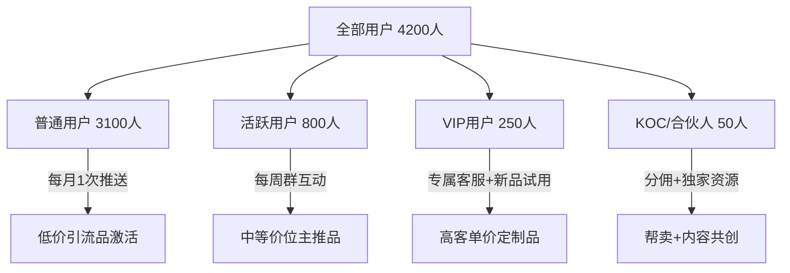
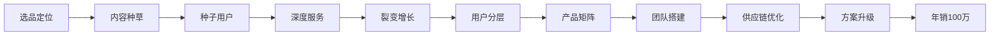

## 案例六：从0到100万的私域电商之路

### 案例背景

陈薇（化名），32岁，原某电商平台运营经理，2020年辞职后全职做私域电商。起步资金仅3万元，没有供应链资源，没有粉丝基础，从零开始搭建私域电商体系。经过18个月的运营，实现了年销售额突破100万的成绩，净利润率达到22%。

**为什么选择私域电商而非传统电商？**

陈薇在电商平台工作5年，深刻理解一个残酷现实：传统电商的流量成本逐年攀升，获客成本从2018年的30元/人涨到2020年的120元/人，而老客户复购几乎为零——因为用户记住的是平台，不是店铺。私域电商的核心优势在于：用户一旦进入你的私域池，后续触达成本接近零，复购率远高于公域。

**初始资源盘点：**

| 资源项 | 状态 | 评估 |
|--------|------|------|
| 启动资金 | 3万元 | 仅够首批货款+基础物料 |
| 个人粉丝 | 0 | 无任何社交媒体账号 |
| 供应链资源 | 无 | 需从零建立 |
| 电商经验 | 丰富 | 5年平台运营，懂选品、懂转化 |
| 可投入时间 | 全职 | 每天10小时以上 |

### 第一阶段：冷启动——找到第一批100个种子用户（第1-2个月）

#### 选品策略：从"小而美"切入

陈薇没有选择竞争激烈的美妆、服装品类，而是选择了一个被忽视的细分赛道——**高品质家居收纳用品**。选品逻辑如下：

1. **复购性强：** 收纳用品是消耗品，好的体验会带来持续复购
2. **决策门槛低：** 单价在39-129元之间，用户不需要长时间比价
3. **视觉展示友好：** 产品使用前后对比效果明显，适合短视频传播
4. **供应链可控：** 义乌/永康有成熟产业带，小批量起订门槛低
5. **竞争相对蓝海：** 大品牌不重视这个品类，小卖家缺乏私域运营能力

**选品验证方法：**

陈薇没有一次性囤货，而是用"先测后采"的模式：

```text
选品验证四步法：

第1步：1688选3-5家供应商，各拿样品（成本约500元）
第2步：拍产品使用短视频，发到小红书/抖音测试自然流量
第3步：观察哪个视频有互动，哪个产品有评论区咨询
第4步：对有反馈的产品，小批量进货（50-100件）开始销售
```

最终确定了3个核心SKU：厨房收纳盒（59元）、衣柜收纳套装（89元）、桌面收纳架（129元）。

#### 流量获取：用内容换信任

陈薇没有花钱投流，而是采用"内容种草+评论区截流"的方式获取第一批用户：

**小红书内容策略：**

- 账号名称："收纳师小薇"，定位为家居收纳顾问
- 内容类型：收纳前后对比图、收纳技巧教程、好物推荐
- 发布频率：每天1-2篇，坚持60天
- 关键技巧：每篇笔记末尾引导"想看更多收纳技巧，主页有联系方式"

**内容矩阵设计：**

| 内容类型 | 占比 | 目的 | 示例标题 |
|----------|------|------|----------|
| 教程型 | 40% | 建立专业形象 | "厨房台面收纳的5个黄金法则" |
| 对比型 | 30% | 展示产品效果 | "100元搞定全屋桌面收纳，before/after对比" |
| 好物型 | 20% | 直接带货 | "这个收纳盒用了半年，回购第3个" |
| 生活型 | 10% | 增加亲和力 | "独居女生的收纳日常" |

**关键数据：**

- 60天发布笔记：98篇
- 总曝光量：约45万次
- 评论区咨询量：约300条
- 成功添加微信：87人
- 首单转化：31人（转化率35.6%）

这87个人就是陈薇私域的"种子用户"。

#### 种子用户深度运营

对于第一批用户，陈薇的做法是"超预期服务"：

1. **手写感谢卡：** 每个包裹里附一张手写的收纳建议
2. **主动售后跟进：** 收货后3天主动问使用体验
3. **建立VIP群：** 邀请所有买家进专属微信群，命名为"小薇收纳研究所"
4. **每日分享：** 在群里每天分享1个收纳小技巧，不推销产品

这87个种子用户的复购率达到了42%，远高于行业平均水平。

### 第二阶段：增长期——从100人到5000人的私域池扩张（第3-8个月）

#### 裂变增长：设计"自传播"机制

当种子用户积累到100人后，陈薇设计了一套裂变机制：

**裂变活动一：收纳改造挑战赛**

```text
活动规则：
1. 参与者购买任意产品，拍使用前后对比照
2. 发布到朋友圈或小红书，带话题 #收纳改造挑战#
3. 截图发给小薇，即可获得：
   - 下次购物8折券
   - 每月评选"最佳改造奖"，奖品价值200元
4. 通过参与者分享链接进来的新用户，首单9折

活动效果（每月一期，持续6期）：
- 每期参与人数：30-50人
- 每期带来新用户：80-150人
- 内容二次传播曝光：约10万次/期
```

**裂变活动二：老带新积分体系**

| 行为 | 积分 | 兑换规则 |
|------|------|----------|
| 邀请1人加微信 | 10分 | 100分=10元优惠券 |
| 被邀请人下单 | 50分 | 300分=指定产品1件 |
| 发布使用笔记（带图） | 20分 | 500分=收纳咨询服务1次 |
| 朋友复购 | 30分/次 | 1000分=年度VIP会员 |

**裂变关键数据：**

- 裂变系数：1.8（每个老用户平均带来1.8个新用户）
- 6个月私域池规模：从87人增长到4,200人
- 月均新增：约680人

#### 分层运营：不同用户不同策略

当用户规模超过1000人后，陈薇开始做用户分层：



**各层级运营策略详解：**

**普通用户（3100人）：** 购买过1次或仅领取过福利
- 触达方式：朋友圈展示+每月1次群发优惠
- 核心目标：促进首单/二次购买
- 推送内容：收纳痛点+限时折扣

**活跃用户（800人）：** 购买2次以上或经常互动
- 触达方式：微信群日常互动+每周专属福利
- 核心目标：提升客单价和复购频次
- 运营动作：新品优先试用、收纳问题免费咨询

**VIP用户（250人）：** 累计消费500元以上
- 触达方式：1对1私聊+专属VIP群
- 核心目标：口碑传播+高客单转化
- 特殊权益：生日礼盒、年度收纳方案定制、优先发货

**KOC/合伙人（50人）：** 愿意分享且有一定影响力
- 触达方式：专属对接+分佣结算
- 核心目标：帮卖裂变+内容共创
- 合作模式：15%-25%分佣+免费产品试用

#### 朋友圈运营：打造"收纳顾问"人设

陈薇的朋友圈运营遵循"4321"法则：

```text
朋友圈内容配比：
40% — 生活日常（增加真实感和亲和力）
  示例：今天去逛了宜家，发现一个超好用的收纳神器
  示例：周末在家整理书架，整整齐齐的感觉真好

30% — 专业知识（建立收纳顾问形象）
  示例：收纳的底层逻辑是"动线规划"，不是买收纳盒
  示例：为什么你的衣柜永远整理不好？因为你没做分区

20% — 产品展示（软性种草）
  示例：客户反馈的厨房收纳前后对比，看到这个效果我太开心了
  示例：这个收纳盒我自己用了8个月，终于补到货了

10% — 客户见证（社交证明）
  示例：又收到客户好评截图，被认可的感觉真好
  示例：这个姐姐买了3次了，每次都带朋友一起买
```

**发布时间：** 早8点（通勤时间）、中午12点（午休时间）、晚9点（睡前时间），每天3-4条。

### 第三阶段：爆发期——从5000人到20000人的体系化运营（第9-18个月）

#### 产品线扩展：从单品到品类矩阵

当私域池突破5000人后，陈薇开始扩展产品线，从单一的收纳用品扩展到"品质家居生活"品类：

| 产品层级 | 品类 | 价格带 | 毛利率 | 作用 |
|----------|------|--------|--------|------|
| 引流品 | 收纳小件（标签贴、挂钩等） | 9.9-19.9元 | 30% | 拉新、首单转化 |
| 利润品 | 收纳套装、家居收纳盒 | 49-129元 | 45% | 主要利润来源 |
| 形象品 | 设计师联名收纳系列 | 199-399元 | 55% | 提升品牌调性 |
| 复购品 | 收纳耗材（替换内衬、配件） | 19-39元 | 60% | 持续复购 |
| 定制品 | 全屋收纳方案（含上门） | 1999-4999元 | 40% | 高客单价突破 |

**新品测试SOP：**

```text
新品上线标准流程：
1. 选品调研（1周）：1688选样、竞品分析、用户需求调研
2. 样品测试（1周）：5个KOC试用反馈
3. 小批量进货（200件）：先在VIP群预售
4. 数据验证（2周）：转化率>15%、退货率<5%则通过
5. 正式上架：全渠道推广
6. 淘汰机制：3个月内销量<100件则下架
```

#### 团队搭建：从1人到5人

当月销售额突破10万后，陈薇开始组建团队：

| 岗位 | 职责 | 招聘方式 | 月薪 |
|------|------|----------|------|
| 客服 | 微信回复、售后处理 | 兼职（宝妈） | 3000+提成 |
| 内容 | 小红书/抖音内容制作 | 全职 | 5000+绩效 |
| 仓储 | 打包发货、库存管理 | 兼职 | 2500 |
| 运营 | 社群活动策划执行 | 全职 | 6000+提成 |
| 陈薇本人 | 选品、供应商对接、战略 | - | - |

**关键决策：** 客服和仓储用兼职，因为这两项工作标准化程度高，可以通过SOP培训快速上手。内容和运营用全职，因为需要深度理解品牌调性和用户需求。

#### 供应链优化：从1688到工厂直采

当月采购量超过5万元后，陈薇开始跳过中间商直接对接工厂：

```text
供应链升级路径：
第1阶段（0-5万/月）：1688采购，单件成本偏高，但零库存风险
第2阶段（5-15万/月）：联系工厂定制，起订量500件，成本降低20%
第3阶段（15万+/月）：与工厂签订年度框架协议，成本再降15%，专属模具定制

成本对比：
收纳盒（中号）：
- 1688采购：12元/个
- 工厂定制：9.5元/个
- 年度协议：8元/个
按月销3000个计算，成本差=3000×4=12000元/月
```

### 第四阶段：稳定期——年销售额突破100万（第13-18个月）

#### 最终数据总览

| 核心指标 | 起步时（第1个月） | 中期（第8个月） | 成熟期（第18个月） |
|----------|-------------------|-----------------|---------------------|
| 私域用户数 | 87人 | 4,200人 | 21,000人 |
| 月销售额 | 4,800元 | 12.6万元 | 18.5万元 |
| 月净利润 | 1,200元 | 2.8万元 | 4.1万元 |
| 客单价 | 68元 | 89元 | 105元 |
| 复购率 | 42% | 38% | 35% |
| 月均新增用户 | 87人 | 680人 | 1,200人 |
| SKU数量 | 3个 | 18个 | 45个 |

**18个月累计数据：**

| 项目 | 金额/数量 |
|------|-----------|
| 累计销售额 | 108.6万元 |
| 累计净利润 | 23.9万元 |
| 净利润率 | 22% |
| 累计服务客户 | 8,400人 |
| 客户终身价值（LTV） | 129元 |

#### 收入结构拆解

| 收入来源 | 月均收入 | 占比 |
|----------|----------|------|
| 收纳用品销售 | 11.2万元 | 60.5% |
| 家居生活品类销售 | 4.6万元 | 24.9% |
| 全屋收纳方案定制 | 1.5万元 | 8.1% |
| 品牌合作推广 | 0.8万元 | 4.3% |
| KOC分佣收入 | 0.4万元 | 2.2% |
| **合计** | **18.5万元** | **100%** |

#### 成本结构分析

| 成本项 | 月均支出 | 占销售额比 |
|--------|----------|------------|
| 货品成本 | 8.3万元 | 44.9% |
| 人员工资 | 1.9万元 | 10.3% |
| 包装物流 | 1.2万元 | 6.5% |
| 内容制作（素材、样品） | 0.4万元 | 2.2% |
| 工具订阅（ERP、设计） | 0.15万元 | 0.8% |
| 其他杂费 | 0.25万元 | 1.3% |
| **净利润** | **4.1万元** | **22.2%** |

### 关键策略复盘：从0到100万的8个核心决策

#### 决策一：不投流，用内容换流量

陈薇从始至终没有花过一分钱广告费。她的逻辑是：私域的本质是信任，而信任不能靠广告购买，只能靠内容积累。小红书和抖音的免费流量虽然慢，但每一个用户都是因为认可你的内容才来的，转化率远高于广告流量。

**数据对比：**

| 获客方式 | 单客成本 | 首单转化率 | 30天复购率 |
|----------|----------|------------|------------|
| 小红书自然流量 | 0元（时间成本） | 35.6% | 18% |
| 抖音自然流量 | 0元（时间成本） | 22.3% | 12% |
| 朋友推荐 | 10元奖励 | 48.2% | 25% |
| 行业平均广告获客 | 80-120元 | 5-8% | 3% |

#### 决策二：不追爆品，做长尾复购

很多私域电商追求爆品逻辑——找到一个爆款，疯狂推，收割一波就换品。陈薇选择了相反的路径：不追爆品，而是建立"产品矩阵"，让每个用户都能找到适合自己的产品，通过多次复购提升LTV。

**爆品模式 vs 矩阵模式对比：**

| 维度 | 爆品模式 | 矩阵模式（陈薇的选择） |
|------|----------|------------------------|
| 单品销量 | 极高 | 中等 |
| 利润稳定性 | 波动大 | 持续稳定 |
| 用户生命周期 | 短（买完就走） | 长（持续复购） |
| 供应链压力 | 大（爆款断货风险） | 分散（多SKU分摊） |
| 团队能力要求 | 选品+投流 | 运营+服务 |

#### 决策三：把每个客户当"合伙人"而非"消费者"

陈薇的KOC体系是整个商业模式的核心引擎。50个KOC每月贡献约30%的销售额，而且获客成本极低。

**KOC培养流程：**

```text
1. 识别潜力KOC：
   - 购买3次以上
   - 主动在朋友圈分享过产品
   - 在社群中活跃度高

2. 私聊邀约：
   "我发现你经常分享我们的产品，而且你的品味真的很好。
   我们有一个'好物推荐官'计划，想邀请你加入。"

3. 提供专属支持：
   - 免费试用所有新品
   - 专属素材包（产品图、文案模板）
   - 15%-25%销售分佣
   - 月度KOC专属交流会

4. 持续激励：
   - 月度销售排行榜（前3名额外奖励）
   - 季度线下聚会（增强归属感）
   - 年度优秀KOC免费旅行
```

#### 决策四：朋友圈不是货架，是生活剧场

陈薇从不在朋友圈硬推产品。她把朋友圈打造成一个"热爱收纳的女生的日常"，产品自然地出现在生活场景中。

**反面教材 vs 正确做法：**

```text
❌ 错误示范：
"收纳盒特价！原价89，今天只要59！限量100个！
 扫码下单👇👇👇"

✅ 正确示范：
"今天终于把厨房台面收拾干净了。
以前每次做饭都找不到调料，现在一伸手就拿到。
这个收纳架真的改变了我的做饭心情[开心]
（附图：干净整洁的厨房台面，产品自然出现在画面中）"
```

#### 决策五：售后不是成本，是最好的营销

陈薇的售后标准远超行业平均水平：

1. **7天无理由退换，运费全包：** 虽然增加了约2%的成本，但降低了用户的决策门槛
2. **收到货后主动关怀：** 第3天发消息问使用感受，不是推销，是真心关心
3. **问题处理不过夜：** 任何售后问题当天解决，即使需要补发也当天下单
4. **坏件直接补发：** 不要求用户拍照举证，直接补发，信任用户

**售后投入产出比：**

- 售后成本占销售额：3.2%
- 因售后好而复购的用户比例：28%
- 因售后好而推荐朋友的用户比例：15%
- 售后带来的隐性收入：约为售后成本的4倍

#### 决策六：数据驱动的精细化运营

陈薇每周看一次核心数据，每月做一次深度复盘：

```text
周度看板（每周一上午）：
- 新增用户数
- 朋友圈互动率（点赞+评论/好友总数）
- 社群活跃度（发言人数/群总人数）
- 周销售额及环比
- 退货率及原因分类

月度复盘（每月1号）：
- 各渠道获客成本
- 各层级用户转化率
- 各SKU销售排名及毛利分析
- KOC业绩排名
- 用户流失原因分析
- 下月策略调整
```

**数据驱动的一个实际案例：**

陈薇发现"桌面收纳架"这个SKU的退货率从2%飙升到8%。通过查看退货原因和客户反馈，发现是最近一批货的材质从亚克力换成了PS塑料，质感下降。立刻联系工厂恢复亚克力材质，同时给退货用户每人送一张20元优惠券作为补偿。这个问题从发现到解决只用了3天，避免了更大范围的口碑损失。

#### 决策七：不搞促销疲劳，用"稀缺性"替代"低价"

陈薇很少做打折促销，而是通过"限量""限时""限人"来制造购买紧迫感：

| 策略 | 具体做法 | 效果 |
|------|----------|------|
| 限量 | 新品首批仅200件，售完等下批 | 转化率比常规推品高3倍 |
| 限时 | 每月15号"会员日"，部分商品特价2小时 | 当天销售额是日均的5倍 |
| 限人 | VIP群提前24小时预售 | VIP群转化率达45% |
| 限款 | 设计师联名款永不补货 | 首批100件30分钟售罄 |

#### 决策八：从卖货到卖方案，提升客单价天花板

第12个月起，陈薇开始推出"全屋收纳方案"服务，客单价从100元级别跃升到2000-5000元级别：

```text
全屋收纳方案服务流程：
1. 线上问卷：了解户型、收纳痛点、预算
2. 视频连线：远程查看各空间现状
3. 方案设计：出具收纳规划图+产品清单
4. 产品打包：方案内产品套装价（比单买便宜20%）
5. 远程指导：视频连线指导收纳过程
6. 上门服务（本地客户）：收纳师上门实施（额外收费）

转化数据：
- 月均咨询量：40单
- 转化率：25%（10单成交）
- 平均客单价：3200元
- 月均收入：3.2万元
- 毛利率：40%（含产品+服务费）
```

### 踩过的坑与避坑指南

#### 坑一：过早扩品导致库存积压

第5个月时，陈薇看到"厨房小家电"品类很火，一次性进了2万元的货。结果发现用户画像不匹配——她的用户信任她做收纳，但不信任她卖小家电。最后这批货花了3个月才清完，还搭上了促销折扣。

**教训：** 品类扩展要围绕核心用户需求展开，不能看什么火就卖什么。每次扩品前先在VIP群做调研。

#### 坑二：社群管理失控

第6个月时，群内出现了几个"杠精"用户，经常在群里发竞品链接、质疑产品质量。陈薇一开始选择忍让，结果导致好几个活跃用户退群。

**教训：** 社群需要明确的规则和果断的管理。后来陈薇制定了群规，对违规者先私聊警告，再犯直接移出群聊。社群是你的"客厅"，不是公共论坛。

#### 坑三：过度依赖单一流量渠道

第10个月时，小红书账号因为一次违规操作被限流30天，新增用户直接断崖式下降。

**教训：** 不能把所有鸡蛋放在一个篮子里。后来陈薇同时运营小红书、抖音、视频号三个平台，任何单一平台出问题都不会影响整体增长。

#### 坑四：忽视现金流管理

第7个月时，因为大批量进货+回款周期错配，一度出现现金流紧张，差点发不出工资。

**教训：** 私域电商虽然轻资产，但现金流管理同样重要。后来陈薇坚持：进货款不超过账上现金的50%，永远留2个月的运营资金。

### 可复制的方法论框架

将陈薇的经验抽象为可复用的"私域电商从0到100万"框架：



**每个阶段的关键动作和时间预期：**

| 阶段 | 关键动作 | 时间 | 月销售额目标 |
|------|----------|------|-------------|
| 冷启动 | 选品+内容+获取种子用户 | 1-2个月 | 5000元 |
| 增长期 | 裂变+分层运营+扩品 | 3-8个月 | 10万元 |
| 爆发期 | 团队+供应链+方案服务 | 9-14个月 | 15万元 |
| 稳定期 | 体系化+被动收入 | 15-18个月 | 18万元+ |

### 适合什么人复制这个模式？

**适合人群：**
- 有一定审美和内容能力的人（不需要专业摄影，手机拍即可）
- 愿意花时间做精细化运营的人（前6个月非常辛苦）
- 有耐心的人（3个月内不会看到明显收益）
- 喜欢与人打交道的人（私域本质是关系经营）

**不适合人群：**
- 想快速赚快钱的人（私域是慢生意）
- 不愿意露脸/展示生活的人（信任需要真实感）
- 不擅长或不愿意做客服的人（售后是核心竞争力）
- 只想做一锤子买卖的人（复购是利润来源）

### 本案例核心启示

1. **私域电商的本质是信任生意：** 用户买的不只是产品，更是你这个人的品味、专业度和服务态度
2. **内容是最好的免费流量：** 与其花钱投流，不如花时间做好内容，内容的长尾效应远超广告
3. **复购率比获客更重要：** 维护一个老客户的成本是获取一个新客户的1/5，但产出是3倍
4. **分层运营是规模化的前提：** 用户超过1000人后，不分层就等于放弃精细化运营
5. **KOC体系是增长飞轮：** 50个忠诚KOC的产出可能超过1000个普通用户
6. **供应链是利润的隐形杠杆：** 采购成本每降低10%，净利润可能增加30%
7. **不追爆品追体系：** 爆品逻辑不可持续，产品矩阵+复购才是长期主义
8. **从卖货到卖方案：** 当信任积累到一定程度，方案服务的客单价和利润率都远超单品销售

***
