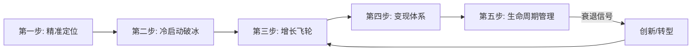
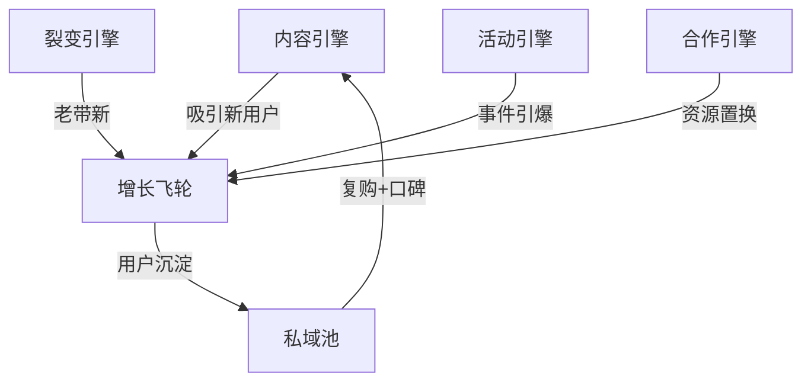
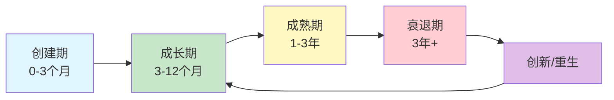

## 最终总结：七个案例背后的私域变现底层逻辑

前面七个实战案例涵盖了读书社群、宝妈社群、行业社群、知识IP、线下商家、私域电商、教育培训机构等不同赛道。表面上看，每个案例的玩法各不相同——有人靠内容引流，有人靠线下活动，有人靠裂变增长，有人靠会员制深耕。但剥开表象，这七个案例共享同一套底层逻辑。

本节将从七个案例中提炼出**可复用的通用框架**，帮助你在任何赛道都能快速找到私域变现的路径。

---

### 一、七个案例的横向对比

先把七个案例的关键数据放在一起对比，找出共性和差异：

| 维度 | 案例一·读书社群 | 案例二·宝妈社群 | 案例三·行业社群 | 案例四·知识IP | 案例五·线下商家 | 案例六·私域电商 | 案例七·教培机构 |
|------|----------------|----------------|----------------|--------------|----------------|----------------|-----------------|
| **冷启动时间** | 1个月 | 2个月 | 3个月 | 2个月 | 1个月 | 1个月 | 3个月 |
| **达到盈亏平衡** | 第3个月 | 第4个月 | 第6个月 | 第3个月 | 第2个月 | 第2个月 | 第5个月 |
| **核心变现模式** | 付费会员+训练营 | 电商带货+社群团购 | 资源对接+广告 | 会员制+咨询 | 储值+到店核销 | 分销+复购 | 课程转化 |
| **裂变系数** | 1.3 | 1.5 | 0.8 | 1.0 | 1.2 | 1.8 | 0.9 |
| **复购率** | 65% | 55% | 70% | 80% | 75% | 45% | 60% |
| **年收入量级** | 200万 | 80万 | 150万 | 300万 | 120万 | 100万 | 250万 |
| **核心壁垒** | 内容+仪式感 | 信任+供应链 | 人脉+信息差 | 专业+个人品牌 | 位置+服务 | 选品+分销体系 | 师资+效果 |

从这张表中可以提炼出几条关键规律：

**规律一：冷启动周期与"信任前置"程度成反比。** 读书社群和线下商家冷启动最快（1个月），因为前者有内容建立信任，后者有线下场景建立信任。行业社群和教培机构冷启动最慢（3个月），因为信任需要更长时间积累。

**规律二：裂变系数高的案例，都设计了"利他型"裂变机制。** 宝妈社群（1.5）和私域电商（1.8）的裂变系数最高，核心原因是邀请者和被邀请者都能获得实际利益（优惠、返利），而不是单方面的"帮我拉人"。

**规律三：复购率高的案例，都在"关系深度"上下了功夫。** 知识IP（80%）和线下商家（75%）的复购率最高，因为它们的用户关系是"一对一"或"高频接触"的，信任度远高于纯线上群聊。

---

### 二、私域变现的通用五步框架

从七个案例中抽象出来的通用框架，适用于任何赛道：



#### 第一步：精准定位——找到你的"一厘米宽、一公里深"

七个案例无一例外，都在起步时做到了极度聚焦：

- 读书社群不是"读书"，而是"每月精读1本商业书"
- 宝妈社群不是"育儿交流"，而是"0-3岁宝宝的高性价比好物"
- 行业社群不是"行业人脉"，而是"跨境电商卖家的供应链资源对接"
- 知识IP不是"教写作"，而是"帮职场人用写作打造个人品牌"

**定位的核心公式：**

```text
定位 = 特定人群 + 特定痛点 + 特定解决方案
```

**常见的定位错误：**

| 错误类型 | 错误示例 | 正确示例 |
|----------|----------|----------|
| 人群太泛 | "学习社群" | "25-35岁互联网从业者的技能提升社群" |
| 痛点模糊 | "帮你赚钱" | "帮实体店老板把到店客户沉淀为复购用户" |
| 方案不具体 | "提供优质内容" | "每周三晚8点，拆解一个可落地的副业案例" |

**自检清单：**
- [ ] 你能用一句话说清楚社群是做什么的吗？
- [ ] 目标用户听到这句话，能立刻判断"这是不是给我"的吗？
- [ ] 这个定位在微信/小红书搜索中有明确的搜索量吗？
- [ ] 市场上有没有已经成功的同类竞品？（有=验证了需求，没有=可能是伪需求）

---

#### 第二步：冷启动破冰——从0到100人的关键战役

冷启动是整个私域运营中最难的一步，也是决定成败的一步。七个案例的冷启动策略可以归纳为三种模式：

**模式A：内容先行型（适合有内容能力的人）**

```text
写10-20篇高质量内容 → 积累种子用户 → 免费体验活动 → 付费转化
```

- 代表案例：读书社群（公众号→免费读书挑战→付费会员）
- 关键指标：内容阅读→加微信的转化率 > 5%

**模式B：资源撬动型（适合有行业资源的人）**

```text
盘点现有资源 → 设计资源包 → 定向邀请 → 建群
```

- 代表案例：行业社群（行业人脉→资源对接会→付费入群）
- 关键指标：邀请到场率 > 40%，到场→付费转化率 > 30%

**模式C：场景驱动型（适合有线下场景的人）**

```text
线下场景获客 → 扫码入群 → 群内福利留存 → 付费转化
```

- 代表案例：线下商家（到店客户→扫码领优惠→储值卡转化）
- 关键指标：到店→扫码率 > 60%，入群→储值转化率 > 20%

**冷启动的五个关键动作：**

1. **种子用户筛选：** 不要追求人数，追求质量。100个精准用户 > 1000个泛用户。从你的朋友圈、老客户、公众号粉丝中筛选高互动、高需求的人。

2. **价值主张设计：** 用户加入社群的理由必须是"对我有什么好处"，而不是"支持一下"。设计一个无法拒绝的入群理由——免费课程、独家资料、资源对接、限时优惠。

3. **入群仪式感：** 第一印象决定留存。设计一套标准的入群流程：欢迎语→自我介绍模板→群规说明→新人福利→破冰活动。

4. **7天留存钩子：** 用户入群后7天内如果没有任何互动，基本就流失了。设计一个"7天体验计划"，让用户在7天内至少参与3次互动。

5. **首单转化设计：** 冷启动阶段的第一次变现至关重要。不要急于赚大钱，设计一个低门槛（9.9-99元）的付费产品，让用户完成"从免费到付费"的心理跨越。

---

#### 第三步：增长飞轮——从100到10000人的系统化增长

当社群有了100个活跃用户后，就进入了增长阶段。七个案例中，增长最快的方式是**裂变**，但裂变只是增长的引擎之一。完整的增长飞轮由四个引擎驱动：



**引擎一：内容引擎——持续输出建立行业权威**

- 公众号/小红书/抖音：每周2-3篇高质量内容
- 社群内：每日早报/每周精选/每月深度拆解
- 关键指标：内容→加微信的转化率、内容的转发率

**引擎二：裂变引擎——设计"利他型"裂变机制**

七个案例中效果最好的裂变设计：

| 裂变类型 | 机制 | 适用场景 | 裂变系数 |
|----------|------|----------|----------|
| 双向奖励 | 邀请1人，双方各得XX | 付费社群 | 1.2-1.5 |
| 拼团裂变 | 3人成团享特价 | 电商/课程 | 1.5-2.0 |
| 内容裂变 | 转发海报领资料包 | 知识类社群 | 1.0-1.3 |
| 任务裂变 | 完成XX任务解锁权益 | 活动引流 | 1.3-1.8 |
| 分销裂变 | 推荐购买获佣金 | 高客单价产品 | 1.5-2.5 |

**引擎三：活动引擎——定期制造"事件感"**

- 月度活动：线上分享会、主题讨论、打卡挑战
- 季度活动：线下见面会、行业峰会、训练营
- 年度活动：年度盛典、颁奖典礼、白皮书发布

**引擎四：合作引擎——借力打力**

- KOL互推：找粉丝画像相似但不竞争的KOL互推
- 品牌联名：与互补品牌联合举办活动
- 异业合作：与不同行业但同一人群的品牌交换流量

---

#### 第四步：变现体系——构建多元收入结构

七个案例中，没有一个只靠单一变现方式。成熟的私域变现体系至少包含三层收入结构：

**第一层：基础收入（稳定现金流）**

- 付费会员费/年费
- 储值卡/预付款
- 定期团购/电商佣金

**第二层：增长收入（随规模放大）**

- 训练营/课程
- 咨询/顾问服务
- 品牌广告/推广合作

**第三层：杠杆收入（高利润来源）**

- 资源对接/中间商差价
- 企业定制服务
- 知识产权（出书/课程版权）

**不同规模社群的变现策略建议：**

| 社群规模 | 推荐变现组合 | 月收入预期 | 核心策略 |
|----------|-------------|-----------|----------|
| 100人以下 | 付费会员 + 咨询 | 3000-10000元 | 深耕信任，提高客单价 |
| 100-500人 | 会员 + 电商 + 训练营 | 1-5万元 | 裂变增长+多元变现 |
| 500-2000人 | 会员 + 电商 + 广告 + 活动 | 5-20万元 | 系统化运营+团队搭建 |
| 2000人以上 | 全线产品 + 企业合作 + 品牌化 | 20万+ | 品牌化+生态化 |

**变现的三条红线：**

1. **商业内容占比不超过20%。** 一旦超过，社群氛围就会变质，用户会觉得"这个群就是卖东西的"。
2. **不卖自己不信任的产品。** 一次翻车就会摧毁长期建立的信任，信任一旦崩塌，社群就死了。
3. **先服务，后变现。** 前3个月以提供价值为主，让用户感受到"这个群值得待"，再逐步引入变现产品。

---

#### 第五步：生命周期管理——延长社群的"黄金期"

社群有生命周期，七个案例中，做得好的社群都在"成熟期"采取了延长生命周期的策略：



**各阶段的核心任务和预警信号：**

| 阶段 | 核心任务 | 衰退预警信号 | 应对策略 |
|------|----------|-------------|----------|
| 创建期 | 建立核心规则、培养种子用户 | 入群后7天无互动率 > 50% | 加强入群引导、增加互动活动 |
| 成长期 | 扩大规模、完善变现体系 | 新增速度放缓、活跃率下降 | 启动裂变机制、引入新内容形式 |
| 成熟期 | 深耕用户价值、建立品牌壁垒 | 日活下降、退群率上升 | 开发新产品、引入新角色、组织线下活动 |
| 衰退期 | 评估是否转型或重启 | 日活 < 5%、变现持续下滑 | 孵化新社群、合并同类社群、转型新赛道 |

**延长生命周期的五种创新手段：**

1. **内容形式创新：** 从图文→短视频→直播→播客，持续给用户新鲜感
2. **角色体系创新：** 引入"学长/学姐"、"嘉宾导师"、"城市分会长"等新角色，让用户之间产生新的连接
3. **活动形式创新：** 从线上讨论→线下沙龙→游学→行业考察，不断升级体验
4. **产品线创新：** 根据用户需求变化，开发新的付费产品（如从读书→写作→出版）
5. **社群裂变创新：** 从一个大社群→多个垂直子社群→社群联盟，扩大生态

---

### 三、七个案例中最值得借鉴的七个"一招鲜"

每个案例都有一招特别值得学习的"杀手锏"：

**1. 读书社群的"仪式感设计"**

每月1号发布本月书单，每本书有专属领读人，读完颁发电子证书，年度读书排行榜颁奖。这些"仪式感"让读书从"个人行为"变成了"社群活动"，参与感和归属感大幅提升。

**可复用的仪式感清单：**
- 固定时间节点的固定动作（每周一/每月1号/每年年初）
- 成就系统（徽章/证书/排行榜）
- 里程碑庆祝（入群100天/完成10次打卡/推荐5位好友）

**2. 宝妈社群的"信任变现路径"**

先当"育儿顾问"免费解答问题3个月，建立信任后才开始推荐产品。推荐产品时，先自己买、自己用、拍真实使用视频，再分享购买链接。这个"先信任、后变现"的路径，让转化率高达15%。

**可复用的信任建设节奏：**
```text
第1个月：纯内容输出，不提任何商业
第2个月：分享个人使用体验，不推荐购买
第3个月：首次推荐，附真实测评+限时优惠
第4个月+：定期推荐，保持7:3的内容:商业比例
```

**3. 行业社群的"信息差变现"**

社群的核心价值不是"人脉"，而是"信息差"。每周整理行业动态、政策变化、平台规则更新，做成"行业周报"发到群里。这份周报成了群成员必读的"行业情报"，也为后续的资源对接服务建立了权威性。

**4. 知识IP的"会员等级体系"**

三级会员体系（基础/高级/VIP）不是简单的"价格分层"，而是"需求分层"：
- 基础会员满足"学习需求"（内容+社群）
- 高级会员满足"成长需求"（互动+指导）
- VIP会员满足"资源需求"（人脉+机会）

每一级的设计都对应用户不同阶段的需求，让用户在成长过程中自然升级。

**5. 线下商家的"储值锁客"模型**

储值卡不是简单的"预付费打折"，而是一套精密的锁客系统：
- 首次储值门槛低（充200送50），降低决策成本
- 消费满一定金额触发"升级储值"提醒（再充500送200）
- 储值余额不足时自动推送"续充优惠"
- 储值会员享受"非储值客户没有"的专属权益

**6. 私域电商的"分销员体系"**

把忠实客户变成"分销员"，不是简单给佣金，而是一套完整的赋能体系：
- 提供标准化的发圈素材（文案+图片+视频）
- 定期培训销售技巧和产品知识
- 设计阶梯式佣金（卖得越多，佣金比例越高）
- 月度排行榜+奖金激励

**7. 教培机构的"效果可视化"**

教育行业的最大痛点是"效果难以量化"。这家机构的做法是：
- 入学时做能力测评，建立"起点档案"
- 每月一次阶段性测评，生成"成长报告"
- 结课时出"毕业报告"，对比起点和终点
- 学员案例做成"效果海报"用于传播

---

### 四、新手最容易踩的十个坑

从七个案例的失败教训中，总结出新手最容易犯的十个错误：

| 排名 | 常见错误 | 后果 | 正确做法 |
|------|---------|------|----------|
| 1 | 一上来就拉500人大群 | 群变死群，沦为广告群 | 先从50-100人的小群做起 |
| 2 | 只发广告不做内容 | 用户退群、屏蔽 | 内容:商业 = 7:3 |
| 3 | 没有群规或群规形同虚设 | 群内混乱、劣币驱逐良币 | 入群前签署群规，违规即处理 |
| 4 | 追求数量不追求质量 | 泛用户不付费、不活跃 | 精准筛选，宁缺毋滥 |
| 5 | 群主一个人唱独角戏 | 群主疲劳、社群缺乏活力 | 培养核心成员，分担运营 |
| 6 | 没有变现就开始运营 | 运营3个月后失去动力 | 第1个月就设计变现路径 |
| 7 | 价格定太低 | 吸引低质量用户，利润薄 | 价值定价，不打价格战 |
| 8 | 忽视数据 | 不知道哪里出了问题 | 建立核心数据看板 |
| 9 | 照搬别人的模式 | 水土不服、执行走样 | 理解底层逻辑，结合自身特点 |
| 10 | 一个人扛所有事 | 精力耗尽、无法规模化 | 搭建团队，分工协作 |

---

### 五、从案例到你的行动路线图

看完七个案例，最重要的不是"学到了什么"，而是"接下来做什么"。以下是根据你所处阶段的行动建议：

#### 如果你还在"想"的阶段（0-1个月）

```text
Week 1: 确定定位
  ├── 列出你的3个技能/兴趣/资源
  ├── 在微信/小红书搜索验证需求
  └── 用一句话写出你的社群定位

Week 2: 设计产品
  ├── 设计一个免费引流产品（资料包/课程/活动）
  ├── 设计一个低价付费产品（9.9-99元）
  └── 设计会员权益体系

Week 3: 积累种子用户
  ├── 从朋友圈筛选50个潜在用户
  ├── 写3-5篇高质量内容发布
  └── 逐一私聊邀请

Week 4: 冷启动
  ├── 建群，发送欢迎语和群规
  ├── 举办第一次群活动
  └── 完成第一单变现
```

#### 如果你已经有100人社群（1-6个月）

```text
目标: 从100人增长到500人，月收入突破1万元

行动清单:
  □ 设计裂变机制，启动第一次裂变活动
  □ 建立内容日历，每周3次内容输出
  □ 引入第一个付费产品（训练营/课程/团购）
  □ 培养3-5个核心成员分担运营
  □ 建立数据看板，每周复盘关键指标
  □ 做第一次用户调研，了解需求变化
```

#### 如果你已经有500人社群（6-12个月）

```text
目标: 从500人增长到2000人，月收入突破5万元

行动清单:
  □ 搭建完整的变现产品线（基础/中级/高端）
  □ 启动分销员/推广员体系
  □ 尝试与其他KOL/品牌合作
  □ 举办第一次线下活动
  □ 搭建小团队（运营助理+内容编辑+客服）
  □ 开始做品牌化建设（统一视觉/话术/SOP）
```

---

### 六、私域变现的核心公式

最后，用一个公式总结私域变现的底层逻辑：

```text
私域收入 = 用户数 × 信任度 × 变现频率 × 客单价
```

- **用户数：** 通过内容+裂变+合作持续扩大
- **信任度：** 通过持续输出价值+真诚服务不断提升
- **变现频率：** 通过产品线设计+活动策划合理提高
- **客单价：** 通过会员等级+增值服务逐步拉升

四个变量中，**信任度**是最核心的。没有信任，用户数再多也是"僵尸粉"；有了信任，1000个铁杆粉丝就能撑起一个年入百万的事业。

回到凯文·凯利的那句话：**你只需要1000个铁杆粉丝。** 这1000个人，不是关注你的人，不是点赞你的人，而是愿意为你付费、为你传播、为你背书的人。

找到他们，服务好他们，你的私域变现之路就成功了一大半。

---

### 本节核心要点

1. **七个案例共享同一套底层逻辑：** 定位→冷启动→增长→变现→生命周期管理
2. **冷启动的关键是"信任前置"：** 信任建立越早，冷启动越快
3. **增长飞轮有四个引擎：** 内容、裂变、活动、合作，不要只依赖一个
4. **变现体系至少三层：** 基础收入（稳定）+ 增长收入（放大）+ 杠杆收入（高利润）
5. **社群有生命周期，需要持续创新：** 内容形式、角色体系、活动形式都要不断迭代
6. **私域收入公式：** 用户数 × 信任度 × 变现频率 × 客单价，信任度是核心变量
7. **1000个铁杆粉丝足以支撑一个事业：** 不要追求规模，先服务好核心用户
