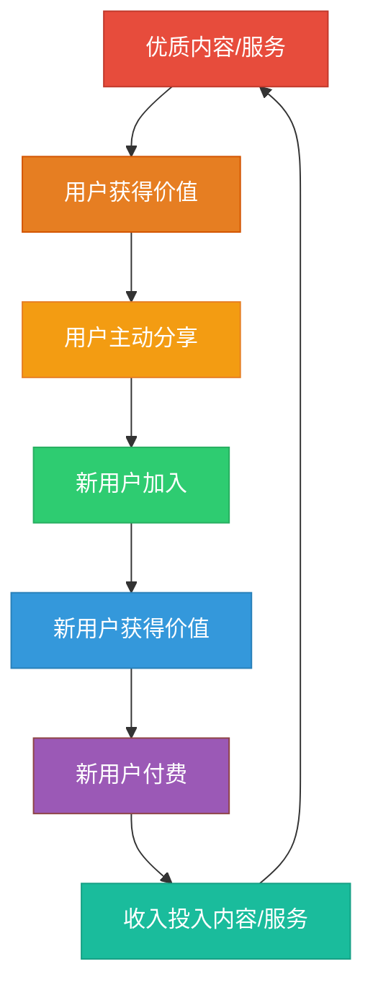
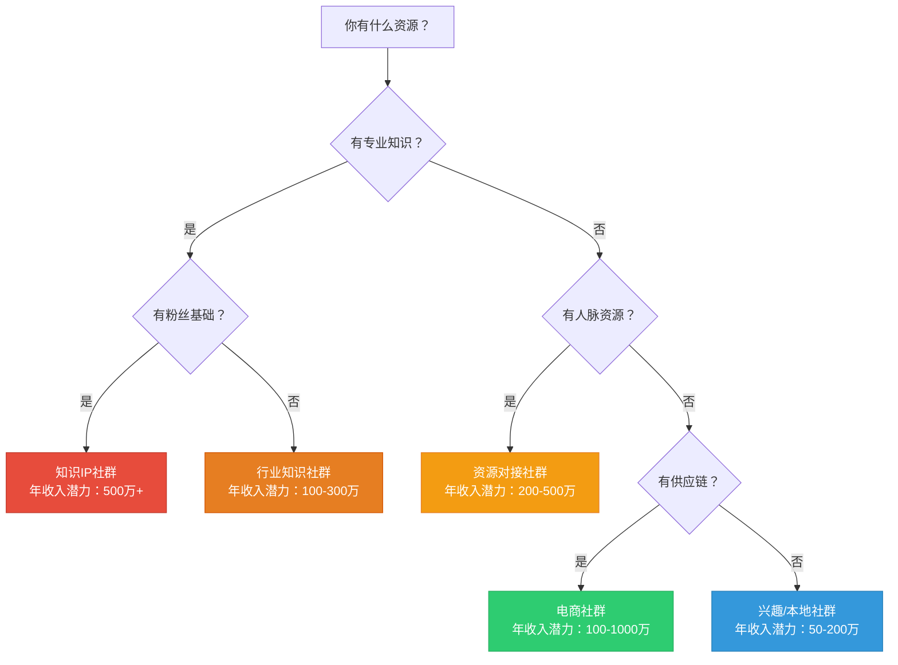
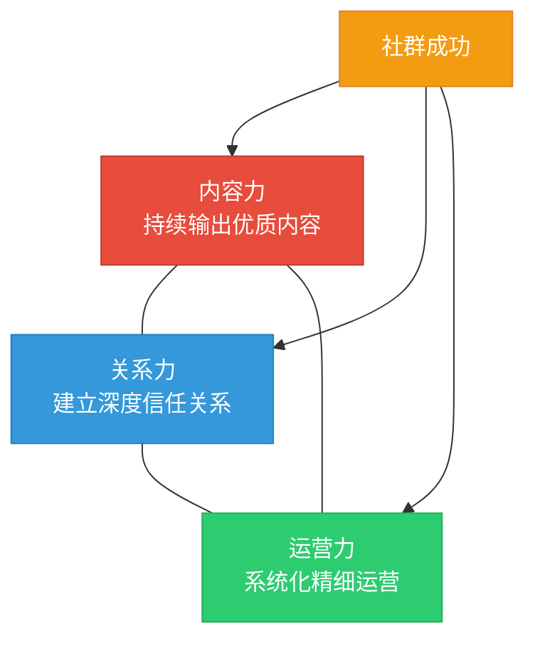

## 本节核心要点

本节通过对7个不同类型的社群与私域流量实战案例的深度拆解，提炼出可复制的核心规律和方法论。无论你是刚起步的新手，还是已有一定基础的运营者，这些核心要点都能帮你建立系统化的认知框架，避免"只见树木不见森林"的碎片化理解。

***

### 一、七大案例全景回顾

在深入提炼规律之前，先用一张表回顾7个案例的核心特征，建立全局视角：

| 案例 | 社群类型 | 目标人群 | 核心变现模式 | 年收入规模 | 启动周期 | 关键成功因素 |
|------|---------|---------|-------------|-----------|---------|-------------|
| 读书社群 | 学习型社群 | 25-40岁职场人 | 会员制+课程+线下活动 | 200万 | 12个月 | 内容质量+社群氛围 |
| 宝妈社群 | 兴趣型社群 | 0-6岁宝妈 | 电商带货+品牌广告 | 150万 | 8个月 | 信任关系+选品能力 |
| 行业资源社群 | B端资源型社群 | 特定行业从业者 | 资源对接+高端活动 | 300万 | 18个月 | 圈层质量+资源整合 |
| 知识IP社群 | 个人品牌社群 | 付费意愿强的粉丝 | 会员制+咨询+培训 | 500万 | 24个月 | 个人IP势能+产品体系 |
| 线下商家社群 | 本地生活社群 | 3公里内消费者 | 私域复购+活动引流 | 80万 | 6个月 | 地理位置+高频消费 |
| 私域电商社群 | 电商型社群 | 垂直品类消费者 | 自营产品+分销裂变 | 1000万 | 15个月 | 供应链能力+分销体系 |
| 教育培训机构 | 教育型社群 | 学员及家长 | 课程销售+续费+转介绍 | 800万 | 12个月 | 教学效果+服务体系 |

**关键发现：** 7个案例覆盖了从个人副业到企业级运营的完整光谱，年收入从80万到1000万不等。但它们有一个共同点——**都不是靠"运气"做起来的，而是遵循了一套可复制的增长逻辑**。

***

### 二、贯穿七大案例的底层规律

通过交叉对比7个案例，可以提炼出5条底层规律。这些规律不依赖于具体的行业或社群类型，是普适性的增长法则。

#### 规律一：冷启动的本质是"种子用户质量"而非数量

7个案例在冷启动阶段有一个共同特征——**不追求初始用户数量，而追求初始用户质量**。

读书社群的刘洋从1万公众号粉丝中只筛选了200个高互动用户逐一私聊邀请，最终52人付费，但这52人的活跃度和忠诚度远超普通用户。宝妈社群的起步同样是从身边的50个真实宝妈朋友开始，而不是在各种群里"广撒网"。

**底层逻辑：** 社群的种子用户决定了社群的文化基因。100个高质量种子用户带来的活跃度、口碑传播和付费意愿，远超1000个"被拉进来"的泛用户。种子用户就是社群的"地基"，地基不稳，上面盖多高的楼都会塌。

**实操标准：** 种子用户筛选的四个维度——

1. **需求匹配度**：是否真的有你解决的问题？不是"听起来不错"，而是"我确实需要"
2. **付费意愿**：是否愿意为解决方案付费？免费用户和付费用户的行为模式完全不同
3. **互动意愿**：是否愿意在社群中发言、分享、帮助他人？沉默用户对社群氛围没有贡献
4. **传播意愿**：是否愿意把社群推荐给朋友？口碑传播是最低成本的增长方式

满足其中3个以上的用户，才是合格的种子用户。

#### 规律二：变现模式必须与社群基因匹配

7个案例的变现模式各不相同，但都是**基于社群的核心价值自然延伸出来的**，而非生硬地"嫁接"一个变现模式。

| 社群基因 | 自然延伸的变现模式 | 强行嫁接的错误模式 |
|---------|------------------|------------------|
| 学习型（读书社群） | 会员制+课程+活动 | 电商带货（用户要的是知识，不是商品） |
| 信任型（宝妈社群） | 电商带货+广告 | 高价咨询（宝妈要的是实惠，不是咨询） |
| 资源型（行业社群） | 资源对接+活动 | 低价会员制（用户要的是资源质量，不是便宜） |
| IP型（知识IP） | 会员制+咨询+培训 | 纯电商（用户买的是IP的势能，不是商品） |
| 本地型（线下商家） | 复购+活动 | 全国性分销（用户就在3公里内，裂变到外地没意义） |

**底层逻辑：** 变现模式的本质是"社群价值的货币化"。社群提供什么价值，就用什么方式变现。强行嫁接不匹配的变现模式，不仅赚不到钱，还会破坏社群信任和氛围。

**判断方法：** 问自己三个问题——

1. 用户加入社群的核心需求是什么？（知识/社交/资源/优惠/身份认同）
2. 用户愿意为什么额外价值付费？（不是你觉得他们应该付，而是他们主动问"有没有XX"）
3. 这个变现动作会不会损害社群的核心体验？（如果会，就不是好的变现模式）

#### 规律三：增长飞轮的核心是"用户自发传播"

7个案例在增长阶段都实现了不同程度的"自增长"——即老用户主动带来新用户，而不是完全依赖运营者的推广。

这个飞轮的运转机制如下：

**各案例的裂变机制对比：**

| 案例 | 主要裂变方式 | 裂变系数 | 裂变触发点 |
|------|------------|---------|-----------|
| 读书社群 | 内容分享+邀请奖励 | 1.3 | 读书笔记在朋友圈获得点赞，激发分享欲 |
| 宝妈社群 | 好物推荐+口碑传播 | 1.5 | 买到好东西自然推荐给其他宝妈 |
| 行业资源社群 | 邀请制+行业口碑 | 1.2 | 圈内人推荐是进入高端社群的唯一方式 |
| 知识IP社群 | 内容传播+学员证言 | 1.4 | 学员的成果本身就是最好的广告 |
| 线下商家社群 | 到店引流+口碑推荐 | 1.1 | 消费体验好，自然推荐给朋友 |
| 私域电商社群 | 分销返佣+拼团 | 2.0+ | 经济激励直接驱动传播行为 |
| 教育培训机构 | 转介绍奖励+成绩展示 | 1.6 | 学员成绩提升，家长主动推荐 |

**关键洞察：** 裂变系数>1意味着社群可以自我增长，<1则需要持续外部引流。电商类社群的裂变系数通常最高（经济激励直接），而资源型社群的裂变系数最低（圈层壁垒高）。但低裂变系数不等于低价值——资源型社群的单个用户价值远高于电商社群。

#### 规律四：留存比拉新重要10倍

7个案例的运营者都经历过"拉新容易留存难"的阶段。数据显示，**将留存率从60%提升到80%，对收入的影响相当于拉新量翻倍**。

**各案例的留存策略对比：**

| 案例 | 核心留存策略 | 月留存率 | 关键动作 |
|------|------------|---------|---------|
| 读书社群 | 每日打卡+月度精读+线下读书会 | 85% | 让用户养成每日习惯，形成"不打卡就难受"的心理依赖 |
| 宝妈社群 | 每日好物推荐+育儿问答+妈妈互助 | 78% | 解决真实问题，让用户觉得"离不开这个群" |
| 行业资源社群 | 月度行业报告+资源对接会+专家问答 | 82% | 持续提供稀缺资源，让用户觉得"退群就亏了" |
| 知识IP社群 | 每周直播+学员案例+1对1答疑 | 88% | IP的个人魅力和持续输出是最强留存武器 |
| 线下商家社群 | 每周专属优惠+新品试用+积分体系 | 75% | 持续的优惠和特权让用户保持关注 |
| 私域电商社群 | 每日爆款推荐+限时秒杀+会员日 | 70% | 高频消费场景让用户保持活跃 |
| 教育培训机构 | 学习进度跟踪+作业批改+家长沟通 | 90% | 教育服务的天然高粘性（学习进度不可中断） |

**留存的三个层次：**

1. **功能留存**：用户因为"有用"而留下——能解决问题、能获得资源、能买到好东西
2. **关系留存**：用户因为"有人"而留下——在社群中交到了朋友、建立了关系、获得了认同
3. **习惯留存**：用户因为"习惯了"而留下——每天打开社群已经成为生活的一部分

大多数社群只做到了第一层，优秀的社群做到了第二层，顶级社群做到了第三层。从第一层到第三层，留存率可以提升20-30个百分点。

#### 规律五：规模化的核心是"可复制的SOP"

7个案例从"个人运营"到"团队运营"的转折点，都是**建立了标准化的运营SOP**。

**读书社群的SOP示例：**

| 时间 | 运营动作 | 负责人 | 工具 | 预期产出 |
|------|---------|-------|------|---------|
| 每日8:00 | 发布今日阅读任务 | 内容编辑 | 企业微信定时发送 | 当日打卡率>60% |
| 每日20:00 | 整理当日打卡精华 | 社群助理 | 微信群+石墨文档 | 精华内容1篇 |
| 每周三20:00 | 线上读书分享会 | 社群主理人 | 腾讯会议 | 参与率>30% |
| 每月最后一个周六 | 线下读书会 | 活动策划 | 线下场地 | 到场率>15% |
| 每月1日 | 发布月度书单+会员续费提醒 | 运营主管 | 公众号+私信 | 续费率>70% |
| 每季度 | 会员满意度调研 | 数据分析 | 问卷星 | NPS>50 |

**SOP的价值在于：** 不依赖个人能力，新人按照SOP就能完成80%的运营工作。这使得社群可以在主理人不在场的情况下正常运转，为规模化扩张奠定基础。

***

### 三、不同阶段的核心行动清单

将7个案例的经验按发展阶段整理为可执行的行动清单，帮助读者"对号入座"。

#### 阶段一：冷启动期（0-100人，1-3个月）

**核心目标：** 验证社群定位，打磨核心价值

| 优先级 | 行动项 | 具体做法 | 常见错误 |
|-------|--------|---------|---------|
| P0 | 确定社群定位 | 明确"为谁解决什么问题"，用一句话说清楚 | 定位太宽泛，"什么人都欢迎"等于"什么人都吸引不到" |
| P0 | 筛选种子用户 | 从现有资源（朋友圈、公众号、线下关系）中筛选50-100个高质量目标用户 | 在各种群里"广撒网"拉人，拉来的都是"围观群众" |
| P1 | 设计核心价值交付 | 确定社群提供什么价值（内容/资源/社交/服务），并设计前3个月的交付计划 | 承诺太多、交付太少，用户期望落差导致流失 |
| P1 | 建立互动机制 | 设计每日/每周的固定互动环节，让用户有"参与的理由" | 建了群就不管了，群里一片死寂 |
| P2 | 收集反馈迭代 | 每周与5-10个用户深度交流，了解他们的真实感受和需求 | 只看数据不听声音，或者只听好话不听批评 |

**判断标准：** 如果100人社群中，有30人以上愿意付费，说明定位验证成功，可以进入增长阶段。如果付费人数<10人，需要重新审视定位和价值交付。

#### 阶段二：增长期（100-1000人，3-12个月）

**核心目标：** 建立增长引擎，实现可持续拉新

| 优先级 | 行动项 | 具体做法 | 常见错误 |
|-------|--------|---------|---------|
| P0 | 设计裂变机制 | 邀请奖励、拼团、分销返佣等，让用户有动力传播 | 只靠运营者一个人推广，增长速度受限于个人精力 |
| P0 | 建立内容引流体系 | 在公域平台（公众号/小红书/抖音）持续输出内容，引流到私域 | 只在社群内部运营，不对外发声，新用户无从了解你 |
| P1 | 开始变现测试 | 小规模测试付费产品，验证用户付费意愿和价格敏感度 | 一直"免费"不收费，用户养成了免费习惯后再收费就难了 |
| P1 | 建立用户分层 | 根据活跃度、付费金额、传播贡献等维度对用户分层，差异化运营 | 对所有用户"一视同仁"，高价值用户得不到特殊对待 |
| P2 | 优化运营效率 | 将重复性工作SOP化，引入工具提升效率 | 一直用"人肉"运营，规模越大越累 |

**判断标准：** 如果月新增用户>月流失用户，且付费用户比例稳定在20-30%，说明增长引擎运转良好。

#### 阶段三：成熟期（1000人以上，12个月以上）

**核心目标：** 提升用户终身价值，实现规模化盈利

| 优先级 | 行动项 | 具体做法 | 常见错误 |
|-------|--------|---------|---------|
| P0 | 丰富产品体系 | 从单一产品扩展到产品矩阵（低价引流品+中价利润品+高价旗舰品） | 只有一个产品，用户消费完就流失 |
| P0 | 建立用户生命周期管理 | 新用户→活跃用户→付费用户→高价值用户→传播者，每个阶段有不同的运营策略 | 对所有用户用同一套策略，导致新用户跟不上、老用户觉得无聊 |
| P1 | 搭建团队 | 从一人运营过渡到团队协作，明确分工和SOP | 一个人扛所有工作，累死也做不大 |
| P1 | 数据驱动决策 | 建立核心指标看板，用数据而非感觉做决策 | 凭感觉运营，发现问题时已经来不及了 |
| P2 | 探索新增长曲线 | 在现有社群基础上，探索新的变现模式或新的用户群体 | 躺在舒适区不创新，等社群进入衰退期再想转型就晚了 |

***

### 四、七大案例的核心教训

每个案例都有"踩过的坑"，这些教训比成功经验更有价值——因为它们能帮你省钱、省时间、少走弯路。

#### 教训一：不要高估免费用户的付费转化

多个案例在从免费社群转向付费社群时，遇到了"转化断崖"——免费社群有500人，推出付费产品后只有20人购买，转化率仅4%。

**真相：** 免费用户和付费用户是两个完全不同的群体。免费用户中确实有潜在付费用户，但比例通常只有5-15%。不要因为免费社群人数多就乐观估计付费转化。

**正确做法：** 从一开始就设计"付费门槛"——即使是低价（9.9元/19.9元），也能有效筛选出有付费意愿的用户。"用价格做筛选器"比"用免费做诱饵"更可持续。

#### 教训二：不要忽视社群的"沉默危机"

行业资源社群的运营者分享了一个深刻的教训：社群最危险的时刻不是有人退群，而是**群里没人说话了**。当你发现群里连续3天没有自发讨论时，社群已经进入了"沉默衰退"。

**沉默的三个信号：**

1. 群消息从每天100+条降到20条以下
2. 运营者发布的内容只有点赞没有讨论
3. 新成员入群后不自我介绍、不发言

**应对策略：** 建立"活跃度预警机制"——当群消息量连续3天低于阈值时，自动触发"激活动作"（发起话题讨论、发布福利、邀请KOC分享）。

#### 教训三：不要用"低价"代替"价值"

线下商家社群的运营者最初用"全场9折"作为社群福利，结果用户只在打折时才活跃，不打折就沉默。后来改为"会员专属新品试用+消费积分+生日特权"，用户活跃度反而提升了40%。

**核心认知：** 用户要的不是"便宜"，而是"被重视"和"特权感"。单纯的低价策略会吸引价格敏感型用户，这类用户的忠诚度最低——竞争对手只要价格更低，他们就会流失。

#### 教训四：分销裂变是一把双刃剑

私域电商社群的分销体系带来了爆发式增长（裂变系数达到2.0+），但也带来了严重的问题——部分分销员为了佣金过度承诺、虚假宣传，导致大量用户投诉和退款。

**教训：** 分销体系必须有严格的品控和合规管理。具体包括——

1. 分销员培训：统一话术，禁止夸大宣传
2. 佣金结构设计：阶梯式佣金，退单扣回佣金
3. 合规审查：定期抽查分销员的宣传内容
4. 用户反馈机制：建立投诉通道，及时处理问题

#### 教训五：教育社群的"效果外化"是续费的关键

教育培训机构的案例显示，**续费率与"效果可见度"高度正相关**。当学员的学习成果被系统化地记录和展示（学习报告、成绩对比、作品集）时，续费率从55%提升到85%。

**实操方法：**

1. 入学时建立"学习起点档案"（测试成绩、能力评估）
2. 每月生成"学习进度报告"（数据对比、进步可视化）
3. 结业时制作"学习成果集"（作品、证书、成长记录）
4. 定期在社群中展示优秀学员案例（既激励老学员，又吸引新学员）

***

### 五、从案例到行动：你的社群定位决策框架

看完7个案例后，最重要的不是"照搬哪个案例"，而是**找到适合自己的路径**。以下决策框架帮你系统化地做这个判断。

#### 第一步：评估你的资源禀赋

| 资源维度 | 高资源 | 低资源 | 建议路径 |
|---------|--------|--------|---------|
| 专业知识 | 在某个领域有深厚积累 | 没有突出的专业能力 | 高→知识IP/行业社群；低→兴趣社群/本地社群 |
| 粉丝基础 | 已有公众号/抖音等粉丝基础 | 从零开始 | 高→直接转化私域；低→先在公域平台积累内容 |
| 供应链 | 有稳定的产品/货源渠道 | 没有供应链资源 | 高→电商社群；低→服务型/知识型社群 |
| 人脉资源 | 在某个行业有广泛人脉 | 社交圈较窄 | 高→资源对接社群；低→内容驱动型社群 |
| 时间精力 | 可以全职投入 | 只能兼职运营 | 高→大规模社群；低→小而美的精品社群 |

#### 第二步：选择你的赛道

基于资源禀赋评估，匹配最适合的社群类型：

#### 第三步：制定你的90天行动计划

| 时间 | 核心任务 | 关键里程碑 | 避坑要点 |
|------|---------|-----------|---------|
| 第1-2周 | 定位+种子用户筛选 | 完成社群定位画布，筛选出50个种子用户候选人 | 不要急着建群，先把定位想清楚 |
| 第3-4周 | 建群+核心价值交付 | 种子用户入群，完成第一次核心价值交付（内容/活动/服务） | 第一次交付必须超预期，这是"第一印象" |
| 第5-8周 | 迭代+互动机制 | 建立每日/每周互动节奏，收集反馈迭代3次以上 | 不要怕改，前8周就是不断试错的过程 |
| 第9-12周 | 增长+变现测试 | 社群达到100人，推出第一个付费产品并完成测试 | 第一个产品定价不要太高，重点是验证付费意愿 |

***

### 六、数据驱动：社群运营的核心指标仪表盘

7个案例的运营者都强调了数据的重要性。以下是社群运营必须跟踪的核心指标：

| 指标类别 | 核心指标 | 计算方式 | 健康基准 | 预警阈值 |
|---------|---------|---------|---------|---------|
| **增长指标** | 日/周/月新增用户数 | 新入群人数 | 月增长>10% | 连续2周负增长 |
| **活跃指标** | 日活跃率 | 当日发言人数/总人数 | >20% | <10% |
| **留存指标** | 月留存率 | 月末在群人数/月初在群人数 | >80% | <60% |
| **转化指标** | 付费转化率 | 付费用户数/总用户数 | 15-30% | <8% |
| **价值指标** | ARPU（人均收入） | 月收入/总用户数 | 因类型而异 | 持续下降 |
| **裂变指标** | 裂变系数 | 新增用户/老用户推荐数 | >1.0 | <0.5 |
| **满意度指标** | NPS（净推荐值） | 推荐者%-贬损者% | >50 | <20 |

**实操建议：** 不需要一开始就跟踪所有指标。初期只关注3个核心指标——**活跃率、留存率、付费转化率**。当社群规模超过500人后，再逐步完善指标体系。

**工具推荐：** 小规模社群（<200人）可以用Excel/飞书表格手动统计；中等规模（200-1000人）建议用企业微信的数据分析功能；大规模社群（1000人以上）需要专业工具（如微伴助手、尘锋SCRM等）。

***

### 七、跨案例共性总结：社群成功的"铁三角"

综合7个案例，社群成功的核心可以归纳为一个"铁三角"模型：

**内容力：** 让用户"有东西可看、有东西可学"。没有内容的社群就是"聊天群"，用户很快就会失去兴趣。内容形式包括但不限于——干货文章、行业报告、案例拆解、工具推荐、直播分享、线下活动。

**关系力：** 让用户"有归属感、有认同感"。社群不是"广播频道"，而是"共同家园"。运营者需要花时间与核心用户建立深度关系，让用户之间也建立连接。

**运营力：** 让社群"可持续、可规模化"。靠热情运营的社群活不过3个月，靠系统运营的社群可以活3年。SOP、数据驱动、团队协作是运营力的三大支柱。

三者缺一不可：只有内容没有关系，社群是"图书馆"；只有关系没有运营，社群是"朋友群"；只有运营没有内容，社群是"广告群"。三者兼备，才是真正的社群。

***

### 八、本节要点速查卡

最后，用一张速查卡总结本节最核心的要点，建议保存下来随时翻阅：

| 要点编号 | 核心观点 | 一句话解释 |
|---------|---------|-----------|
| 1 | 种子用户质量>数量 | 50个高质量种子用户胜过500个"被拉进来"的用户 |
| 2 | 变现模式匹配社群基因 | 社群提供什么价值，就用什么方式变现 |
| 3 | 增长飞轮靠用户自发传播 | 老用户带来新用户才是可持续增长 |
| 4 | 留存比拉新重要10倍 | 留存率提升20%=拉新量翻倍 |
| 5 | 规模化靠SOP不靠个人 | 没有SOP的社群，主理人就是天花板 |
| 6 | 不要高估免费到付费的转化 | 免费用户付费转化率通常只有5-15% |
| 7 | 沉默比退群更危险 | 群里没人说话是社群衰退的最早信号 |
| 8 | 特权感比低价更有价值 | 用户要的是"被重视"，不是"便宜" |
| 9 | 分销裂变需要合规管控 | 没有品控的分销会反噬品牌和信任 |
| 10 | 效果外化驱动续费 | 学习/使用成果的可视化是续费的最大驱动力 |

这10个要点覆盖了从认知到实操的完整链条。建议在开始社群运营前通读一遍，在运营过程中遇到问题时再回来对照查找。
