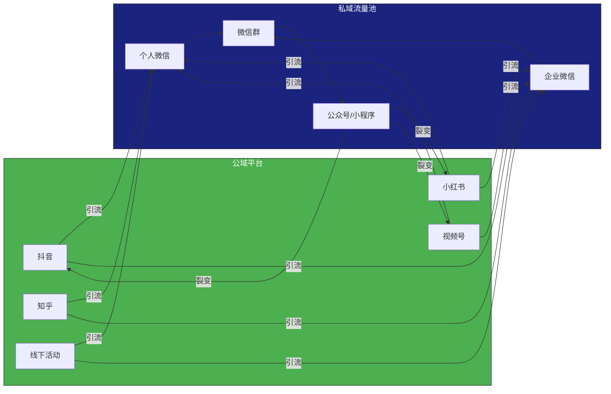
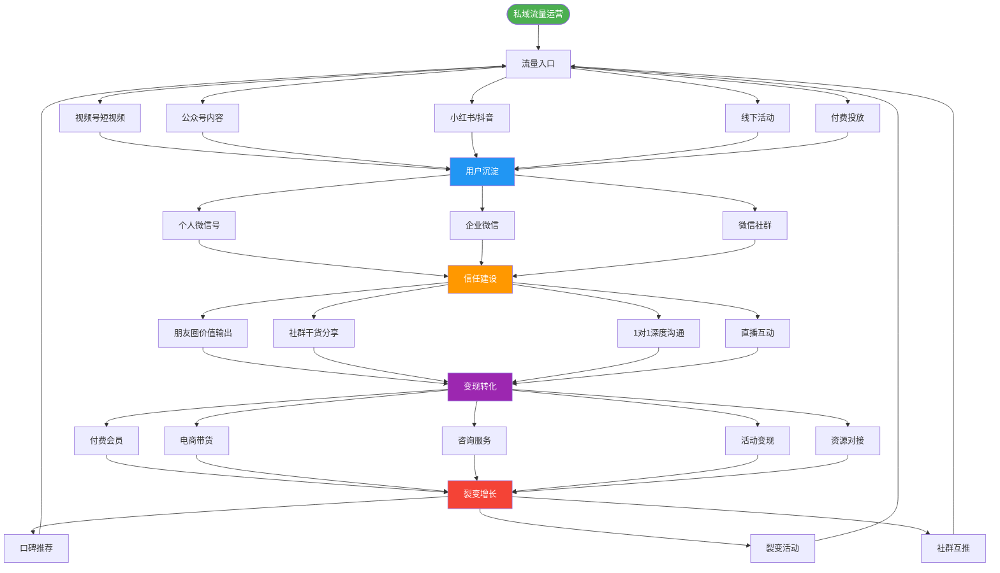

## 一、从0到1搭建私域流量池

私域流量池是社群变现的地基。没有一个稳定、精准、可控的用户池，后续的信任建设、内容运营、变现转化都无从谈起。本节将从底层逻辑出发，手把手带你完成从零到一的搭建全过程。

### 1.1 什么是私域流量池

**私域流量池的本质定义：** 你能够随时、免费、反复触达的用户集合。与公域流量（抖音推荐页、百度搜索结果）最大的区别在于——公域流量是"租来的"，平台随时可以调整算法让你消失；私域流量是"自有的"，你拥有直接连接用户的通道。

**私域流量的三大核心特征：**

| 特征 | 含义 | 反面（公域特征） |
|------|------|------------------|
| **可触达** | 无需付费即可主动联系用户 | 需要投放广告才能曝光 |
| **可反复** | 同一批用户可以多次触达 | 每次触达都需重新付费 |
| **可控制** | 你决定触达的时间、频率、内容 | 平台算法决定你的曝光量 |

**为什么2024年以后私域流量更重要？**

过去十年，互联网流量成本持续攀升。2015年微信公众号获客成本约1-3元/人，到2023年已涨至15-50元/人，部分行业甚至超过100元/人。与此同时，公域平台的算法越来越"黑盒化"——你无法预测下一条内容的曝光量，也无法保证粉丝能看到你发布的内容。微信公众号的平均打开率从2018年的5%下降到2023年的1.2%。

这意味着：**在公域平台，你是在"租"流量；在私域，你是在"买"流量然后"养"成自己的资产。** 私域流量池就像一个蓄水池，公域是河流，你需要修渠引水，然后在自己的池子里养鱼。



### 1.2 私域流量运营全景图

搭建私域流量池不是单一动作，而是一个完整的系统工程。下图展示了从流量获取到变现再到裂变增长的完整闭环：



> **运营心法：** 私域运营的核心公式 = 流量 × 信任 × 转化 × 复购 × 裂变。这是乘法关系而非加法关系——任何一个环节为零，整体结果为零；任何一个环节翻倍，整体收益翻倍。这就是为什么"从0到1"的关键不是获取大量流量，而是**先跑通最小闭环**。

### 1.3 微信生态私域布局

微信是中国最成熟的私域流量生态，没有之一。其核心优势在于：12亿月活用户、完善的社交关系链、丰富的工具矩阵（公众号、视频号、小程序、企业微信）。一个完整的微信私域布局包括五个层次：

```text
视频号（流量入口 — 短视频引流 + 直播带货）
    ↓
公众号（内容沉淀 — 深度文章 + 用户教育）
    ↓
个人微信/企业微信（深度连接 — 1对1沟通 + 朋友圈营销）
    ↓
微信群（社群运营 — 氛围营造 + 互动转化）
    ↓
小程序（服务与交易 — 电商 + 会员 + 工具）
```

**每个环节的作用与关键指标：**

| 载体 | 核心作用 | 关键指标 | 典型内容形式 |
|------|----------|----------|--------------|
| 视频号 | 短视频引流 + 直播带货 | 播放量、关注转化率、直播GPM | 60秒干货短视频、每周2-3场直播 |
| 公众号 | 内容输出、信任建立 | 阅读量、关注增长率、完读率 | 长文深度解析、案例拆解 |
| 个人微信号 | 1对1沟通、朋友圈营销 | 好友数、互动率、朋友圈点赞率 | 朋友圈日更3-5条、私聊答疑 |
| 企业微信 | 规模化客户管理 | 客户数、消息触达率、标签覆盖率 | 自动欢迎语、标签分组群发 |
| 微信群 | 社群运营、氛围营造 | 活跃度、转化率、退群率 | 每日话题讨论、周活动 |
| 小程序 | 电商、会员、工具 | UV、转化率、复购率 | 商品展示、积分商城、知识付费 |

**布局优先级建议：**

- **第一阶段（0-500人）：** 个人微信号 + 微信群。这是最低成本的起步方式，适合个人IP和小团队。
- **第二阶段（500-5000人）：** 增加公众号和企业微信。开始系统化运营，用公众号沉淀内容，用企微管理客户。
- **第三阶段（5000人以上）：** 全面布局，增加视频号和小程序。形成完整的流量闭环。

### 1.4 企业微信 vs 个人微信：如何选择

这是每个私域运营者都要面对的第一个关键决策。两者各有优劣，选错了后期迁移成本极高。

**个人微信的优势：**

- 信任度更高——用户看到的是一个"真人"，而非企业logo
- 朋友圈展示更自然——没有"企业"标签，互动感更强
- 适合小规模、高客单价的服务——比如1对1咨询、高端社群
- 支持微信支付转账——交易更便捷

**个人微信的劣势：**

- 好友上限5000人（新号甚至限制更严，需要养号）
- 无法多人协作管理——一个微信号只能一个人登录
- 员工离职会带走客户——客户关系绑定在个人账号上
- 容易被封号——频繁加人、群发消息都可能触发风控
- 没有客户标签和SOP功能——全靠手动管理

**企业微信的优势：**

- 客户数无上限（认证后）
- 支持多人协作——客户可以在多个员工之间流转
- 员工离职可以交接客户——企业资产不流失
- 有丰富的API和工具支持——自动标签、SOP群发、数据分析
- 与微信互通——用户无需下载额外App
- 客户朋友圈功能——虽然有"企业"标签，但可以统一品牌形象

**企业微信的劣势：**

- 信任感略低于个人微信——用户知道这是"企业行为"
- 朋友圈展示有"企业"标签——部分用户会自动忽略
- 部分用户对企微有抵触心理——认为是"营销号"
- 企微群发有频率限制——每月只能对同一客户群发4次
- 需要企业认证——个人无法注册

**决策矩阵：**

| 运营场景 | 推荐方案 | 理由 |
|----------|----------|------|
| 个人IP（博主、讲师、咨询师） | 个人微信为主 | 信任感是核心资产 |
| 电商商家（多SKU、高频复购） | 企业微信为主 | 需要规模化管理 |
| 教育培训机构 | 企微 + 个人微信组合 | 企微管理学员，个微服务VIP |
| 本地生活服务 | 企业微信为主 | 员工流动大，需要客户交接 |
| 高端社群（年费万元以上） | 个人微信为主 | 稀缺感和专属感 |

**最佳实践：企业微信 + 个人微信组合使用**

用企业微信做"广撒网"式的客户管理和日常触达，用个人微信维护核心用户和高价值客户。企业微信负责"量"，个人微信负责"质"。

### 1.5 搭建私域流量池的完整五步法

这是本节的核心方法论。每一步都有具体的操作细节和避坑指南。

#### 第一步：确定目标用户画像

用户画像不是"25-35岁女性"这么笼统的描述。一个有效的用户画像需要回答五个核心问题：

**用户画像五要素模型：**

| 要素 | 问题 | 示例（母婴社群） |
|------|------|------------------|
| **Who（谁）** | 目标用户的基本人口统计特征 | 25-35岁，一二线城市，本科以上，家庭月收入2万+ |
| **What（什么）** | 他们的核心需求和痛点 | 新手妈妈焦虑、育儿知识缺乏、产后恢复需求 |
| **Where（哪里）** | 他们活跃在哪些平台和场景 | 小红书、宝宝树、母婴微信群、线下母婴店 |
| **Why（为什么）** | 他们为什么会加入你的社群 | 获取专业育儿指导、找到同频妈妈交流、省钱买好物 |
| **How（怎么）** | 他们更喜欢什么形式的内容和服务 | 短视频教程、图文攻略、直播答疑、1对1咨询 |

**用户画像实操方法：**

1. **竞品分析法：** 找到3-5个同领域做得好的社群，潜伏进去观察成员的发言内容、提问类型、互动偏好。
2. **问卷调研法：** 设计一份10题以内的问卷（用腾讯问卷或金数据），在目标用户聚集的平台投放，收集至少100份有效问卷。
3. **用户访谈法：** 找5-10个目标用户进行30分钟的深度访谈，了解他们的真实需求和决策过程。
4. **数据分析法：** 分析已有的公众号、抖音等平台的粉丝数据，提取用户特征。

> **关键提醒：** 用户画像不是一次性工作。随着社群运营的推进，你需要不断修正和细化画像。建议每季度做一次用户画像复盘。

#### 第二步：设计引流产品（Lead Magnet）

引流产品是用户加入私域的"门票"。好的引流产品需要满足三个条件：**高感知价值、低获取门槛、强关联性**。

**引流产品的六种类型：**

| 类型 | 示例 | 适用场景 | 转化率参考 |
|------|------|----------|------------|
| **电子资料包** | 《小红书爆款标题100个模板》 | 知识型社群 | 15-25% |
| **工具/模板** | Excel记账模板、PPT模板包 | 工具型社群 | 20-35% |
| **免费课程** | 3天训练营、7天打卡营 | 教育型社群 | 10-20% |
| **低价体验** | 9.9元入门课、1元试用品 | 电商型社群 | 25-40% |
| **免费咨询** | 30分钟1对1诊断 | 服务型社群 | 30-50% |
| **抽奖/福利** | 加群抽红包、免费领样品 | 泛流量社群 | 40-60%（但精准度低） |

**设计引流产品的黄金公式：**

```text
引流产品价值 = 目标用户的紧迫痛点 × 即时可得 × 可感知的效果
```

**反面案例：** "加我微信，获取更多资讯"——太泛，没有具体价值，转化率极低。

**正面案例：** "加微信领取《2024年小红书涨粉实操手册》，含50个已验证的爆款选题 + 3套文案模板"——具体、可感知、有即时价值。

**引流产品设计的四个步骤：**

1. **找到用户最紧迫的痛点**——不是"他们需要什么"，而是"他们此刻最焦虑什么"
2. **用最小成本制作解决方案**——一个PDF文档、一段10分钟的视频、一个工具模板
3. **给它一个有吸引力的包装**——标题要有数字、有结果承诺、有紧迫感
4. **设置获取门槛**——加微信、进群、填写信息（门槛越低转化越高，但精准度越低）

#### 第三步：搭建承接体系

用户加了你的微信或进了群，前三分钟决定了他是留下还是流失。承接体系就是"用户进门后的第一印象管理"。

**个人微信承接流程：**

```text
用户添加好友
    ↓
自动通过好友请求（设置自动通过）
    ↓
30秒内发送欢迎消息（不能是自动回复的感觉）
    ↓
发送引流产品（兑现承诺）
    ↓
引导进入微信群
    ↓
朋友圈设置（新人可见的第一条朋友圈要有价值）
```

**欢迎消息模板（个人微信版）：**

```text
Hi [昵称]，欢迎加入！🎉

我是[你的名字/昵称]，[一句话介绍你的身份和价值]

你要的[引流产品名称]在这里：[链接/文件]
（直接点击即可查看/下载）

另外，我有一个[主题]交流群，里面每天会分享[价值点]，
要不要我拉你进群？
```

**企业微信承接流程：**

```text
用户添加企微
    ↓
自动发送欢迎语（企微后台设置）
    ↓
自动打标签（来源渠道、兴趣偏好）
    ↓
触发SOP：第1天发送引流产品 → 第3天发送干货内容 → 第7天发送社群邀请
    ↓
进入对应的客户群
```

**微信群承接流程：**

```text
用户扫码进群
    ↓
自动发送入群欢迎语（@新成员）
    ↓
发送群规（简洁明了，不超过5条）
    ↓
引导自我介绍（提供模板降低门槛）
    ↓
发送群专属福利（让新人感到"来对了"）
```

**群规设计要点：**

- 不超过5条——太多没人看
- 正面表述为主——"鼓励分享"比"禁止广告"更好
- 明确违规后果——第一次警告，第二次移除
- 置顶或设置为群公告

#### 第四步：设计留存机制

用户留下的前提是"持续获得价值"。留存机制的核心是让用户形成"每天来看看"的习惯。

**留存的三个层次：**

| 层次 | 机制 | 频率 | 示例 |
|------|------|------|------|
| **基础层** | 每日价值输出 | 每天 | 早报/晚报、每日一问、每日干货 |
| **互动层** | 社群活动 | 每周2-3次 | 话题讨论、案例拆解、嘉宾分享 |
| **深度层** | 专属体验 | 每月1-2次 | 线上/线下聚会、1对1咨询、专属福利 |

**每日内容节奏模板：**

| 时间段 | 内容类型 | 目的 |
|--------|----------|------|
| 8:00-9:00 | 早安问候 + 行业资讯/今日金句 | 唤醒用户、建立专业感 |
| 12:00-13:00 | 干货分享/案例拆解 | 提供核心价值 |
| 18:00-19:00 | 互动话题/投票 | 激发讨论、增强参与感 |
| 21:00-22:00 | 晚间复盘/明日预告 | 收尾、制造期待 |

**积分/等级体系设计：**

积分体系是提升用户活跃度的有效手段，但设计不当会变成"薅羊毛"工具。

**积分获取规则示例：**

| 行为 | 积分 | 说明 |
|------|------|------|
| 每日签到 | 1分 | 连续签到7天额外+10分 |
| 分享有价值内容 | 5分 | 需管理员审核 |
| 邀请新人入群 | 10分 | 被邀请人需活跃3天以上才生效 |
| 参与群活动 | 5-20分 | 根据活动类型 |
| 完成付费购买 | 消费金额×0.1 | 鼓励复购 |

**积分兑换规则示例：**

| 积分 | 兑换内容 |
|------|----------|
| 50分 | 电子资料包1份 |
| 100分 | 15分钟1对1咨询 |
| 200分 | 付费课程5折券 |
| 500分 | 年度会员8折券 |

#### 第五步：建立转化路径

转化不是"硬卖"，而是一个精心设计的"从陌生到信任到付费"的过程。

**转化阶梯模型：**


**关键转化节点设计：**

1. **免费→付费的第一次转化**：这是最难的一步。需要设计一个"无法拒绝的首次体验"——低价、高价值、零风险（不满意全额退款）。
2. **低价→中价的升级转化**：用户已经体验过你的产品，核心是"让他看到更大的价值"。通常通过"初级班→进阶班"的课程体系实现。
3. **中价→高价的深度转化**：到了这一步，用户买的不是产品，是"和你在一起的机会"。高端社群、1对1私教、年度顾问等。

**转化话术的核心原则：**

- **不要卖产品，卖结果**——不说"我们的课程有20节课"，说"学完这20节课，你将能够独立完成一个小红书账号从0到1万粉的增长"
- **用案例说话**——"上一期学员XXX，学习后3个月涨粉5000，月收入增加3000元"
- **降低决策门槛**——"7天无理由退款"、"先试听3节课再决定"
- **制造稀缺感**——"本期仅限50人"、"优惠截止到本周日"

### 1.6 私域流量池搭建的常见误区

**误区一：一上来就拉群**

很多人的第一反应是"赶紧拉个微信群"。但在没有内容体系、没有承接流程、没有价值输出计划的情况下，群会迅速变成"死群"或"广告群"。

**正确做法：** 先在个人微信上沉淀至少100个种子用户，通过朋友圈和1对1沟通建立初步信任，再拉群。

**误区二：追求人数而非质量**

"我要加满5000人"——但如果你的5000人里有3000人是"僵尸粉"，你的运营效率会极低。

**正确做法：** 精准引流，宁可100个精准用户，不要1000个泛流量。精准用户的转化率可能是泛流量的10倍以上。

**误区三：只引流不运营**

"加了微信就完了"——然后用户就躺在你的通讯录里，既不互动也不付费。

**正确做法：** 加好友只是开始。你需要一套完整的运营体系来激活、留存、转化每一个用户。

**误区四：过度营销**

每天群发广告、朋友圈刷屏卖货——这会快速透支用户的信任，导致大量删除好友和退群。

**正确做法：** 遵循"80/20法则"——80%的内容提供价值，20%的内容做营销。

**误区五：忽视数据分析**

凭感觉运营，不看数据——不知道哪些渠道来的用户质量最高，不知道什么时间发消息效果最好，不知道哪种内容最受欢迎。

**正确做法：** 从第一天起就建立数据记录习惯。至少追踪以下指标：每日新增好友数、好友来源渠道、消息回复率、朋友圈互动率、社群活跃度、付费转化率。

### 1.7 进阶：私域流量池的冷启动策略

对于从零开始的运营者，最大的难题是"第一批用户从哪来"。以下是经过验证的五种冷启动策略：

**策略一：内容引流法**

在公域平台（小红书、抖音、知乎、B站）持续输出高质量内容，在内容中植入引流钩子。这是最可持续但见效最慢的方式。

- **时间投入：** 每天2-3小时创作内容
- **见效周期：** 1-3个月
- **预期效果：** 每月自然引流100-500人（取决于内容质量和平台选择）
- **关键技巧：** 内容要解决具体问题，不要泛泛而谈。一篇"手把手教你用Excel做家庭记账"比"Excel使用技巧大全"引流效果好10倍

**策略二：社群渗透法**

加入目标用户聚集的现有社群（微信群、QQ群、知识星球），通过提供价值（回答问题、分享经验）建立存在感，然后自然引流到自己的私域。

- **时间投入：** 每天1小时在目标社群互动
- **见效周期：** 2-4周
- **预期效果：** 每月引流50-200人
- **关键技巧：** 不要硬广，先用价值建立信任。"我之前写过一篇关于这个问题的详细解答，有兴趣的可以加我发你"比"大家好我是做XX的，欢迎加我"有效100倍

**策略三：互推合作法**

找粉丝量和调性相近的账号进行互推。你推荐他的社群，他推荐你的社群。

- **时间投入：** 每次合作约2-3小时（沟通+内容制作+发布）
- **见效周期：** 即时见效
- **预期效果：** 单次互推引流50-300人
- **关键技巧：** 选择调性一致但不直接竞争的合作伙伴。互推内容要给用户一个"必须加"的理由

**策略四：裂变活动法**

设计一个有吸引力的裂变活动，让现有用户帮你拉新。这是见效最快但需要一定基数的方式。

- **时间投入：** 活动策划2-3天，执行1-3天
- **见效周期：** 1-3天
- **预期效果：** 单次活动引流200-2000人（取决于种子用户数量和活动设计）
- **关键技巧：** 裂变的核心是"用户觉得分享出去不丢脸"。活动海报要精美、奖品要体面、参与门槛要低

**策略五：付费投放法**

在抖音、小红书、微信朋友圈等平台投放广告，直接引导用户添加微信或进群。

- **时间投入：** 需要持续优化，每天30分钟-1小时
- **见效周期：** 即时见效
- **预期效果：** 取决于预算，单个获客成本5-50元不等
- **关键技巧：** 先用小额预算（500-1000元）测试不同素材和定向，找到最优组合后再放量

### 1.8 私域流量池搭建工具推荐

| 工具类型 | 推荐工具 | 用途 | 价格 |
|----------|----------|------|------|
| 企业微信管理 | 微伴助手、艾客SCRM | 企微客户管理、标签、SOP | 免费-3000元/年 |
| 社群管理 | WeTool（已下架替代品）、小裂变 | 自动回复、群管理、数据统计 | 500-5000元/年 |
| 表单工具 | 腾讯问卷、金数据 | 用户调研、报名收集 | 免费-1000元/年 |
| 设计工具 | Canva可画、创客贴 | 海报、朋友圈图片设计 | 免费-500元/年 |
| 内容创作 | ChatGPT、Claude、文心一言 | 文案撰写、内容策划 | 免费-200元/月 |
| 数据分析 | 微信自带统计、新榜 | 公众号/视频号数据分析 | 免费-2000元/年 |
| 小程序商城 | 有赞、微店、小鹅通 | 电商、知识付费、会员 | 3000-10000元/年 |

### 1.9 本节核心要点

1. **私域流量的本质**是你能随时、免费、反复触达的用户集合，是你的数字资产而非平台的流量
2. **微信生态是私域运营的主战场**，视频号→公众号→个人/企微→社群→小程序是标准链路
3. **企微和个微各有优势**，小团队/个人IP用个微，企业/团队化运营用企微，最佳方案是组合使用
4. **搭建私域流量池的五步法**：用户画像→引流产品→承接体系→留存机制→转化路径，缺一不可
5. **冷启动的关键**不是追求数量，而是先跑通最小闭环——用最低成本验证你的引流→承接→留存→转化链路是否通畅
6. **避开常见误区**：先运营再拉群、重质量轻数量、80%价值+20%营销、数据驱动决策
