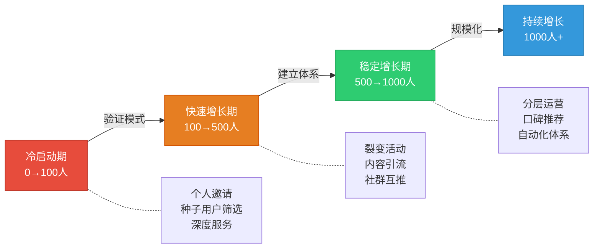
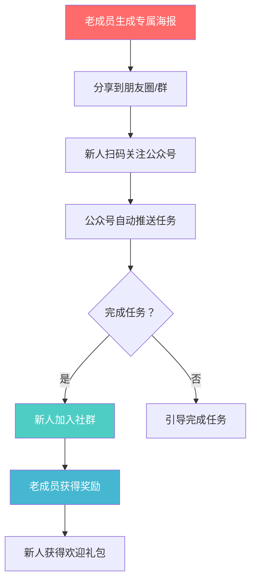
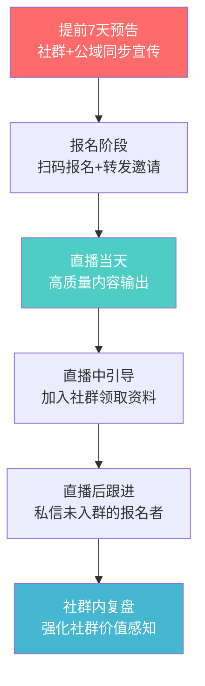

## 二、从0到1000人的社群增长策略

上一节你已经搭建好了私域流量池的基本框架——个人微信/企业微信、社群入口、内容阵地都已就位。但框架搭好不代表人会来。一个社群从0人增长到1000人，绝不是"多拉几个人进群"这么简单，它需要一套完整的增长策略，并且在不同阶段采用完全不同的打法。

本节将增长过程拆解为三个阶段，每个阶段都有明确的目标、方法、节奏和验证指标：

| 阶段 | 人数区间 | 核心任务 | 关键词 | 预计周期 |
|------|---------|---------|--------|---------|
| 冷启动期 | 0→100人 | 验证定位、打磨价值、积累种子 | 邀请、筛选、深度服务 | 2-4周 |
| 快速增长期 | 100→500人 | 建立裂变机制、内容引流 | 裂变、内容、活动 | 1-3个月 |
| 稳定增长期 | 500→1000人 | 分层运营、口碑驱动、体系化 | 分层、口碑、系统 | 2-4个月 |



> **核心原则：** 每个阶段的目标不是"快"，而是"对"。冷启动期不要急着做裂变，快速增长期不要急着变现，稳定增长期不要急着扩规模。跳过任何一个阶段的积累，后面都要加倍偿还。

---

### 2.1 冷启动期：从0到100人——种子用户的获取与筛选

冷启动是整个增长过程中最难的阶段，也是最不能跳过的阶段。这100个人的质量，直接决定了社群未来的天花板。

#### 2.1.1 为什么冷启动必须从"邀请"开始

很多人建群的第一反应是"发朋友圈让别人扫码进群"，这是典型的错误。原因有三：

**第一，没有筛选机制。** 扫码进群的人动机各异——有人是真感兴趣，有人是碍于面子，有人纯粹路过。这样混杂的用户群体，既无法形成有效的互动氛围，也无法为你提供有价值的反馈。

**第二，缺少"被邀请"的价值感。** 人对"被邀请加入"和"自己扫码加入"的心理感受完全不同。被邀请意味着"你被选中了"，自带一种归属感和责任感；扫码加入则像是逛超市，随时可以走。

**第三，无法验证定位。** 如果你主动邀请10个人，他们加入后的真实反应（活跃度、提问质量、续费意愿）就是你定位是否准确的最直接反馈。扫码进来的人给不了你这种反馈。

#### 2.1.2 种子用户的四个来源

**来源一：你的现有社交圈（目标：30-50人）**

从你已有的人脉中筛选。这里的关键词是"筛选"，不是"全部拉进来"。筛选标准：

- 对你的社群主题有真实需求或兴趣
- 有一定的表达欲望（潜水党不适合做种子用户）
- 愿意给你真实反馈（不是只会说"挺好的"）
- 在某个圈层有一定影响力（能带来更多人）

具体操作：翻遍你的微信通讯录、手机通讯录、各平台私信，列出一份100-200人的候选名单。然后用以下话术逐一邀请：

> "我在做一个关于[主题]的社群，目前还在内测阶段，只邀请了少量朋友。你在这方面有[具体经验/需求]，想邀请你进来一起交流，也帮我提提意见。"

这段话术的关键要素：说明社群在内测（稀缺性）、说明为什么邀请他（个性化）、请他帮忙提意见（降低心理门槛）。

**来源二：你的公域平台粉丝（目标：20-30人）**

如果你在公众号、小红书、抖音、知乎等平台有内容输出，从评论区、私信、粉丝群中筛选最活跃的粉丝。这些人的共同点是：已经通过你的内容对你建立了一定信任。

操作方法：在内容末尾或评论区回复中加入引导：

> "我在做一个[主题]的深度交流群，名额有限，感兴趣的朋友可以私信我。"

注意：不是直接放群二维码，而是"私信我"。这样你可以在私信中进一步了解对方，做筛选。

**来源三：行业社群和兴趣社区（目标：10-20人）**

在相关的微信群、QQ群、豆瓣小组、知乎圈子、即刻、知识星球等社区中，通过持续输出高质量内容（回答问题、分享见解）来吸引目标用户。不要硬广，不要群发，而是通过你的专业度让人主动加你。

操作要点：
- 每天花30分钟在目标社区回答3-5个问题
- 回答要详细、专业、有独特观点
- 不要主动推销，等别人来问
- 加好友后先聊天建立关系，再邀请入群

**来源四：线下活动和面对面交流（目标：10-20人）**

线下认识的人，线上信任度天然高。参加行业沙龙、分享会、读书会、兴趣班等活动，认识志同道合的人，加微信后邀请入群。

如果条件允许，自己组织一场小型线下活动（5-10人），主题与你的社群方向一致。参加活动的人几乎100%会加入你的社群。

#### 2.1.3 种子用户的邀请节奏

不要一天拉满100人。理想的节奏是：

| 时间 | 动作 | 人数 | 目的 |
|------|------|------|------|
| 第1-3天 | 邀请核心圈（最亲密的朋友/合作伙伴） | 10-15人 | 建立初始氛围，测试群规和互动机制 |
| 第4-7天 | 邀请扩展圈（行业同行、粉丝） | 20-30人 | 观察不同背景的人对社群内容的反应 |
| 第2周 | 邀请外部圈（社区认识的人、线下朋友） | 30-40人 | 验证社群价值是否对"弱关系"同样有效 |
| 第3-4周 | 补充邀请（根据前两周反馈优化后再邀请） | 20-30人 | 优化后的精准邀请，补充活跃度 |

> **为什么不能一次性拉满？** 社群氛围需要"养"。10个人的群聊得热火朝天，和100个人的群鸦雀无声，前者给新人的体验远好于后者。先让核心用户形成互动习惯，再逐步加入新人，新人会被老成员的活跃氛围"带"起来。

#### 2.1.4 冷启动期的核心任务：打磨"价值闭环"

在0-100人阶段，你的核心任务不是增长，而是验证和打磨。具体来说：

**任务一：验证社群定位**

通过种子用户的真实反馈，确认你的社群定位是否准确。你需要观察：

- 用户最常讨论的话题是什么？（可能和你预想的不同）
- 用户提出的问题指向什么需求？
- 用户在哪些话题上互动最积极？
- 用户觉得"这个群和其他群不一样的地方"是什么？

如果超过60%的互动集中在你预期之外的方向，说明你的定位需要调整。这时候调整成本最低——只有100个人，调整方向几乎零损失。

**任务二：打磨核心价值**

你需要在冷启动期找到你的"价值锚点"——用户加入这个群能获得的最核心、最独特的价值。它可能是：

- 每天一篇高质量行业分析（内容价值）
- 每周一次专家连线答疑（资源价值）
- 群成员之间的资源对接（人脉价值）
- 独家的行业数据和信息（信息价值）

这个价值锚点必须在冷启动期打磨成熟，因为后面的增长全靠它——人们是因为这个价值而来，也是因为这个价值而留。

**任务三：建立互动习惯**

种子用户之间的互动习惯，决定了社群未来长期的氛围基调。你需要设计：

- 每日话题（早上问好+每日一问，晚上总结+话题讨论）
- 固定栏目（周一行业资讯、周三案例拆解、周五轻松闲聊）
- 互动规则（鼓励发言、及时回应、引导讨论方向）

冷启动期的群主必须"身先士卒"——每天至少花1-2小时在群里互动、回复、引导。这个阶段你就是社群的灵魂，你的活跃度直接决定群的活跃度。

#### 2.1.5 冷启动期的验证指标

当以下指标达标时，说明冷启动成功，可以进入快速增长期：

| 指标 | 达标线 | 说明 |
|------|--------|------|
| 日活跃率 | ≥30% | 每天至少有30%的成员发言或互动 |
| 周留存率 | ≥85% | 每周新加入的成员，一周后仍有85%留在群里 |
| 内容互动率 | ≥20% | 你发出的内容，至少20%的成员有回应（点赞/评论/转发） |
| NPS（净推荐值） | ≥40 | 随机问10个成员"你愿意把朋友拉进来吗"，至少4人明确表示愿意 |
| 核心价值识别率 | ≥70% | 随机问成员"这个群对你最大的价值是什么"，70%以上的回答与你设定的价值锚点一致 |

如果这些指标不达标，不要急着进入下一阶段。回去找原因：是定位问题、内容问题、互动问题还是人群质量问题。在100人阶段修正，比在1000人阶段修正容易10倍。

---

### 2.2 快速增长期：从100到500人——裂变、内容与活动三管齐下

当冷启动期的验证指标全部达标，你已经拥有一个50-100人的高质量社群，成员活跃、价值认同、互动频繁。这时候，增长的"发动机"可以启动了。

#### 2.2.1 裂变增长：让老成员带新成员

裂变是社群增长最核心的引擎，但也是最容易做砸的环节。做砸的原因通常是：只设计了"拉人的激励"，没有设计"被拉者的体验"。

**裂变的核心公式：**

```text
裂变效果 = 分享动力 × 转化效率 × 留存能力
```

- 分享动力：老成员为什么要帮你拉人？
- 转化效率：被拉的人为什么会进群？
- 留存能力：进来的人为什么会长期留下？

三个环节缺一不可。很多社群的裂变活动只做了第一个环节（给老成员奖励），结果拉来一堆薅羊毛的人，进群就死。

**裂变模式一：任务宝裂变（适合知识型社群）**

机制：老成员分享专属海报到朋友圈或微信群，每邀请1位新成员完成指定任务，老成员获得奖励。

具体流程：



任务设计要点：
- 任务门槛要低（转发海报、填写问卷、回答一个简单问题）
- 任务要与社群主题相关（筛选精准用户）
- 奖励要有吸引力但不昂贵（独家资料、限时权益、社群积分）

奖励阶梯设计示例：

| 邀请人数 | 奖励内容 | 成本 |
|---------|---------|------|
| 1人 | 社群积分100分 | 0元 |
| 3人 | 独家电子书/资料包 | 0元（你已有的内容） |
| 5人 | 免费参加一次付费活动 | 0元（名额限制） |
| 10人 | 一个月会员免费 | 价值成本 |
| 20人 | 全年会员免费 + 专属称号 | 价值成本 |

**裂变模式二：拼团裂变（适合付费社群）**

机制：2-3人拼团可享受折扣价加入社群。一个人付原价，找人拼团则双方都能享受优惠。

操作要点：
- 拼团价格通常是原价的5-7折
- 拼团限时24-48小时（制造紧迫感）
- 拼团成功后双方都获得额外福利（比如入群后的专属欢迎）

这种模式的优势在于：每个付费用户自带拉新动力，而且拉来的人也是付费用户，质量远高于免费裂变。

**裂变模式三：内容裂变（适合所有类型社群）**

机制：产出高质量内容，内容本身成为裂变载体。

这是最健康、最持久的裂变方式，但也是最慢的。具体做法：

- 写一篇深度文章，末尾引导"加入社群获取完整版"
- 做一场直播分享，直播间引导"加入社群获取回放和资料"
- 录一期播客/视频，内容中提到社群中的真实故事和价值
- 整理一份行业报告，标注"数据来自XX社群成员调研"

内容裂变的关键：内容本身必须足够好，好到别人愿意主动转发。不是在内容中硬塞广告，而是内容本身就是广告。

**裂变模式四：口碑裂变（最高级的裂变）**

当社群价值足够高，老成员会自发推荐朋友加入。你不需要设计复杂的机制，只需要：

- 提供超出预期的价值（让成员觉得"这钱花得太值了"）
- 创造可分享的时刻（比如社群成员获得了某个成就、对接了某个资源）
- 适时提醒（在成员获得价值后，温和地提示"如果有朋友也感兴趣，欢迎推荐"）

口碑裂变的效果最持久、质量最高，但需要时间积累，不能急于求成。

#### 2.2.2 内容引流：用内容吸引精准用户

内容引流是除了裂变之外最重要的增长方式。核心逻辑：在公域平台持续输出与社群主题相关的高质量内容，吸引目标用户关注，再引导他们进入私域。

**内容引流的四个关键环节：**

**环节一：选择主阵地**

不要同时在5个平台运营，选1-2个作为主阵地。选择依据：

| 平台 | 适合的内容类型 | 适合的目标人群 | 引流难度 |
|------|--------------|--------------|---------|
| 公众号 | 深度长文、行业分析 | 职场人、行业从业者 | 中 |
| 小红书 | 图文笔记、经验分享 | 女性用户、生活方式 | 低 |
| 抖音 | 短视频、口播 | 泛人群、娱乐向 | 中高 |
| 视频号 | 短视频+直播 | 微信生态用户 | 低（与私域天然打通） |
| 知乎 | 长文回答、专业分析 | 知识型用户、高学历 | 中 |
| B站 | 中长视频、教程 | 年轻人、兴趣圈 | 中高 |

对于社群引流，**视频号+公众号**的组合是微信生态内的最佳选择。视频号负责曝光和引流，公众号负责内容沉淀和深度转化，两者都与微信社群无缝衔接。

**环节二：设计内容矩阵**

不要只发一种类型的内容。一个有效的内容矩阵包括：

| 内容类型 | 占比 | 目的 | 示例 |
|---------|------|------|------|
| 干货型 | 40% | 建立专业度、吸引精准用户 | 行业分析、方法论、工具教程 |
| 故事型 | 25% | 建立情感连接、提高传播率 | 个人经历、社群成员故事、踩坑记录 |
| 互动型 | 20% | 提高参与度、增强用户粘性 | 投票、问答、挑战赛 |
| 转化型 | 15% | 直接引导入群 | 社群介绍、活动预告、限时福利 |

**环节三：设计引流钩子**

每篇内容都需要一个"钩子"，引导读者进入你的私域。钩子的设计原则：

- **必须与内容相关：** 你写的是一篇关于时间管理的文章，钩子应该是"加入社群获取时间管理模板"，而不是"加入社群学习副业赚钱"
- **必须有具体价值：** "加入社群获取更多干货"是废话，"加入社群获取我花了3个月整理的50个效率工具清单"才是有效钩子
- **必须有紧迫感：** "限时免费""仅限前100人""本周截止"

常用的引流钩子：

- "关注公众号，回复'XX'获取完整资料"
- "加入社群，获取今天的分享PPT和思维导图"
- "私信我，获取免费诊断名额（仅限本周10个）"
- "评论区留言'想学'，我私信你入群方式"

**环节四：建立内容日历**

内容引流不是"想发就发"，需要有节奏地持续输出。一个参考内容日历：

| 星期 | 内容形式 | 主题方向 | 发布时间 |
|------|---------|---------|---------|
| 周一 | 图文/笔记 | 本周行业动态速览 | 早8:00 |
| 周二 | 短视频/口播 | 一个实用技巧/工具 | 午12:00 |
| 周三 | 深度长文 | 行业分析/方法论 | 晚20:00 |
| 周四 | 互动帖 | 投票/问答/讨论 | 午12:00 |
| 周五 | 故事型 | 案例/经历/踩坑 | 晚20:00 |
| 周六 | 社群精彩内容摘录 | 展示社群价值 | 午12:00 |
| 周日 | 休息/备稿 | — | — |

关键是**持续性**。每周发7篇不如每周发3篇但坚持发52周。算法和用户都奖励持续输出的人。

#### 2.2.3 活动引流：用活动制造增长爆发点

活动是短期内集中获取大量新用户的最佳方式。但活动不等于"打折促销"，一个好的社群活动应该同时实现三个目标：拉新、促活、转化。

**活动类型一：线上直播分享**

这是最常用的社群引流活动。流程设计：



关键数据：一场好的直播分享，报名人数通常是社群现有人数的2-5倍，实际到场率30-50%，入群转化率20-40%。也就是说，一个200人的社群，一场活动可以带来30-80个新成员。

**活动类型二：社群开放日**

每月选1天，将社群的日常内容对非成员开放。让潜在用户"先体验再决定"。

操作方式：
- 当天在社群内的精彩讨论、分享对非成员可见（通过截图、转播等方式）
- 设置专门的"新人体验"话题讨论
- 活动结束后提供限时加入优惠

**活动类型三：联合活动**

与互补社群或KOL联合举办活动，互相引流。

选择联合对象的原则：
- 用户画像高度重叠但内容不竞争（比如做理财的和做保险的）
- 对方社群规模与你相当或略大（差距太大无法对等合作）
- 对方的内容质量和口碑与你匹配（避免拉低你的品牌形象）

联合形式可以是：联合直播、互相推荐、联合出品资料包、联合举办挑战赛。

#### 2.2.4 快速增长期的风险控制

增长越快，风险越大。快速增长期需要警惕以下问题：

**风险一：质量稀释**

大量新用户涌入后，社群的平均互动质量会下降。新成员不熟悉群文化，可能发广告、问低质量问题、破坏讨论氛围。

应对措施：
- 设置入群门槛（自我介绍、回答问题、签署群规）
- 设置观察期（新成员7天内只能在指定区域发言）
- 安排老成员做"新人引导员"（一对一帮助新成员融入）
- 对违反群规的行为零容忍（发现即警告，再犯即移除）

**风险二：管理精力不足**

当社群超过200人，一个人管理会非常吃力。消息太多回复不过来，活动策划跟不上，纠纷处理不及时。

应对措施：
- 在100-200人时就开始培养管理员团队（3-5人）
- 制定SOP（标准操作流程），让管理动作可复制
- 引入社群管理工具（自动欢迎语、关键词回复、数据统计）
- 合理分工：内容输出、活动策划、日常管理、新人引导分别由不同人负责

**风险三：变现焦虑**

看到社群人数增长，很多人的第一反应是"赶紧变现"。在社群价值没有充分沉淀时急于变现，会导致大量用户流失。

应对建议：快速增长期的变现比例不要超过10%。也就是说，社群的主要精力（90%）应该放在提供价值和维护氛围上，只有10%用于商业化。

#### 2.2.5 快速增长期的阶段目标

| 指标 | 100→200人阶段 | 200→350人阶段 | 350→500人阶段 |
|------|-------------|-------------|-------------|
| 月增长率 | ≥30% | ≥25% | ≥20% |
| 日活跃率 | ≥25% | ≥20% | ≥18% |
| 月留存率 | ≥80% | ≥75% | ≥70% |
| 裂变系数 | ≥0.3 | ≥0.5 | ≥0.7 |
| 内容发布频率 | 每日1条 | 每日1-2条 | 每日2条 |
| 管理团队 | 1-2人 | 2-3人 | 3-5人 |

注意：随着人数增长，活跃率和留存率的绝对值会下降，这是正常的。关键看绝对活跃人数和裂变系数是否持续增长。

---

### 2.3 稳定期：从500到1000人——分层运营与口碑驱动

当社群达到500人，你面临一个全新的挑战：500个人的需求、活跃度、付费意愿差异巨大。用同一种方式服务所有人，结果是谁都服务不好。这个阶段的核心策略是**分层运营**。

#### 2.3.1 用户分层模型

将社群成员按"活跃度×付费意愿"分为四层：

```text
                    高活跃
                      |
         ┌────────────┼────────────┐
         │   明星用户   │   核心用户   │
         │  高活跃+低付费 │ 高活跃+高付费 │
         │  （培养转化）  │  （重点维护）  │
低付费 ──┼────────────┼────────────┼── 高付费
         │   沉默用户   │   消费用户   │
         │  低活跃+低付费 │ 低活跃+高付费 │
         │  （激活或淘汰）│ （提供便利）  │
         └────────────┼────────────┘
                      |
                    低活跃
```

**核心用户（高活跃+高付费，约占10-15%）：** 这是社群的"支柱"。他们既是社群氛围的贡献者，也是收入的主要来源。对他们的策略是：重点维护、超预期服务、赋予荣誉感（管理员、嘉宾、合伙人身份）。

**明星用户（高活跃+低付费，约占20-25%）：** 他们是社群的"气氛组"，贡献了大量的互动和内容。对他们的策略是：持续提供价值、引导付费转化、给予权威感（标注、称号、优先权）。

**消费用户（低活跃+高付费，约占10-15%）：** 他们付费但不怎么说话，可能只是潜水看内容。对他们的策略是：提供便捷的信息获取方式（精华整理、定期总结）、不强迫互动、在关键节点推送价值信息。

**沉默用户（低活跃+低付费，约占50-60%）：** 这是最大的群体，也是最需要关注的群体。他们中的一部分可以通过激活变成明星或消费用户，另一部分可能需要被淘汰。对他们的策略是：定期激活（私信关怀、问卷调查）、分析沉默原因、对持续沉默且无价值贡献的成员进行清理。

#### 2.3.2 分层运营的具体方法

**为核心用户建立"核心圈子"**

从500人的大群中，筛选50-80名核心用户，建立一个更小的"核心圈子"。这个圈子的价值：

- 更高质量的信息和资源（先在核心圈子发布，再同步到大群）
- 更频繁的互动（每周至少一次核心圈子专属活动）
- 更强的归属感（圈子内的人互相认识，形成强关系网络）
- 更多的参与权（新功能/新活动先在核心圈子测试）

核心圈子的筛选标准：
- 加入社群超过3个月
- 每月至少参与4次互动
- 有过付费行为或明确的付费意愿
- 在社群中有一定的影响力和号召力

**为不同层级设计差异化内容**

| 内容类型 | 全员（500人） | 核心圈子（50-80人） |
|---------|------------|-----------------|
| 日常内容 | 行业资讯、精选话题 | 深度分析、内部数据 |
| 互动活动 | 每周1次群聊讨论 | 每周1次专属讨论+1次嘉宾连线 |
| 资源分享 | 公开资料包 | 独家资源、优先获取 |
| 学习机会 | 免费公开课 | 小班制深度学习 |
| 商业机会 | 广告位、推荐位 | 优先合作权、联合出品 |

**为沉默用户设计激活方案**

针对沉默用户，设计一系列"低门槛激活"动作：

- **每周精华推送：** 将社群一周的精华内容整理成文档，私信发送给沉默用户。附上一句："这是本周社群精华，觉得不错的话欢迎来群里聊聊。"
- **月度问卷：** 每月做一次简短问卷（3-5题），了解沉默用户的需求和不满。问卷完成率可以作为活跃度的间接指标。
- **定向邀请：** 针对沉默用户的背景和需求，定向邀请他们参加可能感兴趣的活动。"看到你是做XX的，这周我们恰好有一个关于XX的分享，想邀请你来听听。"
- **定期清理：** 对连续3个月无任何互动（包括打开消息、点击链接等被动行为）的成员，进行温和清理。先私信提醒，确认对方是否还想留在群里，无回应则移除。

#### 2.3.3 口碑驱动增长

500人以后，口碑成为最重要的增长引擎。因为此时社群已经有了一定的规模和口碑基础，新成员的加入更多是"听说了这个群很好"而不是"看到广告"。

**口碑增长的三个关键动作：**

**动作一：打造"可传播的记忆点"**

让社群拥有独特的标签和记忆点，便于成员向朋友描述。比如：
- "XX社群，每天早上8点有一篇行业分析，雷打不动"
- "XX社群，上次帮我对接了一个大客户"
- "XX社群，里面的人都特别热心，问什么都有人回答"

这些记忆点不是你设计的口号，而是成员真实的体验。你需要做的是发现这些体验，然后强化它。

**动作二：创造"推荐时刻"**

在成员获得价值的瞬间，温和地引导他们推荐。具体时机：
- 成员通过社群对接了资源 → "太好了！如果有朋友也需要这方面的资源，欢迎推荐他们加入"
- 成员在社群中获得了问题解答 → "很高兴能帮到你！如果身边有朋友也有类似困惑，欢迎拉他们进来交流"
- 成员完成了一次付费学习 → "恭喜你完成学习！如果效果不错，可以推荐给朋友，推荐成功你还有返现"

**动作三：建立推荐奖励体系**

设计一套长期有效的推荐奖励机制：

| 推荐结果 | 推荐人奖励 | 被推荐人福利 |
|---------|----------|------------|
| 被推荐人加入社群 | 积分50分 | 新人礼包（资料包） |
| 被推荐人完成首次互动 | 积分100分 | 首次互动奖励 |
| 被推荐人付费成为会员 | 现金返现10-20% 或 会员延期1个月 | 新人优惠价 |

#### 2.3.4 体系化运营：从"人治"到"系统"

500人以上的社群，不能靠群主一个人"盯"着运营。你需要建立一套系统化的运营体系。

**体系一：SOP（标准操作流程）文档化**

将所有运营动作写成SOP文档，任何人拿到文档都能执行。需要文档化的流程包括：

- 新成员入群流程（欢迎语→自我介绍→引导→观察期）
- 日常内容发布流程（选题→创作→审核→发布→互动回复）
- 活动策划执行流程（策划→宣传→报名→执行→复盘）
- 用户投诉处理流程（接收→分类→处理→反馈→归档）
- 社群清理流程（识别→私信→确认→执行→记录）

**体系二：管理团队分工**

| 角色 | 人数 | 核心职责 | 每日时间投入 |
|------|------|---------|------------|
| 社群主理人 | 1人 | 战略方向、内容把关、重大决策 | 1-2小时 |
| 内容运营 | 1-2人 | 内容创作、资料整理、知识管理 | 2-3小时 |
| 活动运营 | 1人 | 活动策划、执行、复盘 | 1-2小时 |
| 社群管家 | 1-2人 | 日常互动、新人引导、问题解答 | 2-3小时 |
| 数据分析 | 1人（可兼） | 数据收集、分析、报告 | 0.5-1小时 |

初期可以一人多角色，但随着社群规模扩大，需要逐步分化。管理员可以是志愿者（给予社群内特权和荣誉），也可以是付费兼职。

**体系三：数据看板**

建立一个简单的数据看板，每日/每周追踪关键指标：

```text
社群健康度看板
├── 增长指标
│   ├── 本周新增成员数
│   ├── 本周流失成员数
│   ├── 净增长率
│   └── 裂变系数
├── 活跃指标
│   ├── 日活跃率（发言人数/总人数）
│   ├── 日均消息数
│   ├── 人均发言次数
│   └── 活跃时段分布
├── 内容指标
│   ├── 内容发布数量
│   ├── 平均互动率
│   ├── 精华内容数量
│   └── 外部引流内容数据
└── 商业指标
    ├── 付费转化率
    ├── 客单价
    ├── 月收入
    └── LTV（用户终身价值）
```

#### 2.3.5 1000人社群的日常运营节奏

当社群达到1000人时，日常运营需要有固定的节奏。以下是一个参考框架：

| 时间 | 事项 | 负责人 | 时长 |
|------|------|--------|------|
| 每日 7:30 | 早安问候 + 今日话题/资讯 | 社群管家 | 15分钟 |
| 每日 9:00-12:00 | 回复成员问题、引导讨论 | 社群管家 | 分散处理 |
| 每日 12:00 | 午间快讯/午间话题 | 内容运营 | 10分钟 |
| 每日 14:00-18:00 | 回复成员问题、处理投诉 | 社群管家 | 分散处理 |
| 每日 20:00 | 晚间分享/讨论 | 主理人/嘉宾 | 30-60分钟 |
| 每日 22:00 | 今日精华总结 | 内容运营 | 15分钟 |
| 每周一 | 本周计划发布 + 行业周报 | 内容运营 | 30分钟 |
| 每周三 | 专题讨论/案例拆解 | 主理人 | 1小时 |
| 每周五 | 轻松话题/互动游戏 | 活动运营 | 30分钟 |
| 每周六 | 社群成员风采展示 | 内容运营 | 20分钟 |
| 每月1日 | 月度数据复盘 | 数据分析 | 1小时 |
| 每月15日 | 月度活动（直播/线下/联名） | 活动运营 | 2-4小时 |
| 每月最后一天 | 月度精华整理 + 下月预告 | 内容运营 | 2小时 |

---

### 2.4 增长过程中的关键决策点

在从0到1000人的过程中，有几个关键决策点会直接影响社群的成败。很多人在这些节点做出了错误选择，导致社群增长停滞甚至倒退。

#### 2.4.1 免费社群还是付费社群

这是第一个必须回答的问题。两种模式的对比：

| 维度 | 免费社群 | 付费社群 |
|------|---------|---------|
| 增长速度 | 快（无门槛） | 慢（有价格门槛） |
| 用户质量 | 参差不齐 | 相对较高 |
| 活跃度 | 通常较低 | 通常较高 |
| 变现方式 | 后端变现（广告、电商、付费产品） | 直接变现（会员费） |
| 运营难度 | 高（需要持续拉新弥补流失） | 中（付费用户自带粘性） |
| 适合阶段 | 冷启动期、引流期 | 价值验证后、稳定期 |

**推荐策略：免费社群做引流，付费社群做价值交付。**

具体来说，建立两个层级的社群：
- 免费群（开放加入）：日常分享、基础互动、活动预告。目的是让更多人接触你，建立初步信任。
- 付费群（会员制）：深度内容、专属资源、高频互动、核心圈子。目的是为真正有需求的用户提供高价值服务。

免费群是付费群的"漏斗"，用户在免费群中体验到价值后，自然会产生加入付费群的意愿。

#### 2.4.2 要不要设置入群门槛

答案是：**一定要，但门槛要"适度"。**

完全没有门槛的社群，进来的人毫无成本感，走掉也毫无成本感。但门槛太高（比如必须付费500元），又会把大量潜在用户挡在门外。

**适合不同阶段的入群门槛：**

| 阶段 | 门槛设计 | 目的 |
|------|---------|------|
| 冷启动期 | 手动邀请制（必须由你或老成员邀请） | 精准筛选，建立高质量种子 |
| 快速增长期 | 完成一个小任务（自我介绍、回答问题） | 筛选有诚意的用户，降低管理成本 |
| 稳定增长期 | 付费入群 + 邀请审核 | 保证用户质量，建立价值感 |

**自我介绍模板示例：**

> 入群前请填写以下信息：
> 1. 你的名字/昵称
> 2. 你的职业/行业
> 3. 你加入这个社群最想获得什么？
> 4. 你能为社群贡献什么？
> 5. 你是通过什么渠道知道这个社群的？

这个模板的巧妙之处在于：第3题帮助你了解用户需求，第4题让用户思考"我能贡献什么"（心理学上叫"承诺一致性"——做出承诺的人更容易践行），第5题帮你追踪引流渠道的效果。

#### 2.4.3 人数到了就要"裂变"吗

很多社群运营者陷入一个误区：认为社群增长=不断拉新。事实上，**在社群的"服务能力"没有跟上之前，盲目拉新是灾难。**

判断是否应该进入快速增长期的三个前提条件：

1. **核心价值已经被验证：** 超过70%的现有成员能清晰说出社群对他们的核心价值
2. **运营体系已经建立：** 有固定的内容发布节奏、互动机制、管理员团队
3. **留存率已经达标：** 月留存率≥75%，说明用户来了之后愿意留下

如果这三个条件没有满足，继续增长只会放大问题，而不是解决问题。

#### 2.4.4 要不要开多个群

当一个群接近500人（微信群的活跃上限），是否应该开第二个群？

**不推荐直接开多个同类群。** 原因：
- 管理精力翻倍
- 信息无法同步，两个群的内容质量会出现差异
- 用户不知道该加哪个群
- 社群的"密度"下降，互动氛围变差

**推荐的替代方案：**

- **主题分群：** 根据用户兴趣或需求，拆分为不同主题的子群。比如一个大的运营社群，拆分为"内容运营群""用户增长群""数据分析群"。每个子群有明确的主题，成员可以根据兴趣选择加入。
- **层级分群：** 建立免费群+付费群+核心圈的层级体系。不同层级的群提供不同深度的价值。
- **功能分群：** 设置不同功能的群。比如"主群"用于日常交流，"活动群"用于活动报名和讨论，"资源群"用于资料分享。用户按需加入。

---

### 2.5 增长陷阱：常见的错误增长方式

在追求增长的过程中，以下方式看似有效，实则有害：

#### 陷阱一：红包拉人

"进群发红包""拉人进群每人发XX元"——这种方式确实能快速拉来大量人，但拉来的全是薅羊毛的人。红包一停，人就散了。更严重的是，这些人会破坏社群氛围，赶走真正有价值的用户。

#### 陷阱二：互推换群

和其他群主互相拉人，看起来是双赢，实际上是双输。两个社群的用户画像不同，互相拉来的人大概率不是你的目标用户。结果是两个群的质量都被稀释了。

唯一例外：如果两个社群的用户画像高度重叠且内容互补（比如"Python开发者社群"和"数据分析师社群"），互推是有效的。但这种情况很少见。

#### 陷阱三：买粉/买群成员

在淘宝或灰色渠道购买群成员，是最愚蠢的增长方式。买来的人要么是僵尸号，要么是不相关的用户。他们不会互动，不会付费，只会拉低你的所有数据指标。而且平台检测到异常增长，可能会封禁你的账号。

#### 陷阱四：频繁刷屏拉人

在各种微信群里频繁发广告拉人，不仅效果差（转化率通常低于1%），而且会败坏你的口碑。你的广告出现在别人群里，本身就传递了一个信号："我的社群靠发广告拉人"，这会让有质量的用户远离你。

#### 陷阱五：只关注人数不关注质量

社群的价值不在于人数，在于"对的人"。一个100人的高质量社群（人人活跃、付费意愿强、互动频繁），其商业价值远高于一个1000人的低质量社群（大量潜水、不愿付费、氛围冷清）。

永远记住这个公式：

```text
社群价值 = 成员质量 × 互动深度 × 信任程度
```

人数只是"成员质量"这个变量的分母，不是分子。

---

### 2.6 增长加速器：借力打力的策略

除了自己做增长，还有一些"借力"的方式可以加速增长：

#### 2.6.1 KOL/KOC合作

找到与你社群主题相关的KOL（关键意见领袖）或KOC（关键意见消费者），通过合作让他们为你的社群背书。

合作形式：
- **内容合作：** 邀请KOL在社群内做一次专属分享，KOL在自己的渠道推广你的社群
- **背书合作：** KOL以"推荐人"身份推荐你的社群，你提供专属推荐链接和奖励
- **联名合作：** 与KOL联合出品内容/产品，共同推广

合作的关键：不要只看对方的粉丝数，要看对方粉丝与你目标用户的重合度。一个1万精准粉丝的KOC，比一个100万泛粉丝的KOL对你更有价值。

#### 2.6.2 平台活动借势

利用各平台的官方活动获取流量扶持：
- 抖音/小红书的话题挑战
- 微信视频号的官方活动
- 知乎的圆桌讨论
- 各平台的创作者扶持计划

在参与平台活动的内容中自然植入社群信息，借助平台的流量红利实现增长。

#### 2.6.3 SEO和搜索优化

优化你的社群相关内容在搜索引擎和平台内搜索的排名：
- 公众号文章标题包含目标关键词
- 小红书笔记的标题和标签优化
- 知乎回答选择高搜索量的问题
- 百度知道、贴吧等传统搜索渠道的内容布局

搜索流量的特点是：慢热但持久。一篇SEO优化好的文章，可以持续几年为你带来稳定的精准流量。

#### 2.6.4 社群矩阵

当你主社群的增长进入稳定期后，可以考虑建立社群矩阵——围绕主社群建立多个关联社群，形成矩阵效应：

```text
主社群（核心主题）
├── 子社群A（细分主题1）
├── 子社群B（细分主题2）
├── 子社群C（地域/人群细分）
└── 联盟社群（合作伙伴社群）
```

矩阵内的社群互相引流，每个社群既独立运营，又与主社群形成协同效应。

---

### 2.7 本节核心要点

1. **社群增长分为三个阶段：** 冷启动（0→100人）靠邀请和筛选，快速增长（100→500人）靠裂变和内容，稳定增长（500→1000人）靠分层运营和口碑。每个阶段的方法、节奏和目标完全不同。

2. **冷启动决定天花板：** 前100个种子用户的质量，直接决定社群未来的高度。不要急于扩张，先在小范围内验证定位、打磨价值、建立互动习惯。

3. **裂变的核心不是"给奖励"，而是"给价值"：** 有效的裂变需要同时解决分享动力、转化效率和留存能力三个问题。只靠红包和奖励拉来的人留不住。

4. **内容引流是最持久的增长方式：** 持续输出高质量内容，让内容本身成为获客渠道。内容引流的效果是复利式的——坚持半年以上，效果会指数级增长。

5. **500人以后必须分层运营：** 用同一种方式服务500个需求各异的人，结果是谁都服务不好。按活跃度和付费意愿分层，为不同层级提供差异化服务。

6. **体系化是规模化的前提：** 从"人治"到"系统"，建立SOP、管理团队、数据看板。没有体系的社群，500人就是天花板。

7. **人数不等于价值：** 永远把质量放在数量前面。一个100人但人人活跃、高度信任的社群，比一个1000人但大量潜水的社群更有价值。

8. **避免五种错误增长方式：** 红包拉人、互推换群、买粉买成员、刷屏拉人、只看人数不看质量。这些方式短期有效，长期有害。
