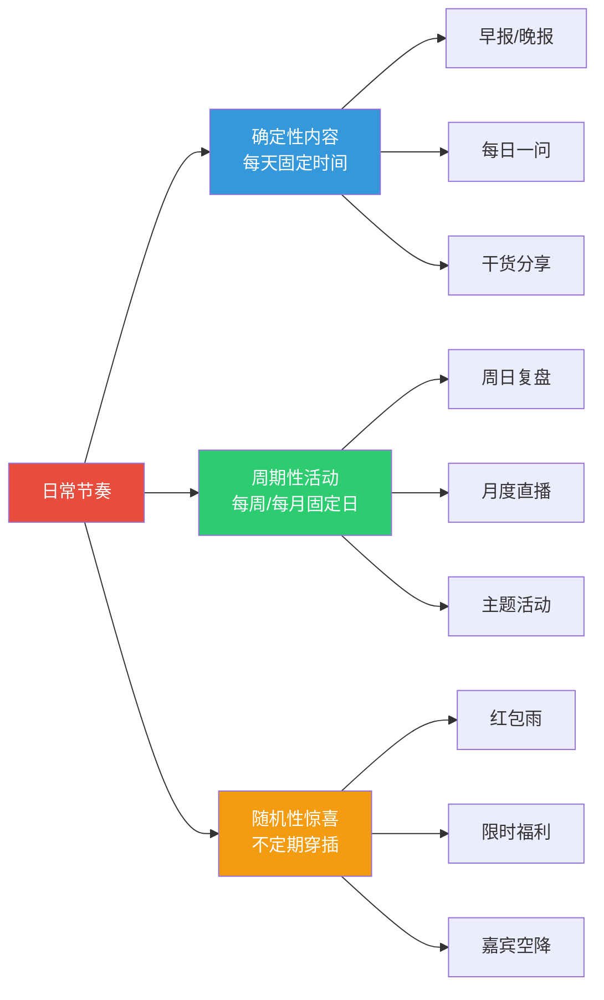
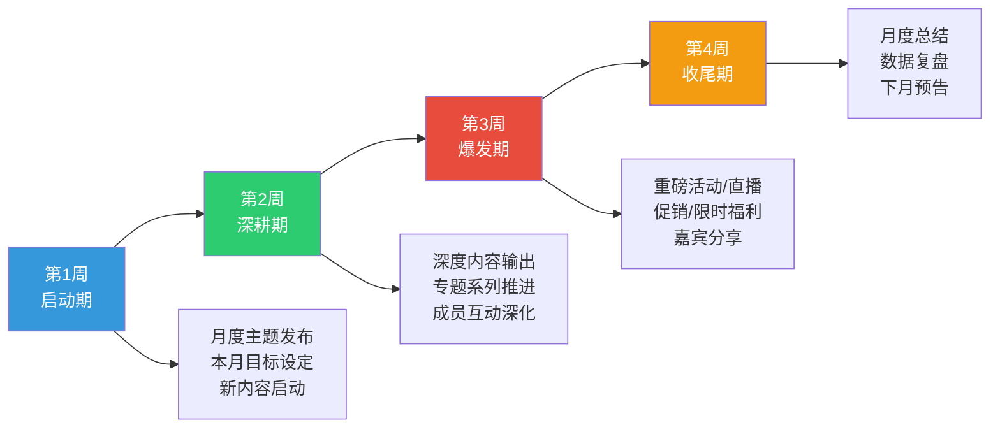
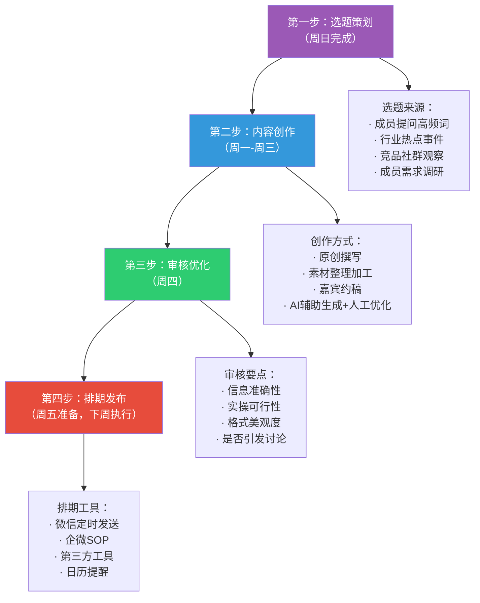
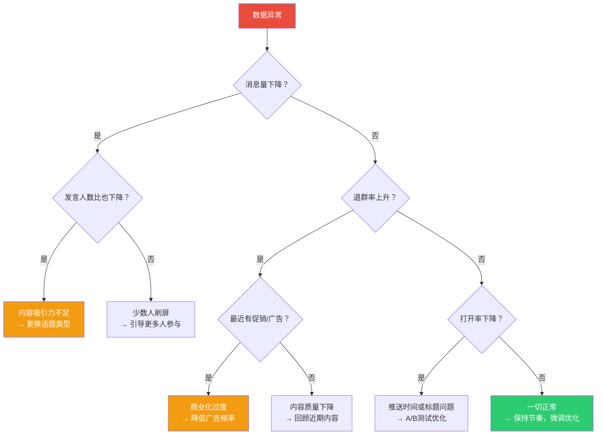
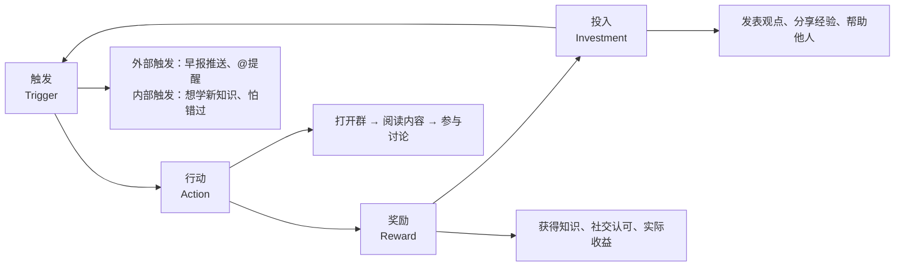

## 三、社群运营的日常节奏

### 1. 为什么社群需要"节奏感"

很多社群运营者遇到一个共同的困惑：群刚建起来时热热闹闹，一周后开始冷清，一个月后彻底沦为"广告群"或"僵尸群"。根本原因不是社群没有价值，而是**缺乏一套可持续运转的日常节奏**。

社群运营的本质是关系维护，而关系维护最怕的是"忽冷忽热"。你今天高强度互动三天，然后消失一周，用户的信任感会比从不互动更差。心理学中有一个"曝光效应"（Mere Exposure Effect）——人们对反复出现的事物会产生好感和信任。社群运营的日常节奏，就是把这个心理学原理变成一套可执行的系统。

**节奏感的三个核心作用：**

| 作用 | 机制 | 实际效果 |
|------|------|---------|
| **建立预期** | 用户知道什么时候能获得什么内容 | 主动在固定时间打开社群，形成习惯 |
| **降低疲劳** | 运营动作标准化，不需要每天"想创意" | 运营者可持续执行，不 burnout |
| **制造仪式感** | 固定栏目形成社群文化符号 | 增强归属感和社群认同 |

> **运营心法：** 好的社群节奏像心跳——有规律地"跳动"，偶尔来一次"加速"（活动、惊喜），但永远不会停。没有节奏的社群像心律不齐——表面看还活着，实际上随时可能猝死。



### 2. 日运营：一天之计在于"早"

日运营是社群节奏的基本单元。一个运营良好的社群，一天之中有明确的"高峰-低谷-高峰"波动，而不是24小时均匀发力。

#### 2.1 黄金时间表

微信社群的活跃时间呈现明显的双峰曲线。根据多个社群数据工具（WeTool、企微助手等）的统计：

| 时间段 | 活跃度 | 适合做什么 | 不适合做什么 |
|--------|--------|-----------|-------------|
| 7:00-8:30 | ★★★☆☆ | 早报推送、正能量语录、轻量内容 | 深度干货、推销 |
| 9:00-11:30 | ★★☆☆☆ | 话题讨论（碎片时间参与） | 需要集中注意力的活动 |
| 12:00-13:30 | ★★★★☆ | 午间互动、投票、轻量话题 | 长文分享（没时间看） |
| 14:00-17:00 | ★★☆☆☆ | 异步内容（文章、视频链接） | 实时互动 |
| 18:00-19:30 | ★★★☆☆ | 下班通勤内容、每日一问 | 复杂活动 |
| 20:00-22:00 | ★★★★★ | 深度分享、直播、答疑、活动 | 纯广告推送 |
| 22:00-23:00 | ★★★☆☆ | 晚间总结、明日预告 | 大量刷屏 |
| 23:00-7:00 | ★☆☆☆☆ | 定时消息（全自动） | 任何人工互动 |

> **关键原则：** 社群的"主力内容"放在晚间黄金时段（20:00-22:00），白天用轻量内容维持存在感。不要在用户最忙的时候打扰，也不要在用户最有空的时候沉默。

#### 2.2 一日运营SOP（标准流程）

以下是一套经过验证的社群日运营SOP，适用于大多数知识型、成长型社群：

**早晨动作（7:00-8:30）：唤醒**

```text
┌─────────────────────────────────────────────┐
│ 07:30 - 早安问候                             │
│   "大家早上好！今天是2026年6月25日，          │
│    星期四。今天分享一个关于XXX的小技巧..."      │
│                                              │
│ 内容模板：                                    │
│   ① 日期+星期+天气（增加亲切感）               │
│   ② 一句正能量/行业金句                       │
│   ③ 一个轻量知识点或行业资讯                    │
│   ④ 今日社群活动预告（如果有）                  │
│                                              │
│ 发送方式：手动发送或使用定时工具                 │
│ 预期效果：打开率 30-50%，回复率 5-15%           │
└─────────────────────────────────────────────┘
```

**午间动作（12:00-13:30）：互动**

```text
┌─────────────────────────────────────────────┐
│ 12:30 - 午间话题                             │
│   "午饭时间，问大家一个问题：                   │
│    你最近遇到最大的XXX问题是什么？"              │
│                                              │
│ 话题设计原则：                                 │
│   ① 门槛低——任何人30秒内可以回答               │
│   ② 有共鸣——大多数人有类似经历                  │
│   ③ 能延展——好的回答能引发更多讨论              │
│                                              │
│ 常用话题类型：                                 │
│   · 选择题："A还是B？为什么？"                  │
│   · 经验分享："你踩过最大的坑是什么？"           │
│   · 求助型："大家有没有推荐的XXX？"              │
│   · 投票型："你觉得哪个更好？"                   │
│                                              │
│ 预期效果：回复率 10-25%，讨论持续 30-60 分钟    │
└─────────────────────────────────────────────┘
```

**晚间动作（20:00-22:00）：价值输出**

```text
┌─────────────────────────────────────────────┐
│ 20:00 - 核心内容                             │
│   今天的"正餐"——深度干货、案例拆解、           │
│   专题分享、嘉宾答疑等                         │
│                                              │
│ 内容形式（轮换使用）：                         │
│   周一：行业资讯深度解读（图文）                │
│   周二：实操教程/方法论（图文+视频）            │
│   周三：案例拆解（图文+讨论）                   │
│   周四：互动答疑（Q&A）                        │
│   周五：本周精华汇总（图文）                    │
│   周六：轻松话题/娱乐内容（轻互动）             │
│   周日：下周预告+本周复盘（图文）               │
│                                              │
│ 21:30 - 互动引导                             │
│   "今天的内容你们觉得怎么样？                   │
│    有没有遇到类似的问题？"                      │
│                                              │
│ 22:00 - 晚安收尾                             │
│   "今天的分享就到这里，明天见！                  │
│    明天我们会分享XXX，敬请期待。"                │
│                                              │
│ 预期效果：阅读率 40-70%，互动率 15-30%          │
└─────────────────────────────────────────────┘
```

#### 2.3 不同类型社群的日常节奏差异

不同类型社群的日常节奏有显著差异。以下是四种常见社群类型的节奏对比：

| 维度 | 知识学习型 | 电商带货型 | 兴趣爱好型 | 行业资源型 |
|------|-----------|-----------|-----------|-----------|
| **早间内容** | 学习打卡/每日一词 | 新品预告/限时优惠 | 今日话题/心情分享 | 行业早报/政策解读 |
| **午间内容** | 碎片知识点 | 买家秀/使用心得 | 作品分享/晒图 | 资源对接/需求发布 |
| **晚间内容** | 干货分享/直播课 | 直播带货/秒杀 | 技术交流/作品点评 | 深度交流/案例讨论 |
| **日消息量** | 15-30条 | 30-60条 | 10-20条 | 10-15条 |
| **运营者参与度** | 高（需要输出内容） | 高（需要上架/讲解） | 中（引导讨论即可） | 低（搭平台，成员自治） |
| **自动化程度** | 中（内容可预制） | 高（上架/优惠自动） | 低（需要人工互动） | 低（需要人工匹配） |

### 3. 周运营：七天一个完整周期

日运营是"点"，周运营是"线"。一个好的周运营节奏，能让社群在七天内形成一个完整的价值交付循环。

#### 3.1 标准周运营日历

以下是一套通用的周运营框架，适用于大多数付费社群：

```mermaid
gantt
    title 社群一周运营节奏
    dateFormat HH:mm
    axisFormat %H:%M

    section 周一
    早报推送           :active, mon1, 07:30, 30min
    本周计划发布        :active, mon2, 12:00, 30min
    主题干货分享        :active, mon3, 20:00, 90min

    section 周二
    早报推送           :active, tue1, 07:30, 30min
    实操教程           :active, tue2, 20:00, 90min

    section 周三
    早报推送           :active, wed1, 07:30, 30min
    案例拆解           :active, wed2, 20:00, 90min

    section 周四
    早报推送           :active, thu1, 07:30, 30min
    互动答疑           :active, thu2, 20:00, 90min

    section 周五
    早报推送           :active, fri1, 07:30, 30min
    本周精华汇总        :active, fri2, 20:00, 90min

    section 周六
    轻松话题           :active, sat1, 10:00, 60min
    社交互动           :active, sat2, 20:00, 60min

    section 周日
    下周预告           :active, sun1, 10:00, 30min
    本周复盘           :active, sun2, 20:00, 60min
    红包/福利          :crit, sun3, 21:30, 30min
```



**周一：启航日**

周一是新一周的开始，核心任务是"设定预期"。用户需要知道这一周社群会给他们带来什么。

- **07:30 发布本周计划**：明确告知本周的内容主题、活动安排、嘉宾信息
- **20:00 第一弹干货**：本周最重要的一篇深度内容放在周一，给用户一个"留下来的理由"
- **互动设计**：发起"本周目标"打卡——"这周你想在XXX方面有什么突破？"

**周二-周四：价值交付日**

这三天是社群价值输出的核心时段。每天围绕一个主题进行深度分享。

- **周二：实操型内容**（教程、方法论、工具推荐）——"怎么做"
- **周三：案例型内容**（成功案例、失败教训、拆解分析）——"别人怎么做的"
- **周四：互动型内容**（答疑、讨论、互助）——"帮你解决具体问题"

> **节奏感的关键：** 三天的内容类型要有变化，避免每天都是"发长文"。人脑对单一刺激会快速适应（感觉适应），类型轮换能保持新鲜感。

**周五：总结日**

周五是"收割"的一周总结日。

- **精华汇总**：把本周3-4篇核心内容整理成一份精华摘要，方便错过的人补课
- **互动回顾**：挑选本周最有价值的3-5条成员讨论，给予认可和感谢
- **数据回顾**：向社群成员透明化本周运营数据（新增人数、活跃度、最受欢迎内容）

**周六：社交日**

周六降低"教学密度"，增加社交属性。

- **轻松话题**：与社群主题相关但不那么严肃的话题（"你最喜欢的XXX是什么？"）
- **成员展示**：邀请成员分享自己的成果、经验、作品
- **自由交流**：减少运营者主导，鼓励成员之间互动

**周日：充电日**

周日是承上启下的过渡日。

- **下周预告**：提前告知下周的内容安排和活动
- **本周复盘**：运营者做一个简单的复盘（可以公开，也可以内部）
- **福利发放**：周日晚上发一个小红包或专属福利，给一周画个"甜蜜的句号"

#### 3.2 周内容生产日历模板

以下是一个可直接使用的周内容规划模板：

| 星期 | 早间（7:30） | 午间（12:30） | 晚间（20:00） | 内容类型 | 负责人 |
|------|-------------|-------------|--------------|---------|-------|
| 一 | 本周计划+行业早报 | 话题讨论 | 深度干货 #1 | 知识输出 | 主运营 |
| 二 | 行业资讯 | 实操小技巧 | 实操教程 | 教程类 | 主运营 |
| 三 | 行业资讯 | 案例讨论 | 案例拆解 | 案例类 | 主运营/嘉宾 |
| 四 | 行业资讯 | 问题征集 | 答疑专场 | 互动类 | 主运营 |
| 五 | 行业资讯 | 精华回顾 | 本周总结 | 汇总类 | 助理运营 |
| 六 | 轻松话题 | 作品展示 | 社交互动 | 社交类 | 成员主导 |
| 日 | 下周预告 | 自由交流 | 复盘+红包 | 过渡类 | 主运营 |

### 4. 月运营：三十天的"大节奏"

月运营是社群节奏的"骨架"。如果说日运营是心跳，周运营是呼吸，那月运营就是生命周期的节律。

#### 4.1 月度运营框架

一个完整的月度运营周期包含四个阶段：



**第1周：启动期**

- 发布本月主题和计划
- 引入新的内容系列或活动
- 设定本月社群目标（如"本月读完一本书"、"本月学会XXX"）
- 发放月度福利/权益

**第2周：深耕期**

- 按计划输出深度内容
- 推进专题系列
- 1对1关注活跃度下降的成员
- 收集成员反馈和需求

**第3周：爆发期**

- 策划本月最大的活动（直播、嘉宾分享、限时优惠等）
- 推动社群裂变和拉新
- 高密度价值输出
- 重点转化——对有意向的成员进行精准跟进

**第4周：收尾期**

- 月度总结和数据复盘
- 表彰本月优秀成员
- 预告下月计划，制造期待
- 清理不活跃成员（可选）

#### 4.2 月度必做的五件事

| 事项 | 时间 | 具体内容 | 目的 |
|------|------|---------|------|
| **月度直播** | 第3周 | 60-90分钟深度直播，可带货/答疑 | 提升信任感，拉动转化 |
| **月度复盘** | 最后一天 | 公开分享本月数据、收获、改进计划 | 透明化运营，增强信任 |
| **成员回访** | 第2-3周 | 1对1私聊10-20位成员，了解需求 | 发现问题，预防流失 |
| **内容迭代** | 月初 | 根据上月数据调整内容方向 | 数据驱动优化 |
| **社群活动** | 第3周 | 一次主题活动（打卡挑战/评选/竞赛） | 提升活跃度和参与感 |

#### 4.3 季度与年度节奏

除了日/周/月节奏，社群运营还需要更长周期的规划：

**季度节奏（每3个月）：**

- 社群定位复盘——是否需要调整方向？
- 会员权益升级——增加新权益或调整价格
- 社群规模评估——是否需要开新群/分层运营？
- 竞品分析——同类社群有什么新玩法？

**年度节奏（每12个月）：**

- 年度大活动（周年庆、年度峰会）
- 年度会员续费/升级
- 社群品牌升级（视觉、口号、文化）
- 社群战略方向调整

### 5. 内容生产的"流水线"体系

日常节奏的核心是内容。如果内容生产跟不上，再好的节奏设计也是空谈。以下是经过验证的内容生产SOP。

#### 5.1 内容生产的四步流水线



#### 5.2 内容选题的五个来源

| 来源 | 方法 | 适用场景 |
|------|------|---------|
| **成员提问** | 整理群内高频问题，做成FAQ或专题 | 最精准，直接解决痛点 |
| **行业热点** | 追踪行业新闻、政策变化、平台更新 | 时效性强，容易引发讨论 |
| **竞品观察** | 加入10-20个同类社群，观察他们的内容 | 借鉴经验，避免重复 |
| **数据反馈** | 分析历史内容的阅读量、互动率、转化率 | 数据驱动，持续优化 |
| **个人经验** | 运营者自己的实践总结和思考 | 原创性强，建立IP |

#### 5.3 内容模板库

提前准备好常用的内容模板，可以大幅提高生产效率：

**模板一：干货分享模板**

```markdown
## 【今日干货】{主题}

### 一句话总结
{用一句话概括核心观点}

### 问题背景
{这个知识点解决什么问题？为什么重要？}

### 核心方法
1. {步骤一：具体操作}
2. {步骤二：具体操作}
3. {步骤三：具体操作}

### 实操案例
{真实场景举例，有数据支撑}

### 常见误区
× 错误做法：{描述}
✓ 正确做法：{描述}

### 今日行动
{给一个3分钟内可以完成的小任务}

---
觉得有用？回复"干货"告诉我，我继续分享更多！
```

**模板二：案例拆解模板**

```markdown
## 【案例拆解】{案例名称}

### 基本信息
- 主体：{谁？}
- 背景：{什么情况下？}
- 结果：{取得了什么成绩？}

### 做对了什么？
1. {关键动作1} → 为什么有效
2. {关键动作2} → 为什么有效

### 可以借鉴的三个点
1. {你马上能用的点}
2. {你稍加调整能用的点}
3. {需要一定基础才能用的点}

### 你可以这样做
{给出一个本周就能开始尝试的行动建议}
```

**模板三：互动话题模板**

```markdown
## 【今日话题】{问题}

{简短的背景说明，1-2句话}

我先说：
{运营者自己的回答，降低参与门槛}

等你们的答案！最佳回答送{奖励}
```

### 6. SOP自动化：让节奏"自转"

手动执行日常节奏，前两周可以坚持，一个月后大概率变形。必须借助工具和SOP实现半自动化甚至全自动化。

#### 6.1 可以自动化的运营动作

| 运营动作 | 自动化方式 | 推荐工具 | 自动化程度 |
|---------|-----------|---------|-----------|
| 早报推送 | 定时发送 | 企微SOP / 句子互动 | ★★★★★ |
| 欢迎语 | 新人入群自动触发 | 企微欢迎语 / WeTool | ★★★★★ |
| 群规提醒 | 定时发送 | 企微定时群发 | ★★★★★ |
| 内容推送 | 预制排期 | 第三方工具 | ★★★★☆ |
| 打卡提醒 | 定时触发 | 小程序/企微SOP | ★★★★☆ |
| 数据统计 | 自动采集 | 企微后台 / 第三方 | ★★★★☆ |
| 不活跃提醒 | 条件触发 | 企微标签+SOP | ★★★☆☆ |
| 话题讨论 | 需要人工引导 | 半自动（预制话题库） | ★★☆☆☆ |
| 答疑互动 | 必须人工 | 无法自动化 | ★☆☆☆☆ |
| 关系维护 | 必须人工 | 无法自动化 | ★☆☆☆☆ |

#### 6.2 SOP模板：新人入群7日体验流程

新人入群的前7天决定了他是否会长期留存。以下是一套经过验证的7日SOP：

| 时间 | 动作 | 内容 | 目的 |
|------|------|------|------|
| **入群即刻** | 自动欢迎语 | 群规+自我介绍模板+新人福利 | 第一印象，降低陌生感 |
| **第1天** | 私聊问候 | "欢迎加入！有什么问题随时找我" | 建立个人连接 |
| **第2天** | 引导互动 | "看到你是做XXX的，群里正好有相关讨论" | 降低参与门槛 |
| **第3天** | 推送价值内容 | 发送最受欢迎的历史精华内容 | 展示社群价值 |
| **第4天** | 邀请参与活动 | "明天有一个XXX活动，很适合你" | 增加参与感 |
| **第5天** | 鼓励发言 | 在群里@他，邀请回答一个话题 | 打破沉默 |
| **第6天** | 私聊反馈 | "加入这几天感觉怎么样？有什么建议？" | 收集反馈，预防流失 |
| **第7天** | 推送会员权益 | 详细介绍社群的完整权益和使用方法 | 推动付费转化 |

#### 6.3 SOP模板：沉默成员激活流程

当成员7天以上未发言时，启动激活流程：

```text
触发条件：成员连续7天无互动
    │
    ├── 第1步（第7天）：@提醒
    │   "好久不见 {名字}，最近在忙什么？"
    │   方式：群内@
    │
    ├── 第2步（第10天）：价值推送
    │   私聊发送近期最精华的3篇内容
    │   "这几篇你可能感兴趣，别错过"
    │   方式：私聊
    │
    ├── 第3步（第14天）：1对1沟通
    │   "想了解一下你对社群的感受和建议"
    │   方式：私聊语音/文字
    │
    └── 第4步（第21天）：决策
        ├── 有挽回价值 → 了解需求，定制内容
        └── 无挽回价值 → 标记为"沉默用户"，保留但不过度打扰
```

### 7. 节奏中的"变量"：活动与惊喜

固定节奏是"骨架"，但只有骨架的社群是"无聊"的。需要在规律中加入变量，制造惊喜和期待感。

#### 7.1 活动穿插的节奏设计

**月度活动节奏建议：**

| 周次 | 固定内容 | 活动/惊喜 | 频率 |
|------|---------|----------|------|
| 第1周 | 日常SOP | 月度主题发布 | 1次/月 |
| 第2周 | 日常SOP | 小型互动活动（投票/评选） | 1次/周 |
| 第3周 | 日常SOP | 重磅活动（直播/嘉宾/促销） | 1次/月 |
| 第4周 | 日常SOP | 月度总结+福利 | 1次/月 |

**随机惊喜的"剂量"控制：**

- 红包：每月2-3次，每次金额不大但频次够（"小额高频"比"大额低频"效果好）
- 突发福利：每月1-2次，限时限量，制造紧迫感
- 嘉宾空降：每季度1-2次，提前预告但不透露细节
- 成员故事：不定期分享优秀成员的故事，既是内容也是激励

#### 7.2 节日/热点的借势运营

| 类型 | 示例 | 运营动作 | 注意事项 |
|------|------|---------|---------|
| **传统节日** | 春节、中秋、端午 | 主题活动+节日祝福+限时优惠 | 提前1周准备 |
| **网络节日** | 双11、618、女神节 | 促销活动+社群专属价 | 提前2周预热 |
| **行业节点** | 行业大会、政策发布 | 深度解读+讨论 | 快速响应，24小时内 |
| **突发热点** | 社会事件、行业新闻 | 观点输出+讨论 | 谨慎表态，避免争议 |

### 8. 数据驱动：用指标校准节奏

日常节奏不能"凭感觉"调整，必须用数据说话。

#### 8.1 日运营核心指标

| 指标 | 计算方式 | 健康值 | 预警值 | 优化方向 |
|------|---------|--------|--------|---------|
| **日消息量** | 当日群内消息总数 | >50条/100人 | <20条/100人 | 增加互动话题 |
| **发言人数比** | 当日发言人数/总人数 | >30% | <15% | 降低参与门槛 |
| **内容打开率** | 点击内容链接人数/总人数 | >40% | <20% | 优化标题和推送时间 |
| **互动回复率** | 回复互动话题人数/总人数 | >15% | <5% | 话题设计优化 |
| **退群率** | 当日退群人数/总人数 | <0.5% | >2% | 排查原因，紧急干预 |

#### 8.2 节奏优化的决策树



#### 8.3 每周复盘清单

每周日晚上花30分钟完成以下复盘：

```text
□ 本周日消息量趋势（高峰/低谷各在什么时候？）
□ 本周最受欢迎的3条内容是什么？为什么？
□ 本周最冷清的时段是什么时候？为什么？
□ 新增成员数 vs 退群数（净增多少？）
□ 本周成员反馈/投诉/建议汇总
□ 下周需要调整的节奏点（具体到哪天、什么时间、做什么）
```

### 9. 常见的节奏误区

#### 误区一：消息越多越好

**表现：** 一天发20+条消息，早中晚不间断，恨不得24小时在线。

**问题：** 信息过载导致用户屏蔽群消息。微信群有一个"隐形阈值"——日消息量超过50条/100人时，屏蔽率显著上升。

**正确做法：** 精准投放，宁可少而精。一天3-5条高质量消息的效果远好于20条水消息。

#### 误区二：所有群用同一套节奏

**表现：** 5个群发同样的内容、同样的时间、同样的话术。

**问题：** 不同群的用户画像、活跃时间、需求偏好不同，"一刀切"会导致大部分群水土不服。

**正确做法：** 根据群的定位和数据，制定差异化的节奏。核心框架一致，但内容和时间做个性化调整。

#### 误区三：只输出不互动

**表现：** 每天定时发内容，但从不回复成员的讨论，不参与互动。

**问题：** 社群变成了"公众号"，没有互动感。用户会觉得"你在自说自话"。

**正确做法：** 输出和互动的时间比例建议为4:6。你发完一条内容后，至少花同等时间回复讨论、点赞评论、引导话题。

#### 误区四：完美主义导致无法持续

**表现：** 每篇内容都要打磨3天以上，追求完美导致断更。

**问题：** 节奏最重要的是"持续"，偶尔的平庸好过频繁的断更。

**正确做法：** 建立内容分级制度——S级内容（月度大活动）精雕细琢，A级内容（周度干货）认真准备，B级内容（日常互动）快速产出。80%的内容应该是B级。

#### 误区五：从不调整节奏

**表现：** 一套节奏用了半年不变，即使数据已经在下滑。

**问题：** 用户会审美疲劳，市场环境在变化，社群的生命阶段在演进。

**正确做法：** 每月做一次节奏回顾，每季度做一次大调整。根据数据反馈和成员需求，迭代优化。

### 10. 进阶：节奏设计的底层逻辑

#### 10.1 "上瘾模型"在社群节奏中的应用

尼尔·埃亚尔的"上瘾模型"（Hook Model）可以指导社群节奏设计：



**触发（Trigger）：** 你的日常推送就是外部触发。当用户开始"主动"打开群（内部触发），说明节奏设计成功了。

**行动（Action）：** 让参与变得简单。一句话就能回复的话题 > 需要写200字的讨论。

**奖励（Reward）：** 每次参与都要有"获得感"——知识、认可、关系、实际利益。

**投入（Reward）：** 让用户在社群中积累"沉没成本"——发表过的观点、获得的称号、建立的关系。

#### 10.2 不同生命阶段的节奏调整

| 社群阶段 | 时间 | 节奏特点 | 运营重心 |
|---------|------|---------|---------|
| **创建期**（0-100人） | 第1-2月 | 高频、高互动、个性化 | 建立信任，培养种子用户 |
| **成长期**（100-500人） | 第3-6月 | 稳定输出、开始标准化 | 扩大规模，建立SOP |
| **成熟期**（500-1000人） | 第6-12月 | 标准化、半自动化 | 深度变现，提升ARPU |
| **平台期**（1000+人） | 12月+ | 自动化为主、人工为辅 | 分层运营，防止衰退 |

#### 10.3 多群协同的节奏管理

当你运营多个社群时，需要一套"中央厨房"式的内容分发体系：

```text
内容生产（中央厨房）
    │
    ├── 核心群（VIP/付费）── 每日3-5条，含专属内容
    ├── 普通群（免费/低价）── 每日1-2条，通用内容
    ├── 地域群 ── 每周2-3条，本地化内容
    └── 主题群 ── 每周3-4条，垂直内容

发布节奏：
    · 通用内容统一时间发（8:00 / 12:30 / 20:00）
    · 专属内容错峰发（VIP群提前1小时获取）
    · 地域群考虑时区差异
```

### 11. 本节核心要点

| 要点 | 说明 |
|------|------|
| **节奏 > 强度** | 持续稳定的输出比偶尔的爆发更重要 |
| **黄金时段** | 晚间20:00-22:00是社群互动的绝对高峰 |
| **日/周/月三层嵌套** | 日运营是点，周运营是线，月运营是面 |
| **内容生产流水线** | 选题→创作→审核→排期，周而复始 |
| **自动化是关键** | 能自动化的运营动作绝不手动 |
| **数据驱动迭代** | 每周复盘，每月调整，每季度大改 |
| **节奏需要"变量"** | 固定节奏+随机惊喜，才能保持新鲜感 |
| **不同阶段不同节奏** | 创建期高频亲密，成熟期标准自动化 |
